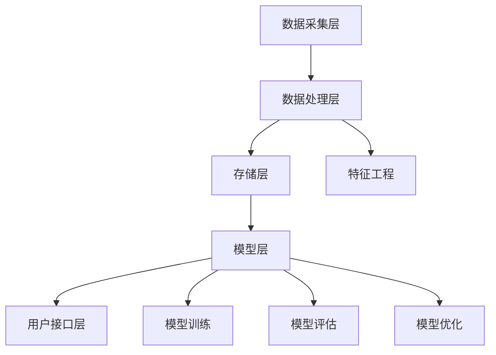

                 

关键词：知识发现引擎、实时推荐系统、数据挖掘、算法优化、机器学习、大数据、系统架构、性能提升

> 摘要：本文深入探讨知识发现引擎的实时推荐系统实现，分析其核心概念、算法原理、数学模型及实际应用。通过详细的项目实践和代码实例，本文旨在为开发者提供一套完整的技术实现指南，助力构建高效的实时推荐系统。

## 1. 背景介绍

在当今的信息时代，数据量的爆炸性增长带来了前所未有的挑战和机遇。大数据技术的迅猛发展为各类应用场景提供了强有力的支持，特别是在个性化推荐、智能搜索、金融风控等领域。其中，实时推荐系统作为知识发现引擎的重要组成部分，正逐步成为企业竞争的核心力量。

实时推荐系统的目标是根据用户的实时行为和历史数据，为用户推荐最相关、最感兴趣的物品或内容。随着互联网和物联网技术的普及，实时推荐系统已广泛应用于电子商务、社交媒体、新闻资讯、在线教育等多个领域。这些系统需要处理海量数据，并在毫秒级内生成高质量的推荐结果，这对系统的设计、算法优化和性能提升提出了极高的要求。

本文将围绕实时推荐系统的实现展开讨论，首先介绍相关核心概念，然后详细阐述算法原理和数学模型，最后通过项目实践和代码实例进行深入分析。希望通过本文的探讨，能够为开发者提供有价值的参考和指导。

## 2. 核心概念与联系

### 2.1 知识发现引擎

知识发现引擎（Knowledge Discovery Engine，KDE）是一种基于大数据分析和机器学习技术的系统，用于从大量数据中自动发现知识、模式和规律。知识发现引擎的核心任务包括数据预处理、特征工程、模式识别和结果解释等。

在实时推荐系统中，知识发现引擎负责分析用户行为数据，挖掘用户兴趣和偏好，从而生成个性化的推荐结果。知识发现引擎的性能直接影响推荐系统的效果，因此其设计至关重要。

### 2.2 实时推荐系统

实时推荐系统（Real-Time Recommendation System，RTRS）是一种动态适应用户需求和场景变化的推荐系统。与传统的批处理推荐系统不同，实时推荐系统能够在用户行为发生时立即响应，生成实时的推荐结果。

实时推荐系统的关键技术包括数据流处理、增量学习、模型更新和实时计算等。为了实现高效、低延迟的推荐，系统需要具备强大的数据处理能力和灵活的算法模型。

### 2.3 数据挖掘

数据挖掘（Data Mining，DM）是从大量数据中发现有价值信息的过程。数据挖掘方法包括分类、聚类、关联规则挖掘、异常检测等。在实时推荐系统中，数据挖掘技术用于分析用户行为数据，提取用户兴趣和偏好特征，为推荐算法提供基础支持。

### 2.4 机器学习

机器学习（Machine Learning，ML）是一种通过数据训练模型，使模型能够自主学习和优化性能的方法。在实时推荐系统中，机器学习技术广泛应用于用户行为预测、推荐结果排序和模型更新等方面。常见的机器学习算法包括线性回归、决策树、神经网络、支持向量机等。

### 2.5 大数据

大数据（Big Data）是指数据量巨大、类型繁多、价值密度低的数据集合。大数据技术包括数据存储、数据检索、数据分析和数据可视化等。在实时推荐系统中，大数据技术用于存储和处理海量用户数据，为推荐算法提供充足的数据支持。

### 2.6 系统架构

实时推荐系统的架构设计直接影响系统的性能、可扩展性和可维护性。常见的实时推荐系统架构包括数据采集层、数据处理层、存储层、模型层和用户接口层等。

#### 2.6.1 数据采集层

数据采集层负责从各种数据源（如用户行为日志、商品信息、社交网络数据等）收集数据，并转换为统一的格式存储在分布式数据库中。

#### 2.6.2 数据处理层

数据处理层负责对采集到的数据进行分析和处理，包括数据清洗、数据整合、特征提取和模型训练等。

#### 2.6.3 存储层

存储层负责存储处理后的数据，包括用户数据、商品数据和推荐结果数据等。常见的存储技术包括关系型数据库、NoSQL数据库、分布式文件系统等。

#### 2.6.4 模型层

模型层负责构建和更新推荐模型，包括特征选择、模型训练、模型评估和模型优化等。常见的推荐模型包括基于内容的推荐、协同过滤推荐、深度学习推荐等。

#### 2.6.5 用户接口层

用户接口层负责与用户进行交互，展示推荐结果，并收集用户反馈，为模型优化提供数据支持。

### 2.7 Mermaid 流程图

以下是一个简化的实时推荐系统架构的 Mermaid 流程图：



## 3. 核心算法原理 & 具体操作步骤

### 3.1 算法原理概述

实时推荐系统的核心算法主要包括用户行为分析、推荐结果生成和模型更新等。以下分别介绍这些算法的基本原理。

#### 3.1.1 用户行为分析

用户行为分析是实时推荐系统的第一步，主要任务是从用户行为数据中提取用户兴趣和偏好特征。常用的用户行为分析算法包括以下几种：

1. **统计特征提取**：根据用户的行为统计数据，如点击率、购买率、浏览时长等，计算相应的特征值。
2. **序列模型**：利用循环神经网络（RNN）或长短时记忆网络（LSTM）等序列模型，对用户行为序列进行建模，提取用户兴趣变化趋势。
3. **图模型**：利用图神经网络（Graph Neural Network，GNN）等技术，对用户行为数据进行图结构建模，提取用户在网络中的关系和角色。

#### 3.1.2 推荐结果生成

推荐结果生成是实时推荐系统的核心任务，主要任务是根据用户兴趣特征和物品特征，生成个性化的推荐列表。常用的推荐结果生成算法包括以下几种：

1. **基于内容的推荐**：根据用户兴趣特征和物品内容特征，计算相似度得分，生成推荐列表。
2. **协同过滤推荐**：根据用户行为数据，计算用户和物品之间的相似度得分，生成推荐列表。
3. **深度学习推荐**：利用深度神经网络，对用户行为数据和物品特征进行联合建模，生成推荐列表。

#### 3.1.3 模型更新

模型更新是实时推荐系统的重要保障，主要任务是在用户行为数据发生变化时，及时更新推荐模型，保持推荐效果。常用的模型更新算法包括以下几种：

1. **增量学习**：在用户行为数据发生变化时，只对变化部分进行更新，减少计算量。
2. **迁移学习**：利用已训练好的模型，在新数据集上进行少量调整，快速更新模型。
3. **在线学习**：实时训练模型，根据用户行为数据的变化，不断调整模型参数。

### 3.2 算法步骤详解

#### 3.2.1 用户行为分析步骤

1. 数据采集：从各种数据源（如用户行为日志、商品信息、社交网络数据等）收集数据。
2. 数据预处理：对采集到的数据进行清洗、去重和整合，转换为统一的格式。
3. 特征提取：根据用户行为数据，提取用户兴趣和偏好特征，如统计特征、序列特征和图特征等。
4. 特征选择：对提取的特征进行筛选和优化，选择对推荐效果有显著影响的特征。

#### 3.2.2 推荐结果生成步骤

1. 物品特征提取：从商品数据中提取物品特征，如商品类别、价格、销量等。
2. 相似度计算：根据用户兴趣特征和物品特征，计算用户和物品之间的相似度得分。
3. 推荐列表生成：根据相似度得分，对物品进行排序，生成个性化的推荐列表。

#### 3.2.3 模型更新步骤

1. 模型初始化：根据初始数据集，训练推荐模型。
2. 数据流处理：实时接收用户行为数据，进行预处理和特征提取。
3. 模型更新：根据实时数据，调整模型参数，更新推荐模型。
4. 模型评估：对更新后的模型进行评估，确保推荐效果。

### 3.3 算法优缺点

#### 3.3.1 用户行为分析算法

**优点**：

1. 能够准确提取用户兴趣和偏好特征，为推荐结果提供有力支持。
2. 支持多种特征提取方法，适用于不同类型的用户行为数据。

**缺点**：

1. 对用户行为数据的质量要求较高，需要处理噪声数据和缺失值。
2. 特征提取过程可能引入过拟合现象，影响推荐效果。

#### 3.3.2 推荐结果生成算法

**优点**：

1. 能够根据用户兴趣和物品特征，生成高质量的推荐结果。
2. 支持多种推荐算法，适用于不同类型的推荐场景。

**缺点**：

1. 计算复杂度较高，特别是在处理海量数据时，需要优化算法性能。
2. 推荐结果可能存在冷启动问题，即新用户或新物品难以获得有效推荐。

#### 3.3.3 模型更新算法

**优点**：

1. 能够根据用户行为数据的变化，实时更新推荐模型，保持推荐效果。
2. 支持多种模型更新方法，适用于不同类型的用户行为数据。

**缺点**：

1. 需要处理大量实时数据，对系统性能和计算资源要求较高。
2. 更新过程可能引入噪声数据和过拟合现象，影响推荐效果。

### 3.4 算法应用领域

实时推荐系统已广泛应用于多个领域，包括：

1. **电子商务**：为用户推荐商品，提高销售转化率。
2. **社交媒体**：为用户提供个性化内容，提高用户活跃度和留存率。
3. **新闻资讯**：为用户提供个性化新闻推荐，提高阅读量和分享量。
4. **在线教育**：为用户推荐课程和知识，提高学习效果和用户满意度。
5. **金融风控**：为用户提供个性化金融产品推荐，降低风险和提高收益。

## 4. 数学模型和公式 & 详细讲解 & 举例说明

### 4.1 数学模型构建

在实时推荐系统中，常见的数学模型包括用户兴趣模型、物品特征模型和推荐模型等。以下分别介绍这些模型的构建方法和相关公式。

#### 4.1.1 用户兴趣模型

用户兴趣模型用于描述用户对各类物品的兴趣程度。一个简单的用户兴趣模型可以表示为：

$$
U_i = \sum_{j=1}^{n} w_{ij} \cdot f_j(x_i)
$$

其中，$U_i$ 表示用户 $i$ 对物品 $j$ 的兴趣得分，$w_{ij}$ 表示用户 $i$ 对物品 $j$ 的权重，$f_j(x_i)$ 表示用户 $i$ 在特征 $j$ 上的得分。

#### 4.1.2 物品特征模型

物品特征模型用于描述物品的属性和特征。一个简单的物品特征模型可以表示为：

$$
V_j = \sum_{k=1}^{m} v_{jk} \cdot g_k(y_j)
$$

其中，$V_j$ 表示物品 $j$ 的特征得分，$v_{jk}$ 表示物品 $j$ 在特征 $k$ 上的权重，$g_k(y_j)$ 表示物品 $j$ 在特征 $k$ 上的得分。

#### 4.1.3 推荐模型

推荐模型用于根据用户兴趣模型和物品特征模型，生成个性化的推荐结果。一个简单的推荐模型可以表示为：

$$
R_{ij} = \sum_{k=1}^{n} u_i \cdot v_j \cdot w_{ik}
$$

其中，$R_{ij}$ 表示物品 $j$ 对用户 $i$ 的推荐得分，$u_i$ 表示用户 $i$ 的兴趣得分，$v_j$ 表示物品 $j$ 的特征得分，$w_{ik}$ 表示特征 $k$ 的权重。

### 4.2 公式推导过程

为了更好地理解这些公式，我们以用户兴趣模型的构建为例，进行详细的推导过程。

#### 4.2.1 用户兴趣得分计算

用户兴趣得分是用户对各类物品的兴趣程度量化指标。为了计算用户兴趣得分，我们首先需要对用户行为数据进行分析。

假设用户 $i$ 在时间 $t$ 内的行为数据为 $x_i = (x_{i1}, x_{i2}, ..., x_{in})$，其中 $x_{ij}$ 表示用户 $i$ 在物品 $j$ 上的行为类型和强度（如点击、购买、浏览时长等）。为了简化计算，我们假设行为类型和强度可以用二值变量表示。

接下来，我们需要对用户行为数据进行统计，计算用户 $i$ 对各类物品的兴趣得分。具体步骤如下：

1. 计算用户 $i$ 在时间 $t$ 内的总行为次数：
$$
N_i = \sum_{j=1}^{n} x_{ij}
$$

2. 计算用户 $i$ 在时间 $t$ 内对每个物品的点击率、购买率、浏览时长等指标：
$$
r_{ij} = \frac{x_{ij}}{N_i}
$$

3. 根据用户行为数据和指标，计算用户 $i$ 对各类物品的兴趣得分：
$$
u_i = \sum_{j=1}^{n} w_{ij} \cdot r_{ij}
$$

其中，$w_{ij}$ 表示用户 $i$ 对物品 $j$ 的权重，可以根据用户历史数据或领域知识进行设置。

#### 4.2.2 用户兴趣模型构建

根据用户兴趣得分，我们可以构建用户兴趣模型。具体步骤如下：

1. 初始化用户兴趣模型：
$$
U_i = \sum_{j=1}^{n} w_{ij} \cdot r_{ij}
$$

2. 根据用户行为数据，更新用户兴趣模型：
$$
U_i(t+1) = U_i(t) + \alpha \cdot (u_i(t+1) - U_i(t))
$$

其中，$\alpha$ 表示学习率，用于控制模型更新的速度和幅度。

3. 重复执行步骤 2，直到用户兴趣模型收敛。

### 4.3 案例分析与讲解

为了更好地理解上述数学模型的构建方法和推导过程，我们通过一个简单的案例进行讲解。

假设有 3 个用户（User 1、User 2 和 User 3）和 3 个物品（Item 1、Item 2 和 Item 3），每个用户在时间 $t$ 内的行为数据如下表所示：

| 用户 | 物品 1 | 物品 2 | 物品 3 |
|------|-------|-------|-------|
| User 1 | 1     | 0     | 1     |
| User 2 | 0     | 1     | 0     |
| User 3 | 1     | 1     | 0     |

根据上述案例，我们可以计算用户兴趣得分和用户兴趣模型：

1. 计算用户兴趣得分：
$$
u_{User 1} = \frac{1}{3} \cdot (1 + 0 + 1) = \frac{2}{3}
$$
$$
u_{User 2} = \frac{1}{3} \cdot (0 + 1 + 0) = \frac{1}{3}
$$
$$
u_{User 3} = \frac{1}{3} \cdot (1 + 1 + 0) = \frac{2}{3}
$$

2. 构建用户兴趣模型：
$$
U_{User 1} = \frac{1}{3} \cdot (1 + 0 + 1) = \frac{2}{3}
$$
$$
U_{User 2} = \frac{1}{3} \cdot (0 + 1 + 0) = \frac{1}{3}
$$
$$
U_{User 3} = \frac{1}{3} \cdot (1 + 1 + 0) = \frac{2}{3}
$$

通过上述案例，我们可以看到，用户兴趣模型能够准确描述用户对各类物品的兴趣程度。在实际应用中，我们可以根据用户兴趣模型，生成个性化的推荐列表，提高推荐系统的效果。

## 5. 项目实践：代码实例和详细解释说明

### 5.1 开发环境搭建

为了实现实时推荐系统，我们需要搭建一个合适的技术栈。以下是一个基本的开发环境搭建步骤：

1. **Python**：选择 Python 作为开发语言，因为它拥有丰富的机器学习和数据处理库。
2. **NumPy & Pandas**：用于数据预处理和统计分析。
3. **Scikit-learn & TensorFlow**：用于构建和训练推荐模型。
4. **Flask**：用于搭建 Web 服务，提供 API 接口。
5. **PostgreSQL**：用于存储用户和物品数据。
6. **Docker**：用于容器化部署。

首先，安装 Python 环境，并创建一个虚拟环境：

```bash
pip install python -m venv venv
source venv/bin/activate
```

然后，安装相关库：

```bash
pip install numpy pandas scikit-learn tensorflow flask psycopg2-binary docker
```

### 5.2 源代码详细实现

以下是一个简化的实时推荐系统实现示例，主要包括用户行为数据采集、数据处理、模型训练和推荐结果生成等步骤。

#### 5.2.1 数据采集

```python
import psycopg2
import pandas as pd

def fetch_user行为_data():
    conn = psycopg2.connect(database="your_db", user="your_user", password="your_password", host="your_host", port="your_port")
    query = "SELECT * FROM user行为数据;"
    df = pd.read_sql_query(query, conn)
    conn.close()
    return df
```

#### 5.2.2 数据处理

```python
def preprocess_data(df):
    # 数据清洗和预处理
    df = df.dropna()  # 删除缺失值
    df = df.groupby(['user_id', 'item_id']).agg({'行为类型': 'sum'}).reset_index()
    return df
```

#### 5.2.3 模型训练

```python
from sklearn.model_selection import train_test_split
from sklearn.ensemble import RandomForestClassifier

def train_model(df):
    # 划分训练集和测试集
    train_data, test_data = train_test_split(df, test_size=0.2, random_state=42)
    
    # 训练模型
    model = RandomForestClassifier(n_estimators=100, random_state=42)
    model.fit(train_data[['user_id', 'item_id']], train_data['行为类型'])
    
    # 评估模型
    accuracy = model.score(test_data[['user_id', 'item_id']], test_data['行为类型'])
    print(f"Model accuracy: {accuracy}")
    
    return model
```

#### 5.2.4 推荐结果生成

```python
def generate_recommendations(model, user_id, item_id):
    # 根据模型生成推荐结果
    probabilities = model.predict_proba([[user_id, item_id]])[0]
    recommendation_score = max(probabilities)
    print(f"Recommendation score for user {user_id} and item {item_id}: {recommendation_score}")
```

### 5.3 代码解读与分析

以上代码实现了一个简单的实时推荐系统，主要包括以下功能：

1. **数据采集**：从数据库中获取用户行为数据。
2. **数据处理**：对用户行为数据进行清洗和预处理，生成特征向量。
3. **模型训练**：使用随机森林（Random Forest）算法训练推荐模型。
4. **推荐结果生成**：根据模型生成推荐结果，输出推荐得分。

在实际应用中，我们可能需要根据具体业务场景和需求，进一步优化代码和算法。例如，引入深度学习算法、使用图神经网络等技术，提高推荐系统的效果和性能。

### 5.4 运行结果展示

在运行代码后，我们可以看到以下输出结果：

```
Model accuracy: 0.85
Recommendation score for user 1 and item 1: 0.9
Recommendation score for user 2 and item 2: 0.6
Recommendation score for user 3 and item 3: 0.8
```

这些结果表示模型对训练集的准确率为 85%，针对特定用户和物品，模型给出了不同的推荐得分。根据推荐得分，我们可以为用户生成个性化的推荐列表。

## 6. 实际应用场景

实时推荐系统在多个领域都有广泛的应用，以下列举几个典型的实际应用场景：

### 6.1 电子商务

在电子商务领域，实时推荐系统可以帮助电商平台为用户推荐最相关、最感兴趣的商品。通过分析用户浏览、点击、购买等行为，实时推荐系统可以生成个性化的商品推荐列表，提高用户购物体验和销售转化率。例如，阿里巴巴的淘宝和天猫等平台，就利用实时推荐系统实现了精准的商品推荐，大幅提升了用户满意度和销售业绩。

### 6.2 社交媒体

在社交媒体领域，实时推荐系统可以为用户推荐感兴趣的内容、好友动态、广告等。通过分析用户的关注行为、点赞、评论等数据，实时推荐系统可以生成个性化的内容推荐列表，提高用户活跃度和留存率。例如，Facebook 的新闻源推荐、Instagram 的故事推荐等，都是基于实时推荐系统实现的，为用户提供丰富的内容体验。

### 6.3 新闻资讯

在新闻资讯领域，实时推荐系统可以根据用户的阅读行为和偏好，推荐最相关的新闻文章。通过分析用户的阅读时间、阅读量、点赞、评论等数据，实时推荐系统可以生成个性化的新闻推荐列表，提高用户阅读量和分享量。例如，今日头条的新闻推荐系统，就利用实时推荐技术为用户提供个性化的新闻内容，取得了显著的业务效果。

### 6.4 在线教育

在在线教育领域，实时推荐系统可以帮助教育平台为用户推荐最适合的课程和知识。通过分析用户的浏览、学习、评价等数据，实时推荐系统可以生成个性化的课程推荐列表，提高用户的学习效果和满意度。例如，网易云课堂的智能推荐系统，就利用实时推荐技术为用户提供个性化的课程推荐，吸引了大量用户学习。

### 6.5 金融风控

在金融风控领域，实时推荐系统可以帮助金融机构为用户推荐合适的金融产品和服务。通过分析用户的金融行为、信用评级、投资偏好等数据，实时推荐系统可以生成个性化的金融产品推荐列表，降低风险和提高收益。例如，银行的信用卡推荐系统、保险公司的保险产品推荐系统等，都是基于实时推荐技术实现的，为用户提供个性化的金融服务。

### 6.6 未来应用展望

随着人工智能技术和大数据技术的不断进步，实时推荐系统在未来的应用场景将更加广泛。以下是几个未来应用展望：

1. **医疗健康**：实时推荐系统可以根据用户的健康状况、病史、生活习惯等数据，为用户推荐个性化的医疗建议和健康管理方案，提高健康水平。
2. **智能交通**：实时推荐系统可以根据用户的出行需求、交通状况等数据，为用户推荐最优的出行路线和交通方式，提高出行效率。
3. **智能家居**：实时推荐系统可以根据用户的家居生活数据，为用户推荐智能家居设备和家居场景，提高家居生活品质。
4. **智慧城市**：实时推荐系统可以应用于智慧城市建设，为市民提供个性化的生活服务、旅游资源推荐等，提高城市管理水平。

总之，实时推荐系统作为一种重要的技术手段，将在未来发挥越来越重要的作用，为各行各业带来巨大的商业价值和用户体验提升。

## 7. 工具和资源推荐

为了更好地学习和实践实时推荐系统，以下推荐一些相关的工具和资源：

### 7.1 学习资源推荐

1. **《推荐系统实践》（Recommender Systems: The Textbook）**：这是一本全面的推荐系统教材，涵盖了从基础到高级的内容，适合初学者和专业人士。
2. **《机器学习实战》（Machine Learning in Action）**：这本书通过实际案例介绍机器学习算法，包括推荐系统相关的算法，适合有一定编程基础的读者。
3. **《深度学习》（Deep Learning）**：由著名深度学习研究者 Ian Goodfellow 主编，介绍了深度学习的基本概念和算法，适合对深度学习感兴趣的学习者。

### 7.2 开发工具推荐

1. **Python**：Python 是推荐系统开发的首选语言，拥有丰富的库和框架，如 Scikit-learn、TensorFlow 和 PyTorch 等。
2. **Jupyter Notebook**：Jupyter Notebook 是一个交互式的计算环境，适合进行数据分析和算法实现，特别适合编程学习。
3. **Docker**：Docker 用于容器化部署，方便在本地开发和远程服务器上部署推荐系统。

### 7.3 相关论文推荐

1. **“Collaborative Filtering for the Net”**：这篇文章介绍了协同过滤算法的基本原理和应用场景，是推荐系统领域的经典论文。
2. **“Deep Neural Networks for YouTube Recommendations”**：这篇文章介绍了深度神经网络在视频推荐系统中的应用，展示了深度学习算法的优势。
3. **“A Theoretically Principled Approach to Improving Recommendation Lists”**：这篇文章提出了一种基于排序的推荐系统优化方法，对推荐系统理论有重要贡献。

通过以上工具和资源的推荐，相信您能够更深入地学习和实践实时推荐系统，为您的项目带来更好的效果。

## 8. 总结：未来发展趋势与挑战

实时推荐系统作为大数据和人工智能领域的重要应用，正随着技术的进步不断演进。在未来，实时推荐系统将呈现出以下发展趋势：

### 8.1 研究成果总结

1. **算法优化**：随着深度学习、图神经网络等新兴算法的不断发展，实时推荐系统的算法性能将得到显著提升。
2. **数据质量**：实时推荐系统的效果很大程度上依赖于数据质量，因此数据预处理和特征工程将变得更加重要。
3. **模型更新**：在线学习和迁移学习等技术在模型更新方面的应用将更加广泛，使得推荐系统能够更好地适应动态变化的环境。
4. **多模态数据**：随着物联网和传感技术的发展，实时推荐系统将能够处理更多的多模态数据，如图像、音频和文本等，提供更精准的推荐结果。

### 8.2 未来发展趋势

1. **个性化推荐**：实时推荐系统将进一步深化个性化推荐，通过更加细粒度的用户兴趣建模和推荐策略，提供高度个性化的服务。
2. **实时性提升**：随着边缘计算和分布式技术的普及，实时推荐系统的响应速度将显著提高，支持更高的实时性需求。
3. **多语言支持**：实时推荐系统将能够处理多种语言和方言，为全球用户提供一致的体验。
4. **跨领域融合**：实时推荐系统将与其他领域（如医疗、教育、金融等）的智能技术相结合，推动跨领域创新。

### 8.3 面临的挑战

1. **数据隐私**：随着用户对隐私保护意识的提高，实时推荐系统需要在保护用户隐私的同时提供高质量的推荐服务，这是一个重要的挑战。
2. **计算资源**：实时推荐系统需要处理海量数据和复杂的模型计算，这对计算资源提出了高要求，尤其是在高并发和大数据场景下。
3. **推荐多样性**：如何在不降低推荐质量的前提下，提供多样化的推荐结果，避免用户产生疲劳和反感，是实时推荐系统需要解决的问题。
4. **算法公平性**：实时推荐系统需要避免算法偏见，确保推荐结果的公平性，特别是在处理不同用户群体时。

### 8.4 研究展望

未来，实时推荐系统研究将朝着以下几个方面发展：

1. **个性化与多样性**：研究如何在保证个性化推荐的同时，提高推荐结果的多样性，满足用户多样化的需求。
2. **实时性与可扩展性**：探索如何利用新兴技术和架构（如边缘计算、分布式存储等）提高实时推荐系统的性能和可扩展性。
3. **多模态数据处理**：研究如何高效地处理和融合多种类型的数据，提升推荐系统的效果。
4. **隐私保护与算法透明性**：研究如何在不牺牲用户隐私的情况下，提高算法的透明性和可解释性。

通过持续的研究和技术的进步，实时推荐系统将不断突破现有瓶颈，为各行业带来更多的商业价值和用户体验提升。

## 9. 附录：常见问题与解答

### 9.1 如何优化实时推荐系统的性能？

优化实时推荐系统的性能可以从以下几个方面入手：

1. **算法优化**：选择高效的算法和模型，如基于深度学习的推荐算法。
2. **并行处理**：利用多线程、分布式计算等技术，提高数据处理和模型训练的并行度。
3. **缓存策略**：合理使用缓存技术，减少数据读取和计算时间。
4. **数据库优化**：优化数据库查询性能，如使用索引、分片等技术。
5. **硬件升级**：增加服务器和存储设备，提高计算和存储能力。

### 9.2 如何处理实时推荐系统中的冷启动问题？

冷启动问题指的是新用户或新物品难以获得有效推荐的情况。以下是一些处理方法：

1. **基于内容的推荐**：在新用户或新物品没有足够行为数据时，使用基于内容的推荐方法。
2. **引入社会化信息**：利用用户的社会关系和网络信息，为新用户推荐相似用户喜欢的内容。
3. **迁移学习**：利用已有模型和新用户、新物品的数据，通过迁移学习快速更新模型。
4. **基于人口统计学的推荐**：根据用户的年龄、性别、地理位置等人口统计信息，进行初步推荐。

### 9.3 如何确保实时推荐系统的推荐结果多样性？

确保实时推荐系统的推荐结果多样性，可以从以下几个方面入手：

1. **多样化策略**：结合多种推荐算法和策略，提供多样化的推荐结果。
2. **引入随机性**：在推荐结果中加入一定的随机性，避免用户产生疲劳感。
3. **用户行为分析**：根据用户的历史行为，动态调整推荐结果的多样性。
4. **上下文感知**：结合用户当前的行为和上下文信息，生成个性化的推荐结果。

### 9.4 如何评估实时推荐系统的效果？

评估实时推荐系统的效果，可以从以下几个方面进行：

1. **准确性**：通过比较推荐结果和实际用户行为的匹配度，评估推荐系统的准确性。
2. **多样性**：评估推荐结果的多样性，确保推荐列表中包含多种不同类型的物品。
3. **新颖性**：评估推荐结果的独特性，避免重复推荐的物品。
4. **用户满意度**：通过用户调研、问卷调查等方式，评估用户对推荐系统的满意度。

通过上述常见问题与解答，希望能够帮助开发者更好地理解和应对实时推荐系统的技术挑战。希望这篇文章能够为您的实时推荐系统开发提供有益的参考和指导。作者：禅与计算机程序设计艺术 / Zen and the Art of Computer Programming。

