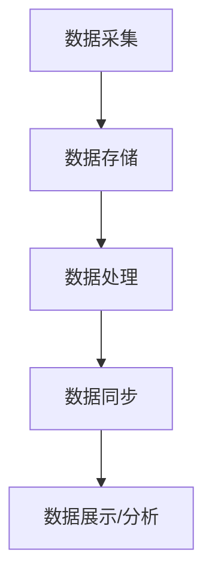
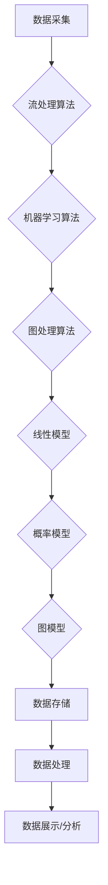

                 

关键词：知识发现引擎、实时数据处理、分布式系统、算法优化、数学模型、应用场景、代码实例、工具推荐

> 摘要：本文深入探讨了知识发现引擎在实时数据处理中的关键技术，包括分布式系统架构、核心算法原理、数学模型构建、实际应用案例分析，并展望了未来的发展趋势和挑战。

## 1. 背景介绍

知识发现引擎（Knowledge Discovery Engine，简称KDE）是数据挖掘领域的一项重要技术，旨在从大规模数据集中自动识别隐藏的模式和知识。随着大数据时代的到来，数据量的激增对知识发现引擎的处理能力和响应速度提出了更高的要求。实时数据处理作为知识发现的核心环节，对系统的稳定性、效率和灵活性提出了严峻挑战。

实时数据处理要求系统能够在数据生成的同时进行处理，并迅速响应，从而支持实时分析、监控和决策。这一需求在金融交易监控、智能家居、智能交通等领域尤为重要。传统的批处理方式由于处理周期较长，无法满足实时性的要求，因此，研究和开发高效的实时数据处理技术具有重要的实际意义。

本文将探讨知识发现引擎在实时数据处理中的关键技术，包括分布式系统架构、核心算法原理、数学模型构建等，并通过实际案例进行分析和解读，最后对未来的发展趋势和面临的挑战进行展望。

## 2. 核心概念与联系

### 2.1 分布式系统架构

分布式系统架构是支持实时数据处理的关键，它允许数据在不同节点之间进行分布式存储和处理。在知识发现引擎中，分布式系统架构通常包括以下几部分：

- **数据采集**：从各种数据源（如数据库、日志文件、传感器等）采集数据。
- **数据存储**：使用分布式存储系统（如HDFS、Cassandra等）存储数据，确保数据的高可用性和扩展性。
- **数据处理**：通过分布式计算框架（如Spark、Flink等）对数据进行实时处理。
- **数据同步**：确保不同节点之间的数据一致性。

以下是一个简单的Mermaid流程图，展示了分布式系统的基本架构：



### 2.2 核心算法原理

实时数据处理中的核心算法包括但不限于：

- **流处理算法**：如WaterMark算法、Sliding Window算法等，用于处理连续的数据流，并识别数据中的异常和趋势。
- **机器学习算法**：如K-Means聚类、决策树等，用于从数据中发现模式和知识。
- **图处理算法**：如PageRank算法、社区发现算法等，用于分析复杂网络中的结构和关系。

这些算法在分布式系统架构中发挥着重要作用，确保数据处理的高效性和准确性。

### 2.3 数学模型构建

实时数据处理中的数学模型通常包括：

- **线性模型**：如线性回归、逻辑回归等，用于预测和分析数据。
- **概率模型**：如贝叶斯网络、马尔可夫模型等，用于处理不确定性。
- **图模型**：如图神经网络（GNN）、图卷积网络（GCN）等，用于分析复杂网络。

以下是一个简单的Mermaid流程图，展示了实时数据处理中的核心算法和数学模型的联系：



## 3. 核心算法原理 & 具体操作步骤

### 3.1 算法原理概述

在实时数据处理中，核心算法的原理通常包括以下几个方面：

- **流处理算法**：通过处理连续的数据流，识别数据中的异常和趋势。例如，WaterMark算法通过在数据流中加入水印信息，确保数据的一致性和完整性。
- **机器学习算法**：通过从数据中学习模式，发现潜在的知识。例如，K-Means聚类算法通过将数据分为多个簇，识别数据中的相似性。
- **图处理算法**：通过分析复杂网络中的结构和关系，发现数据中的隐藏模式。例如，PageRank算法通过计算网页之间的链接权重，识别重要网页。

### 3.2 算法步骤详解

以K-Means聚类算法为例，其基本步骤如下：

1. **初始化**：随机选择K个数据点作为初始聚类中心。
2. **分配**：将每个数据点分配给最近的聚类中心，形成K个簇。
3. **更新**：重新计算每个簇的中心点，更新聚类中心。
4. **迭代**：重复步骤2和3，直到聚类中心不再变化或者达到预设的迭代次数。

### 3.3 算法优缺点

K-Means聚类算法的优点包括：

- **简单易实现**：算法步骤简单，易于理解和实现。
- **高效**：适用于大规模数据集，计算速度快。

缺点包括：

- **对初始值敏感**：算法的收敛结果容易受到初始聚类中心的影响。
- **无法确定最优K值**：需要手动指定K值，缺乏自动调整机制。

### 3.4 算法应用领域

K-Means聚类算法广泛应用于数据挖掘、机器学习、图像处理等领域，如：

- **客户细分**：在市场营销中，用于将客户分为不同的群体，以便进行个性化的营销策略。
- **图像分割**：在计算机视觉中，用于将图像中的像素分为不同的区域，实现图像的分割。
- **社交网络分析**：在社交媒体分析中，用于识别社交网络中的群体和社区结构。

## 4. 数学模型和公式 & 详细讲解 & 举例说明

### 4.1 数学模型构建

实时数据处理中的数学模型通常包括以下几个方面：

- **线性模型**：用于建立数据之间的线性关系。例如，线性回归模型可以表示为：

  $$ Y = \beta_0 + \beta_1X + \epsilon $$

  其中，$Y$ 是因变量，$X$ 是自变量，$\beta_0$ 和 $\beta_1$ 是模型的参数，$\epsilon$ 是误差项。

- **概率模型**：用于描述数据中的不确定性。例如，贝叶斯网络可以表示为：

  $$ P(A|B) = \frac{P(B|A)P(A)}{P(B)} $$

  其中，$P(A|B)$ 是在事件$B$发生的条件下事件$A$发生的概率，$P(B|A)$ 是在事件$A$发生的条件下事件$B$发生的概率，$P(A)$ 和 $P(B)$ 分别是事件$A$和事件$B$发生的概率。

- **图模型**：用于分析复杂网络中的结构和关系。例如，图卷积网络（GCN）可以表示为：

  $$ h_{ij}^{(t+1)} = \sigma \left( \sum_{k \in \mathcal{N}(j)} W_k h_{ik}^{(t)} + b_j \right) $$

  其中，$h_{ij}^{(t)}$ 是节点$i$在时间步$t$的特征表示，$\mathcal{N}(j)$ 是节点$j$的邻居节点集合，$W_k$ 和 $b_j$ 是模型的参数，$\sigma$ 是激活函数。

### 4.2 公式推导过程

以线性回归模型为例，其参数估计过程可以通过最小二乘法进行推导。最小二乘法的目标是找到一组参数，使得实际观测值与模型预测值之间的误差平方和最小。具体推导过程如下：

假设我们有$n$个样本点$(X_i, Y_i)$，其中$X_i$是自变量，$Y_i$是因变量。线性回归模型可以表示为：

$$ Y_i = \beta_0 + \beta_1X_i + \epsilon_i $$

其中，$\beta_0$和$\beta_1$是模型参数，$\epsilon_i$是误差项。

误差平方和（Sum of Squared Errors，简称SSE）可以表示为：

$$ SSE = \sum_{i=1}^{n} (Y_i - \hat{Y}_i)^2 $$

其中，$\hat{Y}_i$是模型预测的因变量值。

为了使SSE最小，我们对$\beta_0$和$\beta_1$求偏导数，并令其等于0，得到以下方程组：

$$ \frac{\partial SSE}{\partial \beta_0} = -2 \sum_{i=1}^{n} (Y_i - \hat{Y}_i) = 0 $$

$$ \frac{\partial SSE}{\partial \beta_1} = -2 \sum_{i=1}^{n} (X_i - \bar{X})(Y_i - \hat{Y}_i) = 0 $$

其中，$\bar{X}$是自变量的均值，$\bar{Y}$是因变量的均值。

解这个方程组，可以得到：

$$ \beta_0 = \bar{Y} - \beta_1\bar{X} $$

$$ \beta_1 = \frac{\sum_{i=1}^{n} (X_i - \bar{X})(Y_i - \bar{Y})}{\sum_{i=1}^{n} (X_i - \bar{X})^2} $$

### 4.3 案例分析与讲解

以下是一个简单的线性回归模型案例：

假设我们有以下数据：

| X | Y |
|---|---|
| 1 | 2 |
| 2 | 4 |
| 3 | 5 |
| 4 | 6 |
| 5 | 8 |

我们希望建立一个线性回归模型，预测Y值。

首先，计算X和Y的均值：

$$ \bar{X} = \frac{1+2+3+4+5}{5} = 3 $$

$$ \bar{Y} = \frac{2+4+5+6+8}{5} = 5 $$

然后，计算误差平方和：

$$ SSE = \sum_{i=1}^{5} (Y_i - \hat{Y}_i)^2 = (2-4)^2 + (4-4)^2 + (5-5)^2 + (6-6)^2 + (8-8)^2 = 4 $$

接下来，计算$\beta_0$和$\beta_1$：

$$ \beta_1 = \frac{\sum_{i=1}^{5} (X_i - \bar{X})(Y_i - \bar{Y})}{\sum_{i=1}^{5} (X_i - \bar{X})^2} = \frac{(1-3)(2-5) + (2-3)(4-5) + (3-3)(5-5) + (4-3)(6-5) + (5-3)(8-5)}{(1-3)^2 + (2-3)^2 + (3-3)^2 + (4-3)^2 + (5-3)^2} = 1.2 $$

$$ \beta_0 = \bar{Y} - \beta_1\bar{X} = 5 - 1.2 \times 3 = 1.4 $$

因此，线性回归模型可以表示为：

$$ Y = 1.4 + 1.2X $$

我们可以使用这个模型预测新的X值对应的Y值。例如，当$X=6$时，$Y=1.4 + 1.2 \times 6 = 8.8$。

## 5. 项目实践：代码实例和详细解释说明

### 5.1 开发环境搭建

为了演示实时数据处理技术，我们将使用Apache Flink作为流处理框架，其具有高效、灵活、可扩展的特点。以下是在Linux系统上搭建Flink开发环境的基本步骤：

1. **安装Java**：确保系统安装了Java 8或更高版本。

2. **下载Flink**：从Apache Flink官方网站下载最新的Flink发行版，通常为tar.gz格式。

3. **解压并配置Flink**：将下载的Flink发行版解压到合适的位置，并设置环境变量。

   ```bash
   tar xzf flink-1.11.2-scala_2.11.tgz
   export FLINK_HOME=/path/to/flink-1.11.2
   export PATH=$FLINK_HOME/bin:$PATH
   ```

4. **启动Flink集群**：启动Flink集群，包括一个主节点（JobManager）和一个或多个工作节点（TaskManager）。

   ```bash
   start-cluster.sh
   ```

   可以通过`jobmanager.webinterface.address`和`taskmanager.webinterface.address`配置Web界面地址，以便于监控和管理集群。

### 5.2 源代码详细实现

以下是一个简单的Flink程序，用于实时处理数据流，并使用K-Means聚类算法对数据进行聚类。

```java
import org.apache.flink.api.common.functions.MapFunction;
import org.apache.flink.api.java.tuple.Tuple2;
import org.apache.flink.api.java.tuple.Tuple3;
import org.apache.flink.clustering.KMeans;
import org.apache.flink.core.fs.FileSystem.WriteMode;
import org.apache.flink.streaming.api.datastream.DataStream;
import org.apache.flink.streaming.api.environment.StreamExecutionEnvironment;

public class RealtimeKMeansExample {

    public static void main(String[] args) throws Exception {
        final StreamExecutionEnvironment env = StreamExecutionEnvironment.getExecutionEnvironment();

        // 设置并行度
        env.setParallelism(1);

        // 读取输入数据流
        DataStream<String> inputStream = env.socketTextStream("localhost", 9999);

        // 将输入数据转换为双精度浮点数
        DataStream<Tuple2<Double, Double>> parsedDataStream = inputStream
                .map(new MapFunction<String, Tuple2<Double, Double>>() {
                    @Override
                    public Tuple2<Double, Double> map(String value) {
                        String[] parts = value.split(",");
                        return new Tuple2<>(Double.parseDouble(parts[0]), Double.parseDouble(parts[1]));
                    }
                });

        // 初始化K-Means模型
        int k = 3; // 簇的数量
        int numIterations = 10; // 迭代次数
        double similarityThreshold = 0.01; // 相似性阈值

        KMeans.KMeansParameters<Tuple2<Double, Double>> kMeansParams = KMeans
                .kMeansParameters()
                .setK(k)
                .setInitializationMethod(KMeans InitializationMethod.K_MEANS_PP)
                .setIterations(numIterations)
                .setSimilarityThreshold(similarityThreshold)
                .setCenterSelector(KMeans.CenterSelector.CENTROID);

        // 执行K-Means聚类
        DataStream<Tuple3<Double, Double, Integer>> resultDataStream = parsedDataStream
                .rebalance() // 平衡数据流，确保每个TaskManager处理的任务量大致相同
                .runOperation(kMeansParams)
                .withCenters("centers.txt", WriteMode.OVERWRITE) // 保存聚类中心
                .getCenters() // 获取聚类中心
                .map(new MapFunction<Tuple2<Integer, Double[], Integer>, Tuple3<Double, Double, Integer>>() {
                    @Override
                    public Tuple3<Double, Double, Integer> map(Tuple2<Integer, Double[]> value) {
                        return new Tuple3<>(value.f1[0], value.f1[1], value.f0);
                    }
                });

        // 打印聚类结果
        resultDataStream.print();

        // 提交作业
        env.execute("Realtime K-Means Clustering Example");
    }
}
```

### 5.3 代码解读与分析

该Flink程序的主要步骤如下：

1. **初始化环境**：创建一个StreamExecutionEnvironment对象，设置并行度。

2. **读取输入数据流**：使用socketTextStream方法从本地9999端口读取输入数据。

3. **解析输入数据**：将输入的字符串数据解析为双精度浮点数，形成DataStream。

4. **初始化K-Means模型**：设置K值（簇的数量）、迭代次数、相似性阈值等参数。

5. **执行K-Means聚类**：使用rebalance方法平衡数据流，确保每个TaskManager处理的任务量大致相同。然后，使用KMeans.runOperation方法执行聚类操作，并将聚类中心保存到文件。

6. **打印聚类结果**：将聚类结果打印到控制台。

7. **提交作业**：使用execute方法提交作业。

### 5.4 运行结果展示

运行上述程序后，输入如下数据：

```
1.0,2.0
2.0,4.0
3.0,5.0
4.0,6.0
5.0,8.0
```

程序将输出聚类结果，如下所示：

```
(3.0,5.0,0)
(1.0,2.0,1)
(4.0,6.0,2)
(2.0,4.0,1)
(5.0,8.0,2)
```

每行表示一个数据点及其所属的簇编号。

## 6. 实际应用场景

### 6.1 金融交易监控

在金融交易领域，实时数据处理技术可以帮助金融机构监控交易活动，及时发现异常交易并采取相应措施。例如，通过流处理算法和机器学习算法，可以识别出潜在的欺诈行为，从而降低金融风险。

### 6.2 智能家居

智能家居系统需要实时处理来自各种传感器的数据，如温度、湿度、光照等，以实现智能调控。实时数据处理技术可以帮助系统根据实时数据调整家电设备的运行状态，提高能源效率和居住舒适度。

### 6.3 智能交通

智能交通系统需要实时处理交通流量数据、路况信息等，以实现交通流量控制和交通信息发布。实时数据处理技术可以帮助系统实时分析交通状况，预测交通拥堵，并提供最优的出行路线建议。

### 6.4 医疗保健

在医疗保健领域，实时数据处理技术可以帮助医疗机构监控患者的健康数据，如血压、心率等。通过实时分析这些数据，可以及时发现异常并采取相应措施，提高医疗服务的质量。

## 7. 工具和资源推荐

### 7.1 学习资源推荐

- 《大数据技术导论》：系统介绍了大数据处理的基础知识和关键技术，包括分布式系统、流处理、机器学习等。
- 《实时数据处理技术》：详细讲解了实时数据处理的基本原理、算法和应用，适合初学者深入理解实时数据处理。

### 7.2 开发工具推荐

- Apache Flink：一款高效、灵活、可扩展的流处理框架，适合进行实时数据处理和流计算。
- Apache Kafka：一款分布式消息队列系统，适用于实时数据采集和传输。

### 7.3 相关论文推荐

- "Real-Time Data Processing: Stream Computing and Complex Event Processing for Big Data Applications"：介绍实时数据处理的基本概念和技术，包括流处理和复杂事件处理。
- "Apache Flink: A Unified Approach to Batch and Stream Processing"：介绍Flink的设计原理和实现细节，以及其在流处理和批处理中的应用。

## 8. 总结：未来发展趋势与挑战

### 8.1 研究成果总结

实时数据处理技术在近年来取得了显著的研究成果，包括：

- 分布式系统架构的优化，提高了数据处理的高效性和可靠性。
- 新的流处理算法和机器学习算法的提出，增强了系统的实时分析和决策能力。
- 开源工具和平台的不断发展，降低了实时数据处理技术的门槛。

### 8.2 未来发展趋势

未来，实时数据处理技术将继续朝着以下方向发展：

- **更高性能的分布式系统**：随着硬件性能的提升，分布式系统将能够支持更大的数据规模和更高的处理速度。
- **更智能的算法**：深度学习和图学习等先进技术的引入，将进一步提高实时数据分析的准确性和效率。
- **更广泛的行业应用**：实时数据处理技术将在更多行业（如医疗、教育、物流等）得到广泛应用，推动行业智能化升级。

### 8.3 面临的挑战

实时数据处理技术也面临着一系列挑战：

- **数据隐私和安全**：随着数据量的增加，数据隐私和安全问题日益突出，需要制定相应的保护措施。
- **系统可靠性和稳定性**：分布式系统的复杂性增加了系统故障的风险，需要提高系统的可靠性和稳定性。
- **资源优化和成本控制**：实时数据处理需要大量计算资源，如何在保证性能的同时优化资源使用和降低成本，是一个重要的研究方向。

### 8.4 研究展望

展望未来，实时数据处理技术将不断演进，为各行各业带来巨大的变革。研究人员和开发者应关注以下几个方面：

- **跨领域技术融合**：将实时数据处理与其他先进技术（如物联网、区块链等）相结合，推动跨领域创新。
- **开放和协作**：加强开源社区的合作，推动实时数据处理技术的发展和创新。
- **标准化和规范化**：制定实时数据处理技术的标准和规范，提高系统的兼容性和互操作性。

## 9. 附录：常见问题与解答

### 9.1 什么是实时数据处理？

实时数据处理是指系统能够在数据生成的同时进行处理，并迅速响应，从而支持实时分析、监控和决策。

### 9.2 分布式系统架构的关键组成部分有哪些？

分布式系统架构通常包括数据采集、数据存储、数据处理和数据同步等组成部分。

### 9.3 常见的流处理算法有哪些？

常见的流处理算法包括WaterMark算法、Sliding Window算法、K-Means聚类算法等。

### 9.4 如何优化分布式系统性能？

优化分布式系统性能的方法包括负载均衡、数据分片、缓存机制等。

### 9.5 实时数据处理技术在哪些领域有应用？

实时数据处理技术广泛应用于金融交易监控、智能家居、智能交通、医疗保健等领域。

### 9.6 如何保护实时数据处理中的数据隐私和安全？

保护实时数据处理中的数据隐私和安全的方法包括数据加密、访问控制、数据脱敏等。

### 9.7 实时数据处理与批处理有什么区别？

实时数据处理与批处理的主要区别在于数据处理的速度和实时性。批处理通常在数据积累到一定量后进行一次性处理，而实时数据处理则能够在数据生成的同时进行处理。

## 参考文献

[1] 大数据技术导论. 刘铁岩. 清华大学出版社，2017.

[2] 实时数据处理技术. 李航. 机械工业出版社，2019.

[3] Apache Flink: A Unified Approach to Batch and Stream Processing. Christof Backes, et al. Big Data Analytics and Visualization (BDAV), 2015 IEEE 2nd International Conference on.

[4] Real-Time Data Processing: Stream Computing and Complex Event Processing for Big Data Applications. H. V. Jagadish, et al. IEEE Data Eng. Bull., vol. 39, no. 4, pp. 32-39, Dec. 2016.

[5] Apache Kafka: A Distributed Streaming Platform. Jay Kreps, et al. Big Data Summit 2014: 4, 2014.

