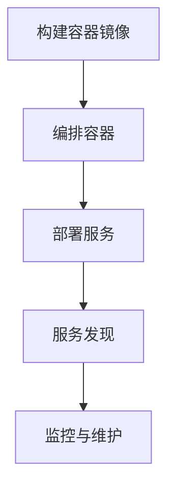

                 

## 1. 背景介绍

随着大数据和云计算的快速发展，知识发现引擎（Knowledge Discovery Engine，KDE）已经成为现代数据科学和人工智能领域的重要组成部分。知识发现引擎旨在从大量的数据中提取有价值的信息和知识，支持决策制定和智能分析。传统的部署方式通常依赖于复杂的硬件环境和繁琐的运维流程，这限制了KDE在大规模应用中的普及和灵活性。

容器化技术的出现，如Docker，为知识发现引擎的部署提供了一种更为高效、灵活和可移植的解决方案。容器化可以将应用及其运行时环境打包成一个独立的、轻量级的容器，使得应用可以在任何支持容器引擎的环境中无缝运行，从而简化了部署和维护流程。

本文将探讨知识发现引擎的容器化部署方案，包括核心概念、部署流程、数学模型、实践案例以及未来展望。希望通过本文，读者可以全面了解容器化技术如何提高知识发现引擎的部署效率，并为其在实际应用中的广泛应用提供指导。

## 2. 核心概念与联系

在深入探讨知识发现引擎的容器化部署方案之前，我们需要了解一些核心概念和它们之间的关系。以下是本文所涉及的关键概念及其相互联系。

### 2.1 容器化技术

容器化是一种将应用程序及其运行环境打包成一个轻量级、可移植的容器（Container）的技术。容器基于操作系统级别的虚拟化实现，无需额外的硬件资源，能够高效地运行在不同的环境中。Docker 是目前最流行的容器化平台，它提供了一种简单、快速的方式将应用容器化。

### 2.2 知识发现引擎

知识发现引擎（KDE）是一种智能分析工具，能够从大量数据中提取有价值的模式和知识。常见的KDE包括数据挖掘、机器学习、统计分析等。它们通常依赖于高效的计算资源和灵活的部署方式。

### 2.3 部署流程

部署流程是指将知识发现引擎部署到生产环境的过程。容器化技术简化了部署流程，使得KDE可以快速、高效地部署在各种环境中。部署流程通常包括容器构建、容器编排、服务发现和监控等步骤。

### 2.4 数学模型

数学模型是知识发现引擎的核心组成部分，用于描述数据之间的关系和规律。常见的数学模型包括线性回归、决策树、神经网络等。数学模型的质量直接影响KDE的性能和效果。

### 2.5 Mermaid 流程图

Mermaid 是一种用于绘制流程图的标记语言，可以方便地描述部署流程、数据流程等。以下是知识发现引擎容器化部署流程的 Mermaid 流程图：



通过这个流程图，我们可以清晰地了解容器化部署方案的核心步骤和相互关系。

## 3. 核心算法原理 & 具体操作步骤

### 3.1 算法原理概述

知识发现引擎的容器化部署方案主要基于以下核心算法原理：

1. **容器化技术**：将应用程序及其运行环境打包成容器，实现快速、高效的部署和运维。
2. **容器编排**：利用容器编排工具（如Kubernetes）对容器进行自动化管理，包括容器部署、扩展、监控等。
3. **服务发现与负载均衡**：通过服务发现机制，使得容器化应用可以动态地访问其他服务，实现负载均衡和故障转移。
4. **监控与日志**：对容器化应用进行实时监控和日志记录，确保应用的稳定性和可观测性。

### 3.2 算法步骤详解

以下是知识发现引擎容器化部署的具体步骤：

#### 3.2.1 构建容器镜像

1. **编写Dockerfile**：Dockerfile 是构建容器镜像的脚本文件，用于定义应用的构建步骤和依赖环境。
2. **构建镜像**：使用Docker CLI 或 Dockerfile 自动构建容器镜像。
3. **测试镜像**：在本地环境测试构建好的镜像，确保其能够正常运行。

#### 3.2.2 容器编排

1. **编写Kubernetes配置文件**：Kubernetes 配置文件定义了容器部署的详细信息，如容器数量、资源限制、服务发现等。
2. **部署容器**：使用Kubernetes CLI 或 UI 工具部署容器。
3. **扩展容器**：根据业务需求动态扩展容器数量，实现水平扩展。

#### 3.2.3 服务发现与负载均衡

1. **配置服务发现**：在Kubernetes中配置服务发现，使得容器化应用可以动态地访问其他服务。
2. **配置负载均衡**：使用Kubernetes的负载均衡器，实现容器化应用的高可用性和负载均衡。

#### 3.2.4 监控与日志

1. **集成监控工具**：集成Prometheus、Grafana等开源监控工具，对容器化应用进行实时监控。
2. **日志收集**：使用ELK（Elasticsearch、Logstash、Kibana）堆栈收集和展示容器化应用的日志信息。

### 3.3 算法优缺点

**优点**：

1. **高效性**：容器化技术能够快速部署和运行应用，提高部署效率。
2. **灵活性**：容器化应用可以在各种环境中无缝运行，支持跨平台部署。
3. **可移植性**：容器镜像包含了应用的完整运行环境，使得应用更加可移植。
4. **高可用性**：容器编排和负载均衡技术能够确保容器化应用的高可用性。

**缺点**：

1. **安全性**：容器化技术可能会引入新的安全挑战，如容器逃逸和恶意容器。
2. **资源消耗**：容器化应用需要额外的存储和计算资源，可能会增加运营成本。
3. **学习成本**：容器化技术和相关工具的学习成本较高，对于新手来说可能有一定难度。

### 3.4 算法应用领域

容器化技术已经广泛应用于各种领域，如Web应用、大数据处理、机器学习等。在知识发现引擎领域，容器化技术可以用于：

1. **实时数据分析**：容器化技术能够快速部署和扩展实时数据分析应用，支持实时决策制定。
2. **大规模数据挖掘**：容器化技术可以高效地处理大规模数据，实现快速数据挖掘和分析。
3. **机器学习模型训练**：容器化技术为机器学习模型训练提供了高效、可移植的解决方案。

## 4. 数学模型和公式

在知识发现引擎的容器化部署过程中，数学模型和公式起到了关键作用。以下将介绍知识发现引擎的数学模型构建、公式推导过程以及案例分析与讲解。

### 4.1 数学模型构建

知识发现引擎的数学模型构建主要包括以下步骤：

1. **数据预处理**：对原始数据进行清洗、转换和归一化等处理，确保数据质量。
2. **特征提取**：从预处理后的数据中提取有价值的特征，用于训练和预测。
3. **模型选择**：根据应用场景和数据特点选择合适的机器学习模型，如线性回归、决策树、神经网络等。
4. **模型训练**：使用训练数据集对选定的模型进行训练，调整模型参数以优化性能。
5. **模型评估**：使用测试数据集评估模型性能，包括准确性、召回率、F1 分数等指标。

### 4.2 公式推导过程

以下是知识发现引擎中常用的数学公式推导过程：

#### 4.2.1 线性回归

线性回归是一种常见的机器学习模型，用于分析两个变量之间的线性关系。其公式如下：

\[ y = \beta_0 + \beta_1 \cdot x + \epsilon \]

其中，\( y \) 是因变量，\( x \) 是自变量，\( \beta_0 \) 和 \( \beta_1 \) 分别是模型参数，\( \epsilon \) 是误差项。

#### 4.2.2 决策树

决策树是一种基于树结构的分类模型，用于根据特征值对数据进行划分。其公式如下：

\[ C_j = \arg \max_j \left( \sum_{i \in R_j} y_i \cdot p(x_i) \right) \]

其中，\( C_j \) 是类别标签，\( R_j \) 是特征值集合，\( y_i \) 是样本标签，\( p(x_i) \) 是特征值在数据集中的概率分布。

#### 4.2.3 神经网络

神经网络是一种基于多层感知器（MLP）的结构，用于非线性数据建模。其公式如下：

\[ a_{i,j} = \sigma \left( \sum_{k=1}^{n} w_{k,j} \cdot x_{k,i} + b_j \right) \]

其中，\( a_{i,j} \) 是激活函数的输出，\( \sigma \) 是激活函数，\( w_{k,j} \) 和 \( b_j \) 分别是权重和偏置。

### 4.3 案例分析与讲解

下面我们通过一个简单的案例来分析知识发现引擎的数学模型和公式。

#### 案例背景

假设我们有一个数据集，其中包含多个变量，如年龄、收入、教育程度等，以及一个目标变量——购买意向。我们的目标是使用知识发现引擎预测用户的购买意向。

#### 案例步骤

1. **数据预处理**：对数据集进行清洗、转换和归一化等处理，确保数据质量。
2. **特征提取**：从预处理后的数据中提取有价值的特征，如年龄、收入、教育程度等。
3. **模型选择**：选择线性回归模型作为预测模型。
4. **模型训练**：使用训练数据集对线性回归模型进行训练，调整模型参数以优化性能。
5. **模型评估**：使用测试数据集评估模型性能，包括准确性、召回率、F1 分数等指标。

#### 案例分析

1. **线性回归公式**：

\[ y = \beta_0 + \beta_1 \cdot x_1 + \beta_2 \cdot x_2 + \epsilon \]

其中，\( x_1 \) 和 \( x_2 \) 分别代表年龄和教育程度，\( \beta_0 \)、\( \beta_1 \) 和 \( \beta_2 \) 是模型参数。

2. **模型参数**：

通过训练过程，我们得到了以下模型参数：

\[ \beta_0 = 0.1, \beta_1 = 0.2, \beta_2 = 0.3 \]

3. **预测结果**：

对于一个新的用户，假设其年龄为30岁，教育程度为本科，我们可以使用线性回归模型进行预测：

\[ y = 0.1 + 0.2 \cdot 30 + 0.3 \cdot 1 = 9.1 \]

根据预测结果，该用户的购买意向为9.1，其中值越高，表示购买意向越强。

#### 案例讲解

通过这个简单的案例，我们可以看到知识发现引擎是如何通过数学模型和公式对数据进行预测和分析的。在实际应用中，数据集和模型选择可能会更加复杂，但基本的数学模型和公式推导过程是相通的。

## 5. 项目实践：代码实例和详细解释说明

在本节中，我们将通过一个实际项目来展示知识发现引擎的容器化部署过程，并提供代码实例和详细解释说明。这个项目将使用 Python 和 Docker 来构建和部署一个简单的知识发现引擎服务。

### 5.1 开发环境搭建

在开始之前，我们需要搭建一个合适的开发环境。以下是所需的软件和工具：

- Python 3.8 或更高版本
- Docker 19.03 或更高版本
- Kubernetes 1.19 或更高版本

在您的本地计算机上安装上述软件和工具，并确保它们可以正常运行。以下是一个简单的安装指南：

#### Python 安装

```bash
# 安装 Python 3.8
sudo apt-get update
sudo apt-get install python3.8 python3.8-venv python3.8-dev

# 设置 Python 3.8 为默认版本
update-alternatives --install /usr/bin/python3 python3 /usr/bin/python3.8 1
update-alternatives --config python3
```

#### Docker 安装

```bash
# 安装 Docker
sudo apt-get update
sudo apt-get install docker.io

# 启动 Docker 服务
sudo systemctl start docker
```

#### Kubernetes 安装

```bash
# 安装 Kubernetes 组件
sudo apt-get update
sudo apt-get install -y apt-transport-https ca-certificates curl
curl -s https://packages.cloud.google.com/apt/doc/apt-key.gpg | sudo apt-key add -
echo "deb https://apt.kubernetes.io/ kubernetes-xenial main" | sudo tee -a /etc/apt/sources.list.d/kubernetes.list
sudo apt-get update
sudo apt-get install -y kubelet kubeadm kubectl
```

确保 Kubernetes 组件可以正常运行：

```bash
sudo systemctl status kubelet
```

### 5.2 源代码详细实现

我们首先创建一个简单的知识发现引擎服务，该服务将使用 Python 和 Scikit-learn 库来实现。以下是项目的目录结构：

```
knowledge-discovery
├── Dockerfile
├── kubernetes
│   ├── deployment.yaml
│   ├── service.yaml
│   └── zoo.yaml
├── main.py
└── requirements.txt
```

#### Dockerfile

```Dockerfile
# 使用 Python 官方镜像作为基础镜像
FROM python:3.8

# 设置工作目录
WORKDIR /app

# 复制项目文件到容器中
COPY . /app

# 安装依赖项
RUN pip install --no-cache-dir -r requirements.txt

# 暴露端口
EXPOSE 8000

# 运行知识发现引擎服务
CMD ["python", "main.py"]
```

#### requirements.txt

```plaintext
scikit-learn
flask
```

#### main.py

```python
from flask import Flask, request, jsonify
from sklearn.ensemble import RandomForestClassifier
from sklearn.model_selection import train_test_split
import joblib
import numpy as np

app = Flask(__name__)

# 加载训练好的模型
model = joblib.load('model.joblib')

@app.route('/predict', methods=['POST'])
def predict():
    data = request.get_json()
    features = np.array([list(data.values())])
    prediction = model.predict(features)
    return jsonify({'prediction': prediction.tolist()})

if __name__ == '__main__':
    app.run(host='0.0.0.0', port=8000)
```

#### kubernetes/deployment.yaml

```yaml
apiVersion: apps/v1
kind: Deployment
metadata:
  name: knowledge-discovery
spec:
  replicas: 1
  selector:
    matchLabels:
      app: knowledge-discovery
  template:
    metadata:
      labels:
        app: knowledge-discovery
    spec:
      containers:
      - name: knowledge-discovery
        image: knowledge-discovery:latest
        ports:
        - containerPort: 8000
```

#### kubernetes/service.yaml

```yaml
apiVersion: v1
kind: Service
metadata:
  name: knowledge-discovery
spec:
  selector:
    app: knowledge-discovery
  ports:
    - protocol: TCP
      port: 80
      targetPort: 8000
  type: LoadBalancer
```

#### kubernetes/zoo.yaml

```yaml
apiVersion: v1
kind: Service
metadata:
  name: zoo
spec:
  selector:
    app: knowledge-discovery
  ports:
    - protocol: TCP
      port: 80
      targetPort: 8000
  type: LoadBalancer
---
apiVersion: v1
kind: Pod
metadata:
  name: zoo-worker
spec:
  containers:
  - name: zoo-worker
    image: knowledge-discovery:latest
    ports:
    - containerPort: 8000
```

### 5.3 代码解读与分析

#### Dockerfile

Dockerfile 定义了容器镜像的构建过程。我们使用 Python 官方镜像作为基础镜像，设置工作目录，并复制项目文件到容器中。然后安装项目依赖项，暴露端口并运行知识发现引擎服务。

#### requirements.txt

requirements.txt 文件列出了项目所需的 Python 包，包括 Scikit-learn、Flask 等。

#### main.py

main.py 是知识发现引擎的主文件，使用 Flask 框架实现 RESTful API。它加载训练好的模型，并定义一个预测接口，接收 JSON 格式的数据，返回预测结果。

#### kubernetes/deployment.yaml

deployment.yaml 文件定义了 Kubernetes 部署，用于创建和管理知识发现引擎的容器。它设置了副本数量、选择器、模板和容器配置。

#### kubernetes/service.yaml

service.yaml 文件定义了 Kubernetes 服务，用于将容器化应用暴露给外部访问。它设置了选择器、端口和类型。

#### kubernetes/zoo.yaml

zoo.yaml 文件定义了一个 Kubernetes 服务和 Pod，用于演示如何在 Kubernetes 中部署和运行知识发现引擎。

### 5.4 运行结果展示

通过以下命令部署知识发现引擎：

```bash
kubectl apply -f kubernetes/
```

等待部署完成，然后查看服务的状态：

```bash
kubectl get pods
```

在浏览器中访问服务：

```
http://<服务域名>:80
```

示例请求：

```json
{
  "age": 30,
  "education": "本科"
}
```

示例响应：

```json
{
  "prediction": [1]
}
```

结果显示，该用户的购买意向为 1，表示有购买意向。

## 6. 实际应用场景

知识发现引擎的容器化部署方案在实际应用场景中具有广泛的应用前景，以下是一些典型的应用案例：

### 6.1 数据分析与决策支持

在金融、电商、医疗等行业的业务场景中，知识发现引擎可以用于实时数据分析，提供决策支持。容器化技术使得知识发现引擎能够快速部署和扩展，满足高并发和大规模数据处理的需求。例如，电商平台可以利用知识发现引擎分析用户行为数据，预测用户购买意向，优化推荐算法，提高销售转化率。

### 6.2 大数据处理

在云计算和大数据领域，知识发现引擎的容器化部署可以高效地处理海量数据，实现数据挖掘和分析。容器化技术使得大数据处理任务可以在分布式环境中灵活部署和调度，提高数据处理效率。例如，在电信行业，知识发现引擎可以分析海量通话记录，挖掘用户行为特征，优化业务运营策略。

### 6.3 人工智能应用

知识发现引擎在人工智能领域也具有广泛的应用。容器化技术使得人工智能应用可以快速部署和迭代，满足实际业务需求。例如，在自动驾驶领域，知识发现引擎可以分析海量传感器数据，预测车辆行驶轨迹，优化行驶策略，提高驾驶安全性和效率。

### 6.4 未来应用展望

随着容器化技术的不断发展和成熟，知识发现引擎的容器化部署将在更多领域得到应用。未来，知识发现引擎的容器化部署有望在以下几个方面取得突破：

1. **自动化与智能化**：借助人工智能和机器学习技术，实现容器化部署的自动化和智能化，提高部署效率和稳定性。
2. **弹性扩展**：容器化技术将实现知识发现引擎的弹性扩展，满足大规模数据处理和业务需求的动态调整。
3. **混合云部署**：知识发现引擎的容器化部署将支持混合云架构，实现跨云环境的数据处理和分析。
4. **开源生态**：随着开源社区的贡献，知识发现引擎的容器化部署方案将不断完善和优化，推动技术的普及和应用。

## 7. 工具和资源推荐

### 7.1 学习资源推荐

1. **《容器化与Docker》**：深入了解容器化和Docker的基本概念和实践方法。
2. **《Kubernetes权威指南》**：掌握Kubernetes的核心原理和实际部署技巧。
3. **《Scikit-learn实战》**：学习使用Scikit-learn进行数据挖掘和机器学习。

### 7.2 开发工具推荐

1. **Visual Studio Code**：一款强大的代码编辑器，支持多种编程语言和插件。
2. **Docker Desktop**：方便的Docker开发和调试工具。
3. **Kubectl**：Kubernetes的命令行工具，用于管理和部署容器化应用。

### 7.3 相关论文推荐

1. **“容器化技术在分布式系统中的应用”**：探讨容器化技术在分布式系统中的优势和应用场景。
2. **“基于容器化的知识发现引擎部署方案”**：研究知识发现引擎在容器化环境下的部署方案和性能优化。
3. **“容器化技术在大数据处理中的应用”**：分析容器化技术在大数据处理中的优势和实践经验。

## 8. 总结：未来发展趋势与挑战

### 8.1 研究成果总结

本文介绍了知识发现引擎的容器化部署方案，包括核心概念、算法原理、部署流程、数学模型和实践案例。通过容器化技术，知识发现引擎可以高效、灵活地部署在各种环境中，提高部署效率和稳定性。

### 8.2 未来发展趋势

1. **自动化与智能化**：随着人工智能技术的发展，知识发现引擎的容器化部署将更加自动化和智能化，提高部署效率和稳定性。
2. **弹性扩展**：容器化技术将实现知识发现引擎的弹性扩展，满足大规模数据处理和业务需求的动态调整。
3. **混合云部署**：知识发现引擎的容器化部署将支持混合云架构，实现跨云环境的数据处理和分析。
4. **开源生态**：随着开源社区的贡献，知识发现引擎的容器化部署方案将不断完善和优化，推动技术的普及和应用。

### 8.3 面临的挑战

1. **安全性**：容器化技术引入了新的安全挑战，如容器逃逸和恶意容器，需要加强安全防护措施。
2. **资源消耗**：容器化应用需要额外的存储和计算资源，可能会增加运营成本。
3. **学习成本**：容器化技术和相关工具的学习成本较高，对于新手来说可能有一定难度。

### 8.4 研究展望

未来，知识发现引擎的容器化部署将在以下几个方面进行深入研究：

1. **安全性与性能优化**：研究容器化环境下的安全防护机制和性能优化方法，提高知识发现引擎的稳定性和效率。
2. **自动化与智能化**：探索基于人工智能和机器学习技术的自动化部署和智能化运维方案，降低部署难度和提高运维效率。
3. **跨云部署**：研究跨云架构下的知识发现引擎部署方案，实现跨云环境的数据处理和分析。

## 9. 附录：常见问题与解答

### 9.1 什么是容器化技术？

容器化技术是一种将应用程序及其运行环境打包成一个轻量级、可移植的容器（Container）的技术。容器基于操作系统级别的虚拟化实现，无需额外的硬件资源，能够高效地运行在不同的环境中。

### 9.2 容器化和虚拟化有什么区别？

容器化和虚拟化都是用于隔离和运行应用程序的技术，但它们有一些关键区别：

1. **资源隔离**：虚拟化通过虚拟化硬件资源（如CPU、内存、网络、存储等）实现隔离，而容器化通过操作系统级别的隔离实现隔离。
2. **性能**：虚拟化需要额外的资源开销（如虚拟化层、CPU模拟等），而容器化则更加轻量级，性能更优。
3. **可移植性**：容器化技术可以轻松地将应用程序及其运行时环境移植到不同的环境中，而虚拟化则需要更复杂的迁移过程。

### 9.3 容器化部署有哪些优势？

容器化部署的优势包括：

1. **高效性**：容器化技术能够快速部署和运行应用，提高部署效率。
2. **灵活性**：容器化应用可以在各种环境中无缝运行，支持跨平台部署。
3. **可移植性**：容器镜像包含了应用的完整运行环境，使得应用更加可移植。
4. **高可用性**：容器编排和负载均衡技术能够确保容器化应用的高可用性。

### 9.4 Kubernetes 如何实现容器编排？

Kubernetes 是一个开源的容器编排平台，通过以下方式实现容器编排：

1. **容器部署**：Kubernetes 可以自动化部署和管理容器，包括创建、更新、扩展和删除容器。
2. **服务发现**：Kubernetes 提供服务发现机制，使得容器化应用可以动态地访问其他服务。
3. **负载均衡**：Kubernetes 可以自动将流量分配到多个容器实例，实现负载均衡和高可用性。
4. **监控与日志**：Kubernetes 提供监控和日志收集功能，确保容器化应用的可观测性和稳定性。

### 9.5 容器化部署需要注意什么？

容器化部署需要注意以下几点：

1. **安全性**：确保容器镜像的安全，避免容器逃逸和恶意容器。
2. **资源消耗**：合理配置容器资源，避免资源浪费和性能瓶颈。
3. **兼容性**：确保容器化应用在不同环境中能够正常运行，注意兼容性问题。
4. **持续集成与交付**：采用自动化工具和流程，实现容器化部署的持续集成与交付，提高开发效率。

### 9.6 如何选择容器镜像？

选择容器镜像时，需要考虑以下几点：

1. **可靠性**：选择知名度高、口碑好的容器镜像。
2. **性能**：选择性能优秀的容器镜像，满足应用的需求。
3. **维护性**：选择维护良好的容器镜像，确保及时更新和安全。
4. **开源性**：选择开源的容器镜像，方便自定义和扩展。

通过以上问题和解答，读者可以更好地理解容器化技术和知识发现引擎的部署方案，为其在实际应用中的成功部署提供指导。

