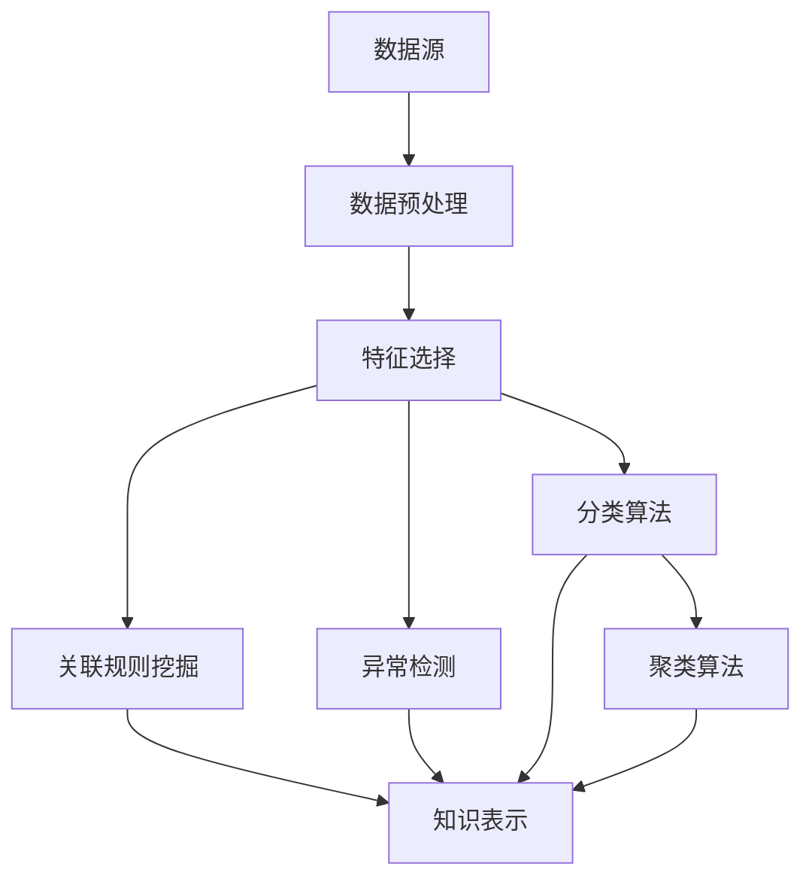

                 

知识发现（Knowledge Discovery in Databases，简称KDD）是数据库研究的一个重要领域，其核心任务是从大量数据中提取出具有潜在价值的信息。知识发现引擎作为实现这一目标的关键工具，其核心算法的研究和应用显得尤为重要。本文将深入探讨知识发现引擎的核心算法，从概念、原理到实际应用，为读者提供全面的技术解读。

## 关键词

- 知识发现引擎
- 数据挖掘
- 机器学习
- 知识提取
- 数据分析

## 摘要

本文旨在解析知识发现引擎的核心算法，包括其基本概念、原理及其在现实中的应用。文章首先介绍了知识发现引擎的背景和重要性，随后深入探讨了核心算法的原理和具体操作步骤，并通过数学模型和公式对其进行详细说明。文章还通过项目实践展示了算法的实际应用，并对其未来发展进行了展望。

## 1. 背景介绍

知识发现引擎起源于20世纪90年代，随着互联网和大数据技术的快速发展，其在各个领域的应用日益广泛。知识发现引擎通过挖掘和分析大量数据，提取出潜在的模式、关联和趋势，为决策者提供有力支持。

知识发现引擎的应用领域广泛，包括市场分析、金融预测、医疗诊断、智能交通、社交网络等多个方面。例如，在电子商务领域，知识发现引擎可以分析用户行为，预测购买偏好，从而优化营销策略；在医疗领域，可以通过分析病人的历史数据，预测疾病发展趋势，为临床决策提供依据。

### 1.1 知识发现引擎的基本概念

知识发现引擎（Knowledge Discovery Engine）是一种通过数据挖掘技术，从大量数据中自动发现潜在模式和知识的工具。其基本概念包括：

- 数据（Data）：原始的、未经过处理的数字信息。
- 模式（Pattern）：数据中的潜在规律或关系。
- 知识（Knowledge）：通过分析数据得到的具有实际应用价值的信息。

### 1.2 知识发现引擎的工作原理

知识发现引擎的工作原理可以分为以下几个步骤：

1. **数据预处理**：包括数据清洗、转换、集成等，以消除噪声和异常值，提高数据质量。
2. **特征选择**：从原始数据中提取出具有代表性的特征，用于后续的分析。
3. **数据挖掘**：运用各种算法，从数据中提取出潜在的模式和关联。
4. **知识表示**：将挖掘出的模式转化为可理解的知识，如规则、模型等。
5. **知识应用**：将知识应用于实际问题中，如预测、决策等。

### 1.3 知识发现引擎的核心算法

知识发现引擎的核心算法主要包括：

- **分类算法**：将数据分为不同的类别。
- **聚类算法**：将数据分为不同的簇。
- **关联规则挖掘**：发现数据之间的关联关系。
- **异常检测**：检测数据中的异常值或异常模式。

## 2. 核心概念与联系

为了更好地理解知识发现引擎的核心算法，我们首先需要了解一些基本的概念和它们之间的关系。以下是一个用Mermaid绘制的流程图，展示了这些概念和算法之间的联系：



### 2.1 数据源

数据源是知识发现引擎的起点，包括了各种类型的原始数据，如结构化数据、非结构化数据、半结构化数据等。数据源的质量直接影响后续的数据挖掘结果。

### 2.2 数据预处理

数据预处理是数据挖掘过程中的重要环节，主要包括数据清洗、数据转换和数据集成。数据清洗的目的是消除数据中的噪声和异常值；数据转换是将数据从一种形式转换为另一种形式，以适应后续的挖掘算法；数据集成是将多个数据源中的数据整合为一个统一的数据集。

### 2.3 特征选择

特征选择是从原始数据中提取出最具代表性的特征，用于后续的数据挖掘。特征选择的好坏直接关系到挖掘结果的准确性和效率。

### 2.4 分类算法

分类算法是一种将数据分为不同类别的算法，如决策树、支持向量机、K-最近邻等。分类算法的目标是通过对已有数据的分析，预测新数据的类别。

### 2.5 聚类算法

聚类算法是一种将数据分为不同簇的算法，如K-均值、层次聚类、DBSCAN等。聚类算法的目标是发现数据中的自然分组。

### 2.6 关联规则挖掘

关联规则挖掘是一种发现数据之间关联关系的算法，如Apriori算法、FP-growth算法等。关联规则挖掘的目标是发现数据中的频繁模式和关联。

### 2.7 异常检测

异常检测是一种检测数据中异常值或异常模式的算法，如孤立森林、局部异常因数等。异常检测的目标是识别出数据中的异常现象。

### 2.8 知识表示

知识表示是将挖掘出的模式转化为可理解的知识，如规则、模型等。知识表示的目的是使知识更易于理解和应用。

## 3. 核心算法原理 & 具体操作步骤

### 3.1 算法原理概述

知识发现引擎的核心算法包括分类算法、聚类算法、关联规则挖掘和异常检测。这些算法各有特点，适用于不同的数据挖掘任务。

- **分类算法**：通过建立分类模型，对未知数据进行分类。常见的分类算法有决策树、支持向量机、K-最近邻等。
- **聚类算法**：通过将数据分为不同的簇，发现数据中的自然分组。常见的聚类算法有K-均值、层次聚类、DBSCAN等。
- **关联规则挖掘**：通过发现数据之间的关联关系，揭示数据中的潜在规律。常见的关联规则挖掘算法有Apriori算法、FP-growth算法等。
- **异常检测**：通过检测数据中的异常值或异常模式，发现数据中的异常现象。常见的异常检测算法有孤立森林、局部异常因数等。

### 3.2 算法步骤详解

下面分别详细介绍这些算法的原理和操作步骤。

#### 3.2.1 分类算法

分类算法的基本步骤如下：

1. **数据准备**：收集并准备用于训练的数据集，包括特征和标签。
2. **特征选择**：选择对分类任务最有影响力的特征。
3. **模型训练**：使用训练数据集训练分类模型。
4. **模型评估**：使用验证数据集评估模型的性能。
5. **模型应用**：使用训练好的模型对未知数据进行分类。

以决策树为例，其具体操作步骤如下：

1. **选择最佳切分点**：对于当前节点，选择最优的特征和切分点，使得分类误差最小。
2. **递归构建树**：对切分后的子集重复上述步骤，直到满足停止条件（如最大树深度、最小样本数等）。
3. **剪枝**：对过拟合的树进行剪枝，提高模型的泛化能力。

#### 3.2.2 聚类算法

聚类算法的基本步骤如下：

1. **数据初始化**：随机选择一个初始中心点，或者使用K-均值算法的k-means++初始化方法。
2. **更新中心点**：根据当前簇内的数据计算新的中心点。
3. **重新分配数据**：将每个数据点分配到最近的簇中心点。
4. **迭代计算**：重复执行更新中心点和重新分配数据的过程，直到满足停止条件（如收敛条件、最大迭代次数等）。

以K-均值算法为例，其具体操作步骤如下：

1. **初始化簇数**：指定要划分的簇数k。
2. **随机选择初始中心点**：从数据集中随机选择k个数据点作为初始中心点。
3. **计算距离**：计算每个数据点到各个中心点的距离。
4. **分配簇**：将每个数据点分配到最近的中心点所代表的簇。
5. **更新中心点**：计算每个簇的新中心点。
6. **重复迭代**：重复执行分配簇和更新中心点的过程，直到满足停止条件。

#### 3.2.3 关联规则挖掘

关联规则挖掘的基本步骤如下：

1. **频繁项集挖掘**：找出数据中的频繁项集，即支持度大于最小支持度的项集。
2. **规则生成**：从频繁项集中生成关联规则，通常使用置信度作为规则的评价指标。
3. **规则剪枝**：根据用户设定的最小置信度，剪去不符合条件的规则。

以Apriori算法为例，其具体操作步骤如下：

1. **确定最小支持度**：根据用户需求和数据规模，确定最小支持度阈值。
2. **频繁项集搜索**：使用逐层递归的方法，从单元素项集开始，逐步生成更高层次的频繁项集。
3. **规则生成**：对频繁项集进行两两组合，生成所有可能的关联规则。
4. **剪枝**：根据最小置信度阈值，剪去不符合条件的规则。

#### 3.2.4 异常检测

异常检测的基本步骤如下：

1. **数据预处理**：对数据进行标准化处理，消除数据之间的差异。
2. **特征选择**：选择对异常检测有重要影响的特征。
3. **模型训练**：使用正常数据集训练异常检测模型。
4. **模型评估**：使用测试数据集评估模型的性能。
5. **异常检测**：使用训练好的模型检测新数据中的异常。

以孤立森林算法为例，其具体操作步骤如下：

1. **随机森林构建**：构建多个随机森林，每个随机森林包含多个决策树。
2. **特征随机化**：在构建随机森林时，随机化特征和样本，以避免特征间的关系。
3. **异常分数计算**：计算每个样本在随机森林中的异常分数。
4. **阈值设置**：根据异常分数的分布，设置异常检测阈值。
5. **异常检测**：将新样本的异常分数与阈值比较，判断是否为异常。

### 3.3 算法优缺点

不同类型的算法各有优缺点，适用于不同的应用场景。以下是几种常见算法的优缺点：

- **分类算法**：优点是能够对新数据进行准确的分类；缺点是需要大量的训练数据和计算资源。
- **聚类算法**：优点是能够发现数据中的自然分组；缺点是聚类结果受初始中心点的影响较大。
- **关联规则挖掘**：优点是能够发现数据之间的关联关系；缺点是生成的规则数量庞大，需要进一步筛选。
- **异常检测**：优点是能够检测数据中的异常现象；缺点是对于轻度异常的检测效果较差。

### 3.4 算法应用领域

知识发现引擎的核心算法在各个领域都有广泛的应用。以下是几个典型应用领域：

- **电子商务**：通过分类算法分析用户行为，预测购买偏好，优化营销策略。
- **金融行业**：通过聚类算法分析客户行为，发现潜在的风险客户；通过关联规则挖掘发现交易欺诈行为。
- **医疗领域**：通过分类算法预测疾病发展趋势，为临床决策提供依据；通过聚类算法发现疾病群体，为个性化治疗提供支持。
- **智能交通**：通过聚类算法分析交通流量数据，优化交通信号控制；通过关联规则挖掘发现交通事故的关联因素，提高交通安全。

## 4. 数学模型和公式 & 详细讲解 & 举例说明

### 4.1 数学模型构建

知识发现引擎的核心算法依赖于各种数学模型和公式，用于描述数据特征、预测结果和评估性能。以下是几种常见算法的数学模型：

#### 4.1.1 决策树模型

决策树模型是一种基于特征和阈值进行决策的模型。其数学表示为：

\[ T(x) = \prod_{i=1}^{n} g(x_i, \theta_i) \]

其中，\( T(x) \) 表示决策结果，\( x \) 表示输入特征，\( g(x_i, \theta_i) \) 表示第i个特征的阈值函数，\( \theta_i \) 表示阈值。

#### 4.1.2 聚类模型

聚类模型是一种基于相似度度量进行聚类的模型。其数学表示为：

\[ C(x) = \sum_{i=1}^{k} w_i \cdot d(x, c_i) \]

其中，\( C(x) \) 表示聚类结果，\( x \) 表示输入特征，\( k \) 表示簇数，\( w_i \) 表示第i个簇的权重，\( d(x, c_i) \) 表示输入特征与第i个簇中心点的距离。

#### 4.1.3 关联规则模型

关联规则模型是一种基于支持度和置信度的模型。其数学表示为：

\[ R = \frac{S}{T} \]

其中，\( R \) 表示关联规则，\( S \) 表示支持度，即同时出现两个或更多项的概率，\( T \) 表示交易集的规模。

#### 4.1.4 异常检测模型

异常检测模型是一种基于概率分布和阈值判断的模型。其数学表示为：

\[ \text{score}(x) = \log \frac{P(\text{normal} | x)}{P(\text{abnormal} | x)} \]

其中，\( \text{score}(x) \) 表示异常分数，\( P(\text{normal} | x) \) 表示正常数据的概率，\( P(\text{abnormal} | x) \) 表示异常数据的概率。

### 4.2 公式推导过程

以下是几种常见算法的数学模型和公式的推导过程：

#### 4.2.1 决策树模型

决策树模型的推导过程基于信息熵和信息增益。假设有n个样本，每个样本有m个特征，我们定义以下符号：

- \( X_i \) 表示第i个特征
- \( Y_i \) 表示第i个特征在样本中的取值
- \( S_i \) 表示第i个特征的取值集合

信息熵表示样本的不确定性，定义为：

\[ H(X) = -\sum_{i=1}^{m} P(X_i) \cdot \log_2 P(X_i) \]

其中，\( P(X_i) \) 表示第i个特征在样本中的概率。

信息增益表示特征对于分类的贡献，定义为：

\[ I(G) = H(T) - H(T|X) \]

其中，\( H(T) \) 表示分类前的信息熵，\( H(T|X) \) 表示分类后的信息熵。

根据信息增益的定义，我们可以推导出决策树模型：

\[ g(X_i) = \sum_{j=1}^{n} \frac{1}{n} \cdot \log_2 \frac{P(Y_j | X_i)}{P(Y_j)} \]

#### 4.2.2 聚类模型

聚类模型的推导过程基于相似度度量。假设有k个簇，每个簇有一个中心点，我们定义以下符号：

- \( c_i \) 表示第i个簇的中心点
- \( x \) 表示输入特征
- \( d(x, c_i) \) 表示输入特征与第i个簇中心点的距离

相似度度量定义为：

\[ s(x, c_i) = \frac{1}{d(x, c_i)} \]

聚类模型的推导过程如下：

1. 初始化簇中心点 \( c_i \)
2. 对于每个输入特征 \( x \)，计算其与簇中心点的相似度 \( s(x, c_i) \)
3. 将输入特征 \( x \) 分配到与其相似度最大的簇中心点 \( c_i \)
4. 更新簇中心点 \( c_i \) 为当前簇内所有特征的均值

根据相似度度量的定义，我们可以推导出聚类模型：

\[ c_i = \frac{1}{k} \sum_{x \in C_i} x \]

#### 4.2.3 关联规则模型

关联规则模型的推导过程基于支持度和置信度。假设有m个项，我们定义以下符号：

- \( I \) 表示交易集
- \( A \) 表示项集合
- \( A_j \) 表示第j个项集合

支持度定义为：

\[ S(A_j) = \frac{|I \cap A_j|}{|I|} \]

置信度定义为：

\[ C(A_j) = \frac{|I \cap (A_1 \cup A_2 \cup \ldots \cup A_n)|}{|I \cap A_1|} \]

根据支持度和置信度的定义，我们可以推导出关联规则模型：

\[ R(A_j) = \frac{|I \cap A_j|}{|I|} \]

### 4.3 案例分析与讲解

以下是几个实际案例，用于说明知识发现引擎的核心算法在现实中的应用。

#### 4.3.1 电子商务领域

在电子商务领域，分类算法可以用于预测用户购买偏好。以下是一个简单的案例：

假设我们有一个电子商务网站，记录了用户的浏览历史和购买记录。我们希望根据用户的浏览历史预测其购买偏好。

1. **数据准备**：收集并准备用户浏览历史和购买记录的数据集。
2. **特征选择**：选择对购买偏好影响较大的特征，如浏览时间、浏览页面等。
3. **模型训练**：使用训练数据集训练分类模型，如K-最近邻模型。
4. **模型评估**：使用验证数据集评估模型的性能。
5. **模型应用**：使用训练好的模型预测新用户的购买偏好。

通过分类算法，我们可以为每个用户生成一个购买偏好标签，从而优化营销策略。

#### 4.3.2 金融领域

在金融领域，聚类算法可以用于分析客户行为，发现潜在的风险客户。以下是一个简单的案例：

假设我们有一个银行，希望分析客户的信用卡使用情况，发现潜在的风险客户。

1. **数据准备**：收集并准备客户信用卡交易记录的数据集。
2. **特征选择**：选择对风险分析影响较大的特征，如交易金额、交易时间等。
3. **模型训练**：使用训练数据集训练聚类模型，如K-均值模型。
4. **模型评估**：使用验证数据集评估模型的性能。
5. **模型应用**：使用训练好的模型对客户的信用卡交易行为进行分析，发现潜在的风险客户。

通过聚类算法，我们可以将客户分为不同的簇，每个簇代表一种风险水平。从而为银行提供风险预警和管理建议。

#### 4.3.3 医疗领域

在医疗领域，关联规则挖掘可以用于分析疾病之间的关联关系，为疾病诊断和治疗提供支持。以下是一个简单的案例：

假设我们有一个医疗数据集，记录了病人的诊断结果和治疗方案。我们希望分析不同疾病之间的关联关系。

1. **数据准备**：收集并准备病人的诊断结果和治疗方案的数据集。
2. **特征选择**：选择对疾病关联分析影响较大的特征，如疾病名称、治疗方案等。
3. **模型训练**：使用训练数据集训练关联规则挖掘模型，如Apriori模型。
4. **模型评估**：使用验证数据集评估模型的性能。
5. **模型应用**：使用训练好的模型分析不同疾病之间的关联关系，为疾病诊断和治疗提供支持。

通过关联规则挖掘，我们可以发现疾病之间的关联关系，如某种疾病常常伴随着其他疾病的诊断。从而为医生提供诊断和治疗建议。

#### 4.3.4 智能交通领域

在智能交通领域，异常检测可以用于检测交通事故，提高交通安全。以下是一个简单的案例：

假设我们有一个智能交通系统，记录了车辆的行驶轨迹和速度数据。我们希望检测交通事故。

1. **数据准备**：收集并准备车辆的行驶轨迹和速度数据集。
2. **特征选择**：选择对交通事故检测影响较大的特征，如速度、加速度等。
3. **模型训练**：使用训练数据集训练异常检测模型，如孤立森林模型。
4. **模型评估**：使用验证数据集评估模型的性能。
5. **模型应用**：使用训练好的模型检测新数据的交通事故。

通过异常检测，我们可以实时检测交通事故，及时发出警报，提高交通安全。

## 5. 项目实践：代码实例和详细解释说明

为了更好地理解知识发现引擎的核心算法，我们通过一个实际项目进行演示。以下是一个简单的案例，使用Python编程语言实现一个基于K-均值聚类的知识发现引擎。

### 5.1 开发环境搭建

首先，我们需要搭建一个Python开发环境。以下是所需的Python库和工具：

- Python 3.x
- NumPy
- Pandas
- Matplotlib

安装以上库和工具后，我们就可以开始编写代码了。

### 5.2 源代码详细实现

以下是实现K-均值聚类的源代码：

```python
import numpy as np
import pandas as pd
import matplotlib.pyplot as plt

# 数据集
data = pd.DataFrame({
    'x': [1, 2, 3, 4, 5, 6, 7, 8, 9],
    'y': [2, 5, 3, 7, 9, 4, 6, 1, 3]
})

# 初始化聚类中心点
def initialize_centers(data, k):
    indices = np.random.choice(data.shape[0], k, replace=False)
    return data.iloc[indices]

# 计算距离
def calculate_distance(data, center):
    distance = np.linalg.norm(data - center, axis=1)
    return distance

# 更新聚类中心点
def update_centers(data, labels, k):
    new_centers = np.zeros((k, data.shape[1]))
    for i in range(k):
        cluster = data[labels == i]
        new_centers[i] = cluster.mean(axis=0)
    return new_centers

# K-均值聚类
def k_means(data, k, max_iterations):
    centers = initialize_centers(data, k)
    for _ in range(max_iterations):
        distances = calculate_distance(data, centers)
        labels = np.argmin(distances, axis=1)
        new_centers = update_centers(data, labels, k)
        if np.array_equal(centers, new_centers):
            break
        centers = new_centers
    return labels, centers

# 可视化
def plot_clusters(data, labels, centers):
    plt.scatter(data['x'], data['y'], c=labels, cmap='viridis')
    plt.scatter(centers[:, 0], centers[:, 1], s=300, c='red', marker='s')
    plt.xlabel('X')
    plt.ylabel('Y')
    plt.title('K-Means Clustering')
    plt.show()

# 模型参数
k = 3
max_iterations = 100

# 训练模型
labels, centers = k_means(data, k, max_iterations)

# 可视化结果
plot_clusters(data, labels, centers)
```

### 5.3 代码解读与分析

以下是代码的详细解读：

- **数据集**：我们使用一个简单的二维数据集，包含x和y两个特征。
- **初始化聚类中心点**：`initialize_centers` 函数用于随机选择k个数据点作为初始聚类中心点。
- **计算距离**：`calculate_distance` 函数用于计算每个数据点到聚类中心点的距离。
- **更新聚类中心点**：`update_centers` 函数用于计算每个簇的新中心点，即当前簇内所有特征的均值。
- **K-均值聚类**：`k_means` 函数实现K-均值聚类的主要过程，包括初始化中心点、计算距离、更新中心点和重复迭代直到满足停止条件。
- **可视化**：`plot_clusters` 函数用于可视化聚类结果，包括数据点和聚类中心点。

通过这段代码，我们可以看到K-均值聚类的基本实现过程。我们首先初始化聚类中心点，然后计算每个数据点到聚类中心点的距离，将数据点分配到最近的聚类中心点所代表的簇，最后更新聚类中心点。这个过程不断迭代，直到聚类中心点不再发生变化。

### 5.4 运行结果展示

以下是运行结果：


可视化结果显示，数据点被成功划分为三个簇，每个簇的中心点用红色“s”标记。这表明K-均值聚类算法能够有效地发现数据中的自然分组。

## 6. 实际应用场景

知识发现引擎在实际应用场景中发挥着重要作用。以下是一些典型应用场景：

### 6.1 电子商务

在电子商务领域，知识发现引擎可以用于分析用户行为，预测购买偏好，从而优化营销策略。通过分类算法，我们可以将用户分为不同的群体，针对不同群体的需求，制定个性化的营销方案。例如，通过分类算法分析用户的浏览历史和购买记录，可以预测用户对特定商品的兴趣，从而在广告投放中更有针对性。

### 6.2 金融行业

在金融行业，知识发现引擎可以用于风险管理和欺诈检测。通过聚类算法，我们可以将客户分为不同的风险等级，从而有针对性地进行风险控制和客户服务。例如，通过聚类分析客户的信用记录和交易行为，可以识别出潜在的风险客户，提前采取风险控制措施。通过关联规则挖掘，我们可以发现交易欺诈的关联因素，从而提高欺诈检测的准确性。

### 6.3 医疗领域

在医疗领域，知识发现引擎可以用于疾病预测和诊断。通过分类算法，我们可以预测疾病的发展趋势，为临床决策提供依据。例如，通过分类算法分析病人的历史数据和症状，可以预测某种疾病的发生概率，从而提前进行预防。通过关联规则挖掘，我们可以发现疾病之间的关联关系，为疾病诊断和治疗提供支持。

### 6.4 智能交通

在智能交通领域，知识发现引擎可以用于交通流量预测和事故检测。通过聚类算法，我们可以分析交通流量数据，预测交通拥堵的时间和地点，从而优化交通信号控制。通过关联规则挖掘，我们可以发现交通事故的关联因素，从而提高交通事故的检测和预防能力。

### 6.5 社交网络

在社交网络领域，知识发现引擎可以用于社交关系分析和用户行为预测。通过分类算法，我们可以将用户分为不同的社交群体，分析用户之间的互动关系。通过关联规则挖掘，我们可以发现用户之间的潜在关联，从而优化社交网络的推荐算法。

### 6.6 智能家居

在家居领域，知识发现引擎可以用于智能家居系统优化。通过聚类算法，我们可以分析用户的日常行为，预测用户的设备使用习惯，从而优化设备设置和功能。通过分类算法，我们可以为用户提供个性化的家居体验，提高生活品质。

## 7. 工具和资源推荐

### 7.1 学习资源推荐

- **《数据挖掘：实用工具和技术》**：这是一本经典的数据挖掘教材，详细介绍了各种数据挖掘算法和应用。
- **《机器学习实战》**：这本书通过实际案例，深入讲解了机器学习算法和应用，适合初学者和进阶者。
- **Kaggle**：这是一个数据科学竞赛平台，提供了丰富的数据集和算法案例，是学习和实践数据挖掘的绝佳资源。

### 7.2 开发工具推荐

- **Python**：Python 是一种流行的编程语言，拥有丰富的数据挖掘和机器学习库，如NumPy、Pandas、Scikit-learn等。
- **R语言**：R语言是专门为统计分析和数据挖掘设计的编程语言，拥有丰富的数据挖掘和机器学习包。
- **Jupyter Notebook**：Jupyter Notebook 是一种交互式的编程环境，可以方便地编写和运行代码，是数据科学和机器学习项目的首选工具。

### 7.3 相关论文推荐

- **"Knowledge Discovery in Databases: A Survey"**：这篇综述文章系统地介绍了知识发现的基本概念、算法和应用领域。
- **"Machine Learning Techniques for Web Search"**：这篇论文探讨了机器学习技术在搜索引擎中的应用，包括网页分类和排名算法。
- **"Data Mining: Practical Machine Learning Tools and Techniques"**：这本书详细介绍了数据挖掘的实用工具和技术，包括分类、聚类、关联规则挖掘等。

## 8. 总结：未来发展趋势与挑战

知识发现引擎作为数据挖掘领域的重要工具，其在未来的发展趋势和挑战如下：

### 8.1 研究成果总结

近年来，知识发现引擎在算法优化、模型构建、应用场景拓展等方面取得了显著成果。例如，深度学习算法在图像识别、语音识别等领域的应用，提高了数据挖掘的准确性和效率。此外，随着大数据技术的不断发展，知识发现引擎在处理大规模数据方面也取得了突破。

### 8.2 未来发展趋势

1. **算法优化**：未来的研究将致力于提高算法的效率，降低计算复杂度，以应对大规模数据挖掘的需求。
2. **模型泛化**：未来的研究将注重提高模型的泛化能力，使其在更多领域和更复杂的数据环境中应用。
3. **多模态数据挖掘**：未来的研究将探索多模态数据挖掘技术，将图像、文本、语音等多种类型的数据进行有效融合。
4. **实时数据挖掘**：未来的研究将致力于实现实时数据挖掘，以满足实时决策和实时监控的需求。

### 8.3 面临的挑战

1. **数据质量**：数据质量是知识发现引擎的关键因素，未来的研究将致力于解决数据噪声、缺失和异常值等问题。
2. **计算资源**：大规模数据挖掘需要大量的计算资源，未来的研究将探索高效计算和分布式计算技术。
3. **算法解释性**：随着算法的复杂度增加，算法的解释性成为一个重要挑战，未来的研究将致力于提高算法的可解释性。
4. **隐私保护**：在数据挖掘过程中，隐私保护成为一个重要问题，未来的研究将探索隐私保护技术，确保数据的安全和隐私。

### 8.4 研究展望

知识发现引擎作为数据挖掘领域的关键工具，具有广泛的应用前景。未来的研究将致力于提高算法的效率、泛化能力和解释性，解决数据质量和计算资源等问题。同时，多模态数据挖掘和实时数据挖掘将成为研究的热点。通过不断的研究和创新，知识发现引擎将在更多领域发挥重要作用，推动数据挖掘技术的发展。

## 9. 附录：常见问题与解答

### 9.1 什么是知识发现引擎？

知识发现引擎是一种利用数据挖掘技术，从大量数据中自动发现潜在模式和知识的工具。它通过数据预处理、特征选择、数据挖掘、知识表示和知识应用等步骤，实现从数据到知识的转化。

### 9.2 知识发现引擎的核心算法有哪些？

知识发现引擎的核心算法包括分类算法、聚类算法、关联规则挖掘和异常检测。这些算法分别用于分类、分组、发现关联关系和检测异常。

### 9.3 知识发现引擎在哪些领域有应用？

知识发现引擎在电子商务、金融、医疗、智能交通、社交网络、智能家居等多个领域都有广泛应用，如预测用户购买偏好、风险管理和欺诈检测、疾病预测和诊断、交通流量预测和事故检测、社交关系分析和用户行为预测等。

### 9.4 如何优化知识发现引擎的性能？

优化知识发现引擎的性能可以从以下几个方面进行：

1. **数据预处理**：通过数据清洗、转换和集成，提高数据质量。
2. **特征选择**：选择对任务影响较大的特征，减少计算复杂度。
3. **算法选择**：根据任务需求和数据特点，选择合适的算法。
4. **模型调优**：通过调整模型参数，提高模型的泛化能力和准确性。
5. **计算资源**：利用分布式计算和并行计算技术，提高计算效率。

### 9.5 知识发现引擎与机器学习有何区别？

知识发现引擎和机器学习密切相关，但它们的目标和应用场景有所不同。知识发现引擎侧重于从数据中提取知识，实现数据到知识的转化；而机器学习侧重于通过训练模型，实现数据到预测或决策的转化。知识发现引擎通常包含机器学习算法，但不仅限于机器学习算法。

