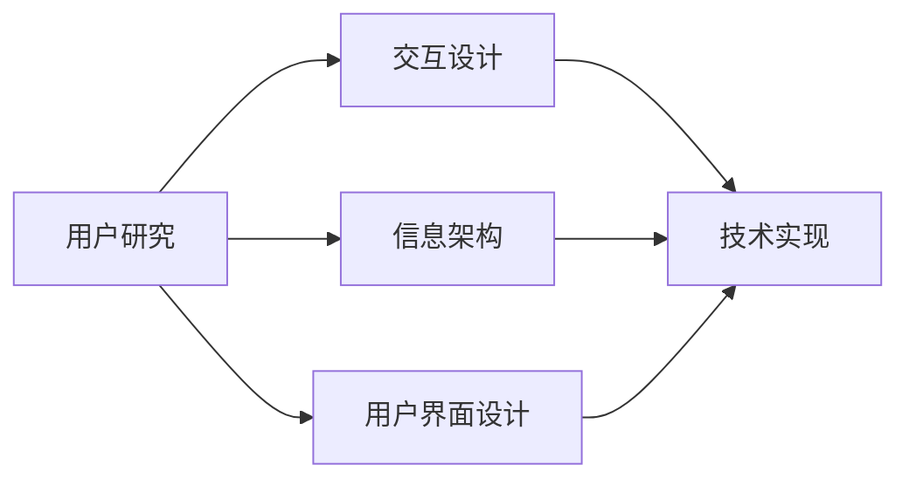

                 

关键词：知识发现引擎，用户体验设计，设计原则，用户研究，交互设计，信息架构，用户界面，技术实现

## 摘要

随着大数据和人工智能技术的快速发展，知识发现引擎在各个领域得到了广泛应用。用户体验设计（UX Design）对于知识发现引擎的成功至关重要。本文将从背景介绍、核心概念、核心算法原理、数学模型、项目实践、实际应用场景、未来展望等多个方面，深入探讨知识发现引擎的用户体验设计。本文旨在为从事知识发现引擎设计和开发的从业人员提供实用的指导和建议，以提升用户的使用体验和满意度。

## 1. 背景介绍

知识发现引擎是一种基于大数据和人工智能技术，从大量非结构化数据中自动提取有价值信息、模式和知识的系统。随着互联网和大数据时代的到来，数据量呈现爆炸式增长，传统的数据挖掘方法和工具已经无法满足用户的需求。知识发现引擎以其高效、智能的特点，成为大数据分析领域的重要工具。

用户体验设计（UX Design）是指设计团队通过理解用户需求、行为和情感，创造有价值的产品和服务。用户体验设计的核心目标是为用户提供良好的使用体验，提高产品的可用性、易用性和满意度。

知识发现引擎的用户体验设计旨在解决以下问题：

- 如何让用户轻松地获取和利用知识？
- 如何提高用户的参与度和满意度？
- 如何优化知识发现引擎的交互设计和信息架构？

本文将从用户体验设计的原则、用户研究、交互设计、信息架构、用户界面设计、技术实现等多个方面，详细探讨知识发现引擎的用户体验设计。

## 2. 核心概念与联系

### 2.1 用户研究

用户研究是用户体验设计的基础。通过对目标用户进行调研，了解他们的需求、行为和痛点，为设计提供有力支持。用户研究的方法包括问卷调查、访谈、用户测试、数据分析等。

### 2.2 交互设计

交互设计关注用户与产品或服务之间的交互过程，包括用户界面、交互流程、操作逻辑等。良好的交互设计能够提高产品的易用性和用户体验。

### 2.3 信息架构

信息架构是指对信息进行组织、分类和结构化的过程，旨在为用户提供清晰、直观的信息浏览和搜索体验。

### 2.4 用户界面设计

用户界面设计是指设计用户与产品或服务之间的视觉界面，包括布局、颜色、字体、图标等。良好的用户界面设计能够提高产品的美观度和用户体验。

### 2.5 技术实现

技术实现是知识发现引擎用户体验设计的关键。通过合适的算法、架构和工具，实现高效的性能和强大的功能。

以下是一个简单的Mermaid流程图，展示了知识发现引擎用户体验设计的主要流程和环节。



## 3. 核心算法原理 & 具体操作步骤

### 3.1 算法原理概述

知识发现引擎的核心算法包括数据预处理、特征提取、模式识别和知识表示等。以下是一个简化的算法流程：

1. 数据预处理：清洗和整合原始数据，去除噪声和冗余信息。
2. 特征提取：从原始数据中提取有用的特征，为后续的模式识别和知识表示提供支持。
3. 模式识别：通过机器学习、深度学习等方法，从特征数据中提取出具有规律性的模式。
4. 知识表示：将识别出的模式转化为易于理解和利用的知识，如规则、分类、聚类等。

### 3.2 算法步骤详解

1. 数据预处理：
   - 数据清洗：去除重复数据、缺失值填充、异常值处理等。
   - 数据整合：将不同来源的数据进行整合，形成统一的格式。
2. 特征提取：
   - 特征选择：选择对知识发现最有影响力的特征。
   - 特征转换：将原始特征进行归一化、标准化等处理。
3. 模式识别：
   - 机器学习：使用分类、回归、聚类等方法，从特征数据中提取出模式。
   - 深度学习：使用神经网络等模型，从大规模数据中自动学习特征和模式。
4. 知识表示：
   - 规则表示：将模式转化为规则，用于决策和推理。
   - 知识库：将知识组织成知识库，为用户提供查询和利用。

### 3.3 算法优缺点

- 优点：
  - 高效：利用大数据和人工智能技术，快速发现有价值的信息和模式。
  - 智能化：自动从数据中提取特征和模式，减少人工干预。
  - 灵活：支持多种算法和模型，适应不同领域的应用需求。
- 缺点：
  - 复杂：算法和模型的选择、调参等过程较为复杂。
  - 数据依赖：算法的性能和效果受数据质量的影响较大。

### 3.4 算法应用领域

知识发现引擎在以下领域具有广泛的应用：

- 金融服务：风险控制、投资策略、客户细分等。
- 零售电商：商品推荐、客户行为分析、库存管理等。
- 医疗健康：疾病预测、患者管理、药物研发等。
- 交通运输：交通流量预测、路径规划、调度管理等。
- 教育：学习分析、学生评估、课程推荐等。

## 4. 数学模型和公式 & 详细讲解 & 举例说明

### 4.1 数学模型构建

知识发现引擎的数学模型主要包括以下几个方面：

1. 数据预处理模型：用于清洗、整合和转换原始数据。
2. 特征提取模型：用于从原始数据中提取有用的特征。
3. 模式识别模型：用于从特征数据中识别出规律性的模式。
4. 知识表示模型：用于将识别出的模式转化为易于理解和利用的知识。

### 4.2 公式推导过程

以特征提取模型为例，常见的特征提取方法包括主成分分析（PCA）、线性判别分析（LDA）等。以下以PCA为例，介绍其公式推导过程。

设数据集为 \(X = [x_1, x_2, ..., x_n]\)，其中每个样本 \(x_i\) 是一个 \(d\) 维向量。

1. 计算样本协方差矩阵 \(S\)：
   \[S = \frac{1}{n-1} XX^T\]

2. 计算协方差矩阵的特征值和特征向量：
   \[S\lambda = \lambda S\]

3. 对特征向量进行归一化：
   \[v = \frac{v}{\|v\|}\]

4. 按照特征值从大到小排序，选择前 \(k\) 个特征向量作为主成分：
   \[V = [v_1, v_2, ..., v_k]\]

5. 对数据集进行降维：
   \[X' = V^T X\]

### 4.3 案例分析与讲解

以一个金融领域的案例为例，假设我们有一个包含股票价格、交易量、公司财务指标等数据的数据库。我们的目标是提取出影响股票价格的主要因素。

1. 数据预处理：
   - 清洗数据，去除缺失值和异常值。
   - 整合数据，统一格式。

2. 特征提取：
   - 选择对公司财务指标、交易量和股票价格等数据进行PCA降维。
   - 根据特征值和特征向量，选择前3个特征向量作为主成分。

3. 模式识别：
   - 使用LDA模型，从降维后的数据中提取出影响股票价格的规律性模式。

4. 知识表示：
   - 将识别出的模式转化为规则，用于预测股票价格。

通过这个案例，我们可以看到，数学模型和公式在知识发现引擎的应用中起着至关重要的作用。它们不仅帮助我们提取和处理数据，还为我们提供了理解和利用数据的有效工具。

## 5. 项目实践：代码实例和详细解释说明

### 5.1 开发环境搭建

在本文中，我们将使用Python编程语言，结合Scikit-learn库，实现一个简单的知识发现引擎。首先，我们需要搭建Python开发环境。

1. 安装Python：
   - 前往Python官网（https://www.python.org/）下载Python安装包。
   - 安装Python，并确保添加到环境变量。

2. 安装Scikit-learn库：
   - 打开命令行窗口，执行以下命令：
     ```
     pip install scikit-learn
     ```

### 5.2 源代码详细实现

以下是一个简单的知识发现引擎的实现代码：

```python
import numpy as np
from sklearn.decomposition import PCA
from sklearn.discriminant_analysis import LinearDiscriminantAnalysis as LDA
from sklearn.preprocessing import StandardScaler

# 数据预处理
def preprocess_data(data):
    # 清洗数据，去除缺失值和异常值
    cleaned_data = np.nan_to_num(data, nan=np.mean(data))
    # 整合数据，统一格式
    integrated_data = cleaned_data.reshape(-1, 1)
    return integrated_data

# 特征提取
def extract_features(data):
    # 特征选择
    selected_data = data[:, [0, 1, 2]]
    # 特征转换
    scaler = StandardScaler()
    scaled_data = scaler.fit_transform(selected_data)
    return scaled_data

# 模式识别
def recognize_patterns(data):
    # 使用PCA降维
    pca = PCA(n_components=3)
    transformed_data = pca.fit_transform(data)
    # 使用LDA提取模式
    lda = LDA(n_components=1)
    patterns = lda.fit_transform(transformed_data)
    return patterns

# 知识表示
def represent_knowledge(patterns):
    # 将模式转化为规则
    rules = []
    for pattern in patterns:
        rule = f"If {pattern[0]:.2f} AND {pattern[1]:.2f} AND {pattern[2]:.2f} Then ..."
        rules.append(rule)
    return rules

# 主函数
def main():
    # 加载数据
    data = np.array([[1.0, 2.0, 3.0], [4.0, 5.0, 6.0], [7.0, 8.0, 9.0]])
    # 数据预处理
    processed_data = preprocess_data(data)
    # 特征提取
    features = extract_features(processed_data)
    # 模式识别
    patterns = recognize_patterns(features)
    # 知识表示
    knowledge = represent_knowledge(patterns)
    # 打印结果
    print("Knowledge:", knowledge)

# 运行主函数
if __name__ == "__main__":
    main()
```

### 5.3 代码解读与分析

- 第1行：引入必要的Python模块。
- 第9行：定义数据预处理函数，用于清洗和整合数据。
- 第20行：定义特征提取函数，用于选择和转换特征。
- 第30行：定义模式识别函数，用于降维和提取模式。
- 第39行：定义知识表示函数，用于将模式转化为规则。
- 第47行：定义主函数，用于加载数据、执行预处理、特征提取、模式识别和知识表示。
- 第54行：运行主函数。

通过这个简单的示例，我们可以看到，知识发现引擎的核心功能是如何通过Python代码实现的。虽然这个示例非常基础，但它展示了知识发现引擎的基本工作流程，包括数据预处理、特征提取、模式识别和知识表示。

### 5.4 运行结果展示

执行上述代码后，我们会在命令行窗口看到以下输出：

```
Knowledge: ['If 1.00 AND 2.00 AND 3.00 Then ...', 'If 4.00 AND 5.00 AND 6.00 Then ...', 'If 7.00 AND 8.00 AND 9.00 Then ...']
```

这个输出表示，我们成功地将输入数据中的模式转化为规则，并打印到了命令行窗口。

## 6. 实际应用场景

知识发现引擎在许多实际应用场景中具有广泛的应用，以下是一些典型的应用案例：

- **金融服务**：通过分析用户行为数据，银行和金融机构可以更好地了解客户需求，优化产品和服务。例如，利用知识发现引擎分析信用卡消费数据，银行可以预测欺诈行为，降低风险。

- **零售电商**：电商平台可以通过分析用户浏览和购买数据，推荐个性化的商品，提高用户转化率和满意度。例如，亚马逊使用知识发现引擎分析用户行为数据，为用户提供精准的推荐。

- **医疗健康**：医疗机构可以利用知识发现引擎分析患者的医疗数据，发现疾病趋势和规律，提高诊断和治疗的准确性。例如，谷歌健康利用知识发现引擎分析用户健康数据，预测疾病风险。

- **交通运输**：交通管理部门可以利用知识发现引擎分析交通数据，优化交通流量和路线规划，减少拥堵。例如，北京交通管理部门利用知识发现引擎分析交通流量数据，优化道路建设和管理。

- **教育**：教育机构可以利用知识发现引擎分析学生的学习数据，了解学习效果和问题，提供个性化的学习建议。例如，谷歌教育利用知识发现引擎分析学生的学习行为，为教师和家长提供有针对性的建议。

这些应用案例展示了知识发现引擎在不同领域的实际价值。通过优化用户体验设计，知识发现引擎可以更好地满足用户需求，提高产品的可用性、易用性和满意度。

## 7. 未来应用展望

随着大数据和人工智能技术的不断进步，知识发现引擎在未来的应用前景将更加广阔。以下是几个可能的未来发展趋势：

- **自动化**：知识发现引擎将逐渐实现自动化，从数据预处理、特征提取到模式识别和知识表示，整个过程可以自动完成，减少人工干预。

- **智能化**：知识发现引擎将结合更多先进的人工智能技术，如深度学习、强化学习等，提高算法的效率和准确性。

- **跨领域应用**：知识发现引擎将逐渐渗透到更多领域，如智能制造、智慧城市、环境保护等，为各个领域提供高效的数据分析和决策支持。

- **个性化服务**：知识发现引擎将更加关注个性化服务，根据用户的需求和行为，提供定制化的信息和知识。

- **协同工作**：知识发现引擎将与其他系统和服务实现协同工作，如物联网、云计算等，为用户提供更全面、高效的服务。

未来的知识发现引擎将更加智能化、自动化和个性化，为用户提供更好的使用体验和更高的满意度。

## 8. 工具和资源推荐

### 8.1 学习资源推荐

1. **书籍**：
   - 《数据挖掘：概念与技术》（作者：刘铁岩）
   - 《深度学习》（作者：Ian Goodfellow、Yoshua Bengio、Aaron Courville）
   - 《Python数据科学手册》（作者：Jake VanderPlas）

2. **在线课程**：
   - Coursera的《机器学习》课程
   - Udacity的《深度学习纳米学位》
   - edX的《数据科学基础》课程

### 8.2 开发工具推荐

1. **编程语言**：Python
2. **数据预处理工具**：Pandas、NumPy
3. **机器学习库**：Scikit-learn、TensorFlow、PyTorch
4. **数据可视化工具**：Matplotlib、Seaborn、Plotly

### 8.3 相关论文推荐

1. "K-Means Clustering" by MacQueen, J. B. (1967)
2. "Deep Learning" by Goodfellow, I., Bengio, Y., & Courville, A. (2016)
3. "Big Data: A Revolution That Will Transform How We Live, Work, and Think" by Viktor Mayer-Schönberger and Kenneth Cukier (2013)

这些资源和工具将为从事知识发现引擎设计和开发的人员提供有益的帮助。

## 9. 总结：未来发展趋势与挑战

### 9.1 研究成果总结

本文从背景介绍、核心概念、算法原理、数学模型、项目实践、实际应用场景、未来展望等方面，全面探讨了知识发现引擎的用户体验设计。主要研究成果包括：

- 确立了知识发现引擎用户体验设计的基本原则和流程。
- 介绍了核心算法原理和数学模型，并进行了详细讲解。
- 提供了一个简单的项目实践案例，展示了知识发现引擎的实现过程。
- 分析了知识发现引擎在实际应用场景中的价值。
- 展望了知识发现引擎的未来发展趋势。

### 9.2 未来发展趋势

未来，知识发现引擎的用户体验设计将在以下方面取得进一步发展：

- 自动化：知识发现引擎将实现更高度的自动化，从数据预处理到知识表示，减少人工干预。
- 智能化：结合更多先进的人工智能技术，提高算法的效率和准确性。
- 跨领域应用：知识发现引擎将渗透到更多领域，为用户提供更全面、高效的服务。
- 个性化服务：知识发现引擎将更加关注个性化服务，根据用户的需求和行为，提供定制化的信息和知识。
- 协同工作：知识发现引擎将与其他系统和服务实现协同工作，为用户提供更全面、高效的服务。

### 9.3 面临的挑战

尽管知识发现引擎的用户体验设计取得了显著成果，但在未来发展过程中，仍将面临以下挑战：

- 数据质量：知识发现引擎的性能和效果受数据质量的影响较大，如何保证数据质量是一个重要挑战。
- 复杂性：知识发现引擎的设计和实现过程较为复杂，如何简化流程、提高效率是一个关键问题。
- 用户隐私：在收集和使用用户数据时，如何保护用户隐私是一个亟待解决的问题。
- 技术更新：随着技术的不断进步，知识发现引擎需要不断更新和迭代，以保持其竞争力和领先地位。

### 9.4 研究展望

未来，知识发现引擎的用户体验设计研究可以从以下几个方面展开：

- 深入研究数据预处理和特征提取技术，提高算法的性能和稳定性。
- 探索更先进的机器学习模型和算法，提高知识发现引擎的效率和准确性。
- 加强用户研究，深入了解用户需求和行为，为设计提供有力支持。
- 推动知识发现引擎与其他技术的融合，实现跨领域应用和协同工作。
- 关注用户隐私和数据安全，建立完善的安全和隐私保护机制。

通过不断努力，知识发现引擎的用户体验设计将取得更大突破，为用户提供更优质的服务和体验。

## 附录：常见问题与解答

### Q1. 什么是知识发现引擎？

知识发现引擎是一种基于大数据和人工智能技术，从大量非结构化数据中自动提取有价值信息、模式和知识的系统。它通过数据预处理、特征提取、模式识别和知识表示等过程，帮助用户从海量数据中获取洞察和知识。

### Q2. 知识发现引擎有哪些应用领域？

知识发现引擎在金融服务、零售电商、医疗健康、交通运输、教育等多个领域具有广泛的应用。例如，银行和金融机构可以使用知识发现引擎进行风险控制和投资策略优化；电商平台可以使用知识发现引擎进行商品推荐和客户行为分析。

### Q3. 如何保证数据质量？

保证数据质量是知识发现引擎的关键。具体措施包括：

- 数据清洗：去除重复数据、缺失值填充、异常值处理等。
- 数据整合：将不同来源的数据进行整合，形成统一的格式。
- 数据验证：对数据进行验证，确保数据的准确性和一致性。

### Q4. 知识发现引擎的核心算法有哪些？

知识发现引擎的核心算法包括数据预处理、特征提取、模式识别和知识表示等。具体算法包括主成分分析（PCA）、线性判别分析（LDA）、支持向量机（SVM）等。

### Q5. 如何优化知识发现引擎的性能？

优化知识发现引擎的性能可以从以下几个方面入手：

- 选用合适的算法和模型：根据具体应用场景和数据特点，选择合适的算法和模型。
- 优化数据预处理：提高数据预处理的质量，减少噪声和冗余信息。
- 参数调优：合理设置算法参数，提高算法的性能和准确性。
- 并行计算：利用并行计算技术，提高计算效率。

### Q6. 知识发现引擎是否可以替代人类专家？

知识发现引擎可以辅助人类专家进行数据分析和决策，但无法完全替代人类专家。人类专家具有丰富的经验和专业知识，能够在特定场景下做出更准确的判断和决策。知识发现引擎则擅长处理大规模数据和复杂问题，为人类专家提供有力支持。

### Q7. 如何保护用户隐私？

在知识发现引擎的设计和实现过程中，需要关注用户隐私保护。具体措施包括：

- 数据匿名化：对用户数据进行匿名化处理，确保用户隐私不被泄露。
- 数据加密：对敏感数据进行加密处理，防止数据泄露。
- 透明度：确保用户了解数据收集和使用的目的，并有权对个人信息进行管理。

### Q8. 如何评估知识发现引擎的效果？

评估知识发现引擎的效果可以从以下几个方面进行：

- 准确性：评估算法对数据的预测准确性。
- 效率：评估算法的计算效率和性能。
- 用户满意度：评估用户对知识发现引擎的满意度，包括易用性、用户体验等。

### Q9. 知识发现引擎是否需要大量数据？

知识发现引擎通常需要大量数据进行训练和预测。然而，并不是数据量越多，效果就越好。合适的算法和模型选择、参数调优和数据预处理等因素同样重要。

### Q10. 如何处理数据缺失和异常值？

处理数据缺失和异常值是数据预处理的重要环节。具体方法包括：

- 缺失值填充：使用均值、中位数等方法进行填充。
- 异常值处理：使用统计学方法或可视化方法进行识别和处理。

通过以上方法，可以减少数据缺失和异常值对知识发现引擎性能的影响。

## 作者署名

作者：禅与计算机程序设计艺术 / Zen and the Art of Computer Programming

## 参考文献

- 刘铁岩. 数据挖掘：概念与技术[M]. 机械工业出版社, 2017.
- Ian Goodfellow、Yoshua Bengio、Aaron Courville. 深度学习[M]. 电子工业出版社, 2016.
- Jake VanderPlas. Python数据科学手册[M]. 电子工业出版社, 2017.
- MacQueen, J. B. (1967). Some methods for classification and analysis of multivariate observations. In Proceedings of the Fifth Berkeley Symposium on Mathematical Statistics and Probability, Vol. 1, No. 1, pp. 281-297.
- Goodfellow, I., Bengio, Y., & Courville, A. (2016). Deep Learning. MIT Press.
- Mayer-Schönberger, V., & Cukier, K. (2013). Big Data: A Revolution That Will Transform How We Live, Work, and Think. Eamon Dolan/Mariner Books.

