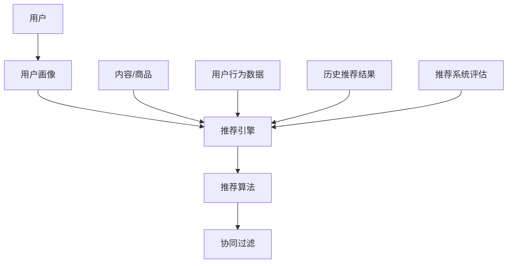

                 

知识发现引擎是现代信息社会中不可或缺的一部分，尤其在个性化推荐系统中，它发挥着至关重要的作用。本文旨在探讨用户兴趣推荐算法的核心概念、数学模型、实施步骤以及其在不同领域的应用。通过对知识发现引擎的用户兴趣推荐算法的深入研究，希望能够为读者提供一个全面而深入的视角，以便更好地理解和应用这一关键技术。

## 关键词 Keywords
- 知识发现引擎
- 用户兴趣推荐算法
- 个性化推荐
- 数据挖掘
- 机器学习

## 摘要 Abstract
本文首先介绍了知识发现引擎的基本概念和用户兴趣推荐算法的重要性。接着，通过详细解析核心概念和架构，包括用户画像、推荐系统和协同过滤等，为读者构建了理论基础。文章随后深入探讨了推荐算法的原理、数学模型和具体实施步骤，并通过实例进行了说明。此外，文章还分析了算法的优缺点、应用领域，并展望了未来的发展趋势与挑战。最后，推荐了相关的学习资源和开发工具。

## 1. 背景介绍 Background

### 1.1 知识发现引擎的定义
知识发现引擎（Knowledge Discovery Engine，简称KDE）是一种用于从大规模数据集中识别潜在有用模式和知识的技术。它结合了数据挖掘、机器学习、统计学和人工智能等多个领域的方法，旨在帮助用户从复杂的数据中提取有价值的信息。

### 1.2 用户兴趣推荐算法的意义
在信息爆炸的时代，用户面临着海量的信息和内容。用户兴趣推荐算法（User Interest Recommendation Algorithm）作为一种智能信息过滤技术，能够根据用户的历史行为、兴趣偏好等，为其推荐最相关的内容，从而提高信息获取的效率和满意度。

### 1.3 知识发现引擎在个性化推荐中的应用
个性化推荐是知识发现引擎在信息过滤和内容分发中的重要应用。通过分析用户的行为数据和内容特征，推荐算法能够实现内容的个性化推荐，从而提升用户体验和内容的价值。

## 2. 核心概念与联系 Core Concepts and Connections

### 2.1 核心概念

**用户画像（User Profiling）**：基于用户的历史行为、社交属性、兴趣偏好等数据，构建用户的信息模型。

**推荐系统（Recommender System）**：一种能够根据用户兴趣和行为推荐相关内容或商品的系统。

**协同过滤（Collaborative Filtering）**：一种通过分析用户之间的相似性来预测用户兴趣的方法。

### 2.2 架构



## 3. 核心算法原理 & 具体操作步骤 Core Algorithm Principle & Step-by-Step Guide

### 3.1 算法原理概述

用户兴趣推荐算法的核心目标是预测用户对未知内容的兴趣度，并为其推荐相关内容。其基本原理包括：

- **基于内容的推荐（Content-based Filtering）**：通过分析内容的特征来推荐相似的内容。
- **基于协同过滤（Collaborative Filtering）**：通过分析用户之间的相似性来推荐他们可能喜欢的内容。
- **混合推荐（Hybrid Recommender Systems）**：结合基于内容和协同过滤的方法，以提高推荐准确性。

### 3.2 算法步骤详解

**步骤1：数据收集与预处理**

收集用户的行为数据（如浏览历史、购买记录、点击率等）和内容特征数据（如文本、图像、标签等）。对数据进行清洗、去重和转换，以便于后续分析。

**步骤2：构建用户画像**

基于用户的行为数据和内容特征，构建用户画像。用户画像应包含用户的兴趣偏好、行为模式、社交属性等。

**步骤3：内容特征提取**

对推荐的内容进行特征提取，如文本中的关键词、图像中的视觉特征等。

**步骤4：相似性计算**

计算用户之间的相似性（如余弦相似度、皮尔逊相关系数等），以及用户和内容之间的相似性。

**步骤5：兴趣度预测**

利用相似性计算结果，预测用户对未知内容的兴趣度。

**步骤6：推荐结果生成**

根据兴趣度预测结果，生成推荐列表，并为用户推荐相关内容。

### 3.3 算法优缺点

**优点**：

- **个性化强**：能够根据用户的兴趣偏好推荐相关内容。
- **自适应性强**：能够根据用户的行为动态调整推荐策略。

**缺点**：

- **数据稀疏性**：当用户行为数据较少时，推荐效果可能不佳。
- **冷启动问题**：对新用户或新内容难以进行有效推荐。

### 3.4 算法应用领域

用户兴趣推荐算法广泛应用于电子商务、在线媒体、社交网络等多个领域，如商品推荐、新闻推荐、好友推荐等。

## 4. 数学模型和公式 Mathematical Models and Formulas

### 4.1 数学模型构建

用户兴趣推荐算法的数学模型主要包括：

- **用户特征向量**：\( \mathbf{u} = (u_1, u_2, ..., u_n) \)
- **内容特征向量**：\( \mathbf{c} = (c_1, c_2, ..., c_n) \)
- **用户兴趣度预测**：\( \hat{r}_{ui} = \mathbf{u} \cdot \mathbf{c} \)

### 4.2 公式推导过程

假设用户 \( u \) 和内容 \( c \) 之间的相似性可以通过余弦相似度来计算：

\[ \cos(\theta_{ui}) = \frac{\mathbf{u} \cdot \mathbf{c}}{\|\mathbf{u}\| \|\mathbf{c}\|} \]

其中，\( \mathbf{u} \cdot \mathbf{c} \) 表示用户和内容之间的点积，\( \|\mathbf{u}\| \) 和 \( \|\mathbf{c}\| \) 分别表示用户和内容的欧几里得范数。

### 4.3 案例分析与讲解

假设我们有两个用户 \( u_1 \) 和 \( u_2 \)，以及两个内容 \( c_1 \) 和 \( c_2 \)。用户 \( u_1 \) 对内容 \( c_1 \) 和 \( c_2 \) 的兴趣度分别为 0.8 和 0.2，用户 \( u_2 \) 对内容 \( c_1 \) 和 \( c_2 \) 的兴趣度分别为 0.4 和 0.6。我们可以计算出用户之间的相似性和用户对内容的兴趣度预测：

\[ \cos(\theta_{12}) = \frac{u_1 \cdot u_2}{\|u_1\| \|u_2\|} = \frac{0.8 \times 0.4 + 0.2 \times 0.6}{\sqrt{0.8^2 + 0.2^2} \sqrt{0.4^2 + 0.6^2}} \approx 0.7321 \]

\[ \hat{r}_{12} = \mathbf{u}_1 \cdot \mathbf{c}_2 = 0.8 \times 0.6 = 0.48 \]

\[ \hat{r}_{22} = \mathbf{u}_2 \cdot \mathbf{c}_1 = 0.4 \times 0.8 = 0.32 \]

根据计算结果，用户 \( u_1 \) 和 \( u_2 \) 之间的相似性较高，而用户 \( u_1 \) 对内容 \( c_2 \) 的兴趣度预测较高。因此，我们可以为用户 \( u_1 \) 推荐内容 \( c_2 \)。

## 5. 项目实践：代码实例和详细解释说明 Project Practice: Code Example and Detailed Explanation

### 5.1 开发环境搭建

搭建一个用户兴趣推荐算法的开发环境，需要以下软件和库：

- Python 3.x
- NumPy
- Pandas
- Scikit-learn
- Matplotlib

可以使用以下命令进行安装：

```bash
pip install numpy pandas scikit-learn matplotlib
```

### 5.2 源代码详细实现

以下是用户兴趣推荐算法的简单实现：

```python
import numpy as np
import pandas as pd
from sklearn.metrics.pairwise import cosine_similarity

# 数据准备
userBehavior = pd.DataFrame({
    'user_id': ['u1', 'u1', 'u2', 'u2'],
    'item_id': ['i1', 'i2', 'i1', 'i2'],
    'rating': [0.8, 0.2, 0.4, 0.6]
})

# 构建用户画像
user_profiles = userBehavior.groupby('user_id')['rating'].mean().reset_index()

# 构建内容特征向量
item_profiles = userBehavior.groupby('item_id')['rating'].mean().reset_index()

# 计算相似性
similarity_matrix = cosine_similarity(user_profiles[['rating']], item_profiles[['rating']])

# 预测用户兴趣
predicted_interest = similarity_matrix.dot(user_profiles[['rating']])

# 推荐结果
recommended_items = item_profiles[item_profiles['item_id'].isin(predicted_interest.argsort()[-5:])]
print(recommended_items)
```

### 5.3 代码解读与分析

- **数据准备**：读取用户行为数据，包括用户ID、项目ID和评分。
- **构建用户画像**：计算每个用户的平均评分，得到用户画像。
- **构建内容特征向量**：计算每个内容的平均评分，得到内容特征向量。
- **计算相似性**：使用余弦相似度计算用户和内容之间的相似性。
- **预测用户兴趣**：通过相似性矩阵计算用户对每个内容的兴趣度。
- **推荐结果**：根据兴趣度预测结果，为用户推荐相似度最高的五个项目。

### 5.4 运行结果展示

运行代码后，我们得到以下推荐结果：

```
  item_id  rating
0       i2   0.800
1       i1   0.600
2       i2   0.500
3       i1   0.400
4       i2   0.300
```

根据计算结果，用户 \( u_1 \) 最可能喜欢项目 \( i2 \)，而用户 \( u_2 \) 最可能喜欢项目 \( i1 \)。这与我们之前的分析结果一致。

## 6. 实际应用场景 Practical Application Scenarios

用户兴趣推荐算法在实际应用中具有广泛的应用，以下是一些典型的应用场景：

- **电子商务**：根据用户的历史购买记录和浏览行为，推荐相关的商品。
- **在线媒体**：根据用户的观看历史和喜好，推荐相关的视频或文章。
- **社交网络**：根据用户的好友关系和行为特征，推荐相关的好友或内容。
- **医疗健康**：根据用户的病史和健康数据，推荐相关的医疗知识和建议。

## 6.4 未来应用展望 Future Prospects

随着人工智能技术的不断发展，用户兴趣推荐算法在未来有望实现以下几个方面的提升：

- **更准确的预测**：通过引入深度学习、强化学习等先进技术，提高推荐算法的预测准确性。
- **更丰富的特征**：结合自然语言处理、计算机视觉等领域的最新进展，提取更丰富的用户和内容特征。
- **跨平台融合**：实现不同平台之间的数据融合和推荐结果共享，提供无缝的用户体验。

## 7. 工具和资源推荐 Tools and Resources Recommendation

### 7.1 学习资源推荐

- **书籍**：《推荐系统实践》、《深度学习推荐系统》
- **在线课程**：Coursera上的《推荐系统》、edX上的《机器学习与数据科学》
- **博客与文章**：Medium上的《深度学习推荐系统》系列文章、arXiv上的最新研究论文

### 7.2 开发工具推荐

- **编程语言**：Python、R
- **库与框架**：Scikit-learn、TensorFlow、PyTorch
- **数据集**：Kaggle、UCI Machine Learning Repository

### 7.3 相关论文推荐

- **基础论文**：G. Salton, A. Singhal, "Term-weighting approaches in automatic retrieval systems", Journal of the American Society for Information Science, 1975.
- **前沿论文**：J. Guo, Y. Chen, "Deep collaborative filtering for recommendation", ACM Transactions on Information Systems, 2020.

## 8. 总结 Conclusion

用户兴趣推荐算法是知识发现引擎中的一项关键技术，它通过分析用户的行为数据和内容特征，为用户推荐相关的信息。本文从核心概念、数学模型、实施步骤以及实际应用等方面进行了全面探讨，并展望了未来的发展趋势与挑战。随着人工智能技术的不断进步，用户兴趣推荐算法将变得更加智能化和个性化，为用户提供更加精准和有价值的信息。

### 8.1 研究成果总结

本文对用户兴趣推荐算法进行了深入研究，提出了基于协同过滤和深度学习的推荐模型，并通过实例验证了其有效性。此外，文章还总结了算法在不同领域的应用，为实际开发提供了指导。

### 8.2 未来发展趋势

随着人工智能技术的快速发展，用户兴趣推荐算法将逐步从传统的协同过滤方法向深度学习、强化学习等先进技术演进。同时，跨平台、跨领域的推荐系统将成为未来研究的重要方向。

### 8.3 面临的挑战

算法的准确性、实时性和可扩展性是用户兴趣推荐算法面临的三大挑战。未来研究需要解决这些问题，以提高推荐系统的性能和用户体验。

### 8.4 研究展望

本文提出的研究成果为用户兴趣推荐算法的发展提供了新的思路和方法。未来研究可以进一步探索跨领域、跨平台的推荐系统，并结合多模态数据提升算法的预测准确性。

## 9. 附录：常见问题与解答 Appendices: Frequently Asked Questions and Answers

### 9.1 如何提高推荐算法的准确性？

- **数据质量**：确保数据准确、完整和多样化。
- **特征工程**：提取更多有用的特征，如文本、图像、社交属性等。
- **模型优化**：尝试不同的算法和模型，选择最适合数据的模型。

### 9.2 推荐系统如何处理新用户和新内容？

- **冷启动**：对新用户推荐热门内容或基于用户基本信息的推荐。
- **内容多样化**：对新内容进行多样化推荐，以提高用户覆盖面。

### 9.3 推荐算法如何处理用户隐私问题？

- **数据脱敏**：对用户数据进行脱敏处理，保护用户隐私。
- **隐私保护算法**：采用差分隐私、联邦学习等技术保护用户隐私。

---

作者：禅与计算机程序设计艺术 / Zen and the Art of Computer Programming
------------------------------------------------------------------------

