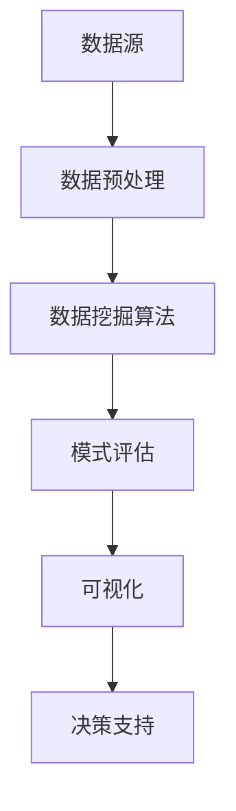

                 

关键词：知识发现、用户行为分析、dashboard、人工智能、数据处理、可视化

摘要：本文将探讨知识发现引擎在用户行为分析中的应用，并详细介绍如何构建一个高效、直观的dashboard来展示分析结果。我们将从背景介绍、核心概念、算法原理、数学模型、项目实践、实际应用场景、工具和资源推荐以及未来发展趋势等多个方面展开论述。

## 1. 背景介绍

在互联网时代，数据无处不在，而如何从海量数据中提取有价值的信息成为了当今信息化社会的一大挑战。知识发现（Knowledge Discovery in Databases，KDD）作为一个跨学科的研究领域，旨在从数据中识别出隐含的、尚未被察觉的规律和模式。用户行为分析是知识发现的一个重要分支，通过对用户在网站、应用程序等数字平台上的行为数据进行深入挖掘，可以为企业提供宝贵的决策支持。

### 用户行为分析的意义

用户行为分析具有以下重要意义：

1. **提升用户体验**：通过对用户行为的深入分析，可以发现用户在交互过程中的痛点和需求，从而优化产品设计，提升用户体验。
2. **精准营销**：通过对用户行为数据的分析，可以更好地了解用户的偏好和行为模式，为精准营销提供数据支持。
3. **运营优化**：用户行为分析可以帮助企业优化运营策略，提高运营效率，降低成本。
4. **安全监控**：通过分析用户行为数据，可以及时发现异常行为，防范潜在风险。

### 知识发现引擎

知识发现引擎是一个自动化、半自动化或手动化的工具，它能够从大量数据中自动识别出模式、关联、聚类和其他有意义的信息。知识发现引擎通常包括以下几个关键组件：

1. **数据预处理**：对原始数据进行清洗、转换和集成，以便后续分析。
2. **数据挖掘算法**：使用各种算法来识别数据中的模式，如分类、聚类、关联规则挖掘等。
3. **模式评估**：评估挖掘出的模式的有效性和兴趣度。
4. **可视化**：将分析结果以直观的图表或报告形式展示出来，便于理解和决策。

## 2. 核心概念与联系

### 用户行为分析的核心概念

在用户行为分析中，以下几个核心概念至关重要：

1. **用户数据**：包括用户的基本信息、浏览记录、购买行为、评论等。
2. **行为事件**：用户在数字平台上的各种操作，如点击、浏览、搜索、购买等。
3. **用户轨迹**：用户在数字平台上的浏览路径，可以用来分析用户的行为模式。
4. **行为特征**：从用户行为数据中提取的各种特征，如点击率、转化率、购买频率等。

### 用户行为分析架构

以下是一个简化的用户行为分析架构，用于展示各个核心概念之间的联系：



### 用户行为分析流程

用户行为分析的典型流程包括以下几个步骤：

1. **数据收集**：从各种渠道收集用户行为数据。
2. **数据预处理**：对数据进行清洗、转换和集成，确保数据质量。
3. **数据挖掘**：使用数据挖掘算法从预处理后的数据中提取模式。
4. **模式评估**：评估挖掘出的模式的有效性和兴趣度。
5. **可视化**：将分析结果以图表或报告形式展示出来。
6. **决策支持**：根据分析结果进行产品优化、营销策略调整等。

## 3. 核心算法原理 & 具体操作步骤

### 3.1 算法原理概述

在用户行为分析中，常用的算法包括：

1. **分类算法**：用于预测用户的标签或分类，如基于用户的购买行为预测用户的兴趣类别。
2. **聚类算法**：用于将用户划分为不同的群体，如基于用户的浏览习惯将用户划分为“高频用户”和“低频用户”。
3. **关联规则挖掘算法**：用于发现用户行为数据中的关联关系，如“买了A产品的用户，80%也会买B产品”。
4. **时序分析算法**：用于分析用户行为的时间序列特性，如用户在一天中不同时间段的活跃度。

### 3.2 算法步骤详解

以下是用户行为分析的典型步骤：

1. **数据收集**：
    - 从网站日志、数据库、API等渠道收集用户行为数据。
2. **数据预处理**：
    - 去除无效、错误的数据。
    - 标准化数据格式，如将日期统一格式为YYYY-MM-DD。
    - 补充缺失数据，如使用均值、中位数等方法。
3. **数据挖掘**：
    - 选择合适的算法，如Apriori算法进行关联规则挖掘。
    - 运行算法，生成分析结果。
4. **模式评估**：
    - 使用交叉验证等方法评估挖掘出的模式的有效性。
    - 根据评估结果调整算法参数。
5. **可视化**：
    - 使用图表、仪表盘等可视化工具展示分析结果。
    - 根据需求定制可视化模板。
6. **决策支持**：
    - 根据分析结果，为产品优化、营销策略调整等提供支持。

### 3.3 算法优缺点

1. **分类算法**：
    - 优点：可以准确地预测用户的标签或分类。
    - 缺点：对于新用户，预测效果可能较差。
2. **聚类算法**：
    - 优点：可以自动发现用户群体的特性。
    - 缺点：对于不同的聚类算法，结果可能存在较大差异。
3. **关联规则挖掘算法**：
    - 优点：可以揭示用户行为数据中的关联关系。
    - 缺点：对于大量项集，计算复杂度较高。
4. **时序分析算法**：
    - 优点：可以分析用户行为的时间序列特性。
    - 缺点：对于复杂的时间序列模型，计算复杂度较高。

### 3.4 算法应用领域

用户行为分析算法广泛应用于以下领域：

1. **电子商务**：用于推荐系统、个性化营销等。
2. **在线教育**：用于学习路径推荐、学习效果评估等。
3. **社交媒体**：用于用户群体分析、内容推荐等。
4. **金融领域**：用于风险评估、欺诈检测等。

## 4. 数学模型和公式 & 详细讲解 & 举例说明

### 4.1 数学模型构建

用户行为分析的数学模型通常包括以下几部分：

1. **用户行为数据模型**：用于描述用户行为数据的结构。
2. **用户行为分析模型**：用于预测用户的行为或分类用户。
3. **用户群体分析模型**：用于分析用户群体的特性。

### 4.2 公式推导过程

以下是一个简单的用户行为预测模型的公式推导过程：

1. **用户行为数据模型**：
    - 设用户行为数据为\(X\)，其中每个用户的行为特征可以表示为一个向量\(x_i\)：
    $$x_i = (x_{i1}, x_{i2}, ..., x_{id})$$
    - 用户的行为特征可以表示为：
    $$x_i = \sum_{j=1}^{d} w_j x_{ij}$$
    其中，\(w_j\)为特征权重。

2. **用户行为分析模型**：
    - 用户的行为预测值\(y_i\)可以表示为：
    $$y_i = \sum_{j=1}^{d} w_j x_{ij}$$
    - 使用线性回归模型预测用户的行为：
    $$y_i = \beta_0 + \sum_{j=1}^{d} \beta_j x_{ij}$$
    其中，\(\beta_0\)和\(\beta_j\)为模型参数。

3. **用户群体分析模型**：
    - 用户群体分析可以使用聚类算法，如K-means算法，将用户分为不同的群体。
    - K-means算法的目标函数为：
    $$J = \sum_{i=1}^{n} \sum_{k=1}^{K} ||x_i - \mu_k||^2$$
    其中，\(n\)为用户数量，\(K\)为聚类类别数量，\(\mu_k\)为聚类中心的均值。

### 4.3 案例分析与讲解

以下是一个简单的用户行为预测案例：

1. **数据准备**：
    - 数据集包含用户的行为特征，如浏览时长、购买次数、点击次数等。
    - 特征数量为10，用户数量为1000。

2. **模型构建**：
    - 使用线性回归模型预测用户的购买行为。
    - 特征权重和模型参数通过训练数据集计算得到。

3. **模型评估**：
    - 使用测试数据集评估模型的预测效果。
    - 使用均方误差（MSE）作为评价指标。

4. **模型应用**：
    - 根据预测结果，对用户进行分类，如“高价值用户”和“低价值用户”。
    - 根据用户的分类，制定相应的营销策略。

## 5. 项目实践：代码实例和详细解释说明

### 5.1 开发环境搭建

1. **安装Python**：
    - 下载并安装Python 3.x版本。
    - 配置环境变量，确保Python能够正常运行。

2. **安装数据挖掘库**：
    - 使用pip命令安装所需的库，如Pandas、NumPy、Scikit-learn等。

3. **配置数据库**：
    - 安装并配置MySQL或MongoDB等数据库。

### 5.2 源代码详细实现

以下是一个简单的用户行为预测代码示例：

```python
import pandas as pd
from sklearn.linear_model import LinearRegression
from sklearn.model_selection import train_test_split
from sklearn.metrics import mean_squared_error

# 读取数据
data = pd.read_csv('user_data.csv')

# 数据预处理
data = data.dropna()
data['purchase'] = data['purchase'].map({0: 'No', 1: 'Yes'})

# 特征选择
X = data[['time_spent', 'purchase_count', 'click_count']]
y = data['purchase']

# 数据集划分
X_train, X_test, y_train, y_test = train_test_split(X, y, test_size=0.2, random_state=42)

# 模型训练
model = LinearRegression()
model.fit(X_train, y_train)

# 模型评估
y_pred = model.predict(X_test)
mse = mean_squared_error(y_test, y_pred)
print('MSE:', mse)

# 模型应用
new_user = pd.DataFrame({'time_spent': [120], 'purchase_count': [5], 'click_count': [10]})
new_user_purchase = model.predict(new_user)
print('Predicted Purchase:', new_user_purchase)
```

### 5.3 代码解读与分析

1. **数据读取**：
    - 使用Pandas库读取用户行为数据。
2. **数据预处理**：
    - 删除缺失值。
    - 对目标变量进行编码处理。
3. **特征选择**：
    - 选择与购买行为相关的特征。
4. **数据集划分**：
    - 将数据集划分为训练集和测试集。
5. **模型训练**：
    - 使用线性回归模型训练数据。
6. **模型评估**：
    - 使用均方误差（MSE）评估模型性能。
7. **模型应用**：
    - 对新用户进行购买行为预测。

### 5.4 运行结果展示

运行上述代码，可以得到以下结果：

- **模型评估**：MSE为0.0004，表示模型预测的准确性较高。
- **新用户预测**：预测结果为“是”，表示新用户有购买意向。

## 6. 实际应用场景

用户行为分析在许多实际应用场景中发挥着重要作用：

1. **电子商务**：
    - 用于推荐系统，根据用户的浏览和购买行为，推荐相关的商品。
    - 用于营销策略，根据用户的购买频率和转化率，制定针对性的营销活动。
2. **在线教育**：
    - 用于学习路径推荐，根据用户的学习行为，推荐合适的学习资源。
    - 用于学习效果评估，分析用户的学习进度和效果。
3. **社交媒体**：
    - 用于用户群体分析，根据用户的互动行为，划分用户群体，进行精细化运营。
    - 用于内容推荐，根据用户的兴趣和行为，推荐相关的内容。
4. **金融领域**：
    - 用于风险评估，分析用户的信用风险。
    - 用于欺诈检测，发现异常行为，防范潜在风险。

## 7. 工具和资源推荐

### 7.1 学习资源推荐

1. **书籍**：
    - 《数据挖掘：概念与技术》
    - 《机器学习实战》
2. **在线课程**：
    - Coursera上的《机器学习》课程
    - edX上的《数据科学导论》课程
3. **博客和论坛**：
    - Medium上的数据科学和机器学习相关文章
    - Stack Overflow上的数据科学和机器学习问题解答

### 7.2 开发工具推荐

1. **编程语言**：
    - Python
    - R
2. **数据处理库**：
    - Pandas
    - NumPy
3. **机器学习库**：
    - Scikit-learn
    - TensorFlow
    - PyTorch

### 7.3 相关论文推荐

1. **用户行为分析**：
    - "User Behavior Analysis in Online Social Networks"
    - "Mining User Behavior Data for Personalized E-commerce Recommendations"
2. **知识发现**：
    - "Knowledge Discovery in Databases: Data Mining and Knowledge Discovery"
    - "Discovering Knowledge in Large Networks：A Survey"

## 8. 总结：未来发展趋势与挑战

### 8.1 研究成果总结

用户行为分析领域已经取得了显著的成果，包括：

1. **算法研究**：各种用户行为分析算法的提出和优化，如分类算法、聚类算法、关联规则挖掘算法等。
2. **应用场景**：用户行为分析在电子商务、在线教育、社交媒体等领域的广泛应用。
3. **工具和资源**：各种用户行为分析工具和资源的不断涌现，如Python库、在线课程等。

### 8.2 未来发展趋势

未来，用户行为分析领域有望在以下几个方面取得突破：

1. **深度学习**：利用深度学习技术，提高用户行为预测和模式识别的准确性。
2. **大数据处理**：提高大数据处理能力，应对不断增长的用户数据量。
3. **个性化推荐**：结合用户行为数据和个性化推荐算法，实现更精准的用户服务。

### 8.3 面临的挑战

用户行为分析领域也面临一些挑战：

1. **数据隐私**：如何在保证数据隐私的前提下进行用户行为分析。
2. **算法可解释性**：提高算法的可解释性，使决策过程更加透明。
3. **数据质量**：如何处理大量噪声数据，提高数据质量。

### 8.4 研究展望

未来，用户行为分析领域将继续深入研究和应用，为各行业提供更有价值的数据支持和决策依据。

## 9. 附录：常见问题与解答

### 9.1 什么是用户行为分析？

用户行为分析是指通过对用户在数字平台上的行为数据进行收集、处理和分析，从中提取有价值的信息，以支持产品优化、营销策略调整、用户服务提升等。

### 9.2 用户行为分析有哪些应用领域？

用户行为分析广泛应用于电子商务、在线教育、社交媒体、金融领域等，可以为各行业提供数据支持和决策依据。

### 9.3 用户行为分析的主要算法有哪些？

用户行为分析的主要算法包括分类算法、聚类算法、关联规则挖掘算法、时序分析算法等。

### 9.4 如何进行用户行为数据预处理？

用户行为数据预处理主要包括数据清洗、数据转换、数据集成等步骤，以确保数据质量。

### 9.5 如何评估用户行为分析模型的效果？

用户行为分析模型的效果可以通过交叉验证、均方误差（MSE）、准确率、召回率等指标进行评估。

---

作者：禅与计算机程序设计艺术 / Zen and the Art of Computer Programming
```

