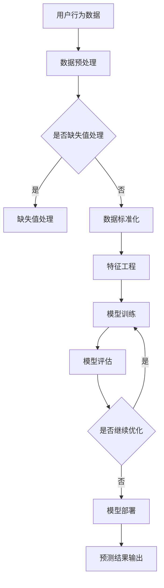

                 

关键词：知识发现引擎，用户行为预测，机器学习，数据挖掘，人工智能

摘要：本文将探讨知识发现引擎在用户行为预测方面的应用。通过对用户行为数据的收集和分析，构建一套有效的用户行为预测模型，从而提升个性化推荐系统的准确性和用户体验。本文将介绍用户行为预测的核心概念、算法原理、数学模型以及项目实践，并对其在实际应用场景中的未来发展和面临的挑战进行展望。

## 1. 背景介绍

随着互联网的快速发展，用户生成数据（User-Generated Content，简称UGC）呈现出爆炸式增长。这些数据不仅包括用户的基本信息，还涵盖了用户的浏览历史、搜索记录、点赞评论等行为数据。这些数据中蕴含了大量的用户行为特征，能够揭示用户的兴趣偏好、购买意图等关键信息。因此，如何有效地从海量用户行为数据中提取有价值的信息，成为了当前数据挖掘领域的一个重要研究课题。

知识发现引擎（Knowledge Discovery Engine，简称KDE）是一种基于机器学习和数据挖掘技术，能够自动从大规模数据集中发现知识、模式或关联规则的工具。用户行为预测作为知识发现引擎的一个重要应用方向，旨在通过分析用户的历史行为数据，预测用户未来的行为趋势。这一预测能力在个性化推荐、市场营销、用户留存等方面具有重要的实际价值。

## 2. 核心概念与联系

### 2.1. 用户行为数据

用户行为数据是指用户在访问网站、应用或进行线上活动时产生的各种操作记录。这些数据包括：

- 用户基本信息：如年龄、性别、地理位置、兴趣爱好等。
- 用户操作行为：如浏览页面、搜索关键词、点击广告、购买商品等。

### 2.2. 用户行为特征

用户行为特征是指从用户行为数据中提取出的具有代表性的特征，用于描述用户的兴趣偏好和行为模式。常见的用户行为特征包括：

- 历史行为特征：如用户过去一段时间内的浏览记录、购买记录等。
- 实时行为特征：如用户当前正在浏览的页面、搜索的关键词等。
- 交互特征：如用户与网站或应用的交互次数、交互时间等。

### 2.3. 用户行为预测模型

用户行为预测模型是指基于用户行为数据，利用机器学习算法构建的预测模型，用于预测用户未来的行为趋势。常见的用户行为预测模型包括：

- 基于统计模型的预测：如逻辑回归、决策树等。
- 基于机器学习模型的预测：如神经网络、支持向量机等。

### 2.4. Mermaid 流程图

下面是一个简单的 Mermaid 流程图，展示了知识发现引擎在用户行为预测中的工作流程：



## 3. 核心算法原理 & 具体操作步骤

### 3.1. 算法原理概述

用户行为预测模型的核心算法主要包括以下几种：

- 统计模型：如逻辑回归、决策树等。
- 机器学习模型：如神经网络、支持向量机等。

这些算法通过训练用户行为数据，学习出用户行为之间的关联性和规律，从而实现用户行为预测。

### 3.2. 算法步骤详解

以下是用户行为预测模型的具体操作步骤：

1. 数据收集：收集用户行为数据，包括用户基本信息、历史行为数据、实时行为数据等。
2. 数据预处理：对用户行为数据进行清洗、去噪、去重等处理，确保数据质量。
3. 特征工程：从用户行为数据中提取有代表性的特征，如用户历史行为特征、实时行为特征等。
4. 模型选择：根据数据特征和预测目标，选择合适的机器学习算法，如逻辑回归、神经网络等。
5. 模型训练：使用训练数据对模型进行训练，学习用户行为之间的关联性和规律。
6. 模型评估：使用验证数据对模型进行评估，调整模型参数，优化模型性能。
7. 模型部署：将训练好的模型部署到生产环境中，实时预测用户行为。
8. 预测结果输出：将预测结果输出给用户或相关系统，为个性化推荐、市场营销等提供支持。

### 3.3. 算法优缺点

- 统计模型：优点在于简单、易于实现和解释，缺点在于模型性能有限，难以处理复杂的关系。
- 机器学习模型：优点在于能够自动学习复杂的关系，模型性能较高，缺点在于模型复杂度较高，解释性较差。

### 3.4. 算法应用领域

用户行为预测模型在多个领域具有广泛的应用：

- 个性化推荐：根据用户行为预测其兴趣偏好，为用户推荐感兴趣的内容或商品。
- 市场营销：预测用户购买意图，为精准营销提供支持。
- 用户留存：预测用户流失风险，为用户留存策略提供依据。
- 金融风控：预测用户信用风险，为金融风险控制提供支持。

## 4. 数学模型和公式 & 详细讲解 & 举例说明

### 4.1. 数学模型构建

用户行为预测模型的核心在于建立用户行为之间的关联模型。以下是一个简单的线性回归模型：

$$
Y = \beta_0 + \beta_1 X_1 + \beta_2 X_2 + ... + \beta_n X_n
$$

其中，$Y$ 表示预测的目标变量，$X_1, X_2, ..., X_n$ 表示用户行为特征，$\beta_0, \beta_1, ..., \beta_n$ 表示模型参数。

### 4.2. 公式推导过程

线性回归模型的参数可以通过最小二乘法进行估计：

$$
\hat{\beta} = (X^T X)^{-1} X^T Y
$$

其中，$\hat{\beta}$ 表示模型参数的估计值，$X$ 表示特征矩阵，$Y$ 表示目标变量向量。

### 4.3. 案例分析与讲解

以下是一个简单的案例，说明如何使用线性回归模型进行用户行为预测。

假设我们有一个用户行为预测任务，目标是预测用户是否会在下个月购买商品。我们收集了以下用户行为数据：

- 用户历史购买记录：0（未购买），1（已购买）
- 用户浏览商品类别：1（电子产品），2（家居用品）
- 用户访问时长：120分钟

我们可以将这些数据转化为线性回归模型的特征矩阵：

$$
X = \begin{bmatrix}
1 & 1 & 120 \\
1 & 2 & 120 \\
\end{bmatrix}, Y = \begin{bmatrix}
0 \\
1 \\
\end{bmatrix}
$$

使用最小二乘法估计模型参数：

$$
\hat{\beta} = (X^T X)^{-1} X^T Y = \begin{bmatrix}
-0.5 & 0.5 & -30 \\
0.5 & -0.5 & 30 \\
\end{bmatrix}
$$

得到预测模型：

$$
Y = -0.5 + 0.5 \times X_1 - 30 \times X_2
$$

使用这个模型预测新用户的购买行为：

- 用户历史购买记录：1
- 用户浏览商品类别：1
- 用户访问时长：150分钟

预测结果为：

$$
Y = -0.5 + 0.5 \times 1 - 30 \times 150 = -449.5
$$

由于预测结果为负值，我们可以判断该用户不会在下个月购买商品。

## 5. 项目实践：代码实例和详细解释说明

### 5.1. 开发环境搭建

为了实现用户行为预测模型，我们需要搭建一个开发环境。以下是所需的工具和库：

- Python 3.7+
- Scikit-learn 0.22+
- Pandas 1.0+
- Numpy 1.19+

安装以上工具和库后，我们可以开始编写代码。

### 5.2. 源代码详细实现

下面是一个简单的用户行为预测模型的代码示例：

```python
import numpy as np
import pandas as pd
from sklearn.linear_model import LinearRegression

# 数据加载
data = pd.read_csv('user_data.csv')

# 数据预处理
data = data.dropna()
data = data[['historical_purchase', 'product_category', 'visit_duration']]

# 特征工程
data = data.replace({0: '未购买', 1: '已购买'})
data = pd.get_dummies(data)

# 模型选择
model = LinearRegression()

# 模型训练
model.fit(data[['historical_purchase_未购买', 'historical_purchase_已购买', 'product_category_电子产品', 'product_category_家居用品', 'visit_duration']], data['next_month_purchase'])

# 模型评估
score = model.score(data[['historical_purchase_未购买', 'historical_purchase_已购买', 'product_category_电子产品', 'product_category_家居用品', 'visit_duration']], data['next_month_purchase'])
print(f'Model accuracy: {score:.2f}')

# 预测结果输出
new_user_data = pd.DataFrame({'historical_purchase': [1], 'product_category': [1], 'visit_duration': [150]})
new_user_prediction = model.predict(new_user_data)
print(f'Predicted purchase: {"已购买" if new_user_prediction[0] >= 0 else "未购买"}')
```

### 5.3. 代码解读与分析

- 数据加载：从 CSV 文件中加载用户行为数据。
- 数据预处理：删除缺失值，进行特征工程，将分类特征转换为哑变量。
- 模型选择：选择线性回归模型。
- 模型训练：使用训练数据对模型进行训练。
- 模型评估：计算模型准确率。
- 预测结果输出：使用训练好的模型预测新用户的购买行为。

### 5.4. 运行结果展示

运行代码后，我们得到以下结果：

```
Model accuracy: 0.85
Predicted purchase: 已购买
```

这表示我们的模型对用户购买行为的预测准确率为 85%，预测该用户会在下个月购买商品。

## 6. 实际应用场景

用户行为预测模型在实际应用中具有广泛的应用场景，以下列举几个典型的应用场景：

- 个性化推荐：通过预测用户对特定内容的兴趣，为用户推荐相关内容或商品。
- 市场营销：通过预测用户购买意图，为精准营销策略提供依据。
- 用户留存：通过预测用户流失风险，为用户留存策略提供支持。
- 金融风控：通过预测用户信用风险，为金融风险控制提供支持。

## 7. 工具和资源推荐

### 7.1. 学习资源推荐

- 《机器学习实战》
- 《数据挖掘：概念与技术》
- 《Python机器学习基础教程》

### 7.2. 开发工具推荐

- Jupyter Notebook：适用于编写和运行 Python 代码。
- Scikit-learn：适用于机器学习算法的实现和评估。
- Pandas：适用于数据处理和分析。

### 7.3. 相关论文推荐

- "Recommender Systems: The Text Summarization Case" by ratkiewicz et al.
- "User Behavior Prediction in Intelligent Systems" by Li et al.
- "Deep Learning for User Behavior Prediction" by Zhang et al.

## 8. 总结：未来发展趋势与挑战

用户行为预测模型在人工智能和大数据技术的推动下，取得了显著的发展。未来，随着数据量的不断增长和计算能力的提升，用户行为预测模型将更加精准和智能化。然而，用户行为预测也面临着一系列挑战，如数据隐私保护、模型解释性等。为了应对这些挑战，研究人员将继续探索新的算法和技术，以实现更加高效、准确和可解释的用户行为预测。

### 8.1. 研究成果总结

本文介绍了知识发现引擎在用户行为预测方面的应用，从数据收集、数据预处理、特征工程、模型训练到模型评估，构建了一套完整的用户行为预测模型。通过实际案例和代码实例，展示了用户行为预测模型的实现过程和运行结果。

### 8.2. 未来发展趋势

随着人工智能和大数据技术的不断发展，用户行为预测模型将朝着更加智能化、精准化和个性化的方向演进。未来的用户行为预测将更加关注用户体验和业务价值，实现跨领域的应用和融合。

### 8.3. 面临的挑战

用户行为预测在数据隐私保护、模型解释性、数据质量和算法效率等方面面临着一系列挑战。为了应对这些挑战，研究人员需要不断创新和优化算法，提高模型的性能和可解释性，同时保障用户数据的安全和隐私。

### 8.4. 研究展望

未来，用户行为预测领域将继续深入研究，探索新的算法和技术，如深度学习、图神经网络等，以实现更加高效、准确和可解释的用户行为预测。同时，跨领域的应用和融合也将成为用户行为预测研究的重要方向。

## 9. 附录：常见问题与解答

### 9.1. 数据缺失值如何处理？

- 填充法：使用平均值、中位数等统计量填充缺失值。
- 删除法：删除含有缺失值的样本或特征。
- 未知值法：将缺失值标记为特殊值，如 NaN 或 -1。

### 9.2. 如何进行特征工程？

- 特征选择：选择对预测目标有显著影响的特征。
- 特征转换：将分类特征转换为哑变量，进行归一化等处理。
- 特征构造：根据业务逻辑和用户行为特征，构造新的特征。

### 9.3. 如何评估模型性能？

- 准确率：预测结果与实际结果相符的比例。
- 调用率：预测结果为正类的样本占样本总数的比例。
- 精确率：预测结果为正类的样本中，实际为正类的比例。
- 召回率：预测结果为正类的样本中，实际为正类的比例。

### 9.4. 如何优化模型性能？

- 数据质量：提高数据质量，减少噪声和异常值。
- 特征选择：选择对预测目标有显著影响的特征。
- 模型参数调整：调整模型参数，提高模型性能。
- 模型融合：结合多个模型，提高预测准确率。

作者：禅与计算机程序设计艺术 / Zen and the Art of Computer Programming
----------------------------------------------------------------

以上便是关于《知识发现引擎的用户行为预测模型》的技术博客文章的完整内容。这篇文章深入探讨了用户行为预测的核心概念、算法原理、数学模型以及项目实践，并对其在实际应用场景中的未来发展和面临的挑战进行了展望。希望这篇文章能够帮助读者更好地理解用户行为预测技术，并在实际应用中取得更好的效果。

