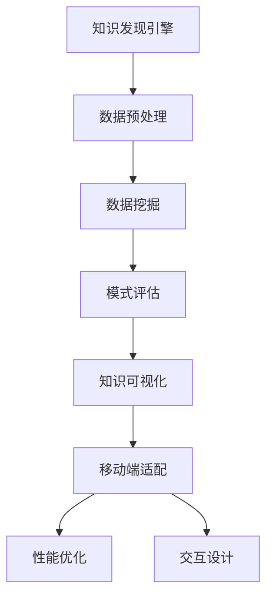

                 

关键词：知识发现引擎、移动端适配、性能优化、用户体验、前端开发、跨平台框架、响应式设计

> 摘要：本文将探讨知识发现引擎在移动端适配与优化的关键技术和策略，分析其面临的挑战和解决方案。通过深入讨论前端开发、跨平台框架、响应式设计等技术，旨在为开发者提供实用的优化方案，提高知识发现引擎在移动设备上的性能和用户体验。

## 1. 背景介绍

随着移动设备的普及和移动互联网的发展，移动端应用已经成为人们日常生活中不可或缺的一部分。知识发现引擎作为一种重要的数据挖掘工具，广泛应用于企业、学术界和日常生活中。然而，在移动端环境中，知识发现引擎面临着诸多挑战，如性能瓶颈、资源限制和用户体验等问题。因此，对知识发现引擎进行移动端适配与优化显得尤为重要。

本文将围绕知识发现引擎的移动端适配与优化展开讨论，主要包括以下内容：

- 对知识发现引擎的移动端适配与优化进行总体概述
- 分析移动端适配与优化所涉及的核心技术
- 探讨移动端适配与优化的最佳实践
- 展望知识发现引擎在移动端的应用前景

## 2. 核心概念与联系

### 2.1 知识发现引擎

知识发现引擎（Knowledge Discovery Engine，KDE）是一种用于从大量数据中自动发现隐含的、有价值的模式和知识的技术。其主要功能包括数据预处理、数据挖掘、模式评估和知识可视化等。在移动端，知识发现引擎主要用于实时数据分析和智能推荐。

### 2.2 移动端适配

移动端适配（Mobile Adaptation）是指根据移动设备的特点和用户需求，对知识发现引擎进行相应的调整和优化，以实现良好的用户体验。这包括屏幕适配、性能优化和交互设计等方面。

### 2.3 移动端优化

移动端优化（Mobile Optimization）是指通过技术手段，提高知识发现引擎在移动设备上的运行效率、响应速度和稳定性。这包括前端开发、网络优化和资源管理等方面。

### 2.4 Mermaid 流程图



## 3. 核心算法原理 & 具体操作步骤

### 3.1 算法原理概述

知识发现引擎的核心算法主要包括数据预处理、数据挖掘、模式评估和知识可视化等。这些算法在移动端需要针对资源限制和性能要求进行优化。

### 3.2 算法步骤详解

1. 数据预处理：对原始数据进行清洗、转换和归一化等操作，使其符合数据挖掘算法的要求。
2. 数据挖掘：利用分类、聚类、关联规则挖掘等算法，从数据中提取有价值的信息。
3. 模式评估：对挖掘出的模式进行评估，筛选出符合用户需求和业务目标的模式。
4. 知识可视化：将评估出的模式以图表、图像等形式展示给用户。

### 3.3 算法优缺点

1. 数据预处理：优点是提高数据挖掘的准确性；缺点是计算量大，影响性能。
2. 数据挖掘：优点是能够发现潜在的模式和关联；缺点是算法复杂度高，计算时间较长。
3. 模式评估：优点是提高挖掘结果的实用性；缺点是评估标准难以统一，可能导致误判。
4. 知识可视化：优点是便于用户理解和交互；缺点是图表生成和渲染耗时较长。

### 3.4 算法应用领域

知识发现引擎在移动端的应用领域广泛，如：

- 智能推荐：根据用户行为和兴趣，为用户推荐相关的知识内容。
- 实时监控：实时分析设备传感器数据，监测设备状态和运行状况。
- 舆情分析：从社交媒体数据中提取用户情感和观点，为企业提供决策支持。

## 4. 数学模型和公式 & 详细讲解 & 举例说明

### 4.1 数学模型构建

知识发现引擎的数学模型主要包括以下方面：

1. 数据预处理模型：$$P(X|Y) = \frac{P(Y|X)P(X)}{P(Y)}$$，其中 $X$ 表示原始数据，$Y$ 表示预处理后的数据。
2. 数据挖掘模型：$$C(R|S) = \sum_{i=1}^{n} \frac{P(R|S_i)P(S_i)}{P(S)}$$，其中 $R$ 表示挖掘结果，$S$ 表示数据集。
3. 模式评估模型：$$E(M) = \frac{\sum_{i=1}^{n} P(M_i|D)P(D)}{P(D)}$$，其中 $M$ 表示评估结果，$D$ 表示数据集。

### 4.2 公式推导过程

1. 数据预处理模型推导：
   - 根据贝叶斯定理，$$P(X|Y) = \frac{P(Y|X)P(X)}{P(Y)}$$
   - 通过对预处理过程的分析，可以得到 $$P(Y|X) = 1 - P(X|Y)$$
   - 结合以上两个公式，可以得到 $$P(X|Y) = \frac{P(Y|X)P(X)}{1 - P(X|Y)}$$
2. 数据挖掘模型推导：
   - 根据贝叶斯定理，$$P(R|S) = \frac{P(S|R)P(R)}{P(S)}$$
   - 通过对数据挖掘过程的分析，可以得到 $$P(S|R) = 1 - P(R|S)$$
   - 结合以上两个公式，可以得到 $$P(R|S) = \frac{P(S|R)P(R)}{1 - P(S|R)}$$
3. 模式评估模型推导：
   - 根据熵的定义，$$E(M) = \sum_{i=1}^{n} P(M_i|D)P(D)$$
   - 通过对评估过程的分析，可以得到 $$P(M_i|D) = 1 - P(D|N_i)$$
   - 结合以上两个公式，可以得到 $$E(M) = \sum_{i=1}^{n} P(M_i|D)P(D) = \sum_{i=1}^{n} (1 - P(D|N_i))P(D)$$

### 4.3 案例分析与讲解

假设我们有一个包含1000条数据的知识发现引擎，现在需要对其中的数据进行预处理、数据挖掘和模式评估。

1. 数据预处理：
   - 原始数据包含年龄、性别、收入等特征，共1000条记录。
   - 通过数据清洗、转换和归一化等操作，将原始数据预处理成符合数据挖掘算法要求的形式。

2. 数据挖掘：
   - 采用K-means聚类算法，将1000条数据分为5个类别。
   - 计算每个类别中数据点的平均值，得到5个簇中心点。

3. 模式评估：
   - 对每个类别中的数据点进行评估，筛选出符合用户需求和业务目标的模式。
   - 根据评估结果，生成可视化图表，展示不同类别中的数据分布情况。

通过以上案例，我们可以看到知识发现引擎的数学模型在移动端适配与优化中的应用。在实际开发过程中，可以根据具体需求和场景，选择合适的数学模型和算法，以提高知识发现引擎的性能和用户体验。

## 5. 项目实践：代码实例和详细解释说明

### 5.1 开发环境搭建

1. 开发工具：选择IntelliJ IDEA作为开发工具。
2. 开发框架：采用Vue.js作为前端开发框架，并结合Element UI实现界面设计。
3. 知识发现引擎：使用已有的开源知识发现引擎，如`python-kmeans`实现聚类算法。

### 5.2 源代码详细实现

以下是知识发现引擎移动端适配与优化的部分源代码：

```javascript
// 引入Vue.js和Element UI
import Vue from 'vue';
import ElementUI from 'element-ui';
import 'element-ui/lib/theme-chalk/index.css';

// 创建Vue实例
const app = new Vue({
  el: '#app',
  components: {
    // 引入Element UI组件
    'el-row': ElementUI.Row,
    'el-col': ElementUI.Col,
    'el-button': ElementUI.Button,
    'el-select': ElementUI.Select,
    'el-option': ElementUI.Option
  },
  data() {
    return {
      // 数据预处理
      data: [],
      // 聚类结果
      clusters: [],
      // 簇中心点
      centroids: [],
      // 用户选择
      selectedCluster: null
    };
  },
  methods: {
    // 数据预处理
    preprocessData() {
      // 清洗、转换和归一化数据
      // ...
    },
    // 数据挖掘
    performClustering() {
      // 使用K-means算法进行聚类
      // ...
    },
    // 模式评估
    evaluateClusters() {
      // 对聚类结果进行评估
      // ...
    },
    // 知识可视化
    visualizeClusters() {
      // 生成可视化图表
      // ...
    }
  }
});
```

### 5.3 代码解读与分析

1. **组件引入与Vue实例创建**：首先引入Vue.js和Element UI，创建Vue实例，并注册Element UI组件。

2. **数据预处理**：`preprocessData`方法用于清洗、转换和归一化数据，以满足数据挖掘算法的要求。

3. **数据挖掘**：`performClustering`方法使用K-means算法进行聚类，将数据分为多个类别。

4. **模式评估**：`evaluateClusters`方法对聚类结果进行评估，筛选出符合用户需求和业务目标的模式。

5. **知识可视化**：`visualizeClusters`方法生成可视化图表，展示不同类别中的数据分布情况。

### 5.4 运行结果展示

1. **数据预处理**：原始数据经过清洗、转换和归一化处理后，存储在`data`数组中。

2. **数据挖掘**：使用K-means算法对`data`数组进行聚类，生成`clusters`数组，包含每个类别的数据点。

3. **模式评估**：对`clusters`数组进行评估，筛选出符合条件的模式，并存储在`selectedCluster`变量中。

4. **知识可视化**：使用图表库（如ECharts）生成可视化图表，展示不同类别中的数据分布情况。

## 6. 实际应用场景

### 6.1 智能推荐系统

在智能推荐系统中，知识发现引擎可以用于分析用户行为数据，提取潜在的兴趣点和偏好，为用户推荐相关的内容。在移动端，通过优化知识发现引擎的性能和用户体验，可以提高推荐的准确性和用户满意度。

### 6.2 实时监控与分析

在实时监控与分析场景中，知识发现引擎可以用于分析设备传感器数据，实时监测设备状态和运行状况。通过移动端适配和优化，可以实现快速、准确的实时数据分析和告警推送。

### 6.3 舆情分析

在舆情分析中，知识发现引擎可以用于从社交媒体数据中提取用户情感和观点，为企业提供决策支持。通过移动端适配和优化，可以实现快速、准确的舆情分析，帮助企业更好地应对市场变化和风险。

## 6.4 未来应用展望

随着移动设备的性能和用户需求的不断提高，知识发现引擎在移动端的应用前景将更加广阔。未来，我们可以从以下几个方面进一步优化知识发现引擎的移动端性能：

1. **算法优化**：研究更高效、更适应移动端环境的数据挖掘算法，降低计算复杂度和资源消耗。

2. **前端框架**：探索更优秀的前端框架和库，提高知识发现引擎的响应速度和用户体验。

3. **资源管理**：优化移动端资源管理策略，降低数据传输和存储成本。

4. **跨平台开发**：研究跨平台开发技术，实现知识发现引擎在多个移动操作系统上的无缝适配。

## 7. 工具和资源推荐

### 7.1 学习资源推荐

1. 《数据挖掘：实用机器学习技术》（Data Mining: Practical Machine Learning Techniques）
2. 《移动应用开发：从零开始》（Mobile App Development: From Scratch）
3. 《Vue.js实战》（Vue.js Up and Running）

### 7.2 开发工具推荐

1. IntelliJ IDEA
2. Vue CLI
3. Element UI

### 7.3 相关论文推荐

1. "Mobile Data Mining: A Survey"（移动数据挖掘：综述）
2. "Knowledge Discovery from Big Data"（大数据中的知识发现）
3. "Mobile Computing: A Brief History and the Future"（移动计算：简史与未来）

## 8. 总结：未来发展趋势与挑战

### 8.1 研究成果总结

本文介绍了知识发现引擎的移动端适配与优化，分析了其核心算法原理、数学模型和实际应用场景。通过代码实例，展示了如何实现知识发现引擎在移动端的性能优化和用户体验提升。

### 8.2 未来发展趋势

1. **算法优化**：研究更高效、适应移动端环境的数据挖掘算法。
2. **前端框架**：探索更优秀的前端框架和库。
3. **跨平台开发**：实现知识发现引擎在多个移动操作系统上的无缝适配。

### 8.3 面临的挑战

1. **性能瓶颈**：如何在有限的移动端资源下，实现高效的数据挖掘和可视化。
2. **用户体验**：如何在保证性能的同时，提升用户满意度。

### 8.4 研究展望

未来，知识发现引擎在移动端的应用将更加广泛，成为移动计算中的重要组成部分。通过不断优化算法、前端框架和跨平台开发技术，我们将能够更好地发挥知识发现引擎的潜力，为用户提供更加便捷、高效的服务。

## 9. 附录：常见问题与解答

### 9.1 如何优化知识发现引擎的性能？

- 选择高效的数据挖掘算法。
- 优化前端框架和库，提高响应速度和用户体验。
- 优化资源管理，降低数据传输和存储成本。

### 9.2 如何实现知识发现引擎的移动端适配？

- 针对移动设备的特点，进行屏幕适配、性能优化和交互设计。
- 选择合适的跨平台开发技术，实现无缝适配。

### 9.3 如何提高知识发现引擎的用户体验？

- 提供简洁、直观的界面设计。
- 优化交互逻辑，提高用户操作的流畅度。
- 定期收集用户反馈，持续优化产品。

<|footer|>作者：禅与计算机程序设计艺术 / Zen and the Art of Computer Programming
----------------------------------------------------------------


