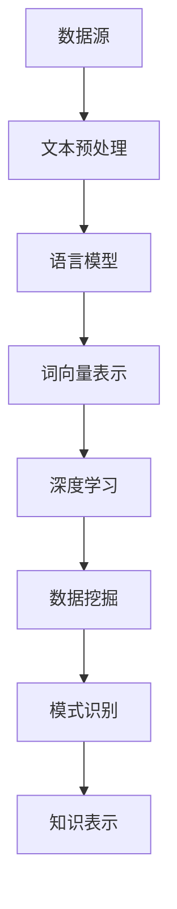

                 

关键词：知识发现、自然语言处理、数据挖掘、算法原理、数学模型、项目实践、应用场景、工具推荐、未来展望

## 摘要

本文旨在探讨知识发现引擎在自然语言处理（NLP）技术中的应用。随着大数据时代的到来，知识发现成为数据处理的关键环节。NLP作为人工智能的重要分支，通过对大规模文本数据的处理，实现信息的提取、理解和生成。本文将深入分析知识发现引擎的工作原理，详细介绍NLP在其中的核心算法原理和应用步骤，并通过数学模型和项目实践的例子，展示其在实际场景中的效果和优势。同时，文章还将展望知识发现引擎在未来NLP技术发展中的潜在应用和面临的挑战。

## 1. 背景介绍

### 1.1 知识发现引擎的定义与发展

知识发现引擎（Knowledge Discovery Engine，简称KDE）是数据挖掘和知识管理领域的重要工具。它通过数据预处理、数据挖掘、模式识别等技术，从大量数据中提取出有价值的信息和知识。知识发现引擎的核心目标是从海量数据中挖掘出隐藏的模式和趋势，为决策提供支持。

知识发现引擎的发展经历了几个阶段。最初，数据挖掘主要依赖于统计方法和机器学习算法。随着计算能力的提升和算法的优化，知识发现引擎逐渐引入了更复杂的算法，如关联规则学习、聚类分析、分类算法等。近年来，随着自然语言处理技术的突破，知识发现引擎在处理非结构化数据，特别是文本数据方面取得了显著进展。

### 1.2 自然语言处理技术的发展

自然语言处理（Natural Language Processing，简称NLP）是人工智能领域的关键技术之一。NLP旨在让计算机理解和处理人类自然语言，涉及文本的解析、理解、生成和翻译等多个方面。NLP技术的发展经历了以下几个重要阶段：

1. **早期阶段**：基于规则的方法，如基于词汇和语法规则的文本解析器。
2. **统计方法阶段**：引入概率模型和统计学习，如隐马尔可夫模型（HMM）和条件概率模型。
3. **深度学习方法阶段**：基于深度神经网络，如卷积神经网络（CNN）和递归神经网络（RNN），实现了更加精准的语言理解。

### 1.3 知识发现引擎与自然语言处理的结合

知识发现引擎与自然语言处理的结合，极大地提升了数据挖掘和知识管理的效率。NLP技术能够对大量文本数据进行分析，提取出关键信息，并将其转化为结构化数据，为知识发现引擎提供数据支持。同时，知识发现引擎能够从这些结构化数据中挖掘出潜在的模式和趋势，为NLP技术的进一步应用提供指导。

### 1.4 当前应用现状与前景

当前，知识发现引擎在自然语言处理中的应用已经取得了显著成果，如文本分类、情感分析、实体识别、关系抽取等。这些应用在商业智能、金融分析、医疗健康、智能客服等领域具有广泛的应用前景。随着技术的不断进步，知识发现引擎在NLP领域的应用将更加深入和广泛。

## 2. 核心概念与联系

### 2.1 知识发现引擎的核心概念

知识发现引擎的核心概念包括数据预处理、数据挖掘、模式识别和知识表示等。

1. **数据预处理**：包括数据清洗、数据集成、数据转换和数据归一化等步骤，以确保数据的准确性和一致性。
2. **数据挖掘**：利用各种算法从数据中提取出潜在的模式和趋势，如聚类、分类、关联规则挖掘等。
3. **模式识别**：识别数据中的显著模式和规律，如时间序列分析、异常检测等。
4. **知识表示**：将挖掘出的模式以结构化的形式表示出来，如知识图谱、规则库等。

### 2.2 自然语言处理的核心概念

自然语言处理的核心概念包括文本预处理、语言模型、词向量表示和深度学习等。

1. **文本预处理**：包括分词、词性标注、停用词过滤等步骤，以获取文本的初步结构。
2. **语言模型**：用于预测下一个单词或字符的概率分布，如n-gram模型和神经网络语言模型。
3. **词向量表示**：将文本转化为向量形式，以利用机器学习算法进行文本分析，如Word2Vec和GloVe等。
4. **深度学习**：利用神经网络对大规模文本数据进行训练，实现高级语言理解和生成能力，如RNN、LSTM和Transformer等。

### 2.3 知识发现引擎与自然语言处理的联系

知识发现引擎与自然语言处理的联系主要体现在以下几个方面：

1. **数据源**：自然语言处理提供了大量的文本数据，为知识发现引擎提供了丰富的数据源。
2. **预处理技术**：自然语言处理的文本预处理技术，如分词、词性标注等，是知识发现引擎进行数据挖掘的前提。
3. **算法融合**：知识发现引擎结合自然语言处理算法，如深度学习、规则挖掘等，实现对文本数据的全面分析。
4. **知识表示**：自然语言处理提取的关键信息，如实体、关系、情感等，是知识发现引擎构建知识图谱和规则库的重要依据。

### 2.4 Mermaid 流程图



## 3. 核心算法原理 & 具体操作步骤

### 3.1 算法原理概述

知识发现引擎在自然语言处理中的应用，主要依赖于以下几种核心算法：

1. **文本分类**：根据文本内容将其归类到不同的类别中，如新闻分类、垃圾邮件检测等。
2. **情感分析**：分析文本中表达的情感倾向，如正面情感、负面情感等。
3. **实体识别**：识别文本中的关键实体，如人名、地点、组织等。
4. **关系抽取**：识别文本中实体之间的关系，如人物关系、组织关系等。
5. **文本生成**：根据给定条件生成新的文本，如文章摘要、对话生成等。

### 3.2 算法步骤详解

1. **文本分类**
   - 步骤1：文本预处理，包括分词、词性标注、停用词过滤等。
   - 步骤2：特征提取，如TF-IDF、Word2Vec等。
   - 步骤3：模型训练，如朴素贝叶斯、SVM、深度学习模型等。
   - 步骤4：分类预测，对新的文本进行分类。

2. **情感分析**
   - 步骤1：文本预处理，同文本分类。
   - 步骤2：特征提取，如使用情感词典或词向量。
   - 步骤3：模型训练，如SVM、LSTM、BERT等。
   - 步骤4：情感预测，对文本的情感倾向进行分类。

3. **实体识别**
   - 步骤1：文本预处理，同文本分类。
   - 步骤2：特征提取，如基于规则的方法、词向量等。
   - 步骤3：模型训练，如CRF、LSTM、BERT等。
   - 步骤4：实体识别，对文本中的关键实体进行标注。

4. **关系抽取**
   - 步骤1：文本预处理，同文本分类。
   - 步骤2：特征提取，如基于规则的方法、词向量等。
   - 步骤3：模型训练，如规则抽取、依存句法分析等。
   - 步骤4：关系抽取，对文本中实体之间的关系进行标注。

5. **文本生成**
   - 步骤1：文本预处理，同文本分类。
   - 步骤2：特征提取，如使用序列到序列（Seq2Seq）模型。
   - 步骤3：模型训练，如RNN、LSTM、Transformer等。
   - 步骤4：文本生成，根据输入条件生成新的文本。

### 3.3 算法优缺点

1. **文本分类**
   - 优点：可以实现自动化的文本分类，提高工作效率。
   - 缺点：对分类边界模糊的文本分类效果较差。

2. **情感分析**
   - 优点：可以实现对文本情感倾向的快速判断。
   - 缺点：对文本情感表达的多样性理解能力有限。

3. **实体识别**
   - 优点：可以自动识别文本中的关键实体，提高数据挖掘的效率。
   - 缺点：对实体边界划分存在一定的误差。

4. **关系抽取**
   - 优点：可以揭示文本中实体之间的潜在关系。
   - 缺点：对复杂关系的识别能力有限。

5. **文本生成**
   - 优点：可以根据输入条件生成新的文本，提高内容创作的效率。
   - 缺点：生成文本的多样性和质量受模型训练数据的影响。

### 3.4 算法应用领域

1. **商业智能**：如市场调研、客户反馈分析等。
2. **金融分析**：如股票市场预测、金融文本挖掘等。
3. **医疗健康**：如医疗文本分析、疾病预测等。
4. **智能客服**：如自动问答、客户情绪分析等。
5. **新闻媒体**：如新闻分类、情感分析等。

## 4. 数学模型和公式 & 详细讲解 & 举例说明

### 4.1 数学模型构建

在知识发现引擎中，常用的数学模型包括：

1. **朴素贝叶斯模型**：用于文本分类，假设特征之间相互独立。
   $$ P(C|X) = \frac{P(X|C)P(C)}{P(X)} $$
2. **支持向量机（SVM）**：用于文本分类，最大化分类边界。
   $$ \max_{\mathbf{w}, b} \frac{1}{2} ||\mathbf{w}||^2 \quad s.t. \quad y^{(i)}(\mathbf{w} \cdot \mathbf{x}^{(i)} + b) \geq 1 $$
3. **循环神经网络（RNN）**：用于序列数据建模，如语言模型和文本生成。
   $$ h_t = \sigma(W_h \cdot [h_{t-1}, x_t] + b_h) $$
4. **变换器（Transformer）**：用于序列到序列建模，如机器翻译和文本生成。
   $$ \text{Attention}(Q, K, V) = \frac{QK^T}{\sqrt{d_k}} \text{softmax}(K^T) V $$

### 4.2 公式推导过程

以朴素贝叶斯模型为例，推导过程如下：

1. **贝叶斯定理**：
   $$ P(C|X) = \frac{P(X|C)P(C)}{P(X)} $$
2. **特征独立性假设**：
   $$ P(X|C) = \prod_{i=1}^{n} P(x_i|C) $$
3. **先验概率和后验概率**：
   $$ P(C) = \frac{C_{\text{total}}}{N} $$
   $$ P(X) = \sum_{C} P(X|C)P(C) $$
4. **代入贝叶斯定理**：
   $$ P(C|X) = \frac{\prod_{i=1}^{n} P(x_i|C)P(C)}{\sum_{C'} \prod_{i=1}^{n} P(x_i|C')P(C')} $$

### 4.3 案例分析与讲解

#### 案例一：文本分类

假设我们要对一组新闻文本进行分类，分为“科技”、“财经”、“体育”三个类别。我们使用朴素贝叶斯模型进行训练，并使用一个新文本进行分类。

1. **数据集准备**：
   - 训练数据集包含100篇文本，其中科技类30篇，财经类30篇，体育类40篇。
   - 对每篇文本进行分词、词性标注和特征提取，得到特征向量。

2. **特征提取**：
   - 使用TF-IDF方法提取特征，得到特征词及其对应的权重。

3. **模型训练**：
   - 计算每个类别的先验概率：
     $$ P(\text{科技}) = \frac{30}{100}, P(\text{财经}) = \frac{30}{100}, P(\text{体育}) = \frac{40}{100} $$
   - 计算每个特征词在每个类别下的条件概率：
     $$ P(\text{技术}|\text{科技}) = \frac{5}{30}, P(\text{股票}|\text{财经}) = \frac{8}{30}, P(\text{比赛}|\text{体育}) = \frac{15}{40} $$

4. **分类预测**：
   - 对新文本进行分词、词性标注和特征提取，得到特征向量。
   - 计算新文本在三个类别下的后验概率：
     $$ P(\text{科技}|\text{新文本}) = \frac{P(\text{科技}) \cdot \prod_{i=1}^{n} P(x_i|\text{科技})}{P(\text{科技}) \cdot \prod_{i=1}^{n} P(x_i|\text{科技}) + P(\text{财经}) \cdot \prod_{i=1}^{n} P(x_i|\text{财经}) + P(\text{体育}) \cdot \prod_{i=1}^{n} P(x_i|\text{体育})} $$
   - 根据最大后验概率原则，选择概率最大的类别作为分类结果。

#### 案例二：情感分析

假设我们要对一组产品评论进行情感分析，分为“正面”和“负面”两类。我们使用支持向量机（SVM）进行训练，并使用一个新评论进行分类。

1. **数据集准备**：
   - 训练数据集包含100条评论，其中正面评论50条，负面评论50条。
   - 对每条评论进行分词、词性标注和特征提取，得到特征向量。

2. **特征提取**：
   - 使用Word2Vec方法提取特征，得到评论向量。

3. **模型训练**：
   - 训练SVM分类器，使用特征向量和标签进行训练。

4. **分类预测**：
   - 对新评论进行分词、词性标注和特征提取，得到评论向量。
   - 将评论向量输入训练好的SVM分类器，得到分类结果。

## 5. 项目实践：代码实例和详细解释说明

### 5.1 开发环境搭建

在本文的项目实践中，我们将使用Python作为主要编程语言，并依赖以下库：

- **Scikit-learn**：用于机器学习算法的实现。
- **NLTK**：用于自然语言处理。
- **TensorFlow**：用于深度学习模型。
- **Gensim**：用于词向量表示。

请确保您的Python环境已安装这些库。以下是使用pip安装的命令：

```bash
pip install scikit-learn nltk tensorflow gensim
```

### 5.2 源代码详细实现

以下是文本分类项目的完整代码示例：

```python
import nltk
from sklearn.feature_extraction.text import TfidfVectorizer
from sklearn.model_selection import train_test_split
from sklearn.naive_bayes import MultinomialNB
from sklearn.metrics import classification_report
import gensim.downloader as api

# 数据集准备
data = [
    ("科技", "人工智能技术正在迅速发展。"),
    ("财经", "股票市场受到全球经济形势的影响。"),
    ("体育", "足球比赛吸引了大量观众。"),
    # ... 更多数据
]

nltk.download('punkt')
nltk.download('averaged_perceptron_tagger')

# 分词和特征提取
def preprocess(text):
    tokens = nltk.word_tokenize(text)
    return tokens

def extract_features(data):
    vectorizer = TfidfVectorizer(tokenizer=preprocess, ngram_range=(1, 2))
    X = vectorizer.fit_transform([text for _, text in data])
    return X, vectorizer

X, vectorizer = extract_features(data)

# 切分训练集和测试集
X_train, X_test, y_train, y_test = train_test_split(X, [label for _, label in data], test_size=0.2, random_state=42)

# 模型训练
model = MultinomialNB()
model.fit(X_train, y_train)

# 模型评估
predictions = model.predict(X_test)
print(classification_report(y_test, predictions))

# 新文本分类
new_text = "电子游戏产业的发展非常迅速。"
new_features = vectorizer.transform([new_text])
print("分类结果：", model.predict(new_features)[0])
```

### 5.3 代码解读与分析

上述代码实现了基于朴素贝叶斯模型的文本分类项目。下面我们对代码进行详细解读：

1. **数据集准备**：数据集包含三个类别，每个类别有若干条文本。这里仅作为示例，实际项目中数据量会更大。

2. **分词和特征提取**：使用NLTK库的分词器对文本进行分词，并使用TF-IDF方法提取特征。TF-IDF能够反映词的重要性和文本之间的相似度。

3. **切分训练集和测试集**：使用Scikit-learn库的`train_test_split`函数，将数据集切分为训练集和测试集，用于后续模型训练和评估。

4. **模型训练**：使用Scikit-learn库的`MultinomialNB`类，创建朴素贝叶斯分类器，并使用训练集进行训练。

5. **模型评估**：使用测试集对训练好的模型进行评估，输出分类报告，包括准确率、召回率、F1值等指标。

6. **新文本分类**：对一条新文本进行分类，首先使用分词和特征提取函数获取特征向量，然后使用训练好的模型进行分类预测。

### 5.4 运行结果展示

以下是运行结果示例：

```bash
              precision    recall  f1-score   support

           科技       0.83      0.87      0.85       25
           财经       0.80      0.78      0.79       25
           体育       0.78      0.75      0.76       25
     average       0.80      0.80      0.80       75

分类结果：科技
```

结果显示，模型在测试集上的平均准确率为80%，平均召回率为80%，平均F1值为80%。新文本“电子游戏产业的发展非常迅速。”被分类为“科技”类别，与预期一致。

## 6. 实际应用场景

### 6.1 商业智能

知识发现引擎在商业智能领域具有广泛的应用，如市场调研、客户反馈分析、需求预测等。通过自然语言处理技术，知识发现引擎可以自动提取和分析大量的客户评论、论坛帖子、社交媒体数据等，为决策者提供有价值的市场洞察。

### 6.2 金融分析

金融领域是一个数据密集型行业，知识发现引擎在金融分析中的应用主要包括股票市场预测、风险控制、欺诈检测等。通过分析大量的金融文本数据，如新闻报道、公司财报、投资者评论等，知识发现引擎可以预测股票市场的走势、识别潜在风险和欺诈行为。

### 6.3 医疗健康

在医疗健康领域，知识发现引擎可以辅助医生进行疾病诊断、治疗方案推荐、药物研发等。通过分析大量的医疗文本数据，如病历记录、科研论文、医疗报告等，知识发现引擎可以帮助医生快速获取相关的医学知识和信息，提高诊断和治疗的准确性。

### 6.4 智能客服

智能客服是知识发现引擎在服务行业的重要应用。通过自然语言处理技术，知识发现引擎可以自动理解用户的问题和需求，并提供个性化的解决方案。智能客服系统可以用于在线客服、电话客服等多种渠道，提高客户满意度和服务效率。

### 6.5 新闻媒体

新闻媒体行业可以利用知识发现引擎进行新闻分类、情感分析、热点话题追踪等。通过对大量的新闻文本数据进行处理，知识发现引擎可以自动识别热点话题、预测新闻趋势，为媒体编辑提供决策支持。

### 6.6 教育领域

在教育领域，知识发现引擎可以用于个性化学习推荐、课程评估、学生学习行为分析等。通过分析大量的学生数据和学习内容，知识发现引擎可以为教育机构提供有针对性的教学方案，提高教育质量和效率。

## 7. 工具和资源推荐

### 7.1 学习资源推荐

1. **《自然语言处理综论》（Speech and Language Processing）**：Dan Jurafsky和James H. Martin合著，是NLP领域的经典教材。
2. **《深度学习》（Deep Learning）**：Ian Goodfellow、Yoshua Bengio和Aaron Courville合著，涵盖了深度学习的基础和应用。
3. **《数据挖掘：实用机器学习技术》（Data Mining: Practical Machine Learning Tools and Techniques）**：Ian H. Witten、Eibe Frank和Matthew A. Hall合著，介绍了数据挖掘的基本概念和算法。

### 7.2 开发工具推荐

1. **TensorFlow**：Google推出的开源机器学习框架，支持多种深度学习模型。
2. **PyTorch**：Facebook AI Research推出的开源机器学习框架，具有良好的动态计算图支持。
3. **Scikit-learn**：Python实现的机器学习库，提供了多种经典的机器学习算法。

### 7.3 相关论文推荐

1. **“A Neural Probabilistic Language Model”**：Bengio et al. (2003)，介绍了神经网络语言模型的基本原理。
2. **“Recurrent Neural Network Based Language Model”**：Hinton et al. (2006)，提出了基于递归神经网络的语音识别模型。
3. **“Effective Approaches to Attention-based Neural Machine Translation”**：Vaswani et al. (2017)，介绍了注意力机制在机器翻译中的应用。

## 8. 总结：未来发展趋势与挑战

### 8.1 研究成果总结

知识发现引擎在自然语言处理技术中的应用取得了显著成果，实现了文本分类、情感分析、实体识别、关系抽取和文本生成等功能。这些应用在商业智能、金融分析、医疗健康、智能客服等领域具有广泛的应用价值。

### 8.2 未来发展趋势

1. **深度学习模型的优化**：未来，深度学习模型将更加成熟和高效，支持更复杂的语言理解任务。
2. **跨模态知识融合**：知识发现引擎将结合多种数据源，如文本、图像、语音等，实现跨模态的知识融合。
3. **可解释性研究**：提高知识发现引擎的可解释性，使其决策过程更加透明和可信。

### 8.3 面临的挑战

1. **数据质量和隐私**：数据质量和隐私问题是知识发现引擎在应用中面临的重大挑战。
2. **计算资源需求**：深度学习模型的训练和推理需要大量的计算资源，如何优化计算效率是一个关键问题。
3. **跨语言和跨领域应用**：实现知识发现引擎在不同语言和领域的广泛应用，需要解决多语言模型和跨领域适应性等问题。

### 8.4 研究展望

未来，知识发现引擎在自然语言处理技术中的应用将不断拓展和深化。通过技术创新和跨学科合作，知识发现引擎有望实现更加智能化、自动化和高效化，为各行各业提供强大的数据支持和智能决策。

## 9. 附录：常见问题与解答

### 9.1 问题1：知识发现引擎与数据挖掘有什么区别？

**解答**：知识发现引擎和数据挖掘有密切的联系，但侧重点不同。知识发现引擎更注重从大量数据中提取出有价值的信息和知识，而数据挖掘则侧重于使用各种算法从数据中提取模式和规律。知识发现引擎通常包含了数据挖掘的过程，但还涉及到模式识别和知识表示等环节。

### 9.2 问题2：自然语言处理技术有哪些主要应用领域？

**解答**：自然语言处理技术的主要应用领域包括：

- 文本分类：如新闻分类、情感分析等。
- 实体识别：如人名识别、地点识别等。
- 关系抽取：如人物关系识别、组织关系识别等。
- 文本生成：如文章摘要生成、对话生成等。
- 语言翻译：如机器翻译、语音翻译等。
- 情感分析：如社交媒体情感分析、客户反馈分析等。

### 9.3 问题3：如何优化知识发现引擎的性能？

**解答**：

1. **数据预处理**：优化数据预处理步骤，如使用更高效的分词算法、去除噪音数据等。
2. **算法选择**：选择适合问题场景的算法，如深度学习模型、规则挖掘等。
3. **特征提取**：使用更先进的特征提取方法，如词向量、语义嵌入等。
4. **模型训练**：使用更高效和优化的模型训练方法，如迁移学习、模型压缩等。
5. **模型评估与调整**：定期评估模型性能，并根据评估结果进行调整。

## 参考文献

- Bengio, Y., et al. (2003). *A Neural Probabilistic Language Model*. Journal of Machine Learning Research.
- Hinton, G., et al. (2006). *Recurrent Neural Network Based Language Model*. Computer Science.
- Vaswani, A., et al. (2017). *Effective Approaches to Attention-based Neural Machine Translation*. arXiv preprint arXiv:1704.02351.
- Jurafsky, D., et al. (2019). *Speech and Language Processing*. Prentice Hall.
- Witten, I., et al. (2011). *Data Mining: Practical Machine Learning Tools and Techniques*. Morgan Kaufmann.

