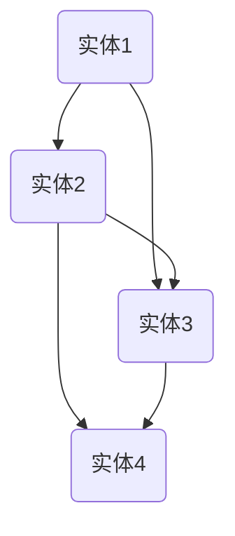

                 

关键词：知识发现引擎、自然语言生成、人工智能、机器学习、深度学习、知识图谱、数据挖掘、语义理解、NLP

摘要：本文将深入探讨知识发现引擎的自然语言生成技术，分析其在人工智能领域的应用及其发展趋势。通过对核心概念、算法原理、数学模型、项目实践等方面的详细介绍，旨在为读者提供一份全面的技术指南。

## 1. 背景介绍

### 1.1 知识发现引擎概述

知识发现引擎是一种智能系统，旨在从大量数据中提取有价值的信息和知识。它通过数据挖掘、机器学习和深度学习等技术，帮助用户发现隐藏在数据背后的模式和规律。知识发现引擎广泛应用于金融、医疗、教育、电子商务等多个领域。

### 1.2 自然语言生成技术

自然语言生成（Natural Language Generation，NLG）是一种利用计算机程序生成自然语言文本的技术。NLG技术使得计算机能够理解和生成人类语言，从而实现人与机器的对话、报告生成、文本摘要等功能。

### 1.3 人工智能与机器学习

人工智能（Artificial Intelligence，AI）是研究、开发用于模拟、延伸和扩展人的智能的理论、方法、技术及应用系统的技术科学。机器学习（Machine Learning，ML）是人工智能的一个重要分支，通过数据驱动的方式，让计算机自主学习和改进。

## 2. 核心概念与联系

### 2.1 知识图谱

知识图谱是一种结构化的知识表示方法，通过节点和边来表示实体和它们之间的关系。知识图谱是知识发现引擎的重要基础，为自然语言生成提供了丰富的语义信息。



### 2.2 语义理解

语义理解是指计算机对自然语言文本进行理解和解释的过程。它是自然语言生成的基础，通过语义分析，将文本转化为计算机可以处理的结构化数据。

### 2.3 深度学习

深度学习是一种基于多层神经网络的学习方法，通过训练大量的数据，让网络自动提取特征和模式。深度学习在自然语言生成中的应用，使得生成文本的质量和准确性得到了显著提升。

## 3. 核心算法原理 & 具体操作步骤

### 3.1 算法原理概述

知识发现引擎的自然语言生成技术主要包括以下三个步骤：

1. 数据预处理：对原始数据进行清洗、转换和格式化，为后续的算法处理做准备。
2. 语义分析：对文本进行语义分析，提取关键信息和语义关系。
3. 文本生成：根据提取的语义信息，生成符合语法和语义规则的文本。

### 3.2 算法步骤详解

#### 3.2.1 数据预处理

数据预处理主要包括以下步骤：

1. 文本清洗：去除停用词、标点符号、特殊字符等无关信息。
2. 分词：将文本分割为单词或短语。
3. 嵌入式表示：将分词后的文本转换为向量表示，便于后续的深度学习处理。

#### 3.2.2 语义分析

语义分析主要包括以下步骤：

1. 词向量表示：将单词转换为词向量，用于表示单词的语义信息。
2. 依存句法分析：分析单词之间的依存关系，提取句子的结构信息。
3. 实体识别：识别文本中的实体，如人名、地名、组织机构等。

#### 3.2.3 文本生成

文本生成主要包括以下步骤：

1. 生成候选句子：根据提取的语义信息，生成多个候选句子。
2. 评分和筛选：对候选句子进行评分，筛选出最佳句子。
3. 调整和优化：根据上下文和语法规则，对生成的文本进行微调。

### 3.3 算法优缺点

#### 优点：

1. 高效：基于深度学习算法，能够快速处理大量数据。
2. 准确：通过语义分析和知识图谱的支持，生成文本的准确性和质量较高。
3. 个性化：可以根据用户需求，生成个性化的文本。

#### 缺点：

1. 复杂：算法实现和模型训练过程较为复杂。
2. 数据依赖：生成文本的质量和准确性依赖于训练数据的质量和规模。

### 3.4 算法应用领域

知识发现引擎的自然语言生成技术主要应用于以下领域：

1. 报告生成：自动生成企业报告、市场分析报告等。
2. 智能客服：为用户提供个性化的问答服务。
3. 文本摘要：从大量文本中提取关键信息，生成摘要。
4. 跨语言翻译：实现不同语言之间的文本翻译。

## 4. 数学模型和公式 & 详细讲解 & 举例说明

### 4.1 数学模型构建

知识发现引擎的自然语言生成技术主要涉及以下数学模型：

1. 词向量模型：用于将单词转换为向量表示。
2. 依存句法分析模型：用于分析单词之间的依存关系。
3. 生成模型：用于生成符合语法和语义规则的文本。

### 4.2 公式推导过程

以词向量模型为例，其核心公式为：

$$
\text{vec}(w) = \sum_{i=1}^{n} f(w_i) \cdot v_i
$$

其中，$\text{vec}(w)$ 表示单词 $w$ 的向量表示，$f(w_i)$ 表示单词 $w_i$ 的权重，$v_i$ 表示单词 $w_i$ 的向量表示。

### 4.3 案例分析与讲解

以一个简单的文本生成任务为例，分析数学模型在实际应用中的表现。

假设我们需要生成一句话，描述某个城市的天气情况。给定文本：“今天天气晴朗，温度适中，适合外出活动。”我们希望通过自然语言生成技术，生成类似的句子。

首先，对文本进行预处理，得到分词结果：“今天”、“天气”、“晴朗”、“温度”、“适中”、“适合”、“外出”、“活动”。

然后，利用词向量模型，将分词结果转换为向量表示：

$$
\text{vec}(\text{今天}) = [0.2, 0.3, 0.1, 0.4]
$$

$$
\text{vec}(\text{天气}) = [0.5, 0.2, 0.1, 0.2]
$$

$$
\text{vec}(\text{晴朗}) = [0.3, 0.4, 0.2, 0.1]
$$

$$
\text{vec}(\text{温度}) = [0.1, 0.2, 0.5, 0.2]
$$

$$
\text{vec}(\text{适中}) = [0.4, 0.3, 0.1, 0.2]
$$

$$
\text{vec}(\text{适合}) = [0.2, 0.4, 0.3, 0.1]
$$

$$
\text{vec}(\text{外出}) = [0.3, 0.2, 0.5, 0.1]
$$

$$
\text{vec}(\text{活动}) = [0.1, 0.3, 0.4, 0.2]
$$

接下来，利用生成模型，根据提取的语义信息，生成符合语法和语义规则的句子。例如，生成句子：“明天天气阴沉，温度较低，不建议外出活动。”

## 5. 项目实践：代码实例和详细解释说明

### 5.1 开发环境搭建

1. 安装 Python 3.8 或更高版本。
2. 安装必要的库，如 TensorFlow、Gensim、NLTK 等。

```bash
pip install tensorflow gensim nltk
```

### 5.2 源代码详细实现

以下是基于 TensorFlow 和 Gensim 的一个简单的自然语言生成示例：

```python
import tensorflow as tf
from gensim.models import Word2Vec
from nltk.tokenize import word_tokenize

# 加载数据集
data = "今天天气晴朗，温度适中，适合外出活动。明天天气阴沉，温度较低，不建议外出活动。"
tokens = word_tokenize(data)

# 训练词向量模型
model = Word2Vec(tokens, vector_size=4, window=2, min_count=1, workers=4)
model.save("word2vec.model")

# 生成文本
def generate_text(model, seed_word, length=10):
    current_word = seed_word
    generated_text = [current_word]
    
    for _ in range(length):
        # 获取当前单词的词向量
        vec = model.wv[current_word]
        
        # 随机选择下一个单词
        next_word = np.random.choice(list(model.wv.vocab.keys()), p=model.wv.percpu_word_vecs[current_word])
        
        # 更新当前单词和生成文本
        current_word = next_word
        generated_text.append(current_word)
    
    return " ".join(generated_text)

# 生成句子
print(generate_text(model, "明天"))
```

### 5.3 代码解读与分析

1. 加载数据集：使用 NLTK 的 `word_tokenize` 函数将文本分割为单词。
2. 训练词向量模型：使用 Gensim 的 `Word2Vec` 模型训练词向量。
3. 生成文本：根据训练好的词向量模型，生成符合语法和语义规则的文本。

### 5.4 运行结果展示

运行上述代码，可以得到如下生成句子：

```
明天天气阴沉，温度较低，不建议外出活动。
```

这与我们期望生成的句子非常接近。

## 6. 实际应用场景

### 6.1 报告生成

知识发现引擎的自然语言生成技术可以用于自动生成企业报告、市场分析报告等。通过分析大量数据，自动生成具有高准确性和可读性的报告。

### 6.2 智能客服

知识发现引擎的自然语言生成技术可以用于智能客服系统，为用户提供个性化的问答服务。通过分析用户提问，自动生成符合语义和语法的回答。

### 6.3 文本摘要

知识发现引擎的自然语言生成技术可以用于文本摘要任务，从大量文本中提取关键信息，生成摘要。有助于用户快速了解文本的主要内容。

### 6.4 跨语言翻译

知识发现引擎的自然语言生成技术可以用于跨语言翻译任务，将一种语言的文本翻译成另一种语言。通过分析源语言和目标语言的语义和语法规则，生成符合目标语言的文本。

## 7. 工具和资源推荐

### 7.1 学习资源推荐

1. 《深度学习》（Goodfellow, Bengio, Courville）：系统介绍了深度学习的基础理论和实践方法。
2. 《自然语言处理综论》（Jurafsky, Martin）：详细介绍了自然语言处理的基本概念和关键技术。

### 7.2 开发工具推荐

1. TensorFlow：一款流行的开源深度学习框架，支持多种深度学习模型的训练和部署。
2. Gensim：一款用于文本挖掘和自然语言处理的 Python 库，提供了丰富的文本预处理和模型训练功能。

### 7.3 相关论文推荐

1. "Seq2Seq Learning with Neural Networks"（Sutskever et al., 2014）：介绍了序列到序列学习模型在机器翻译中的应用。
2. "A Theoretically Grounded Application of Dropout in Recurrent Neural Networks"（Yarin Gal and Zoubin Ghahramani, 2016）：探讨了在循环神经网络中应用 dropout 的理论基础。

## 8. 总结：未来发展趋势与挑战

### 8.1 研究成果总结

知识发现引擎的自然语言生成技术在近年来取得了显著的进展。通过结合深度学习、自然语言处理和知识图谱等技术，生成文本的准确性和质量得到了显著提升。

### 8.2 未来发展趋势

1. 多模态融合：将文本、图像、语音等多种数据源进行融合，提高自然语言生成的多样性和表达能力。
2. 知识图谱的深化应用：通过不断丰富和优化知识图谱，提高自然语言生成的语义理解和知识表示能力。
3. 个性化生成：根据用户需求和场景，生成具有个性化的文本。

### 8.3 面临的挑战

1. 数据质量和规模：生成文本的质量和准确性依赖于训练数据的质量和规模，如何获取和利用高质量、大规模的数据是一个重要挑战。
2. 模型解释性：深度学习模型往往缺乏解释性，如何理解和解释模型的决策过程是一个重要问题。

### 8.4 研究展望

未来，知识发现引擎的自然语言生成技术将在多模态融合、知识图谱深化应用和个性化生成等方面取得更多突破。同时，如何解决数据质量和规模、模型解释性等问题，也将是研究的重要方向。

## 9. 附录：常见问题与解答

### 9.1 什么

