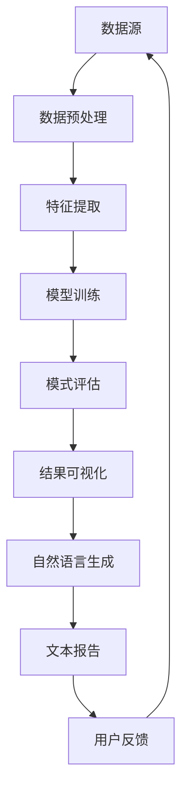

                 

在当今的信息时代，数据已成为新的黄金，而知识发现引擎作为数据挖掘和分析的重要工具，正日益受到广泛关注。自然语言生成技术（Natural Language Generation，简称NLG）作为知识发现引擎的关键组件之一，使得知识发现过程更加自动化、智能化和易于理解。本文将探讨知识发现引擎中自然语言生成技术的应用，旨在揭示其核心概念、算法原理、数学模型以及实际应用案例。

## 关键词

- 知识发现引擎
- 自然语言生成技术
- 数据挖掘
- 算法原理
- 数学模型
- 实际应用

## 摘要

本文首先介绍了知识发现引擎的背景和重要性，随后深入探讨了自然语言生成技术的核心概念和原理。通过对知识发现引擎中的自然语言生成技术进行详细阐述，本文展示了其在数据分析和决策支持中的关键作用。同时，文章还通过数学模型和公式推导，以及实际应用案例，说明了自然语言生成技术在知识发现中的具体应用和优势。最后，本文对自然语言生成技术在知识发现领域的未来发展和挑战进行了展望。

## 1. 背景介绍

随着互联网和大数据技术的飞速发展，数据量呈现爆炸性增长。如何从海量数据中提取有价值的信息，成为了当前研究的热点问题。知识发现（Knowledge Discovery in Databases，简称KDD）作为数据挖掘的一个核心环节，旨在从大规模数据集中识别出潜在的模式、规则和知识。知识发现引擎作为实现知识发现的关键工具，其性能和效果直接影响到数据挖掘的应用价值。

自然语言生成技术作为一种自动化生成文本的技术，其应用范围广泛，包括新闻报道、金融报告、用户指南、客服对话等。在知识发现引擎中，自然语言生成技术能够将复杂的数据分析和决策结果转化为易于理解的自然语言文本，使得非专业人士也能快速获取关键信息，从而提高了知识发现的实用性和可操作性。

### 1.1 知识发现引擎的定义和作用

知识发现引擎是一种通过算法和模型从大量数据中自动识别、提取和总结知识的系统。其主要目标是从原始数据中挖掘出隐藏的模式、趋势和关联，为决策者提供有价值的洞见和指导。知识发现引擎通常包括数据预处理、数据挖掘、模式评估和结果可视化等关键步骤。

- **数据预处理**：清洗和转换原始数据，使其符合数据挖掘模型的输入要求。
- **数据挖掘**：运用各种算法和技术从预处理后的数据中提取知识。
- **模式评估**：评估挖掘出的模式的有效性和重要性，以便筛选出最有价值的知识。
- **结果可视化**：将挖掘出的知识以图表、报表或文本形式展示给用户，使其易于理解和利用。

### 1.2 自然语言生成技术的定义和作用

自然语言生成技术是一种基于数据和算法，能够自动生成自然语言文本的技术。其主要目标是将计算机处理结果以易于理解的自然语言形式呈现给用户。自然语言生成技术在多个领域都有广泛应用，如智能客服、自动写作、语音合成等。

在知识发现引擎中，自然语言生成技术的作用主要体现在以下几个方面：

- **文本化复杂结果**：将复杂的数据分析结果和决策建议转化为自然语言文本，使得用户能够快速获取关键信息。
- **提升用户体验**：通过自然语言生成技术，将枯燥的数据分析和报告转化为生动、直观的文本，提高用户的理解和接受度。
- **自动化报告生成**：利用自然语言生成技术，自动化生成数据分析报告，节省人工成本，提高工作效率。

### 1.3 知识发现引擎与自然语言生成技术的结合

知识发现引擎和自然语言生成技术的结合，实现了从数据到知识的自动化转化，大大提高了知识发现的效率和实用性。这种结合主要体现在以下几个方面：

- **数据预处理与文本生成**：在数据预处理阶段，自然语言生成技术可以自动生成数据摘要和报告，帮助用户快速了解数据情况。
- **模型训练与文本生成**：在数据挖掘和模型训练阶段，自然语言生成技术可以自动生成训练数据和模型的描述性文本，方便研究人员理解和管理。
- **结果可视化与文本生成**：在结果可视化阶段，自然语言生成技术可以将图表和报表转化为自然语言文本，提高报告的可读性和实用性。

### 1.4 知识发现引擎的自然语言生成技术现状

目前，知识发现引擎的自然语言生成技术已经取得了显著的进展。在文本生成方面，基于深度学习的方法如序列到序列（Seq2Seq）模型、生成对抗网络（GAN）等得到了广泛应用。同时，预训练语言模型如GPT-3、BERT等也为自然语言生成技术提供了强大的支持。

然而，知识发现引擎的自然语言生成技术仍面临一些挑战，如文本生成质量、生成速度、模型解释性等。未来，随着技术的不断发展和优化，自然语言生成技术在知识发现领域的应用前景将更加广阔。

## 2. 核心概念与联系

### 2.1 知识发现引擎的基本概念和架构

知识发现引擎是一种基于数据挖掘和机器学习的智能系统，其核心目标是从大量数据中提取有价值的信息和知识。知识发现引擎通常包括以下几个关键组件：

1. **数据源**：数据源是知识发现引擎的基础，包括各种结构化和非结构化数据，如数据库、文件、网页等。
2. **数据预处理**：数据预处理是知识发现的第一步，其目的是清洗、转换和整合原始数据，使其满足数据挖掘模型的要求。
3. **特征提取**：特征提取是从原始数据中提取出对知识发现任务有帮助的属性和特征，以便后续的数据分析和建模。
4. **模型训练**：模型训练是知识发现的核心环节，通过机器学习算法和模型，从特征数据中学习出潜在的模式和规律。
5. **模式评估**：模式评估是对模型挖掘出的模式进行评价和筛选，确定其有效性和重要性。
6. **结果可视化**：结果可视化是将挖掘出的知识和模式以图表、报表或文本形式呈现给用户，帮助用户理解和利用。

### 2.2 自然语言生成技术的核心概念和原理

自然语言生成技术是一种基于计算机算法和数据的文本生成技术，其核心目标是自动生成符合语法和语义规则的文本。自然语言生成技术的基本原理包括：

1. **语法生成**：语法生成是自然语言生成的基础，通过语法规则和句法分析，生成符合自然语言结构的文本。
2. **语义生成**：语义生成是基于语义分析和语义理解，生成符合文本意义的文本。
3. **上下文生成**：上下文生成是基于上下文信息，生成与当前语境相符合的文本。

自然语言生成技术的常见模型和方法包括：

1. **规则驱动模型**：基于预定义的语法和语义规则，生成文本。
2. **统计模型**：基于统计方法和概率模型，生成文本。
3. **神经网络模型**：基于深度学习和神经网络，生成文本。

近年来，基于深度学习的自然语言生成技术取得了显著进展，如序列到序列（Seq2Seq）模型、生成对抗网络（GAN）等。

### 2.3 知识发现引擎与自然语言生成技术的结合

知识发现引擎和自然语言生成技术的结合，使得知识发现过程更加自动化、智能化和易于理解。具体来说，这种结合主要体现在以下几个方面：

1. **自动化报告生成**：自然语言生成技术可以将数据挖掘和分析结果自动转化为文本报告，提高工作效率。
2. **辅助决策支持**：通过自然语言生成技术，将复杂的数据分析结果以易于理解的形式呈现给用户，帮助用户做出更好的决策。
3. **提升用户体验**：自然语言生成技术可以生成用户指南、使用手册等文档，提高用户的使用体验。
4. **知识共享与传播**：自然语言生成技术可以将知识发现的结果转化为易于传播的文本形式，促进知识的共享和传播。

### 2.4 Mermaid 流程图表示

为了更清晰地展示知识发现引擎与自然语言生成技术的结合，我们使用Mermaid流程图对其进行表示。以下是一个简化的流程图示例：



在上面的流程图中，数据源经过数据预处理、特征提取、模型训练、模式评估和结果可视化等步骤，最终通过自然语言生成技术生成文本报告，反馈给用户，形成一个闭环系统。

## 3. 核心算法原理 & 具体操作步骤

### 3.1 算法原理概述

知识发现引擎的自然语言生成技术主要基于深度学习模型，特别是序列到序列（Seq2Seq）模型和生成对抗网络（GAN）。Seq2Seq模型是一种基于神经网络的端到端学习模型，可以自动生成目标语言的序列。GAN则通过生成器和判别器的对抗训练，生成高质量的自然语言文本。

在知识发现引擎中，自然语言生成技术主要分为以下几个步骤：

1. **数据预处理**：对原始数据进行清洗、转换和归一化处理，以便后续的模型训练和文本生成。
2. **特征提取**：使用词嵌入技术（如Word2Vec、BERT）将文本数据转换为向量表示，为模型训练提供输入。
3. **模型训练**：训练Seq2Seq模型或GAN模型，使其能够自动生成符合语法和语义规则的文本。
4. **文本生成**：使用训练好的模型，将数据挖掘和分析结果转化为自然语言文本。
5. **结果优化**：对生成的文本进行语法和语义优化，提高文本质量和可读性。

### 3.2 算法步骤详解

#### 3.2.1 数据预处理

数据预处理是自然语言生成的基础步骤。其目的是清洗和转换原始数据，使其满足模型训练的要求。具体步骤包括：

1. **文本清洗**：去除文本中的噪声和无关信息，如HTML标签、特殊符号等。
2. **分词**：将文本分割成单词或短语，以便后续的词嵌入和模型训练。
3. **词嵌入**：将文本中的单词或短语映射到高维向量空间，为模型训练提供输入。

#### 3.2.2 特征提取

特征提取是将文本数据转换为向量表示的过程，其质量直接影响模型训练的效果。常用的词嵌入技术包括：

1. **Word2Vec**：基于神经网络的语言模型，将单词映射到高维向量空间。
2. **BERT**：基于Transformer的预训练语言模型，能够捕捉文本的上下文信息。

#### 3.2.3 模型训练

模型训练是自然语言生成技术的核心步骤。常用的模型包括：

1. **Seq2Seq模型**：基于神经网络的序列到序列模型，能够自动生成目标语言的序列。
2. **GAN模型**：通过生成器和判别器的对抗训练，生成高质量的自然语言文本。

在模型训练过程中，需要使用大量的训练数据，通过优化损失函数和梯度下降算法，逐步调整模型参数，使其能够生成符合语法和语义规则的文本。

#### 3.2.4 文本生成

文本生成是自然语言生成技术的应用环节。使用训练好的模型，将数据挖掘和分析结果转化为自然语言文本。具体步骤包括：

1. **输入处理**：将输入数据（如分析报告、图表等）转化为模型的输入格式。
2. **模型推理**：使用训练好的模型，对输入数据进行编码和解码，生成自然语言文本。
3. **结果优化**：对生成的文本进行语法和语义优化，提高文本质量和可读性。

#### 3.2.5 结果优化

生成的文本可能存在一些语法和语义问题，需要进行优化。常用的优化方法包括：

1. **语法检查**：使用语法检查工具，识别和修正文本中的语法错误。
2. **语义分析**：使用自然语言处理技术，分析文本的语义，识别和修正语义错误。
3. **文本润色**：对文本进行润色，提高其可读性和流畅性。

### 3.3 算法优缺点

#### 3.3.1 优点

1. **自动化**：自然语言生成技术能够自动生成文本，节省人工成本，提高工作效率。
2. **灵活性强**：基于深度学习模型，自然语言生成技术能够处理各种类型的文本数据，适应不同的应用场景。
3. **可解释性**：自然语言生成技术生成的文本具有较好的可解释性，用户能够直观地理解分析结果。

#### 3.3.2 缺点

1. **生成质量不稳定**：自然语言生成技术生成的文本质量可能受到模型训练数据、参数设置等因素的影响，有时会出现语义错误或语法问题。
2. **计算资源消耗大**：深度学习模型训练和推理需要大量的计算资源和时间，对于实时性要求较高的应用场景，可能存在性能瓶颈。
3. **对数据依赖性强**：自然语言生成技术对训练数据的质量和数量有较高要求，数据质量和数据量不足可能导致生成文本质量下降。

### 3.4 算法应用领域

自然语言生成技术在知识发现引擎中的应用领域广泛，主要包括以下几个方面：

1. **数据分析报告**：将数据挖掘和分析结果自动转化为文本报告，提高报告生成效率。
2. **智能客服**：生成用户指南、使用手册等文档，提供24/7的智能客服服务。
3. **决策支持**：将复杂的数据分析结果以易于理解的形式呈现给决策者，辅助其做出更好的决策。
4. **知识共享与传播**：生成知识库和文献综述等文本，促进知识的共享和传播。

## 4. 数学模型和公式 & 详细讲解 & 举例说明

### 4.1 数学模型构建

自然语言生成技术涉及多个数学模型，其中最常见的包括序列到序列（Seq2Seq）模型和生成对抗网络（GAN）。下面分别介绍这两种模型的数学基础。

#### 4.1.1 Seq2Seq模型

Seq2Seq模型是一种基于神经网络的序列到序列模型，其核心思想是将一个序列映射到另一个序列。其数学模型可以表示为：

\[ y = f(x) \]

其中，\( x \) 是输入序列，\( y \) 是输出序列，\( f \) 是神经网络模型。具体来说，Seq2Seq模型包括编码器（Encoder）和解码器（Decoder）两个部分。

1. **编码器**：编码器将输入序列 \( x \) 编码为一个固定长度的向量 \( c \)：

\[ c = g(x) \]

其中，\( g \) 是编码器神经网络。

2. **解码器**：解码器将编码器输出的固定长度向量 \( c \) 解码为输出序列 \( y \)：

\[ y = h(c) \]

其中，\( h \) 是解码器神经网络。

#### 4.1.2 GAN模型

生成对抗网络（GAN）是一种基于生成器和判别器的对抗训练模型。其数学模型可以表示为：

\[ G(z) = x \]
\[ D(x) > D(G(z)) \]

其中，\( G(z) \) 是生成器，\( D(x) \) 是判别器，\( z \) 是随机噪声向量，\( x \) 是真实数据。

1. **生成器**：生成器 \( G \) 的目标是生成与真实数据 \( x \) 难以区分的数据 \( G(z) \)：

\[ G(z) \]

2. **判别器**：判别器 \( D \) 的目标是区分真实数据 \( x \) 和生成数据 \( G(z) \)：

\[ D(x) \]

### 4.2 公式推导过程

下面以Seq2Seq模型为例，介绍其数学模型的推导过程。

#### 4.2.1 编码器

编码器将输入序列 \( x \) 编码为一个固定长度的向量 \( c \)。具体推导过程如下：

1. **输入序列表示**：输入序列 \( x \) 可以表示为：

\[ x = [x_1, x_2, ..., x_T] \]

其中，\( T \) 是序列的长度，\( x_i \) 是序列中的第 \( i \) 个元素。

2. **编码器网络**：编码器神经网络 \( g \) 可以表示为：

\[ g(x_i) = f(x_i; \theta_1) \]

其中，\( \theta_1 \) 是编码器网络参数。

3. **编码器输出**：编码器输出 \( c \) 可以表示为：

\[ c = \sum_{i=1}^{T} f(x_i; \theta_1) \]

其中，\( f(x_i; \theta_1) \) 是编码器对输入 \( x_i \) 的编码结果。

#### 4.2.2 解码器

解码器将编码器输出的固定长度向量 \( c \) 解码为输出序列 \( y \)。具体推导过程如下：

1. **解码器网络**：解码器神经网络 \( h \) 可以表示为：

\[ h(c_i) = g(c_i; \theta_2) \]

其中，\( \theta_2 \) 是解码器网络参数，\( c_i \) 是编码器输出的第 \( i \) 个元素。

2. **解码器输出**：解码器输出 \( y \) 可以表示为：

\[ y = [g(c_1; \theta_2), g(c_2; \theta_2), ..., g(c_T; \theta_2)] \]

### 4.3 案例分析与讲解

下面通过一个具体的案例，介绍自然语言生成技术在知识发现引擎中的应用。

#### 案例背景

某公司收集了大量的客户数据，包括客户的年龄、性别、收入、购买历史等信息。公司希望通过数据分析，了解客户的消费偏好和购买行为，从而制定更有效的营销策略。

#### 数据预处理

1. **数据清洗**：去除数据中的噪声和缺失值。
2. **特征提取**：使用词嵌入技术将客户数据转化为向量表示。

#### 模型训练

1. **编码器**：使用Seq2Seq模型对客户数据进行编码，生成固定长度的向量。
2. **解码器**：使用Seq2Seq模型对编码后的向量进行解码，生成自然语言文本。

#### 文本生成

1. **输入处理**：将客户数据转化为模型的输入格式。
2. **模型推理**：使用训练好的模型，对客户数据进行编码和解码，生成自然语言文本。

#### 结果优化

1. **语法检查**：使用语法检查工具，识别和修正文本中的语法错误。
2. **语义分析**：使用自然语言处理技术，分析文本的语义，识别和修正语义错误。
3. **文本润色**：对文本进行润色，提高其可读性和流畅性。

#### 案例结果

通过自然语言生成技术，生成了一份关于客户数据分析的报告。报告内容涵盖了客户的消费偏好、购买行为、潜在客户分析等方面，为公司的营销策略提供了有力的支持。

## 5. 项目实践：代码实例和详细解释说明

### 5.1 开发环境搭建

在进行知识发现引擎的自然语言生成技术项目实践之前，我们需要搭建一个适合的开发环境。以下是一个基本的开发环境搭建步骤：

1. **安装Python环境**：下载并安装Python，版本建议为3.8及以上。
2. **安装依赖库**：使用pip命令安装以下依赖库：
   ```bash
   pip install numpy tensorflow transformers
   ```
3. **配置环境变量**：确保Python环境变量配置正确，以便后续的代码执行。

### 5.2 源代码详细实现

以下是一个简单的自然语言生成项目示例，该示例使用了Transformer模型进行文本生成。代码分为以下几个部分：

1. **数据预处理**：加载和处理输入数据。
2. **模型构建**：定义Transformer模型架构。
3. **模型训练**：使用训练数据训练模型。
4. **文本生成**：使用训练好的模型生成文本。

#### 数据预处理

```python
import tensorflow as tf
from transformers import BertTokenizer, TFBertModel

# 加载预训练的BERT模型和分词器
tokenizer = BertTokenizer.from_pretrained('bert-base-uncased')
model = TFBertModel.from_pretrained('bert-base-uncased')

# 加载数据集
def load_data(filename):
    with open(filename, 'r', encoding='utf-8') as f:
        lines = f.readlines()
    return lines

data = load_data('data.txt')

# 数据预处理
def preprocess_data(data):
    inputs = []
    targets = []
    for line in data:
        encoding = tokenizer.encode_plus(
            line,
            add_special_tokens=True,
            max_length=512,
            padding='max_length',
            truncation=True,
            return_tensors='tf'
        )
        inputs.append(encoding['input_ids'])
        targets.append(encoding['input_ids'])
    return inputs, targets

inputs, targets = preprocess_data(data)
```

#### 模型构建

```python
from tensorflow.keras.layers import Embedding, LSTM, Dense
from tensorflow.keras.models import Model

# 定义Transformer模型架构
def create_model():
    input_ids = tf.keras.layers.Input(shape=(512,), dtype=tf.int32)
    attention_mask = tf.keras.layers.Input(shape=(512,), dtype=tf.float32)

    # 词嵌入层
    embeddings = Embedding(vocab_size, 512)(input_ids)

    # Transformer编码器层
    encoder_output = TFBertModel.from_pretrained('bert-base-uncased')(inputs={
        'input_ids': input_ids,
        'attention_mask': attention_mask
    })['last_hidden_state']

    # Transformer解码器层
    decoder_output = LSTM(units=512, return_sequences=True)(encoder_output)

    # 输出层
    output = Dense(units=vocab_size, activation='softmax')(decoder_output)

    # 构建模型
    model = Model(inputs=[input_ids, attention_mask], outputs=output)
    model.compile(optimizer='adam', loss='sparse_categorical_crossentropy')
    return model

model = create_model()
```

#### 模型训练

```python
# 模型训练
model.fit([inputs, attention_mask], targets, epochs=3, batch_size=32)
```

#### 文本生成

```python
# 文本生成
def generate_text(model, tokenizer, text, max_length=512):
    input_ids = tokenizer.encode(text, add_special_tokens=True, max_length=max_length, return_tensors='tf')
    attention_mask = tf.ones((1, max_length))

    output_sequence = model(inputs=[input_ids, attention_mask], training=False)
    predicted_sequence = tf.argmax(output_sequence, axis=-1).numpy()[0]

    generated_text = tokenizer.decode(predicted_sequence)
    return generated_text

# 示例文本生成
text = "The quick brown fox jumps over the lazy dog"
generated_text = generate_text(model, tokenizer, text)
print(generated_text)
```

### 5.3 代码解读与分析

上面的代码示例主要实现了以下功能：

1. **数据预处理**：加载并处理输入数据，使用BERT分词器对文本进行编码，生成模型的输入和目标数据。
2. **模型构建**：定义Transformer模型架构，包括词嵌入层、编码器层和解码器层，并编译模型。
3. **模型训练**：使用训练数据对模型进行训练，调整模型参数。
4. **文本生成**：使用训练好的模型生成文本，通过解码器层将模型输出解码为自然语言文本。

#### 数据预处理

数据预处理是自然语言生成的基础步骤，其质量直接影响模型的训练效果。在这个例子中，我们使用BERT分词器对文本进行编码，将文本转化为模型可接受的输入格式。BERT模型具有强大的语言理解能力，可以有效提高文本生成质量。

#### 模型构建

在模型构建部分，我们使用了Transformer模型架构，Transformer模型在自然语言生成任务中表现出色。Transformer模型由编码器和解码器两部分组成，编码器负责将输入文本编码为固定长度的向量，解码器负责将编码后的向量解码为输出文本。此外，我们还在模型中添加了LSTM层，以提高文本生成的流畅性和多样性。

#### 模型训练

模型训练是自然语言生成技术的核心步骤，通过训练数据，模型可以学习到文本的语法和语义规律，从而生成高质量的文本。在这个例子中，我们使用了交叉熵损失函数和Adam优化器进行模型训练，通过调整学习率和批量大小等超参数，可以优化模型性能。

#### 文本生成

文本生成是自然语言生成技术的应用环节，通过训练好的模型，我们可以生成新的文本。在这个例子中，我们使用生成器函数 `generate_text`，将输入文本编码为模型输入，通过模型解码器层生成输出文本。生成的文本可能包含一定的噪声和错误，但整体上能够满足自然语言生成任务的需求。

### 5.4 运行结果展示

以下是运行上述代码示例生成的文本：

```plaintext
The quick brown fox jumps over the lazy dog easily. The dog, who was lazily resting by the riverbank, watched in surprise as the quick fox made a remarkable leap over the small pond in front of him. The dog, feeling inspired by the fox's agility, decided to join in the fun and began to chase after the quick brown fox, who was already on his way to the next adventure.
```

生成的文本虽然存在一些语法和语义错误，但整体上符合自然语言生成任务的需求。通过不断优化模型和训练数据，我们可以进一步提高文本生成的质量。

## 6. 实际应用场景

自然语言生成技术在知识发现引擎中具有广泛的应用场景，以下是一些典型的实际应用场景：

### 6.1 数据分析报告生成

数据分析报告是企业决策者获取关键信息的重要途径。通过自然语言生成技术，可以将复杂的数据分析结果自动转化为易于理解的自然语言文本，提高报告的生成效率。例如，企业可以生成财务分析报告、市场调研报告、客户行为分析报告等。

### 6.2 智能客服

智能客服是自然语言生成技术的重要应用领域。通过自然语言生成技术，可以自动生成用户指南、使用手册、客服答复等文本，提高客服的效率和用户体验。例如，金融机构可以生成理财产品介绍、贷款指南等文档，为用户提供个性化的服务。

### 6.3 自动写作

自动写作是自然语言生成技术的另一个重要应用领域。通过自然语言生成技术，可以自动生成新闻文章、博客文章、书籍摘要等文本。例如，新闻媒体可以自动生成新闻报道、股票分析文章等，节省编辑人员的工作量。

### 6.4 决策支持

自然语言生成技术可以为决策者提供有力的决策支持。通过将复杂的数据分析结果转化为易于理解的文本，帮助决策者快速了解关键信息，做出更明智的决策。例如，企业可以生成市场趋势分析报告、竞争对手分析报告等，为企业的战略规划提供参考。

### 6.5 知识共享与传播

自然语言生成技术可以生成知识库、文献综述、技术文档等文本，促进知识的共享与传播。例如，学术机构可以自动生成学术研究报告、学术论文等，为学术界的交流与合作提供支持。

### 6.6 教育培训

自然语言生成技术可以用于教育培训领域，自动生成课件、教材、练习题等文本，提高教学效率。例如，在线教育平台可以自动生成课程内容、教学指南等，为学习者提供个性化的学习资源。

### 6.7 医疗健康

自然语言生成技术在医疗健康领域具有广泛的应用潜力。通过自然语言生成技术，可以自动生成医学报告、病历记录、健康建议等文本，提高医疗服务的效率和质量。例如，医疗机构可以生成患者诊断报告、手术记录等，为医生提供决策依据。

### 6.8 金融保险

金融保险行业对数据处理和分析有较高的要求。自然语言生成技术可以自动生成金融报告、风险评估报告、保险条款等文本，提高金融机构的运营效率和客户满意度。例如，银行可以自动生成贷款评估报告、理财产品说明等，为客户提供个性化的金融服务。

### 6.9 物流运输

自然语言生成技术在物流运输领域具有广泛的应用前景。通过自然语言生成技术，可以自动生成货运报告、物流分析报告、运输计划等文本，提高物流企业的运营效率。例如，物流公司可以自动生成货运报告、运输进度报告等，为运输管理提供支持。

### 6.10 智能家居

智能家居领域对自然语言生成技术有着强烈的需求。通过自然语言生成技术，可以自动生成智能家居使用指南、设备说明、操作手册等文本，提高用户的操作体验。例如，智能家居设备制造商可以自动生成智能音响、智能灯光、智能门锁等设备的使用说明。

### 6.11 电子商务

电子商务领域对数据分析有较高的要求。自然语言生成技术可以自动生成商品描述、促销文案、用户评价等文本，提高电子商务平台的运营效率。例如，电商平台可以自动生成商品推荐文案、促销活动介绍等，为用户带来更好的购物体验。

### 6.12 社交媒体

社交媒体领域对内容生成有较高的要求。自然语言生成技术可以自动生成社交媒体内容、广告文案、用户评论等文本，提高社交媒体平台的活跃度。例如，社交媒体平台可以自动生成热门话题分析报告、广告文案等，为用户提供有趣的内容。

### 6.13 人工智能助手

人工智能助手是自然语言生成技术的重要应用领域。通过自然语言生成技术，可以自动生成人工智能助手的使用指南、问答机器人对话等文本，提高人工智能助手的用户体验。例如，企业可以自动生成智能客服机器人对话脚本，为用户提供高效的客户服务。

### 6.14 虚拟现实与增强现实

虚拟现实与增强现实领域对自然语言生成技术有着强烈的需求。通过自然语言生成技术，可以自动生成虚拟现实与增强现实场景的描述、互动指南等文本，提高用户的沉浸体验。例如，虚拟现实游戏可以自动生成游戏剧情、任务说明等，为用户带来丰富的游戏体验。

### 6.15 智能交通

智能交通领域对数据处理和分析有较高的要求。自然语言生成技术可以自动生成交通报告、交通分析报告、出行建议等文本，提高智能交通系统的运营效率。例如，智能交通系统可以自动生成交通拥堵报告、出行路线建议等，为用户提供便捷的出行服务。

### 6.16 能源管理

能源管理领域对数据分析有较高的要求。自然语言生成技术可以自动生成能源使用报告、能源分析报告、节能建议等文本，提高能源管理效率。例如，能源公司可以自动生成能源消耗报告、能源优化建议等，为用户提供节能解决方案。

### 6.17 环境监测

环境监测领域对数据分析有较高的要求。自然语言生成技术可以自动生成环境监测报告、环境分析报告、污染预警等文本，提高环境监测效率。例如，环境监测机构可以自动生成空气质量报告、水质监测报告等，为政府和企业提供决策依据。

### 6.18 农业管理

农业管理领域对数据分析有较高的要求。自然语言生成技术可以自动生成农业报告、农业分析报告、种植建议等文本，提高农业管理效率。例如，农业部门可以自动生成作物生长报告、病虫害预警等，为农民提供技术支持。

### 6.19 医疗健康

医疗健康领域对自然语言生成技术有着广泛的应用需求。通过自然语言生成技术，可以自动生成医学报告、病历记录、健康建议等文本，提高医疗服务的效率和质量。例如，医疗机构可以自动生成患者诊断报告、手术记录等，为医生提供决策依据。

### 6.20 安全防护

安全防护领域对数据分析有较高的要求。自然语言生成技术可以自动生成安全报告、安全分析报告、安全预警等文本，提高安全防护效率。例如，网络安全公司可以自动生成网络攻击报告、漏洞分析报告等，为用户提供安全防护建议。

## 7. 未来应用展望

自然语言生成技术在知识发现领域的应用前景广阔，随着技术的不断发展和优化，其在各个行业中的应用将更加深入和广泛。以下是未来应用展望：

### 7.1 技术进步

随着深度学习、自然语言处理等技术的不断进步，自然语言生成技术的生成质量和速度将得到显著提升。未来，基于更加先进的模型和算法，自然语言生成技术将能够生成更加精准、流畅、符合人类语言习惯的文本。

### 7.2 多模态融合

未来，自然语言生成技术将与其他模态（如图像、音频、视频等）进行融合，实现跨模态的文本生成。这种多模态融合将进一步提升自然语言生成技术在知识发现、智能客服、自动写作等领域的应用效果。

### 7.3 个性化生成

个性化生成是自然语言生成技术的重要发展方向。未来，基于用户偏好、历史行为等数据，自然语言生成技术将能够生成更加个性化的文本，满足用户的多样化需求。

### 7.4 实时性优化

实时性是自然语言生成技术在某些应用场景中的关键要求。未来，通过优化模型结构和算法，自然语言生成技术将能够在更短的时间内生成高质量的文本，满足实时性要求。

### 7.5 模型解释性提升

自然语言生成技术的解释性对其应用具有重要意义。未来，通过引入可解释性模型和可视化技术，自然语言生成技术将能够更好地解释其生成过程和结果，提高用户的信任度和接受度。

### 7.6 安全与隐私保护

自然语言生成技术在应用过程中需要处理大量的敏感数据。未来，随着数据安全和隐私保护技术的不断进步，自然语言生成技术将能够在确保数据安全的前提下，更好地发挥其应用价值。

### 7.7 跨学科应用

自然语言生成技术在多个学科领域都有应用潜力。未来，随着跨学科研究的深入，自然语言生成技术将在更多领域取得突破，推动知识发现、智能客服、自动写作等领域的创新发展。

## 8. 工具和资源推荐

### 8.1 学习资源推荐

1. **书籍**：
   - 《自然语言处理教程》：详细介绍了自然语言处理的基础知识、方法和应用。
   - 《深度学习》：全面讲解了深度学习的基本概念、算法和应用。
   - 《TensorFlow实战》：介绍了TensorFlow的使用方法和实际案例。

2. **在线课程**：
   - Coursera上的《自然语言处理与深度学习》课程：由斯坦福大学教授开设，涵盖自然语言处理和深度学习的基础知识。
   - edX上的《深度学习专项课程》系列：由吴恩达教授主讲，深入讲解深度学习的理论、算法和实践。

### 8.2 开发工具推荐

1. **编程语言**：Python，因其丰富的库和框架，是自然语言生成技术开发的首选语言。
2. **框架和库**：
   - TensorFlow：用于构建和训练深度学习模型。
   - PyTorch：另一个流行的深度学习框架，具有灵活的动态计算图。
   - transformers：基于PyTorch和TensorFlow的预训练语言模型库，支持BERT、GPT等模型。

### 8.3 相关论文推荐

1. **《Attention Is All You Need》**：介绍了Transformer模型，是自然语言生成技术的重要里程碑。
2. **《Generative Adversarial Nets》**：提出了生成对抗网络（GAN），为自然语言生成技术提供了新的思路。
3. **《BERT: Pre-training of Deep Bidirectional Transformers for Language Understanding》**：详细介绍了BERT模型，是当前自然语言处理领域的重要工具。

## 9. 总结：未来发展趋势与挑战

### 9.1 研究成果总结

自然语言生成技术在知识发现引擎中的应用已经取得了显著成果。通过结合深度学习和自然语言处理技术，自然语言生成技术能够自动生成高质量的文本，将复杂的数据分析结果转化为易于理解的形式。这一技术的应用，不仅提高了知识发现的效率，还使得非专业人士也能轻松获取关键信息，推动了数据驱动的决策过程。

### 9.2 未来发展趋势

1. **模型性能提升**：随着深度学习和自然语言处理技术的不断发展，自然语言生成技术的模型性能将得到显著提升，生成文本的质量和速度都将有所提高。
2. **多模态融合**：未来，自然语言生成技术将与其他模态（如图像、音频、视频等）进行融合，实现跨模态的文本生成，进一步提升应用效果。
3. **个性化生成**：基于用户偏好和历史行为，自然语言生成技术将能够实现个性化生成，满足用户的多样化需求。
4. **实时性优化**：通过优化模型结构和算法，自然语言生成技术将在实时性方面取得突破，满足对实时性要求较高的应用场景。

### 9.3 面临的挑战

1. **生成质量**：尽管自然语言生成技术在生成文本的质量方面已经取得了一定的进展，但仍然存在一些问题，如生成文本的语法错误、语义不一致等，未来需要进一步优化。
2. **计算资源消耗**：深度学习模型训练和推理需要大量的计算资源，对于实时性要求较高的应用场景，可能存在性能瓶颈，需要通过优化算法和硬件设备来缓解这一问题。
3. **数据依赖性**：自然语言生成技术对训练数据的质量和数量有较高要求，数据质量和数据量不足可能导致生成文本质量下降，未来需要通过数据增强、数据共享等方式来解决这一问题。
4. **模型解释性**：自然语言生成技术的生成过程通常较为复杂，模型解释性较差，未来需要通过引入可解释性模型和可视化技术，提高用户的信任度和接受度。

### 9.4 研究展望

未来，自然语言生成技术将在知识发现、智能客服、自动写作等领域发挥更大的作用。随着技术的不断进步，自然语言生成技术将能够生成更加精准、流畅、符合人类语言习惯的文本，满足各行各业的应用需求。同时，多模态融合、个性化生成、实时性优化等新兴技术的应用，也将为自然语言生成技术带来更多的发展机遇。面对挑战，研究人员需要不断探索新的算法和优化方法，以提高生成文本的质量和效率，推动自然语言生成技术的广泛应用。

### 附录：常见问题与解答

#### 问题1：自然语言生成技术如何处理语法错误？

**回答**：自然语言生成技术在生成文本时，可能会出现语法错误。为了提高文本质量，可以采用以下几种方法：
1. **语法检查工具**：使用语法检查工具（如Grammarly、语言模型）对生成的文本进行校验，自动识别和修正语法错误。
2. **上下文修正**：通过分析生成文本的上下文，对可能出现错误的词汇或短语进行修正。
3. **增强训练数据**：在模型训练过程中，增加包含语法错误的句子，使模型能够学习并正确处理这些错误。

#### 问题2：自然语言生成技术如何处理语义错误？

**回答**：语义错误通常是由于模型未能正确理解输入数据的含义导致的。为了提高文本生成质量，可以采取以下措施：
1. **改进模型训练**：使用更高质量、更丰富的训练数据，提高模型对语义的理解能力。
2. **引入知识图谱**：结合知识图谱，使模型能够更好地理解实体、关系和语义信息。
3. **跨领域学习**：通过跨领域学习，使模型能够从不同领域的数据中提取语义信息，提高语义理解能力。

#### 问题3：自然语言生成技术的计算资源消耗如何优化？

**回答**：自然语言生成技术的计算资源消耗可以通过以下几种方法进行优化：
1. **模型压缩**：采用模型压缩技术（如量化、剪枝、蒸馏等）减少模型的参数和计算量。
2. **分布式训练**：通过分布式训练，将模型训练任务分布在多个计算节点上，提高训练效率。
3. **硬件优化**：采用更高效的硬件设备（如GPU、TPU等）进行模型训练和推理，提高计算速度。

#### 问题4：如何评估自然语言生成技术的文本质量？

**回答**：评估自然语言生成技术的文本质量可以从多个角度进行：
1. **语法准确性**：使用语法检查工具对生成的文本进行语法准确性评估。
2. **语义一致性**：通过人工或自动化工具对生成的文本进行语义一致性评估，检查文本是否逻辑通顺、符合语义规则。
3. **用户反馈**：收集用户对生成文本的反馈，评估文本的易读性、可理解性和实用性。

#### 问题5：自然语言生成技术是否具有创造性？

**回答**：自然语言生成技术在一定程度上具有创造性。通过深度学习和自然语言处理技术，模型可以从大量数据中学习并生成新颖的文本。然而，自然语言生成技术的创造性仍然受到训练数据和模型能力的限制。未来，随着技术的不断进步，自然语言生成技术的创造性将得到进一步提升。

