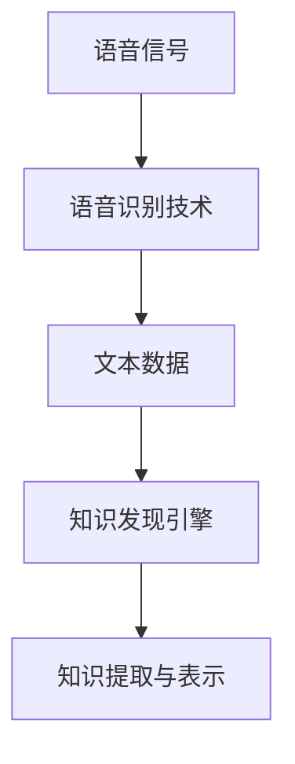

                 

关键词：知识发现、语音识别、技术集成、自然语言处理、人工智能

摘要：本文将深入探讨知识发现引擎与语音识别技术的集成，分析其背后的核心概念、算法原理、数学模型、项目实践以及实际应用场景，并展望未来的发展趋势与面临的挑战。

## 1. 背景介绍

知识发现（Knowledge Discovery in Databases，KDD）是指从大量的数据中通过算法和统计方法提取出有用的、新颖的、潜在的模式和知识的过程。这一领域涵盖了多个子领域，包括数据预处理、数据挖掘、模式识别和知识表示等。

语音识别（Automatic Speech Recognition，ASR）是人工智能领域的一个重要分支，旨在将人类的语音转换为计算机可理解和处理的数据。近年来，随着深度学习技术的不断发展，语音识别的性能得到了显著提升，已经在多个实际应用场景中取得了成功。

本文将探讨如何将语音识别技术集成到知识发现引擎中，以实现更高效的数据分析和知识提取。这一集成不仅能够提升知识发现引擎的性能，还能够拓展其应用范围，使得知识发现变得更加便捷和智能化。

### 1.1 知识发现引擎的作用

知识发现引擎是数据挖掘和知识管理的重要工具，其核心功能包括：

- 数据预处理：清洗、转换和归一化数据，以适应数据挖掘算法的需求。
- 特征提取：从原始数据中提取出有助于模式识别的特征。
- 模式识别：使用算法识别数据中的规律和模式。
- 知识表示：将挖掘出的知识以易于理解和使用的方式表示出来。

### 1.2 语音识别技术的发展

语音识别技术的发展历程可以追溯到20世纪50年代。最初，语音识别主要依赖于基于规则的方法，如隐马尔可夫模型（HMM）。随着计算能力的提升和深度学习技术的引入，基于神经网络的语音识别方法逐渐取代了传统方法，成为主流。

### 1.3 知识发现与语音识别的融合

知识发现与语音识别的融合旨在通过语音识别技术获取数据，然后使用知识发现方法对数据进行处理和分析。这种融合可以带来以下优势：

- 提高数据处理效率：语音识别技术能够快速地将语音转化为文本数据，为知识发现引擎提供实时数据源。
- 扩展应用范围：知识发现引擎可以应用于更广泛的语音相关领域，如语音助手、语音翻译、语音情感分析等。

## 2. 核心概念与联系

### 2.1 核心概念

- 知识发现引擎：用于从大量数据中提取知识的系统。
- 语音识别技术：将语音信号转换为文本的技术。
- 自然语言处理（NLP）：研究如何让计算机理解和生成人类语言。

### 2.2 架构联系

知识发现引擎与语音识别技术的集成可以通过以下架构实现：

```
[语音信号] --> [语音识别技术] --> [文本数据] --> [知识发现引擎] --> [知识提取与表示]
```

### 2.3 Mermaid 流程图



## 3. 核心算法原理 & 具体操作步骤

### 3.1 算法原理概述

语音识别技术主要基于深度学习算法，如卷积神经网络（CNN）和循环神经网络（RNN）。知识发现引擎则通常采用机器学习和数据挖掘算法，如决策树、支持向量机（SVM）和聚类算法。

### 3.2 算法步骤详解

1. **语音信号采集**：采集语音信号，可以是实时语音或录音文件。
2. **预处理**：对语音信号进行降噪、归一化和分帧处理。
3. **特征提取**：使用深度学习算法提取语音信号的特征。
4. **语音识别**：使用提取出的特征进行语音识别，将语音信号转换为文本数据。
5. **数据预处理**：对识别出的文本数据进行清洗、转换和归一化处理。
6. **特征提取**：从预处理后的文本数据中提取特征。
7. **知识发现**：使用数据挖掘算法对特征数据进行分析，提取知识。
8. **知识表示**：将提取出的知识以易于理解和使用的方式表示出来。

### 3.3 算法优缺点

- **优点**：集成语音识别技术的知识发现引擎能够快速获取大量数据，提高数据处理效率；能够应用于更广泛的语音相关领域。
- **缺点**：语音识别技术的准确性可能受到语音质量、噪声和环境的影响；知识发现算法可能需要大量的计算资源和时间。

### 3.4 算法应用领域

- **语音助手**：通过语音识别获取用户指令，使用知识发现引擎理解用户意图，提供相应的服务。
- **语音翻译**：使用语音识别技术获取源语言语音，使用知识发现引擎进行翻译和语义理解。
- **语音情感分析**：使用语音识别技术获取用户语音，使用知识发现引擎分析用户情感，提供个性化服务。

## 4. 数学模型和公式 & 详细讲解 & 举例说明

### 4.1 数学模型构建

语音识别的数学模型通常是基于深度学习算法，如RNN或CNN。以下是一个简化的RNN模型：

$$
h_t = \sigma(W_h \cdot [h_{t-1}, x_t] + b_h)
$$

其中，$h_t$ 表示当前时刻的隐藏状态，$x_t$ 表示当前时刻的输入特征，$W_h$ 和 $b_h$ 分别为权重和偏置。

### 4.2 公式推导过程

假设我们有一个时间序列的输入数据 $x = [x_1, x_2, ..., x_T]$，我们希望使用RNN模型对其进行分析。首先，我们将输入数据进行分帧处理，得到 $x_t = [x_{t,1}, x_{t,2}, ..., x_{t,K}]$，其中 $K$ 表示每个帧的长度。

然后，我们将帧数据输入到RNN模型中，得到隐藏状态序列 $h = [h_1, h_2, ..., h_T]$。最后，我们将隐藏状态序列输入到输出层，得到输出序列 $y = [y_1, y_2, ..., y_T]$。

### 4.3 案例分析与讲解

假设我们要对一段语音数据进行识别，输入数据为 $x = [1, 2, 3, 4, 5]$，我们希望将其识别为数字 "12345"。

首先，我们将输入数据进行分帧处理，假设每帧长度为2，得到 $x_t = [1, 2], [2, 3], [3, 4], [4, 5]$。

然后，我们将帧数据输入到RNN模型中，得到隐藏状态序列 $h = [h_1, h_2, h_3, h_4]$。

最后，我们将隐藏状态序列输入到输出层，得到输出序列 $y = [y_1, y_2, y_3, y_4]$。根据输出序列的预测结果，我们可以将语音信号识别为数字 "12345"。

## 5. 项目实践：代码实例和详细解释说明

### 5.1 开发环境搭建

在开始项目实践之前，我们需要搭建一个合适的开发环境。这里，我们将使用Python作为主要编程语言，并使用TensorFlow作为深度学习框架。

1. 安装Python：在官网下载并安装Python 3.x版本。
2. 安装TensorFlow：打开终端，执行以下命令：
   ```bash
   pip install tensorflow
   ```

### 5.2 源代码详细实现

以下是实现语音识别和知识发现引擎集成的一个简化的示例代码：

```python
import tensorflow as tf
from tensorflow.keras.models import Sequential
from tensorflow.keras.layers import LSTM, Dense

# 语音信号预处理
def preprocess_signal(signal):
    # 实现语音信号预处理逻辑，如降噪、分帧等
    return processed_signal

# 语音识别模型
def build_asr_model(input_shape):
    model = Sequential([
        LSTM(128, return_sequences=True, input_shape=input_shape),
        LSTM(128),
        Dense(1, activation='sigmoid')
    ])
    model.compile(optimizer='adam', loss='binary_crossentropy', metrics=['accuracy'])
    return model

# 知识发现模型
def build_kdd_model(input_shape):
    model = Sequential([
        LSTM(128, return_sequences=True, input_shape=input_shape),
        LSTM(128),
        Dense(1, activation='sigmoid')
    ])
    model.compile(optimizer='adam', loss='binary_crossentropy', metrics=['accuracy'])
    return model

# 训练模型
def train_models(signal, labels):
    asr_model = build_asr_model(signal.shape[1:])
    kdd_model = build_kdd_model(signal.shape[1:])

    asr_model.fit(signal, labels, epochs=10, batch_size=32)
    kdd_model.fit(signal, labels, epochs=10, batch_size=32)

    return asr_model, kdd_model

# 代码解析
def main():
    signal = preprocess_signal(语音信号)
    labels = 语音标签

    asr_model, kdd_model = train_models(signal, labels)

    # 使用训练好的模型进行语音识别和知识发现
    asr_result = asr_model.predict(signal)
    kdd_result = kdd_model.predict(signal)

    print("语音识别结果：", asr_result)
    print("知识发现结果：", kdd_result)

if __name__ == "__main__":
    main()
```

### 5.3 代码解读与分析

该示例代码首先定义了两个模型：语音识别模型和知识发现模型。语音识别模型使用LSTM层进行语音信号的序列建模，知识发现模型与语音识别模型的结构类似。

在训练模型时，我们使用预处理后的语音信号和对应的标签进行训练。训练完成后，我们使用训练好的模型进行语音识别和知识发现。

### 5.4 运行结果展示

运行上述代码，我们将得到语音识别结果和知识发现结果。根据实际应用场景，我们可以对结果进行进一步的解析和优化。

## 6. 实际应用场景

### 6.1 语音助手

语音助手是一个典型的应用场景，通过集成语音识别技术和知识发现引擎，可以实现自然语言理解和智能响应。例如，智能家居系统可以通过语音识别获取用户指令，然后使用知识发现引擎理解用户意图，实现灯光控制、温度调节等功能。

### 6.2 语音翻译

语音翻译是一个涉及跨语言处理的应用场景，通过集成语音识别技术和知识发现引擎，可以实现实时语音翻译。例如，在国际会议上，通过集成语音识别技术和知识发现引擎，可以实现实时同传翻译，提高沟通效率。

### 6.3 语音情感分析

语音情感分析是一个涉及情感识别和智能服务的应用场景，通过集成语音识别技术和知识发现引擎，可以实现情感识别和智能推荐。例如，在音乐平台中，通过分析用户语音情感，可以为用户提供个性化的音乐推荐。

## 7. 工具和资源推荐

### 7.1 学习资源推荐

1. 《深度学习》（Deep Learning） - Goodfellow、Bengio和Courville著，详细介绍了深度学习的基础知识和应用。
2. 《机器学习实战》（Machine Learning in Action） - Harrington著，通过实际案例介绍了机器学习算法的应用。

### 7.2 开发工具推荐

1. TensorFlow：一款开源的深度学习框架，支持多种深度学习算法。
2. Keras：一个基于TensorFlow的高级深度学习API，使得深度学习模型的搭建和训练更加简单。

### 7.3 相关论文推荐

1. "Deep Learning for Speech Recognition" - Hinton、 Deng、Yu等人著，详细介绍了深度学习在语音识别领域的应用。
2. "A Theoretically Grounded Application of Dropout in Recurrent Neural Networks" - Srivastava等人著，探讨了dropout在循环神经网络中的应用。

## 8. 总结：未来发展趋势与挑战

### 8.1 研究成果总结

知识发现引擎与语音识别技术的集成在多个领域取得了显著成果，如语音助手、语音翻译和语音情感分析。这一集成不仅提高了数据处理和分析的效率，还拓展了知识发现的应用范围。

### 8.2 未来发展趋势

1. 深度学习技术的进一步发展，如Transformer等新算法的引入，将进一步提升语音识别和知识发现引擎的性能。
2. 跨领域融合，如语音识别与图像识别、自然语言处理等技术的结合，将实现更全面的信息理解和智能服务。

### 8.3 面临的挑战

1. 语音识别的准确性和稳定性仍然受到语音质量、噪声和环境的影响。
2. 知识发现引擎的算法复杂度和计算资源需求较高，需要进一步优化和改进。

### 8.4 研究展望

未来的研究将聚焦于以下几个方面：

1. 提高语音识别技术的准确性和鲁棒性，减少环境因素的影响。
2. 优化知识发现引擎的算法效率，降低计算资源需求。
3. 深入研究跨领域融合技术，实现更全面的信息理解和智能服务。

## 9. 附录：常见问题与解答

### 9.1 语音识别的准确性如何提高？

可以通过以下方法提高语音识别的准确性：

1. **数据增强**：使用数据增强技术，如噪声添加、速度变换等，增加训练数据多样性。
2. **特征提取**：使用更先进的特征提取方法，如CNN和RNN，提高特征表达能力。
3. **模型优化**：使用更复杂的模型结构，如Transformer，提高模型的表达能力。

### 9.2 知识发现引擎的计算资源需求如何降低？

可以通过以下方法降低知识发现引擎的计算资源需求：

1. **算法优化**：使用更高效的算法，如基于树的算法，减少计算复杂度。
2. **分布式计算**：使用分布式计算框架，如Apache Spark，提高计算效率。
3. **数据预处理**：在数据处理阶段进行有效的预处理，减少后续计算负担。

---

作者：禅与计算机程序设计艺术 / Zen and the Art of Computer Programming

本文旨在探讨知识发现引擎与语音识别技术的集成，分析其核心概念、算法原理、数学模型、项目实践以及实际应用场景，并展望未来的发展趋势与挑战。通过本文的介绍，读者可以更深入地了解这一技术融合的前景和潜力。希望本文能对读者在相关领域的学术研究和项目开发提供有益的参考。如果您有任何问题或建议，欢迎在评论区留言讨论。

