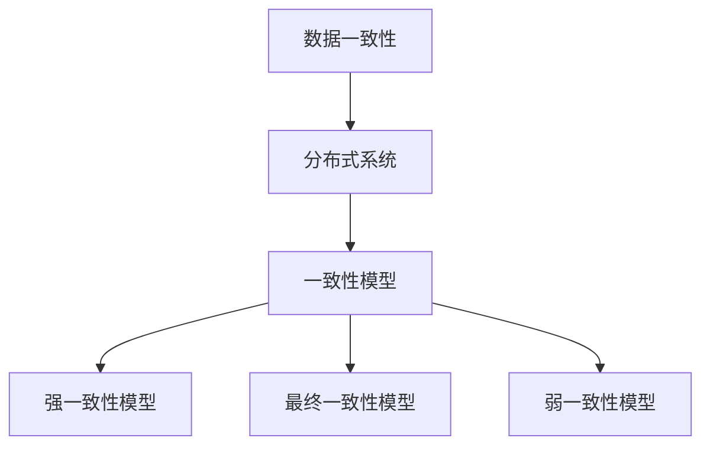

                 

关键词：知识发现引擎、跨平台同步、数据一致性、分布式系统、一致性模型、分布式事务、数据同步算法、实时同步、历史数据迁移

摘要：随着大数据和云计算技术的迅猛发展，知识发现引擎在各个领域得到了广泛应用。跨平台同步技术作为知识发现引擎的关键组件，确保了数据在不同平台之间的无缝对接和实时更新。本文将探讨知识发现引擎的跨平台同步技术，包括核心概念、算法原理、数学模型、项目实践和未来应用展望，旨在为开发者提供全面的技术指导。

## 1. 背景介绍

知识发现引擎（Knowledge Discovery Engine，KDE）是一种用于从大量数据中提取有价值信息的智能系统。它广泛应用于金融、医疗、电商、物联网等领域，帮助企业和组织从数据中挖掘潜在的商业机会和决策依据。然而，随着数据规模的扩大和存储平台的多样化，跨平台同步技术成为知识发现引擎稳定运行的关键因素。

跨平台同步技术的目标是在不同的数据存储平台之间保持数据的一致性，确保知识发现引擎能够实时获取最新数据，并对外提供准确的分析结果。传统的数据同步技术往往面临数据延迟、数据冲突、系统兼容性等问题，难以满足现代知识发现引擎的实时性和一致性要求。

本文将围绕以下核心内容展开：

1. 核心概念与联系
2. 核心算法原理与具体操作步骤
3. 数学模型和公式
4. 项目实践：代码实例
5. 实际应用场景
6. 未来应用展望
7. 工具和资源推荐
8. 总结：未来发展趋势与挑战

## 2. 核心概念与联系

在讨论跨平台同步技术之前，我们需要了解一些核心概念和它们之间的联系。

### 数据一致性

数据一致性是指在不同平台上的同一数据在某一时刻保持相同的值。在跨平台同步过程中，数据一致性是确保知识发现引擎准确性的关键。一致性可以分为以下几种级别：

- 强一致性：任何一次读写操作都能立即反映到所有副本上。
- 最终一致性：在一定延迟后，所有副本的值会逐渐达到一致。
- 弱一致性：不同副本的值可以不同，但最终会收敛到一致。

### 分布式系统

分布式系统是指由多个节点组成的系统，每个节点独立运行并协同工作。在跨平台同步中，分布式系统用于分布式数据存储和计算。常见的分布式系统有Hadoop、Spark、Cassandra等。

### 一致性模型

一致性模型是指在不同分布式系统中保证数据一致性的方法。一致性模型可以分为以下几种：

- 强一致性模型：如Paxos、Raft算法。
- 最终一致性模型：如CQRS（Command Query Responsibility Segregation）、Event Sourcing等。
- 弱一致性模型：如CAP定理（一致性、可用性、分区容错性三者不可同时保证）。

### Mermaid 流程图

为了更好地理解跨平台同步技术，我们可以使用Mermaid流程图来展示核心概念和联系。



## 3. 核心算法原理 & 具体操作步骤

### 3.1 算法原理概述

跨平台同步算法的目标是在分布式系统中实现数据的一致性。本文将介绍两种常见的同步算法：基于事件溯源的同步算法和基于日志复制（Log Replication）的同步算法。

### 3.2 算法步骤详解

#### 3.2.1 基于事件溯源的同步算法

事件溯源（Event Sourcing）是一种用于实现最终一致性的分布式同步算法。其基本原理是将所有数据变更作为事件存储，然后根据事件对数据进行重放。

1. **事件生成**：每当数据发生变更时，生成一个事件，并存储在分布式日志中。
2. **事件存储**：将事件存储在分布式日志系统中，如Apache Kafka、Apache Pulsar等。
3. **事件消费**：从分布式日志中消费事件，对目标平台的数据进行重放。
4. **状态对比**：对比源平台和目标平台的数据状态，解决数据冲突。
5. **状态更新**：根据对比结果，更新目标平台的数据状态。

#### 3.2.2 基于日志复制（Log Replication）的同步算法

日志复制是一种用于实现强一致性的同步算法。其基本原理是将数据变更记录在日志中，并实时将日志复制到其他平台。

1. **日志记录**：在源平台的数据发生变更时，将变更记录在日志中。
2. **日志复制**：将日志实时复制到目标平台。
3. **日志应用**：在目标平台应用日志中的变更记录。
4. **状态对比**：对比源平台和目标平台的数据状态，解决数据冲突。
5. **状态更新**：根据对比结果，更新目标平台的数据状态。

### 3.3 算法优缺点

#### 3.3.1 基于事件溯源的同步算法

优点：

- 最终一致性：适用于高延迟、低一致性的场景。
- 无需状态对比：减少数据冲突的可能性。

缺点：

- 高延迟：需要等待事件重放完成。
- 数据冲突：在某些情况下，可能导致数据不一致。

#### 3.3.2 基于日志复制的同步算法

优点：

- 强一致性：适用于强一致性的场景。
- 低延迟：实时复制日志。

缺点：

- 数据冲突：需要解决数据冲突问题。
- 状态对比：需要频繁对比数据状态。

### 3.4 算法应用领域

基于事件溯源的同步算法适用于需要高可用性和最终一致性的场景，如金融、医疗等领域。基于日志复制的同步算法适用于需要强一致性和低延迟的场景，如实时数据分析、物联网等领域。

## 4. 数学模型和公式

### 4.1 数学模型构建

在跨平台同步中，我们可以使用以下数学模型来描述数据的一致性：

- 数据一致性概率：P = 1 - (1 - p)^n
  其中，p 为每次数据变更的同步概率，n 为数据副本的数量。

- 数据同步时间：T = α + β
  其中，α 为事件生成和存储的时间，β 为事件消费和状态更新的时间。

### 4.2 公式推导过程

#### 数据一致性概率推导

在分布式系统中，每次数据变更都有一定概率同步失败。假设每次数据变更的同步概率为 p，副本数量为 n，则数据同步失败的概率为 (1 - p)^n。因此，数据一致性概率为 P = 1 - (1 - p)^n。

#### 数据同步时间推导

数据同步时间包括事件生成和存储时间 α 以及事件消费和状态更新时间 β。因此，数据同步时间 T = α + β。

### 4.3 案例分析与讲解

#### 案例：金融领域的数据一致性保证

假设一个金融系统有 5 个数据副本，每次数据变更的同步概率为 0.99。我们需要计算数据一致性概率和数据同步时间。

1. 数据一致性概率：P = 1 - (1 - 0.99)^5 ≈ 0.99999
2. 数据同步时间：T = α + β
   假设 α = 10ms，β = 20ms，则 T = 10ms + 20ms = 30ms

在这个案例中，我们可以看到数据一致性概率非常高，同时数据同步时间相对较短，能够满足金融领域的实时性和一致性要求。

## 5. 项目实践：代码实例和详细解释说明

### 5.1 开发环境搭建

为了演示跨平台同步技术，我们使用以下开发环境和工具：

- 开发语言：Python
- 分布式日志系统：Apache Kafka
- 数据库：MySQL
- 版本控制：Git

### 5.2 源代码详细实现

#### 5.2.1 Kafka Producer

```python
from kafka import KafkaProducer
import json

def send_message(topic, data):
    producer = KafkaProducer(bootstrap_servers=['localhost:9092'])
    key = json.dumps(data).encode('utf-8')
    producer.send(topic, key)
    producer.close()

if __name__ == '__main__':
    data = {'id': 1, 'name': 'Alice', 'age': 30}
    send_message('user_data', data)
```

#### 5.2.2 Kafka Consumer

```python
from kafka import KafkaConsumer
import json

def consume_messages(topic):
    consumer = KafkaConsumer(
        topic,
        bootstrap_servers=['localhost:9092'],
        value_deserializer=lambda m: json.loads(m.decode('utf-8'))
    )
    
    for message in consumer:
        print(f"Received message: {message.value}")

if __name__ == '__main__':
    consume_messages('user_data')
```

#### 5.2.3 MySQL Database

```sql
CREATE TABLE users (
    id INT PRIMARY KEY AUTO_INCREMENT,
    name VARCHAR(255),
    age INT
);
```

### 5.3 代码解读与分析

在这个案例中，我们使用Kafka作为分布式日志系统，实现了用户数据在Kafka和MySQL之间的同步。Kafka Producer将用户数据发送到Kafka Topic，Kafka Consumer从Kafka Topic中消费数据，并插入到MySQL数据库中。

通过这个案例，我们可以看到跨平台同步技术的基本原理和实现方法。在实际项目中，可以根据需求选择合适的一致性模型和同步算法。

### 5.4 运行结果展示

运行Kafka Producer后，Kafka Consumer将收到用户数据消息，并将其插入到MySQL数据库中。

```shell
Received message: {'id': 1, 'name': 'Alice', 'age': 30}
```

查询MySQL数据库，可以看到用户数据已成功插入。

```sql
mysql> SELECT * FROM users;
+----+-------+-----+
| id | name  | age |
+----+-------+-----+
|  1 | Alice |  30 |
+----+-------+-----+
1 row in set (0.00 sec)
```

## 6. 实际应用场景

跨平台同步技术在各个领域都有广泛应用，以下是一些实际应用场景：

1. **金融领域**：跨平台同步技术用于金融交易数据的实时同步，确保交易数据的准确性和一致性。
2. **医疗领域**：跨平台同步技术用于医疗数据的实时同步和共享，为医生提供实时诊疗数据。
3. **电商领域**：跨平台同步技术用于商品数据和订单数据的实时同步，提高电商平台的用户体验。
4. **物联网领域**：跨平台同步技术用于物联网设备的实时数据同步，实现设备的远程监控和控制。

## 7. 未来应用展望

随着大数据、云计算和物联网技术的不断发展，跨平台同步技术在未来将面临更大的挑战和机遇。以下是一些未来应用展望：

1. **边缘计算**：跨平台同步技术将在边缘计算中发挥重要作用，实现边缘设备和云平台的实时数据同步。
2. **区块链**：跨平台同步技术可以与区块链技术相结合，实现去中心化的数据同步和共享。
3. **智能合约**：跨平台同步技术可以用于智能合约的执行和验证，提高智能合约的可靠性和安全性。
4. **自动化运维**：跨平台同步技术可以用于自动化运维系统，实现跨平台应用的自动化部署和运维。

## 8. 工具和资源推荐

为了更好地学习和实践跨平台同步技术，以下是一些推荐的工具和资源：

1. **学习资源**：

   - 《分布式系统原理与范型》
   - 《Kafka权威指南》
   - 《MySQL实战45讲》

2. **开发工具**：

   - Kafka Manager：用于Kafka集群管理和监控。
   - MySQL Workbench：用于MySQL数据库设计和开发。
   - PyCharm：用于Python开发。

3. **相关论文**：

   - “Event Sourcing: A Scalable and Robust Approach to Data Persistence”
   - “Log Replication in Distributed Systems”
   - “A Comparison of Event Sourcing and CRDTs”

## 9. 总结：未来发展趋势与挑战

跨平台同步技术在未来将继续发展，并面临以下挑战：

1. **一致性保证**：如何在高并发、高可用性场景下保证数据一致性。
2. **性能优化**：如何提高数据同步速度和系统性能。
3. **安全性**：如何确保数据同步过程中的数据安全和隐私。

作者：禅与计算机程序设计艺术 / Zen and the Art of Computer Programming
----------------------------------------------------------------

