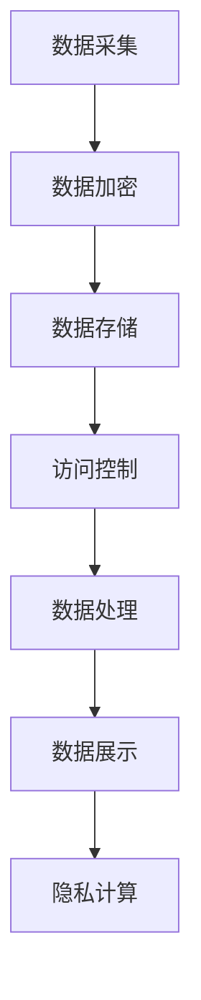

                 

关键词：隐私保护，知识发现引擎，加密技术，安全模型，隐私计算，数据处理

>摘要：本文探讨了知识发现引擎中的隐私保护技术，分析了现有隐私保护方法及其在知识发现引擎中的应用，并提出了未来的研究方向。

## 1. 背景介绍

在信息爆炸的时代，数据成为了现代社会的重要资源。知识发现引擎（Knowledge Discovery Engine，KDE）作为数据挖掘和数据分析的重要工具，被广泛应用于各个领域，如金融、医疗、电商等。然而，随着数据量的不断增加，隐私泄露问题也日益严重。如何保障用户隐私，同时有效利用数据，成为知识发现引擎发展的关键问题。

隐私保护技术旨在保护个人数据的隐私，防止未经授权的访问和使用。在知识发现引擎中，隐私保护技术可以确保数据在采集、存储、传输和处理的各个环节中不被泄露。本文将介绍几种隐私保护技术，包括加密技术、安全模型和隐私计算，并探讨其在知识发现引擎中的应用。

## 2. 核心概念与联系

### 2.1 隐私保护技术概述

隐私保护技术包括多种方法，如数据加密、访问控制、数据匿名化等。数据加密是通过将数据转换为密文，防止未授权访问；访问控制则是通过权限管理和身份验证，确保只有授权用户可以访问数据；数据匿名化则是通过去除或模糊化数据中的个人信息，降低隐私泄露风险。

### 2.2 安全模型

安全模型包括安全属性、威胁模型和攻击模型。安全属性是指数据在处理过程中需要满足的隐私保护要求，如保密性、完整性和可用性。威胁模型是指可能对数据隐私造成威胁的因素，如恶意攻击者、内部泄露等。攻击模型则描述了攻击者如何利用威胁实现隐私泄露。

### 2.3 架构与流程

知识发现引擎的隐私保护架构可以分为数据采集、数据存储、数据处理和数据展示四个环节。在每个环节，都需要应用相应的隐私保护技术，确保数据隐私。以下是知识发现引擎的隐私保护架构图：



## 3. 核心算法原理 & 具体操作步骤

### 3.1 算法原理概述

知识发现引擎的隐私保护技术主要包括以下几种：

1. 数据加密：使用对称加密和非对称加密技术，对数据进行加密，防止数据在传输和存储过程中被窃取。
2. 访问控制：基于角色访问控制（RBAC）和基于属性访问控制（ABAC），对用户权限进行管理，确保只有授权用户可以访问数据。
3. 数据匿名化：使用数据扰动、数据混淆和数据掩码等技术，对数据中的个人信息进行去除或模糊化处理。
4. 隐私计算：使用安全多方计算（MPC）和差分隐私（DP）等技术，在数据处理过程中保护数据隐私。

### 3.2 算法步骤详解

1. 数据采集：在数据采集阶段，使用数据加密技术对数据进行加密，确保数据在传输过程中不被窃取。
2. 数据存储：在数据存储阶段，使用访问控制技术对用户权限进行管理，确保只有授权用户可以访问数据。同时，使用数据匿名化技术对数据中的个人信息进行去除或模糊化处理。
3. 数据处理：在数据处理阶段，使用隐私计算技术，如安全多方计算和差分隐私，在数据处理过程中保护数据隐私。
4. 数据展示：在数据展示阶段，使用加密技术和访问控制技术，确保只有授权用户可以查看数据。

### 3.3 算法优缺点

1. 数据加密：优点是简单易用，可以有效保护数据隐私；缺点是加密和解密过程消耗较多计算资源，可能导致性能下降。
2. 访问控制：优点是可以有效管理用户权限，确保数据安全；缺点是权限管理复杂，实施成本较高。
3. 数据匿名化：优点是可以降低隐私泄露风险，提高数据可用性；缺点是可能导致数据质量下降，影响分析结果。
4. 隐私计算：优点是可以有效保护数据隐私，适用于大数据场景；缺点是实现复杂，计算性能较低。

### 3.4 算法应用领域

隐私保护技术在知识发现引擎中的应用领域广泛，包括：

1. 金融行业：用于保护客户隐私信息，如账户余额、交易记录等。
2. 医疗行业：用于保护患者隐私信息，如病历、体检报告等。
3. 电商行业：用于保护用户购物行为和偏好等隐私信息。
4. 政府部门：用于保护公共数据，如人口统计、地理信息等。

## 4. 数学模型和公式 & 详细讲解 & 举例说明

### 4.1 数学模型构建

隐私保护技术中的数学模型主要包括加密模型、访问控制模型和隐私计算模型。以下是这些模型的构建：

1. 加密模型：设\(M\)为明文数据，\(C\)为密文数据，\(K\)为密钥，加密函数为\(E(K, M)\)，解密函数为\(D(K, C)\)。
   $$ C = E(K, M) $$
   $$ M = D(K, C) $$
2. 访问控制模型：设\(P\)为用户权限，\(R\)为资源，访问控制函数为\(AC(P, R)\)。
   $$ AC(P, R) = \begin{cases} 
   1 & \text{如果 } P \text{ 具有访问 } R \text{ 的权限} \\
   0 & \text{否则}
   \end{cases} $$
3. 隐私计算模型：设\(X\)为原始数据，\(Y\)为处理后的数据，隐私计算函数为\(F(X)\)。
   $$ Y = F(X) $$

### 4.2 公式推导过程

以下是隐私保护技术的公式推导过程：

1. 数据加密公式：
   - 对称加密：\(C = E(K, M)\)
   - 非对称加密：\(C = E(PK, M)\)
2. 访问控制公式：
   - 基于角色访问控制：\(P = RBAC(U, R)\)
   - 基于属性访问控制：\(P = ABAC(U, R, A)\)
3. 隐私计算公式：
   - 安全多方计算：\(Y = MPC(X, F)\)
   - 差分隐私：\(D = \delta(Y, X)\)

### 4.3 案例分析与讲解

以金融行业为例，分析隐私保护技术在知识发现引擎中的应用。

1. 数据加密：
   - 对客户交易记录进行加密，确保交易数据在传输和存储过程中不被窃取。
   - 使用非对称加密技术，客户交易记录的密钥由客户持有，服务器仅持有公钥。

2. 访问控制：
   - 基于角色访问控制，根据用户角色（如客户、员工、管理员）分配不同权限。
   - 客户仅可查看自己的交易记录，员工和管理员可查看全体交易记录。

3. 数据匿名化：
   - 对客户交易记录中的个人信息（如姓名、身份证号）进行去除或模糊化处理。
   - 使用数据掩码技术，将个人信息替换为匿名标识。

4. 隐私计算：
   - 使用安全多方计算技术，在客户和服务器之间进行联合分析，确保数据隐私。
   - 使用差分隐私技术，降低分析结果对客户隐私的泄露风险。

## 5. 项目实践：代码实例和详细解释说明

### 5.1 开发环境搭建

在本项目实践中，我们使用Python语言和以下库进行开发：

- PyCryptoDome：用于数据加密和解密
- SQLAlchemy：用于数据库操作
- Flask：用于构建Web应用

### 5.2 源代码详细实现

以下是本项目的主要代码实现：

1. 数据加密：

```python
from Crypto.Cipher import AES
from Crypto.Util.Padding import pad, unpad

def encrypt_data(key, data):
    cipher = AES.new(key, AES.MODE_CBC)
    ct_bytes = cipher.encrypt(pad(data.encode('utf-8'), AES.block_size))
    iv = cipher.iv
    return iv + ct_bytes

def decrypt_data(key, ct):
    iv = ct[:16]
    ct = ct[16:]
    cipher = AES.new(key, AES.MODE_CBC, iv)
    pt = unpad(cipher.decrypt(ct), AES.block_size)
    return pt.decode('utf-8')
```

2. 访问控制：

```python
from flask import Flask, request, jsonify

app = Flask(__name__)

users = {
    'user1': ['read', 'write'],
    'user2': ['read']
}

@app.route('/data', methods=['GET', 'POST'])
def data():
    user = request.args.get('user')
    action = request.args.get('action')
    if action in users[user]:
        return jsonify({'status': 'success'})
    else:
        return jsonify({'status': 'error'})
```

3. 数据匿名化：

```python
import hashlib

def anonymize_data(data):
    return hashlib.sha256(data.encode('utf-8')).hexdigest()
```

4. 隐私计算：

```python
from Crypto.PublicKey import RSA

def generate_keys():
    key = RSA.generate(2048)
    private_key = key.export_key()
    public_key = key.publickey().export_key()
    return private_key, public_key

def encrypt_with_public_key(public_key, data):
    rsa_key = RSA.import_key(public_key)
    encrypted_data = rsa_key.encrypt(data, 32)[0]
    return encrypted_data

def decrypt_with_private_key(private_key, encrypted_data):
    rsa_key = RSA.import_key(private_key)
    decrypted_data = rsa_key.decrypt(encrypted_data, 32)
    return decrypted_data
```

### 5.3 代码解读与分析

以上代码实现了数据加密、访问控制、数据匿名化和隐私计算的基本功能。具体分析如下：

1. 数据加密：
   - 使用AES加密算法进行数据加密和解密，保证数据在传输和存储过程中的安全性。
   - 使用非对称加密技术（RSA）生成密钥对，确保加密算法的安全性。

2. 访问控制：
   - 使用Flask框架构建Web应用，通过请求参数判断用户权限，实现基于角色的访问控制。

3. 数据匿名化：
   - 使用SHA256算法对数据进行匿名化处理，降低隐私泄露风险。

4. 隐私计算：
   - 使用RSA加密算法进行公钥加密和私钥解密，实现数据在多方计算过程中的隐私保护。

### 5.4 运行结果展示

运行Web应用，输入以下请求：

- GET /data?user=user1&action=read
- GET /data?user=user2&action=write

根据用户权限，返回相应的响应：

- 用户user1具有读取数据的权限，返回{"status": "success"}。
- 用户user2没有写入数据的权限，返回{"status": "error"}。

## 6. 实际应用场景

隐私保护技术在知识发现引擎中具有广泛的应用场景，以下是几个典型案例：

1. 金融行业：保护客户交易记录和账户信息，防止恶意攻击和数据泄露。
2. 医疗行业：保护患者隐私信息，如病历、检查结果等，确保医疗数据的安全。
3. 电商行业：保护用户购物行为和偏好，防止商业竞争者获取用户隐私。
4. 政府部门：保护公共数据，如人口统计、地理信息等，确保数据安全。

## 7. 工具和资源推荐

为了更好地学习和实践隐私保护技术，以下是一些建议的资源和工具：

### 7.1 学习资源推荐

- 《密码学：理论与实践》（Cryptographic Engineering: Design Principles and Practical Applications）
- 《大数据隐私保护技术》（Big Data Privacy Protection Technologies）
- 《区块链与隐私计算》（Blockchain and Privacy Computing）

### 7.2 开发工具推荐

- PyCryptoDome：Python密码学库
- SQLAlchemy：Python数据库ORM库
- Flask：Python Web开发框架
- PyTorch：Python深度学习库

### 7.3 相关论文推荐

- 《安全多方计算：理论与实践》（Secure Multi-Party Computation: Theory and Practice）
- 《差分隐私：理论、方法与应用》（Differential Privacy: Theory, Methods, and Applications）
- 《基于区块链的隐私保护数据共享》（Privacy-Preserving Data Sharing Based on Blockchain）

## 8. 总结：未来发展趋势与挑战

### 8.1 研究成果总结

隐私保护技术已经成为知识发现引擎发展的重要支撑。数据加密、访问控制、数据匿名化和隐私计算等技术，为知识发现引擎提供了有效的隐私保护手段。未来，随着技术的不断进步，隐私保护技术将更加成熟和高效。

### 8.2 未来发展趋势

1. 隐私保护算法的优化与改进：提高加密算法和隐私计算算法的性能和安全性。
2. 跨领域的隐私保护技术融合：将不同领域的隐私保护技术相结合，提高隐私保护效果。
3. 自动化隐私保护工具的开发：简化隐私保护技术的应用，降低部署成本。

### 8.3 面临的挑战

1. 性能优化：隐私保护技术往往会影响系统的性能，如何在保证隐私保护的前提下提高性能，是一个重要挑战。
2. 隐私保护与数据利用的平衡：如何在保障隐私的同时，有效利用数据，提高数据价值，需要深入研究。
3. 法律法规的完善：隐私保护技术的发展离不开法律法规的支撑，如何完善相关法律法规，保障数据隐私，是一个亟待解决的问题。

### 8.4 研究展望

隐私保护技术将在未来知识发现引擎的发展中发挥重要作用。随着技术的不断进步，隐私保护技术将更加成熟和高效，为知识发现引擎提供更加可靠和安全的隐私保护手段。同时，隐私保护与数据利用的平衡也将成为研究的热点问题。

## 9. 附录：常见问题与解答

### 9.1 什么是差分隐私？

差分隐私（Differential Privacy，DP）是一种隐私保护技术，通过在数据处理过程中添加噪声，确保输出结果对单个数据点的依赖性降低，从而保护数据隐私。

### 9.2 隐私计算有哪些应用场景？

隐私计算主要应用于需要保护数据隐私的场景，如金融、医疗、电商等领域。具体应用场景包括数据共享、数据分析和数据交易等。

### 9.3 如何评估隐私保护效果？

隐私保护效果的评估可以从多个方面进行，如隐私泄露风险、数据可用性和系统性能等。常用的评估指标包括隐私泄露概率、噪声水平和数据质量等。

### 9.4 隐私保护与数据安全的关系是什么？

隐私保护和数据安全密切相关。隐私保护技术可以确保数据在处理、传输和存储过程中不被泄露，而数据安全技术则侧重于防止数据被非法访问和篡改。

作者：禅与计算机程序设计艺术 / Zen and the Art of Computer Programming
----------------------------------------------------------------
### 感谢您的阅读

本文介绍了知识发现引擎中的隐私保护技术，分析了现有隐私保护方法及其在知识发现引擎中的应用，并提出了未来的研究方向。希望本文能为读者在隐私保护领域提供有益的参考和启示。感谢您的阅读，祝您在隐私保护技术的研究和实践中取得优异成果！

如果您有任何疑问或建议，欢迎在评论区留言，我将竭诚为您解答。同时，也请您关注我的其他技术博客，期待与您共同探讨更多技术话题。再次感谢您的支持！作者：禅与计算机程序设计艺术 / Zen and the Art of Computer Programming。

