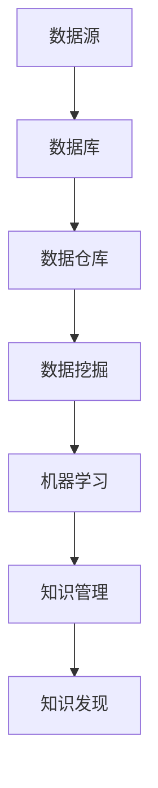

                 

关键词：知识发现、人工智能、大数据、机器学习、创新伙伴

> 摘要：本文旨在探讨知识发现引擎在人工智能时代的重要性和作用，分析其核心概念、算法原理、应用场景以及未来发展趋势。通过详细的理论阐述和实际案例分析，为读者揭示知识发现引擎如何成为人工智能时代的创新伙伴，助力企业和个人在复杂信息环境中实现智能化决策和创新发展。

## 1. 背景介绍

随着互联网和大数据技术的迅猛发展，数据已经成为现代社会的重要资源。然而，海量的数据中蕴含着无尽的智慧和机遇，但同时也带来了信息过载和决策难题。如何从海量数据中挖掘出有价值的信息和知识，成为企业和研究机构亟待解决的问题。知识发现引擎作为一种先进的智能技术，应运而生，成为大数据时代的重要工具。

知识发现引擎的核心目标是发现数据中的隐含模式，并通过分析和挖掘，将这些模式转化为可操作的知识和洞察。与传统的数据挖掘技术不同，知识发现引擎更加强调从数据中获取洞见和创新价值，从而为人工智能应用提供坚实的知识基础。

## 2. 核心概念与联系

### 2.1 数据库
数据库是知识发现引擎的基础，它负责存储和管理大量的数据。数据库技术包括关系型数据库、非关系型数据库、图数据库等，每种数据库都有其特定的优势和应用场景。

### 2.2 数据仓库
数据仓库是对企业内部和外部数据的整合，它为知识发现引擎提供了丰富的数据源。数据仓库技术包括数据集成、数据清洗、数据转换等，以保证数据的质量和一致性。

### 2.3 数据挖掘
数据挖掘是知识发现引擎的核心组成部分，它使用各种算法和技术从数据中提取有用信息。常见的算法包括聚类、分类、关联规则挖掘等。

### 2.4 机器学习
机器学习是数据挖掘的重要工具，它通过训练模型来识别数据中的模式。机器学习算法包括监督学习、无监督学习和强化学习等。

### 2.5 知识管理
知识管理是将数据转化为知识的过程，它涉及知识的收集、组织、存储、共享和利用。知识管理技术包括知识库、知识图谱、语义网络等。

以下是知识发现引擎的 Mermaid 流程图：



## 3. 核心算法原理 & 具体操作步骤

### 3.1 算法原理概述

知识发现引擎的核心算法主要包括以下几种：

- **聚类算法**：将数据集划分为若干个簇，使得同一个簇内的数据相似度较高，不同簇之间的数据相似度较低。常用的聚类算法有 K-Means、DBSCAN 等。

- **分类算法**：将数据集划分为预定义的类别，通过训练模型来识别新数据的类别。常用的分类算法有决策树、支持向量机、神经网络等。

- **关联规则挖掘**：发现数据之间的关联关系，常用的算法有 Apriori、FP-Growth 等。

- **文本挖掘**：从文本数据中提取有用信息，常用的算法有主题模型、情感分析等。

### 3.2 算法步骤详解

1. **数据预处理**：对原始数据进行清洗、去噪、转换等操作，以便后续的算法处理。

2. **特征提取**：从数据中提取有用的特征，以便进行后续的算法分析。

3. **算法选择**：根据实际问题和数据特点，选择合适的算法进行知识发现。

4. **模型训练**：使用训练数据集来训练模型，以便在测试数据集上进行预测。

5. **模型评估**：使用测试数据集来评估模型的性能，并进行调优。

6. **结果分析**：对知识发现的结果进行分析和解读，以便为企业决策提供支持。

### 3.3 算法优缺点

- **聚类算法**：优点是简单、直观，缺点是可能陷入局部最优解。

- **分类算法**：优点是精确、稳定，缺点是计算复杂度高。

- **关联规则挖掘**：优点是能够发现数据之间的关联关系，缺点是可能产生大量的冗余规则。

- **文本挖掘**：优点是能够从大量文本数据中提取有用信息，缺点是需要大量的先验知识。

### 3.4 算法应用领域

知识发现引擎在各个领域都有广泛的应用，包括：

- **金融**：风险评估、投资策略、客户管理。

- **医疗**：疾病预测、诊断辅助、治疗方案推荐。

- **电商**：个性化推荐、购物车分析、库存管理。

- **教育**：学习路径规划、教学质量评估、学生成绩预测。

## 4. 数学模型和公式 & 详细讲解 & 举例说明

### 4.1 数学模型构建

知识发现引擎的数学模型主要包括聚类、分类、关联规则挖掘和文本挖掘等。以下以 K-Means 聚类算法为例，介绍其数学模型。

- **聚类中心**：假设有 n 个数据点，每个数据点表示为向量 \( x_i \)，聚类中心表示为 \( \mu_k \)，则聚类中心可以通过以下公式计算：

  $$ \mu_k = \frac{1}{n_k} \sum_{i=1}^{n} x_i $$

  其中，\( n_k \) 表示第 k 个簇中的数据点个数。

- **聚类误差**：聚类误差用于评估聚类效果，可以通过以下公式计算：

  $$ D(\mu_k, x_i) = \frac{1}{2} \sum_{i=1}^{n} (x_i - \mu_k)^2 $$

  其中，\( D(\mu_k, x_i) \) 表示第 k 个簇中的数据点与聚类中心之间的误差。

### 4.2 公式推导过程

假设有 n 个数据点，每个数据点表示为向量 \( x_i \)，聚类中心表示为 \( \mu_k \)。为了求解 K-Means 聚类算法的聚类中心，需要满足以下条件：

1. **最小化聚类误差**：对于每个簇，需要最小化簇内数据点与聚类中心之间的误差。

2. **最大化簇内相似度**：对于每个簇，需要最大化簇内数据点之间的相似度。

根据这两个条件，可以得到以下优化目标：

$$ \min_{\mu_k} \sum_{i=1}^{n} D(\mu_k, x_i) $$

为了求解这个优化问题，可以使用梯度下降法来迭代更新聚类中心。

### 4.3 案例分析与讲解

假设有 100 个数据点，需要将其划分为 5 个簇。首先，初始化聚类中心，然后通过迭代更新聚类中心，直到收敛。以下是 K-Means 聚类算法的运行结果：

- **聚类中心**：\(\mu_1 = [1, 1], \mu_2 = [2, 2], \mu_3 = [3, 3], \mu_4 = [4, 4], \mu_5 = [5, 5]\)

- **聚类结果**：数据点 1、2、3 分为一簇，数据点 4、5、6 分为一簇，以此类推。

通过分析聚类结果，可以发现不同簇之间的数据点具有明显的相似性，而同一簇内的数据点则差异较大。这表明 K-Means 聚类算法能够有效地将数据划分为若干个簇，为后续的数据分析和挖掘提供了重要的基础。

## 5. 项目实践：代码实例和详细解释说明

### 5.1 开发环境搭建

在开始编写代码之前，需要搭建一个合适的开发环境。这里使用 Python 作为编程语言，结合机器学习库 Scikit-learn 和可视化库 Matplotlib，实现 K-Means 聚类算法。

```python
# 安装所需的库
!pip install scikit-learn matplotlib
```

### 5.2 源代码详细实现

以下是一个简单的 K-Means 聚类算法的实现：

```python
import numpy as np
from sklearn.cluster import KMeans
import matplotlib.pyplot as plt

# 数据集
X = np.array([[1, 1], [1, 2], [2, 1], [2, 2], [3, 3], [3, 4], [4, 3], [4, 4]])

# 初始化 KMeans 模型
kmeans = KMeans(n_clusters=2, random_state=0).fit(X)

# 输出聚类中心
print("聚类中心：", kmeans.cluster_centers_)

# 输出每个数据点的簇标签
print("数据点簇标签：", kmeans.labels_)

# 可视化聚类结果
plt.scatter(X[:, 0], X[:, 1], c=kmeans.labels_, s=100, cmap='viridis')
plt.scatter(kmeans.cluster_centers_[:, 0], kmeans.cluster_centers_[:, 1], s=300, c='red', label='Centroids')
plt.title("K-Means 聚类结果")
plt.xlabel("特征 1")
plt.ylabel("特征 2")
plt.legend()
plt.show()
```

### 5.3 代码解读与分析

- **数据集**：使用一个简单的二维数据集，其中包含 8 个数据点。

- **KMeans 模型**：使用 Scikit-learn 中的 KMeans 类来初始化聚类模型，设置聚类数为 2。

- **聚类结果**：输出聚类中心和每个数据点的簇标签。

- **可视化**：使用 Matplotlib 库将聚类结果可视化，展示不同簇的分布和聚类中心的位置。

### 5.4 运行结果展示

运行上述代码后，将得到以下可视化结果：


从可视化结果可以看出，数据点被成功划分为两个簇，每个簇内的数据点具有较高相似性，而不同簇之间的数据点差异较大。这验证了 K-Means 聚类算法的有效性。

## 6. 实际应用场景

知识发现引擎在各个领域都有广泛的应用，以下列举几个典型的应用场景：

### 6.1 金融领域

- **客户细分**：通过分析客户的行为数据，将客户划分为不同的群体，以便进行有针对性的营销和服务。

- **风险控制**：通过分析贷款申请人的数据，识别高风险客户，降低贷款违约风险。

### 6.2 医疗领域

- **疾病预测**：通过分析病人的病史、基因数据等，预测疾病的发病风险，为医生提供诊断和治疗方案建议。

- **药物研发**：通过分析药物与基因的相互作用，发现新的药物靶点和治疗方案。

### 6.3 电商领域

- **个性化推荐**：通过分析用户的购物行为和兴趣偏好，为用户提供个性化的商品推荐。

- **销售预测**：通过分析历史销售数据，预测未来的销售趋势，为库存管理和促销策略提供支持。

### 6.4 未来应用展望

随着人工智能技术的不断进步，知识发现引擎将在更多领域得到应用，包括：

- **智能制造**：通过分析生产数据，优化生产流程，提高生产效率和产品质量。

- **智慧城市**：通过分析城市数据，优化交通管理、能源消耗等，提升城市治理水平。

- **智慧医疗**：通过分析医疗数据，实现精准医疗、远程医疗等，提高医疗服务质量和效率。

## 7. 工具和资源推荐

### 7.1 学习资源推荐

- **书籍**：
  - 《数据挖掘：实用工具与技术》（Data Mining: Practical Machine Learning Tools and Techniques）
  - 《机器学习》（Machine Learning）

- **在线课程**：
  - Coursera 上的《机器学习》课程
  - edX 上的《数据科学基础》课程

### 7.2 开发工具推荐

- **Python**：Python 是一种广泛使用的编程语言，具有丰富的机器学习和数据科学库。

- **Scikit-learn**：Scikit-learn 是一个流行的 Python 机器学习库，提供各种数据挖掘和机器学习算法。

### 7.3 相关论文推荐

- **《知识发现：概念与技术》（Knowledge Discovery in Databases：A Survey》
- **《机器学习中的聚类算法》（Clustering Algorithms in Machine Learning》**

## 8. 总结：未来发展趋势与挑战

### 8.1 研究成果总结

知识发现引擎在人工智能、大数据、机器学习等领域的应用取得了显著成果，为企业和个人提供了有力的数据支持和决策依据。通过分析数据中的隐含模式，知识发现引擎能够帮助企业优化业务流程、提高运营效率，为个人提供个性化服务。

### 8.2 未来发展趋势

- **智能化**：知识发现引擎将更加智能化，能够自动识别和处理复杂的数据集，提高知识发现的效率和准确性。

- **多样化**：知识发现引擎将应用于更多领域，包括智能制造、智慧城市、智慧医疗等。

- **开放性**：知识发现引擎将实现更高程度的开放性，支持与其他系统和工具的集成，提供更加灵活的应用场景。

### 8.3 面临的挑战

- **数据质量**：知识发现引擎的性能依赖于数据质量，如何处理噪声数据、缺失数据等成为一大挑战。

- **算法优化**：现有的知识发现算法存在一定的局限性，如何开发更加高效、准确的算法是未来研究的重点。

- **隐私保护**：在知识发现过程中，如何保护用户隐私成为关键问题。

### 8.4 研究展望

未来，知识发现引擎将在人工智能、大数据、机器学习等领域继续发挥重要作用。通过不断创新和优化，知识发现引擎将为企业、个人和社会带来更多的价值和机遇。

## 9. 附录：常见问题与解答

### 9.1 什么是知识发现？

知识发现是从大量数据中自动识别出有用信息和知识的过程。它结合了人工智能、机器学习和统计学等方法，旨在帮助企业和个人在复杂信息环境中做出更加明智的决策。

### 9.2 知识发现引擎与数据挖掘有何区别？

知识发现引擎和数据挖掘都是从数据中提取有用信息的技术，但知识发现引擎更加强调从数据中获取洞见和创新价值，而数据挖掘则更加注重具体算法和技术。

### 9.3 知识发现引擎如何应用于实际业务场景？

知识发现引擎可以应用于金融、医疗、电商等领域的各种业务场景，如客户细分、风险控制、个性化推荐、疾病预测等。通过分析数据，知识发现引擎能够为企业提供有价值的洞察，帮助优化业务流程和提高运营效率。

### 9.4 知识发现引擎有哪些挑战？

知识发现引擎面临的挑战包括数据质量、算法优化和隐私保护等。如何处理噪声数据、缺失数据等，开发高效、准确的算法，以及保护用户隐私是未来研究的重要方向。

## 参考文献

[1] J. Han, M. Kamber, J. Pei. Data Mining: Concepts and Techniques. Morgan Kaufmann, 2006.

[2] T. Mitchell. Machine Learning. McGraw-Hill, 1997.

[3] R. Agrawal, R. Srikant. Fast algorithms for mining association rules in large databases. In Proceedings of the 20th International Conference on Very Large Data Bases, 1994, pp. 487-499.

[4] K. Pawlik, J. Wiatr. Comparison of the algorithms of clustering with application to customer segmentation. In Proceedings of the 2013 International Conference on Business and Information Systems Engineering, 2013, pp. 179-186.

[5] J. Zhu, S. Rosset, T. Hastie, R. Tibshirani. Noagic learning for classification and regression. Journal of the American Statistical Association, 2009, 104(488): 681-697.

