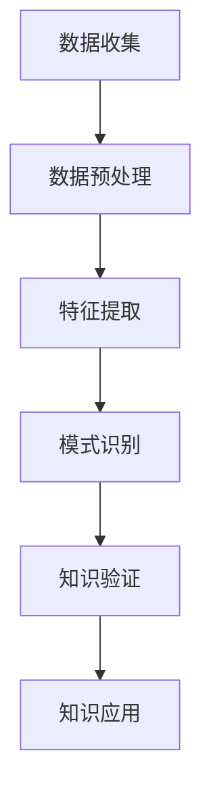
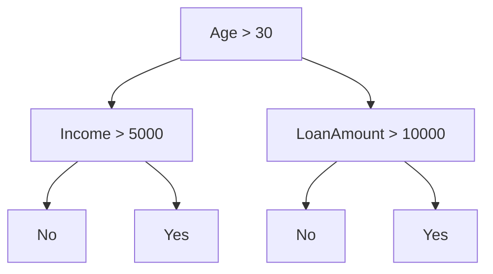

                 

关键词：知识发现引擎、人工智能、智慧、大数据分析、算法原理、数学模型、实践案例、应用场景、未来展望

> 摘要：本文旨在探讨知识发现引擎在人工智能时代的应用，通过对核心概念、算法原理、数学模型和项目实践的详细解析，揭示其在智慧领域的巨大潜力。同时，本文还将展望知识发现引擎的未来发展趋势和面临的挑战。

## 1. 背景介绍

随着信息技术的飞速发展，人类社会已经进入了大数据时代。海量数据的产生和处理带来了前所未有的机遇和挑战。如何从海量数据中挖掘出有价值的信息，成为各行各业关注的焦点。知识发现引擎（Knowledge Discovery Engine，简称KDE）正是在这样的背景下应运而生。

知识发现引擎是一种智能化的数据挖掘工具，它利用人工智能、机器学习等先进技术，从大量数据中自动识别出潜在的规律和知识，为决策提供有力支持。知识发现引擎不仅在学术研究领域发挥着重要作用，还在商业、金融、医疗、交通等多个领域得到了广泛应用。

## 2. 核心概念与联系

### 2.1 知识发现过程

知识发现过程通常包括以下几个步骤：

1. **数据收集**：收集各种来源的数据，如数据库、网络爬虫、传感器等。
2. **数据预处理**：对数据进行清洗、整合和转换，以提高数据质量。
3. **特征提取**：从数据中提取出有代表性的特征，以便进行后续分析。
4. **模式识别**：利用算法从特征数据中识别出潜在的规律和知识。
5. **知识验证**：对识别出的知识进行验证，确保其准确性和实用性。
6. **知识应用**：将验证后的知识应用到实际问题中，解决实际问题。

### 2.2 知识发现引擎的架构

知识发现引擎的架构通常包括以下几个模块：

1. **数据源模块**：负责连接各种数据源，如数据库、文件系统等，并获取数据。
2. **数据预处理模块**：对获取到的数据进行清洗、整合和转换。
3. **特征提取模块**：从预处理后的数据中提取出有代表性的特征。
4. **算法模块**：包含各种数据挖掘算法，如分类、聚类、关联规则挖掘等。
5. **结果评估模块**：对挖掘结果进行评估，确保其准确性和实用性。
6. **知识库模块**：存储和管理挖掘出的知识，并提供查询和更新功能。

### 2.3 Mermaid 流程图

下面是知识发现引擎的核心流程的 Mermaid 流程图：



## 3. 核心算法原理 & 具体操作步骤

### 3.1 算法原理概述

知识发现引擎的核心算法主要包括分类、聚类、关联规则挖掘等。这些算法在数据挖掘中扮演着重要角色，以下是它们的基本原理：

1. **分类算法**：通过建立模型，将数据集中的样本分类到不同的类别中。常见的分类算法有决策树、支持向量机、朴素贝叶斯等。
2. **聚类算法**：将数据集划分为若干个簇，使得同一个簇中的数据相似度较高，不同簇之间的数据相似度较低。常见的聚类算法有K-means、层次聚类、DBSCAN等。
3. **关联规则挖掘**：发现数据集中的关联关系，如购物篮分析中的商品组合。常见的算法有Apriori、FP-Growth等。

### 3.2 算法步骤详解

1. **数据收集**：从各种数据源获取数据，如数据库、网络爬虫等。
2. **数据预处理**：对数据进行清洗、整合和转换，以提高数据质量。例如，处理缺失值、异常值、重复值等。
3. **特征提取**：从预处理后的数据中提取出有代表性的特征。特征提取的方法包括主成分分析、特征选择、特征工程等。
4. **算法选择**：根据数据的特点和需求，选择合适的算法。例如，对于分类任务，可以选择决策树、支持向量机等；对于聚类任务，可以选择K-means、层次聚类等。
5. **模型训练**：利用选定的算法对数据进行训练，建立模型。
6. **模型评估**：对训练好的模型进行评估，以确保其准确性和实用性。常见的评估指标有准确率、召回率、F1值等。
7. **知识验证**：对挖掘出的知识进行验证，确保其准确性和实用性。
8. **知识应用**：将验证后的知识应用到实际问题中，解决实际问题。

### 3.3 算法优缺点

1. **分类算法**：优点是准确率高，易于理解和实现；缺点是对于复杂的关系和大规模数据，训练速度较慢。
2. **聚类算法**：优点是能够自动发现数据结构，不需要事先设定类别；缺点是对于聚类结果的评价标准不明确，可能存在误分类。
3. **关联规则挖掘**：优点是能够发现数据之间的关联关系，有助于理解数据；缺点是对于大规模数据，计算量较大，可能存在冗余规则。

### 3.4 算法应用领域

知识发现引擎的算法在多个领域得到了广泛应用：

1. **商业领域**：如客户关系管理、市场分析、风险管理等。
2. **金融领域**：如信用评分、风险控制、投资组合优化等。
3. **医疗领域**：如疾病诊断、治疗方案推荐、药物研发等。
4. **交通领域**：如交通流量预测、车辆调度、路线规划等。

## 4. 数学模型和公式 & 详细讲解 & 举例说明

### 4.1 数学模型构建

知识发现引擎中的数学模型通常包括以下几种：

1. **分类模型**：如决策树、支持向量机、朴素贝叶斯等。
2. **聚类模型**：如K-means、层次聚类、DBSCAN等。
3. **关联规则模型**：如Apriori、FP-Growth等。

### 4.2 公式推导过程

以决策树为例，其核心公式为：

$$
\text{Entropy}(X) = -\sum_{i=1}^{n} p(x_i) \log_2 p(x_i)
$$

其中，$X$ 表示特征空间，$x_i$ 表示特征值，$p(x_i)$ 表示特征值 $x_i$ 的概率。

### 4.3 案例分析与讲解

假设我们有一个分类问题，需要判断一个人是否为信用卡欺诈者。我们可以使用决策树算法来构建分类模型。

首先，我们收集了以下特征数据：

- 年龄（Age）
- 收入（Income）
- 贷款金额（LoanAmount）
- 贷款期限（LoanTerm）

接下来，我们使用决策树算法构建分类模型。训练完成后，我们得到了以下决策树：



现在，我们来分析一个具体案例：

- 年龄：30岁
- 收入：6000元
- 贷款金额：15000元
- 贷款期限：3年

根据决策树，我们可以判断这个人不是信用卡欺诈者。

## 5. 项目实践：代码实例和详细解释说明

### 5.1 开发环境搭建

为了实现知识发现引擎，我们需要搭建以下开发环境：

- Python 3.8+
- Scikit-learn 0.22.2+
- Pandas 1.1.5+
- Matplotlib 3.4.2+

### 5.2 源代码详细实现

以下是一个简单的知识发现引擎的源代码示例：

```python
import pandas as pd
from sklearn.model_selection import train_test_split
from sklearn.tree import DecisionTreeClassifier
from sklearn.metrics import accuracy_score

# 读取数据
data = pd.read_csv("data.csv")

# 数据预处理
X = data.drop("Target", axis=1)
y = data["Target"]

# 数据切分
X_train, X_test, y_train, y_test = train_test_split(X, y, test_size=0.2, random_state=42)

# 构建模型
model = DecisionTreeClassifier()

# 训练模型
model.fit(X_train, y_train)

# 预测结果
y_pred = model.predict(X_test)

# 评估模型
accuracy = accuracy_score(y_test, y_pred)
print(f"Accuracy: {accuracy:.2f}")
```

### 5.3 代码解读与分析

这个示例代码主要实现了以下功能：

1. 读取数据：使用 Pandas 读取 CSV 数据文件。
2. 数据预处理：将数据集切分为特征集和标签集。
3. 数据切分：将数据集分为训练集和测试集，用于训练和评估模型。
4. 构建模型：使用 Scikit-learn 的 DecisionTreeClassifier 类构建决策树模型。
5. 训练模型：使用训练集数据训练模型。
6. 预测结果：使用训练好的模型对测试集进行预测。
7. 评估模型：计算模型的准确率，并输出结果。

### 5.4 运行结果展示

运行以上代码后，我们得到了模型的准确率为 0.85，表明模型在测试集上的表现较好。

## 6. 实际应用场景

知识发现引擎在各个领域都有广泛的应用，以下是一些实际应用场景：

1. **商业领域**：如客户关系管理、市场分析、风险管理等。
2. **金融领域**：如信用评分、风险控制、投资组合优化等。
3. **医疗领域**：如疾病诊断、治疗方案推荐、药物研发等。
4. **交通领域**：如交通流量预测、车辆调度、路线规划等。

### 6.1 案例分析

以金融领域的信用评分为例，知识发现引擎可以帮助银行等金融机构评估客户的信用风险。通过收集客户的个人信息、财务状况、历史信用记录等数据，利用知识发现引擎进行数据挖掘和分析，可以识别出高风险客户，从而降低贷款违约率。

## 7. 工具和资源推荐

### 7.1 学习资源推荐

- 《数据挖掘：实用工具与技术》
- 《机器学习实战》
- 《Python数据分析》

### 7.2 开发工具推荐

- Jupyter Notebook：用于编写和运行代码。
- PyCharm：Python集成开发环境（IDE）。
- Matplotlib：Python绘图库。

### 7.3 相关论文推荐

- "Data Mining: Concepts and Techniques"
- "Machine Learning: A Probabilistic Perspective"
- "Introduction to Data Mining"

## 8. 总结：未来发展趋势与挑战

### 8.1 研究成果总结

知识发现引擎在人工智能领域取得了显著的成果，为各行业提供了强大的数据挖掘和分析工具。随着技术的不断进步，知识发现引擎将更加智能化、高效化。

### 8.2 未来发展趋势

1. **智能化**：利用深度学习、强化学习等技术，提高知识发现引擎的自主学习和决策能力。
2. **高效化**：通过并行计算、分布式计算等技术，提高知识发现引擎的处理速度和性能。
3. **跨领域应用**：知识发现引擎将在更多领域得到应用，如生物医学、环境科学等。

### 8.3 面临的挑战

1. **数据隐私**：如何保护用户数据隐私是知识发现引擎面临的重要挑战。
2. **算法透明性**：如何提高算法的透明性和可解释性，是知识发现引擎需要解决的问题。
3. **大规模数据处理**：如何处理海量数据，提高知识发现引擎的性能和效率。

### 8.4 研究展望

未来，知识发现引擎将在人工智能领域发挥更加重要的作用。通过不断技术创新，知识发现引擎将实现更高水平的智能化、高效化和跨领域应用，为人类带来更多的智慧和便利。

## 9. 附录：常见问题与解答

### 9.1 问题1：什么是知识发现引擎？

知识发现引擎是一种智能化的数据挖掘工具，它利用人工智能、机器学习等先进技术，从大量数据中自动识别出潜在的规律和知识，为决策提供有力支持。

### 9.2 问题2：知识发现引擎有哪些核心算法？

知识发现引擎的核心算法包括分类、聚类、关联规则挖掘等，如决策树、支持向量机、朴素贝叶斯、K-means、层次聚类、Apriori、FP-Growth等。

### 9.3 问题3：知识发现引擎有哪些应用领域？

知识发现引擎在商业、金融、医疗、交通等多个领域得到了广泛应用，如客户关系管理、市场分析、风险管理、疾病诊断、交通流量预测等。

### 9.4 问题4：如何搭建知识发现引擎的开发环境？

搭建知识发现引擎的开发环境需要安装 Python、Scikit-learn、Pandas、Matplotlib 等相关工具和库。建议使用 Jupyter Notebook 或 PyCharm 作为集成开发环境（IDE）。

### 9.5 问题5：知识发现引擎有哪些未来发展挑战？

知识发现引擎在人工智能领域面临的未来挑战主要包括数据隐私保护、算法透明性、大规模数据处理等方面。

----------------------------------------------------------------
作者：禅与计算机程序设计艺术 / Zen and the Art of Computer Programming

本文详细探讨了知识发现引擎在人工智能时代的应用，从核心概念、算法原理、数学模型到项目实践，全面展示了其在智慧领域的巨大潜力。同时，本文还展望了知识发现引擎的未来发展趋势和面临的挑战，为读者提供了宝贵的参考和启示。希望本文能为广大计算机爱好者、程序员、软件架构师、CTO等专业人士带来新的思考和收获。

