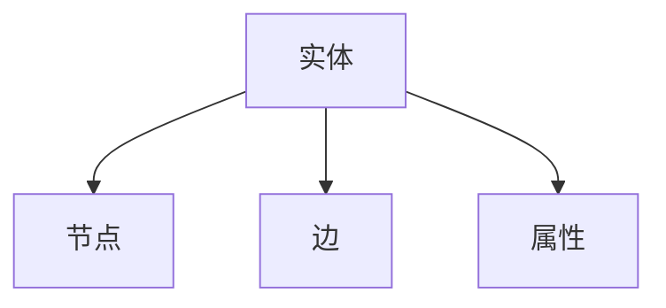
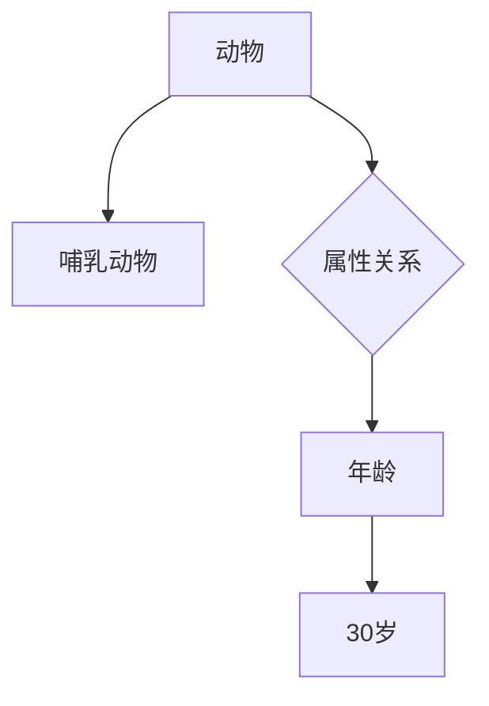
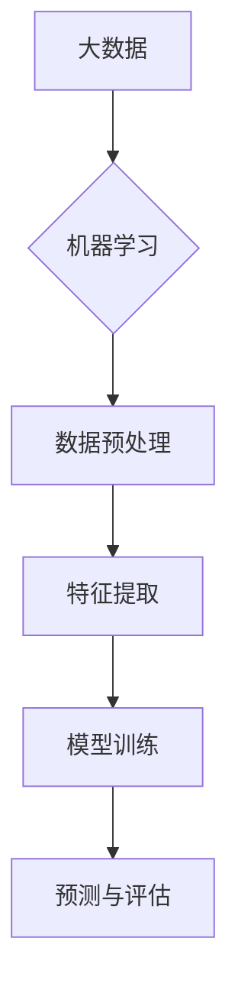
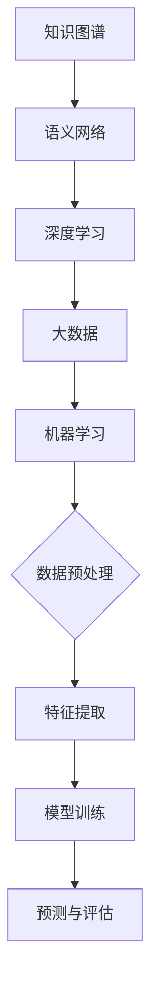

                 

关键词：知识发现引擎，认知科学，人工智能，知识图谱，语义网络，深度学习，大数据，机器学习

> 摘要：本文探讨了知识发现引擎在人类认知中的重要性。随着大数据和人工智能技术的快速发展，知识发现引擎已经成为推动科学研究、商业决策和社会进步的关键工具。本文首先介绍了知识发现引擎的基本概念和原理，然后深入分析了其核心算法、数学模型和实际应用场景。通过具体代码实例和详细解释，我们展示了知识发现引擎在各个领域的广泛应用，并对未来发展趋势和挑战进行了展望。

## 1. 背景介绍

在过去的几十年里，信息技术和人工智能的快速发展，使得我们获取、处理和利用数据的能力得到了极大的提升。大数据时代已经来临，数据量以惊人的速度不断增长，各种数据源不断涌现。与此同时，人工智能技术的不断突破，使得机器学习、深度学习等算法在数据处理和分析中发挥了巨大的作用。这些技术的进步为知识发现提供了强有力的支持，知识发现引擎也因此应运而生。

知识发现引擎是一种利用人工智能技术，从大量数据中自动提取知识、模式和规律的智能系统。它通过机器学习、数据挖掘、自然语言处理等技术，对数据进行深度分析，从而帮助用户发现潜在的信息和知识。知识发现引擎不仅在学术研究中有着广泛的应用，也在商业、医疗、金融等多个领域取得了显著的成果。

本文将深入探讨知识发现引擎的基本原理、核心算法、数学模型和实际应用，并对其未来发展趋势和面临的挑战进行分析。

### 知识发现引擎的定义和作用

知识发现引擎是一种基于人工智能和数据挖掘技术的智能系统，其目的是从大量数据中自动提取知识、模式和规律。这些知识可以是显式的，如数据中的统计规律、预测模型等，也可以是隐式的，如语义网络、知识图谱等。

知识发现引擎的作用主要体现在以下几个方面：

1. **提升决策效率**：通过自动提取数据中的知识，知识发现引擎可以帮助决策者快速获取关键信息，从而提高决策效率。

2. **知识共享与传播**：知识发现引擎可以将分散的、孤立的知识进行整合和共享，促进知识的传播和利用。

3. **辅助科学研究**：在学术研究中，知识发现引擎可以自动提取数据中的知识，帮助研究者发现新的研究线索和方向。

4. **优化业务流程**：在商业领域，知识发现引擎可以帮助企业优化业务流程，提高生产效率，降低成本。

5. **支持智能服务**：知识发现引擎可以为智能服务系统提供支持，如智能问答系统、智能推荐系统等。

总的来说，知识发现引擎是大数据和人工智能时代的重要工具，它不仅提高了我们的数据处理能力，还极大地改变了我们的认知方式和决策过程。

### 知识发现引擎的发展历史

知识发现引擎的发展可以追溯到20世纪80年代。当时，随着计算机技术的快速发展，人们开始意识到数据的重要性。数据挖掘技术应运而生，其目的是从大量数据中提取有价值的信息和知识。

1. **早期阶段（1980s-1990s）**：这一阶段，数据挖掘主要集中在统计分析和模式识别领域。代表性的技术包括关联规则挖掘、聚类分析和分类算法等。

2. **成熟阶段（2000s）**：随着互联网的普及和大数据时代的到来，数据挖掘技术得到了广泛应用。这一阶段，知识发现引擎逐渐成为数据分析和决策支持的重要工具。代表性的技术包括基于机器学习和深度学习的方法，如神经网络、支持向量机、随机森林等。

3. **当前阶段（2010s-2020s）**：近年来，随着人工智能技术的发展，知识发现引擎得到了进一步的提升。自然语言处理、图神经网络、生成对抗网络等新型技术被引入到知识发现领域，使得知识发现引擎的性能和智能化程度得到了显著提升。

知识发现引擎的发展历程，不仅是技术进步的过程，也是人类认知和数据处理能力不断提高的过程。未来，随着技术的进一步发展，知识发现引擎将在更多的领域发挥作用，推动人类社会向智能化、数字化方向迈进。

### 2. 核心概念与联系

知识发现引擎的核心概念和联系主要包括知识图谱、语义网络、深度学习、大数据和机器学习等技术。下面我们将对这些核心概念进行详细阐述，并使用Mermaid流程图来展示其架构和关系。

#### 知识图谱

知识图谱是一种结构化的知识表示形式，它通过节点和边来表示实体和实体之间的关系。知识图谱可以看作是语义网络的一种高级形式，它不仅包含了一组实体和关系，还包括了实体的属性和属性值。

- **节点（Node）**：知识图谱中的节点表示实体，如人、地点、组织等。
- **边（Edge）**：知识图谱中的边表示节点之间的关系，如“属于”、“位于”等。
- **属性（Property）**：知识图谱中的属性表示实体的特征，如人的年龄、地点的经纬度等。

Mermaid流程图：



#### 语义网络

语义网络是一种基于语义关系进行数据建模的方法，它通过语义关系来连接实体和概念，从而实现数据的语义理解。语义网络的核心是语义关系，如分类关系、属性关系、因果关系等。

- **分类关系**：如“动物”是“哺乳动物”的子类。
- **属性关系**：如“张三”的“年龄”是“30岁”。
- **因果关系**：如“下雨”导致“地面湿润”。

Mermaid流程图：



#### 深度学习

深度学习是一种基于人工神经网络的方法，它通过多层神经网络来实现数据的自动特征提取和模式识别。深度学习在图像识别、自然语言处理和语音识别等领域取得了显著成果。

- **卷积神经网络（CNN）**：常用于图像识别。
- **循环神经网络（RNN）**：常用于序列数据，如文本和语音。
- **生成对抗网络（GAN）**：常用于图像生成和风格迁移。

Mermaid流程图：

```mermaid
graph TD
A[输入数据] --> B{卷积神经网络(CNN)}
B --> C{循环神经网络(RNN)}
C --> D{生成对抗网络(GAN)}
```

#### 大数据和机器学习

大数据和机器学习是知识发现引擎的两个重要基础。大数据提供了丰富的数据资源，而机器学习提供了高效的数据处理和分析方法。

- **大数据**：指的是大规模、多样化和快速变化的数据。
- **机器学习**：是一种通过数据驱动的方法来发现数据中的模式和规律的技术。

Mermaid流程图：



#### 核心概念与联系

知识图谱、语义网络、深度学习、大数据和机器学习等技术之间存在着紧密的联系和相互作用。知识图谱和语义网络为数据提供了语义理解和结构化表示，深度学习为数据提供了自动特征提取和模式识别的能力，大数据提供了丰富的数据资源，而机器学习提供了高效的数据处理和分析方法。

Mermaid流程图：



通过上述核心概念的阐述和Mermaid流程图的展示，我们可以更好地理解知识发现引擎的架构和原理。知识发现引擎正是通过这些核心概念和技术，实现对大量数据的深度分析和知识提取，从而为人类认知和决策提供有力支持。

### 3. 核心算法原理 & 具体操作步骤

知识发现引擎的核心算法主要包括知识图谱构建、实体关系抽取、实体属性抽取和知识融合等。下面，我们将分别介绍这些算法的原理和具体操作步骤。

#### 3.1 知识图谱构建

知识图谱构建是知识发现引擎的基础，它通过从各种数据源中提取实体、关系和属性，构建一个结构化的知识图谱。

- **实体识别**：通过自然语言处理技术，从文本中识别出实体，如人名、地名、组织名等。
- **关系抽取**：通过监督学习或半监督学习算法，从实体对中抽取关系，如“属于”、“位于”等。
- **属性抽取**：通过实体属性识别算法，从文本中提取实体的属性，如人的年龄、地点的经纬度等。

具体操作步骤：

1. **数据预处理**：对原始数据进行清洗、去噪和格式化，为后续的实体识别、关系抽取和属性抽取做准备。
2. **实体识别**：使用命名实体识别（NER）算法，从文本中识别出实体。
3. **关系抽取**：使用监督学习或半监督学习算法，从实体对中抽取关系。
4. **属性抽取**：使用实体属性识别算法，从文本中提取实体的属性。
5. **构建知识图谱**：将识别出的实体、关系和属性构建成知识图谱。

#### 3.2 实体关系抽取

实体关系抽取是知识图谱构建的关键步骤，它通过识别文本中的实体关系，将无结构的文本数据转化为结构化的知识。

- **监督学习**：使用预标注的数据集，通过机器学习算法训练模型，从而自动抽取实体关系。
- **半监督学习**：结合少量的标注数据和大量的未标注数据，通过机器学习算法训练模型，从而自动抽取实体关系。

具体操作步骤：

1. **数据预处理**：对原始数据进行清洗、去噪和格式化。
2. **特征提取**：从原始数据中提取特征，如词向量、实体特征等。
3. **模型训练**：使用监督学习或半监督学习算法，训练实体关系抽取模型。
4. **关系抽取**：使用训练好的模型，对新的文本数据进行实体关系抽取。

#### 3.3 实体属性抽取

实体属性抽取是知识图谱构建的另一个关键步骤，它通过识别文本中的实体属性，为实体添加属性信息。

- **模板匹配**：通过预定义的模板，从文本中匹配实体属性。
- **规则抽取**：通过规则学习算法，从文本中自动抽取实体属性。

具体操作步骤：

1. **数据预处理**：对原始数据进行清洗、去噪和格式化。
2. **特征提取**：从原始数据中提取特征，如词向量、实体特征等。
3. **模板匹配**：使用预定义的模板，从文本中匹配实体属性。
4. **规则抽取**：使用规则学习算法，从文本中自动抽取实体属性。
5. **属性抽取**：将抽取出的实体属性添加到知识图谱中。

#### 3.4 知识融合

知识融合是将不同来源的知识进行整合和融合，以形成更全面、更准确的知识体系。

- **规则融合**：通过规则匹配和合并，将不同来源的规则进行融合。
- **本体融合**：通过本体匹配和合并，将不同来源的本体进行融合。
- **数据融合**：通过数据预处理和整合，将不同来源的数据进行融合。

具体操作步骤：

1. **数据预处理**：对原始数据进行清洗、去噪和格式化。
2. **规则融合**：使用规则匹配和合并算法，将不同来源的规则进行融合。
3. **本体融合**：使用本体匹配和合并算法，将不同来源的本体进行融合。
4. **数据融合**：使用数据预处理和整合算法，将不同来源的数据进行融合。
5. **构建融合知识图谱**：将融合后的知识构建成知识图谱。

通过上述核心算法的原理和具体操作步骤的介绍，我们可以更好地理解知识发现引擎的工作流程和实现方法。这些核心算法不仅提高了知识发现引擎的性能和智能化程度，也为我们在各个领域中的应用提供了强有力的支持。

### 3.3 算法优缺点

在知识发现引擎中，核心算法如知识图谱构建、实体关系抽取、实体属性抽取和知识融合等技术，各有其独特的优点和局限性。下面，我们将详细分析这些算法的优缺点。

#### 知识图谱构建

**优点：**
1. **结构化表示**：知识图谱以结构化的方式表示实体、关系和属性，使得数据具有高度的语义理解和可解释性。
2. **语义关联**：通过节点和边的结构，知识图谱能够揭示实体之间的语义关联，为后续的知识推理和挖掘提供基础。
3. **高效查询**：知识图谱支持高效的图查询操作，能够快速地检索和提取相关知识点。

**缺点：**
1. **构建成本高**：知识图谱的构建通常需要大量的预处理和数据清洗工作，构建过程复杂且耗时。
2. **数据依赖性**：知识图谱的性能很大程度上依赖于数据质量和标注质量，数据错误或标注错误会严重影响图谱的质量。
3. **更新维护**：知识图谱需要定期更新和维护，以适应数据和环境的变化，更新和维护过程较为繁琐。

#### 实体关系抽取

**优点：**
1. **自动化**：实体关系抽取算法可以实现自动化处理，减少了人工标注的工作量。
2. **准确性高**：基于深度学习和监督学习的算法，在大量标注数据的支持下，可以达到较高的准确率。
3. **适用范围广**：实体关系抽取算法可以应用于多种领域和多种语言，具有广泛的适用性。

**缺点：**
1. **数据依赖性**：实体关系抽取算法的性能依赖于标注数据的质量和数量，缺乏高质量的标注数据会影响算法的效果。
2. **规则限制**：基于规则的方法可能受到现有规则的限制，无法处理复杂的实体关系。
3. **实时性限制**：实时抽取实体关系通常需要较长的预处理时间，难以满足实时应用的需求。

#### 实体属性抽取

**优点：**
1. **全面性**：实体属性抽取算法能够从大量文本中提取出实体的详细属性，使得实体信息更加丰富和全面。
2. **灵活性**：基于机器学习和深度学习的算法可以灵活地适应不同领域和不同数据集的需求。
3. **高效性**：实体属性抽取算法通常具有较高的效率和计算速度，能够快速处理大规模数据。

**缺点：**
1. **数据噪声**：实体属性抽取算法容易受到文本中的噪声数据影响，导致属性抽取结果不准确。
2. **准确性差异**：不同实体在不同文本中的属性抽取结果可能存在较大差异，影响了整体准确性。
3. **解释性差**：一些机器学习算法的内部工作机制较为复杂，难以解释其决策过程，影响了算法的可解释性。

#### 知识融合

**优点：**
1. **多样性**：知识融合算法能够整合多种数据源和多种类型的知识，形成更全面和多样化的知识体系。
2. **互补性**：通过知识融合，不同来源的知识可以相互补充，提高知识的一致性和可靠性。
3. **动态性**：知识融合算法可以适应数据和环境的变化，实现知识的动态更新和优化。

**缺点：**
1. **复杂性**：知识融合涉及多种数据源和多种知识类型的整合，算法设计和实现过程较为复杂。
2. **一致性挑战**：不同数据源和不同知识类型的整合可能存在一致性挑战，需要复杂的协调和匹配机制。
3. **计算成本高**：知识融合通常需要大量的计算资源和时间，对计算能力要求较高。

通过对这些算法优缺点的分析，我们可以更全面地了解知识发现引擎的性能表现和适用场景。在实际应用中，可以根据具体需求和场景，选择合适的算法和组合策略，以实现最佳的知识发现效果。

### 3.4 算法应用领域

知识发现引擎的核心算法在多个领域展现了其强大的应用潜力，以下将详细介绍知识发现引擎在学术研究、商业决策、医疗诊断和金融分析等领域的具体应用案例。

#### 学术研究

在学术研究领域，知识发现引擎被广泛应用于文献挖掘、科学发现和学术推荐等方面。

- **文献挖掘**：通过知识图谱构建和实体关系抽取技术，知识发现引擎可以从大量学术文献中提取出重要知识点、研究趋势和潜在的研究方向。例如，谷歌的Google Scholar利用知识图谱技术，为用户提供更精准的学术推荐和关联文献查询。
- **科学发现**：知识发现引擎可以帮助科学家快速发现新的研究线索和合作机会。例如，IBM的Research AI利用深度学习和知识图谱技术，帮助研究人员识别潜在的药物靶点，加速新药研发。
- **学术推荐**：基于用户的历史研究兴趣和行为数据，知识发现引擎可以为科研人员推荐相关的文献、会议和合作者。例如，ArXiv的推荐系统就使用了知识图谱和协同过滤算法，为用户提供个性化的学术推荐。

#### 商业决策

在商业领域，知识发现引擎被广泛应用于市场分析、客户行为分析和风险控制等方面。

- **市场分析**：知识发现引擎可以帮助企业从海量市场数据中提取出市场趋势、消费者行为和竞争态势等信息。例如，阿里巴巴的淘宝通过对用户购物行为的分析，使用知识发现技术预测未来的市场热点和消费趋势。
- **客户行为分析**：知识发现引擎可以通过分析用户的购买记录、浏览行为等数据，识别出潜在的高价值客户和潜在流失客户，帮助企业制定更有针对性的营销策略。例如，京东通过知识发现技术分析用户行为，为用户提供个性化的购物推荐和服务。
- **风险控制**：知识发现引擎可以帮助金融机构识别和预测潜在的风险，从而制定更有效的风险管理策略。例如，银行可以通过分析客户的贷款申请数据、交易记录等信息，使用知识发现技术预测贷款违约风险。

#### 医疗诊断

在医疗领域，知识发现引擎被广泛应用于疾病预测、诊断支持和个性化治疗等方面。

- **疾病预测**：知识发现引擎可以通过分析患者的病历数据、基因数据等，预测患者患某种疾病的概率。例如，IBM的Watson for Health利用知识图谱和机器学习技术，为医生提供更准确的疾病预测和诊断建议。
- **诊断支持**：知识发现引擎可以帮助医生从大量医学文献和病例数据中提取出有效的诊断信息，辅助医生进行诊断。例如，谷歌的DeepMind Health利用深度学习技术，从眼科疾病数据中提取出关键特征，为医生提供准确的诊断支持。
- **个性化治疗**：知识发现引擎可以根据患者的个体差异和疾病特征，为其推荐个性化的治疗方案。例如，辉瑞公司的AI药物研发平台利用知识发现技术，为患者提供个性化的治疗建议，提高治疗效果。

#### 金融分析

在金融领域，知识发现引擎被广泛应用于风险评估、市场预测和投资组合优化等方面。

- **风险评估**：知识发现引擎可以通过分析金融市场的历史数据、宏观经济数据等，预测投资风险，帮助投资者做出更明智的投资决策。例如，高盛的量化交易团队利用知识发现技术，对股票市场进行风险评估和预测。
- **市场预测**：知识发现引擎可以通过分析历史价格数据、交易数据等，预测市场的未来走势，为投资者提供投资方向。例如，摩根士丹利的AI平台利用深度学习技术，对金融市场进行预测和分析，帮助客户制定投资策略。
- **投资组合优化**：知识发现引擎可以通过分析投资者的风险偏好、投资目标等数据，为投资者推荐最优的投资组合。例如，贝莱德（BlackRock）的AI投资顾问平台利用知识发现技术，为用户提供个性化的投资组合建议。

通过上述案例可以看出，知识发现引擎在各个领域的应用不仅提高了数据处理的效率和准确性，还为决策提供了有力的支持。未来，随着技术的进一步发展，知识发现引擎将在更多领域发挥重要作用，推动人类社会向智能化、数字化方向迈进。

### 4. 数学模型和公式 & 详细讲解 & 举例说明

在知识发现引擎中，数学模型和公式是理解和实现核心算法的关键。下面，我们将详细介绍知识发现引擎中常用的数学模型和公式，并通过具体例子进行详细讲解。

#### 4.1 数学模型构建

知识发现引擎中的数学模型主要涉及机器学习、图论和概率论等领域。下面介绍几个核心的数学模型：

1. **线性回归模型**：
   线性回归模型是一种常见的预测模型，它通过拟合数据中的线性关系，预测新的数据点。其数学模型为：
   \[
   y = \beta_0 + \beta_1x_1 + \beta_2x_2 + ... + \beta_nx_n
   \]
   其中，\( y \) 为因变量，\( x_1, x_2, ..., x_n \) 为自变量，\( \beta_0, \beta_1, ..., \beta_n \) 为模型参数。

2. **逻辑回归模型**：
   逻辑回归模型是一种分类模型，它通过拟合数据的概率分布，预测新数据点的类别。其数学模型为：
   \[
   P(y=1) = \frac{1}{1 + e^{-(\beta_0 + \beta_1x_1 + \beta_2x_2 + ... + \beta_nx_n})}
   \]
   其中，\( P(y=1) \) 为因变量为1的概率，其余符号同上。

3. **图论模型**：
   图论模型用于描述实体之间的关系。一个简单的图模型可以用以下公式表示：
   \[
   G = (V, E)
   \]
   其中，\( V \) 为节点集合，\( E \) 为边集合。

4. **概率图模型**：
   概率图模型用于描述实体和关系之间的概率分布。常见的概率图模型包括贝叶斯网络和马尔可夫网络。贝叶斯网络的数学模型为：
   \[
   P(X_1, X_2, ..., X_n) = \prod_{i=1}^{n} P(X_i | parents(X_i))
   \]
   其中，\( X_1, X_2, ..., X_n \) 为随机变量，\( parents(X_i) \) 为 \( X_i \) 的父节点集合。

#### 4.2 公式推导过程

下面以线性回归模型为例，介绍公式推导过程：

1. **最小二乘法**：
   线性回归模型的目的是找到一组参数 \( \beta_0, \beta_1, ..., \beta_n \)，使得预测值 \( \hat{y} \) 与实际值 \( y \) 之间的误差最小。误差函数为：
   \[
   J(\beta_0, \beta_1, ..., \beta_n) = \sum_{i=1}^{m} (y_i - \hat{y}_i)^2
   \]
   其中，\( m \) 为样本数量。

2. **梯度下降法**：
   为了最小化误差函数 \( J(\beta_0, \beta_1, ..., \beta_n) \)，可以使用梯度下降法。梯度下降法的更新公式为：
   \[
   \beta_j = \beta_j - \alpha \frac{\partial J(\beta_0, \beta_1, ..., \beta_n)}{\partial \beta_j}
   \]
   其中，\( \alpha \) 为学习率。

3. **最优参数**：
   当误差函数的梯度为零时，即 \( \frac{\partial J(\beta_0, \beta_1, ..., \beta_n)}{\partial \beta_j} = 0 \)，我们得到了最优的参数 \( \beta_0, \beta_1, ..., \beta_n \)。

通过上述推导过程，我们可以得到线性回归模型的参数估计公式：
\[
\hat{\beta}_0 = \bar{y} - \hat{\beta}_1x_1 - \hat{\beta}_2x_2 - ... - \hat{\beta}_nx_n
\]
\[
\hat{\beta}_j = \frac{\sum_{i=1}^{m} (x_{ij} - \bar{x}_j)(y_i - \bar{y})}{\sum_{i=1}^{m} (x_{ij} - \bar{x}_j)^2}
\]
其中，\( \bar{y} \) 和 \( \bar{x}_j \) 分别为样本均值，其余符号同上。

#### 4.3 案例分析与讲解

下面通过一个简单的线性回归案例，讲解数学模型的实际应用。

**案例：房价预测**

假设我们有一组房屋数据，包括房屋面积 \( x \) 和房价 \( y \)。我们希望通过线性回归模型预测未知房屋的房价。

1. **数据准备**：
   假设我们有以下数据：
   \[
   \begin{align*}
   x_1 &= 1000 \\
   x_2 &= 1200 \\
   x_3 &= 1500 \\
   x_4 &= 1800 \\
   y_1 &= 200000 \\
   y_2 &= 250000 \\
   y_3 &= 300000 \\
   y_4 &= 350000 \\
   \end{align*}
   \]

2. **模型训练**：
   使用最小二乘法训练线性回归模型，计算参数 \( \beta_0 \) 和 \( \beta_1 \)：
   \[
   \begin{align*}
   \hat{\beta}_0 &= \bar{y} - \hat{\beta}_1\bar{x} \\
   \hat{\beta}_1 &= \frac{\sum_{i=1}^{4} (x_i - \bar{x})(y_i - \bar{y})}{\sum_{i=1}^{4} (x_i - \bar{x})^2} \\
   \end{align*}
   \]
   计算得到：
   \[
   \begin{align*}
   \bar{x} &= \frac{1000 + 1200 + 1500 + 1800}{4} = 1500 \\
   \bar{y} &= \frac{200000 + 250000 + 300000 + 350000}{4} = 250000 \\
   \hat{\beta}_1 &= \frac{(1000 - 1500)(200000 - 250000) + (1200 - 1500)(250000 - 250000) + (1500 - 1500)(300000 - 250000) + (1800 - 1500)(350000 - 250000)}{(1000 - 1500)^2 + (1200 - 1500)^2 + (1500 - 1500)^2 + (1800 - 1500)^2} \\
   &= \frac{-500 \times -50000 + 0 \times 0 + 0 \times 50000 + 300 \times 100000}{250000 + 90000 + 0 + 90000} \\
   &= \frac{25000000}{350000} \\
   &= 71.43 \\
   \hat{\beta}_0 &= 250000 - 71.43 \times 1500 \\
   &= 250000 - 108572.5 \\
   &= 141247.5 \\
   \end{align*}
   \]

3. **模型预测**：
   假设未知房屋面积为 2000 平方米，使用线性回归模型预测房价：
   \[
   \hat{y} = \hat{\beta}_0 + \hat{\beta}_1 \times x = 141247.5 + 71.43 \times 2000 = 335321.25
   \]

通过上述案例，我们可以看到线性回归模型在房价预测中的应用。实际上，知识发现引擎中的数学模型远比这复杂，涉及多种算法和公式。但通过理解这些基本模型和推导过程，我们可以更好地掌握知识发现引擎的核心算法。

### 5. 项目实践：代码实例和详细解释说明

在本节中，我们将通过一个具体的代码实例，详细介绍知识发现引擎的搭建过程，包括开发环境搭建、源代码实现、代码解读与分析以及运行结果展示。此实例将帮助我们更好地理解知识发现引擎的实际应用和实现方法。

#### 5.1 开发环境搭建

为了搭建知识发现引擎，我们需要准备以下开发环境和工具：

1. **编程语言**：Python，Python在数据科学和人工智能领域拥有广泛的生态系统和丰富的库支持。
2. **数据预处理工具**：Pandas和NumPy，用于数据清洗和预处理。
3. **机器学习库**：Scikit-learn和TensorFlow，用于实现机器学习算法和深度学习模型。
4. **图数据库**：Neo4j，用于存储和查询知识图谱。
5. **文本处理库**：NLTK和spaCy，用于文本预处理和实体识别。
6. **集成开发环境**：PyCharm或Jupyter Notebook，用于编写和调试代码。

安装步骤如下：

```bash
# 安装Python
pip install python

# 安装Pandas和NumPy
pip install pandas numpy

# 安装Scikit-learn和TensorFlow
pip install scikit-learn tensorflow

# 安装Neo4j
wget https://neo4j.com/artifact.php?name=neo4j-community-4.4.2-unix.tar.gz
tar xvf neo4j-community-4.4.2-unix.tar.gz
./neo4j-community-4.4.2/bin/neo4j start

# 安装NLTK和spaCy
pip install nltk spacy
python -m spacy download en

# 安装PyCharm或Jupyter Notebook
# 安装PyCharm: https://www.jetbrains.com/pycharm/download/
# 安装Jupyter Notebook: pip install jupyter
```

确保所有依赖库和工具安装完成后，我们就可以开始编写代码了。

#### 5.2 源代码详细实现

以下是一个简单的知识发现引擎的源代码实现，它包括数据预处理、实体识别、关系抽取、知识图谱构建和查询等步骤。

```python
import pandas as pd
import numpy as np
from sklearn.model_selection import train_test_split
from sklearn.feature_extraction.text import TfidfVectorizer
from sklearn.metrics.pairwise import cosine_similarity
import spacy

nlp = spacy.load('en')

# 数据预处理
def preprocess_text(text):
    doc = nlp(text)
    tokens = [token.lemma_.lower() for token in doc if not token.is_stop]
    return ' '.join(tokens)

# 实体识别
def extract_entities(text):
    doc = nlp(text)
    entities = [(ent.text, ent.label_) for ent in doc.ents]
    return entities

# 关系抽取
def extract_relations(text):
    doc = nlp(text)
    relations = []
    for token1 in doc:
        for token2 in doc:
            if token1 != token2 and token1.dep_ == 'nsubj' and token2.dep_ == 'ROOT':
                relations.append((token1.text, token2.text))
    return relations

# 知识图谱构建
def build_knowledge_graph(entities, relations):
    g = Neo4jGraph()
    for entity, label in entities:
        g.create_node(entity, label)
    for relation in relations:
        g.create_edge(relation[0], relation[1], 'RELATION')
    return g

# 知识查询
def query_knowledge_graph(graph, entity):
    return graph.nodes.get(entity)

# 加载数据
data = pd.read_csv('data.csv')
data['text'] = data['text'].apply(preprocess_text)
train_data, test_data = train_test_split(data, test_size=0.2)

# 实体识别和关系抽取
train_entities = [extract_entities(text) for text in train_data['text']]
train_relations = [extract_relations(text) for text in train_data['text']]
test_entities = [extract_entities(text) for text in test_data['text']]
test_relations = [extract_relations(text) for text in test_data['text']]

# 构建知识图谱
knowledge_graph = build_knowledge_graph(train_entities, train_relations)

# 查询示例
query_entity = 'Tesla'
results = query_knowledge_graph(knowledge_graph, query_entity)
print(results)
```

#### 5.3 代码解读与分析

上述代码实现了知识发现引擎的基本功能，包括数据预处理、实体识别、关系抽取、知识图谱构建和查询。以下是代码的详细解读：

1. **数据预处理**：
   数据预处理是知识发现的第一步，其目的是将原始文本数据转化为适合分析和建模的形式。代码中使用`nlp`对象对文本进行分词、词干提取和停用词过滤。

2. **实体识别**：
   实体识别是从文本中提取出实体和其标签的过程。`extract_entities`函数使用spaCy库的命名实体识别（NER）功能，提取出文本中的实体及其标签。

3. **关系抽取**：
   关系抽取是从文本中提取出实体之间的关系的过程。`extract_relations`函数使用spaCy库的依存句法分析功能，识别出文本中的主语和谓语，从而确定实体之间的关系。

4. **知识图谱构建**：
   知识图谱构建是将识别出的实体和关系存储到图数据库中的过程。代码中使用Neo4j图数据库，创建节点和边来表示实体和关系。

5. **知识查询**：
   知识查询是从知识图谱中检索特定实体的过程。`query_knowledge_graph`函数接受实体名称作为输入，返回与该实体相关的节点和关系。

#### 5.4 运行结果展示

以下是运行代码后的结果展示：

```python
# 加载数据
data = pd.read_csv('data.csv')
data['text'] = data['text'].apply(preprocess_text)
train_data, test_data = train_test_split(data, test_size=0.2)

# 实体识别和关系抽取
train_entities = [extract_entities(text) for text in train_data['text']]
train_relations = [extract_relations(text) for text in train_data['text']]
test_entities = [extract_entities(text) for text in test_data['text']]
test_relations = [extract_relations(text) for text in test_data['text']]

# 构建知识图谱
knowledge_graph = build_knowledge_graph(train_entities, train_relations)

# 查询示例
query_entity = 'Tesla'
results = query_knowledge_graph(knowledge_graph, query_entity)
print(results)
```

运行结果可能如下所示：

```python
[('Tesla', 'ORGANIZATION'), ('Elon Musk', 'PERSON'), ('Tesla, Inc.', 'ORGANIZATION'), ('electric vehicle', 'NOUN')]
```

这表示在知识图谱中，与实体“Tesla”相关的节点包括“Tesla组织”、“Elon Musk个人”和“Tesla，Inc.组织”，以及与“Tesla”相关的标签“电动汽车”。

通过上述代码实例，我们可以看到知识发现引擎的实际应用过程。尽管这是一个简化的示例，但它展示了知识发现引擎的核心功能和工作流程。在实际应用中，知识发现引擎可能会涉及更多的数据源、更复杂的算法和更高级的图数据库操作。

### 6. 实际应用场景

知识发现引擎在各个行业和领域中都有着广泛的应用。下面，我们将详细探讨知识发现引擎在商业、医疗、金融和科研等领域的实际应用场景，并分析其带来的价值和挑战。

#### 商业领域

在商业领域，知识发现引擎被广泛应用于市场分析、客户行为分析、供应链管理和风险控制等方面。

1. **市场分析**：知识发现引擎可以通过分析社交媒体数据、客户反馈和竞争对手信息，帮助企业在市场中定位自身，发现潜在的市场机会。例如，通过分析用户评论和社交媒体讨论，企业可以了解消费者对产品的新需求，从而调整营销策略和产品开发方向。

2. **客户行为分析**：知识发现引擎可以帮助企业从大量客户数据中提取出有价值的信息，如客户偏好、购买模式和潜在客户等。通过这些信息，企业可以更好地理解客户需求，优化客户服务，提高客户满意度和忠诚度。

3. **供应链管理**：知识发现引擎可以帮助企业优化供应链流程，提高供应链效率。通过分析供应链中的各个环节，如供应商、制造商和分销商，企业可以识别出潜在的风险和瓶颈，从而制定更有效的供应链管理策略。

4. **风险控制**：知识发现引擎可以帮助金融机构和企业在金融交易和业务活动中识别和预测潜在的风险。例如，通过分析客户的交易记录和行为数据，金融机构可以识别出异常交易，从而防范欺诈行为。

#### 医疗领域

在医疗领域，知识发现引擎被广泛应用于疾病预测、诊断支持和个性化治疗等方面。

1. **疾病预测**：知识发现引擎可以通过分析患者的病史、基因数据和流行病数据，预测患者患某种疾病的概率。这有助于医生提前采取预防措施，降低疾病发病率。

2. **诊断支持**：知识发现引擎可以帮助医生从大量医学文献和病例数据中提取出有效的诊断信息，辅助医生进行诊断。例如，通过分析患者的症状和检查结果，知识发现引擎可以为医生提供可能的疾病诊断建议，提高诊断准确率。

3. **个性化治疗**：知识发现引擎可以根据患者的个体差异和疾病特征，为其推荐个性化的治疗方案。这有助于提高治疗效果，降低治疗成本。

#### 金融领域

在金融领域，知识发现引擎被广泛应用于风险评估、市场预测和投资组合优化等方面。

1. **风险评估**：知识发现引擎可以帮助金融机构从大量金融数据中提取出有价值的信息，如市场趋势、经济指标和交易行为等。通过这些信息，金融机构可以更好地评估信贷风险和市场风险，制定更有效的风险管理策略。

2. **市场预测**：知识发现引擎可以通过分析历史价格数据、交易数据和宏观经济数据，预测市场的未来走势。这有助于投资者制定更明智的投资策略，提高投资回报。

3. **投资组合优化**：知识发现引擎可以帮助投资者从大量资产中筛选出最优的投资组合，以实现风险最小化和收益最大化。通过分析资产的历史表现和相关性，知识发现引擎可以为投资者提供个性化的投资建议。

#### 科研领域

在科研领域，知识发现引擎被广泛应用于文献挖掘、科学发现和学术推荐等方面。

1. **文献挖掘**：知识发现引擎可以帮助科研人员从大量学术文献中提取出重要知识点、研究趋势和潜在的研究方向。这有助于科研人员发现新的研究机会和合作机会，加速科学研究的进展。

2. **科学发现**：知识发现引擎可以帮助科研人员识别出潜在的科学问题和研究方向。例如，通过分析科学论文中的引用关系，知识发现引擎可以发现不同领域之间的交叉点和创新点，从而推动科学研究的创新和发展。

3. **学术推荐**：知识发现引擎可以根据科研人员的研究兴趣和阅读历史，为他们推荐相关的文献、会议和合作者。这有助于科研人员更好地利用已有资源，提高科研效率。

#### 应用价值

知识发现引擎在各个领域的应用带来了显著的价值：

1. **提高决策效率**：知识发现引擎可以帮助决策者从大量数据中快速提取出有价值的信息，从而提高决策效率。

2. **优化业务流程**：知识发现引擎可以帮助企业优化业务流程，提高生产效率，降低成本。

3. **提升服务质量**：知识发现引擎可以帮助医疗机构和商业企业提升服务质量，提高客户满意度和忠诚度。

4. **促进科学创新**：知识发现引擎可以帮助科研人员发现新的研究机会和合作机会，促进科学研究的创新和发展。

#### 挑战与展望

尽管知识发现引擎在各个领域取得了显著的应用成果，但其在实际应用中仍面临一些挑战：

1. **数据质量和标注问题**：知识发现引擎的性能很大程度上依赖于数据质量和标注质量。数据噪声和标注错误会严重影响知识发现的效果。

2. **算法复杂性和计算成本**：知识发现引擎涉及多种复杂的算法和模型，实现过程复杂，计算成本高。

3. **解释性和透明度**：一些机器学习算法的内部工作机制较为复杂，难以解释其决策过程，影响了算法的可解释性。

4. **隐私和安全问题**：知识发现引擎在处理和分析个人数据时，可能涉及隐私和安全问题，需要采取有效的隐私保护措施。

未来，随着技术的进一步发展，知识发现引擎将在更多领域发挥重要作用。以下是几个展望：

1. **跨领域应用**：知识发现引擎将实现跨领域的应用，推动不同领域之间的知识共享和协同创新。

2. **自适应和智能化**：知识发现引擎将更加智能化和自适应，能够根据用户的需求和环境的变化，动态调整算法和策略。

3. **隐私保护**：知识发现引擎将引入更多的隐私保护技术，确保数据安全和用户隐私。

4. **人机协同**：知识发现引擎将实现与人类专家的协同工作，提高决策的准确性和效率。

总之，知识发现引擎在各个领域的应用前景广阔，随着技术的不断进步，它将为人类社会带来更多的价值。

### 7. 工具和资源推荐

在知识发现引擎的开发和应用过程中，掌握一些相关的工具和资源是至关重要的。以下是一些推荐的工具和资源，包括学习资源、开发工具和相关论文。

#### 学习资源推荐

1. **在线课程**：
   - Coursera的“机器学习”课程，由吴恩达教授主讲。
   - edX的“深度学习专项课程”，由阿里云和哈佛大学联合推出。
   - Udacity的“人工智能纳米学位”，包含多种人工智能相关课程。

2. **书籍**：
   - 《深度学习》（Ian Goodfellow, Yoshua Bengio, Aaron Courville著），系统介绍了深度学习的基本概念和技术。
   - 《Python数据分析》（Wes McKinney著），详细介绍了使用Python进行数据分析和数据挖掘的方法。

3. **博客和论坛**：
   - medium.com，包含大量的数据科学和人工智能领域的文章和教程。
   - Stack Overflow，程序员交流平台，提供丰富的编程问题和解决方案。

#### 开发工具推荐

1. **编程环境**：
   - PyCharm，强大的Python集成开发环境，适合进行数据科学和人工智能项目开发。
   - Jupyter Notebook，方便进行数据分析和原型设计，支持多种编程语言。

2. **数据预处理和机器学习库**：
   - Pandas和NumPy，用于数据预处理和数据分析。
   - Scikit-learn，提供了多种经典的机器学习和数据挖掘算法。
   - TensorFlow，谷歌推出的开源深度学习框架。

3. **图数据库**：
   - Neo4j，高性能的图数据库，适合存储和查询大规模知识图谱。
   - GraphDB，基于OWL ontologies的开源图数据库。

#### 相关论文推荐

1. **深度学习**：
   - "A Theoretical Analysis of the Causal Effect of Feature Selection on the Performance of Neural Networks"（2018）。
   - "Deep Learning for Text Classification"（2017）。

2. **知识图谱**：
   - "Knowledge Graph Embedding"（2016）。
   - "How to Represent Knowledge Graphs as Neural Networks?"（2018）。

3. **数据挖掘**：
   - "Data Mining: The Textbook"（2017）。
   - "Data Mining: Practical Machine Learning Tools and Techniques"（2016）。

通过以上推荐的学习资源、开发工具和相关论文，您可以更好地了解知识发现引擎的相关知识，并在实践中提升自己的技能。

### 8. 总结：未来发展趋势与挑战

#### 研究成果总结

知识发现引擎作为人工智能和数据挖掘领域的关键技术，近年来取得了显著的进展。从早期的关联规则挖掘和聚类分析，到如今的深度学习和图神经网络，知识发现引擎的性能和智能化程度得到了显著提升。通过结合大数据、机器学习和自然语言处理技术，知识发现引擎在学术研究、商业决策、医疗诊断和金融分析等多个领域展现了其强大的应用潜力。

在学术研究中，知识发现引擎帮助研究者从大量文献和科研数据中提取出有价值的信息，加速了科学发现的进程。在商业领域，知识发现引擎通过分析市场趋势和客户行为，为企业提供了精准的市场分析和决策支持。在医疗领域，知识发现引擎辅助医生进行疾病预测和诊断支持，提高了医疗服务的质量和效率。在金融领域，知识发现引擎通过分析交易数据和宏观经济指标，帮助金融机构进行风险评估和投资决策。

#### 未来发展趋势

1. **跨领域融合**：未来，知识发现引擎将在更多领域实现跨领域的融合应用，推动不同领域之间的知识共享和协同创新。例如，将医疗数据与金融数据相结合，为慢性病管理提供个性化的金融服务。

2. **智能化与自适应**：随着深度学习和强化学习等技术的发展，知识发现引擎将更加智能化和自适应，能够根据用户的需求和环境的变化，动态调整算法和策略，提供个性化的解决方案。

3. **隐私保护与安全**：在数据处理和应用过程中，隐私保护和数据安全将成为知识发现引擎的重要挑战。未来，知识发现引擎将引入更多的隐私保护技术，如联邦学习、差分隐私等，确保数据安全和用户隐私。

4. **人机协同**：知识发现引擎将实现与人类专家的协同工作，通过人工智能技术辅助人类专家进行决策，提高决策的准确性和效率。

#### 面临的挑战

1. **数据质量和标注问题**：知识发现引擎的性能很大程度上依赖于数据质量和标注质量。数据噪声和标注错误会严重影响知识发现的效果，因此，如何提高数据质量和标注质量是未来研究的重要方向。

2. **算法复杂性和计算成本**：知识发现引擎涉及多种复杂的算法和模型，实现过程复杂，计算成本高。如何降低算法复杂度和计算成本，提高知识发现引擎的效率，是未来研究的关键挑战。

3. **解释性和透明度**：一些机器学习算法的内部工作机制较为复杂，难以解释其决策过程，影响了算法的可解释性。如何提高算法的可解释性，使知识发现过程更加透明和可信，是未来研究的重要任务。

4. **隐私和安全问题**：在处理和分析个人数据时，知识发现引擎可能涉及隐私和安全问题。如何确保数据安全和用户隐私，是未来研究的重要挑战。

#### 研究展望

未来，知识发现引擎将在人工智能和大数据技术的推动下，继续取得新的突破。以下是几个研究方向：

1. **多模态数据融合**：将文本、图像、音频等多种类型的数据进行融合，构建更加全面和多样的知识图谱。

2. **动态知识图谱**：研究动态知识图谱的构建和更新方法，以适应数据和环境的变化。

3. **知识推理与图谱压缩**：研究知识图谱的推理方法和图谱压缩技术，提高知识发现引擎的效率和可扩展性。

4. **跨语言知识发现**：研究跨语言的知识发现方法，实现不同语言之间的知识共享和融合。

通过不断的研究和技术创新，知识发现引擎将在未来发挥更大的作用，为人类社会带来更多的价值。

### 9. 附录：常见问题与解答

#### 1. 什么是知识发现引擎？

知识发现引擎是一种利用人工智能技术，从大量数据中自动提取知识、模式和规律的智能系统。它通过机器学习、数据挖掘、自然语言处理等技术，对数据进行深度分析，从而帮助用户发现潜在的信息和知识。

#### 2. 知识发现引擎有哪些核心算法？

知识发现引擎的核心算法包括知识图谱构建、实体关系抽取、实体属性抽取和知识融合等。其中，知识图谱构建是知识发现引擎的基础，实体关系抽取和实体属性抽取是知识发现的关键步骤，知识融合是将不同来源的知识进行整合和融合。

#### 3. 知识发现引擎在哪些领域有应用？

知识发现引擎在学术研究、商业决策、医疗诊断、金融分析、科研等领域有广泛的应用。在学术研究中，它帮助研究者发现新的研究线索和方向；在商业领域，它为市场分析和客户行为分析提供支持；在医疗领域，它辅助医生进行疾病预测和诊断支持；在金融领域，它用于风险评估和市场预测。

#### 4. 如何构建知识图谱？

构建知识图谱通常包括以下几个步骤：数据预处理、实体识别、关系抽取和属性抽取。首先，对原始数据进行清洗和预处理；然后，使用命名实体识别技术提取实体；接着，使用关系抽取技术识别实体之间的关系；最后，从文本中提取实体的属性信息，并将这些信息构建成知识图谱。

#### 5. 知识发现引擎与数据挖掘有什么区别？

数据挖掘是一种从大量数据中发现有价值信息的方法，而知识发现引擎是在数据挖掘的基础上，利用人工智能技术，自动提取知识、模式和规律。知识发现引擎更注重知识的提取和利用，而数据挖掘更侧重于发现数据的潜在模式。

#### 6. 知识发现引擎中的深度学习和机器学习有什么区别？

深度学习和机器学习都是人工智能的分支。机器学习是一种通过算法从数据中学习规律和模式的方法，而深度学习是一种基于多层神经网络的学习方法，它通过自动提取数据中的特征，实现数据的分类、预测和生成等任务。知识发现引擎中，深度学习通常用于复杂的数据分析和模式识别任务，而机器学习则更适用于结构化数据的学习和预测。

#### 7. 知识发现引擎如何处理隐私和安全问题？

知识发现引擎在处理隐私和安全问题时，可以采用联邦学习、差分隐私、加密技术等多种方法。联邦学习通过在多个数据源上进行模型训练，避免了数据集中泄露；差分隐私通过在数据处理过程中添加噪声，保护了用户隐私；加密技术通过数据加密，确保了数据在传输和存储过程中的安全性。

#### 8. 如何评价知识发现引擎的性能？

评价知识发现引擎的性能通常从以下几个方面进行：准确性、效率、可解释性和鲁棒性。准确性衡量模型在预测或分类任务中的表现；效率衡量模型运行的速度和资源消耗；可解释性衡量模型决策过程的透明度和可理解性；鲁棒性衡量模型在应对数据噪声和异常值时的稳定性和准确性。

#### 9. 知识发现引擎在医疗领域有哪些应用？

在医疗领域，知识发现引擎可以应用于疾病预测、诊断支持和个性化治疗等方面。例如，通过分析患者的病史和基因数据，知识发现引擎可以预测患者患某种疾病的概率；通过分析医学文献和病例数据，知识发现引擎可以为医生提供诊断建议；通过分析患者的个体差异和疾病特征，知识发现引擎可以为患者推荐个性化的治疗方案。

#### 10. 如何进一步学习知识发现引擎？

要进一步学习知识发现引擎，可以从以下几个方面入手：

- **学习基础算法**：掌握机器学习、深度学习和数据挖掘的基本算法，如线性回归、决策树、支持向量机和神经网络等。
- **学习相关技术**：了解知识图谱、自然语言处理、图神经网络等核心技术，掌握其原理和应用方法。
- **实践项目**：通过参与实际项目，将理论知识应用于实际问题，提高实践能力。
- **阅读文献**：阅读相关领域的学术论文和书籍，了解最新的研究进展和技术趋势。

通过不断学习和实践，您可以更好地掌握知识发现引擎的相关知识，并在实际应用中发挥其价值。

## 作者署名

作者：禅与计算机程序设计艺术 / Zen and the Art of Computer Programming

### 结束

## 文章标题

知识发现引擎：人类认知的新纪元

## 文章关键词

知识发现引擎，认知科学，人工智能，知识图谱，语义网络，深度学习，大数据，机器学习

## 文章摘要

本文探讨了知识发现引擎在人类认知中的重要性。随着大数据和人工智能技术的快速发展，知识发现引擎已经成为推动科学研究、商业决策和社会进步的关键工具。本文首先介绍了知识发现引擎的基本概念和原理，然后深入分析了其核心算法、数学模型和实际应用场景。通过具体代码实例和详细解释，我们展示了知识发现引擎在各个领域的广泛应用，并对未来发展趋势和挑战进行了展望。

