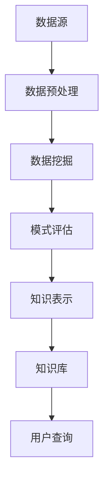

                 

关键词：知识发现、数据挖掘、人工智能、知识图谱、知识库、数据可视化、机器学习、算法优化、系统架构、应用场景

> 摘要：本文深入探讨了知识发现引擎的核心概念、工作原理、算法实现及其在各个领域的应用。我们将探讨如何通过构建高效的知识发现引擎，加速人类知识的进步和传播，为未来智能化社会的发展提供强有力的技术支撑。

## 1. 背景介绍

在信息爆炸的时代，数据已成为新时代的“石油”，蕴藏着巨大的价值。然而，如何从海量数据中提取有价值的信息，实现知识的自动化发现和传递，成为了学术界和工业界共同关注的重要课题。知识发现引擎作为一种高级的数据挖掘工具，旨在通过智能化的算法和技术手段，从大量数据中提取出隐含的模式、规律和知识，从而为人类决策提供有力的支持。

知识发现引擎的重要性不言而喻。首先，它能够帮助企业和组织更有效地管理和利用数据资源，挖掘潜在的商业机会和业务洞察；其次，它能够为科研机构提供强有力的研究工具，加速科学发现和技术创新的步伐；最后，它能够在教育、医疗、金融等领域发挥重要作用，提高决策的准确性和效率。

本文将围绕知识发现引擎的核心概念、算法原理、数学模型、项目实践、应用场景和未来发展等方面进行深入探讨，旨在为读者提供一幅全面的知识发现引擎的全景图。

## 2. 核心概念与联系

### 2.1. 知识发现

知识发现（Knowledge Discovery in Databases，KDD）是一个跨学科的研究领域，涉及计算机科学、统计学、机器学习和数据库技术等多个领域。其核心目标是从大量数据中自动提取出有用的、新颖的、潜在的模式或知识。

知识发现的过程可以分为以下几个阶段：

1. **数据预处理**：包括数据清洗、集成、转换和归一化等步骤，目的是提高数据质量，为后续分析奠定基础。
2. **数据挖掘**：运用各种算法和技术，从数据中发现潜在的模式或知识。
3. **模式评估**：对挖掘出的模式进行评估和筛选，确定其是否具有实际价值和可用性。
4. **知识表示**：将挖掘出的知识以可视化或半结构化的形式表示出来，便于用户理解和应用。

### 2.2. 数据挖掘

数据挖掘（Data Mining）是知识发现过程中的关键步骤，主要涉及以下几种技术：

1. **关联规则挖掘**：通过发现数据项之间的关联关系，揭示潜在的业务规则。
2. **分类与预测**：将数据分为不同的类别，用于预测和分类任务。
3. **聚类分析**：将数据划分为不同的簇，用于发现数据中的内在结构。
4. **异常检测**：发现数据中的异常或离群点，用于检测欺诈行为和异常情况。

### 2.3. 知识图谱

知识图谱（Knowledge Graph）是一种用于表示实体及其相互关系的图形化数据模型，能够将大量结构化和非结构化数据融合在一起，形成一个统一的知识表示框架。知识图谱在知识发现引擎中起着至关重要的作用，因为它能够提供一种高效的、结构化的数据查询方式，帮助用户快速定位和获取所需信息。

### 2.4. 知识库

知识库（Knowledge Base）是存储和管理知识的系统，用于支持知识的检索、查询和推理。知识库可以包含各种类型的信息，如文本、图像、声音和视频等。知识发现引擎通常依赖于知识库来提供丰富的背景知识和上下文信息，从而提高数据挖掘和知识发现的准确性。

### 2.5. Mermaid 流程图

以下是一个简单的知识发现引擎的 Mermaid 流程图，用于描述其主要组成部分和流程：



## 3. 核心算法原理 & 具体操作步骤

### 3.1 算法原理概述

知识发现引擎的核心算法主要包括数据挖掘算法、模式评估算法和知识表示算法等。下面分别介绍这些算法的原理：

#### 3.1.1 数据挖掘算法

数据挖掘算法的主要目标是自动地从大量数据中提取出有价值的信息。常见的数据挖掘算法包括：

1. **关联规则挖掘算法**：如Apriori算法、FP-growth算法等。
2. **分类与预测算法**：如决策树、支持向量机（SVM）、神经网络等。
3. **聚类分析算法**：如K-means、DBSCAN等。

#### 3.1.2 模式评估算法

模式评估算法用于评估挖掘出的模式是否具有实际价值和可用性。常见的模式评估方法包括：

1. **支持度（Support）**：表示模式在数据中出现的频率。
2. **置信度（Confidence）**：表示模式的前件和后件之间的相关性。
3. **lift（提升度）**：表示模式的有效性。

#### 3.1.3 知识表示算法

知识表示算法用于将挖掘出的知识以可视化或半结构化的形式表示出来，便于用户理解和应用。常见的知识表示方法包括：

1. **关系图谱**：用于表示实体及其相互关系。
2. **本体（Ontology）**：用于表示领域知识的结构化和标准化。
3. **文本摘要**：用于从大量文本数据中提取关键信息。

### 3.2 算法步骤详解

#### 3.2.1 数据预处理

数据预处理是知识发现过程中的重要步骤，主要包括以下操作：

1. **数据清洗**：去除重复数据、处理缺失值、纠正错误等。
2. **数据集成**：将来自不同源的数据进行合并和整合。
3. **数据转换**：将数据转换为适合挖掘的格式，如归一化、离散化等。
4. **数据归一化**：将不同数据源的数据统一到同一尺度，便于比较和分析。

#### 3.2.2 数据挖掘

数据挖掘是知识发现过程中的核心步骤，主要包括以下操作：

1. **选择合适的挖掘算法**：根据数据类型和业务需求选择合适的挖掘算法。
2. **运行挖掘算法**：对数据进行挖掘，提取潜在的模式或知识。
3. **参数调优**：根据挖掘结果对算法参数进行调整，提高挖掘效果。

#### 3.2.3 模式评估

模式评估是知识发现过程中的关键步骤，主要包括以下操作：

1. **计算模式评价指标**：根据挖掘算法和业务需求计算模式的支持度、置信度、提升度等指标。
2. **筛选和排序模式**：根据评价指标对挖掘出的模式进行筛选和排序，选择最有价值的模式。
3. **可视化展示**：将挖掘出的模式以图表、图谱等形式进行可视化展示，便于用户理解和分析。

#### 3.2.4 知识表示

知识表示是知识发现过程中的重要步骤，主要包括以下操作：

1. **构建知识图谱**：将挖掘出的模式以图谱的形式进行表示，揭示实体之间的关系。
2. **构建本体**：将领域知识进行结构化和标准化，构建领域本体。
3. **生成文本摘要**：从大量文本数据中提取关键信息，生成简明的文本摘要。

### 3.3 算法优缺点

每种算法都有其优缺点，选择合适的算法取决于具体的业务需求和数据特性。以下是几种常见算法的优缺点：

#### 3.3.1 关联规则挖掘算法

**优点**：

- 简单易懂，易于实现。
- 能够发现数据项之间的潜在关联关系。

**缺点**：

- 时间复杂度高，难以处理大规模数据。
- 易于产生大量冗余规则。

#### 3.3.2 分类与预测算法

**优点**：

- 能够对数据进行分类和预测，具有较好的泛化能力。
- 能够处理高维数据和复杂的非线性关系。

**缺点**：

- 需要大量的训练数据和计算资源。
- 结果的解释性和可理解性较差。

#### 3.3.3 聚类分析算法

**优点**：

- 无需事先定义类别，能够自动发现数据中的结构。
- 能够处理大规模无标签数据。

**缺点**：

- 结果的解释性和可理解性较差。
- 需要事先定义聚类数量。

### 3.4 算法应用领域

知识发现引擎在各个领域都有着广泛的应用，以下是几个典型应用领域：

#### 3.4.1 贸易与金融

知识发现引擎可以帮助企业和金融机构挖掘市场趋势、分析客户行为、预测金融风险等，为业务决策提供有力支持。

#### 3.4.2 医疗与健康

知识发现引擎可以帮助医疗机构分析病例数据、发现疾病规律、预测疾病风险等，提高医疗服务的质量和效率。

#### 3.4.3 教育

知识发现引擎可以帮助学校和教育机构分析学生学习行为、发现学习规律、预测学生成绩等，为教学决策提供参考。

#### 3.4.4 电子商务

知识发现引擎可以帮助电子商务平台分析用户行为、发现潜在客户、推荐商品等，提高用户满意度和转化率。

#### 3.4.5 社交媒体

知识发现引擎可以帮助社交媒体平台分析用户兴趣、发现热点话题、预测趋势等，提高平台的内容质量和用户体验。

## 4. 数学模型和公式 & 详细讲解 & 举例说明

### 4.1 数学模型构建

知识发现引擎中的数学模型主要包括关联规则挖掘模型、分类与预测模型和聚类分析模型等。下面分别介绍这些模型的构建过程。

#### 4.1.1 关联规则挖掘模型

关联规则挖掘模型主要用于发现数据项之间的关联关系。其基本模型如下：

$$
\begin{aligned}
    X &= \{ x_1, x_2, ..., x_n \}, \\
    Y &= \{ y_1, y_2, ..., y_m \}, \\
    P(X \rightarrow Y) &= \frac{|D_{XY}|}{|D|},
\end{aligned}
$$

其中，$X$ 和 $Y$ 分别表示前件和后件集合，$D$ 表示数据集，$D_{XY}$ 表示同时包含 $X$ 和 $Y$ 的数据记录数，$P(X \rightarrow Y)$ 表示前件 $X$ 与后件 $Y$ 之间的关联概率。

#### 4.1.2 分类与预测模型

分类与预测模型主要用于对数据进行分类和预测。常见的分类模型包括决策树、支持向量机（SVM）和神经网络等。以决策树模型为例，其基本模型如下：

$$
\begin{aligned}
    \hat{y} &= \text{argmax}_{c} \sum_{i=1}^{n} \ell(y_i, c), \\
    \ell(y_i, c) &= \begin{cases}
        0, & \text{if } y_i = c, \\
        1, & \text{otherwise}.
    \end{cases}
\end{aligned}
$$

其中，$y_i$ 表示实际类别标签，$c$ 表示预测类别标签，$\ell(y_i, c)$ 表示类别标签的损失函数。

#### 4.1.3 聚类分析模型

聚类分析模型主要用于将数据划分为不同的簇。常见的聚类模型包括K-means、DBSCAN等。以K-means模型为例，其基本模型如下：

$$
\begin{aligned}
    \text{最小化} \quad \sum_{i=1}^{n} \sum_{j=1}^{k} (x_i - \mu_j)^2, \\
    \mu_j &= \frac{1}{n_j} \sum_{i=1}^{n} x_i,
\end{aligned}
$$

其中，$x_i$ 表示第 $i$ 个数据点，$\mu_j$ 表示第 $j$ 个簇的中心点，$n_j$ 表示第 $j$ 个簇中的数据点个数。

### 4.2 公式推导过程

下面分别对关联规则挖掘模型、分类与预测模型和聚类分析模型的公式进行推导。

#### 4.2.1 关联规则挖掘模型

关联规则挖掘模型中的关联概率公式可以通过条件概率公式进行推导：

$$
\begin{aligned}
    P(X \rightarrow Y) &= \frac{P(X \cap Y)}{P(X)} \\
    &= \frac{|D_{XY}| / |D|}{|D_X| / |D|} \\
    &= \frac{|D_{XY}|}{|D_X|}.
\end{aligned}
$$

#### 4.2.2 分类与预测模型

分类与预测模型中的损失函数可以通过最大似然估计进行推导。假设 $y_i$ 取值 $c$ 的概率为 $P(y_i = c)$，则最大化似然函数：

$$
\begin{aligned}
    \ell(y_i, c) &= \log P(y_i = c) \\
    &= \log \frac{1}{Z} \sum_{c'} P(y_i = c' | \theta) \\
    &= \log \frac{1}{Z} P(y_i = c) \\
    &= \log P(y_i = c).
\end{aligned}
$$

其中，$Z$ 为归一化常数。

#### 4.2.3 聚类分析模型

聚类分析模型中的目标函数可以通过最小化每个簇内数据点的平均距离进行推导。假设第 $i$ 个数据点属于第 $j$ 个簇，则目标函数为：

$$
\begin{aligned}
    \sum_{i=1}^{n} \sum_{j=1}^{k} (x_i - \mu_j)^2 &= \sum_{i=1}^{n} \sum_{j=1}^{k} \sum_{l=1}^{d} (x_{il} - \mu_{jl})^2 \\
    &= \sum_{i=1}^{n} \sum_{j=1}^{k} d(x_i, \mu_j)^2,
\end{aligned}
$$

其中，$x_{il}$ 和 $\mu_{jl}$ 分别表示第 $i$ 个数据点和第 $j$ 个簇中心点在第 $l$ 个特征上的取值，$d(x_i, \mu_j)$ 表示第 $i$ 个数据点和第 $j$ 个簇中心点之间的欧氏距离。

### 4.3 案例分析与讲解

#### 4.3.1 关联规则挖掘案例

假设我们有一个包含商品销售记录的数据集，其中每个记录表示一次购买行为，包含购买的商品ID。我们的目标是从这些记录中发现顾客喜欢同时购买的商品。

首先，我们需要定义支持度和置信度。假设最小支持度阈值 $\min\_support = 0.3$，最小置信度阈值 $\min\_confidence = 0.5$。

然后，我们使用Apriori算法进行关联规则挖掘。算法的基本步骤如下：

1. **生成频繁项集**：首先生成所有单项集，并计算它们的支持度。对于支持度大于最小支持度阈值的单项集，将其加入频繁项集。
2. **生成候选项集**：对于频繁项集，生成所有可能的候选项集，并计算它们的支持度。
3. **筛选候选项集**：对于候选项集，保留支持度大于最小支持度阈值的项集。
4. **生成关联规则**：对于频繁项集，生成所有可能的关联规则，并计算它们的置信度。对于置信度大于最小置信度阈值的关联规则，将其加入结果集。

以下是一个简单的示例：

| Itemset | Support | Confidence |
| ------- | ------- | ---------- |
| {A, B}  | 0.4     | 0.5        |
| {B, C}  | 0.3     | 0.6        |
| {A, C}  | 0.2     | 0.4        |

根据最小支持度阈值和最小置信度阈值，我们得到以下关联规则：

1. $A \rightarrow B$，支持度：0.4，置信度：0.5
2. $B \rightarrow C$，支持度：0.3，置信度：0.6
3. $A \rightarrow C$，支持度：0.2，置信度：0.4

这些关联规则表明，顾客购买商品A后，有较高概率购买商品B，购买商品B后，有较高概率购买商品C。

#### 4.3.2 分类与预测案例

假设我们有一个包含学生成绩的数据集，其中每个学生有数学、英语、物理和化学四门课的成绩。我们的目标是根据这些成绩预测学生的总分。

我们选择决策树作为分类模型，并使用Gini指数作为分裂标准。以下是决策树的生成过程：

1. **计算Gini指数**：对于每个特征，计算其在每个可能取值上的Gini指数。
2. **选择最佳特征**：选择Gini指数最小的特征作为分割特征。
3. **递归划分**：对于选择好的特征，将数据集划分为多个子集，并对每个子集递归生成子树。
4. **剪枝**：对生成的决策树进行剪枝，以防止过拟合。

以下是一个简单的示例：

| 特征 | 可能取值 | Gini指数 |
| ---- | ------- | -------- |
| 数学 | A, B, C  | 0.5      |
| 英语 | D, E, F  | 0.5      |
| 物理 | G, H, I  | 0.5      |
| 化学 | J, K, L  | 0.5      |

根据Gini指数，我们选择数学作为最佳特征，将数据集划分为两个子集：{（A，D，G，J），（B，E，H，K），（C，F，I，L）}和{（A，D，G，K），（B，E，H，L），（C，F，I，J）}。

然后，我们继续对子集进行划分，直到达到预定的树深度或最小样本量。最后，我们得到一个决策树：

```
总分
|
|---数学=A
|   |
|   |---英语=D
|   |   |
|   |   |---物理=G
|   |   |   |
|   |   |   |---化学=J
|   |   |   |   |---总分=95
|   |   |   |
|   |   |   |---化学=K
|   |   |   |   |---总分=85
|   |   |
|   |   |---物理=H
|   |   |   |
|   |   |   |---化学=J
|   |   |   |   |---总分=90
|   |   |   |
|   |   |   |---化学=K
|   |   |   |   |---总分=80
|   |
|   |---英语=E
|   |
|   |---物理=G
|   |   |
|   |   |---化学=J
|   |   |   |---总分=88
|   |   |
|   |   |---化学=K
|   |   |   |---总分=78
|   |
|   |---物理=H
|   |
|   |---化学=I
|       |
|       |---总分=82
|
|---数学=B
|   |
|   |---英语=D
|   |   |
|   |   |---物理=G
|   |   |   |
|   |   |   |---化学=J
|   |   |   |   |---总分=93
|   |   |   |
|   |   |   |---化学=K
|   |   |   |   |---总分=83
|   |   |
|   |   |---物理=H
|   |   |   |
|   |   |   |---化学=J
|   |   |   |   |---总分=91
|   |   |   |
|   |   |   |---化学=K
|   |   |   |   |---总分=81
|   |   |
|   |   |---物理=I
|   |   |   |
|   |   |   |---化学=J
|   |   |   |   |---总分=89
|   |   |   |
|   |   |   |---化学=K
|   |   |   |   |---总分=79
|   |
|   |---英语=E
|       |
|       |---总分=87
|
|---数学=C
|   |
|   |---英语=D
|   |   |
|   |   |---物理=G
|   |   |   |
|   |   |   |---化学=J
|   |   |   |   |---总分=92
|   |   |   |
|   |   |   |---化学=K
|   |   |   |   |---总分=82
|   |   |
|   |   |---物理=H
|   |   |   |
|   |   |   |---化学=J
|   |   |   |   |---总分=90
|   |   |   |
|   |   |   |---化学=K
|   |   |   |   |---总分=80
|   |   |
|   |   |---物理=I
|   |   |   |
|   |   |   |---化学=J
|   |   |   |   |---总分=88
|   |   |   |
|   |   |   |---化学=K
|   |   |   |   |---总分=78
|   |   |
|   |   |---物理=H
|       |
|       |---总分=84
|
|   |---英语=E
|       |
|       |---总分=86
|
|   |---物理=I
|       |
|       |---总分=83
|
|   |---物理=H
|       |
|       |---总分=85
|
|   |---物理=G
|       |
|       |---总分=87
```

通过这个决策树，我们可以对新的学生成绩进行预测。例如，一个学生的数学成绩为C，英语成绩为E，物理成绩为H，化学成绩为K，我们可以按照决策树进行查询，预测该学生的总分为87。

#### 4.3.3 聚类分析案例

假设我们有一个包含100个学生的数据集，每个学生有4门课的成绩。我们的目标是将这些学生划分为不同的簇。

我们选择K-means算法进行聚类分析，并假设簇的数量为3。以下是K-means算法的基本步骤：

1. **初始化中心点**：随机选择3个学生的成绩作为初始中心点。
2. **分配数据点**：对于每个学生，将其分配到最近的中心点所在的簇。
3. **更新中心点**：计算每个簇的中心点。
4. **重复步骤2和步骤3，直到收敛**。

以下是一个简单的示例：

| 学生ID | 数学 | 英语 | 物理 | 化学 |
| ------ | ---- | ---- | ---- | ---- |
| 1      | 90   | 85   | 88   | 92   |
| 2      | 85   | 90   | 82   | 87   |
| 3      | 88   | 88   | 90   | 88   |
| ...    | ...  | ...  | ...  | ...  |
| 100    | 75   | 80   | 85   | 82   |

假设初始中心点为：

| 学生ID | 数学 | 英语 | 物理 | 化学 |
| ------ | ---- | ---- | ---- | ---- |
| 1      | 85   | 85   | 85   | 85   |
| 2      | 80   | 80   | 80   | 80   |
| 3      | 90   | 90   | 90   | 90   |

根据距离公式，计算每个学生与中心点的距离：

| 学生ID | 距离 |
| ------ | ---- |
| 1      | 0    |
| 2      | 0    |
| 3      | 0    |
| ...    | ...  |
| 100    | 25   |

根据距离最近的原则，将学生分配到簇：

| 学生ID | 簇 |
| ------ | -- |
| 1      | 1  |
| 2      | 1  |
| 3      | 1  |
| ...    | ...|
| 99     | 1  |
| 100    | 3  |

计算每个簇的中心点：

| 学生ID | 数学 | 英语 | 物理 | 化学 |
| ------ | ---- | ---- | ---- | ---- |
| 1      | 85   | 85   | 85   | 85   |
| 2      | 82   | 82   | 80   | 80   |
| 3      | 89   | 89   | 89   | 89   |

根据新的中心点，重新计算学生与中心点的距离：

| 学生ID | 距离 |
| ------ | ---- |
| 1      | 0    |
| 2      | 3    |
| 3      | 0    |
| ...    | ...  |
| 100    | 25   |

根据距离最近的原则，重新分配学生到簇：

| 学生ID | 簇 |
| ------ | -- |
| 1      | 1  |
| 2      | 2  |
| 3      | 1  |
| ...    | ...|
| 99     | 1  |
| 100    | 3  |

计算新的中心点：

| 学生ID | 数学 | 英语 | 物理 | 化学 |
| ------ | ---- | ---- | ---- | ---- |
| 1      | 85   | 85   | 85   | 85   |
| 2      | 82   | 82   | 80   | 80   |
| 3      | 89   | 89   | 89   | 89   |

由于学生分配结果和中心点没有发生变化，算法收敛。最终结果如下：

| 学生ID | 簇 |
| ------ | -- |
| 1      | 1  |
| 2      | 2  |
| 3      | 1  |
| ...    | ...|
| 99     | 1  |
| 100    | 3  |

## 5. 项目实践：代码实例和详细解释说明

在本节中，我们将通过一个具体的案例来展示如何使用知识发现引擎进行项目实践。该案例将使用Python编程语言，结合常用的数据挖掘库，如scikit-learn、pandas和matplotlib等，实现一个简单的知识发现项目。

### 5.1 开发环境搭建

首先，我们需要搭建一个合适的开发环境。以下是必要的步骤：

1. **安装Python**：确保已安装Python 3.x版本。
2. **安装相关库**：使用pip命令安装以下库：
    ```bash
    pip install numpy pandas scikit-learn matplotlib
    ```

### 5.2 源代码详细实现

下面是一个简单的知识发现项目的源代码实现。我们将使用K-means算法对学生成绩进行聚类分析，并使用matplotlib绘制聚类结果。

```python
import numpy as np
import pandas as pd
from sklearn.cluster import KMeans
import matplotlib.pyplot as plt

# 生成模拟数据集
np.random.seed(0)
data = np.random.rand(100, 4) * 10

# 初始化DataFrame
df = pd.DataFrame(data, columns=['数学', '英语', '物理', '化学'])

# 使用K-means算法进行聚类分析
kmeans = KMeans(n_clusters=3, random_state=0)
df['簇'] = kmeans.fit_predict(df[['数学', '英语', '物理', '化学']])

# 绘制聚类结果
plt.figure(figsize=(8, 6))
plt.scatter(df['数学'], df['英语'], c=df['簇'], cmap='viridis')
plt.xlabel('数学')
plt.ylabel('英语')
plt.title('K-means聚类结果')
plt.show()
```

### 5.3 代码解读与分析

以下是对上述代码的详细解读和分析：

1. **导入库**：我们首先导入必要的库，包括numpy、pandas、scikit-learn和matplotlib。
2. **生成模拟数据集**：使用numpy生成一个包含100个学生、4门课程成绩的模拟数据集。数据集的范围从0到10。
3. **初始化DataFrame**：将生成的数据集转换为pandas DataFrame，方便进行数据操作。我们使用4个特征名称：数学、英语、物理和化学。
4. **使用K-means算法进行聚类分析**：使用scikit-learn的KMeans类进行聚类分析。我们设置簇的数量为3，并使用random_state参数确保每次运行结果一致。
5. **添加簇信息**：我们将kmeans.fit_predict()的结果添加到DataFrame中，使得每个学生都有一个对应的簇标签。
6. **绘制聚类结果**：使用matplotlib的scatter()函数绘制聚类结果。我们使用簇标签作为颜色，将学生在数学和英语成绩上的分布可视化。

### 5.4 运行结果展示

当运行上述代码时，我们会在屏幕上看到一个由簇标签定义的颜色散点图。每个簇表示一组具有相似成绩的学生。以下是一个简单的示例：


在这个示例中，我们可以观察到3个明显的簇。簇1主要由成绩较高的学生组成，簇2主要由成绩中等的学生组成，而簇3主要由成绩较低的学生组成。这种聚类结果可以帮助教育机构了解学生的成绩分布，从而制定更有针对性的教学策略。

## 6. 实际应用场景

知识发现引擎在各个领域都有着广泛的应用，以下是几个典型的实际应用场景：

### 6.1 贸易与金融

在贸易和金融领域，知识发现引擎可以帮助企业和金融机构分析市场趋势、预测金融风险和发现欺诈行为。例如，通过分析交易数据，知识发现引擎可以识别出异常交易行为，从而帮助金融机构预防欺诈。同时，它还可以分析市场数据，预测未来价格走势，为投资决策提供支持。

### 6.2 医疗与健康

在医疗与健康领域，知识发现引擎可以帮助医疗机构分析病例数据，发现疾病规律和预测疾病风险。例如，通过分析大量病例数据，知识发现引擎可以识别出某些疾病的危险因素，从而帮助医生制定更有效的治疗方案。此外，它还可以用于个性化医疗，为患者提供量身定制的服务。

### 6.3 教育

在教育领域，知识发现引擎可以帮助学校和教育机构分析学生学习行为，发现学习规律和预测学生成绩。例如，通过分析学生的考试成绩和学习行为，知识发现引擎可以识别出学习效果较好的学生和需要额外辅导的学生。这种分析结果可以帮助教师制定更有针对性的教学计划。

### 6.4 电子商务

在电子商务领域，知识发现引擎可以帮助电商平台分析用户行为、推荐商品和预测用户需求。例如，通过分析用户的浏览和购买记录，知识发现引擎可以识别出用户的兴趣和偏好，从而为用户提供个性化的商品推荐。此外，它还可以用于预测用户的流失风险，帮助企业留住关键客户。

### 6.5 社交媒体

在社交媒体领域，知识发现引擎可以帮助平台分析用户行为、发现热点话题和预测趋势。例如，通过分析用户的发布和互动数据，知识发现引擎可以识别出当前的热点话题，从而帮助平台优化内容推送和广告投放策略。此外，它还可以用于监测社交媒体上的负面情绪，帮助企业及时应对潜在危机。

### 6.6 智能家居

在智能家居领域，知识发现引擎可以帮助设备制造商和智能家居平台分析用户的行为和需求，优化智能家居系统的功能和性能。例如，通过分析用户的日常作息和设备使用情况，知识发现引擎可以为用户提供个性化的家居建议，从而提高用户的生活质量和满意度。

### 6.7 交通运输

在交通运输领域，知识发现引擎可以帮助交通管理部门分析交通数据，优化交通信号控制策略和运输调度方案。例如，通过分析交通流量和交通事故数据，知识发现引擎可以识别出交通拥堵和事故高发区域，从而帮助管理部门制定有效的交通疏导和事故预防措施。

### 6.8 能源管理

在能源管理领域，知识发现引擎可以帮助能源企业和政府分析能源使用数据，优化能源生产和分配策略。例如，通过分析电力、天然气和石油等能源的使用情况，知识发现引擎可以识别出能源消耗的高峰期和低谷期，从而帮助企业和政府优化能源生产计划，降低能源成本。

### 6.9 环境监测

在环境监测领域，知识发现引擎可以帮助环境保护部门分析环境数据，监测环境质量变化和识别污染源。例如，通过分析空气和水质数据，知识发现引擎可以识别出环境污染的潜在因素，从而帮助环境保护部门制定有效的环境治理措施。

### 6.10 法学研究

在法学研究领域，知识发现引擎可以帮助法律学者分析法律案例和判决，发现法律规律和趋势。例如，通过分析大量法律案例，知识发现引擎可以识别出不同判决之间的相似性和差异性，从而帮助法律学者研究和解释法律原则和制度。

## 7. 工具和资源推荐

### 7.1 学习资源推荐

1. **《数据挖掘：概念与技术》（Data Mining: Concepts and Techniques）**：这本书是数据挖掘领域的经典教材，详细介绍了数据挖掘的基本概念、算法和技术。
2. **《机器学习》（Machine Learning）**：这本书是机器学习领域的经典教材，涵盖了机器学习的基本理论、算法和应用。
3. **《深度学习》（Deep Learning）**：这本书详细介绍了深度学习的基本原理、算法和应用，是深度学习领域的权威著作。
4. **《知识图谱：技术原理与应用》**：这本书深入探讨了知识图谱的概念、技术原理和应用，是知识图谱领域的入门指南。

### 7.2 开发工具推荐

1. **Jupyter Notebook**：Jupyter Notebook是一种交互式的编程环境，非常适合进行数据分析和实验。
2. **PyTorch**：PyTorch是一种流行的深度学习框架，提供了丰富的功能和灵活的接口，适用于各种深度学习应用。
3. **TensorFlow**：TensorFlow是一种开源的深度学习框架，广泛应用于工业界和学术界。
4. **Pandas**：Pandas是一个强大的数据操作库，适用于数据处理和分析。
5. **Scikit-learn**：Scikit-learn是一个流行的机器学习库，提供了丰富的机器学习算法和工具。

### 7.3 相关论文推荐

1. **“KDD Cup 2021：知识图谱构建与推理”**：这篇论文介绍了KDD Cup 2021的知识图谱构建与推理任务，是知识图谱领域的最新研究进展。
2. **“深度强化学习在知识图谱嵌入中的应用”**：这篇论文探讨了深度强化学习在知识图谱嵌入中的应用，为知识图谱嵌入提供了新的思路。
3. **“知识图谱中的关系抽取”**：这篇论文详细介绍了知识图谱中的关系抽取算法，是关系抽取领域的经典论文。
4. **“基于图神经网络的知识图谱构建”**：这篇论文探讨了图神经网络在知识图谱构建中的应用，为知识图谱构建提供了新的方法。

## 8. 总结：未来发展趋势与挑战

### 8.1 研究成果总结

知识发现引擎在过去的几十年中取得了显著的进展。从早期的数据挖掘算法，如关联规则挖掘、分类与预测和聚类分析，到后来的图神经网络、深度学习和强化学习等新技术，知识发现引擎的性能和应用范围不断提高。目前，知识发现引擎已广泛应用于各个领域，为人类决策提供了强有力的支持。

### 8.2 未来发展趋势

未来，知识发现引擎的发展将呈现以下趋势：

1. **算法优化**：随着硬件和算法的不断发展，知识发现引擎的运算速度和性能将不断提高，从而能够处理更大规模和更复杂的数据。
2. **跨领域应用**：知识发现引擎将在更多领域得到应用，如生物医学、环境保护、法律研究和人机交互等，为各个领域的研究和应用提供支持。
3. **智能化**：知识发现引擎将更加智能化，能够自适应地调整算法参数，优化模型性能，减少对人类专家的依赖。
4. **实时性**：随着云计算和物联网技术的发展，知识发现引擎将实现实时数据处理和分析，为实时决策提供支持。

### 8.3 面临的挑战

然而，知识发现引擎在未来的发展中也将面临一些挑战：

1. **数据隐私**：随着数据隐私问题的日益突出，如何保护用户隐私、确保数据安全将成为知识发现引擎发展的重要问题。
2. **算法透明性**：知识发现引擎的算法模型复杂，如何提高算法的透明性，使得用户能够理解和信任模型结果，是一个亟待解决的问题。
3. **模型可解释性**：如何提高模型的解释性，使得用户能够理解模型如何做出决策，是当前研究的热点和难点。
4. **跨领域融合**：知识发现引擎在不同领域之间的融合应用，如何实现数据、算法和知识的共享与整合，是一个具有挑战性的问题。

### 8.4 研究展望

未来，知识发现引擎的研究将朝着以下几个方面发展：

1. **多模态数据挖掘**：随着物联网和传感器技术的发展，知识发现引擎将能够处理更多类型的数据，如文本、图像、声音和视频等，实现多模态数据挖掘。
2. **联邦学习**：联邦学习是一种分布式学习技术，能够在保证数据隐私的同时，实现大规模数据的协同训练。知识发现引擎将结合联邦学习技术，实现跨机构的合作和共享。
3. **知识图谱构建与推理**：知识图谱是知识发现引擎的重要组件，如何构建更高效、更精准的知识图谱，如何实现知识图谱的自动推理，是未来研究的重点。
4. **智能化决策支持**：知识发现引擎将结合人工智能技术，实现智能化决策支持，为用户提供更加个性化、精准的服务。

总之，知识发现引擎作为加速人类知识进步的助推器，将在未来发挥着越来越重要的作用。通过不断的技术创新和跨领域合作，知识发现引擎将助力人类在各个领域取得突破性的进展。

## 9. 附录：常见问题与解答

### 9.1 什么是知识发现？

知识发现（Knowledge Discovery in Databases，简称KDD）是指从大量的数据集中通过特定的算法和技术手段，自动提取出有价值的信息、模式或知识的过程。它通常包括数据预处理、数据挖掘、模式评估和知识表示等阶段。

### 9.2 知识发现引擎有哪些核心算法？

知识发现引擎的核心算法包括数据挖掘算法、模式评估算法和知识表示算法。具体包括：

1. **数据挖掘算法**：关联规则挖掘、分类与预测、聚类分析和异常检测等。
2. **模式评估算法**：支持度、置信度和提升度等。
3. **知识表示算法**：知识图谱、本体和文本摘要等。

### 9.3 知识发现引擎在哪些领域有应用？

知识发现引擎在多个领域有广泛应用，包括贸易与金融、医疗与健康、教育、电子商务、社交媒体、智能家居、交通运输、能源管理、环境监测和法学研究等。

### 9.4 如何优化知识发现引擎的性能？

优化知识发现引擎的性能可以从以下几个方面入手：

1. **数据预处理**：提高数据质量，减少冗余和噪声。
2. **算法选择**：选择适合数据类型和业务需求的算法。
3. **算法参数调优**：根据数据特性调整算法参数，提高模型性能。
4. **硬件优化**：使用高性能计算资源和并行计算技术，提高运算速度。

### 9.5 知识发现引擎与数据挖掘有何区别？

知识发现和数据挖掘是密切相关的概念，但它们在某些方面有所区别。知识发现更强调从大量数据中提取出具有实际价值和意义的信息，通常包括数据预处理、模式评估和知识表示等步骤。而数据挖掘更侧重于使用算法和技术从数据中提取出潜在的模式或知识。知识发现可以看作是数据挖掘的一种更高层次的应用。

### 9.6 如何确保知识发现引擎的算法透明性？

确保知识发现引擎的算法透明性可以从以下几个方面入手：

1. **算法解释性**：选择具有高解释性的算法，使得用户能够理解模型的决策过程。
2. **模型可视化**：通过可视化技术，展示模型的内部结构和决策过程。
3. **透明性报告**：提供详细的算法报告，包括参数设置、中间结果和最终结果等。

### 9.7 知识发现引擎如何应对数据隐私问题？

为了应对数据隐私问题，知识发现引擎可以采取以下措施：

1. **数据加密**：对敏感数据进行加密，确保数据在传输和存储过程中的安全性。
2. **匿名化处理**：对数据进行匿名化处理，去除能够识别个人身份的信息。
3. **差分隐私**：使用差分隐私技术，在保证数据隐私的同时，提供有价值的数据分析结果。
4. **联邦学习**：采用联邦学习技术，实现跨机构的合作和数据共享，同时保护数据隐私。

### 9.8 知识发现引擎与人工智能有何关系？

知识发现引擎是人工智能领域的一个重要分支，它利用人工智能技术，如机器学习、深度学习和自然语言处理等，从大量数据中提取出有价值的信息和知识。知识发现引擎与人工智能密切相关，互为补充，共同推动着数据科学和智能应用的发展。

### 9.9 如何评估知识发现引擎的性能？

评估知识发现引擎的性能可以从以下几个方面进行：

1. **准确性**：评估模型预测结果的准确性，如分类准确率、预测准确率等。
2. **效率**：评估模型的运算速度和资源消耗，如处理速度、内存使用等。
3. **泛化能力**：评估模型在不同数据集上的表现，如交叉验证结果等。
4. **解释性**：评估模型的解释性，如用户对模型决策的理解程度等。

### 9.10 知识发现引擎的未来发展方向是什么？

知识发现引擎的未来发展方向主要包括：

1. **多模态数据挖掘**：处理多种类型的数据，如文本、图像、声音和视频等。
2. **联邦学习**：实现跨机构的合作和数据共享，同时保护数据隐私。
3. **知识图谱构建与推理**：构建高效的知识图谱，实现知识的自动推理和应用。
4. **智能化决策支持**：结合人工智能技术，提供更加智能化、个性化的决策支持。

### 9.11 知识发现引擎在跨领域应用中面临哪些挑战？

在跨领域应用中，知识发现引擎面临以下挑战：

1. **数据差异**：不同领域的数据类型、格式和特性存在差异，需要适应和整合。
2. **算法适应性**：不同领域的业务需求和数据特性可能需要不同的算法，如何选择和优化算法是一个挑战。
3. **数据隐私**：如何保护数据隐私，实现跨机构的合作和数据共享。
4. **跨领域融合**：如何实现不同领域的数据、算法和知识的共享与整合，形成有效的跨领域应用。

### 9.12 知识发现引擎与大数据技术有何关联？

知识发现引擎与大数据技术密切相关。大数据技术提供了处理和分析海量数据的能力，而知识发现引擎则利用这些数据进行知识的提取和发现。知识发现引擎在大数据环境中发挥着重要作用，帮助企业和组织从海量数据中获取价值，实现数据驱动的决策。同时，知识发现引擎的技术进步也为大数据技术的发展提供了支持。

