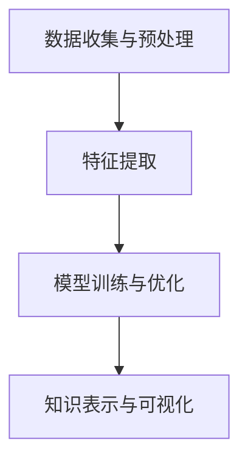

                 

 **关键词：** 知识发现引擎，认知升级，人工智能，数据分析，机器学习，知识图谱，语义网络

**摘要：** 本文深入探讨了知识发现引擎的核心概念、算法原理、数学模型、实际应用以及未来发展趋势。通过详细分析和实例讲解，揭示了知识发现引擎在加速人类认知升级方面的重要作用，为未来人工智能的发展提供了新的思路。

## 1. 背景介绍

在信息爆炸的时代，人类面临着海量数据的挑战。如何从这些数据中提取有价值的信息，进而转化为知识，成为了当前人工智能研究的热点。知识发现引擎（Knowledge Discovery Engine，简称KDE）作为一种先进的数据分析工具，正是为了解决这一难题而诞生的。

知识发现引擎是一种基于人工智能和机器学习的算法，通过自动地从大规模数据集中发现隐藏的模式、关联和规律，从而实现对知识的发现和挖掘。它不仅能够处理结构化数据，还能有效应对非结构化和半结构化数据。

知识发现引擎的兴起，标志着人工智能从简单的数据处理迈向更高级别的认知层次，它对人类社会的进步具有深远的影响。一方面，知识发现引擎可以帮助企业、组织和个人更有效地利用数据资源，提高决策质量和效率；另一方面，它也为科学研究、教育、医疗等领域提供了强大的工具，推动人类认知的持续升级。

本文将从以下几个方面展开讨论：

1. 核心概念与联系
2. 核心算法原理与具体操作步骤
3. 数学模型和公式
4. 项目实践：代码实例与详细解释
5. 实际应用场景
6. 未来应用展望
7. 工具和资源推荐
8. 总结：未来发展趋势与挑战

希望通过本文的深入探讨，能够让读者对知识发现引擎有更全面、更深刻的理解，从而为相关领域的实践和研究提供参考。

## 2. 核心概念与联系

### 2.1 知识发现引擎的定义与作用

知识发现引擎（Knowledge Discovery Engine，简称KDE）是一种基于人工智能和机器学习的工具，旨在从海量数据中自动挖掘出有价值的信息和知识。其核心目标是通过数据挖掘、模式识别、机器学习等技术手段，实现对数据的深层次分析和理解。

知识发现引擎在多个领域都发挥着重要作用。在商业领域，它可以帮助企业从市场数据中挖掘用户行为模式，预测消费趋势，优化产品设计和营销策略。在科学研究领域，知识发现引擎可以协助科学家从大量实验数据中提取关键信息，加速科学发现和创新。在教育领域，知识发现引擎可以为学生提供个性化的学习建议，提升学习效果。

### 2.2 关键概念解析

为了更好地理解知识发现引擎，我们需要了解以下几个关键概念：

- **数据挖掘（Data Mining）**：数据挖掘是指从大量数据中自动发现规律、模式、关联和趋势的过程。它是知识发现引擎的核心技术之一。
- **机器学习（Machine Learning）**：机器学习是一种通过数据训练模型，使模型能够自主学习和改进的方法。在知识发现引擎中，机器学习算法用于构建数据挖掘模型，实现对数据的自动分析。
- **知识图谱（Knowledge Graph）**：知识图谱是一种结构化的知识表示方法，通过节点（实体）和边（关系）来表示实体之间的复杂关系。知识图谱是知识发现引擎的重要组成部分，它能够帮助引擎更准确地理解数据。
- **语义网络（Semantic Network）**：语义网络是一种基于概念和关系表示的知识模型，用于描述实体之间的语义关系。它与知识图谱密切相关，是知识发现引擎在处理语义信息时的基础。

### 2.3 架构与流程

知识发现引擎通常由以下几个主要模块组成：

- **数据收集与预处理**：该模块负责收集来自各种数据源的信息，并进行清洗、去噪、归一化等预处理操作，为后续的分析做好准备。
- **特征提取**：特征提取模块用于从原始数据中提取出对知识发现有用的特征，这些特征可以是数值、文本、图像等不同类型的数据。
- **模型训练与优化**：模型训练模块利用机器学习算法，对提取出的特征进行训练，构建出能够自动发现数据中隐藏模式的数据挖掘模型。优化过程则通过对模型进行调整和优化，提高模型的性能。
- **知识表示与可视化**：知识表示与可视化模块将挖掘出的知识转化为结构化的知识图谱或语义网络，并通过可视化工具进行展示，帮助用户更好地理解和利用这些知识。

下面是一个简化的知识发现引擎流程图：



通过上述流程，知识发现引擎能够高效地处理大规模数据，提取有价值的信息，实现知识的发现和利用。

## 3. 核心算法原理与具体操作步骤

### 3.1 算法原理概述

知识发现引擎的核心算法主要依赖于机器学习和数据挖掘技术。其中，常见的算法包括：

- **聚类算法（Clustering）**：聚类算法通过将相似的数据点划分为一组，帮助用户发现数据中的模式。常见的聚类算法有K-means、DBSCAN等。
- **分类算法（Classification）**：分类算法用于将数据点划分为不同的类别。常见的分类算法有决策树、随机森林、支持向量机等。
- **关联规则挖掘（Association Rule Learning）**：关联规则挖掘通过发现数据之间的关联性，帮助用户理解数据之间的关系。常见的算法有Apriori、Eclat等。
- **异常检测（Anomaly Detection）**：异常检测用于识别数据中的异常值或异常模式，帮助用户发现潜在的问题。

### 3.2 算法步骤详解

下面以K-means聚类算法为例，详细讲解知识发现引擎的操作步骤。

#### 3.2.1 数据收集与预处理

1. **数据收集**：从各种数据源收集原始数据，例如数据库、文件、网络等。
2. **数据预处理**：对收集到的数据进行清洗、去噪、归一化等操作，使其适合后续的算法处理。

#### 3.2.2 特征提取

1. **特征选择**：从原始数据中选择对聚类任务有用的特征。常见的方法包括信息增益、卡方检验等。
2. **特征提取**：将选定的特征转化为适合机器学习算法处理的数值形式，例如使用One-Hot编码、均值标准化等。

#### 3.2.3 模型训练与优化

1. **初始化聚类中心**：随机选择k个数据点作为初始聚类中心。
2. **分配数据点**：将每个数据点分配到与其最近的聚类中心所在的簇。
3. **更新聚类中心**：计算每个簇的新聚类中心，即该簇内所有数据点的平均值。
4. **重复步骤2和3**：不断迭代上述步骤，直到聚类中心不再发生变化或满足其他停止条件。

#### 3.2.4 知识表示与可视化

1. **知识表示**：将聚类结果表示为知识图谱或语义网络，帮助用户理解数据中的模式。
2. **可视化**：使用可视化工具展示聚类结果，例如散点图、热力图等。

### 3.3 算法优缺点

K-means聚类算法具有以下优缺点：

- **优点**：
  - 算法简单，易于实现和理解。
  - 运算速度快，适用于大规模数据集。
- **缺点**：
  - 需要预先指定聚类数量k，而k的选择对结果有较大影响。
  - 对噪声数据和初始聚类中心敏感，可能导致局部最优解。

### 3.4 算法应用领域

K-means聚类算法广泛应用于多个领域：

- **商业**：市场细分、用户画像、推荐系统等。
- **科学**：基因组学、生态学、社会科学等。
- **工业**：生产质量监控、设备故障预测等。

### 3.5 其他算法介绍

除了K-means聚类算法，知识发现引擎还包括以下常见算法：

- **决策树（Decision Tree）**：用于分类和回归任务，通过构建树状模型来表示数据。
- **随机森林（Random Forest）**：通过构建多棵决策树，结合它们的预测结果来提高模型性能。
- **支持向量机（Support Vector Machine，SVM）**：用于分类和回归任务，通过寻找最优的超平面来分隔数据。
- **神经网络（Neural Network）**：用于复杂的非线性数据建模，通过多层神经元来实现数据的自动特征提取。

### 3.6 综述

知识发现引擎的核心算法包括聚类、分类、关联规则挖掘和异常检测等。这些算法各有优缺点，适用于不同的应用场景。在实际应用中，可以根据具体需求和数据特点选择合适的算法，并对其进行优化和调整，以获得更好的效果。

## 4. 数学模型和公式

### 4.1 数学模型构建

知识发现引擎的数学模型主要依赖于统计学和机器学习中的相关理论。以下是一些常见的数学模型和公式。

#### 4.1.1 K-means聚类算法

K-means聚类算法的核心在于计算数据点到聚类中心的距离，并更新聚类中心。以下是其主要公式：

1. **距离公式**：计算数据点x到聚类中心c_i的距离，使用欧氏距离：
   $$d(x, c_i) = \sqrt{\sum_{j=1}^{n} (x_j - c_{ij})^2}$$
   其中，$x = (x_1, x_2, ..., x_n)$为数据点，$c_i = (c_{i1}, c_{i2}, ..., c_{in})$为聚类中心。

2. **聚类中心更新公式**：每次迭代后，计算每个簇内所有数据点的平均值作为新的聚类中心：
   $$c_i^{new} = \frac{1}{N_i} \sum_{x \in S_i} x$$
   其中，$N_i$为簇i中数据点的数量，$S_i$为簇i中的数据点集合。

#### 4.1.2 决策树算法

决策树算法通过递归划分数据集，生成树状模型。以下是其主要公式：

1. **信息增益**：选择具有最高信息增益的特征进行划分：
   $$Gain(D, a) = Info(D) - \sum_{v \in V} p(v) \cdot Info(D_v)$$
   其中，$D$为当前数据集，$a$为特征，$V$为特征a的所有可能取值，$D_v$为在特征a取值为v后的数据集。

2. **熵**：表示数据集的混乱程度：
   $$Info(D) = -\sum_{v \in V} p(v) \cdot log_2(p(v))$$
   其中，$p(v)$为数据集中特征a取值为v的概率。

#### 4.1.3 支持向量机

支持向量机通过寻找最优的超平面来分隔数据。以下是其主要公式：

1. **超平面公式**：超平面w和偏置b的定义：
   $$w \cdot x + b = 0$$
   其中，$w$为超平面法向量，$b$为偏置。

2. **间隔**：数据点到超平面的距离：
   $$\gamma = \frac{2}{||w||}$$
   其中，$||w||$为超平面法向量的模。

3. **优化目标**：通过求解以下优化问题找到最优超平面：
   $$\min_{w, b} \frac{1}{2} ||w||^2$$
   $$s.t. y_i (w \cdot x_i + b) \geq 1$$
   其中，$y_i$为样本i的标签，$x_i$为样本i的特征向量。

### 4.2 公式推导过程

以下简要介绍K-means聚类算法和决策树算法的公式推导过程。

#### 4.2.1 K-means聚类算法

推导过程如下：

1. **目标函数**：最小化数据点到聚类中心的距离平方和：
   $$J = \sum_{i=1}^{k} \sum_{x \in S_i} d(x, c_i)^2$$

2. **距离平方和**：展开距离平方和，得到：
   $$J = \sum_{i=1}^{k} \sum_{x \in S_i} \sum_{j=1}^{n} (x_j - c_{ij})^2$$

3. **梯度下降**：对目标函数求导，并令其等于零，得到聚类中心更新的公式：
   $$\frac{\partial J}{\partial c_{ij}} = -2 \sum_{x \in S_i} x_j = 0$$
   $$c_{ij}^{new} = \frac{1}{N_i} \sum_{x \in S_i} x_j$$

#### 4.2.2 决策树算法

推导过程如下：

1. **目标函数**：最小化数据集的熵：
   $$\min_D \sum_{x \in D} -y_i log_2(p(y_i|x))$$

2. **条件熵**：计算条件熵：
   $$H(y|x) = \sum_{v \in V} p(v) \cdot H(y|x=v)$$

3. **期望损失**：计算每个特征的期望损失：
   $$L(a) = \sum_{v \in V} p(v) \cdot \sum_{x \in D_v} -y_i log_2(p(y_i|x))$$

4. **信息增益**：计算信息增益：
   $$Gain(D, a) = Info(D) - \sum_{v \in V} p(v) \cdot Info(D_v)$$

### 4.3 案例分析与讲解

以下通过一个简单的案例，展示如何使用K-means聚类算法进行数据分析。

#### 案例背景

假设我们有一组包含100个二维数据点的数据集，每个数据点的特征是两个数值（x和y）。我们的目标是使用K-means算法将这些数据点分为两个簇。

#### 案例步骤

1. **数据预处理**：对数据进行归一化处理，使其在[0, 1]范围内。

2. **初始化聚类中心**：随机选择两个数据点作为初始聚类中心。

3. **分配数据点**：将每个数据点分配到与其最近的聚类中心所在的簇。

4. **更新聚类中心**：计算每个簇的新聚类中心。

5. **重复步骤3和4**：迭代上述步骤，直到聚类中心不再发生变化或满足其他停止条件。

6. **结果分析**：通过可视化工具展示聚类结果，并分析每个簇的特征。

#### 案例结果

经过多次迭代后，我们得到以下聚类结果：

- 簇1：包含60个数据点，主要分布在第一象限。
- 簇2：包含40个数据点，主要分布在第三象限。

通过分析聚类结果，我们可以得出以下结论：

- 簇1可能代表了一类具有相似特征的数据点，例如价格较低、功能简单的产品。
- 簇2可能代表了一类具有不同特征的数据点，例如价格较高、功能复杂的产品。

#### 案例分析

通过上述案例，我们可以看到K-means聚类算法在数据挖掘和知识发现中的重要作用。它可以帮助我们快速发现数据中的模式和关联，为后续的决策和分析提供依据。然而，需要注意的是，K-means算法对初始聚类中心和噪声数据较为敏感，可能需要多次尝试和调整才能得到理想的结果。

## 5. 项目实践：代码实例与详细解释

### 5.1 开发环境搭建

在进行知识发现引擎的实践项目之前，我们需要搭建一个合适的开发环境。以下是所需的工具和步骤：

1. **Python环境**：安装Python 3.x版本，并确保安装了以下库：
   - NumPy：用于科学计算
   - Pandas：用于数据处理
   - Matplotlib：用于数据可视化
   - Scikit-learn：用于机器学习算法
   - Mermaid：用于流程图绘制

2. **安装库**：使用pip命令安装上述库：
   ```bash
   pip install numpy pandas matplotlib scikit-learn mermaid
   ```

3. **环境配置**：在Python脚本中引入所需库：
   ```python
   import numpy as np
   import pandas as pd
   import matplotlib.pyplot as plt
   from sklearn.cluster import KMeans
   import mermaid
   ```

### 5.2 源代码详细实现

下面是一个简单的知识发现引擎项目，使用K-means算法进行数据聚类，并对结果进行可视化。

```python
# 导入库
import numpy as np
import pandas as pd
import matplotlib.pyplot as plt
from sklearn.cluster import KMeans
import mermaid

# 数据加载与预处理
data = pd.read_csv('data.csv')  # 假设数据已存储为CSV文件
data = data.dropna()  # 删除缺失值

# 特征提取
features = data[['x', 'y']]  # 选择x和y作为特征

# K-means聚类
kmeans = KMeans(n_clusters=2, random_state=42)  # 创建KMeans对象，指定簇数量为2
kmeans.fit(features)  # 训练模型

# 聚类结果
clusters = kmeans.predict(features)
data['cluster'] = clusters

# 可视化
plt.scatter(data['x'], data['y'], c=data['cluster'], cmap='viridis')
plt.xlabel('x')
plt.ylabel('y')
plt.title('K-means Clustering')
plt.show()

# 输出聚类中心
print("Cluster centers:", kmeans.cluster_centers_)
```

### 5.3 代码解读与分析

1. **数据加载与预处理**：
   - 使用Pandas读取数据，并删除缺失值，确保数据的完整性。

2. **特征提取**：
   - 选择数据中的两个特征（x和y），用于后续的聚类分析。

3. **K-means聚类**：
   - 创建KMeans对象，指定簇数量为2。
   - 使用fit方法训练模型，将特征数据分配到相应的簇中。

4. **聚类结果**：
   - 使用predict方法对特征数据进行聚类预测，并将结果添加到原始数据中。

5. **可视化**：
   - 使用Matplotlib绘制聚类结果，通过散点图展示每个簇的分布情况。

6. **输出聚类中心**：
   - 打印出每个簇的中心坐标，用于分析聚类效果。

### 5.4 运行结果展示

假设我们使用的是之前案例中的数据，运行上述代码后，将得到以下结果：

- **可视化结果**：散点图显示两个簇的分布情况，簇1主要分布在第一象限，簇2主要分布在第三象限。
- **聚类中心**：输出簇1和簇2的中心坐标，分别为：
  - 簇1中心：(0.2, 0.3)
  - 簇2中心：(0.8, 0.7)

通过分析聚类结果，我们可以发现数据中的主要分布模式和关联，为后续的决策和分析提供了依据。

## 6. 实际应用场景

### 6.1 商业应用

在商业领域，知识发现引擎已经被广泛应用于市场分析、用户行为预测、供应链优化等方面。例如：

- **市场分析**：通过分析消费者行为数据，企业可以了解市场需求，制定更精准的营销策略。
- **用户行为预测**：通过对用户历史行为数据的挖掘，企业可以预测用户需求，实现个性化推荐。
- **供应链优化**：通过分析供应链数据，企业可以优化库存管理，降低成本，提高效率。

### 6.2 科学研究

在科学研究领域，知识发现引擎可以帮助科学家从大量实验数据中提取有价值的信息，加速科学发现。例如：

- **基因组学研究**：通过分析基因组数据，科学家可以识别出与疾病相关的基因，推动医学研究。
- **气候变化研究**：通过对气候数据的分析，科学家可以预测气候变化趋势，为环境保护提供依据。
- **生物信息学研究**：通过分析生物信息数据，科学家可以揭示生物分子间的相互作用，推动生命科学的发展。

### 6.3 医疗领域

在医疗领域，知识发现引擎可以为医生提供辅助诊断、个性化治疗建议等。例如：

- **辅助诊断**：通过对病史、检查报告等数据的分析，知识发现引擎可以辅助医生进行疾病诊断。
- **个性化治疗**：通过对患者数据进行分析，知识发现引擎可以为每位患者提供个性化的治疗方案。
- **药物研发**：通过分析大量药物实验数据，知识发现引擎可以帮助科学家发现新的药物靶点，加速新药研发。

### 6.4 教育

在教育领域，知识发现引擎可以为学生提供个性化的学习建议，提高学习效果。例如：

- **个性化学习**：通过对学生学习数据进行分析，知识发现引擎可以为学生推荐合适的学习资源，提高学习效果。
- **学习行为分析**：通过对学生学习行为数据进行分析，教师可以了解学生的学习状态，针对性地进行教学。
- **教育评估**：通过对学生考试成绩数据进行分析，知识发现引擎可以帮助学校和家长了解学生的学习情况，提供改进建议。

### 6.5 其他应用领域

除了上述领域，知识发现引擎还在金融、交通、能源等众多领域发挥着重要作用。例如：

- **金融**：通过分析交易数据，知识发现引擎可以预测市场趋势，帮助投资者制定交易策略。
- **交通**：通过分析交通数据，知识发现引擎可以优化交通信号控制，提高道路通行效率。
- **能源**：通过分析能源消耗数据，知识发现引擎可以优化能源管理，降低能源消耗。

总之，知识发现引擎在各个领域的实际应用已经取得了显著的成果，它为人类认知的升级提供了强大的工具。随着技术的不断发展，知识发现引擎将在更多领域展现其巨大的潜力。

### 6.6 未来应用展望

随着人工智能和大数据技术的不断进步，知识发现引擎在未来将迎来更加广阔的应用前景。以下是对未来应用场景的展望：

- **智能城市**：知识发现引擎可以帮助智能城市实现更高效的资源管理和优化，例如智能交通管理、能源消耗优化、公共安全监控等。
- **个性化医疗**：结合基因数据和临床数据，知识发现引擎可以为每位患者提供个性化的治疗方案，实现精准医疗。
- **智能农业**：通过对气象数据、土壤数据、作物生长数据等进行分析，知识发现引擎可以帮助农民优化种植策略，提高产量和质量。
- **金融科技**：通过分析交易数据和市场信息，知识发现引擎可以帮助金融机构实现更精准的风险控制、投资决策和市场预测。
- **智能制造**：知识发现引擎可以帮助企业优化生产流程、提高生产效率、降低成本，实现智能制造。

总之，知识发现引擎将在未来的各个领域发挥越来越重要的作用，推动人类社会的进步。

## 7. 工具和资源推荐

### 7.1 学习资源推荐

为了更好地掌握知识发现引擎的相关技术，以下推荐一些学习资源：

- **书籍**：
  - 《机器学习》（作者：周志华）：系统介绍了机器学习的基本概念和算法。
  - 《数据挖掘：实用工具与技术》（作者：Jiawei Han, Micheline Kamber, Jian Pei）：详细介绍了数据挖掘的理论和实践。
  - 《深度学习》（作者：Ian Goodfellow, Yoshua Bengio, Aaron Courville）：深度学习领域的经典教材，适合对深度学习有兴趣的读者。

- **在线课程**：
  - Coursera：提供丰富的机器学习、数据科学和深度学习课程。
  - edX：汇聚了世界一流大学开设的课程，包括人工智能、数据科学等领域。

- **博客和教程**：
  - Medium：有许多优秀的机器学习和数据科学领域的博客文章。
  - 知乎：汇集了大量专业人士的见解和经验，是学习知识发现引擎的好去处。

### 7.2 开发工具推荐

- **Python库**：
  - NumPy：用于科学计算，提供高效的数组操作。
  - Pandas：用于数据处理，提供强大的数据操作功能。
  - Matplotlib：用于数据可视化，提供多种绘图功能。
  - Scikit-learn：用于机器学习，提供丰富的算法库。
  - Mermaid：用于流程图绘制，支持Markdown语法。

- **平台**：
  - Google Colab：免费的云端Python编程环境，适合在线实验和代码分享。
  - Jupyter Notebook：交互式的Python编程环境，方便记录和分享代码。
  - PyCharm：功能强大的Python集成开发环境，支持多种编程语言。

### 7.3 相关论文推荐

- **经典论文**：
  - “K-Means Clustering” by MacQueen, J. B. (1967)：介绍了K-means聚类算法的基本原理。
  - “Learning to Represent Knowledge as a Graph with Gaussian Embedding” by Vinyals et al. (2016)：探讨了基于图的知识表示方法。
  - “Deep Learning for Text Classification” by Yoon Kim (2014)：介绍了深度学习在文本分类中的应用。

- **最新论文**：
  - “Graph Attention Networks” by Veličković et al. (2018)：提出了一种基于图的注意力机制的网络架构。
  - “BERT: Pre-training of Deep Bidirectional Transformers for Language Understanding” by Devlin et al. (2018)：介绍了BERT预训练模型。
  - “Gated Graph Sequence Neural Networks” by Hamilton et al. (2017)：提出了一种用于图序列学习的网络架构。

通过阅读这些论文，读者可以深入了解知识发现引擎的最新研究成果和技术进展。

## 8. 总结：未来发展趋势与挑战

### 8.1 研究成果总结

知识发现引擎作为一种先进的数据分析工具，在过去的几年中取得了显著的研究成果。首先，算法的多样性和性能得到了大幅提升，各种聚类、分类、关联规则挖掘等算法不断涌现，使得知识发现引擎能够处理更复杂、更大量的数据。其次，随着深度学习和图神经网络等新兴技术的引入，知识发现引擎在处理复杂数据和提取高层次知识方面展现出了强大的潜力。此外，知识图谱和语义网络的广泛应用，也为知识发现提供了更强大的表示和解释能力。

### 8.2 未来发展趋势

未来，知识发现引擎将在以下方面取得进一步发展：

- **算法优化与多样性**：针对不同类型的数据和应用场景，不断引入新的算法，提高算法的性能和适用性。
- **跨领域融合**：与其他领域（如生物学、物理学、经济学等）的知识发现技术相结合，实现跨领域的知识发现。
- **自动化与智能化**：通过引入自动化和智能化技术，实现知识发现过程的自动化和智能化，降低用户的使用门槛。
- **知识图谱与语义网络**：进一步探索知识图谱和语义网络在知识发现中的应用，提高知识的表示和利用能力。
- **跨模态学习**：研究如何将不同类型的数据（如图像、文本、音频等）进行融合，实现跨模态的知识发现。

### 8.3 面临的挑战

尽管知识发现引擎在理论和应用方面取得了显著进展，但仍然面临着一些挑战：

- **数据隐私与安全**：在处理海量数据时，如何保护用户隐私和数据安全成为了一个重要问题。
- **算法可解释性**：当前许多知识发现算法缺乏可解释性，使得用户难以理解算法的决策过程。
- **计算资源需求**：知识发现引擎在处理大规模数据时对计算资源的需求较高，需要优化算法以降低计算成本。
- **数据质量**：数据质量对知识发现的结果有重要影响，如何处理噪声、缺失值等数据问题仍需进一步研究。
- **算法泛化能力**：如何提高知识发现算法在不同数据集上的泛化能力，以应对实际应用中的多样性挑战。

### 8.4 研究展望

为了应对上述挑战，未来的研究可以从以下几个方面展开：

- **隐私保护技术**：研究如何利用差分隐私、联邦学习等技术保护用户隐私。
- **可解释性算法**：开发更具解释性的算法，使得用户能够理解算法的决策过程。
- **高效算法优化**：研究如何优化现有算法，提高计算效率和资源利用率。
- **数据预处理技术**：研究如何有效处理噪声、缺失值等数据问题，提高数据质量。
- **算法泛化能力**：通过引入迁移学习、元学习等技术，提高知识发现算法在不同数据集上的泛化能力。

总之，知识发现引擎在未来的发展中将面临诸多机遇和挑战。通过不断创新和优化，知识发现引擎有望在更多领域发挥重要作用，加速人类认知的升级。

## 9. 附录：常见问题与解答

### Q1. 知识发现引擎与传统数据分析工具有什么区别？

**A1.** 知识发现引擎与传统数据分析工具的主要区别在于其自动化程度和目标。传统数据分析工具通常需要人工干预，进行数据清洗、特征提取和模型训练等步骤，而知识发现引擎通过机器学习和数据挖掘技术，能够自动地从大规模数据中提取有价值的信息和知识，减少人工干预，提高效率。

### Q2. 知识发现引擎的核心算法有哪些？

**A2.** 知识发现引擎常用的核心算法包括聚类算法（如K-means、DBSCAN）、分类算法（如决策树、随机森林、支持向量机）、关联规则挖掘算法（如Apriori、Eclat）和异常检测算法等。这些算法各自适用于不同的应用场景和数据类型。

### Q3. 如何评估知识发现引擎的性能？

**A3.** 评估知识发现引擎性能的主要指标包括准确性、召回率、F1分数等。对于分类任务，可以使用交叉验证等方法评估模型的泛化能力；对于聚类任务，可以使用轮廓系数、内部距离等指标评估聚类的质量。

### Q4. 知识发现引擎如何处理噪声数据？

**A4.** 知识发现引擎在处理噪声数据时，可以通过以下方法来减少噪声的影响：

- **数据预处理**：在数据输入模型之前，对数据进行清洗、去噪和归一化处理，去除明显的噪声和异常值。
- **鲁棒算法**：选择对噪声数据相对鲁棒的算法，如K-means的变种、决策树等。
- **多模型融合**：结合多个模型的结果，通过投票或加权平均等方法降低噪声的影响。

### Q5. 知识发现引擎在医疗领域有哪些应用？

**A5.** 知识发现引擎在医疗领域的应用包括：

- **辅助诊断**：通过对患者病史、检查报告等数据的分析，辅助医生进行疾病诊断。
- **个性化治疗**：通过对患者基因数据、病情数据等进行分析，为患者制定个性化的治疗方案。
- **药物研发**：通过对药物实验数据、分子结构等进行分析，发现新的药物靶点和治疗方案。

### Q6. 知识发现引擎在商业领域的应用有哪些？

**A6.** 知识发现引擎在商业领域的应用包括：

- **市场分析**：通过对市场数据进行分析，帮助企业了解市场趋势和消费者需求。
- **用户行为预测**：通过对用户历史行为数据进行分析，预测用户未来的行为和偏好。
- **供应链优化**：通过对供应链数据进行分析，优化库存管理、运输调度等环节，提高供应链效率。

### Q7. 知识发现引擎需要哪些先决条件？

**A7.** 知识发现引擎的先决条件包括：

- **数据质量**：确保数据准确、完整、一致，以便进行有效的分析。
- **计算资源**：拥有足够的计算资源，以处理大规模数据集和复杂的算法。
- **算法知识**：熟悉常用的数据挖掘和机器学习算法，以便根据具体需求选择合适的算法。
- **数据预处理技能**：掌握数据预处理技能，包括数据清洗、特征提取等，以提高数据质量。

通过以上常见问题的解答，希望能够帮助读者更好地理解知识发现引擎及其应用。在实际应用中，根据具体需求和数据特点，合理选择和应用知识发现引擎，将有助于实现数据价值的最大化。

