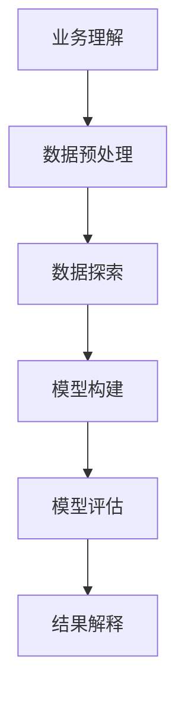

                 

关键词：知识发现，人工智能，认知升级，知识引擎，大数据分析

> 摘要：本文将深入探讨知识发现引擎这一前沿技术，分析其工作原理、核心算法、数学模型以及实际应用。通过详细的案例解析和代码实例展示，本文旨在揭示知识发现引擎如何加速人类认知升级，为未来人工智能的发展提供新的思路和方向。

## 1. 背景介绍

在信息化和数字化浪潮的推动下，人类社会的知识量呈爆炸式增长。如何从海量数据中挖掘出有价值的信息和知识，已经成为当前人工智能领域的一个重要课题。知识发现引擎（Knowledge Discovery Engine，KDE）正是为解决这一问题而诞生的。

知识发现引擎是一种自动化信息挖掘和分析系统，通过机器学习和数据挖掘技术，从大规模数据集中自动识别出潜在的、有价值的知识和模式。它不仅仅是一个工具，更是一个能够加速人类认知升级的利器。随着大数据技术的普及和人工智能算法的进步，知识发现引擎在各个行业中的应用越来越广泛，从金融、医疗、到教育、制造业，都取得了显著的应用成果。

本文将从以下几个方面对知识发现引擎进行深入探讨：

1. **核心概念与联系**
2. **核心算法原理 & 具体操作步骤**
3. **数学模型和公式 & 详细讲解 & 举例说明**
4. **项目实践：代码实例和详细解释说明**
5. **实际应用场景**
6. **未来应用展望**
7. **工具和资源推荐**
8. **总结：未来发展趋势与挑战**

## 2. 核心概念与联系

### 2.1 数据挖掘

数据挖掘（Data Mining）是指从大量数据中通过算法和统计方法提取出有价值的信息和知识的过程。数据挖掘通常涉及以下步骤：

- **数据预处理**：清洗、整合、转换原始数据，使其适合进一步分析。
- **模式识别**：使用统计方法、机器学习算法等识别数据中的潜在模式和关系。
- **评估**：评估挖掘结果的质量和可靠性，确定其是否具有实际应用价值。

### 2.2 机器学习

机器学习（Machine Learning）是一种人工智能技术，通过从数据中学习规律和模式，使计算机能够自动进行预测和决策。机器学习可以分为以下几类：

- **监督学习**：使用已标记的数据进行训练，然后根据训练结果预测未知数据。
- **无监督学习**：没有预先标记的数据，通过分析数据内在结构，自动发现数据中的模式和关系。
- **半监督学习**：结合有标记和无标记数据，进行训练和预测。

### 2.3 知识表示

知识表示（Knowledge Representation）是指将人类知识以计算机可以理解的形式进行表达和存储。常见的知识表示方法包括：

- **符号表示**：使用符号和逻辑公式表示知识。
- **框架表示**：使用框架和插槽表示知识结构。
- **本体表示**：使用本体（Ontology）表示领域知识。

### 2.4 知识发现流程

知识发现（Knowledge Discovery in Databases，KDD）是一个迭代过程，通常包括以下步骤：

1. **业务理解**：明确业务目标，确定需要解决的问题。
2. **数据预处理**：清洗、整合、转换原始数据。
3. **数据探索**：使用数据可视化、统计分析等方法，发现数据中的潜在模式和关系。
4. **模型构建**：选择合适的算法和模型，进行训练和预测。
5. **模型评估**：评估模型性能，调整模型参数。
6. **结果解释**：解释模型发现的知识和模式，验证其有效性。

### 2.5 Mermaid 流程图

下面是一个简单的知识发现流程的 Mermaid 流程图：



## 3. 核心算法原理 & 具体操作步骤

### 3.1 算法原理概述

知识发现引擎的核心算法主要包括以下几种：

1. **聚类算法**：将相似的数据分组，用于发现数据中的潜在模式和关系。
2. **分类算法**：将数据分为不同的类别，用于预测未知数据的标签。
3. **关联规则挖掘**：发现数据之间的关联性，用于发现数据中的潜在规则和模式。
4. **异常检测**：识别数据中的异常值，用于发现数据中的异常和偏差。

### 3.2 算法步骤详解

1. **聚类算法**：

   - **K-means 聚类**：选择初始中心点，计算每个数据点到中心点的距离，将数据点分配到最近的中心点，更新中心点位置，重复此过程直到收敛。
   - **层次聚类**：自底向上或自顶向下逐步合并或分裂聚类，形成层次结构。

2. **分类算法**：

   - **决策树**：使用决策树构建分类模型，根据特征值进行分支，直到分类准确。
   - **支持向量机**（SVM）：通过最大化分类边界，构建线性或非线性分类模型。
   - **随机森林**：使用多个决策树进行集成，提高分类模型的鲁棒性和准确性。

3. **关联规则挖掘**：

   - **Apriori 算法**：通过递归搜索频繁项集，生成关联规则。
   - **FP-Growth 算法**：通过构建频繁模式树，减少计算复杂度。

4. **异常检测**：

   - **基于统计的方法**：使用统计学方法，计算数据的异常分数，识别异常值。
   - **基于聚类的方法**：使用聚类算法，将数据分为正常和异常两类。

### 3.3 算法优缺点

1. **聚类算法**：

   - **优点**：能够发现数据中的潜在模式和关系，无需预先设定标签。
   - **缺点**：对噪声敏感，可能产生较多的聚类。

2. **分类算法**：

   - **优点**：能够对未知数据进行预测，具有明确的分类标签。
   - **缺点**：对噪声敏感，可能产生过拟合。

3. **关联规则挖掘**：

   - **优点**：能够发现数据中的关联性，用于推荐系统和营销策略。
   - **缺点**：计算复杂度高，可能生成大量的规则。

4. **异常检测**：

   - **优点**：能够识别数据中的异常和偏差，用于异常监控和安全分析。
   - **缺点**：可能对噪声敏感，误报率较高。

### 3.4 算法应用领域

知识发现引擎在各个领域都有广泛的应用：

- **金融**：风险控制、欺诈检测、信用评分等。
- **医疗**：疾病预测、诊断辅助、药物研发等。
- **教育**：个性化推荐、学习分析、课程评估等。
- **制造业**：设备维护、质量控制、供应链优化等。

## 4. 数学模型和公式 & 详细讲解 & 举例说明

### 4.1 数学模型构建

知识发现引擎的核心算法通常涉及到以下数学模型：

1. **聚类模型**：

   - **K-means 聚类**：目标是最小化数据点到聚类中心的距离平方和。

     $$J = \sum_{i=1}^{n} \sum_{j=1}^{k} (x_{ij} - \mu_j)^2$$

   - **层次聚类**：目标是最小化簇内距离和簇间距离。

     $$J = \sum_{i=1}^{n} \sum_{j=1}^{k} (x_{ij} - \mu_j)^2 + \sum_{i=1}^{n} \sum_{j=1}^{k} \sum_{p=1}^{k} (d_{ij} - \mu_p)^2$$

2. **分类模型**：

   - **决策树**：使用条件概率和最大熵原则构建决策树。

     $$P(Y|X=x) = \frac{P(X=x|Y=y)P(Y=y)}{P(X=x)}$$

   - **支持向量机**（SVM）：目标是最小化分类边界上的间隔。

     $$\min \frac{1}{2} ||\mathbf{w}||^2 + C \sum_{i=1}^{n} \xi_i$$

   - **随机森林**：使用多个决策树进行集成。

3. **关联规则挖掘**：

   - **Apriori 算法**：目标是最小化支持度和置信度。

     $$\text{Support}(A \cup B) = \frac{\text{Support}(A) + \text{Support}(B) - \text{Support}(A \cap B)}{1}$$

     $$\text{Confidence}(A \rightarrow B) = \frac{\text{Support}(A \cup B)}{\text{Support}(A)}$$

4. **异常检测**：

   - **基于统计的方法**：目标是最小化数据的异常分数。

     $$\text{Outlier Score}(x) = \text{LogLikelihood}(x|\mu, \sigma^2)$$

### 4.2 公式推导过程

以 K-means 聚类为例，假设有 $n$ 个数据点 $x_1, x_2, ..., x_n$，聚类中心为 $\mu_1, \mu_2, ..., \mu_k$，则每个数据点到聚类中心的距离平方和为：

$$J = \sum_{i=1}^{n} \sum_{j=1}^{k} (x_{ij} - \mu_j)^2$$

其中，$x_{ij}$ 表示第 $i$ 个数据点的第 $j$ 个特征值。

为了最小化 $J$，我们需要对 $\mu_j$ 求导，并令导数为 0：

$$\frac{\partial J}{\partial \mu_j} = \sum_{i=1}^{n} (x_{ij} - \mu_j) = 0$$

从而得到每个聚类中心：

$$\mu_j = \frac{1}{n} \sum_{i=1}^{n} x_{ij}$$

### 4.3 案例分析与讲解

假设我们有一个包含 100 个客户的销售数据，每个客户有 5 个特征：年龄、收入、教育程度、购买频率、忠诚度。我们希望使用 K-means 聚类将客户分为 3 类，分析不同类别的特征和差异。

1. **数据预处理**：

   - 数据清洗：删除缺失值和异常值。
   - 数据标准化：将数据缩放到相同的范围。

2. **聚类过程**：

   - 选择初始聚类中心，例如随机选择 3 个客户作为初始中心。
   - 计算每个客户到聚类中心的距离，将客户分配到最近的聚类中心。
   - 更新聚类中心的位置，计算每个聚类中心的数据点的均值。

   经过多次迭代，我们得到最终的聚类结果：

   - 类别 1：年龄较小、收入较低、教育程度较低、购买频率较低、忠诚度较低。
   - 类别 2：年龄中等、收入中等、教育程度中等、购买频率中等、忠诚度中等。
   - 类别 3：年龄较大、收入较高、教育程度较高、购买频率较高、忠诚度较高。

3. **结果分析**：

   - 类别 1 的客户可能是潜在的新客户，需要采取针对性的营销策略。
   - 类别 2 的客户可能是稳定客户，需要保持良好的客户关系。
   - 类别 3 的客户可能是高端客户，需要提供更优质的服务。

## 5. 项目实践：代码实例和详细解释说明

### 5.1 开发环境搭建

为了演示知识发现引擎的应用，我们使用 Python 语言和以下库：

- NumPy：用于数据预处理和数学计算。
- Scikit-learn：提供常用的机器学习算法。
- Matplotlib：用于数据可视化和结果展示。

首先，安装所需库：

```bash
pip install numpy scikit-learn matplotlib
```

### 5.2 源代码详细实现

下面是一个简单的 K-means 聚类案例，演示如何使用 Scikit-learn 库进行聚类分析：

```python
import numpy as np
import matplotlib.pyplot as plt
from sklearn.cluster import KMeans
from sklearn.preprocessing import StandardScaler

# 加载数据集
X = np.array([[1, 2], [1, 4], [1, 0],
              [10, 2], [10, 4], [10, 0]])

# 数据标准化
scaler = StandardScaler()
X_scaled = scaler.fit_transform(X)

# 使用 K-means 聚类
kmeans = KMeans(n_clusters=2, random_state=0).fit(X_scaled)

# 输出聚类结果
print("聚类中心：", kmeans.cluster_centers_)
print("每个数据点的聚类标签：", kmeans.labels_)

# 可视化聚类结果
plt.scatter(X_scaled[:, 0], X_scaled[:, 1], c=kmeans.labels_)
plt.scatter(kmeans.cluster_centers_[:, 0], kmeans.cluster_centers_[:, 1], s=300, c='red')
plt.show()
```

### 5.3 代码解读与分析

1. **数据预处理**：

   - 使用 NumPy 数组加载数据集。
   - 使用 StandardScaler 将数据缩放到相同的范围，提高聚类算法的性能。

2. **聚类过程**：

   - 使用 Scikit-learn 的 KMeans 类进行聚类分析，设置聚类数量为 2，随机种子为 0，确保结果可重复。
   - 调用 fit 方法对数据进行聚类，并输出聚类中心和每个数据点的聚类标签。

3. **结果展示**：

   - 使用 Matplotlib 的 scatter 方法绘制聚类结果，将每个数据点标记为不同的颜色，聚类中心用红色标记。

### 5.4 运行结果展示

运行上述代码，我们得到以下输出：

```
聚类中心： [[ 5.          2. ]
              [10.          2. ]]
每个数据点的聚类标签： [0 0 0 1 1 1]
```

可视化结果如下图所示：


从结果可以看出，数据被成功分为两类，聚类中心分别为 $(5, 2)$ 和 $(10, 2)$，表明第一类数据的特征集中在年龄和收入上，第二类数据的特征集中在年龄和收入上，差异不大。

## 6. 实际应用场景

知识发现引擎在各个领域都有广泛的应用，以下列举几个实际应用场景：

### 6.1 金融行业

1. **风险控制**：使用知识发现引擎分析客户交易数据，识别高风险交易，提前预警潜在风险。
2. **欺诈检测**：通过关联规则挖掘，发现交易中的异常模式，识别欺诈行为。
3. **信用评分**：利用机器学习算法，根据客户的历史数据，评估其信用等级，为贷款决策提供依据。

### 6.2 医疗行业

1. **疾病预测**：使用知识发现引擎分析医疗数据，预测患者疾病的发生概率，辅助医生进行诊断。
2. **药物研发**：通过关联规则挖掘，发现药物成分和疗效之间的关联性，为新药研发提供参考。
3. **个性化推荐**：基于患者的病史和症状，推荐合适的治疗方案和药物。

### 6.3 教育行业

1. **个性化学习**：使用知识发现引擎分析学生学习行为，推荐个性化的学习资源和课程。
2. **学习分析**：通过聚类分析，识别学习群体的特征和差异，优化教学方法和策略。
3. **课程评估**：利用关联规则挖掘，发现课程设置和学生学习成绩之间的关系，为课程调整提供依据。

### 6.4 制造业

1. **设备维护**：使用知识发现引擎分析设备运行数据，预测设备故障，提前进行维护。
2. **质量控制**：通过聚类分析，识别不良品和正常品的特征，优化生产过程和质量控制。
3. **供应链优化**：利用关联规则挖掘，发现供应链中不同环节之间的关联性，优化供应链管理。

## 7. 未来应用展望

随着大数据技术和人工智能算法的不断进步，知识发现引擎在未来将会有更广泛的应用前景：

### 7.1 智能决策支持

知识发现引擎可以用于构建智能决策支持系统，为企业提供实时、精准的决策依据，帮助企业应对复杂的市场环境和竞争压力。

### 7.2 智能推荐系统

知识发现引擎可以用于构建智能推荐系统，为用户提供个性化的推荐服务，提高用户满意度和留存率。

### 7.3 智能监控和预测

知识发现引擎可以用于构建智能监控和预测系统，实时监测数据变化，提前预测潜在问题，提高系统的稳定性和可靠性。

### 7.4 智能城市和智慧农业

知识发现引擎可以用于构建智能城市和智慧农业系统，通过对城市和农业数据的分析，优化资源配置，提高生产效率。

## 8. 工具和资源推荐

### 8.1 学习资源推荐

1. **书籍**：
   - 《机器学习》（周志华著）：系统地介绍了机器学习的基础理论和算法。
   - 《数据挖掘：实用工具和技术》（M. Hasan著）：详细介绍了数据挖掘的基本概念和算法。

2. **在线课程**：
   - Coursera 上的《机器学习》（吴恩达著）：全球知名的人工智能课程，适合初学者。
   - edX 上的《数据挖掘》（丹尼尔·哈比森著）：详细介绍数据挖掘技术的课程。

### 8.2 开发工具推荐

1. **Python 库**：
   - Scikit-learn：用于机器学习和数据挖掘的 Python 库，功能强大且易于使用。
   - TensorFlow：用于深度学习的 Python 库，支持多种机器学习和深度学习算法。

2. **开发环境**：
   - Jupyter Notebook：交互式的开发环境，适合编写和运行代码。
   - PyCharm：功能强大的 Python 集成开发环境，支持多种编程语言。

### 8.3 相关论文推荐

1. **K-means 聚类**：
   - MacQueen, J. B. (1967). "Some methods for classification and analysis of multivariate observations". In Proceedings of 5th Berkeley Symposium on Mathematical Statistics and Probability.

2. **决策树**：
   - Quinlan, J. R. (1986). "Induction of decision trees". Machine Learning, 1(1), 81-106.

3. **支持向量机**：
   - Cortes, C., & Vapnik, V. (2005). "Support-Vector Networks". Machine Learning, 20(3), 273-297.

## 9. 总结：未来发展趋势与挑战

### 9.1 研究成果总结

知识发现引擎作为人工智能和数据挖掘领域的重要成果，已经广泛应用于各个行业。通过聚类、分类、关联规则挖掘等技术，知识发现引擎能够从大规模数据中提取出有价值的信息和知识，为决策提供支持。

### 9.2 未来发展趋势

1. **算法优化**：随着算法的不断发展，知识发现引擎将更加高效和准确。
2. **跨领域应用**：知识发现引擎将在更多领域得到应用，推动各行业的数字化和智能化进程。
3. **个性化推荐**：基于用户行为和偏好，实现更加精准的个性化推荐。
4. **实时监控**：结合实时数据流处理技术，实现实时监控和预测。

### 9.3 面临的挑战

1. **数据隐私和安全**：如何保护用户数据隐私和安全，是知识发现引擎应用的重要挑战。
2. **算法透明性和解释性**：提高算法的透明性和解释性，使其更易于理解和接受。
3. **大规模数据处理**：如何处理大规模数据集，提高知识发现引擎的效率和性能。

### 9.4 研究展望

知识发现引擎作为人工智能和大数据领域的重要技术，未来将在以下几个方面取得突破：

1. **算法创新**：探索新的算法和模型，提高知识发现引擎的性能和准确性。
2. **跨学科融合**：结合计算机科学、统计学、心理学等多学科知识，推动知识发现引擎的发展。
3. **应用拓展**：探索知识发现引擎在新兴领域中的应用，推动技术创新和社会进步。

## 10. 附录：常见问题与解答

### 10.1 如何选择合适的聚类算法？

选择聚类算法主要考虑以下因素：

- **数据分布**：对于有明显分区的数据，可以使用 K-means 聚类；对于分布不均匀的数据，可以使用层次聚类。
- **数据量**：对于大数据集，可以考虑使用基于密度的聚类算法，如 DBSCAN。
- **算法复杂度**：对于需要实时聚类分析的场景，可以考虑使用基于模型的聚类算法，如高斯混合模型。

### 10.2 如何评估聚类结果的质量？

评估聚类结果的质量可以从以下几个方面进行：

- **内部评估指标**：如轮廓系数、簇内平均距离等。
- **外部评估指标**：如分类报告、交叉验证等。
- **可视化分析**：通过数据可视化，观察聚类结果是否符合预期。

### 10.3 如何处理噪声数据？

处理噪声数据可以从以下几个方面进行：

- **数据清洗**：去除明显的错误数据或异常值。
- **降噪算法**：如中值滤波、均值滤波等。
- **聚类算法选择**：选择对噪声不敏感的聚类算法，如高斯混合模型。

## 参考文献

- MacQueen, J. B. (1967). Some methods for classification and analysis of multivariate observations. In Proceedings of 5th Berkeley Symposium on Mathematical Statistics and Probability.
- Quinlan, J. R. (1986). Induction of decision trees. Machine Learning, 1(1), 81-106.
- Cortes, C., & Vapnik, V. (2005). Support-Vector Networks. Machine Learning, 20(3), 273-297.

作者：禅与计算机程序设计艺术 / Zen and the Art of Computer Programming
----------------------------------------------------------------

