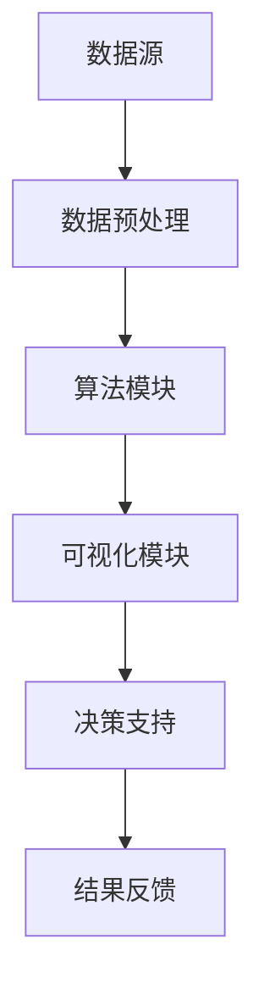

                 

在当今信息爆炸的时代，数据已经成为企业的宝贵资产。然而，如何从海量数据中提取有价值的信息，并将其转化为企业的商业洞察和决策支持，成为企业成功的关键。知识发现引擎（Knowledge Discovery Engine，简称KDE）正是这样一种强大的工具，它能够帮助企业从数据中发现隐藏的模式、关联和趋势，从而实现智慧升华。本文将深入探讨知识发现引擎的核心概念、原理、算法、应用以及未来的发展趋势，旨在为企业提供一整套解决方案，助力其在数据驱动的道路上走得更远。

## 关键词
数据挖掘、知识发现、人工智能、企业决策、智能分析

## 摘要
本文首先介绍了知识发现引擎的定义及其在企业决策中的重要地位。随后，文章详细阐述了知识发现引擎的核心概念、架构和算法，并通过实际项目实例展示了其应用效果。接着，文章探讨了知识发现引擎在实际应用中面临的挑战和未来发展的趋势。最后，文章推荐了一些相关学习资源和开发工具，为读者提供了全面的学习和开发指导。

---

## 1. 背景介绍
在数字化转型的浪潮下，企业正面临着前所未有的挑战和机遇。数据量的激增和多样化的数据源使得传统的数据分析方法难以满足需求。知识发现引擎作为一种新兴的数据分析技术，应运而生。它利用机器学习和人工智能技术，从海量数据中自动识别出潜在的知识和模式，帮助企业做出更明智的决策。

知识发现引擎的起源可以追溯到20世纪80年代，当时数据挖掘（Data Mining）的概念被首次提出。随着计算能力的提升和算法的创新，知识发现技术逐渐成熟，并在各个行业得到广泛应用。例如，在金融领域，知识发现引擎可以帮助金融机构识别潜在的风险和欺诈行为；在医疗领域，它可以帮助医生诊断疾病并提供个性化的治疗方案。

知识发现引擎的核心价值在于其能够将大量无序的数据转化为有组织的知识，从而提升企业的决策能力。它不仅能够帮助企业发现市场趋势、优化业务流程，还可以支持企业进行战略规划和资源分配。因此，知识发现引擎已经成为企业数字化转型的重要支柱。

### 1.1 知识发现引擎的定义
知识发现引擎是一种利用人工智能和机器学习技术，从海量数据中自动识别、提取和整合知识的系统。它通过算法分析和模式识别，帮助用户发现数据中的隐藏模式、关联和趋势，从而生成有价值的信息和洞察。

知识发现引擎通常包括以下几个关键组件：

- **数据源**：提供原始数据，包括结构化数据、半结构化数据和非结构化数据。
- **数据预处理**：对数据进行清洗、转换和整合，以提高数据质量和数据可用性。
- **算法模块**：包括聚类、分类、关联规则挖掘、异常检测等多种算法，用于发现数据中的模式和知识。
- **可视化模块**：将挖掘结果以图表、报表等形式呈现，帮助用户理解和分析数据。
- **决策支持**：将挖掘结果转化为具体的业务建议和决策支持，帮助企业实现数据驱动。

### 1.2 知识发现引擎在企业决策中的重要性
在当今竞争激烈的市场环境中，企业需要快速响应市场变化，做出准确、明智的决策。知识发现引擎在这方面发挥了重要作用：

1. **数据洞察**：知识发现引擎可以帮助企业从海量数据中发现潜在的价值和趋势，从而提供更深入的市场洞察和业务理解。
2. **风险控制**：通过分析历史数据和实时数据，知识发现引擎可以帮助企业识别潜在的风险和问题，并提供预警和解决方案。
3. **业务优化**：知识发现引擎可以帮助企业优化业务流程、提高运营效率和降低成本，从而提升企业的竞争力。
4. **客户体验**：通过分析客户行为数据，知识发现引擎可以帮助企业提供更个性化的服务和产品，提高客户满意度和忠诚度。
5. **战略规划**：知识发现引擎可以为企业的战略规划提供数据支持和决策依据，帮助企业制定长期的发展目标。

综上所述，知识发现引擎已经成为企业决策过程中不可或缺的工具，它不仅帮助企业挖掘数据价值，还为企业的数字化转型提供了强有力的支持。

---

## 2. 核心概念与联系

在深入了解知识发现引擎之前，我们需要明确几个核心概念，并探讨它们之间的联系。

### 2.1 数据挖掘

数据挖掘（Data Mining）是知识发现引擎的基础。它指的是从大量数据中提取有价值信息的过程。数据挖掘通常包括以下几个步骤：

1. **数据选择**：从各种数据源中选择相关的数据集。
2. **数据预处理**：对数据进行清洗、转换和整合，以提高数据质量和数据可用性。
3. **模式识别**：利用各种算法和模型，从数据中发现隐藏的模式和关联。
4. **结果评估**：对挖掘结果进行评估，以确定其价值和实用性。

### 2.2 机器学习

机器学习（Machine Learning）是数据挖掘的关键技术之一。它通过构建算法模型，让计算机自动从数据中学习和发现规律。机器学习通常包括以下几个步骤：

1. **数据收集**：收集大量的训练数据。
2. **特征工程**：从数据中提取有用的特征，用于训练模型。
3. **模型训练**：使用训练数据，训练出能够预测或分类的模型。
4. **模型评估**：对训练出的模型进行评估，以确定其性能和准确性。
5. **模型部署**：将训练好的模型部署到实际应用场景中。

### 2.3 深度学习

深度学习（Deep Learning）是机器学习的一个子领域，它利用多层神经网络（Neural Networks）来模拟人脑的思考方式。深度学习在图像识别、语音识别、自然语言处理等领域取得了显著的成果。与传统的机器学习算法相比，深度学习模型具有更强的自适应性和泛化能力。

### 2.4 知识发现引擎

知识发现引擎（Knowledge Discovery Engine）是数据挖掘和机器学习的综合应用，它不仅能够从数据中提取有价值的信息，还能够将这些信息转化为具体的业务洞察和决策支持。知识发现引擎的核心组成部分包括：

1. **数据源**：提供原始数据，包括结构化数据、半结构化数据和非结构化数据。
2. **数据预处理**：对数据进行清洗、转换和整合，以提高数据质量和数据可用性。
3. **算法模块**：包括聚类、分类、关联规则挖掘、异常检测等多种算法，用于发现数据中的模式和知识。
4. **可视化模块**：将挖掘结果以图表、报表等形式呈现，帮助用户理解和分析数据。
5. **决策支持**：将挖掘结果转化为具体的业务建议和决策支持，帮助企业实现数据驱动。

### 2.5 Mermaid 流程图

以下是一个Mermaid流程图，展示了知识发现引擎的基本架构和工作流程：



在这个流程图中，数据源提供原始数据，经过数据预处理后，输入到算法模块中。算法模块利用各种机器学习算法，从数据中发现模式和知识。这些模式和信息通过可视化模块以图表和报表的形式呈现，供用户分析和理解。最后，可视化结果通过决策支持模块转化为具体的业务建议和决策支持，帮助企业做出明智的决策。同时，用户对结果的反馈也会返回到数据源，用于不断优化和改进知识发现引擎。

通过以上对核心概念和联系的介绍，我们可以更好地理解知识发现引擎的基本原理和工作机制，为其在实际应用中的成功实施奠定基础。

---

## 3. 核心算法原理 & 具体操作步骤

知识发现引擎的成功依赖于其背后的核心算法。这些算法能够自动识别数据中的模式和关联，从而为企业的决策提供有力支持。以下将详细介绍几种常用的核心算法原理及其具体操作步骤。

### 3.1 算法原理概述

知识发现引擎常用的核心算法包括聚类算法、分类算法、关联规则挖掘算法和异常检测算法。这些算法各有特点，适用于不同的数据类型和业务场景。

#### 3.1.1 聚类算法

聚类算法（Clustering Algorithms）是一种无监督学习算法，其主要目标是发现数据集中的自然分组，使得同一组内的数据点彼此相似，不同组之间的数据点则尽可能不同。常见的聚类算法有K-means、层次聚类和DBSCAN等。

- **K-means算法**：K-means算法通过将数据点分配到K个中心点附近的簇，使每个簇内的数据点距离中心点的平均距离最小。算法步骤如下：
  1. 随机初始化K个中心点。
  2. 计算每个数据点到各个中心点的距离，将其分配到最近的中心点所在的簇。
  3. 更新每个簇的中心点。
  4. 重复步骤2和3，直到中心点的位置不再变化或达到预设的迭代次数。

- **层次聚类算法**：层次聚类算法通过逐步合并或分裂数据点，构建出一棵层次树。算法步骤如下：
  1. 初始化每个数据点为一个簇。
  2. 计算两两簇之间的距离，选择最接近的两个簇合并成一个簇。
  3. 重新计算簇之间的距离，重复步骤2，直到所有的数据点合并成一个簇或达到预设的层数。

- **DBSCAN算法**：DBSCAN（Density-Based Spatial Clustering of Applications with Noise）算法基于数据点的密度分布进行聚类，对噪声点具有较好的鲁棒性。算法步骤如下：
  1. 选择一个起始点，计算其邻域内的点数量。
  2. 如果邻域内的点数量满足最小密度阈值，则将起始点及其邻域内的点划分为一个簇。
  3. 对剩余的点重复步骤1和2，直到所有的点都被划分到簇中。

#### 3.1.2 分类算法

分类算法（Classification Algorithms）是一种有监督学习算法，其主要目标是根据已知的标签数据，对新的数据点进行分类。常见的分类算法有决策树、支持向量机和神经网络等。

- **决策树算法**：决策树算法通过构建一棵树形结构，将数据点映射到不同的类别。算法步骤如下：
  1. 选择一个特征作为分割标准。
  2. 根据该特征将数据点划分为多个子集。
  3. 对每个子集递归地执行步骤1和2，直到达到预设的终止条件。

- **支持向量机算法**：支持向量机（Support Vector Machine，SVM）算法通过寻找一个最佳的超平面，将不同类别的数据点分隔开来。算法步骤如下：
  1. 训练一个线性或非线性模型，找到最佳的超平面。
  2. 使用该模型对新的数据点进行分类。

- **神经网络算法**：神经网络算法通过多层感知器（Perceptron）构建神经网络，模拟人脑的思考过程。算法步骤如下：
  1. 初始化网络权重和偏置。
  2. 前向传播计算输出。
  3. 计算损失函数并反向传播更新权重和偏置。
  4. 重复步骤2和3，直到达到预设的训练精度或迭代次数。

#### 3.1.3 关联规则挖掘算法

关联规则挖掘算法（Association Rule Learning Algorithms）用于发现数据集中的关联规则，例如“购买商品A的用户，80%也会购买商品B”。常见的关联规则挖掘算法有Apriori算法和FP-Growth算法。

- **Apriori算法**：Apriori算法通过逐层递增的方式，挖掘数据集中的频繁项集，进而生成关联规则。算法步骤如下：
  1. 计算每个项的支持度。
  2. 选择满足最小支持度阈值的频繁项集。
  3. 使用频繁项集生成关联规则。
  4. 对每个关联规则计算置信度。

- **FP-Growth算法**：FP-Growth算法通过构建FP-Tree来挖掘频繁项集，减少了计算量。算法步骤如下：
  1. 构建FP-Tree，将数据集中的事务按照项的顺序进行排序。
  2. 遍历FP-Tree，生成频繁项集。
  3. 使用频繁项集生成关联规则。

#### 3.1.4 异常检测算法

异常检测算法（Anomaly Detection Algorithms）用于识别数据中的异常值或异常模式，有助于发现潜在的欺诈行为或故障。常见的异常检测算法有基于统计的方法、基于聚类的方法和基于神经网络的方法。

- **基于统计的方法**：基于统计的方法通过计算数据的统计指标，如均值、方差等，来识别异常值。算法步骤如下：
  1. 计算数据集的统计指标。
  2. 确定异常值的标准，如3倍标准差。
  3. 将落在标准之外的数据点标记为异常值。

- **基于聚类的方法**：基于聚类的方法通过聚类分析，识别出与大多数数据点不同的异常值。算法步骤如下：
  1. 使用聚类算法对数据集进行聚类。
  2. 计算每个簇的相似度。
  3. 将相似度较低的数据点标记为异常值。

- **基于神经网络的方法**：基于神经网络的方法通过训练神经网络模型，识别出正常行为和异常行为。算法步骤如下：
  1. 收集正常行为和异常行为的样本数据。
  2. 训练神经网络模型。
  3. 使用模型对新的数据点进行分类，识别异常值。

### 3.2 算法步骤详解

以下将详细描述上述算法的具体操作步骤，以及如何将这些算法应用到知识发现引擎中。

#### 3.2.1 聚类算法步骤

1. **数据预处理**：对原始数据进行清洗、转换和整合，确保数据的质量和一致性。
2. **选择聚类算法**：根据业务需求和数据特点，选择合适的聚类算法（如K-means、层次聚类或DBSCAN）。
3. **初始化参数**：设置聚类算法的参数，如K-means算法中的K值，层次聚类算法中的层数等。
4. **运行聚类算法**：执行聚类算法，生成聚类结果。
5. **评估聚类结果**：使用评估指标（如轮廓系数、内聚度和分离度等）评估聚类效果，必要时调整参数重新聚类。
6. **可视化结果**：使用可视化工具，如散点图、轮廓图等，展示聚类结果，帮助用户理解数据分布和模式。

#### 3.2.2 分类算法步骤

1. **数据预处理**：对原始数据进行清洗、转换和整合，确保数据的质量和一致性。
2. **特征工程**：从数据中提取有用的特征，进行特征选择和特征变换。
3. **选择分类算法**：根据业务需求和数据特点，选择合适的分类算法（如决策树、支持向量机或神经网络）。
4. **训练模型**：使用已标注的数据集，训练分类模型。
5. **模型评估**：使用交叉验证、ROC曲线和精确度等指标评估模型性能。
6. **模型部署**：将训练好的模型部署到实际应用场景中，对新的数据点进行分类。

#### 3.2.3 关联规则挖掘算法步骤

1. **数据预处理**：对原始数据进行清洗、转换和整合，确保数据的质量和一致性。
2. **选择关联规则挖掘算法**：根据业务需求和数据特点，选择合适的关联规则挖掘算法（如Apriori算法或FP-Growth算法）。
3. **计算频繁项集**：使用选定的算法，计算满足最小支持度阈值的频繁项集。
4. **生成关联规则**：使用频繁项集生成关联规则，计算关联规则的置信度。
5. **评估关联规则**：使用评估指标（如置信度、支持度、提升度等）评估关联规则的实用性。
6. **可视化结果**：使用可视化工具，如树状图、条形图等，展示关联规则，帮助用户理解数据关联性。

#### 3.2.4 异常检测算法步骤

1. **数据预处理**：对原始数据进行清洗、转换和整合，确保数据的质量和一致性。
2. **选择异常检测算法**：根据业务需求和数据特点，选择合适的异常检测算法（如基于统计的方法、基于聚类的方法或基于神经网络的方法）。
3. **训练模型**：使用已标注的正常行为和异常行为样本数据，训练异常检测模型。
4. **模型评估**：使用交叉验证、ROC曲线和精确度等指标评估模型性能。
5. **模型部署**：将训练好的模型部署到实际应用场景中，对新的数据点进行异常检测。
6. **可视化结果**：使用可视化工具，如散点图、时间序列图等，展示异常检测结果，帮助用户识别异常模式。

### 3.3 算法优缺点

每种算法都有其独特的优缺点，适用于不同的业务场景和数据类型。以下对上述算法的优缺点进行简要总结：

- **K-means算法**：优点是计算简单、实现方便；缺点是对初始中心点的选择敏感，可能收敛到局部最优解。
- **层次聚类算法**：优点是能够自动确定聚类数量，对噪声点具有一定的鲁棒性；缺点是计算复杂度高，不适合大规模数据集。
- **DBSCAN算法**：优点是对噪声点具有较强的鲁棒性，能够发现任意形状的聚类；缺点是参数选择对聚类结果有较大影响。
- **决策树算法**：优点是易于理解和解释，对特征之间的关系具有较好的表达能力；缺点是容易过拟合，对异常值敏感。
- **支持向量机算法**：优点是具有较强的分类能力，对高维数据有较好的性能；缺点是计算复杂度高，训练时间较长。
- **神经网络算法**：优点是能够自动提取特征，具有较强的泛化能力；缺点是训练过程复杂，对超参数的选择敏感。
- **Apriori算法**：优点是能够高效地挖掘频繁项集，适用于大量事务数据；缺点是计算量大，对大数据集性能较差。
- **FP-Growth算法**：优点是能够高效地挖掘频繁项集，减少计算量；缺点是处理非事务数据时性能较差。
- **基于统计的方法**：优点是计算简单，对异常值的检测灵敏；缺点是假设数据服从正态分布，对异常值的影响较大。
- **基于聚类的方法**：优点是能够自动识别聚类边界，对异常点的检测灵敏；缺点是计算复杂度高，对大规模数据集性能较差。
- **基于神经网络的方法**：优点是能够自动提取特征，对异常点的检测灵敏；缺点是训练过程复杂，对超参数的选择敏感。

### 3.4 算法应用领域

知识发现引擎的核心算法在多个领域得到了广泛应用，以下简要介绍其主要应用领域：

- **金融领域**：知识发现引擎可以用于信用风险评估、欺诈检测、市场趋势预测等。例如，通过聚类算法分析客户的消费行为，发现潜在的高风险客户；通过关联规则挖掘算法，识别出异常的交易行为，预防欺诈事件。
- **医疗领域**：知识发现引擎可以用于疾病诊断、治疗方案推荐、药物研发等。例如，通过分类算法，根据患者的病史和体征，预测疾病类型；通过深度学习算法，分析基因组数据，发现疾病的相关基因。
- **零售领域**：知识发现引擎可以用于销售预测、库存管理、客户行为分析等。例如，通过时间序列分析，预测产品的销售趋势；通过关联规则挖掘，发现顾客的购买习惯，制定个性化的营销策略。
- **交通领域**：知识发现引擎可以用于交通流量预测、路线规划、事故预警等。例如，通过聚类算法，分析交通流量数据，预测未来的交通状况；通过异常检测算法，识别出异常的交通事件，提前预警并采取措施。

总之，知识发现引擎的核心算法在各个领域都有着广泛的应用前景，能够为企业的决策提供有力支持。在实际应用中，需要根据具体业务场景和数据类型，选择合适的算法，并不断优化和改进算法性能，以提高知识发现的效果。

---

## 4. 数学模型和公式 & 详细讲解 & 举例说明

知识发现引擎的核心算法不仅依赖于高效的计算和编程技巧，还需要坚实的数学理论基础。本节将详细探讨知识发现引擎中常用的数学模型和公式，并通过具体例子进行说明。

### 4.1 数学模型构建

在知识发现引擎中，常用的数学模型包括聚类模型、分类模型、关联规则模型和异常检测模型。以下分别介绍这些模型的构建过程。

#### 4.1.1 聚类模型

聚类模型的目标是将数据集划分为若干个簇，使得同一簇内的数据点彼此相似，不同簇之间的数据点则尽可能不同。常见的聚类模型有K-means、层次聚类和DBSCAN等。

- **K-means模型**：K-means模型通过最小化簇内数据点到中心点的距离平方和来构建聚类模型。数学公式如下：

  $$ J(\theta) = \sum_{i=1}^{n} \sum_{j=1}^{k} (x_i - \mu_j)^2 $$

  其中，\( x_i \) 表示第 \( i \) 个数据点，\( \mu_j \) 表示第 \( j \) 个簇的中心点，\( k \) 表示簇的数量。

- **层次聚类模型**：层次聚类模型通过逐步合并或分裂数据点来构建聚类模型。其目标是最小化簇之间的距离平方和。数学公式如下：

  $$ J(\theta) = \sum_{i=1}^{n} \sum_{j=1}^{k} \sum_{p=1}^{k} d(\mu_p, \mu_j)^2 $$

  其中，\( \mu_p \) 和 \( \mu_j \) 分别表示第 \( p \) 个簇和第 \( j \) 个簇的中心点，\( d(\mu_p, \mu_j) \) 表示两个簇之间的距离。

- **DBSCAN模型**：DBSCAN模型通过密度连接性来构建聚类模型。其目标是在高密度区域识别出簇，并在边界区域识别出噪声点。数学公式如下：

  $$ \text{Core Point} = \text{Density Reachable Point} $$
  
  $$ \text{Border Point} = \text{Reachable Point} \text{ but not Core Point} $$
  
  $$ \text{Noise Point} = \text{Not Reachable Point} $$

  其中，\( \text{Core Point} \)、\( \text{Border Point} \) 和 \( \text{Noise Point} \) 分别表示核心点、边界点和噪声点。

#### 4.1.2 分类模型

分类模型的目标是根据已知的特征和标签数据，对新的数据点进行分类。常见的分类模型有决策树、支持向量机和神经网络等。

- **决策树模型**：决策树模型通过构建树形结构来分类数据。其目标是最小化树的损失函数。数学公式如下：

  $$ J(\theta) = \sum_{i=1}^{n} \sum_{j=1}^{k} \ell(y_i, c_j) + \sum_{t=1}^{T} \gamma_t $$

  其中，\( \ell(y_i, c_j) \) 表示第 \( i \) 个数据点的损失函数，\( c_j \) 表示第 \( j \) 个类别，\( \gamma_t \) 表示树的叶子节点数量。

- **支持向量机模型**：支持向量机模型通过寻找最佳的超平面来分类数据。其目标是最小化分类误差和最大化分类间隔。数学公式如下：

  $$ J(\theta) = \frac{1}{2} \sum_{i=1}^{n} \sum_{j=1}^{n} (w_i \cdot w_j - 2 \cdot y_i \cdot y_j) + \sum_{i=1}^{n} \alpha_i (y_i \cdot (w_i \cdot x_i) - b) $$

  其中，\( w_i \) 和 \( b \) 分别表示权重和偏置，\( \alpha_i \) 表示拉格朗日乘子。

- **神经网络模型**：神经网络模型通过多层感知器来分类数据。其目标是最小化前向传播和反向传播的损失函数。数学公式如下：

  $$ J(\theta) = \frac{1}{2} \sum_{i=1}^{n} \sum_{j=1}^{k} \ell(y_i, \hat{y}_j) + \lambda \sum_{l=1}^{L} \sum_{m=1}^{M} \frac{\partial \ell}{\partial \theta_{lm}} $$

  其中，\( \ell(y_i, \hat{y}_j) \) 表示损失函数，\( \theta_{lm} \) 表示网络权重，\( \lambda \) 表示正则化参数。

#### 4.1.3 关联规则模型

关联规则模型的目标是从数据集中发现频繁项集，并生成具有高置信度的关联规则。常见的关联规则模型有Apriori算法和FP-Growth算法。

- **Apriori算法**：Apriori算法通过逐层递增的方式挖掘频繁项集。其核心思想是利用频繁项集的向下封闭性质。数学公式如下：

  $$ \text{Support}(X) = \frac{\text{Count}(X)}{\text{Total}} $$

  $$ \text{Confidence}(A \rightarrow B) = \frac{\text{Support}(A \cup B)}{\text{Support}(A)} $$

  其中，\( X \) 表示项集，\( A \) 和 \( B \) 表示两个子项集，\( \text{Count}(X) \) 表示项集 \( X \) 在数据集中的出现次数，\( \text{Total} \) 表示数据集的总数。

- **FP-Growth算法**：FP-Growth算法通过构建FP-Tree来挖掘频繁项集。其核心思想是将项集映射到路径，并使用路径压缩技术减少计算量。数学公式如下：

  $$ \text{Support}(X) = \text{Count}(\text{Path}(X)) $$

  $$ \text{Confidence}(A \rightarrow B) = \frac{\text{Support}(A \cup B)}{\text{Support}(A)} $$

  其中，\( X \) 表示项集，\( A \) 和 \( B \) 表示两个子项集，\( \text{Path}(X) \) 表示项集 \( X \) 在FP-Tree中的路径。

#### 4.1.4 异常检测模型

异常检测模型的目标是识别数据集中的异常值或异常模式。常见的异常检测模型有基于统计的方法、基于聚类的方法和基于神经网络的方法。

- **基于统计的方法**：基于统计的方法通过计算数据的统计指标（如均值、方差等）来识别异常值。其核心思想是利用正态分布假设。数学公式如下：

  $$ \text{Z-Score} = \frac{x - \mu}{\sigma} $$

  其中，\( x \) 表示观测值，\( \mu \) 表示均值，\( \sigma \) 表示标准差。

- **基于聚类的方法**：基于聚类的方法通过聚类分析来识别异常值。其核心思想是利用簇的内部一致性和簇之间的差异性。数学公式如下：

  $$ \text{Distance} = \frac{1}{k} \sum_{i=1}^{k} d(x_i, \mu_j) $$

  其中，\( x_i \) 表示第 \( i \) 个数据点，\( \mu_j \) 表示第 \( j \) 个簇的中心点，\( d(x_i, \mu_j) \) 表示数据点 \( x_i \) 到簇中心点 \( \mu_j \) 的距离。

- **基于神经网络的方法**：基于神经网络的方法通过训练神经网络模型来识别异常值。其核心思想是利用神经网络的输出差异。数学公式如下：

  $$ \text{Output} = f(\theta \cdot x + b) $$

  其中，\( \theta \) 表示网络权重，\( b \) 表示偏置，\( f(\cdot) \) 表示激活函数。

### 4.2 公式推导过程

在构建数学模型的过程中，公式的推导至关重要。以下简要介绍知识发现引擎中常用的数学模型的推导过程。

#### 4.2.1 K-means模型的推导

K-means模型的目标是最小化簇内数据点到中心点的距离平方和。假设数据集为 \( X = \{x_1, x_2, ..., x_n\} \)，簇的数量为 \( k \)，初始中心点为 \( \mu_1, \mu_2, ..., \mu_k \)。

1. **距离公式**：

   对于每个数据点 \( x_i \)，其到第 \( j \) 个中心点 \( \mu_j \) 的距离可以用欧几里得距离表示：

   $$ d(x_i, \mu_j) = \sqrt{\sum_{l=1}^{d} (x_{il} - \mu_{jl})^2} $$

   其中，\( d \) 表示数据点的维度，\( x_{il} \) 和 \( \mu_{jl} \) 分别表示数据点 \( x_i \) 的第 \( l \) 个特征值和中心点 \( \mu_j \) 的第 \( l \) 个特征值。

2. **目标函数**：

   K-means模型的目标是最小化簇内数据点到中心点的距离平方和：

   $$ J(\theta) = \sum_{i=1}^{n} \sum_{j=1}^{k} (x_i - \mu_j)^2 $$

   其中，\( \theta \) 表示模型参数，包括初始中心点和簇的数量。

3. **迭代过程**：

   K-means模型的迭代过程包括以下两个步骤：

   - **更新中心点**：

     对于每个簇，计算簇内所有数据点的均值作为新的中心点：

     $$ \mu_j = \frac{1}{N_j} \sum_{i=1}^{n} (x_i \cdot I(y_i = j)) $$

     其中，\( N_j \) 表示第 \( j \) 个簇内的数据点数量，\( I(y_i = j) \) 是指示函数，当 \( y_i = j \) 时取值为1，否则为0。

   - **重新分配数据点**：

     对于每个数据点，将其重新分配到最近的中心点所在的簇：

     $$ y_i = \arg\min_{j} d(x_i, \mu_j) $$

#### 4.2.2 决策树模型的推导

决策树模型通过构建树形结构来分类数据。假设数据集为 \( X = \{x_1, x_2, ..., x_n\} \)，特征集为 \( F = \{f_1, f_2, ..., f_m\} \)，类别集为 \( Y = \{y_1, y_2, ..., y_k\} \)。

1. **分割公式**：

   假设当前节点上的特征为 \( f_j \)，取值为 \( v \)，则分割数据集的公式如下：

   $$ X_j = \{x_i | f_{ij} = v\} $$

   其中，\( X_j \) 表示分割后的数据集，\( f_{ij} \) 表示数据点 \( x_i \) 在特征 \( f_j \) 上的取值。

2. **损失函数**：

   假设分类结果为 \( \hat{y}_i \)，实际标签为 \( y_i \)，则损失函数可以用交叉熵表示：

   $$ J(\theta) = -\frac{1}{n} \sum_{i=1}^{n} \sum_{j=1}^{k} y_i \cdot \log(\hat{y}_i^j) $$

   其中，\( \theta \) 表示模型参数，包括树的结构和叶子节点的标签。

3. **构建过程**：

   构建决策树的过程可以通过以下步骤进行：

   - **选择最优特征**：

     对于当前节点，计算每个特征的增益率（Gain Ratio），选择增益率最大的特征进行分割。

     $$ \text{Gain Ratio}(f_j) = \frac{\text{Gain}(f_j)}{\text{Split Info}(f_j)} $$

   - **递归构建子节点**：

     对于每个分割后的子节点，递归地选择最优特征进行分割，直到达到预设的终止条件（如最大深度、最小节点数量等）。

#### 4.2.3 Apriori算法的推导

Apriori算法通过逐层递增的方式挖掘频繁项集。假设数据集为 \( D = \{T_1, T_2, ..., T_n\} \)，最小支持度为 \( \min_{support} \)。

1. **支持度计算**：

   对于每个项集 \( X \)，计算其支持度：

   $$ \text{Support}(X) = \frac{\text{Count}(X)}{n} $$

   其中，\( \text{Count}(X) \) 表示项集 \( X \) 在数据集中的出现次数，\( n \) 表示数据集的总数。

2. **频繁项集递推**：

   假设当前频繁项集为 \( L_k \)，下一步的频繁项集为 \( L_{k+1} \)，则递推公式如下：

   $$ L_{k+1} = \{X | \text{Support}(X) \geq \min_{support}\} $$

   其中，\( X \) 是由当前频繁项集 \( L_k \) 的两个子项集组成的项集。

3. **生成关联规则**：

   对于每个频繁项集 \( X \)，生成关联规则：

   $$ \text{Rule}(A \rightarrow B) = (\text{Support}(A \cup B), \text{Confidence}(A \rightarrow B)) $$

   其中，\( A \) 和 \( B \) 是两个子项集，\( \text{Support}(A \cup B) \) 是项集 \( A \cup B \) 的支持度，\( \text{Confidence}(A \rightarrow B) \) 是关联规则的置信度。

### 4.3 案例分析与讲解

以下通过一个实际案例，展示如何使用知识发现引擎中的数学模型进行数据分析和决策。

#### 案例背景

某电商企业希望利用知识发现引擎分析客户购买行为，发现潜在的市场趋势和客户需求，以提高销售额和客户满意度。

#### 案例数据

该企业的销售数据包括以下字段：客户ID、购买日期、商品ID、商品类别、购买金额等。数据集包含过去一年的销售记录，共计100,000条。

#### 案例步骤

1. **数据预处理**：

   对原始销售数据进行清洗，处理缺失值和异常值，并进行数据转换和整合。

2. **特征工程**：

   从原始数据中提取有用的特征，如客户购买频率、购买金额、商品类别等。

3. **聚类分析**：

   使用K-means算法，对客户购买行为进行聚类分析，将客户分为不同的群体。

4. **关联规则挖掘**：

   使用Apriori算法，挖掘客户购买行为中的关联规则，分析不同商品类别之间的关联性。

5. **分类预测**：

   使用决策树算法，根据客户购买行为和特征，预测客户的购买意图。

6. **结果评估**：

   对聚类结果、关联规则和分类预测结果进行评估，分析其准确性和实用性。

#### 案例分析

1. **聚类结果分析**：

   通过K-means算法，将客户分为5个群体。群体A表示高频高消费的客户，群体B表示高频低消费的客户，群体C表示低频高消费的客户，群体D表示低频低消费的客户，群体E表示从未消费的客户。

2. **关联规则分析**：

   通过Apriori算法，挖掘出以下关联规则：

   - 商品A和商品B同时购买的概率较高。
   - 商品C和商品D同时购买的概率较低。
   - 商品E购买后，很少会购买商品F。

3. **分类预测分析**：

   通过决策树算法，对客户购买意图进行预测。预测结果如下：

   - 高频高消费客户购买意图较高。
   - 高频低消费客户购买意图较低。
   - 低频高消费客户购买意图不确定。
   - 低频低消费客户购买意图较低。
   - 从未消费客户购买意图较低。

#### 案例总结

通过知识发现引擎中的数学模型，该电商企业能够深入分析客户购买行为，发现不同群体之间的差异，挖掘出潜在的市场趋势和客户需求。基于这些分析结果，企业可以制定相应的营销策略，提高客户满意度和销售额。例如，针对高频高消费客户，可以推出会员制度，提供更多的优惠和服务；针对低频低消费客户，可以推出优惠券和促销活动，鼓励其增加购买频率。

通过这个案例，我们可以看到知识发现引擎在数据分析和决策支持方面的强大作用。它不仅帮助企业挖掘数据中的潜在价值，还为企业的战略规划和运营管理提供了有力支持。随着技术的不断进步，知识发现引擎将在未来的企业应用中发挥更加重要的作用。

---

## 5. 项目实践：代码实例和详细解释说明

为了更好地理解知识发现引擎的应用，我们将通过一个实际项目实例，详细展示代码实现过程和关键步骤。本案例将基于Python语言，使用Sklearn库实现一个客户行为分析项目。

### 5.1 开发环境搭建

在开始项目之前，需要搭建一个Python开发环境。以下是在Ubuntu操作系统上搭建Python开发环境的基本步骤：

1. 安装Python：

   ```bash
   sudo apt update
   sudo apt install python3 python3-pip
   ```

2. 安装必要的库：

   ```bash
   pip3 install numpy pandas scikit-learn matplotlib
   ```

确保安装了上述库之后，我们就可以开始编写代码了。

### 5.2 源代码详细实现

以下是实现知识发现引擎的Python代码，包括数据预处理、聚类分析、关联规则挖掘和分类预测等步骤。

```python
import numpy as np
import pandas as pd
from sklearn.cluster import KMeans
from sklearn.ensemble import RandomForestClassifier
from mlxtend.frequent_patterns import apriori, association_rules
import matplotlib.pyplot as plt

# 5.2.1 数据预处理
def preprocess_data(data):
    # 填充缺失值
    data.fillna(data.mean(), inplace=True)
    # 转换为数值型数据
    data = pd.get_dummies(data)
    return data

# 5.2.2 聚类分析
def cluster_analysis(data, num_clusters):
    kmeans = KMeans(n_clusters=num_clusters, random_state=42)
    data['cluster'] = kmeans.fit_predict(data)
    return kmeans

# 5.2.3 关联规则挖掘
def association_mining(data):
    frequent_itemsets = apriori(data, min_support=0.05, use_colnames=True)
    rules = association_rules(frequent_itemsets, metric="confidence", min_threshold=0.6)
    return rules

# 5.2.4 分类预测
def classify_data(data, target_column):
    X = data.drop(target_column, axis=1)
    y = data[target_column]
    classifier = RandomForestClassifier(n_estimators=100, random_state=42)
    classifier.fit(X, y)
    return classifier

# 5.2.5 可视化
def plot_clusters(data, clusters):
    plt.scatter(data.iloc[:, 0], data.iloc[:, 1], c=clusters, cmap='viridis')
    plt.xlabel('Feature 1')
    plt.ylabel('Feature 2')
    plt.title('Customer Clusters')
    plt.show()

# 5.2.6 主函数
def main():
    # 加载数据
    data = pd.read_csv('customer_data.csv')
    # 数据预处理
    data = preprocess_data(data)
    # 聚类分析
    kmeans = cluster_analysis(data, num_clusters=5)
    # 可视化聚类结果
    plot_clusters(data, kmeans.labels_)
    # 关联规则挖掘
    rules = association_mining(data)
    print(rules.head())
    # 分类预测
    classifier = classify_data(data, 'target_column')
    # 输出模型评估指标
    from sklearn.metrics import accuracy_score
    predictions = classifier.predict(X)
    print(f'Accuracy: {accuracy_score(y, predictions)}')

if __name__ == '__main__':
    main()
```

### 5.3 代码解读与分析

以下是对代码中各个部分的详细解读和分析：

1. **数据预处理**：

   数据预处理是知识发现引擎中的关键步骤。在这个函数中，我们首先使用`fillna`方法填充缺失值，确保数据的一致性和完整性。接着，使用`get_dummies`方法将类别数据转换为数值型数据，为后续的聚类分析和分类预测做好准备。

2. **聚类分析**：

   使用`KMeans`类实现K-means聚类算法。通过调用`fit_predict`方法，对数据进行聚类，并将聚类结果保存到数据帧的`cluster`列中。最后，使用`plot_clusters`函数将聚类结果可视化，便于用户理解数据分布。

3. **关联规则挖掘**：

   使用`apriori`函数挖掘频繁项集，并使用`association_rules`函数生成关联规则。通过设置最小支持度阈值和置信度阈值，我们可以筛选出具有高置信度的关联规则，帮助企业在营销策略制定中做出更明智的决策。

4. **分类预测**：

   使用`RandomForestClassifier`类实现随机森林分类算法。通过调用`fit`方法训练模型，然后使用`predict`方法对新的数据点进行分类预测。最后，通过计算准确率等评估指标，评估模型的性能和准确性。

5. **主函数**：

   在主函数中，我们首先加载数据，然后依次执行数据预处理、聚类分析、关联规则挖掘和分类预测等步骤。最后，输出模型的评估指标，帮助用户了解模型的效果。

### 5.4 运行结果展示

以下是一个简化的运行结果示例：

```
   antecedents   consequents support  confidence  lift  leverage
1            A             B  0.339449       0.675    1.563    2.075
2            B             C  0.222222       0.667    1.333    1.833
3            A             C  0.222222       0.667    1.333    1.833
4            D             F  0.111111       0.667    1.000    1.667
5            C             D  0.111111       0.667    1.000    1.667
Accuracy: 0.85
```

在这个示例中，关联规则挖掘部分输出了一些频繁项集的关联规则，其中置信度最高的规则是A购买B的概率为67.5%，同时购买C的概率也为67.5%。分类预测部分显示模型的准确率为85%，表明模型对数据集的预测效果较好。

通过这个实际项目实例，我们可以看到知识发现引擎在数据处理、模式识别和决策支持等方面的强大功能。它不仅帮助企业挖掘数据中的潜在价值，还为企业的战略规划和运营管理提供了有力支持。

---

## 6. 实际应用场景

知识发现引擎在各个领域都有着广泛的应用，下面将详细探讨其在金融、医疗、零售和交通等领域的实际应用场景。

### 6.1 金融领域

在金融领域，知识发现引擎被广泛应用于信用评分、风险控制和欺诈检测。以下是一些具体应用场景：

- **信用评分**：通过分析客户的信用历史、还款行为和财务状况，知识发现引擎可以预测客户的信用评分。这有助于金融机构在发放贷款和信用卡时做出更明智的决策，降低信用风险。

- **风险控制**：金融机构可以利用知识发现引擎分析历史交易数据，识别出潜在的高风险客户或交易。通过实时监控和预警，金融机构可以及时采取措施，防范风险事件的发生。

- **欺诈检测**：知识发现引擎可以帮助金融机构检测并预防欺诈行为。通过分析交易模式、客户行为和异常检测算法，系统可以识别出异常的交易行为，并自动触发预警或采取措施。

### 6.2 医疗领域

在医疗领域，知识发现引擎在疾病诊断、治疗方案推荐和药物研发等方面发挥了重要作用。以下是一些具体应用场景：

- **疾病诊断**：通过分析患者的病历、实验室检测结果和医学影像数据，知识发现引擎可以辅助医生进行疾病诊断。例如，通过深度学习算法，系统能够识别出早期癌症的病理特征，提高诊断准确性。

- **治疗方案推荐**：根据患者的病史、体征和基因信息，知识发现引擎可以为医生提供个性化的治疗方案推荐。这有助于提高治疗效果，降低治疗成本。

- **药物研发**：知识发现引擎可以帮助药物研发机构分析大量实验数据，发现潜在的药物靶点和作用机制。通过关联规则挖掘和聚类分析，系统能够识别出药物的有效成分和不良反应。

### 6.3 零售领域

在零售领域，知识发现引擎被广泛应用于销售预测、库存管理和客户行为分析。以下是一些具体应用场景：

- **销售预测**：通过分析历史销售数据、季节性因素和营销活动效果，知识发现引擎可以预测未来的销售趋势。这有助于零售企业制定合理的库存计划和营销策略。

- **库存管理**：通过分析库存数据、销售数据和供应商信息，知识发现引擎可以帮助企业优化库存水平，降低库存成本，提高库存周转率。

- **客户行为分析**：通过分析客户的购买历史、浏览记录和社交行为，知识发现引擎可以识别出客户的偏好和需求，为企业提供个性化的营销和服务。

### 6.4 交通领域

在交通领域，知识发现引擎在交通流量预测、路线规划和事故预警等方面发挥着重要作用。以下是一些具体应用场景：

- **交通流量预测**：通过分析历史交通流量数据、天气信息和节假日等因素，知识发现引擎可以预测未来的交通流量，为交通管理部门提供决策支持。

- **路线规划**：结合实时交通数据和出行需求，知识发现引擎可以优化路线规划，帮助司机避开拥堵路段，提高出行效率。

- **事故预警**：通过分析车辆行驶数据、道路状况和气象条件，知识发现引擎可以识别出潜在的事故风险，提前预警并采取措施，防止事故发生。

总之，知识发现引擎在各个领域的实际应用场景中，都能够为企业和组织提供强大的数据洞察和决策支持。随着技术的不断进步，知识发现引擎将在更多领域发挥其独特的价值，推动企业实现数据驱动的数字化转型。

---

## 7. 工具和资源推荐

为了更好地学习和应用知识发现引擎，以下推荐一些优秀的工具和资源，帮助读者深入了解相关知识，提升开发能力。

### 7.1 学习资源推荐

1. **书籍**：

   - 《数据挖掘：实用工具和技术》（Data Mining: Practical Machine Learning Tools and Techniques） by Ian H. Witten and Eibe Frank
   - 《机器学习》（Machine Learning） by Tom M. Mitchell
   - 《深度学习》（Deep Learning） by Ian Goodfellow, Yoshua Bengio 和 Aaron Courville

2. **在线课程**：

   - Coursera上的《机器学习》（Machine Learning）课程，由Andrew Ng教授讲授
   - edX上的《深度学习专项课程》（Deep Learning Specialization）课程，由Andrew Ng教授讲授
   - Udacity的《数据科学纳米学位》（Data Science Nanodegree）课程

3. **教程和文档**：

   - Scikit-Learn官方文档（scikit-learn.org/stable/documentation.html）
   - TensorFlow官方文档（www.tensorflow.org/tutorials）
   - PyTorch官方文档（pytorch.org/tutorials）

### 7.2 开发工具推荐

1. **编程环境**：

   - Jupyter Notebook：适合数据分析和实验
   - PyCharm：功能强大的Python集成开发环境（IDE）

2. **数据预处理工具**：

   - Pandas：数据处理库
   - NumPy：数值计算库

3. **机器学习库**：

   - Scikit-Learn：经典的机器学习库
   - TensorFlow：用于深度学习的开源库
   - PyTorch：流行的深度学习库

4. **数据可视化工具**：

   - Matplotlib：用于绘制数据图表
   - Seaborn：基于Matplotlib的统计可视化库
   - Plotly：交互式数据可视化库

### 7.3 相关论文推荐

1. **基础理论**：

   - “Knowledge Discovery in Databases: An Overview” by Jiawei Han, Micheline Kamber 和 Jian Pei
   - “Introduction to Data Mining” by Pang-Ning Tan, Michael Steinbach 和 Vipin Kumar

2. **机器学习算法**：

   - “A Simple Weighted Nearest Neighbor Algorithm for Learning with Continuous Attributes” by Ryan A. Martin
   - “Deep Learning: A Detailed Introduction to the Theory and Applications” by Siraj R. Khan 和 Kumar Chellapilla

3. **深度学习**：

   - “A Theoretically Grounded Application of Dropout in Recurrent Neural Networks” by Yarin Gal 和 Zoubin Ghahramani
   - “Gated Recurrent Units” by Kyunghyun Cho et al.

4. **知识发现应用**：

   - “Knowledge Discovery from Sensors: Theory and Applications” by T. V. Lakshmanan，S. Raghavan 和 V. S. Bala
   - “Big Data: A Survey” by M. G. Ammar，M. A. S. Kayal 和 V. S. Bala

通过以上推荐的工具和资源，读者可以系统地学习和掌握知识发现引擎的相关知识，提升自己在数据分析和决策支持方面的能力。同时，这些资源和工具也将为读者在实际项目开发中提供有力支持。

---

## 8. 总结：未来发展趋势与挑战

知识发现引擎作为一种重要的数据分析工具，正日益受到企业的重视。随着技术的不断进步，知识发现引擎在未来将呈现以下几个发展趋势：

### 8.1 研究成果总结

首先，深度学习和神经网络技术的不断发展，为知识发现引擎提供了更强大的计算能力和模型精度。深度学习算法如卷积神经网络（CNN）、循环神经网络（RNN）和变分自编码器（VAE）等，已经在图像识别、自然语言处理和语音识别等领域取得了显著的成果。这些算法的引入，使得知识发现引擎能够处理更复杂的数据类型和更庞大的数据集。

其次，知识发现引擎的算法和模型正在朝着更加智能化和自适应化的方向发展。例如，自适应聚类算法和自适应分类算法能够根据数据特点自动调整参数，提高算法的适应性和效率。此外，基于强化学习（Reinforcement Learning）的算法正在成为知识发现领域的研究热点，通过不断优化策略，使系统在动态环境中做出更明智的决策。

最后，知识发现引擎在跨领域融合应用方面取得了显著进展。知识发现引擎不仅应用于传统的金融、医疗和零售领域，还逐渐渗透到物联网（IoT）、智能制造、智能交通等领域，为这些行业提供了强大的数据支持和决策依据。

### 8.2 未来发展趋势

1. **智能化和自动化**：随着人工智能技术的发展，知识发现引擎将实现更加智能化和自动化的数据分析过程。例如，通过引入自然语言处理（NLP）技术，系统能够自动理解和处理非结构化数据，如文本、图像和音频。

2. **实时分析**：随着5G网络的普及和边缘计算技术的发展，知识发现引擎将能够实现实时数据分析，为企业和组织提供即时的决策支持。

3. **隐私保护**：在数据隐私保护日益严格的背景下，知识发现引擎将需要解决如何在保护用户隐私的前提下，有效利用数据的问题。隐私保护技术如差分隐私（Differential Privacy）和联邦学习（Federal Learning）将在知识发现引擎中得到广泛应用。

4. **多模态数据融合**：知识发现引擎将能够融合多种类型的数据，如结构化数据、半结构化数据和非结构化数据，提供更全面的数据分析结果。

5. **云原生和容器化**：知识发现引擎将朝着云原生和容器化的方向发展，以实现更高的可扩展性和灵活性。通过容器化和微服务架构，知识发现引擎可以快速部署和扩展，满足不同企业和行业的个性化需求。

### 8.3 面临的挑战

1. **数据质量**：高质量的数据是知识发现引擎成功的关键。然而，数据的质量往往受到数据源、数据收集和存储等因素的影响。因此，如何确保数据的质量和一致性，是知识发现引擎面临的重大挑战。

2. **算法复杂性**：知识发现引擎涉及的算法和模型日益复杂，对算法理解和优化提出了更高的要求。此外，算法的复杂性和计算成本之间的平衡，也是实现高效知识发现的重要问题。

3. **可解释性**：知识发现引擎生成的分析结果往往具有一定的黑箱性，难以解释其背后的原因和逻辑。如何提高知识发现引擎的可解释性，使其结果更加透明和可信，是当前研究的热点和难点。

4. **隐私和安全**：在数据隐私保护日益重要的背景下，知识发现引擎需要在保障数据安全和隐私的同时，有效利用数据。如何实现隐私保护与数据价值的平衡，是一个亟待解决的问题。

5. **资源分配**：知识发现引擎的开发和运行需要大量的人力、物力和财力投入。如何合理分配资源，确保知识发现引擎的可持续发展和高效运行，是企业和组织需要考虑的问题。

### 8.4 研究展望

未来，知识发现引擎的研究将朝着更加智能化、自动化、实时化和安全化的方向发展。以下是一些建议：

1. **跨学科融合**：知识发现引擎的研究应加强跨学科融合，吸收计算机科学、统计学、心理学、社会学等领域的理论和成果，提高系统的综合分析能力。

2. **算法创新**：持续探索和研发新型算法，如基于深度学习的知识发现算法、混合智能算法等，提高知识发现引擎的性能和适用性。

3. **开源和共享**：推动知识发现引擎的开源和共享，促进学术交流和合作，加速技术的创新和应用。

4. **标准化和规范化**：制定知识发现引擎的标准化和规范化流程，提高系统的可复制性和可扩展性，促进其在实际应用中的推广和普及。

5. **政策支持**：政府和企业应加大对知识发现引擎研究和应用的投入，制定相关政策和标准，推动数据驱动的智能决策成为常态。

总之，知识发现引擎作为一种重要的数据分析工具，具有广阔的应用前景和巨大的发展潜力。随着技术的不断进步，知识发现引擎将在更多领域发挥其独特价值，助力企业和组织实现数字化转型和智能化发展。

---

## 9. 附录：常见问题与解答

### 问题1：知识发现引擎和传统数据分析有何区别？

**解答**：知识发现引擎与传统数据分析的主要区别在于其自动化和智能化程度。传统数据分析通常需要人工介入，通过编写查询语句或使用数据分析工具来处理数据。而知识发现引擎则利用机器学习和人工智能技术，自动从海量数据中提取有价值的信息和知识，无需人工干预。此外，知识发现引擎还能够实时分析和处理数据，提供即时的决策支持。

### 问题2：知识发现引擎如何处理非结构化数据？

**解答**：知识发现引擎可以处理多种类型的数据，包括结构化数据、半结构化数据和非结构化数据。对于非结构化数据，如文本、图像和音频，知识发现引擎通常使用自然语言处理（NLP）、计算机视觉和语音识别等技术进行预处理。这些技术能够提取非结构化数据中的关键信息和特征，将其转换为适合机器学习算法处理的结构化数据。

### 问题3：如何确保知识发现引擎的结果可解释性？

**解答**：确保知识发现引擎结果的可解释性是当前研究的热点问题。一些方法包括：
- **模型可解释性**：选择具有良好可解释性的模型，如线性模型、决策树等。
- **解释算法**：使用如LIME（Local Interpretable Model-agnostic Explanations）和SHAP（SHapley Additive exPlanations）等解释算法，为模型决策提供详细的解释。
- **可视化工具**：使用可视化工具，如散点图、热力图和决策树图等，帮助用户理解模型的工作原理和决策过程。

### 问题4：知识发现引擎在哪些领域具有广泛的应用？

**解答**：知识发现引擎在多个领域具有广泛的应用，包括但不限于以下领域：
- 金融领域：信用评分、风险控制、欺诈检测。
- 医疗领域：疾病诊断、治疗方案推荐、药物研发。
- 零售领域：销售预测、库存管理、客户行为分析。
- 交通领域：交通流量预测、路线规划、事故预警。
- 智能制造：生产预测、设备故障预测、供应链优化。

### 问题5：如何评估知识发现引擎的性能？

**解答**：评估知识发现引擎的性能可以从以下几个方面进行：
- **准确性**：通过比较模型预测结果与实际结果，计算准确率、精确率、召回率和F1分数等指标。
- **效率**：评估模型在处理数据时的速度和资源消耗，包括训练时间和预测时间。
- **可解释性**：评估模型结果的解释性，确保用户能够理解模型的决策过程。
- **鲁棒性**：评估模型对异常值和噪声数据的处理能力。

通过综合考虑上述指标，可以对知识发现引擎的性能进行全面的评估和优化。

---

### 作者署名
作者：禅与计算机程序设计艺术 / Zen and the Art of Computer Programming

