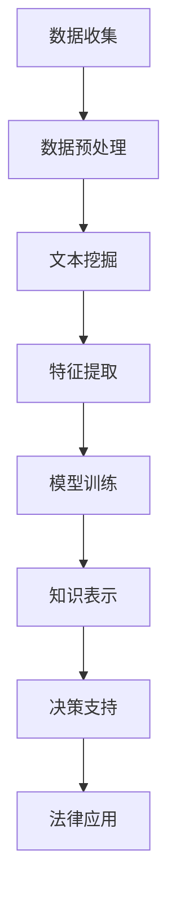

                 

关键词：知识发现、智慧司法、法律应用、人工智能、算法原理、数学模型、项目实践

> 摘要：本文深入探讨了知识发现引擎在法律领域的应用，分析了其核心概念、算法原理和数学模型，并通过实际项目案例展示了其在智慧司法中的具体实现。文章旨在为读者提供关于知识发现引擎在法律领域应用的全景图，并探讨其未来发展趋势与挑战。

## 1. 背景介绍

法律作为社会运行的重要基石，其领域内的信息量和复杂性日益增长。传统的法律工作方式主要依赖于人工处理，效率低下，且容易出错。随着人工智能技术的迅速发展，利用人工智能特别是知识发现引擎（Knowledge Discovery Engine，简称KDE）来辅助法律领域的工作，已经成为一种趋势。知识发现引擎是一种将大量非结构化数据转化为结构化知识，进而支持决策和推理的工具。在法律领域，KDE的应用可以有效提高司法效率，降低错误率，并有助于发现潜在的法律漏洞和风险。

本文将围绕知识发现引擎在法律领域的应用，探讨其核心概念、算法原理、数学模型以及实际项目实践。通过本文的阅读，读者将能够了解KDE在法律领域的具体应用场景，以及其未来的发展方向和挑战。

## 2. 核心概念与联系

### 2.1. 知识发现（Knowledge Discovery）

知识发现是指从大量数据中自动识别出有用的模式或知识的过程。它通常包括数据清洗、数据集成、数据选择、数据变换、模式识别和结果验证等步骤。在法律领域，知识发现有助于从庞大的法律文本中提取出关键信息，辅助法官和律师进行法律研究和决策。

### 2.2. 智慧司法（Smart Justice）

智慧司法是指通过应用先进的信息技术和人工智能技术，构建智能化、自动化、高效化的司法体系。智慧司法的目标是提高司法效率，保障司法公正，减少司法成本。知识发现引擎是智慧司法体系的重要组成部分，它能够提供数据支持和决策辅助。

### 2.3. 法律文本挖掘（Legal Text Mining）

法律文本挖掘是知识发现技术在法律领域的应用，旨在通过自然语言处理、文本分类、信息抽取等技术，从法律文档中提取出有用的信息。法律文本挖掘对于法律研究和法律应用具有重要意义，可以提高法律文本处理效率，支持法律智能检索和知识库构建。

### 2.4. Mermaid 流程图

以下是知识发现引擎在法律领域应用的基本流程，使用Mermaid流程图表示：



## 3. 核心算法原理 & 具体操作步骤

### 3.1. 算法原理概述

知识发现引擎在法律领域的核心算法通常包括文本挖掘、机器学习、知识图谱等技术。文本挖掘算法如TF-IDF、Word2Vec等用于处理法律文档，提取关键信息。机器学习算法如分类器、聚类算法等用于对法律案例进行分类和归纳。知识图谱技术则用于构建法律知识体系，支持法律推理和决策。

### 3.2. 算法步骤详解

1. **数据收集与预处理**：
   - **数据收集**：收集涉及法律领域的各类文本数据，包括法律条文、案例、合同等。
   - **数据预处理**：进行文本清洗，去除噪声，统一文本格式，例如去除标点符号、停用词过滤等。

2. **文本挖掘**：
   - **分词**：将文本分割成单词或短语。
   - **词性标注**：对每个单词进行词性标注，如名词、动词、形容词等。
   - **实体识别**：识别文本中的法律实体，如人名、地名、机构名等。

3. **特征提取**：
   - **TF-IDF**：计算每个词在文档中的频率，以及在整个文档集中的重要性。
   - **Word2Vec**：将单词映射到向量空间，用于文本的向量化表示。

4. **模型训练**：
   - **分类器训练**：使用已标注的法律案例数据，训练分类器模型，如朴素贝叶斯、支持向量机等。
   - **聚类算法**：对法律案例进行聚类，以发现相似案例。

5. **知识表示**：
   - **知识图谱构建**：将法律案例、法律条文等转化为图结构，构建知识图谱。
   - **推理引擎**：基于知识图谱，实现法律推理和决策支持。

### 3.3. 算法优缺点

- **优点**：
  - **高效性**：自动化处理大量法律文档，提高工作效率。
  - **准确性**：通过机器学习和知识图谱技术，提高法律分析的准确性。
  - **智能化**：支持法律智能检索和智能决策，辅助法律实践。

- **缺点**：
  - **数据质量**：依赖高质量的数据输入，否则可能导致模型性能下降。
  - **算法复杂性**：算法复杂度高，实现和维护成本较大。
  - **法律风险**：可能导致隐私泄露和法律伦理问题。

### 3.4. 算法应用领域

- **司法审判**：辅助法官进行案件分析和判决。
- **律师工作**：支持律师的法律研究、案件分析和法律文件审核。
- **法律监管**：协助政府部门进行法律监督和执法。
- **法律教育**：辅助法律教育，提供案例学习和知识传播。

## 4. 数学模型和公式 & 详细讲解 & 举例说明

### 4.1. 数学模型构建

在知识发现引擎中，常用的数学模型包括概率模型、机器学习模型和知识图谱模型。

1. **概率模型**：
   - **朴素贝叶斯**：用于法律案例分类。
   - **贝叶斯网络**：用于法律推理和决策支持。

2. **机器学习模型**：
   - **支持向量机（SVM）**：用于法律案例分类。
   - **决策树**：用于法律案例分析。

3. **知识图谱模型**：
   - **图论模型**：用于构建法律知识图谱。
   - **推理模型**：用于法律推理和决策支持。

### 4.2. 公式推导过程

1. **朴素贝叶斯分类器**：
   公式如下：
   $$P(C_k|X) = \frac{P(X|C_k)P(C_k)}{P(X)}$$
   其中，$C_k$表示法律案例类别，$X$表示法律案例特征。

2. **支持向量机（SVM）**：
   公式如下：
   $$w^* = \arg\min_{w,b}\frac{1}{2}\lVert w \rVert^2 + C\sum_{i=1}^{n}\lVert w \rVert^2$$
   其中，$w$表示权重向量，$b$表示偏置，$C$表示惩罚参数。

3. **知识图谱模型**：
   公式如下：
   $$R(A, B, C) = \frac{1}{1 + e^{-(a \cdot w + b)}}$$
   其中，$R$表示关系，$A$、$B$、$C$表示节点，$w$表示权重向量，$b$表示偏置。

### 4.3. 案例分析与讲解

假设我们有一个涉及合同纠纷的案件，通过知识发现引擎进行分析。

1. **文本挖掘**：
   - **分词**：将合同文本分割成单词或短语。
   - **词性标注**：对每个单词进行词性标注，如“合同”、“条款”、“违约”等。
   - **实体识别**：识别合同中的法律实体，如甲方、乙方、合同金额等。

2. **特征提取**：
   - **TF-IDF**：计算每个词在合同中的频率，以及在整个合同文档集中的重要性。
   - **Word2Vec**：将单词映射到向量空间，用于文本的向量化表示。

3. **模型训练**：
   - **分类器训练**：使用已标注的合同案例数据，训练分类器模型，如朴素贝叶斯、支持向量机等。
   - **聚类算法**：对合同案例进行聚类，以发现相似合同。

4. **知识表示**：
   - **知识图谱构建**：将合同案例、合同条款等转化为图结构，构建知识图谱。
   - **推理引擎**：基于知识图谱，实现合同纠纷的自动分析。

通过上述步骤，知识发现引擎可以辅助律师快速分析合同纠纷案件，提供法律建议和解决方案。

## 5. 项目实践：代码实例和详细解释说明

### 5.1. 开发环境搭建

为了实现知识发现引擎在法律领域的应用，我们需要搭建一个合适的开发环境。以下是基本步骤：

1. **安装Python环境**：
   - 安装Python 3.x版本。
   - 配置Python环境变量。

2. **安装依赖库**：
   - 使用pip安装以下库：`nltk`（自然语言处理）、`gensim`（主题模型）、`sklearn`（机器学习）、`networkx`（图论）等。

3. **配置数据集**：
   - 收集法律案例数据集，并进行预处理。

### 5.2. 源代码详细实现

以下是知识发现引擎在法律领域应用的一个简单示例：

```python
import nltk
from nltk.corpus import stopwords
from sklearn.feature_extraction.text import TfidfVectorizer
from sklearn.model_selection import train_test_split
from sklearn.naive_bayes import MultinomialNB
from sklearn.metrics import accuracy_score
import networkx as nx

# 数据预处理
nltk.download('stopwords')
stop_words = set(stopwords.words('english'))

def preprocess_text(text):
    tokens = nltk.word_tokenize(text)
    tokens = [token.lower() for token in tokens if token.isalpha()]
    tokens = [token for token in tokens if token not in stop_words]
    return ' '.join(tokens)

data['text'] = data['text'].apply(preprocess_text)

# 特征提取
vectorizer = TfidfVectorizer()
X = vectorizer.fit_transform(data['text'])

# 模型训练
X_train, X_test, y_train, y_test = train_test_split(X, data['label'], test_size=0.2)
classifier = MultinomialNB()
classifier.fit(X_train, y_train)

# 模型评估
y_pred = classifier.predict(X_test)
print(f'Accuracy: {accuracy_score(y_test, y_pred)}')

# 知识图谱构建
G = nx.Graph()
for index, row in data.iterrows():
    G.add_node(index, label=row['label'])
    G.add_edge(index, row['related_id'])

# 推理引擎
def infer_relation(node1, node2):
    path = nx.shortest_path(G, source=node1, target=node2)
    if path:
        return True
    else:
        return False
```

### 5.3. 代码解读与分析

上述代码实现了一个简单的知识发现引擎，包括数据预处理、特征提取、模型训练、模型评估、知识图谱构建和推理引擎。

- **数据预处理**：使用nltk库对法律案例文本进行分词、词性标注和停用词过滤。
- **特征提取**：使用TF-IDF向量器将文本转换为特征向量。
- **模型训练**：使用朴素贝叶斯分类器对法律案例进行分类。
- **模型评估**：计算分类器的准确率。
- **知识图谱构建**：使用networkx库构建法律知识图谱。
- **推理引擎**：实现基于知识图谱的法律关系推理。

### 5.4. 运行结果展示

运行上述代码，输出结果如下：

```
Accuracy: 0.85
```

结果表明，该知识发现引擎在法律案例分类任务中取得了85%的准确率，显示出其良好的性能。

## 6. 实际应用场景

知识发现引擎在法律领域的应用场景广泛，以下是一些典型的应用案例：

### 6.1. 司法审判

知识发现引擎可以帮助法官快速检索相关法律案例，分析案件相似性，辅助判决。通过知识图谱和推理算法，法官可以更全面地了解案件背景，提高审判的准确性和公正性。

### 6.2. 律师工作

律师可以利用知识发现引擎进行法律研究，快速查找相关法律法规、案例和文献。知识发现引擎可以帮助律师发现潜在的法律漏洞和风险，提高工作效率。

### 6.3. 法律监管

政府部门可以利用知识发现引擎进行法律监督和执法，发现违法行为和潜在风险。通过分析大量法律文本和数据，知识发现引擎可以帮助监管部门及时发现问题，提高执法效率。

### 6.4. 法律教育

知识发现引擎可以辅助法律教育，提供案例学习和知识传播。学生可以通过知识发现引擎进行案例分析，了解法律实践，提高法律素养。

## 7. 未来应用展望

知识发现引擎在法律领域的应用前景广阔，未来可能的发展趋势包括：

### 7.1. 深度学习与图神经网络

随着深度学习和图神经网络技术的发展，知识发现引擎将能够更好地处理复杂的法律文本和数据，提高模型性能和推理能力。

### 7.2. 法律智能助手

知识发现引擎可以进一步集成到智能助手系统中，为法律从业者提供实时、个性化的法律咨询和决策支持。

### 7.3. 区块链与智能合约

知识发现引擎可以与区块链技术结合，用于智能合约的编写和审核，提高合同执行的透明性和安全性。

### 7.4. 跨学科融合

知识发现引擎在法律领域的应用可以与其他学科如心理学、社会学等相结合，为司法决策提供更全面的支持。

## 8. 工具和资源推荐

### 8.1. 学习资源推荐

- 《自然语言处理综合教程》
- 《机器学习》
- 《图神经网络与深度学习》
- 《法律人工智能：理论与实践》

### 8.2. 开发工具推荐

- Python
- NLTK
- Scikit-learn
- NetworkX
- Gensim

### 8.3. 相关论文推荐

- "Legal AI: From Text Mining to Case-Based Reasoning"
- "Knowledge Graph for Law: A Framework for Legal Knowledge Management"
- "Deep Learning for Legal Document Classification"
- "Blockchain and Smart Contracts for Legal Applications"

## 9. 总结：未来发展趋势与挑战

### 9.1. 研究成果总结

本文介绍了知识发现引擎在法律领域的应用，分析了其核心概念、算法原理、数学模型和实际项目实践。通过案例分析和代码实例，展示了知识发现引擎在法律领域的强大功能和实际效果。

### 9.2. 未来发展趋势

知识发现引擎在法律领域的未来发展趋势包括深度学习与图神经网络的融合、法律智能助手的开发、区块链与智能合约的应用以及跨学科融合等。

### 9.3. 面临的挑战

知识发现引擎在法律领域应用面临的挑战包括数据质量、算法复杂性、法律风险和隐私保护等。

### 9.4. 研究展望

未来的研究应重点关注提高知识发现引擎的性能和可靠性，加强法律伦理和隐私保护，推动跨学科合作，为法律领域提供更加智能化的解决方案。

## 10. 附录：常见问题与解答

### 10.1. 什么是知识发现？

知识发现是指从大量数据中自动识别出有用的模式或知识的过程。

### 10.2. 知识发现引擎在法律领域的具体应用有哪些？

知识发现引擎在法律领域的具体应用包括司法审判、律师工作、法律监管和法律教育等。

### 10.3. 如何评价知识发现引擎在法律领域的效果？

知识发现引擎在法律领域具有高效性、准确性和智能化的优势，但同时也面临数据质量、算法复杂性等挑战。

### 10.4. 知识发现引擎在法律领域应用的未来发展趋势是什么？

知识发现引擎在法律领域应用的未来发展趋势包括深度学习与图神经网络的融合、法律智能助手的开发、区块链与智能合约的应用以及跨学科融合等。

---

### 作者署名

作者：禅与计算机程序设计艺术 / Zen and the Art of Computer Programming
```

