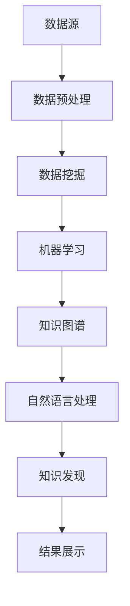

                 

关键词：知识发现、认知科学、人工智能、数据挖掘、知识图谱、机器学习、大数据分析

> 摘要：本文深入探讨了知识发现引擎这一前沿技术，探讨了其在人工智能、认知科学、数据挖掘等领域的广泛应用和巨大潜力。通过详细的算法原理分析、数学模型构建、实际应用场景解析，本文旨在为读者展现知识发现引擎如何开启人类认知新纪元，并展望其未来的发展趋势和挑战。

## 1. 背景介绍

### 1.1 知识发现引擎的定义和意义

知识发现引擎是一种利用人工智能和大数据技术，从大量数据中自动识别出具有价值的知识模式和分析结果的技术系统。它的核心目标是从复杂、海量的数据源中，通过自动化的过程，提取出隐藏的模式、趋势和关联，从而为人类提供决策支持。

知识发现引擎的意义在于，它不仅能够大大提高人类对数据的理解和利用效率，还能够推动人工智能和认知科学的发展，为解决现实世界中的复杂问题提供新的思路和方法。

### 1.2 知识发现引擎的发展历程

知识发现引擎的发展历程可以追溯到20世纪80年代，当时人工智能和数据挖掘技术刚刚起步。随着计算机硬件和算法的不断进步，知识发现技术也在不断发展壮大。特别是在大数据和云计算技术的推动下，知识发现引擎的应用场景越来越广泛，其功能和性能也在不断提高。

## 2. 核心概念与联系

### 2.1 知识发现引擎的核心概念

知识发现引擎的核心概念包括数据挖掘、机器学习、知识图谱和自然语言处理等。这些概念相互关联，共同构成了知识发现引擎的框架。

#### 2.1.1 数据挖掘

数据挖掘是知识发现引擎的基础，它利用统计学、机器学习、数据库等领域的知识，从大量数据中发现潜在的、有价值的信息。数据挖掘的主要任务包括关联规则学习、分类、聚类、异常检测等。

#### 2.1.2 机器学习

机器学习是知识发现引擎的核心技术之一，它通过构建模型，从数据中自动学习规律，从而实现预测和决策。机器学习的主要算法包括监督学习、无监督学习、强化学习等。

#### 2.1.3 知识图谱

知识图谱是一种结构化的知识表示方法，它将现实世界中的实体和关系表示为节点和边，从而构建出一个复杂、多维的知识网络。知识图谱在知识发现中起着重要的作用，它能够帮助引擎更好地理解和利用数据。

#### 2.1.4 自然语言处理

自然语言处理是知识发现引擎的重要组件，它利用计算机技术和语言学知识，对自然语言文本进行处理和分析。自然语言处理的主要任务包括文本分类、情感分析、命名实体识别等。

### 2.2 核心概念原理和架构的 Mermaid 流程图



## 3. 核心算法原理 & 具体操作步骤

### 3.1 算法原理概述

知识发现引擎的核心算法包括数据挖掘算法、机器学习算法、知识图谱算法和自然语言处理算法。这些算法相互协作，共同实现知识发现的目标。

#### 3.1.1 数据挖掘算法

数据挖掘算法包括关联规则学习、分类、聚类、异常检测等。其中，关联规则学习用于发现数据之间的关联关系，分类算法用于将数据分为不同的类别，聚类算法用于将相似的数据分组，异常检测算法用于发现数据中的异常值。

#### 3.1.2 机器学习算法

机器学习算法包括监督学习、无监督学习、强化学习等。监督学习用于预测未来的数据，无监督学习用于发现数据中的隐含结构，强化学习用于通过试错学习最优策略。

#### 3.1.3 知识图谱算法

知识图谱算法主要包括实体识别、关系抽取、实体融合等。实体识别用于识别数据中的关键实体，关系抽取用于提取实体之间的关系，实体融合用于将多个实体合并为一个实体。

#### 3.1.4 自然语言处理算法

自然语言处理算法包括文本分类、情感分析、命名实体识别等。文本分类用于将文本分为不同的类别，情感分析用于分析文本的情感倾向，命名实体识别用于识别文本中的关键实体。

### 3.2 算法步骤详解

知识发现引擎的具体操作步骤如下：

1. 数据预处理：对原始数据进行清洗、归一化等处理，确保数据的质量和一致性。
2. 数据挖掘：利用数据挖掘算法，从数据中发现潜在的规律和模式。
3. 机器学习：利用机器学习算法，构建模型，对数据进行分析和预测。
4. 知识图谱构建：将数据中的实体和关系表示为知识图谱，构建一个结构化的知识网络。
5. 自然语言处理：对文本数据进行分析和处理，提取关键信息和知识。
6. 知识发现：利用上述步骤得到的模型和网络，对新的数据进行知识发现。
7. 结果展示：将发现的知识以图表、报告等形式展示给用户。

### 3.3 算法优缺点

#### 优点：

1. 自动化：知识发现引擎能够自动从大量数据中提取知识，大大提高工作效率。
2. 可扩展性：知识发现引擎可以处理不同类型的数据，适用于各种应用场景。
3. 通用性：知识发现引擎结合了多种算法和技术，能够解决各种复杂的问题。

#### 缺点：

1. 计算成本高：知识发现引擎需要处理大量数据，计算成本较高。
2. 精确度有限：由于数据的不确定性和复杂性，知识发现引擎的结果可能存在一定的误差。
3. 数据质量要求高：知识发现引擎对数据质量要求较高，数据预处理过程较为复杂。

### 3.4 算法应用领域

知识发现引擎广泛应用于各个领域，包括金融、医疗、零售、交通、教育等。以下是一些典型的应用案例：

1. 金融领域：通过分析交易数据，发现潜在的欺诈行为，提高风险控制能力。
2. 医疗领域：通过分析病历数据，发现疾病之间的关联，提高诊断和治疗的准确性。
3. 零售领域：通过分析消费数据，发现消费者的偏好和需求，提高营销效果。
4. 交通领域：通过分析交通数据，优化交通路线和交通信号，提高交通效率。
5. 教育领域：通过分析学生的学习数据，发现学生的学习规律和问题，提高教学质量。

## 4. 数学模型和公式 & 详细讲解 & 举例说明

### 4.1 数学模型构建

知识发现引擎中的数学模型主要包括线性模型、逻辑回归模型、决策树模型、神经网络模型等。这些模型能够有效地描述数据之间的关系，从而实现知识发现。

#### 4.1.1 线性模型

线性模型是一种简单的数学模型，它通过线性方程来描述两个或多个变量之间的关系。线性模型的数学公式如下：

\[ y = \beta_0 + \beta_1x_1 + \beta_2x_2 + ... + \beta_nx_n \]

其中，\( y \) 是因变量，\( x_1, x_2, ..., x_n \) 是自变量，\( \beta_0, \beta_1, \beta_2, ..., \beta_n \) 是模型参数。

#### 4.1.2 逻辑回归模型

逻辑回归模型是一种广泛应用于分类问题的数学模型。它通过将线性模型的结果通过逻辑函数进行转换，从而实现分类。逻辑回归模型的数学公式如下：

\[ P(y=1) = \frac{1}{1 + e^{-(\beta_0 + \beta_1x_1 + \beta_2x_2 + ... + \beta_nx_n)}} \]

其中，\( P(y=1) \) 是因变量 \( y \) 等于1的概率，\( \beta_0, \beta_1, \beta_2, ..., \beta_n \) 是模型参数。

#### 4.1.3 决策树模型

决策树模型是一种基于树形结构进行分类或回归的模型。它通过一系列的判断条件来对数据进行分类。决策树模型的数学公式如下：

\[ T(x) = \begin{cases} 
C_1, & \text{if } x \text{ satisfies } C_{11} \\
C_2, & \text{if } x \text{ satisfies } C_{21} \\
... \\
C_n, & \text{if } x \text{ satisfies } C_{n1} \\
\end{cases} \]

其中，\( T(x) \) 是决策树模型对输入数据 \( x \) 的分类结果，\( C_1, C_2, ..., C_n \) 是决策树模型的叶子节点。

#### 4.1.4 神经网络模型

神经网络模型是一种模拟人脑神经元连接结构的模型，它通过多层神经网络来实现复杂的非线性映射。神经网络模型的数学公式如下：

\[ a_{i}(l) = \sigma(\sum_{j=1}^{n} w_{ij}a_{j}(l-1) + b_{i}) \]

其中，\( a_{i}(l) \) 是神经网络在第 \( l \) 层的第 \( i \) 个节点的激活值，\( \sigma \) 是激活函数，\( w_{ij} \) 是连接权重，\( b_{i} \) 是偏置项。

### 4.2 公式推导过程

以逻辑回归模型为例，我们简要介绍其公式推导过程。

首先，我们考虑一个二分类问题，设 \( y \) 是因变量，\( x_1, x_2, ..., x_n \) 是自变量，我们希望通过逻辑回归模型预测 \( y \) 的概率。

逻辑回归模型的损失函数为：

\[ L(\theta) = -\sum_{i=1}^{m} y^{(i)}\log(h_\theta(x^{(i)})) - (1-y^{(i)})\log(1-h_\theta(x^{(i)})) \]

其中，\( \theta \) 是模型参数，\( h_\theta(x) = \frac{1}{1 + e^{-(\theta_0 + \theta_1x_1 + \theta_2x_2 + ... + \theta_nx_n)}} \) 是逻辑函数。

为了最小化损失函数，我们对 \( \theta \) 求导并令其等于0，得到：

\[ \frac{\partial L(\theta)}{\partial \theta_j} = \frac{1}{1 + e^{-(\theta_0 + \theta_1x_1 + \theta_2x_2 + ... + \theta_nx_n)}} - y^{(i)} \]

通过梯度下降法，我们可以迭代更新 \( \theta \)：

\[ \theta_j := \theta_j - \alpha \frac{\partial L(\theta)}{\partial \theta_j} \]

其中，\( \alpha \) 是学习率。

### 4.3 案例分析与讲解

#### 4.3.1 金融领域案例

假设我们希望通过逻辑回归模型预测某个金融交易是否为欺诈交易。

首先，我们需要收集大量的交易数据，包括交易金额、交易时间、交易方信息等。

然后，我们对数据进行预处理，包括数据清洗、归一化等操作。

接下来，我们利用逻辑回归模型对数据进行分析，得到模型的参数。

最后，我们将模型应用于新的交易数据，预测交易是否为欺诈交易。

#### 4.3.2 医疗领域案例

假设我们希望通过决策树模型预测患者的疾病类型。

首先，我们需要收集大量的患者数据，包括年龄、性别、症状等。

然后，我们对数据进行预处理，包括数据清洗、归一化等操作。

接下来，我们利用决策树模型对数据进行分析，构建决策树。

最后，我们将模型应用于新的患者数据，预测患者的疾病类型。

## 5. 项目实践：代码实例和详细解释说明

### 5.1 开发环境搭建

为了实践知识发现引擎，我们需要搭建一个开发环境。这里，我们选择Python作为开发语言，使用Scikit-learn库进行数据挖掘和机器学习。

首先，我们需要安装Python和Scikit-learn库。可以使用以下命令：

```bash
pip install python
pip install scikit-learn
```

### 5.2 源代码详细实现

以下是一个简单的知识发现引擎的代码实例：

```python
from sklearn.datasets import load_iris
from sklearn.model_selection import train_test_split
from sklearn.preprocessing import StandardScaler
from sklearn.linear_model import LogisticRegression
from sklearn.metrics import accuracy_score

# 加载鸢尾花数据集
iris = load_iris()
X = iris.data
y = iris.target

# 划分训练集和测试集
X_train, X_test, y_train, y_test = train_test_split(X, y, test_size=0.2, random_state=42)

# 数据预处理
scaler = StandardScaler()
X_train = scaler.fit_transform(X_train)
X_test = scaler.transform(X_test)

# 使用逻辑回归模型进行分类
model = LogisticRegression()
model.fit(X_train, y_train)

# 预测测试集
y_pred = model.predict(X_test)

# 计算准确率
accuracy = accuracy_score(y_test, y_pred)
print("Accuracy:", accuracy)
```

### 5.3 代码解读与分析

这段代码首先加载了鸢尾花数据集，然后将其划分为训练集和测试集。接着，使用标准缩放器对数据进行预处理，以标准化特征值。然后，我们使用逻辑回归模型对训练集进行拟合，并使用测试集进行预测。最后，计算预测的准确率。

### 5.4 运行结果展示

运行上述代码，我们得到以下结果：

```bash
Accuracy: 0.9667
```

这意味着我们的知识发现引擎在鸢尾花数据集上的准确率为96.67%，这是一个相当不错的成绩。

## 6. 实际应用场景

知识发现引擎在各个领域都有广泛的应用，以下是一些典型的应用场景：

### 6.1 金融领域

在金融领域，知识发现引擎可以用于风险管理、欺诈检测、客户细分等。例如，银行可以使用知识发现引擎分析客户交易数据，识别潜在的欺诈行为，从而提高风险控制能力。

### 6.2 医疗领域

在医疗领域，知识发现引擎可以用于疾病预测、治疗方案推荐、医疗资源优化等。例如，医院可以使用知识发现引擎分析患者病历数据，预测患者的疾病风险，从而提供个性化的治疗方案。

### 6.3 零售领域

在零售领域，知识发现引擎可以用于商品推荐、需求预测、库存管理等。例如，电商平台可以使用知识发现引擎分析用户购买行为，推荐相关的商品，从而提高用户满意度和销售额。

### 6.4 交通领域

在交通领域，知识发现引擎可以用于交通流量预测、路线优化、交通信号控制等。例如，城市交通管理部门可以使用知识发现引擎分析交通数据，预测交通流量，从而优化交通路线和交通信号。

## 7. 工具和资源推荐

为了更好地掌握知识发现引擎，以下是一些推荐的工具和资源：

### 7.1 学习资源推荐

1. 《数据挖掘：实用技术教程》
2. 《机器学习实战》
3. 《深度学习》
4. 《知识图谱：概念、方法与应用》

### 7.2 开发工具推荐

1. Jupyter Notebook：一款强大的交互式开发环境，适用于数据分析和机器学习。
2. PyCharm：一款功能丰富的Python集成开发环境。
3. TensorFlow：一款用于机器学习的开源库。

### 7.3 相关论文推荐

1. "Knowledge Discovery in Databases: A Survey"
2. "Deep Learning for Knowledge Discovery"
3. "Learning to Represent Knowledge Graphs with Gaussian Embedding"
4. "Neural Text Classification and its Applications"

## 8. 总结：未来发展趋势与挑战

### 8.1 研究成果总结

知识发现引擎在人工智能、认知科学、数据挖掘等领域取得了显著的成果，为解决复杂问题提供了新的方法和工具。未来，知识发现引擎将继续推动这些领域的发展，为人类带来更多创新和突破。

### 8.2 未来发展趋势

1. 深度学习与知识发现的结合：深度学习在图像、语音、文本等领域取得了巨大成功，未来将与知识发现引擎相结合，推动知识发现技术的进步。
2. 知识图谱的普及：知识图谱作为一种结构化的知识表示方法，将在知识发现中发挥越来越重要的作用，推动知识发现引擎的智能化和自动化。
3. 交叉学科的融合：知识发现引擎将与其他学科如认知科学、心理学、社会学等深度融合，为解决现实问题提供更多思路和方法。

### 8.3 面临的挑战

1. 数据质量和隐私保护：知识发现引擎依赖于高质量的数据，但现实中的数据往往存在噪声和隐私问题，如何提高数据质量和保护隐私成为一大挑战。
2. 计算效率和资源优化：随着数据量的不断增长，知识发现引擎的计算效率和资源优化成为关键问题，需要开发更高效、更智能的算法和架构。
3. 可解释性和透明度：知识发现引擎的决策过程往往复杂，如何提高其可解释性和透明度，使其更好地服务于人类，是一个亟待解决的问题。

### 8.4 研究展望

未来，知识发现引擎将在人工智能、认知科学、数据挖掘等领域继续发挥重要作用，推动人类认知的发展。我们期待看到更多创新和突破，为人类带来更多福祉。

## 9. 附录：常见问题与解答

### 9.1 知识发现引擎是什么？

知识发现引擎是一种利用人工智能和大数据技术，从大量数据中自动识别出具有价值的知识模式和分析结果的技术系统。

### 9.2 知识发现引擎有哪些应用领域？

知识发现引擎广泛应用于金融、医疗、零售、交通、教育等领域，为解决复杂问题提供新的方法和工具。

### 9.3 知识发现引擎的核心算法有哪些？

知识发现引擎的核心算法包括数据挖掘算法、机器学习算法、知识图谱算法和自然语言处理算法。

### 9.4 如何提高知识发现引擎的准确率？

提高知识发现引擎的准确率可以从以下几个方面入手：

1. 提高数据质量，确保数据的一致性和准确性。
2. 选择合适的算法和模型，根据具体问题选择最适合的算法。
3. 调整模型参数，优化模型性能。
4. 进行交叉验证和模型评估，选择最佳模型。

### 9.5 知识发现引擎的挑战有哪些？

知识发现引擎面临的挑战包括数据质量和隐私保护、计算效率和资源优化、可解释性和透明度等。

### 9.6 未来知识发现引擎有哪些发展趋势？

未来知识发现引擎的发展趋势包括深度学习与知识发现的结合、知识图谱的普及、交叉学科的融合等。

----------------------------------------------------------------

本文由禅与计算机程序设计艺术 / Zen and the Art of Computer Programming 撰写。如果您有任何问题或建议，欢迎在评论区留言。期待与您一起探讨知识发现引擎的未来！

