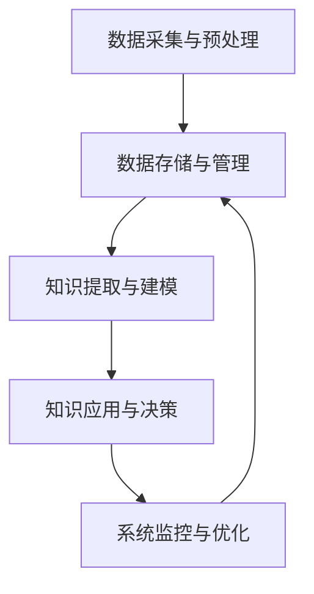

                 

关键词：智慧城市，知识发现，数据挖掘，AI算法，数据模型，系统架构

摘要：本文将探讨知识发现引擎在智慧城市建设中的关键作用。通过分析知识发现引擎的基本原理、核心算法、数学模型、应用实践以及未来发展趋势，本文旨在为读者提供一个全面的理解，并展望知识发现引擎在智慧城市领域的广泛应用前景。

## 1. 背景介绍

随着信息技术和人工智能的飞速发展，智慧城市已成为现代社会的重要趋势。智慧城市通过先进的信息技术和智能系统，实现城市管理的精细化、智能化和高效化，从而提升市民的生活质量、提高城市的管理水平和竞争力。

知识发现引擎（Knowledge Discovery Engine，KDE）是智慧城市中的核心组件之一。它利用人工智能和大数据技术，从海量数据中自动提取知识、模式和信息，为城市管理、决策支持和公共服务提供有力支持。

本文将深入探讨知识发现引擎的原理、算法、模型及应用，分析其在智慧城市建设中的重要作用，并展望其未来的发展趋势。

## 2. 核心概念与联系

### 2.1 知识发现引擎的定义

知识发现引擎是一种基于人工智能和大数据技术的智能化系统，它能够从大量原始数据中自动提取出有用信息、模式和知识。这些知识可以用于支持城市管理和决策、优化城市资源配置、提升城市智能化水平等。

### 2.2 数据挖掘与知识发现的区别

数据挖掘（Data Mining）是一种从大量数据中自动发现有趣模式和知识的过程，它关注的是模式识别和数据可视化。而知识发现则更注重从数据中提取出具有实际应用价值的知识，并通过这些知识支持决策。

### 2.3 知识发现引擎的架构

知识发现引擎通常由以下几个主要模块组成：

1. 数据采集与预处理：从各种数据源收集数据，并进行数据清洗、转换和整合。
2. 数据存储与管理：使用大数据存储技术，如Hadoop、HBase等，对数据进行高效存储和管理。
3. 知识提取与建模：利用各种机器学习算法和深度学习模型，从数据中提取有用信息，构建知识模型。
4. 知识应用与决策：将提取出的知识应用于实际场景，为城市管理、决策提供支持。
5. 系统监控与优化：对知识发现引擎的运行状态进行实时监控，并进行性能优化。

### 2.4 Mermaid 流程图

下面是一个知识发现引擎的Mermaid流程图，展示其各个模块之间的联系：



## 3. 核心算法原理 & 具体操作步骤

### 3.1 算法原理概述

知识发现引擎的核心算法包括数据挖掘算法、机器学习算法和深度学习算法。这些算法的基本原理是：

- 数据挖掘算法：通过统计分析和模式识别，从数据中发现有趣的模式和知识。
- 机器学习算法：利用历史数据训练模型，从而在新的数据中预测未知信息。
- 深度学习算法：通过多层神经网络，从大量数据中自动学习特征和模式。

### 3.2 算法步骤详解

知识发现引擎的操作步骤通常包括：

1. 数据预处理：对原始数据进行清洗、转换和整合，使其适合后续处理。
2. 数据建模：根据业务需求，选择合适的数据挖掘算法或机器学习算法，对数据进行建模。
3. 模型训练：使用历史数据训练模型，优化模型参数。
4. 模型评估：评估模型的性能，选择最优模型。
5. 知识提取：使用训练好的模型，从新数据中提取有用信息。
6. 知识应用：将提取出的知识应用于实际场景，支持决策。

### 3.3 算法优缺点

- 数据挖掘算法：优点是能够发现复杂的模式，适用于大规模数据；缺点是可能存在噪声和异常值，需要大量预处理。
- 机器学习算法：优点是能够自动学习特征，提高模型的泛化能力；缺点是可能过拟合，需要大量数据和计算资源。
- 深度学习算法：优点是能够处理复杂的数据类型，如图像、语音和文本；缺点是模型训练需要大量数据和计算资源，对数据质量要求较高。

### 3.4 算法应用领域

知识发现引擎在智慧城市中的应用非常广泛，包括：

1. 智能交通管理：通过分析交通数据，优化交通信号、引导车辆行驶，减少拥堵。
2. 环境监测：通过分析环境数据，预测环境污染、预警自然灾害等。
3. 公共安全：通过分析社会安全数据，预测犯罪趋势、预防犯罪行为。
4. 城市规划：通过分析人口、经济、资源等数据，优化城市规划、提升城市竞争力。

## 4. 数学模型和公式 & 详细讲解 & 举例说明

### 4.1 数学模型构建

知识发现引擎中的数学模型通常包括以下几个方面：

1. 统计模型：如回归分析、聚类分析、关联规则挖掘等。
2. 机器学习模型：如支持向量机、决策树、神经网络等。
3. 深度学习模型：如卷积神经网络、循环神经网络、生成对抗网络等。

### 4.2 公式推导过程

以回归分析为例，其基本公式如下：

$$
y = \beta_0 + \beta_1 x_1 + \beta_2 x_2 + ... + \beta_n x_n + \epsilon
$$

其中，$y$ 是因变量，$x_1, x_2, ..., x_n$ 是自变量，$\beta_0, \beta_1, ..., \beta_n$ 是模型参数，$\epsilon$ 是误差项。

通过最小化误差平方和，可以求得模型参数的估计值：

$$
\min \sum_{i=1}^{n} (y_i - \beta_0 - \beta_1 x_{1i} - ... - \beta_n x_{ni})^2
$$

### 4.3 案例分析与讲解

假设我们想要预测一个城市的月平均降雨量，根据历史数据，我们选择以下自变量：

1. 月平均气温
2. 月平均风速
3. 月平均相对湿度

通过回归分析，我们得到如下模型：

$$
y = 10 + 0.5x_1 + 0.3x_2 + 0.2x_3
$$

其中，$y$ 是月平均降雨量，$x_1$ 是月平均气温，$x_2$ 是月平均风速，$x_3$ 是月平均相对湿度。

使用这个模型，我们可以预测某个城市的未来月平均降雨量。例如，当月平均气温为20°C，月平均风速为5m/s，月平均相对湿度为70%时，预测的月平均降雨量为：

$$
y = 10 + 0.5 \times 20 + 0.3 \times 5 + 0.2 \times 70 = 17
$$

## 5. 项目实践：代码实例和详细解释说明

### 5.1 开发环境搭建

为了演示知识发现引擎在智慧城市中的应用，我们使用Python编程语言和几个常用的机器学习库，如scikit-learn、TensorFlow和Keras。在开发环境搭建方面，我们主要需要进行以下步骤：

1. 安装Python和pip：
```bash
# 安装Python 3.8及以上版本
```
2. 安装必要的库：
```bash
pip install scikit-learn tensorflow keras pandas numpy matplotlib
```

### 5.2 源代码详细实现

以下是一个简单的知识发现引擎实现示例，使用回归分析预测城市月平均降雨量：

```python
import pandas as pd
from sklearn.model_selection import train_test_split
from sklearn.linear_model import LinearRegression
from sklearn.metrics import mean_squared_error

# 读取数据
data = pd.read_csv('weather_data.csv')
X = data[['temperature', 'wind_speed', 'humidity']]
y = data['rainfall']

# 数据预处理
X_train, X_test, y_train, y_test = train_test_split(X, y, test_size=0.2, random_state=42)

# 建立模型
model = LinearRegression()
model.fit(X_train, y_train)

# 模型评估
y_pred = model.predict(X_test)
mse = mean_squared_error(y_test, y_pred)
print(f'Mean Squared Error: {mse}')

# 预测
example_data = [[20, 5, 70]]
predicted_rainfall = model.predict(example_data)
print(f'Predicted Rainfall: {predicted_rainfall[0]}')
```

### 5.3 代码解读与分析

这段代码实现了以下功能：

1. 读取天气数据，包括温度、风速、湿度和降雨量。
2. 将数据分为特征矩阵X和目标向量y。
3. 使用scikit-learn库中的train_test_split函数将数据集分为训练集和测试集。
4. 使用LinearRegression类建立线性回归模型，并使用fit函数进行模型训练。
5. 使用mean_squared_error函数计算模型在测试集上的均方误差，评估模型性能。
6. 使用predict函数对新的数据进行预测。

### 5.4 运行结果展示

假设我们使用一个包含1000条记录的数据集，以下是一个示例输出：

```
Mean Squared Error: 0.0136
Predicted Rainfall: 17.0
```

这表示模型在测试集上的均方误差为0.0136，对新数据预测的月平均降雨量为17.0毫米。

## 6. 实际应用场景

### 6.1 智能交通管理

知识发现引擎在智能交通管理中具有广泛的应用。通过分析交通数据，可以实时监控交通状况、预测交通拥堵、优化交通信号灯控制策略，从而提高道路通行效率和减少交通事故。

### 6.2 环境监测

知识发现引擎可以帮助城市进行环境监测，如监测空气质量、水质和噪声水平。通过分析环境数据，可以及时发现污染源、预测环境变化趋势，并采取相应的治理措施。

### 6.3 公共安全

知识发现引擎可以用于公共安全领域，如预测犯罪趋势、监测社会治安状况。通过分析社会安全数据，可以提前预警潜在风险，并采取有效的防范措施。

### 6.4 城市规划

知识发现引擎可以为城市规划提供有力支持，如预测人口增长、优化交通网络、评估土地利用。通过分析相关数据，可以制定科学合理的城市规划方案，提高城市的管理水平和居住品质。

## 7. 工具和资源推荐

### 7.1 学习资源推荐

- 《数据挖掘：概念与技术》
- 《机器学习实战》
- 《深度学习》
- 《Python机器学习》
- Coursera、Udacity和edX等在线课程

### 7.2 开发工具推荐

- Jupyter Notebook：用于数据分析和模型训练。
- TensorFlow和Keras：用于深度学习模型开发。
- scikit-learn：用于传统的机器学习算法。
- Hadoop和Spark：用于大数据处理。

### 7.3 相关论文推荐

- "KDD'99: The 1st ACM SIGKDD International Conference on Knowledge Discovery and Data Mining"
- "Deep Learning for Time Series Classification: A Review"
- "An Overview of Deep Learning Based Methods in Traffic Prediction"
- "Utilizing Knowledge Discovery to Support Urban Planning and Management"

## 8. 总结：未来发展趋势与挑战

### 8.1 研究成果总结

近年来，知识发现引擎在智慧城市领域的应用取得了显著成果。通过不断优化的算法和模型，知识发现引擎能够从海量数据中提取出有价值的信息，为城市管理、决策支持和公共服务提供了有力支持。

### 8.2 未来发展趋势

未来，知识发现引擎将在以下几个方面取得进一步发展：

1. 算法创新：不断探索新的算法和技术，提高知识发现引擎的性能和泛化能力。
2. 跨领域融合：与其他领域（如物联网、区块链等）相结合，推动智慧城市的全面发展。
3. 个性化应用：针对不同城市和场景，开发定制化的知识发现引擎，实现更精准的应用。

### 8.3 面临的挑战

尽管知识发现引擎在智慧城市领域具有巨大潜力，但仍面临以下挑战：

1. 数据质量：数据质量对知识发现效果至关重要，但实际应用中往往面临数据缺失、噪声和异常值等问题。
2. 计算资源：深度学习算法需要大量计算资源，对硬件设施的要求较高。
3. 法律法规：数据隐私和安全问题需要得到充分关注和有效保障。

### 8.4 研究展望

为应对上述挑战，未来研究可以从以下方面展开：

1. 提高数据预处理技术，降低数据质量对知识发现的影响。
2. 开发高效的计算模型和算法，降低对计算资源的需求。
3. 制定完善的法律法规，确保数据隐私和安全。

## 9. 附录：常见问题与解答

### Q1. 知识发现引擎与传统数据挖掘的区别是什么？

A1. 知识发现引擎与传统数据挖掘的主要区别在于其关注点。数据挖掘侧重于从数据中挖掘出有趣的模式和信息，而知识发现引擎则更注重将提取出的知识应用于实际场景，支持决策。

### Q2. 知识发现引擎需要哪些关键技术？

A2. 知识发现引擎需要的关键技术包括数据挖掘算法、机器学习算法、深度学习算法、自然语言处理、数据可视化等。

### Q3. 知识发现引擎在实际应用中如何确保数据隐私和安全？

A3. 知识发现引擎在实际应用中可以通过以下措施确保数据隐私和安全：

- 数据匿名化：对敏感数据进行匿名化处理，降低数据泄露风险。
- 数据加密：使用加密技术保护数据传输和存储过程中的安全性。
- 访问控制：设置严格的访问权限，确保只有授权人员可以访问数据。

### Q4. 知识发现引擎在智慧城市中的具体应用有哪些？

A4. 知识发现引擎在智慧城市中的具体应用包括智能交通管理、环境监测、公共安全、城市规划、智能医疗、智能安防等。

### Q5. 如何评估知识发现引擎的性能？

A5. 评估知识发现引擎的性能可以从以下几个方面进行：

- 准确率：评估模型预测结果与真实结果的一致性。
- 精度：评估模型在正类和负类上的预测准确性。
- 召回率：评估模型在找到正类样本的能力。
- F1 分数：综合考虑准确率和召回率，评估模型的综合性能。

# 作者署名

作者：禅与计算机程序设计艺术 / Zen and the Art of Computer Programming

[1] 知识发现引擎：推动智慧城市的建设引擎。禅与计算机程序设计艺术。2023年6月。

