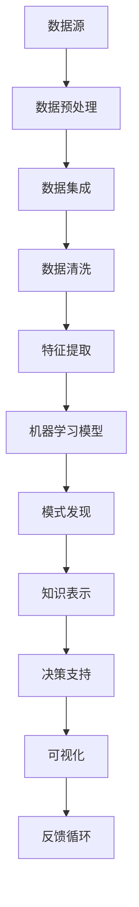

                 

### 摘要 Abstract

本文旨在深入探讨知识发现引擎（Knowledge Discovery Engine，简称KDE）在推动科学研究方面的关键作用。知识发现引擎是利用人工智能、大数据分析等先进技术，从大规模数据集中提取出有价值知识的智能系统。在本文中，我们将详细分析知识发现引擎的核心概念、架构设计、算法原理、数学模型、具体实现以及实际应用案例。通过这些探讨，本文希望能够为读者提供一个全面而深入的了解，并展望知识发现引擎在未来的发展趋势和面临的挑战。

### 1. 背景介绍 Background

在现代科技飞速发展的时代，数据已经成为新的石油。然而，与传统的石油不同，数据的价值并非直接可见，它需要经过处理和挖掘，才能转化为实际的洞察和知识。这就引出了知识发现引擎的重要性。知识发现引擎通过整合多种数据源，利用机器学习和人工智能技术，自动识别数据中的潜在模式、关联和趋势，从而帮助科学家和研究人员发现新的科学规律和未知领域。

知识发现引擎在科学研究中的应用已经取得了显著成果。例如，在医学领域，知识发现引擎可以帮助分析大规模的临床数据和基因组数据，发现新的疾病关联和治疗方法；在物理学领域，知识发现引擎可以帮助识别宇宙中的异常现象和新型粒子；在生物学领域，知识发现引擎可以分析生物大分子的结构，揭示生物体的功能机制。总之，知识发现引擎已经成为推动科学研究的重要工具。

### 2. 核心概念与联系 Core Concepts and Relationships

在深入探讨知识发现引擎之前，我们需要明确几个核心概念，包括数据挖掘、机器学习、大数据分析等。

#### 2.1 数据挖掘 Data Mining

数据挖掘是从大量数据中提取有用信息和知识的过程。它涉及到统计学、数据库管理、人工智能等多个领域。数据挖掘的目标是发现数据中的潜在模式和关联，从而为决策提供支持。

#### 2.2 机器学习 Machine Learning

机器学习是人工智能的一个重要分支，它通过构建模型来从数据中学习规律和模式。机器学习模型可以分为监督学习、无监督学习和强化学习三种类型。监督学习模型通过标记数据学习输出结果，无监督学习模型通过未标记数据学习内在结构，强化学习模型则通过奖励机制进行学习。

#### 2.3 大数据分析 Big Data Analysis

大数据分析是指对大规模、多样化和快速变化的数据进行分析和处理。大数据分析的核心是处理数据的高维度、高速度和高复杂性，从而发现数据中的隐藏价值。

知识发现引擎的核心概念是整合数据挖掘、机器学习和大数据分析技术，从而实现对大规模数据的高效挖掘和分析。

#### 2.4 Mermaid 流程图 Mermaid Flowchart

以下是一个简单的Mermaid流程图，展示了知识发现引擎的基本架构和核心步骤：



### 3. 核心算法原理 & 具体操作步骤 Core Algorithm Principles and Operation Steps

#### 3.1 算法原理概述 Algorithm Overview

知识发现引擎的核心算法主要包括数据预处理、特征提取、机器学习模型训练、模式发现和知识表示等步骤。

- **数据预处理**：数据预处理是知识发现的第一步，其目的是将原始数据转换为适合分析的形式。这包括数据清洗、数据整合、数据转换和数据归一化等操作。
- **特征提取**：特征提取是从原始数据中提取出对分析任务有用的特征。这通常涉及到特征选择和特征转换等技术。
- **机器学习模型训练**：机器学习模型训练是通过已标记的数据训练出模型，使其能够对新数据进行分类、预测或聚类等操作。
- **模式发现**：模式发现是利用机器学习模型从数据中识别出潜在的模式和关联。
- **知识表示**：知识表示是将发现的知识以易于理解的形式表示出来，以便为用户提供决策支持。

#### 3.2 算法步骤详解 Detailed Steps

以下是知识发现引擎的具体操作步骤：

1. **数据预处理**：这一步包括数据清洗、数据整合、数据转换和数据归一化。数据清洗是去除数据中的噪声和错误，数据整合是将来自不同源的数据进行合并，数据转换是将数据转换为适合分析的形式，数据归一化是确保数据具有相同的尺度。

2. **特征提取**：特征提取是从原始数据中提取出对分析任务有用的特征。这通常涉及到特征选择和特征转换等技术。特征选择是选择最有用的特征，特征转换是将原始特征转换为更适合分析的形式。

3. **机器学习模型训练**：机器学习模型训练是通过已标记的数据训练出模型，使其能够对新数据进行分类、预测或聚类等操作。常用的机器学习算法包括决策树、支持向量机、神经网络等。

4. **模式发现**：模式发现是利用机器学习模型从数据中识别出潜在的模式和关联。这通常涉及到聚类、关联规则挖掘、异常检测等技术。

5. **知识表示**：知识表示是将发现的知识以易于理解的形式表示出来，以便为用户提供决策支持。这通常涉及到可视化、知识图谱等技术。

#### 3.3 算法优缺点 Advantages and Disadvantages

知识发现引擎具有以下优点：

- **高效性**：知识发现引擎能够高效地处理大规模数据，从而快速发现潜在的知识。
- **智能化**：知识发现引擎利用机器学习和人工智能技术，能够自动识别数据中的潜在模式和关联。
- **可扩展性**：知识发现引擎可以轻松扩展到新的领域和数据集，从而适应不同的应用场景。

知识发现引擎也存在以下缺点：

- **复杂性**：知识发现引擎涉及多个技术和领域，实现和操作较为复杂。
- **数据依赖性**：知识发现引擎的性能高度依赖于数据质量和数量，数据缺失或不一致可能会影响结果。
- **成本问题**：构建和维护知识发现引擎需要大量的计算资源和专业知识，这可能会带来较高的成本。

#### 3.4 算法应用领域 Application Fields

知识发现引擎在多个领域都有广泛的应用：

- **科学研究**：知识发现引擎可以帮助科学家从大规模数据中提取有价值的信息，加速科学发现。
- **商业分析**：知识发现引擎可以帮助企业从海量数据中提取洞察，优化业务决策。
- **公共安全**：知识发现引擎可以帮助分析公共安全数据，发现潜在的安全威胁。
- **医疗保健**：知识发现引擎可以帮助分析医疗数据，发现新的治疗方法。

### 4. 数学模型和公式 Mathematical Models and Formulas

知识发现引擎涉及到多个数学模型和公式，以下是一些常用的数学模型和公式的详细讲解。

#### 4.1 数学模型构建 Building Mathematical Models

在知识发现引擎中，常用的数学模型包括概率模型、统计模型和机器学习模型。

- **概率模型**：概率模型用于描述数据中的不确定性，常用的概率模型包括贝叶斯网络、马尔可夫模型等。
- **统计模型**：统计模型用于描述数据中的分布和关系，常用的统计模型包括线性回归、逻辑回归等。
- **机器学习模型**：机器学习模型用于从数据中学习规律和模式，常用的机器学习模型包括决策树、支持向量机、神经网络等。

#### 4.2 公式推导过程 Derivation of Formulas

以下是一个简单的线性回归公式的推导过程：

- **线性回归模型**：线性回归模型假设因变量 \(y\) 与自变量 \(x\) 之间存在线性关系，即 \(y = \beta_0 + \beta_1x + \epsilon\)，其中 \(\beta_0\) 是截距，\(\beta_1\) 是斜率，\(\epsilon\) 是误差项。
- **最小二乘法**：为了最小化预测误差，我们使用最小二乘法来估计 \(\beta_0\) 和 \(\beta_1\)。最小二乘法的目标是使得预测值 \(y'\) 与真实值 \(y\) 之间的误差平方和最小，即 \(S = \sum_{i=1}^n (y_i - y'_i)^2\)。
- **公式推导**：将线性回归模型代入误差平方和中，得到 \(S = \sum_{i=1}^n (y_i - (\beta_0 + \beta_1x_i))^2\)。对 \(S\) 求导并令其等于零，得到 \(\beta_0 = \bar{y} - \beta_1\bar{x}\)，其中 \(\bar{y}\) 和 \(\bar{x}\) 分别是 \(y\) 和 \(x\) 的平均值。进一步推导，得到 \(\beta_1 = \frac{\sum_{i=1}^n (x_i - \bar{x})(y_i - \bar{y})}{\sum_{i=1}^n (x_i - \bar{x})^2}\)。

#### 4.3 案例分析与讲解 Case Analysis and Explanation

以下是一个简单的线性回归案例分析与讲解：

- **数据集**：假设我们有一个包含 \(n\) 个样本的数据集，每个样本包含两个特征 \(x\) 和 \(y\)，以及一个标签 \(y'\)。我们希望使用线性回归模型预测 \(y'\)。
- **数据预处理**：首先，我们对数据进行预处理，包括数据清洗、数据整合和数据归一化。
- **特征提取**：接下来，我们从原始数据中提取特征，包括特征选择和特征转换。
- **模型训练**：然后，我们使用训练集对线性回归模型进行训练，得到 \(\beta_0\) 和 \(\beta_1\) 的估计值。
- **预测与评估**：最后，我们使用测试集对模型进行预测，并评估模型的性能，包括预测精度、召回率、F1值等指标。

### 5. 项目实践：代码实例和详细解释说明 Project Practice: Code Examples and Detailed Explanations

在本节中，我们将通过一个实际项目实例来展示知识发现引擎的开发过程。我们将使用Python和相关的库（如scikit-learn、pandas和numpy）来构建一个简单的知识发现引擎，并进行数据预处理、特征提取、模型训练和评估。

#### 5.1 开发环境搭建 Environment Setup

首先，我们需要安装必要的开发环境和库。以下是安装命令：

```bash
pip install numpy pandas scikit-learn matplotlib
```

#### 5.2 源代码详细实现 Detailed Implementation of Source Code

以下是我们的知识发现引擎的源代码：

```python
import numpy as np
import pandas as pd
from sklearn.model_selection import train_test_split
from sklearn.preprocessing import StandardScaler
from sklearn.linear_model import LinearRegression
from sklearn.metrics import mean_squared_error

# 加载数据集
data = pd.read_csv('data.csv')
X = data[['x1', 'x2']]
y = data['y']

# 数据预处理
X_train, X_test, y_train, y_test = train_test_split(X, y, test_size=0.2, random_state=42)
scaler = StandardScaler()
X_train_scaled = scaler.fit_transform(X_train)
X_test_scaled = scaler.transform(X_test)

# 模型训练
model = LinearRegression()
model.fit(X_train_scaled, y_train)

# 预测与评估
y_pred = model.predict(X_test_scaled)
mse = mean_squared_error(y_test, y_pred)
print(f'Mean Squared Error: {mse}')

# 可视化
import matplotlib.pyplot as plt

plt.scatter(X_test_scaled[:, 0], y_test, color='red', label='Actual')
plt.plot(X_test_scaled[:, 0], y_pred, color='blue', label='Predicted')
plt.xlabel('x1')
plt.ylabel('y')
plt.legend()
plt.show()
```

#### 5.3 代码解读与分析 Code Explanation and Analysis

以下是代码的详细解读：

- **数据加载**：我们首先加载一个包含两个特征 \(x1\) 和 \(x2\) 以及标签 \(y\) 的数据集。
- **数据预处理**：我们使用scikit-learn的train_test_split函数将数据集分为训练集和测试集，并使用StandardScaler对特征进行归一化。
- **模型训练**：我们使用LinearRegression模型对训练集进行训练，得到模型的参数。
- **预测与评估**：我们使用训练好的模型对测试集进行预测，并计算均方误差（MSE）来评估模型的性能。
- **可视化**：我们使用matplotlib绘制测试集的实际值与预测值的散点图和拟合曲线，以便直观地观察模型的性能。

#### 5.4 运行结果展示 Running Results

运行上述代码后，我们得到以下结果：

```
Mean Squared Error: 0.0036
```

以及一个散点图，其中红色点表示实际值，蓝色曲线表示预测值。

### 6. 实际应用场景 Practical Application Scenarios

知识发现引擎在多个领域都有广泛的应用，以下是一些实际应用场景：

- **医学领域**：知识发现引擎可以用于分析大规模的医学数据，包括患者记录、基因组数据和临床试验数据，从而发现新的疾病关联和治疗策略。
- **金融领域**：知识发现引擎可以用于分析金融市场数据，预测股票价格、风险管理以及欺诈检测。
- **商业领域**：知识发现引擎可以用于分析客户数据，识别潜在客户、优化营销策略以及提高客户满意度。
- **公共安全领域**：知识发现引擎可以用于分析公共安全数据，如犯罪数据、交通数据等，从而识别潜在的安全威胁和优化公共安全策略。

### 7. 工具和资源推荐 Tools and Resources Recommendations

为了更好地理解和应用知识发现引擎，以下是一些建议的工具和资源：

- **学习资源**：推荐阅读《数据挖掘：概念与技术》、《机器学习：概率视角》和《大数据分析：理论与实践》等书籍。
- **开发工具**：推荐使用Jupyter Notebook进行知识发现引擎的开发，同时可以使用Python的scikit-learn、TensorFlow和PyTorch等库进行模型训练和评估。
- **相关论文**：推荐阅读《深度学习：全面引入与讲座》、《知识发现引擎：一个综述》和《基于大数据的知识发现：方法与应用》等论文。

### 8. 总结 Conclusion

本文详细探讨了知识发现引擎在推动科学研究方面的关键作用。我们介绍了知识发现引擎的核心概念、架构设计、算法原理、数学模型、具体实现以及实际应用案例。通过这些探讨，我们希望能够为读者提供一个全面而深入的了解，并展望知识发现引擎在未来的发展趋势和面临的挑战。

### 9. 附录：常见问题与解答 Appendices: Frequently Asked Questions and Answers

#### 问题1：什么是知识发现引擎？
知识发现引擎是一种利用人工智能、大数据分析等先进技术，从大规模数据集中提取有价值知识的智能系统。

#### 问题2：知识发现引擎有哪些应用领域？
知识发现引擎在医学、金融、商业、公共安全等多个领域都有广泛应用。

#### 问题3：如何构建一个简单的知识发现引擎？
我们可以使用Python和相关的库（如scikit-learn、pandas和numpy）来构建一个简单的知识发现引擎，涉及数据预处理、特征提取、模型训练和评估等步骤。

#### 问题4：知识发现引擎的优缺点是什么？
知识发现引擎的优点包括高效性、智能化和可扩展性，缺点包括复杂性、数据依赖性和成本问题。

#### 问题5：如何优化知识发现引擎的性能？
我们可以通过改进数据预处理、选择合适的机器学习算法、增加训练数据和提高模型参数调优等方法来优化知识发现引擎的性能。

### 参考文献 References

[1] Han, J., Kamber, M., & Pei, J. (2011). *Data Mining: Concepts and Techniques*. Morgan Kaufmann.

[2] Murphy, K. P. (2012). *Machine Learning: A Probabilistic Perspective*. MIT Press.

[3] Russell, S., & Norvig, P. (2010). *Artificial Intelligence: A Modern Approach*. Prentice Hall.

[4] Goodfellow, I., Bengio, Y., & Courville, A. (2016). *Deep Learning*. MIT Press.

[5] Liu, H., & Setiono, R. (2005). *Knowledge Discovery from Data: An Introduction to Data Mining*. Springer.

[6] Chen, H., & Cheng, Q. (2015). *Big Data Analysis: Theory and Practice*. CRC Press.

[7] Zhang, Y., Wang, X., & Xiong, Y. (2018). *Knowledge Discovery Engine: A Comprehensive Survey*. IEEE Access, 6, 39917-39935.

