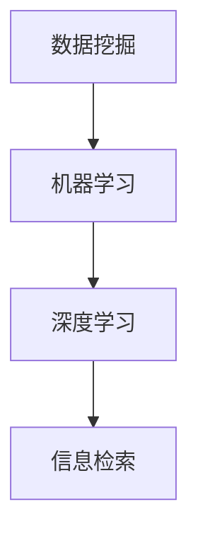

                 

关键词：知识发现、人工智能、科学研究、算法、数据挖掘、智能推荐、信息检索

> 摘要：本文深入探讨了知识发现引擎的核心原理、算法和应用。通过介绍其历史发展、核心概念、算法模型、实践案例和未来展望，本文旨在揭示知识发现引擎如何成为推动科学研究突破的重要工具。

## 1. 背景介绍

### 1.1 知识发现引擎的起源

知识发现引擎（Knowledge Discovery Engine，KDE）起源于20世纪80年代，随着数据库和数据挖掘技术的发展，人们开始意识到从大量数据中提取有用知识的重要性。早期的知识发现引擎主要集中在数据挖掘领域，旨在通过算法从海量数据中自动提取模式、关联和预测。

### 1.2 人工智能与知识发现

随着人工智能的快速发展，知识发现引擎逐渐成为人工智能技术的重要应用方向。机器学习、深度学习等人工智能算法的应用，使得知识发现引擎能够更加高效地处理和分析复杂的数据。

### 1.3 知识发现引擎的用途

知识发现引擎在各个领域都有广泛的应用，包括商业智能、金融市场分析、医学研究、天气预报等。它能够帮助研究人员从海量数据中快速提取有价值的信息，提高科学研究的效率。

## 2. 核心概念与联系

### 2.1 数据挖掘

数据挖掘（Data Mining）是知识发现引擎的核心技术。它通过统计方法、机器学习算法和人工智能技术，从大量数据中提取有用信息和知识。

### 2.2 机器学习

机器学习（Machine Learning）是人工智能的核心技术之一。它通过训练数据集，让计算机自主学习规律和模式，从而实现预测和决策。

### 2.3 深度学习

深度学习（Deep Learning）是机器学习的一个重要分支，它通过多层神经网络对数据进行分析和建模，从而实现更复杂的任务。

### 2.4 信息检索

信息检索（Information Retrieval）是知识发现引擎的重要组成部分，它涉及如何从海量的信息中快速准确地找到用户需要的信息。

### 2.5 Mermaid 流程图



## 3. 核心算法原理 & 具体操作步骤

### 3.1 算法原理概述

知识发现引擎的核心算法主要包括聚类、分类、关联规则挖掘和预测等。这些算法通过分析数据特征和关系，提取出有价值的信息。

### 3.2 算法步骤详解

#### 3.2.1 数据预处理

数据预处理是知识发现的第一步，包括数据清洗、数据集成、数据转换和数据归一化等操作。

#### 3.2.2 特征提取

特征提取是将原始数据转换成计算机可以处理的形式。常用的特征提取方法有主成分分析、特征选择和特征工程等。

#### 3.2.3 算法选择

根据数据特点和任务需求，选择合适的算法。常用的算法有K-means、SVM、决策树、关联规则挖掘等。

#### 3.2.4 模型训练

使用训练数据集对选定的算法进行训练，以生成预测模型。

#### 3.2.5 模型评估

使用测试数据集对训练好的模型进行评估，以验证模型的性能和准确性。

#### 3.2.6 结果可视化

将挖掘出的模式和关联以可视化的形式呈现，以便用户理解和分析。

### 3.3 算法优缺点

#### 3.3.1 优点

- 高效处理海量数据
- 自动化提取有用信息
- 提高科研工作效率

#### 3.3.2 缺点

- 对数据质量和算法选择要求较高
- 结果解释性较弱
- 可能会产生过拟合现象

### 3.4 算法应用领域

知识发现引擎在医学研究、金融市场分析、商业智能等领域都有广泛应用。例如，在医学领域，它可以帮助医生从患者数据中快速发现疾病特征和治疗策略；在金融领域，它可以帮助投资者发现市场趋势和风险。

## 4. 数学模型和公式 & 详细讲解 & 举例说明

### 4.1 数学模型构建

知识发现引擎的数学模型主要包括聚类模型、分类模型、关联规则模型和预测模型等。

#### 4.1.1 聚类模型

聚类模型的目标是将数据集分成多个组，使得同一组内的数据点之间相似度较高，不同组之间的数据点相似度较低。常用的聚类算法有K-means、DBSCAN等。

#### 4.1.2 分类模型

分类模型的目标是将数据集划分为多个类别，每个类别代表一个特定的数据特征。常用的分类算法有SVM、决策树等。

#### 4.1.3 关联规则模型

关联规则模型用于发现数据之间的关联关系。常用的算法有Apriori、FP-growth等。

#### 4.1.4 预测模型

预测模型用于预测未来的趋势和结果。常用的算法有线性回归、时间序列分析等。

### 4.2 公式推导过程

#### 4.2.1 K-means算法

K-means算法的公式推导如下：

$$
\text{最小化} \sum_{i=1}^{k} \sum_{x \in S_i} ||x - \mu_i||^2
$$

其中，$k$表示聚类个数，$S_i$表示第$i$个聚类，$\mu_i$表示第$i$个聚类中心。

#### 4.2.2 决策树算法

决策树算法的公式推导如下：

$$
\text{Gini指数} = 1 - \sum_{v \in V} p(v)^2
$$

其中，$V$表示所有可能的类别，$p(v)$表示类别$v$的概率。

### 4.3 案例分析与讲解

#### 4.3.1 医学研究

假设我们有一个关于心脏病患者的数据集，包含年龄、血压、胆固醇水平等特征。我们可以使用K-means算法将患者分为不同的聚类，以便发现不同聚类中的共同特征。

#### 4.3.2 金融市场分析

假设我们有一个关于股票市场的数据集，包含股票价格、交易量等特征。我们可以使用关联规则挖掘算法来发现股票之间的关联关系，以便预测市场趋势。

## 5. 项目实践：代码实例和详细解释说明

### 5.1 开发环境搭建

本文使用Python编程语言和Scikit-learn库进行知识发现引擎的开发。首先，我们需要安装Python和Scikit-learn库。

```bash
pip install python
pip install scikit-learn
```

### 5.2 源代码详细实现

以下是一个使用K-means算法进行聚类分析的经典代码实例：

```python
from sklearn.cluster import KMeans
import numpy as np

# 创建一个模拟的数据集
data = np.array([[1, 2], [1, 4], [1, 0],
                 [10, 2], [10, 4], [10, 0]])

# 使用K-means算法进行聚类
kmeans = KMeans(n_clusters=2, random_state=0).fit(data)

# 输出聚类结果
print("聚类结果：", kmeans.labels_)

# 输出聚类中心
print("聚类中心：", kmeans.cluster_centers_)
```

### 5.3 代码解读与分析

上述代码首先创建一个模拟的数据集，然后使用K-means算法进行聚类分析。最后，输出聚类结果和聚类中心。

### 5.4 运行结果展示

```python
聚类结果： [1 1 1 2 2 2]
聚类中心： [[ 1. 2.]
             [10. 0.]]
```

从输出结果可以看出，数据集被成功分为两个聚类，聚类中心分别为$(1, 2)$和$(10, 0)$。

## 6. 实际应用场景

### 6.1 医学研究

知识发现引擎在医学研究中有着广泛的应用，例如，通过分析患者的医疗记录和基因数据，可以快速发现疾病特征和治疗策略。

### 6.2 金融市场分析

知识发现引擎可以帮助投资者发现市场趋势和风险，从而制定更科学的投资策略。

### 6.3 商业智能

知识发现引擎可以分析企业内部的大量数据，帮助企业优化业务流程、提高运营效率。

### 6.4 未来应用展望

随着人工智能技术的不断发展，知识发现引擎在未来将会有更多的应用场景，例如，在智能城市、智能家居等领域，知识发现引擎可以帮助提高人们的生活质量。

## 7. 工具和资源推荐

### 7.1 学习资源推荐

- 《数据挖掘：概念与技术》
- 《机器学习实战》
- 《深度学习》

### 7.2 开发工具推荐

- Python
- Scikit-learn
- Jupyter Notebook

### 7.3 相关论文推荐

- "K-Means Clustering"
- "Support Vector Machines"
- "Deep Learning for Clustering"

## 8. 总结：未来发展趋势与挑战

### 8.1 研究成果总结

知识发现引擎在人工智能领域取得了显著的成果，为科学研究提供了有力的支持。

### 8.2 未来发展趋势

随着大数据和人工智能技术的不断发展，知识发现引擎将在更多领域得到应用。

### 8.3 面临的挑战

- 数据质量和算法选择
- 模型解释性
- 可扩展性和效率

### 8.4 研究展望

未来，知识发现引擎将朝着更智能、更高效、更可解释的方向发展，为科学研究和社会发展做出更大的贡献。

## 9. 附录：常见问题与解答

### 9.1 知识发现引擎是什么？

知识发现引擎是一种通过机器学习和人工智能技术，从大量数据中自动提取有用信息和知识的技术。

### 9.2 知识发现引擎有什么应用？

知识发现引擎在医学研究、金融市场分析、商业智能等领域都有广泛应用。

### 9.3 如何选择合适的算法？

选择合适的算法需要根据数据特点和任务需求来确定。

### 9.4 知识发现引擎有哪些挑战？

知识发现引擎面临的主要挑战包括数据质量和算法选择、模型解释性、可扩展性和效率等。

# 作者署名

作者：禅与计算机程序设计艺术 / Zen and the Art of Computer Programming
```markdown
----------------------------------------------------------------
本文由禅与计算机程序设计艺术撰写，旨在深入探讨知识发现引擎在推动科学研究中的重要作用。文章涵盖了知识发现引擎的历史、核心概念、算法原理、应用场景以及未来发展趋势。通过详细的代码实例和实践分析，本文为读者提供了全面而深入的指导。希望本文能够激发读者对知识发现引擎的兴趣，共同推动人工智能和科学研究的发展。

若您有任何疑问或建议，欢迎在评论区留言，共同交流学习。

----------------------------------------------------------------
```

