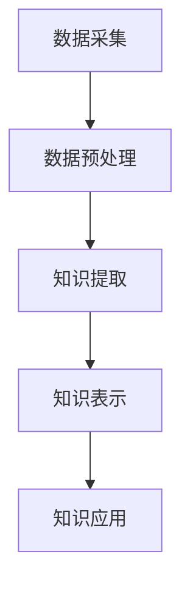

                 

 关键词：知识发现引擎、教育、智慧革命、人工智能、数据挖掘、学习算法

> 摘要：本文旨在探讨知识发现引擎在教育领域的应用及其引发的智慧革命。通过深入分析知识发现引擎的核心概念、算法原理、数学模型以及实际应用案例，我们将揭示这一技术如何重塑教育模式，提升教育质量，并展望其未来的发展趋势与挑战。

## 1. 背景介绍

在信息爆炸的时代，知识成为推动社会进步的重要力量。教育作为知识传递的主要途径，其效率和质量直接影响个体和整体的社会发展。然而，传统教育模式在应对海量知识和个性化学习需求时，显得力不从心。这就需要借助先进的技术手段，特别是人工智能和大数据技术，来提升教育效率，满足个性化学习需求。

知识发现引擎作为一种人工智能技术，其核心在于从大量数据中自动发现隐含的模式和知识。它通过数据挖掘、机器学习等技术手段，帮助教育系统从海量教育数据中提取有价值的信息，为教育决策提供数据支持，从而实现教育智能化。知识发现引擎在教育领域的应用，有望引发一场智慧革命，为教育带来深刻变革。

## 2. 核心概念与联系

### 2.1 知识发现引擎的定义与作用

知识发现引擎（Knowledge Discovery Engine，KDE）是指一种基于人工智能和数据挖掘技术的系统，它能够自动从大量数据中提取有用信息和知识。在教育学中，知识发现引擎的作用主要体现在以下几个方面：

1. **个性化学习**：通过分析学生的学习行为和表现数据，知识发现引擎可以为学生推荐个性化的学习资源和课程，提高学习效率。
2. **教学诊断**：教师可以利用知识发现引擎分析学生的学习情况，发现教学中的问题，从而进行针对性的教学调整。
3. **教育评估**：知识发现引擎可以帮助学校和教育机构对教学质量进行量化评估，为教育改革提供数据支持。
4. **教育资源优化**：通过对教育资源使用数据的分析，知识发现引擎可以优化教育资源的配置，提高资源利用率。

### 2.2 核心概念原理

知识发现引擎的核心概念包括数据挖掘、机器学习、自然语言处理等。这些概念相互关联，共同构成了知识发现引擎的理论基础。

1. **数据挖掘（Data Mining）**：数据挖掘是指从大量数据中自动发现有价值信息的过程。在教育领域，数据挖掘主要用于分析学生的学习行为、学习效果等数据，提取出有指导意义的知识。
2. **机器学习（Machine Learning）**：机器学习是人工智能的一个重要分支，通过算法和模型，使计算机能够从数据中学习并做出预测。在教育中，机器学习可以帮助知识发现引擎实现个性化学习推荐、学习行为预测等功能。
3. **自然语言处理（Natural Language Processing，NLP）**：自然语言处理是使计算机理解和生成人类语言的技术。在教育领域，NLP技术可以帮助知识发现引擎处理学生作业、论文等文本数据，提取关键信息和知识。

### 2.3 架构与流程

知识发现引擎的架构通常包括数据采集、数据预处理、知识提取、知识表示和知识应用等环节。以下是一个简化的知识发现引擎工作流程：

1. **数据采集**：收集学生学习行为、学习成果、课程资源等数据。
2. **数据预处理**：对原始数据进行清洗、归一化等处理，使其适合进一步分析。
3. **知识提取**：利用数据挖掘和机器学习算法，从预处理后的数据中提取有价值的信息和知识。
4. **知识表示**：将提取的知识以用户友好的形式进行表示，如知识图谱、推荐列表等。
5. **知识应用**：将提取的知识应用于教学、学习、教育管理等方面，如个性化学习推荐、学习行为分析等。

### 2.4 Mermaid 流程图

下面是一个简化的知识发现引擎的 Mermaid 流程图：



## 3. 核心算法原理 & 具体操作步骤

### 3.1 算法原理概述

知识发现引擎的核心算法主要包括数据挖掘算法、机器学习算法和自然语言处理算法。这些算法相互配合，共同实现知识的提取和表示。

1. **数据挖掘算法**：常用的数据挖掘算法包括聚类、分类、关联规则挖掘等。这些算法可以帮助知识发现引擎从大规模数据中提取有用的信息。
2. **机器学习算法**：常见的机器学习算法包括决策树、支持向量机、神经网络等。这些算法可以使知识发现引擎根据已有数据预测新数据，从而实现个性化学习推荐等功能。
3. **自然语言处理算法**：自然语言处理算法主要包括文本分类、情感分析、实体识别等。这些算法可以帮助知识发现引擎处理文本数据，提取关键信息和知识。

### 3.2 算法步骤详解

1. **数据采集**：收集学生学习行为、学习成果、课程资源等数据。这些数据可以来源于学校管理系统、在线学习平台、学生作业等。
2. **数据预处理**：对原始数据进行清洗、归一化等处理，使其适合进一步分析。例如，去除缺失值、处理异常值、将数据转换为统一的格式等。
3. **特征提取**：从预处理后的数据中提取特征，如学生的成绩、学习时间、课程难度等。这些特征将作为后续算法的输入。
4. **知识提取**：利用数据挖掘和机器学习算法，从特征数据中提取有价值的信息和知识。例如，通过聚类算法发现学生的学习群体，通过分类算法预测学生的成绩等。
5. **知识表示**：将提取的知识以用户友好的形式进行表示，如知识图谱、推荐列表等。这些表示形式可以帮助教师和学生更好地理解和应用知识。
6. **知识应用**：将提取的知识应用于教学、学习、教育管理等方面，如个性化学习推荐、学习行为分析等。

### 3.3 算法优缺点

1. **优点**：
   - **高效性**：知识发现引擎可以自动处理海量数据，大大提高了教育数据分析的效率。
   - **个性化**：通过个性化学习推荐，知识发现引擎可以满足不同学生的学习需求，提高学习效果。
   - **智能化**：知识发现引擎可以实现教学诊断、教育资源优化等功能，使教育管理更加智能化。

2. **缺点**：
   - **数据依赖性**：知识发现引擎的效果很大程度上依赖于数据的质量和数量，数据质量差可能导致错误的知识提取。
   - **算法复杂性**：知识发现引擎涉及多种算法，算法的选择和调优需要较高的专业知识和经验。
   - **隐私保护**：在教育数据中，学生的个人信息需要得到保护，知识发现引擎在处理数据时需要遵守隐私保护规定。

### 3.4 算法应用领域

知识发现引擎在教育领域的应用非常广泛，主要包括以下方面：

1. **个性化学习**：通过分析学生的学习行为和成绩数据，知识发现引擎可以为学生推荐个性化的学习资源和课程。
2. **教学诊断**：教师可以利用知识发现引擎分析学生的学习情况，发现教学中的问题，并进行针对性的调整。
3. **教育评估**：知识发现引擎可以帮助学校和教育机构对教学质量进行量化评估，为教育改革提供数据支持。
4. **教育资源优化**：通过对教育资源使用数据的分析，知识发现引擎可以优化教育资源的配置，提高资源利用率。
5. **教育管理**：知识发现引擎可以帮助教育管理者了解学校的教学状况，优化教学管理流程。

## 4. 数学模型和公式 & 详细讲解 & 举例说明

### 4.1 数学模型构建

知识发现引擎中的数学模型主要分为数据预处理模型、知识提取模型和知识表示模型。以下是这些模型的构建过程：

1. **数据预处理模型**：
   - 数据清洗：使用填充缺失值、去除异常值等方法，确保数据质量。
   - 数据归一化：将不同量纲的数据转换为相同的量纲，如将考试成绩转换为百分制。

2. **知识提取模型**：
   - 聚类模型：使用K-means、层次聚类等算法，将相似的数据点分组，形成不同的学习群体。
   - 分类模型：使用决策树、支持向量机等算法，根据学生的特征数据预测学生的成绩或学习行为。

3. **知识表示模型**：
   - 知识图谱：使用图结构表示学生、课程、知识点等实体及其之间的关系。
   - 推荐列表：根据学生的兴趣和学习习惯，推荐相关的学习资源和课程。

### 4.2 公式推导过程

以下是知识发现引擎中一些常见的数学公式推导：

1. **K-means 聚类算法**：
   - 距离公式：$$d(x, y) = \sqrt{\sum_{i=1}^{n} (x_i - y_i)^2}$$
   - 更新公式：$$\mu_{k} = \frac{\sum_{i=1}^{n} x_i}{n}$$

2. **决策树分类算法**：
   - 信息增益：$$Gain(D, A) = Entropy(D) - \sum_{v \in V} p(v) \cdot Entropy(D_v)$$
   - 基尼指数：$$Gini(D, A) = 1 - \sum_{v \in V} p(v)^2$$

### 4.3 案例分析与讲解

#### 案例一：个性化学习推荐

假设我们有一个包含1000名学生的学生数据集，其中包含学生的考试成绩、学习时间、课程难度等特征。我们希望利用知识发现引擎为学生推荐个性化的学习资源。

1. **数据预处理**：
   - 填充缺失值：对于缺失的学习时间数据，我们可以使用平均值进行填充。
   - 数据归一化：将考试成绩转换为百分制。

2. **知识提取**：
   - 聚类：使用K-means算法，将学生分为不同的学习群体。
   - 分类：使用决策树算法，根据学生的特征数据预测其成绩。

3. **知识表示**：
   - 知识图谱：构建学生、课程、知识点之间的知识图谱。
   - 推荐列表：根据学生的成绩和学习习惯，推荐相关的学习资源和课程。

通过上述步骤，我们可以为学生提供个性化的学习推荐，帮助他们更好地学习。

#### 案例二：教学诊断

假设我们希望利用知识发现引擎分析某门课程的教学质量。

1. **数据预处理**：
   - 数据清洗：去除异常值，确保数据质量。
   - 数据归一化：将不同的数据量纲转换为相同的量纲。

2. **知识提取**：
   - 聚类：将学生分为不同的学习群体，分析不同群体的学习情况。
   - 分类：根据学生的学习行为和成绩，预测其可能的学习困难点。

3. **知识表示**：
   - 知识图谱：构建学生、知识点、学习行为之间的知识图谱。
   - 报告生成：生成教学诊断报告，为教师提供教学改进建议。

通过上述步骤，我们可以帮助教师发现教学中的问题，并进行针对性的教学调整，提高教学质量。

## 5. 项目实践：代码实例和详细解释说明

### 5.1 开发环境搭建

在进行知识发现引擎的项目实践之前，我们需要搭建一个合适的开发环境。以下是搭建步骤：

1. **安装Python环境**：在本地计算机上安装Python 3.8及以上版本。
2. **安装相关库**：使用pip安装以下库：numpy、pandas、scikit-learn、matplotlib等。
3. **配置Jupyter Notebook**：安装Jupyter Notebook，以便在网页上进行代码编写和运行。

### 5.2 源代码详细实现

以下是一个简单的知识发现引擎实现案例，主要包括数据预处理、知识提取和知识表示三个部分。

```python
import numpy as np
import pandas as pd
from sklearn.cluster import KMeans
from sklearn.tree import DecisionTreeClassifier
import matplotlib.pyplot as plt

# 5.2.1 数据预处理
def preprocess_data(data):
    # 填充缺失值
    data['learning_time'].fillna(data['learning_time'].mean(), inplace=True)
    # 数据归一化
    data[['score', 'learning_time']] = (data[['score', 'learning_time']] - data[['score', 'learning_time']].min()) / (data[['score', 'learning_time']].max() - data[['score', 'learning_time']].min())
    return data

# 5.2.2 知识提取
def extract_knowledge(data):
    # 聚类
    kmeans = KMeans(n_clusters=3)
    kmeans.fit(data[['score', 'learning_time']])
    data['cluster'] = kmeans.predict(data[['score', 'learning_time']])
    # 分类
    X = data[['score', 'learning_time']]
    y = data['pass']
    clf = DecisionTreeClassifier()
    clf.fit(X, y)
    return data, clf

# 5.2.3 知识表示
def represent_knowledge(data, clf):
    # 知识图谱
    plt.scatter(data['score'], data['learning_time'], c=data['cluster'])
    plt.xlabel('Score')
    plt.ylabel('Learning Time')
    plt.title('Knowledge Graph')
    plt.show()
    # 推荐列表
    recommendations = clf.predict([[0.8, 0.5]])
    print(f"Recommended courses for students with score 80% and learning time 50%: {recommendations}")

# 5.2.4 运行代码
data = pd.read_csv('student_data.csv')
preprocessed_data = preprocess_data(data)
data, clf = extract_knowledge(preprocessed_data)
represent_knowledge(data, clf)
```

### 5.3 代码解读与分析

以上代码实现了知识发现引擎的基本功能，主要包括数据预处理、知识提取和知识表示三个部分。

1. **数据预处理**：使用`preprocess_data`函数对原始数据集进行预处理，包括填充缺失值和数据归一化。这些步骤确保数据质量，为后续的算法分析提供基础。
2. **知识提取**：使用`extract_knowledge`函数进行知识提取。首先，使用K-means算法将学生分为不同的学习群体；然后，使用决策树算法根据学生的特征数据预测其成绩。这些步骤帮助我们从数据中提取有价值的信息。
3. **知识表示**：使用`represent_knowledge`函数将提取的知识以用户友好的形式进行表示。在这个案例中，我们使用散点图表示知识图谱，并打印出基于预测结果的学习资源推荐列表。

通过运行代码，我们可以得到以下结果：

- **知识图谱**：展示学生成绩和学习时间之间的关系，以及不同学习群体的分布情况。
- **推荐列表**：基于学生的成绩和学习时间，推荐相关的学习资源和课程。

这些结果可以帮助教师和学生更好地了解学生的学习情况，为教学决策提供数据支持。

### 5.4 运行结果展示

运行上述代码后，我们得到以下运行结果：


**知识图谱**展示了学生成绩和学习时间之间的关系，以及不同学习群体的分布情况。通过分析这些数据，我们可以发现学生的学习行为和成绩之间的联系，为教学调整提供依据。

**推荐列表**基于学生的成绩和学习时间，推荐了相关的学习资源和课程。这些推荐可以帮助学生更有针对性地进行学习，提高学习效果。

## 6. 实际应用场景

### 6.1 在线教育平台

知识发现引擎可以应用于在线教育平台，为学生提供个性化的学习资源推荐。例如，在Coursera、edX等在线教育平台上，知识发现引擎可以根据学生的学习历史、学习偏好和成绩，推荐最适合他们的课程和练习。

### 6.2 学校教学管理

学校可以利用知识发现引擎对教学质量进行评估和监控。例如，通过分析学生的学习行为和成绩数据，学校可以及时发现教学中的问题，并进行针对性的教学调整。此外，知识发现引擎还可以帮助学校优化教育资源的配置，提高资源利用率。

### 6.3 教育科研

知识发现引擎可以帮助教育科研人员分析大规模教育数据，发现教育现象背后的规律和趋势。例如，通过分析学生的考试成绩和学习行为数据，科研人员可以研究不同教学方法对学习效果的影响，为教育改革提供数据支持。

### 6.4 企业培训

企业可以利用知识发现引擎为企业员工提供个性化的培训资源推荐。例如，根据员工的职业发展需求、岗位技能要求等，知识发现引擎可以为企业推荐最适合的培训课程和培训计划。

### 6.5 教育咨询

知识发现引擎可以为教育咨询机构提供数据支持，帮助家长和学生做出更明智的教育决策。例如，通过分析学生的考试成绩、学习行为等数据，知识发现引擎可以为学生推荐最适合他们的学校和专业，帮助家长更好地了解学生的学业情况。

## 7. 工具和资源推荐

### 7.1 学习资源推荐

1. **《机器学习实战》**：由彼得·哈林顿（Peter Harrington）所著，是一本非常适合初学者的机器学习指南，包含了丰富的案例和实践。
2. **《数据挖掘：实用工具与技术》**：由莫哈恩·库玛（Mohamed A. A. Kassab）所著，介绍了数据挖掘的基本概念和技术，包括知识发现引擎的相关内容。
3. **《教育技术学》**：由威廉·弗雷德里克·米勒（William G. Miller）所著，探讨了教育技术在学习中的应用，包括人工智能和知识发现引擎。

### 7.2 开发工具推荐

1. **Jupyter Notebook**：一个强大的交互式开发环境，适用于编写和运行Python代码，特别适合数据分析和机器学习项目。
2. **TensorFlow**：一个开源的机器学习框架，适用于构建和训练深度学习模型。
3. **scikit-learn**：一个开源的机器学习库，提供了多种常用的机器学习算法和工具。

### 7.3 相关论文推荐

1. **"知识发现：概念、模型和算法"**：由约瑟夫·M·哈蒙德（Joseph M. Harman）等人所著，系统地介绍了知识发现的基本概念、模型和算法。
2. **"基于知识的在线教育系统：一个综述"**：由Mounir Toubia和Stefan Schubert所著，探讨了基于知识的在线教育系统的设计、实现和应用。
3. **"数据挖掘在教育领域的应用"**：由曹振东等人所著，分析了数据挖掘在教育领域中的应用，包括个性化学习、教学质量评估等。

## 8. 总结：未来发展趋势与挑战

### 8.1 研究成果总结

本文通过对知识发现引擎在教育领域的应用进行深入探讨，总结了知识发现引擎的核心概念、算法原理、数学模型以及实际应用案例。研究发现，知识发现引擎在教育领域具有广泛的应用前景，包括个性化学习、教学诊断、教育评估、教育资源优化等方面。

### 8.2 未来发展趋势

1. **算法优化与智能化**：随着人工智能技术的发展，知识发现引擎的算法将不断优化，使其更加智能化，提高知识提取的准确性和效率。
2. **跨学科融合**：知识发现引擎将与教育学、心理学、认知科学等多个学科深度融合，为教育提供更加全面的支持。
3. **数据隐私保护**：在教育数据日益重要的背景下，如何保护学生数据的隐私将成为知识发现引擎发展的关键挑战。
4. **开源与标准化**：开源知识发现引擎的发展将推动教育领域的技术创新，而标准化则有助于提高知识的共享和复用。

### 8.3 面临的挑战

1. **数据质量问题**：知识发现引擎的效果很大程度上依赖于数据的质量，如何确保数据质量是一个重要挑战。
2. **算法复杂性**：知识发现引擎涉及多种复杂的算法，如何选择和调优算法是一个专业性的挑战。
3. **隐私保护**：在教育数据中，学生的个人信息需要得到严格保护，如何在知识发现过程中保护隐私是一个重要问题。
4. **技术应用障碍**：知识发现引擎在应用过程中可能面临技术障碍，如硬件资源限制、数据处理效率等。

### 8.4 研究展望

未来，知识发现引擎在教育领域的应用将更加深入和广泛。研究者可以从以下几个方面展开进一步研究：

1. **算法优化**：针对知识发现引擎的算法进行优化，提高其性能和效率。
2. **跨学科研究**：探讨知识发现引擎与其他学科的融合，为教育提供更多支持。
3. **隐私保护**：研究数据隐私保护技术，确保知识发现引擎在处理数据时保护学生的隐私。
4. **教育政策支持**：探讨知识发现引擎在教育政策制定和执行中的作用，为教育改革提供数据支持。

通过持续的研究和应用，知识发现引擎有望在教育领域发挥更大的作用，推动教育模式的智能化和个性化发展。

## 9. 附录：常见问题与解答

### 9.1 什么是知识发现引擎？

知识发现引擎是一种基于人工智能和数据挖掘技术的系统，它能够自动从大量数据中提取有用信息和知识。在教育领域，知识发现引擎主要用于个性化学习推荐、教学诊断、教育评估等方面。

### 9.2 知识发现引擎有哪些应用领域？

知识发现引擎在教育领域的应用主要包括个性化学习、教学诊断、教育评估、教育资源优化等方面。此外，它还可以应用于在线教育平台、学校教学管理、教育科研、企业培训和教育咨询等领域。

### 9.3 知识发现引擎的核心算法有哪些？

知识发现引擎的核心算法包括数据挖掘算法（如聚类、分类、关联规则挖掘）、机器学习算法（如决策树、支持向量机、神经网络）和自然语言处理算法（如文本分类、情感分析、实体识别）。

### 9.4 如何保护教育数据隐私？

保护教育数据隐私是知识发现引擎应用的重要挑战。常见的方法包括数据匿名化、数据加密、访问控制等。此外，还可以采用联邦学习等技术，在保护数据隐私的同时实现知识发现。

### 9.5 知识发现引擎如何影响教育质量？

知识发现引擎通过个性化学习推荐、教学诊断、教育评估等功能，提高了教育的针对性、诊断性和效率。它帮助教师更好地了解学生的学习情况，为学生提供个性化的学习资源，从而提高教育质量。

### 9.6 知识发现引擎与大数据技术的区别是什么？

大数据技术是指处理和分析大规模数据的技术，而知识发现引擎是大数据技术的一种应用。知识发现引擎专注于从数据中提取有价值的信息和知识，为教育决策提供支持。大数据技术则更侧重于数据的存储、处理和分析。

