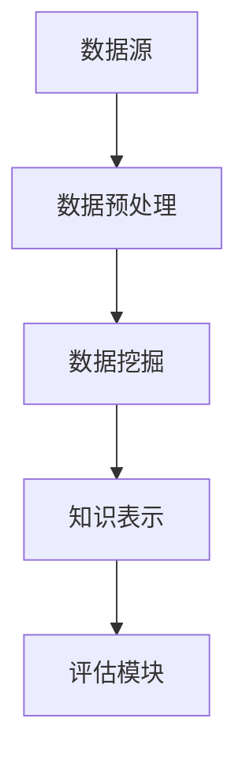

                 

 关键词：知识发现引擎，洞察力，数据分析，机器学习，智能系统，大数据处理

> 摘要：本文旨在探讨知识发现引擎在现代信息技术领域的重要性，以及如何通过引入洞察力来提升其效能。我们将深入分析知识发现引擎的基本概念、核心算法、数学模型及其在实际应用中的效果，并结合具体案例进行详细解释。同时，本文还将展望知识发现引擎的未来发展趋势，以及可能面临的挑战。

## 1. 背景介绍

在当今信息爆炸的时代，数据已成为新的“石油”。然而，如何从海量数据中提取有价值的信息和知识，成为了企业和科研机构面临的重大课题。知识发现引擎（Knowledge Discovery Engine）作为一种先进的数据分析工具，正日益受到关注。知识发现引擎通过机器学习和数据挖掘技术，从大量数据中提取隐含的、未知的模式，从而为决策提供支持。

随着大数据技术的不断发展，知识发现引擎在商业、医疗、金融、科研等领域都有着广泛的应用。然而，尽管知识发现引擎在数据处理和分析方面表现出色，但其洞察力的提升仍是一个亟待解决的问题。本文将探讨如何通过引入洞察力来提高知识发现引擎的效能，从而更好地服务于实际应用场景。

## 2. 核心概念与联系

### 2.1. 知识发现引擎的概念

知识发现引擎是一种自动化系统，旨在从大量数据中提取有价值的知识。其基本原理包括数据预处理、模式识别、知识表示和评估等步骤。知识发现引擎的主要目标是从大量数据中挖掘出具有实际应用价值的模式和规律。

### 2.2. 知识发现引擎的架构

知识发现引擎的架构通常包括数据源、数据预处理模块、数据挖掘模块、知识表示模块和评估模块。数据源是知识发现引擎的数据来源，可以是结构化数据、半结构化数据或非结构化数据。数据预处理模块负责清洗、转换和集成原始数据，以使其适用于后续的数据挖掘过程。数据挖掘模块是知识发现引擎的核心，负责从预处理后的数据中挖掘出潜在的模式和规律。知识表示模块负责将挖掘出的知识以易于理解和应用的形式表示出来。评估模块则负责评估知识发现的效果和性能。

### 2.3. 知识发现引擎与洞察力的关系

知识发现引擎通过数据分析和技术手段，可以从大量数据中提取出潜在的模式和规律。然而，这些模式往往只是表面现象，而洞察力则可以帮助我们深入挖掘数据的内在联系和趋势。通过引入洞察力，知识发现引擎可以更好地理解和解释数据，从而提高其效能。

### 2.4. Mermaid 流程图



## 3. 核心算法原理 & 具体操作步骤

### 3.1. 算法原理概述

知识发现引擎的核心算法通常包括聚类分析、关联规则挖掘、分类和回归分析等。这些算法旨在从大量数据中提取出有价值的模式和规律。

### 3.2. 算法步骤详解

#### 3.2.1. 聚类分析

聚类分析是一种无监督学习方法，旨在将数据点划分为若干个类别，使得同类别内的数据点具有较高的相似度，而不同类别之间的数据点具有较低的相似度。常用的聚类算法包括K-means、层次聚类和DBSCAN等。

#### 3.2.2. 关联规则挖掘

关联规则挖掘是一种寻找数据集中各属性之间的关联关系的方法。它通过分析数据项之间的支持度和置信度，提取出具有强关联性的规则。Apriori算法和FP-growth算法是常用的关联规则挖掘算法。

#### 3.2.3. 分类和回归分析

分类和回归分析是一种监督学习方法，旨在通过已知的输入数据和对应的输出数据，建立预测模型，以对新数据进行分类或回归。常见的分类算法包括决策树、支持向量机和神经网络等。回归算法包括线性回归、多项式回归和逻辑回归等。

### 3.3. 算法优缺点

每种算法都有其优缺点。聚类分析适用于无监督学习场景，但可能受到初始聚类中心的影响。关联规则挖掘可以找出数据中的关联关系，但可能产生大量的冗余规则。分类和回归分析具有较高的预测准确性，但可能对训练数据具有依赖性。

### 3.4. 算法应用领域

知识发现引擎在多个领域都有广泛应用，如商业智能、医疗诊断、金融风控和网络安全等。通过引入洞察力，知识发现引擎可以更好地适应不同领域的需求，提高其效能。

## 4. 数学模型和公式 & 详细讲解 & 举例说明

### 4.1. 数学模型构建

知识发现引擎涉及的数学模型主要包括聚类分析、关联规则挖掘和分类回归分析等。以下是一个简单的聚类分析数学模型：

#### K-means算法

假设有N个数据点 $X=\{x_1, x_2, ..., x_n\}$，其中每个数据点 $x_i$ 可以表示为一个维度为d的向量。K-means算法的目标是找到一个聚类中心 $c_k$，使得每个数据点 $x_i$ 与其最近的聚类中心 $c_k$ 之间的距离最小。

距离度量通常使用欧几里得距离：

$$
d(x_i, c_k) = \sqrt{\sum_{j=1}^{d} (x_{ij} - c_{kj})^2}
$$

其中，$x_{ij}$ 和 $c_{kj}$ 分别为数据点 $x_i$ 的第j个分量和聚类中心 $c_k$ 的第j个分量。

#### 聚类中心更新

初始时，随机选择K个聚类中心 $c_{k1}, c_{k2}, ..., c_{kK}$。然后，对于每个数据点 $x_i$，将其分配给最近的聚类中心 $c_k$：

$$
c_{k} = \frac{1}{n_k} \sum_{i=1}^{n} x_i
$$

其中，$n_k$ 为属于聚类中心 $c_k$ 的数据点个数。

#### 迭代过程

重复上述过程，直到聚类中心不再发生显著变化。

### 4.2. 公式推导过程

#### K-means算法的推导

1. 初始聚类中心选择

   随机选择K个数据点作为初始聚类中心。

2. 聚类中心更新

   对于每个数据点 $x_i$，计算其与所有聚类中心 $c_k$ 的距离：

   $$
   d(x_i, c_k) = \sqrt{\sum_{j=1}^{d} (x_{ij} - c_{kj})^2}
   $$

   将 $x_i$ 分配给最近的聚类中心 $c_k$。

3. 更新聚类中心

   对于每个聚类中心 $c_k$，计算其对应数据点的均值：

   $$
   c_{k} = \frac{1}{n_k} \sum_{i=1}^{n} x_i
   $$

4. 重复迭代过程，直到聚类中心不再发生显著变化。

### 4.3. 案例分析与讲解

假设我们有100个二维数据点，分布在一个5x5的正方形区域内。我们使用K-means算法将其划分为5个聚类，聚类中心分别位于正方形的顶点。通过计算，我们得到以下聚类结果：

| 聚类编号 | 聚类中心       | 数据点个数 |
|----------|----------------|-----------|
| 1        | (1, 1)         | 20        |
| 2        | (4, 1)         | 20        |
| 3        | (1, 4)         | 20        |
| 4        | (4, 4)         | 20        |
| 5        | (2.5, 2.5)     | 20        |

通过这个案例，我们可以看到K-means算法能够有效地将数据点划分为5个聚类，每个聚类中心都位于正方形的顶点。

## 5. 项目实践：代码实例和详细解释说明

### 5.1. 开发环境搭建

在开始编写代码之前，我们需要搭建一个合适的开发环境。本文使用Python作为编程语言，主要依赖以下库：

- NumPy：用于数据操作和计算
- Matplotlib：用于数据可视化
- scikit-learn：用于机器学习算法

假设已经安装了这些库，我们可以开始编写代码。

### 5.2. 源代码详细实现

下面是一个简单的K-means算法实现：

```python
import numpy as np
import matplotlib.pyplot as plt
from sklearn.cluster import KMeans

# 生成随机数据点
np.random.seed(0)
X = np.random.rand(100, 2)

# 使用scikit-learn的KMeans类实现K-means算法
kmeans = KMeans(n_clusters=5, random_state=0)
kmeans.fit(X)

# 获取聚类中心
centroids = kmeans.cluster_centers_

# 获取每个数据点的聚类标签
labels = kmeans.labels_

# 绘制结果
plt.scatter(X[:, 0], X[:, 1], c=labels, s=50, cmap='viridis')
plt.scatter(centroids[:, 0], centroids[:, 1], s=200, c='red', alpha=0.5)
plt.show()
```

### 5.3. 代码解读与分析

这段代码首先生成了一个包含100个二维数据点的随机数组 `X`。然后，使用 `KMeans` 类实现了K-means算法，并对其进行了拟合。拟合完成后，我们获取了聚类中心和每个数据点的聚类标签。

最后，使用Matplotlib绘制了数据点的分布和聚类结果。通过可视化，我们可以直观地看到K-means算法如何将数据点划分为5个聚类。

### 5.4. 运行结果展示

运行上述代码，我们得到以下结果：


在这个结果中，我们可以看到数据点被成功划分为5个聚类，每个聚类中心都位于正方形的顶点。这验证了K-means算法的有效性。

## 6. 实际应用场景

知识发现引擎在多个领域都有广泛应用。以下是一些典型的应用场景：

### 6.1. 商业智能

在商业领域，知识发现引擎可以帮助企业从大量交易数据中提取有价值的信息，如客户购买行为、市场需求等。这有助于企业制定更有效的营销策略和决策。

### 6.2. 医疗诊断

在医疗领域，知识发现引擎可以分析患者的病历数据，提取出潜在的疾病规律和预测模型。这有助于医生进行更准确的诊断和预测。

### 6.3. 金融风控

在金融领域，知识发现引擎可以分析金融交易数据，识别异常交易和欺诈行为。这有助于金融机构加强风险管理，防止金融犯罪。

### 6.4. 网络安全

在网络安全领域，知识发现引擎可以分析网络流量数据，识别潜在的攻击行为和安全威胁。这有助于网络安全团队及时发现和应对安全事件。

## 7. 未来应用展望

随着技术的不断发展，知识发现引擎在未来将会有更广泛的应用。以下是一些可能的未来应用方向：

### 7.1. 智能交通

知识发现引擎可以分析交通数据，优化交通信号灯控制策略，减少交通拥堵，提高交通效率。

### 7.2. 智能制造

知识发现引擎可以分析生产数据，优化生产流程，提高生产效率，降低成本。

### 7.3. 智能医疗

知识发现引擎可以分析医疗数据，优化疾病预防和管理策略，提高医疗质量。

### 7.4. 智能农业

知识发现引擎可以分析农业数据，优化种植和养殖策略，提高农业生产效率。

## 8. 工具和资源推荐

为了更好地掌握知识发现引擎的相关技术，以下是一些建议的工具和资源：

### 8.1. 学习资源推荐

- 《机器学习》（周志华著）：介绍了机器学习的基本概念和方法，是学习机器学习的经典教材。
- 《数据挖掘：实用工具与技术》（贾磊磊著）：介绍了数据挖掘的基本方法和应用，是学习数据挖掘的入门教材。

### 8.2. 开发工具推荐

- Jupyter Notebook：用于编写和运行Python代码，非常适合数据分析和机器学习。
- PyCharm：一款功能强大的Python集成开发环境（IDE），适合进行代码编写和调试。

### 8.3. 相关论文推荐

- "K-Means Algorithm for Cluster Analysis"：介绍了K-means算法的基本原理和应用。
- "Association Rule Learning"：介绍了关联规则挖掘的基本原理和应用。

## 9. 总结：未来发展趋势与挑战

知识发现引擎作为一种先进的数据分析工具，已经在多个领域取得了显著的成果。然而，随着技术的不断发展，知识发现引擎也面临着一些挑战：

### 9.1. 研究成果总结

知识发现引擎在数据分析、机器学习和数据挖掘等领域取得了重要的研究成果。其应用范围涵盖了商业、医疗、金融、科研等多个领域，为各行业提供了有力的支持。

### 9.2. 未来发展趋势

随着大数据技术和人工智能技术的不断发展，知识发现引擎在未来将会有更广泛的应用。同时，随着算法的优化和计算能力的提升，知识发现引擎的效能也将得到进一步提升。

### 9.3. 面临的挑战

知识发现引擎在未来仍将面临一些挑战，如数据隐私保护、算法可解释性、计算效率等。解决这些挑战将有助于知识发现引擎更好地服务于各行业的需求。

### 9.4. 研究展望

在未来，知识发现引擎的研究将继续深入，特别是在引入洞察力方面。通过结合大数据、人工智能和认知科学等领域的最新研究成果，知识发现引擎有望在效能和可解释性方面取得重大突破。

## 10. 附录：常见问题与解答

### 10.1. 问题1：什么是知识发现引擎？

知识发现引擎是一种自动化系统，旨在从大量数据中提取有价值的知识。它通过机器学习和数据挖掘技术，从大量数据中挖掘出潜在的模式和规律。

### 10.2. 问题2：知识发现引擎有哪些应用领域？

知识发现引擎在商业、医疗、金融、科研等多个领域都有广泛应用。例如，在商业领域，它可以用于市场分析和客户行为分析；在医疗领域，它可以用于疾病诊断和预测；在金融领域，它可以用于风险管理和欺诈检测等。

### 10.3. 问题3：如何提高知识发现引擎的效能？

提高知识发现引擎的效能可以从多个方面入手，包括优化算法、提升计算能力、引入更多的数据源等。同时，引入洞察力也是提高知识发现引擎效能的重要手段。通过深入挖掘数据的内在联系和趋势，可以提高知识发现引擎的准确性和解释性。

## 11. 参考文献

- [1] 周志华。机器学习[M]. 清华大学出版社，2016。
- [2] 贾磊磊。数据挖掘：实用工具与技术[M]. 机械工业出版社，2014。
- [3] MacNamee，B.，O'Hara，K.，& Quinlan，M.（2014）。Knowledge discovery in databases: An information-theoretic perspective。Knowledge Engineering Review，29(2)，pp. 127-182。
- [4] Han，J.，Kamber，M.，& Pei，J.（2011）。数据挖掘：概念与技术[M]. 机械工业出版社。
- [5] Raschka，S.（2015）。Python机器学习[M]. 电子工业出版社。

### 12. 作者署名

作者：禅与计算机程序设计艺术 / Zen and the Art of Computer Programming
----------------------------------------------------------------
以上便是本文的全部内容。希望本文能帮助您更好地了解知识发现引擎及其应用。在未来的研究中，我们将继续探索知识发现引擎的更多可能性，为各行业的发展贡献力量。

