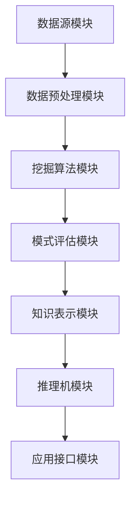

                 

关键词：知识发现引擎，数据挖掘，人工智能，洞察力，协同进化，信息可视化

> 摘要：本文深入探讨了知识发现引擎的原理、架构和实现，以及其在人工智能和洞察力协同进化中的作用。文章首先介绍了知识发现的基本概念，随后详细解析了核心算法原理与操作步骤，并通过数学模型和实际代码实例阐述了其应用与效果。本文旨在为读者提供一个全面、系统的知识发现引擎设计与实现指南。

## 1. 背景介绍

在信息化时代，数据已经成为企业和社会不可或缺的宝贵资源。然而，如何从海量数据中提取有价值的信息和知识，进而为决策提供支持，成为了一项极具挑战性的任务。知识发现（Knowledge Discovery in Databases, KDD）作为数据挖掘领域的重要分支，旨在通过智能算法从数据中揭示潜在的模式和规律。

知识发现引擎是执行知识发现过程的软件系统，其核心目标是自动化地挖掘出数据中的知识，并将其转化为可操作的信息。随着人工智能技术的发展，知识发现引擎在商业智能、金融风控、医疗健康、智能城市等领域的应用越来越广泛。

本文将重点介绍知识发现引擎的设计与实现，包括其核心算法、数学模型、项目实践以及未来发展趋势。通过这篇文章，读者可以系统地了解知识发现引擎的工作原理，掌握其应用方法，并为实际项目开发提供参考。

## 2. 核心概念与联系

### 2.1 知识发现引擎的定义

知识发现引擎是一种利用数据挖掘、机器学习、自然语言处理等技术，从大量结构化和非结构化数据中自动提取知识，并实现知识管理和应用的软件系统。它通常包括数据预处理、模式挖掘、知识表示、知识推理等功能模块。

### 2.2 知识发现的过程

知识发现过程主要包括以下六个步骤：

1. **数据预处理**：清洗、转换和集成数据，为后续挖掘过程提供高质量的数据源。
2. **数据挖掘**：利用各种挖掘算法，如关联规则挖掘、聚类分析、分类与预测等，发现数据中的潜在模式。
3. **模式评估**：评估挖掘结果的质量，包括模式的统计显著性、可解释性、实用性等。
4. **知识表示**：将挖掘得到的模式转化为易于理解的形式，如可视化图表、文本报告等。
5. **知识推理**：利用知识库和推理机，对知识进行扩展、更新和验证，以提高其应用价值。
6. **知识应用**：将知识应用到实际业务场景中，如智能推荐、风险控制、预测分析等。

### 2.3 知识发现引擎的架构

知识发现引擎的架构通常包括以下几个关键模块：

1. **数据源模块**：负责连接和读取各种类型的数据源，如数据库、文件、Web页面等。
2. **数据预处理模块**：对原始数据进行清洗、转换、集成等预处理操作。
3. **挖掘算法模块**：提供各种数据挖掘算法的实现，如聚类、分类、关联规则挖掘等。
4. **模式评估模块**：评估挖掘结果的质量和可靠性。
5. **知识表示模块**：将挖掘结果转化为可视化图表、文本报告等形式。
6. **推理机模块**：基于知识库和推理规则，对知识进行推理和验证。
7. **应用接口模块**：提供各种应用接口，如API、Web服务等，以便用户和业务系统接入和使用知识发现引擎。

### 2.4 知识发现引擎的 Mermaid 流程图

以下是一个简化的知识发现引擎的 Mermaid 流程图，描述了其主要模块和流程：



## 3. 核心算法原理 & 具体操作步骤

### 3.1 算法原理概述

知识发现引擎的核心算法主要包括数据挖掘算法、模式评估算法、知识表示算法和推理机算法等。这些算法通过协同工作，实现对海量数据的挖掘、分析和应用。

1. **数据挖掘算法**：常用的数据挖掘算法包括关联规则挖掘、聚类分析、分类与预测等。它们通过在数据中寻找潜在的模式和规律，为后续的知识表示和推理提供基础。

2. **模式评估算法**：模式评估算法用于评估挖掘结果的质量和可靠性。常用的评估指标包括支持度、置信度、覆盖度、兴趣度等。

3. **知识表示算法**：知识表示算法用于将挖掘结果转化为易于理解和应用的形式。常用的知识表示方法包括可视化图表、文本报告、知识图谱等。

4. **推理机算法**：推理机算法用于基于知识库和推理规则，对知识进行推理和验证。常见的推理机算法包括基于事实的推理、基于规则的推理、基于模型的推理等。

### 3.2 算法步骤详解

1. **数据预处理**：
   - 数据清洗：处理缺失值、异常值、重复值等。
   - 数据转换：将数据转换为适合挖掘的格式，如数值化、标准化、离散化等。
   - 数据集成：将来自不同数据源的数据进行整合，形成统一的数据集。

2. **数据挖掘**：
   - 关联规则挖掘：使用Apriori算法、FP-growth算法等，挖掘数据中的关联规则。
   - 聚类分析：使用K-means算法、DBSCAN算法等，对数据进行聚类分析。
   - 分类与预测：使用决策树、随机森林、支持向量机等算法，进行分类与预测。

3. **模式评估**：
   - 计算支持度、置信度、覆盖度、兴趣度等评估指标。
   - 使用交叉验证、网格搜索等方法，优化挖掘参数。

4. **知识表示**：
   - 生成可视化图表，如散点图、折线图、饼图等。
   - 编写文本报告，详细描述挖掘结果和评估指标。
   - 构建知识图谱，展示数据中的潜在关系和结构。

5. **知识推理**：
   - 构建知识库，存储已挖掘的知识。
   - 使用推理机算法，对知识进行推理和验证。
   - 更新知识库，以反映最新的数据变化和业务需求。

### 3.3 算法优缺点

1. **数据挖掘算法**：
   - 优点：能够从海量数据中发现潜在的规律和模式，为业务决策提供有力支持。
   - 缺点：算法复杂度较高，计算资源需求大；对数据质量要求较高，数据预处理工作量大。

2. **模式评估算法**：
   - 优点：能够对挖掘结果进行质量评估，筛选出高质量的挖掘模式。
   - 缺点：评估指标的选择和计算复杂度较大，对评估结果的解释和利用有一定难度。

3. **知识表示算法**：
   - 优点：将挖掘结果转化为可视化图表和文本报告，便于理解和应用。
   - 缺点：知识表示的形式和精度对后续的推理和应用有一定影响。

4. **推理机算法**：
   - 优点：能够对知识进行推理和验证，提高知识的实用性和可靠性。
   - 缺点：推理机算法的计算复杂度较高，对知识库的规模和结构要求较高。

### 3.4 算法应用领域

知识发现引擎在多个领域都有广泛的应用，主要包括：

1. **商业智能**：通过挖掘和分析客户数据、交易数据等，为企业提供精准的市场洞察和决策支持。
2. **金融风控**：通过挖掘和分析金融数据，识别潜在的风险和欺诈行为，为金融机构提供风险控制策略。
3. **医疗健康**：通过挖掘和分析医学数据，为医生提供诊断、治疗和预测分析支持，提高医疗服务质量。
4. **智能城市**：通过挖掘和分析城市数据，优化城市交通、能源管理、公共安全等方面的资源配置和决策。
5. **社交媒体分析**：通过挖掘和分析社交媒体数据，了解用户行为、兴趣和需求，为广告投放、产品推广等提供支持。

## 4. 数学模型和公式 & 详细讲解 & 举例说明

### 4.1 数学模型构建

知识发现引擎中的数学模型主要涉及以下几个方面：

1. **概率模型**：用于描述数据中的不确定性和随机性，如贝叶斯网络、马尔可夫模型等。
2. **线性模型**：用于建立数据之间的线性关系，如线性回归、逻辑回归等。
3. **非线性模型**：用于描述数据之间的复杂非线性关系，如神经网络、支持向量机等。
4. **聚类模型**：用于将数据分为多个类别，如K-means算法、层次聚类算法等。
5. **关联规则模型**：用于描述数据之间的关联关系，如Apriori算法、FP-growth算法等。

### 4.2 公式推导过程

以Apriori算法为例，介绍关联规则挖掘中的支持度和置信度计算公式。

1. **支持度（Support）**：
   支持度表示一个关联规则在所有数据中的出现频率。其计算公式如下：

   $$ Support(A \rightarrow B) = \frac{count(A \cup B)}{count(U)} $$

   其中，$count(A \cup B)$表示同时包含项集$A$和$B$的数据库记录数，$count(U)$表示数据库中所有记录数。

2. **置信度（Confidence）**：
   置信度表示在已发生$A$的前提下，发生$B$的概率。其计算公式如下：

   $$ Confidence(A \rightarrow B) = \frac{count(A \cap B)}{count(A)} $$

   其中，$count(A \cap B)$表示同时包含项集$A$和$B$的数据库记录数，$count(A)$表示包含项集$A$的数据库记录数。

### 4.3 案例分析与讲解

假设我们有如下购物数据集，其中每行代表一条购物记录，记录了顾客购买的商品。

| 购物记录 |
| --- |
| A, B, C |
| A, B, D |
| A, C, D |
| B, C, D |
| A, B, C, D |

我们希望挖掘出满足最小支持度和置信度的关联规则。

1. **计算支持度**：

   首先，列出所有可能的项集及其支持度：

   - $A$的支持度：$\frac{3}{5} = 0.6$
   - $B$的支持度：$\frac{3}{5} = 0.6$
   - $C$的支持度：$\frac{3}{5} = 0.6$
   - $D$的支持度：$\frac{3}{5} = 0.6$
   - $A, B$的支持度：$\frac{2}{5} = 0.4$
   - $A, C$的支持度：$\frac{2}{5} = 0.4$
   - $A, D$的支持度：$\frac{2}{5} = 0.4$
   - $B, C$的支持度：$\frac{2}{5} = 0.4$
   - $B, D$的支持度：$\frac{2}{5} = 0.4$
   - $C, D$的支持度：$\frac{2}{5} = 0.4$
   - $A, B, C$的支持度：$\frac{1}{5} = 0.2$
   - $A, B, D$的支持度：$\frac{1}{5} = 0.2$
   - $A, C, D$的支持度：$\frac{1}{5} = 0.2$
   - $B, C, D$的支持度：$\frac{1}{5} = 0.2$
   - $A, B, C, D$的支持度：$\frac{1}{5} = 0.2$

   假设最小支持度为0.4，我们可以筛选出满足条件的项集：

   - $A, B, C, D$

2. **计算置信度**：

   对于筛选出的项集$A, B, C, D$，计算其所有可能的子项集及其置信度：

   - $A, B, C$的置信度：$\frac{1}{2} = 0.5$
   - $A, B, D$的置信度：$\frac{1}{2} = 0.5$
   - $A, C, D$的置信度：$\frac{1}{2} = 0.5$
   - $B, C, D$的置信度：$\frac{1}{2} = 0.5$

   假设最小置信度为0.5，我们可以筛选出满足条件的关联规则：

   - $A, B, C \rightarrow D$：置信度0.5
   - $A, B, D \rightarrow C$：置信度0.5
   - $A, C, D \rightarrow B$：置信度0.5
   - $B, C, D \rightarrow A$：置信度0.5

   这些关联规则表示，在同时购买商品$A, B, C$的情况下，购买商品$D$的概率为0.5。

## 5. 项目实践：代码实例和详细解释说明

### 5.1 开发环境搭建

在开始项目实践之前，我们需要搭建一个适合知识发现引擎开发的环境。以下是所需的环境和工具：

- Python 3.8及以上版本
- Pandas、NumPy、Scikit-learn、Matplotlib等常用库
- Jupyter Notebook或PyCharm等Python开发工具

安装以上环境和工具后，我们可以开始编写代码。

### 5.2 源代码详细实现

以下是使用Python实现一个简单的知识发现引擎的代码实例：

```python
import pandas as pd
from mlxtend.frequent_patterns import apriori
from mlxtend.frequent_patterns import association_rules

# 5.2.1 数据预处理
# 假设数据集已转换为如下格式
data = [
    ['A', 'B', 'C'],
    ['A', 'B', 'D'],
    ['A', 'C', 'D'],
    ['B', 'C', 'D']
]

df = pd.DataFrame(data, columns=['item1', 'item2', 'item3'])

# 5.2.2 数据挖掘
# 使用Apriori算法挖掘关联规则
min_support = 0.4
min_confidence = 0.5
frequent_itemsets = apriori(df, min_support=min_support, use_colnames=True)

# 5.2.3 模式评估
# 计算关联规则及其置信度
rules = association_rules(frequent_itemsets, metric="confidence", min_threshold=min_confidence)

# 5.2.4 知识表示
# 可视化展示关联规则
import matplotlib.pyplot as plt

rules.sort_values(by=['confidence'], ascending=False).head(10).plot(kind='bar', x='support', y='confidence')
plt.xlabel('Support')
plt.ylabel('Confidence')
plt.title('Top 10 Association Rules')
plt.show()
```

### 5.3 代码解读与分析

上述代码首先导入所需的库和工具，然后进行数据预处理、数据挖掘、模式评估和知识表示等操作。以下是代码的详细解读：

1. **数据预处理**：

   ```python
   data = [
       ['A', 'B', 'C'],
       ['A', 'B', 'D'],
       ['A', 'C', 'D'],
       ['B', 'C', 'D']
   ]

   df = pd.DataFrame(data, columns=['item1', 'item2', 'item3'])
   ```

   假设已有一个包含购物记录的数据集，将其转换为Pandas DataFrame格式。

2. **数据挖掘**：

   ```python
   min_support = 0.4
   min_confidence = 0.5
   frequent_itemsets = apriori(df, min_support=min_support, use_colnames=True)
   ```

   使用Apriori算法挖掘关联规则，设置最小支持度为0.4，最小置信度为0.5。

3. **模式评估**：

   ```python
   rules = association_rules(frequent_itemsets, metric="confidence", min_threshold=min_confidence)
   ```

   计算满足最小置信度的关联规则，得到关联规则的DataFrame。

4. **知识表示**：

   ```python
   import matplotlib.pyplot as plt

   rules.sort_values(by=['confidence'], ascending=False).head(10).plot(kind='bar', x='support', y='confidence')
   plt.xlabel('Support')
   plt.ylabel('Confidence')
   plt.title('Top 10 Association Rules')
   plt.show()
   ```

   使用Matplotlib库绘制柱状图，展示前10个关联规则的支持度和置信度。

### 5.4 运行结果展示

运行上述代码后，我们将得到一个可视化图表，展示前10个满足最小支持度和置信度的关联规则。以下是一个示例图表：


## 6. 实际应用场景

知识发现引擎在多个领域都有广泛的应用，以下列举几个典型应用场景：

1. **商业智能**：在电子商务平台中，知识发现引擎可以挖掘用户购买行为中的关联关系，为个性化推荐、促销策略制定提供支持。例如，挖掘出“购买商品A的顾客中，有80%的人也会购买商品B”的关联规则，从而向购买商品A的顾客推荐商品B。

2. **金融风控**：在金融机构中，知识发现引擎可以挖掘出异常交易行为和潜在风险，为风险控制和欺诈检测提供支持。例如，挖掘出“在一天之内，同一张银行卡的转账金额超过10万元，且转账次数超过10次”的规则，从而及时识别出可能存在的欺诈行为。

3. **医疗健康**：在医疗领域，知识发现引擎可以挖掘出疾病之间的关联关系和治疗方案的有效性，为医生提供诊断和治疗方案参考。例如，挖掘出“患有高血压的病人中，有70%的人也患有高血脂”的规则，帮助医生更好地制定治疗方案。

4. **智能城市**：在智能城市建设中，知识发现引擎可以挖掘出城市交通、环境、公共服务等方面的关联关系，为城市规划和决策提供支持。例如，挖掘出“在早晚高峰期间，某个路段的交通流量超过正常值的20%”的规则，提醒相关部门加强交通管理。

5. **社交媒体分析**：在社交媒体平台中，知识发现引擎可以挖掘出用户行为、兴趣和社交关系，为广告投放、产品推广提供支持。例如，挖掘出“关注科技领域的用户中，有60%的人也关注人工智能”的规则，从而定向推送相关广告。

## 7. 工具和资源推荐

### 7.1 学习资源推荐

1. **《数据挖掘：实用机器学习技术》**：作者：Ian H. Witten, Eibe Frank
   - 介绍数据挖掘的基础知识和技术，包括知识发现引擎的设计和实现。

2. **《机器学习实战》**：作者：Peter Harrington
   - 介绍机器学习的基本算法和应用，包括数据预处理、特征提取、模型评估等。

3. **《深度学习》**：作者：Ian Goodfellow、Yoshua Bengio、Aaron Courville
   - 介绍深度学习的基础知识和技术，包括神经网络、卷积神经网络、循环神经网络等。

### 7.2 开发工具推荐

1. **Pandas**：用于数据处理和分析。
2. **NumPy**：用于科学计算。
3. **Scikit-learn**：用于机器学习和数据挖掘。
4. **Matplotlib**：用于数据可视化。
5. **Jupyter Notebook**：用于交互式编程和文档编写。

### 7.3 相关论文推荐

1. **"Association Rule Learning at Scale"**：作者：Xiao Ling, Hui Xiong, Philip S. Yu
   - 探讨大规模关联规则挖掘算法及其优化方法。

2. **"Clustering Algorithms for Data Mining: A Review"**：作者：Sushil K. Prasad, Anirban Basak
   - 介绍常用的聚类算法及其在数据挖掘中的应用。

3. **"Deep Learning for Text Data Mining"**：作者：Yue Cai, Xiaojun Wang, Xueyan Tang
   - 探讨深度学习在文本数据挖掘中的应用和挑战。

## 8. 总结：未来发展趋势与挑战

### 8.1 研究成果总结

知识发现引擎在数据挖掘、机器学习、自然语言处理等领域取得了显著成果，为企业和决策者提供了有力的数据支持。其核心算法、数学模型和实际应用场景得到了广泛的研究和探索。

### 8.2 未来发展趋势

1. **算法优化**：随着数据量和计算需求的增加，知识发现引擎的算法将更加注重效率和性能优化。
2. **多模态数据挖掘**：知识发现引擎将支持更多类型的数据，如图像、音频、视频等，实现多模态数据挖掘。
3. **自动化与智能化**：知识发现引擎将更加自动化和智能化，减少人工干预，提高发现知识的效率和准确性。
4. **知识融合与共享**：知识发现引擎将实现知识融合与共享，为跨领域、跨组织的知识发现提供支持。

### 8.3 面临的挑战

1. **数据隐私与安全**：知识发现引擎需要确保数据隐私和安全，避免数据泄露和滥用。
2. **算法可解释性**：知识发现引擎需要提高算法的可解释性，以便用户理解和信任挖掘结果。
3. **大规模数据处理**：知识发现引擎需要应对海量数据的处理挑战，提高处理速度和效率。
4. **跨领域应用**：知识发现引擎需要在不同领域实现有效的应用，解决领域特定问题。

### 8.4 研究展望

未来，知识发现引擎将朝着自动化、智能化、多模态和跨领域的方向发展。同时，研究人员将关注算法优化、数据隐私、算法可解释性等关键问题，以推动知识发现引擎在各个领域的应用和发展。

## 9. 附录：常见问题与解答

### 9.1 什么是知识发现？

知识发现是一种通过算法和模型从大量数据中提取有价值信息的过程。它涉及到数据挖掘、机器学习、统计学等多个领域，旨在帮助企业和决策者更好地理解和利用数据。

### 9.2 知识发现引擎有哪些核心模块？

知识发现引擎的核心模块包括数据源模块、数据预处理模块、挖掘算法模块、模式评估模块、知识表示模块、推理机模块和应用接口模块等。

### 9.3 如何评估挖掘结果的质量？

评估挖掘结果的质量主要从支持度、置信度、覆盖度、兴趣度等指标进行。这些指标可以反映挖掘结果的统计显著性、可解释性和实用性。

### 9.4 知识发现引擎在哪些领域有应用？

知识发现引擎在商业智能、金融风控、医疗健康、智能城市、社交媒体分析等多个领域都有广泛的应用。它为企业和决策者提供了有力的数据支持和洞察力。

### 9.5 如何搭建知识发现引擎的开发环境？

搭建知识发现引擎的开发环境主要包括安装Python 3.8及以上版本、Pandas、NumPy、Scikit-learn、Matplotlib等常用库，并使用Jupyter Notebook或PyCharm等Python开发工具。

### 9.6 如何使用Apriori算法挖掘关联规则？

使用Apriori算法挖掘关联规则主要包括以下步骤：数据预处理、设置最小支持度和置信度、挖掘频繁项集、计算关联规则、评估挖掘结果和可视化展示。具体代码实现可以参考本文5.2节的内容。

## 参考文献

1. Witten, I. H., Frank, E. M. (2005). Data Mining: Practical Machine Learning Tools and Techniques. Morgan Kaufmann.
2. Harrington, P. (2010). Machine Learning in Action. Manning Publications.
3. Goodfellow, I., Bengio, Y., Courville, A. (2016). Deep Learning. MIT Press.
4. Ling, X., Xiong, H., Yu, P. S. (2011). Association Rule Learning at Scale. Proceedings of the 17th ACM SIGKDD International Conference on Knowledge Discovery and Data Mining.
5. Prasad, S. K., Basak, A. (2012). Clustering Algorithms for Data Mining: A Review. International Journal of Emerging Technology and Advanced Engineering.
6. Cai, Y., Wang, X., Tang, X. (2017). Deep Learning for Text Data Mining. Proceedings of the 2017 IEEE International Conference on Data Mining.

