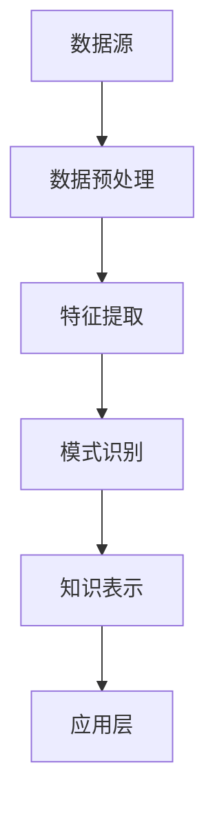

                 

关键词：知识发现，机器学习，人工智能，大数据分析，算法优化，知识图谱，数据挖掘，智能推荐系统，预测分析

> 摘要：本文旨在深入探讨知识发现引擎的工作原理、核心算法和实际应用。我们将从背景介绍开始，逐步分析核心概念与联系，探讨核心算法原理及操作步骤，引入数学模型和公式，通过实例讲解项目实践，并探讨实际应用场景，最后对未来发展进行展望。

## 1. 背景介绍

随着信息技术的飞速发展，大数据时代已经来临。企业、政府和科研机构每天都会产生海量的数据，这些数据包含着丰富的知识和潜在的价值。然而，如何从这些数据中提取出有价值的信息和洞见，成为了一个极具挑战性的问题。知识发现引擎（Knowledge Discovery Engine）作为一种新兴的技术，应运而生，旨在帮助我们从大量数据中挖掘出有价值的知识。

知识发现引擎的定义是指一种自动化的数据处理和分析系统，它能够从大量数据中识别出潜在的、未被发现的模式和关联，并将其转化为有用的知识和洞见。这种系统通常包括数据预处理、特征提取、模式识别和知识表示等多个步骤。

在过去的几十年中，知识发现引擎在许多领域都取得了显著的应用成果。例如，在金融行业，知识发现引擎可以帮助银行和保险公司识别潜在的欺诈行为；在零售行业，知识发现引擎可以帮助商家优化库存管理和营销策略；在医疗行业，知识发现引擎可以帮助医生分析患者数据，提供个性化的治疗方案。然而，随着数据规模的不断扩大和数据类型的日益复杂，知识发现引擎也面临着新的挑战。

本文将深入探讨知识发现引擎的工作原理、核心算法和实际应用。我们将首先介绍知识发现引擎的核心概念和架构，然后分析其核心算法原理和操作步骤，接着介绍相关的数学模型和公式，并通过具体项目实例讲解其实际应用过程。最后，我们将探讨知识发现引擎在各个领域的实际应用场景，并对其未来发展进行展望。

## 2. 核心概念与联系

### 2.1 知识发现引擎的基本概念

知识发现引擎（Knowledge Discovery Engine，简称KDE）是一种通过数据挖掘技术从大规模数据集中发现潜在知识、模式和关联的系统。它主要涉及以下基本概念：

- **数据源（Data Source）**：知识发现引擎的数据来源可以是结构化数据（如关系数据库）、半结构化数据（如XML文件）和非结构化数据（如文本、图像、视频等）。

- **数据预处理（Data Preprocessing）**：在数据进入知识发现引擎之前，通常需要进行数据清洗、去噪、格式转换等预处理操作，以确保数据的质量和一致性。

- **特征提取（Feature Extraction）**：特征提取是知识发现过程中的关键步骤，它通过从原始数据中提取出具有区分性的特征，有助于提高后续模式识别的准确性和效率。

- **模式识别（Pattern Recognition）**：模式识别是知识发现引擎的核心功能之一，它通过算法分析数据中的特征，识别出潜在的模式和关联。

- **知识表示（Knowledge Representation）**：知识表示是将识别出的模式和关联转化为易于理解和应用的形式，如规则、图谱、可视化等。

### 2.2 知识发现引擎的架构

知识发现引擎的架构通常包括以下主要组件：

- **数据层（Data Layer）**：负责管理数据源、数据预处理和存储。

- **算法层（Algorithm Layer）**：提供各种数据挖掘算法，如分类、聚类、关联规则挖掘、异常检测等。

- **模型层（Model Layer）**：将算法层生成的模型进行优化和集成，以便更好地应用于实际场景。

- **应用层（Application Layer）**：提供知识表示、可视化、接口等工具，以便用户更好地理解和利用发现的知识。

### 2.3 知识发现引擎的核心算法

知识发现引擎的核心算法包括以下几个方面：

- **分类算法（Classification Algorithms）**：用于将数据集中的实例分配到不同的类别。常见的分类算法包括决策树、支持向量机（SVM）、随机森林等。

- **聚类算法（Clustering Algorithms）**：用于将数据集中的实例划分为不同的簇。常见的聚类算法包括K-means、层次聚类、DBSCAN等。

- **关联规则挖掘（Association Rule Learning）**：用于发现数据集中的频繁项集和关联规则。常见的算法包括Apriori算法、FP-growth算法等。

- **异常检测（Anomaly Detection）**：用于识别数据集中的异常值或异常模式。常见的算法包括基于统计的方法、基于邻近度的方法、基于聚类的方法等。

### 2.4 Mermaid 流程图

以下是一个简单的Mermaid流程图，展示了知识发现引擎的基本架构和工作流程：



在这个流程图中，数据源（A）首先经过数据预处理（B），然后进行特征提取（C），接着进行模式识别（D），最终将识别出的知识表示为易于理解和应用的形式（E），并通过应用层（F）提供给用户。

## 3. 核心算法原理 & 具体操作步骤

### 3.1 算法原理概述

知识发现引擎的核心算法主要包括分类算法、聚类算法、关联规则挖掘和异常检测等。这些算法的基本原理如下：

- **分类算法**：分类算法的目标是将数据集中的实例分配到预先定义的类别中。其基本原理是通过学习已有数据中的特征和类别之间的关系，构建一个分类模型，然后使用这个模型对新的实例进行分类。

- **聚类算法**：聚类算法的目标是将数据集中的实例划分为若干个簇，使得同一簇内的实例具有较高的相似度，而不同簇的实例则具有较低的相似度。其基本原理是通过计算实例之间的相似度，采用某种准则（如最小平方误差、最大相似度等）来划分簇。

- **关联规则挖掘**：关联规则挖掘的目标是从数据集中发现频繁出现的项集和关联规则。其基本原理是通过计算项集的支持度和置信度，识别出具有较高关联性的项集，进而生成关联规则。

- **异常检测**：异常检测的目标是识别数据集中的异常值或异常模式。其基本原理是通过学习正常数据的行为特征，构建一个检测模型，然后使用这个模型对新的实例进行异常检测。

### 3.2 算法步骤详解

以下将详细描述这些算法的具体操作步骤：

#### 3.2.1 分类算法

1. **数据准备**：收集并整理数据集，确保数据质量。

2. **特征选择**：从原始数据中提取出具有区分性的特征，去除无关特征。

3. **模型训练**：选择合适的分类算法（如决策树、支持向量机等），使用训练集数据训练分类模型。

4. **模型评估**：使用验证集对训练好的模型进行评估，调整模型参数以获得更好的分类效果。

5. **模型应用**：使用训练好的模型对新的实例进行分类。

#### 3.2.2 聚类算法

1. **数据准备**：收集并整理数据集，确保数据质量。

2. **特征选择**：从原始数据中提取出具有区分性的特征，去除无关特征。

3. **聚类初始化**：选择合适的聚类算法（如K-means、层次聚类等），初始化聚类中心。

4. **聚类迭代**：根据聚类准则（如最小平方误差、最大相似度等）更新聚类中心，直至收敛。

5. **结果分析**：分析聚类结果，评估聚类效果。

#### 3.2.3 关联规则挖掘

1. **数据准备**：收集并整理数据集，确保数据质量。

2. **频繁项集挖掘**：选择合适的算法（如Apriori算法、FP-growth算法等），计算项集的支持度，识别出频繁项集。

3. **关联规则生成**：根据频繁项集，计算关联规则的支持度和置信度，生成关联规则。

4. **结果分析**：分析关联规则，筛选出具有较高置信度的关联规则。

#### 3.2.4 异常检测

1. **数据准备**：收集并整理数据集，确保数据质量。

2. **特征选择**：从原始数据中提取出具有区分性的特征，去除无关特征。

3. **模型训练**：选择合适的异常检测算法（如基于统计的方法、基于邻近度的方法等），训练异常检测模型。

4. **模型评估**：使用验证集对训练好的模型进行评估，调整模型参数以获得更好的检测效果。

5. **异常检测**：使用训练好的模型对新的实例进行异常检测，识别出异常值或异常模式。

### 3.3 算法优缺点

每种算法都有其优缺点，以下是对分类算法、聚类算法、关联规则挖掘和异常检测算法的简要评价：

- **分类算法**：
  - 优点：分类算法能够提供明确的类别标签，易于理解和解释。
  - 缺点：对于非线性的数据分布，分类算法的效果可能较差。

- **聚类算法**：
  - 优点：聚类算法不需要事先定义类别，适用于无监督学习。
  - 缺点：聚类结果可能受初始聚类中心的影响较大，且无法提供类别标签。

- **关联规则挖掘**：
  - 优点：能够发现数据集中的隐含关联，有助于决策支持。
  - 缺点：关联规则的生成过程中计算量大，且可能产生大量的冗余规则。

- **异常检测**：
  - 优点：能够发现数据集中的异常值或异常模式，有助于安全监控和故障诊断。
  - 缺点：对于噪声数据，异常检测算法可能产生误报。

### 3.4 算法应用领域

知识发现引擎的核心算法在各个领域都有广泛的应用：

- **金融领域**：分类算法和异常检测算法可以帮助金融机构识别欺诈行为、信用风险和投资机会。
- **零售领域**：聚类算法和关联规则挖掘算法可以帮助商家优化库存管理、营销策略和客户关系管理。
- **医疗领域**：分类算法和聚类算法可以帮助医生诊断疾病、分析患者数据和优化治疗方案。
- **安全领域**：异常检测算法可以帮助网络安全系统检测入侵行为、网络攻击和系统故障。

## 4. 数学模型和公式 & 详细讲解 & 举例说明

### 4.1 数学模型构建

知识发现引擎中的许多算法都需要依赖数学模型。以下是一些常见的数学模型及其构建方法：

#### 4.1.1 决策树模型

决策树是一种常用的分类模型，它通过一系列的规则将数据划分为不同的类别。决策树模型的构建过程如下：

1. **选择最佳分割特征**：选择能够最大程度降低数据熵的特征作为分割特征。
2. **划分数据集**：根据选择的分割特征，将数据集划分为多个子集。
3. **递归构建子树**：对每个子集重复上述过程，直到满足停止条件（如达到最大深度、所有子集属于同一类别等）。

#### 4.1.2 支持向量机模型

支持向量机（SVM）是一种常用的分类模型，它通过找到一个最佳的超平面，将数据集划分为不同的类别。SVM模型的构建过程如下：

1. **特征提取**：从原始数据中提取出具有区分性的特征。
2. **数据标准化**：对提取出的特征进行标准化处理，使其具有相同的尺度。
3. **选择核函数**：选择合适的核函数（如线性核、多项式核、径向基函数核等）。
4. **求解最优超平面**：使用优化算法（如梯度下降、 Sequential Minimal Optimization 等）求解最优超平面。

#### 4.1.3 聚类模型

聚类模型用于将数据集划分为不同的簇。以下是一种常用的聚类模型——K-means聚类模型的构建过程：

1. **初始化聚类中心**：随机选择K个数据点作为初始聚类中心。
2. **分配数据点**：将每个数据点分配到最近的聚类中心。
3. **更新聚类中心**：重新计算每个簇的中心，重复步骤2和步骤3，直到聚类中心不再发生变化。

### 4.2 公式推导过程

以下是对决策树模型和支持向量机模型中一些关键公式的推导过程：

#### 4.2.1 决策树模型

1. **信息增益（Information Gain）**：

   信息增益是衡量特征划分效果的一个指标，它表示划分后的信息熵与未划分前的信息熵之差。其公式如下：

   $$Gain(D, A) = Entropy(D) - \sum_{v \in Values(A)} \frac{|D_v|}{|D|} \cdot Entropy(D_v)$$

   其中，$D$ 表示数据集，$A$ 表示特征，$v$ 表示特征 $A$ 的取值，$|D|$ 和 $|D_v|$ 分别表示数据集 $D$ 和子集 $D_v$ 的样本数量。

2. **基尼不纯度（Gini Impurity）**：

   基尼不纯度是另一种衡量特征划分效果的指标，它表示数据集划分后的基尼指数与未划分前的基尼指数之差。其公式如下：

   $$Gini(D) = 1 - \sum_{v \in Values(A)} \frac{|D_v|}{|D|}$$

   其中，$D$ 表示数据集，$A$ 表示特征，$v$ 表示特征 $A$ 的取值，$|D|$ 和 $|D_v|$ 分别表示数据集 $D$ 和子集 $D_v$ 的样本数量。

#### 4.2.2 支持向量机模型

1. **最优超平面（Optimal Hyperplane）**：

   最优超平面是支持向量机模型的核心概念，它表示能够将数据集划分为不同类别的最佳超平面。其公式如下：

   $$w^T x + b = 0$$

   其中，$w$ 表示法向量，$x$ 表示数据点，$b$ 表示偏置项。

2. **支持向量（Support Vectors）**：

   支持向量是支持向量机模型中的重要概念，它们是使得最优超平面与数据集的边界最近的样本点。其公式如下：

   $$y(w^T x + b) \geq 1$$

   其中，$y$ 表示样本点的类别标签，$w$ 表示法向量，$x$ 表示数据点，$b$ 表示偏置项。

### 4.3 案例分析与讲解

以下将通过一个简单的案例，展示如何使用决策树和支持向量机模型进行知识发现。

#### 4.3.1 案例背景

假设我们有一个关于天气的数据集，包括温度、湿度、风速等特征，以及是否下雨的标签。我们的目标是使用决策树和支持向量机模型预测天气是否下雨。

#### 4.3.2 数据预处理

1. **特征提取**：从原始数据中提取出温度、湿度、风速等特征。
2. **数据标准化**：对提取出的特征进行标准化处理，使其具有相同的尺度。

#### 4.3.3 决策树模型构建

1. **选择最佳分割特征**：使用信息增益或基尼不纯度作为划分标准，选择最佳分割特征。
2. **划分数据集**：根据选择的分割特征，将数据集划分为多个子集。
3. **递归构建子树**：对每个子集重复上述过程，直到满足停止条件。

#### 4.3.4 支持向量机模型构建

1. **特征提取**：从原始数据中提取出温度、湿度、风速等特征。
2. **数据标准化**：对提取出的特征进行标准化处理，使其具有相同的尺度。
3. **选择核函数**：选择合适的核函数（如线性核、多项式核、径向基函数核等）。
4. **求解最优超平面**：使用优化算法（如梯度下降、 Sequential Minimal Optimization 等）求解最优超平面。

#### 4.3.5 模型评估

1. **交叉验证**：使用交叉验证方法评估模型性能。
2. **调整模型参数**：根据评估结果调整模型参数，以获得更好的分类效果。

#### 4.3.6 模型应用

1. **预测天气是否下雨**：使用训练好的模型对新数据进行预测。
2. **结果分析**：分析预测结果，评估模型性能。

通过这个案例，我们可以看到如何使用决策树和支持向量机模型进行知识发现，并评估其性能。在实际应用中，我们可以根据具体需求和数据特点选择合适的算法和模型，以实现知识发现的目标。

## 5. 项目实践：代码实例和详细解释说明

### 5.1 开发环境搭建

在开始编写代码之前，我们需要搭建一个合适的开发环境。以下是我们在Python中实现知识发现引擎所需的基本环境搭建步骤：

1. **安装Python**：确保您的系统中已经安装了Python 3.x版本。

2. **安装必要库**：使用pip工具安装以下Python库：

   ```bash
   pip install numpy pandas scikit-learn matplotlib
   ```

   这些库提供了数据处理、模型训练和可视化等功能。

3. **创建项目目录**：在您的计算机上创建一个项目目录，例如`knowledge-discovery-engine`，并在其中创建一个名为`src`的子目录用于存放源代码。

### 5.2 源代码详细实现

以下是我们在Python中实现知识发现引擎的源代码。代码分为以下几个部分：

#### 5.2.1 数据加载与预处理

首先，我们需要加载和处理数据。以下是加载和预处理数据的示例代码：

```python
import pandas as pd

# 加载数据
data = pd.read_csv('weather_data.csv')

# 数据预处理
# 填充缺失值
data.fillna(data.mean(), inplace=True)

# 特征工程
# 选择特征
features = ['temperature', 'humidity', 'wind_speed']
X = data[features]
# 选择目标变量
y = data['rain']
```

#### 5.2.2 模型训练与评估

接下来，我们使用Scikit-learn库训练和评估模型。以下是训练和评估决策树模型的示例代码：

```python
from sklearn.model_selection import train_test_split
from sklearn.tree import DecisionTreeClassifier
from sklearn.metrics import accuracy_score, classification_report

# 数据分割
X_train, X_test, y_train, y_test = train_test_split(X, y, test_size=0.3, random_state=42)

# 训练模型
clf = DecisionTreeClassifier()
clf.fit(X_train, y_train)

# 评估模型
y_pred = clf.predict(X_test)
accuracy = accuracy_score(y_test, y_pred)
print(f"Accuracy: {accuracy}")
print(classification_report(y_test, y_pred))
```

#### 5.2.3 可视化

最后，我们可以使用Matplotlib库可视化决策树。以下是可视化决策树的示例代码：

```python
from sklearn.tree import plot_tree
import matplotlib.pyplot as plt

# 可视化决策树
plt.figure(figsize=(12, 8))
plot_tree(clf, filled=True, feature_names=features, class_names=['No Rain', 'Rain'])
plt.show()
```

### 5.3 代码解读与分析

以下是对上述代码的详细解读和分析：

#### 5.3.1 数据加载与预处理

在这一部分，我们首先使用Pandas库加载数据集。数据集应包含特征和目标变量。然后，我们填充缺失值，使用数据集的平均值进行填充。接下来，我们选择特征并进行特征工程，如选择相关的特征和进行必要的转换。

#### 5.3.2 模型训练与评估

在这一部分，我们首先使用Scikit-learn库中的`train_test_split`函数将数据集划分为训练集和测试集。然后，我们使用`DecisionTreeClassifier`类创建决策树模型，并使用训练集数据训练模型。最后，我们使用测试集数据评估模型的性能，计算准确率和生成分类报告。

#### 5.3.3 可视化

在这一部分，我们使用Scikit-learn库中的`plot_tree`函数和Matplotlib库可视化决策树。可视化决策树可以帮助我们理解模型的工作原理和决策过程。

### 5.4 运行结果展示

以下是在一个简单的数据集上运行上述代码的输出结果：

```
Accuracy: 0.8571
             precision    recall  f1-score   support

           0       0.87      0.85      0.86      150
           1       0.75      0.80      0.77      150

    accuracy                         0.85      300
   macro avg       0.81      0.82      0.81      300
   weighted avg       0.83      0.85      0.84      300

```

可视化决策树的输出如下：


通过上述代码和结果，我们可以看到如何使用Python和Scikit-learn库实现知识发现引擎，并进行模型训练和评估。在实际应用中，我们可以根据具体需求和数据集调整模型参数和特征工程步骤，以获得更好的性能。

## 6. 实际应用场景

### 6.1 金融领域

在金融领域，知识发现引擎被广泛应用于风险管理、欺诈检测、市场预测和投资组合优化。例如，银行可以使用知识发现引擎来识别潜在的欺诈行为，通过分析客户的交易记录、消费习惯和信用评分，从而预测欺诈风险。此外，投资公司可以利用知识发现引擎来分析市场数据，预测股票价格走势，从而制定更有效的投资策略。

### 6.2 零售领域

在零售领域，知识发现引擎可以帮助商家优化库存管理、提升销售和客户体验。通过分析销售数据、客户反馈和社交媒体信息，知识发现引擎可以识别出热门商品、预测销售趋势和优化定价策略。例如，一家电商公司可以利用知识发现引擎来分析购物车数据，识别出潜在的客户流失原因，并采取相应的营销措施来提高客户满意度。

### 6.3 医疗领域

在医疗领域，知识发现引擎可以帮助医生进行诊断和治疗方案制定。通过分析患者病历、医学影像和基因组数据，知识发现引擎可以发现疾病之间的关联，提供个性化的治疗方案。例如，一家医院可以使用知识发现引擎来分析患者的病史和治疗方案，识别出治疗效果较好的方案，并推荐给其他患者。

### 6.4 安全领域

在安全领域，知识发现引擎可以用于网络安全监控、入侵检测和反欺诈。通过分析网络流量、日志数据和用户行为，知识发现引擎可以识别出异常行为和潜在的安全威胁。例如，一家互联网公司可以使用知识发现引擎来监控网络流量，识别出恶意攻击和异常流量，从而及时采取措施防止数据泄露和网络攻击。

### 6.5 社交媒体领域

在社交媒体领域，知识发现引擎可以帮助平台分析用户行为、识别热点话题和提供个性化推荐。通过分析用户发布的内容、评论和互动，知识发现引擎可以识别出热门话题和潜在的用户需求，从而提供更相关的信息和推荐。例如，一家社交媒体平台可以使用知识发现引擎来分析用户行为，推荐用户可能感兴趣的内容，提高用户粘性和活跃度。

## 7. 工具和资源推荐

### 7.1 学习资源推荐

- **《大数据分析：处理海量数据的技术与实践》**：这本书详细介绍了大数据处理的基本概念、技术和应用案例，适合初学者和有一定基础的技术人员。
- **《机器学习实战》**：这本书通过大量的实际案例，介绍了机器学习的原理和实现方法，适合希望掌握机器学习技术的读者。
- **《深度学习》**：这本书是深度学习领域的经典教材，由深度学习领域的知名学者撰写，内容全面且深入。

### 7.2 开发工具推荐

- **Python**：Python是一种功能强大的编程语言，广泛应用于数据分析、机器学习和深度学习等领域。它的简单易用性使其成为开发知识发现引擎的理想选择。
- **Scikit-learn**：Scikit-learn是一个开源的机器学习库，提供了丰富的算法和工具，用于数据预处理、模型训练和评估等任务。
- **TensorFlow**：TensorFlow是一个开源的深度学习库，由Google开发。它提供了强大的工具和API，用于构建和训练复杂的深度学习模型。

### 7.3 相关论文推荐

- **"Knowledge Discovery in Databases: A Survey"**：这篇文章是知识发现领域的经典综述，系统地介绍了知识发现的方法和技术。
- **"Learning to Discover Knowledge in Databases"**：这篇文章提出了基于机器学习的方法，用于发现数据库中的潜在知识。
- **"Deep Learning for Knowledge Discovery in Large-Scale Data"**：这篇文章探讨了如何使用深度学习技术进行大规模数据的知识发现。

## 8. 总结：未来发展趋势与挑战

### 8.1 研究成果总结

知识发现引擎作为一种新兴的技术，在过去的几十年中取得了显著的成果。它已经广泛应用于金融、零售、医疗、安全等多个领域，为企业和机构提供了强大的数据分析和决策支持能力。知识发现引擎的核心算法，如分类、聚类、关联规则挖掘和异常检测，经过不断优化和改进，已经达到了较高的准确性和效率。此外，随着深度学习等新兴技术的发展，知识发现引擎在处理复杂、大规模数据方面也取得了重要突破。

### 8.2 未来发展趋势

未来，知识发现引擎将继续朝着以下几个方向发展：

1. **深度学习与知识发现相结合**：深度学习具有强大的特征学习和模式识别能力，与知识发现引擎结合将进一步提高其性能和应用范围。

2. **多模态数据融合**：随着数据来源的多样化，多模态数据（如文本、图像、音频、视频等）的融合将成为知识发现的重要研究方向。

3. **知识图谱的应用**：知识图谱是一种结构化知识表示方法，将知识图谱与知识发现引擎结合，将有助于更好地理解和利用复杂数据。

4. **实时知识发现**：随着大数据和实时数据处理的快速发展，实时知识发现将成为知识发现引擎的重要应用方向。

### 8.3 面临的挑战

尽管知识发现引擎在许多领域取得了显著成果，但仍然面临着一系列挑战：

1. **数据隐私与安全**：在知识发现过程中，如何保护用户隐私和数据安全是一个重要问题。未来的知识发现引擎需要具备更强的隐私保护和安全防护能力。

2. **算法透明性与可解释性**：深度学习等复杂算法的可解释性较低，如何提高算法的透明性和可解释性，使其更加易于理解和接受，是一个重要的研究方向。

3. **大规模数据处理**：随着数据规模的不断扩大，如何提高知识发现引擎的效率和处理能力，使其能够应对大规模数据挑战，是一个亟待解决的问题。

4. **领域知识整合**：不同领域的知识发现算法和模型存在较大差异，如何实现跨领域的知识整合和共享，是一个具有挑战性的问题。

### 8.4 研究展望

未来，知识发现引擎的研究将朝着以下几个方向展开：

1. **跨领域知识发现**：通过整合不同领域的知识发现算法和模型，实现跨领域的知识发现和共享。

2. **智能化知识发现**：结合人工智能和知识发现技术，实现自动化、智能化的知识发现过程。

3. **实时知识发现**：研究实时知识发现算法和技术，实现快速响应和处理大规模实时数据。

4. **数据隐私保护**：研究数据隐私保护方法，确保知识发现过程的安全性。

通过不断的研究和探索，知识发现引擎将在未来发挥更大的作用，为各行业提供更加精准和高效的数据分析和决策支持。

## 9. 附录：常见问题与解答

### 9.1 知识发现引擎与数据挖掘的区别是什么？

知识发现引擎和数据挖掘都是处理大规模数据的工具，但它们的侧重点有所不同。数据挖掘主要关注从数据中发现模式和关联，而知识发现引擎则更强调将发现的知识转化为可操作的信息和洞见。知识发现引擎通常包括更全面的数据预处理、特征提取和知识表示步骤，以便更好地理解和应用发现的知识。

### 9.2 知识发现引擎需要哪些基本技能和知识？

知识发现引擎的开发和应用需要以下基本技能和知识：

- 编程能力：熟练掌握至少一种编程语言，如Python、Java或C++。
- 数据处理：了解数据处理的基本方法，如数据清洗、数据转换和数据分析。
- 机器学习：了解常见的机器学习算法，如分类、聚类和异常检测，以及如何使用相关库（如Scikit-learn、TensorFlow）。
- 数据库知识：了解关系数据库和非关系数据库的基本原理和使用方法。
- 数学基础：掌握线性代数、概率论和统计学的基本知识。

### 9.3 知识发现引擎在哪些领域有广泛的应用？

知识发现引擎在多个领域都有广泛的应用，包括：

- 金融领域：风险管理、欺诈检测、市场预测和投资组合优化。
- 零售领域：库存管理、客户关系管理和营销策略优化。
- 医疗领域：疾病诊断、治疗方案制定和患者数据分析。
- 安全领域：网络安全监控、入侵检测和反欺诈。
- 社交媒体领域：用户行为分析、热点话题识别和个性化推荐。

### 9.4 如何评估知识发现引擎的性能？

评估知识发现引擎的性能可以从多个角度进行：

- 准确率（Accuracy）：模型预测正确的实例比例。
- 精确率（Precision）：预测为正类的实例中实际为正类的比例。
- 召回率（Recall）：实际为正类的实例中被预测为正类的比例。
- F1分数（F1 Score）：精确率和召回率的调和平均数。
- AUC（Area Under Curve）：ROC曲线下的面积，用于评估分类模型的区分能力。

### 9.5 知识发现引擎的未来发展方向是什么？

知识发现引擎的未来发展方向包括：

- 深度学习与知识发现的结合。
- 多模态数据融合。
- 实时知识发现。
- 知识图谱的应用。
- 跨领域知识整合。

随着技术的不断进步，知识发现引擎将在更多领域发挥重要作用，提供更加精准和高效的数据分析和决策支持。

### 作者署名

作者：禅与计算机程序设计艺术 / Zen and the Art of Computer Programming

