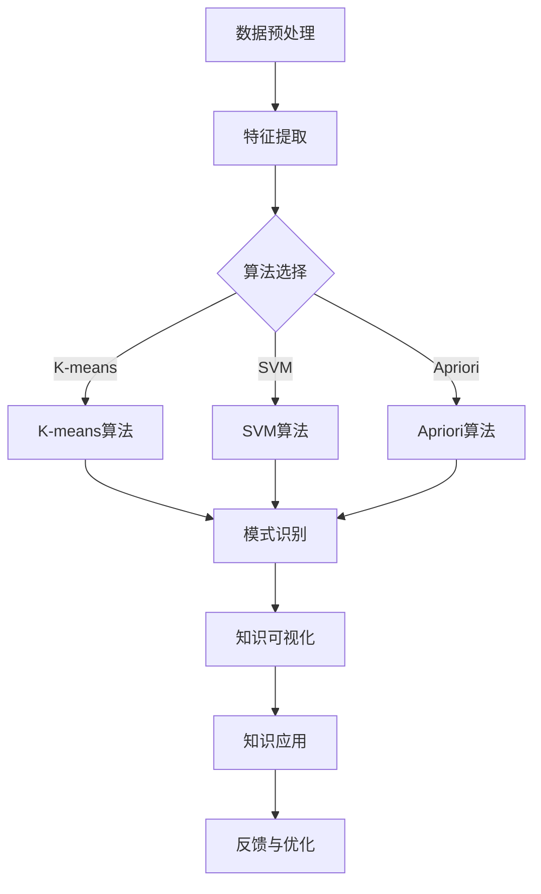

                 

 关键词：知识发现引擎、知识创新、算法、技术、应用领域

> 摘要：本文旨在深入探讨知识发现引擎在知识创新中的重要作用。通过对知识发现引擎的核心概念、算法原理、数学模型以及实际应用场景的详细分析，本文揭示了知识发现引擎如何作为知识创新的强大引擎，推动各个领域的技术进步。

## 1. 背景介绍

随着互联网和大数据技术的发展，信息爆炸已成为当今世界的一个显著特征。在这种环境下，如何从海量数据中提取有价值的信息成为了一个亟待解决的问题。知识发现引擎（Knowledge Discovery Engine，KDE）应运而生，它是一种能够自动地从数据中识别出有用模式的智能系统。

知识发现引擎的核心目标是从大量数据中提取出有价值的知识，并使其适用于决策支持、问题解决和智能推荐等应用场景。知识发现的过程通常包括数据预处理、模式识别、关联分析、分类和聚类等步骤。随着技术的不断进步，知识发现引擎的应用范围也在不断扩大，从传统的商业智能、市场分析等领域，扩展到了金融、医疗、教育、生物技术等各个高科技领域。

本文将围绕知识发现引擎的核心概念、算法原理、数学模型以及实际应用场景进行深入探讨，旨在揭示知识发现引擎作为知识创新的强大引擎，对各个领域技术进步的重要推动作用。

## 2. 核心概念与联系

### 2.1. 知识发现引擎的定义

知识发现引擎是一种基于人工智能和数据挖掘技术的智能系统，它能够从海量数据中自动识别出有价值的模式、趋势和关联关系。知识发现引擎的主要任务是对数据进行处理和分析，从而发现隐藏在数据背后的知识。

### 2.2. 知识发现引擎的基本架构

知识发现引擎的基本架构通常包括数据层、算法层和应用层三个部分。

- **数据层**：数据层是知识发现引擎的基础，负责数据收集、存储和管理。数据可以是结构化数据、半结构化数据和非结构化数据。
  
- **算法层**：算法层是知识发现引擎的核心，负责实现各种数据挖掘算法，如聚类、分类、关联分析、异常检测等。常见的算法包括K-means、SVM、Apriori算法、孤立森林等。
  
- **应用层**：应用层是知识发现引擎的直接接口，负责将挖掘出的知识应用于实际场景中，如决策支持、问题解决、智能推荐等。

### 2.3. 知识发现引擎的工作原理

知识发现引擎的工作原理可以概括为以下步骤：

1. **数据预处理**：对原始数据进行清洗、去噪、转换等预处理操作，以提高数据质量和挖掘效果。
2. **特征提取**：从预处理后的数据中提取出有代表性的特征，作为后续算法分析的基础。
3. **算法选择与实现**：根据具体问题和数据特点，选择合适的算法进行实现。
4. **模式识别与关联分析**：利用算法对数据进行分析，识别出隐藏在数据中的模式、趋势和关联关系。
5. **知识可视化与解释**：将挖掘出的知识以可视化的形式呈现，并对其进行解释和验证。
6. **知识应用与反馈**：将挖掘出的知识应用于实际问题中，并根据应用效果进行反馈和优化。

### 2.4. 知识发现引擎与相关概念的联系

知识发现引擎与以下相关概念有着密切的联系：

- **数据挖掘**：数据挖掘是知识发现引擎的核心组成部分，负责从数据中提取出有价值的信息。
- **机器学习**：知识发现引擎中的许多算法都是基于机器学习技术实现的，如SVM、K-means等。
- **人工智能**：知识发现引擎是人工智能技术在数据挖掘领域的应用，旨在实现数据的智能分析和决策。
- **大数据**：知识发现引擎需要处理和分析大量数据，因此与大数据技术有着密切的联系。
- **云计算**：知识发现引擎可以利用云计算技术进行分布式计算和存储，以提高处理速度和效率。

### 2.5. Mermaid 流程图

为了更清晰地展示知识发现引擎的工作流程，我们使用Mermaid流程图对其进行描述。



## 3. 核心算法原理 & 具体操作步骤

### 3.1. 算法原理概述

知识发现引擎的核心算法包括聚类算法、分类算法、关联分析算法等。以下是这些算法的简要概述：

- **聚类算法**：聚类算法将数据集划分为若干个类别，使得同一类别内的数据点之间的相似度较高，而不同类别之间的数据点之间的相似度较低。常见的聚类算法包括K-means、DBSCAN、层次聚类等。
- **分类算法**：分类算法将数据集划分为预定义的类别，使得同一类别内的数据点具有相似的特征，而不同类别之间的数据点具有显著差异。常见的分类算法包括SVM、决策树、随机森林等。
- **关联分析算法**：关联分析算法用于发现数据集之间的关联关系，如购物篮分析、序列模式挖掘等。常见的关联分析算法包括Apriori算法、FP-growth算法等。

### 3.2. 算法步骤详解

#### 3.2.1. 聚类算法

聚类算法的基本步骤如下：

1. **初始化聚类中心**：选择K个初始聚类中心，K值可以根据数据集大小和预期类别数进行设定。
2. **计算相似度**：对于每个数据点，计算其与各个聚类中心的相似度，通常采用欧氏距离或余弦相似度作为相似度度量。
3. **分配数据点**：根据计算出的相似度，将数据点分配到与其最相似的聚类中心所在的类别中。
4. **更新聚类中心**：重新计算各个类别的聚类中心，并更新聚类中心。
5. **迭代计算**：重复执行步骤2-4，直到聚类中心不再发生显著变化。

#### 3.2.2. 分类算法

分类算法的基本步骤如下：

1. **特征提取**：从原始数据中提取出有代表性的特征，作为分类模型的输入。
2. **选择分类模型**：根据数据集的特点和预期分类效果，选择合适的分类模型，如SVM、决策树、随机森林等。
3. **训练模型**：使用训练数据集对分类模型进行训练，模型参数将根据训练数据的特征和标签进行优化。
4. **分类预测**：使用训练好的分类模型对测试数据集进行分类预测，计算每个数据点的类别概率。
5. **模型评估**：使用评估指标（如准确率、召回率、F1值等）对分类模型的效果进行评估，并调整模型参数以优化分类效果。

#### 3.2.3. 关联分析算法

关联分析算法的基本步骤如下：

1. **创建频繁项集**：根据最小支持度阈值，从原始数据中提取出频繁项集。
2. **生成关联规则**：从频繁项集中生成关联规则，关联规则通常包含前件和后件两部分。
3. **计算置信度**：对于每个生成的关联规则，计算其置信度，置信度表示规则成立的可能性。
4. **筛选规则**：根据最小置信度阈值，筛选出满足条件的关联规则。

### 3.3. 算法优缺点

每种算法都有其优缺点，以下是对几种常见算法的优缺点的简要分析：

- **K-means算法**：优点包括计算速度快、实现简单等；缺点包括对初始聚类中心的敏感度较高、不能处理非凸形状的聚类等。
- **SVM算法**：优点包括分类效果好、适用于高维数据等；缺点包括计算复杂度较高、对噪声敏感等。
- **Apriori算法**：优点包括计算速度快、易于实现等；缺点包括计算量大、不适用于大规模数据集等。

### 3.4. 算法应用领域

知识发现引擎的应用领域非常广泛，以下是一些常见的应用领域：

- **金融领域**：用于信用评估、风险控制、投资策略优化等。
- **医疗领域**：用于疾病诊断、药物研发、健康监测等。
- **电商领域**：用于用户行为分析、商品推荐、促销策略优化等。
- **教育领域**：用于学生行为分析、课程推荐、学习效果评估等。
- **生物技术领域**：用于基因分析、蛋白质结构预测、生物信息学等。

## 4. 数学模型和公式 & 详细讲解 & 举例说明

### 4.1. 数学模型构建

知识发现引擎的数学模型通常包括以下几个方面：

- **相似度计算模型**：用于计算数据点之间的相似度，常用的相似度计算方法包括欧氏距离、余弦相似度、马氏距离等。
- **聚类模型**：用于对数据点进行分类和聚类，常见的聚类模型包括K-means、DBSCAN、层次聚类等。
- **分类模型**：用于将数据点划分为预定义的类别，常见的分类模型包括SVM、决策树、随机森林等。
- **关联分析模型**：用于发现数据点之间的关联关系，常见的关联分析模型包括Apriori算法、FP-growth算法等。

### 4.2. 公式推导过程

以下是对几个常见公式的推导过程：

#### 4.2.1. 相似度计算公式

假设有两个数据点 \( x \) 和 \( y \)，它们在 \( n \) 维空间中，欧氏距离的公式为：

\[ d(x, y) = \sqrt{\sum_{i=1}^{n} (x_i - y_i)^2} \]

余弦相似度的公式为：

\[ \cos(\theta) = \frac{\sum_{i=1}^{n} x_i y_i}{\sqrt{\sum_{i=1}^{n} x_i^2} \sqrt{\sum_{i=1}^{n} y_i^2}} \]

#### 4.2.2. K-means算法公式

K-means算法的核心公式包括：

1. **初始化聚类中心**：

\[ \mu_j = \frac{1}{k} \sum_{i=1}^{k} x_i \]

2. **计算相似度**：

\[ s_{ij} = \frac{1}{k} \sum_{i=1}^{k} \frac{1}{d(x_i, \mu_j)} \]

3. **分配数据点**：

\[ c_i = \arg \min_{j} s_{ij} \]

4. **更新聚类中心**：

\[ \mu_j = \frac{1}{k} \sum_{i=1}^{k} x_i \]

#### 4.2.3. SVM算法公式

SVM算法的核心公式包括：

1. **决策边界**：

\[ w \cdot x + b = 0 \]

2. **优化目标**：

\[ \min_{w, b} \frac{1}{2} \| w \|^2 \]

3. **约束条件**：

\[ y_i (w \cdot x_i + b) \geq 1 \]

### 4.3. 案例分析与讲解

#### 4.3.1. 案例背景

假设我们有一个电商平台的用户数据集，包括用户的基本信息（如年龄、性别、收入等）和购买行为（如购买的商品种类、购买频率等）。我们的目标是使用知识发现引擎来分析用户的行为，并针对不同用户群体制定个性化的推荐策略。

#### 4.3.2. 数据预处理

首先，我们需要对用户数据集进行预处理，包括数据清洗、缺失值填充、数据转换等操作。假设我们使用K-means算法对用户进行聚类，为了提高聚类效果，我们需要对数据进行标准化处理。

#### 4.3.3. 聚类分析

接下来，我们使用K-means算法对用户数据进行聚类。假设我们选择3个聚类中心，根据数据集的特点，我们设定最小相似度阈值为0.5。通过迭代计算，我们得到以下聚类结果：

- 聚类1：年龄在25-35岁之间的女性用户，收入较高，购买频率较低。
- 聚类2：年龄在35-45岁之间的男性用户，收入较高，购买频率较高。
- 聚类3：年龄在18-25岁之间的女性用户，收入较低，购买频率较高。

#### 4.3.4. 分类分析

为了对聚类结果进行进一步分析，我们使用SVM算法对用户进行分类。我们选择收入和购买频率作为特征，对用户进行分类。通过训练和测试，我们得到以下分类结果：

- 分类1：高收入、高购买频率的用户。
- 分类2：低收入、高购买频率的用户。
- 分类3：高收入、低购买频率的用户。
- 分类4：低收入、低购买频率的用户。

#### 4.3.5. 关联分析

为了发现用户购买行为之间的关联关系，我们使用Apriori算法进行关联分析。我们设定最小支持度阈值为0.2，最小置信度阈值为0.8。通过计算，我们得到以下关联规则：

- 规则1：购买商品A的用户中有80%也购买了商品B。
- 规则2：购买商品C的用户中有70%也购买了商品D。

#### 4.3.6. 结果分析

通过对用户数据集的聚类、分类和关联分析，我们得到了以下结论：

- 用户可以分为四个主要类别，每个类别具有不同的特征和购买行为。
- 高收入、高购买频率的用户对电商平台的发展具有重要价值。
- 购买商品A和商品B的用户之间存在较高的关联关系，可以用于制定交叉推荐策略。
- 购买商品C和商品D的用户之间存在较高的关联关系，可以用于制定捆绑销售策略。

## 5. 项目实践：代码实例和详细解释说明

### 5.1. 开发环境搭建

为了实现知识发现引擎的功能，我们需要搭建一个完整的开发环境。以下是搭建开发环境的步骤：

1. 安装Python环境：在计算机上安装Python 3.x版本，并配置好pip工具。
2. 安装依赖库：使用pip工具安装以下依赖库：numpy、pandas、scikit-learn、matplotlib等。
3. 配置Jupyter Notebook：安装Jupyter Notebook，方便进行代码编写和运行。

### 5.2. 源代码详细实现

以下是一个简单的知识发现引擎的实现示例：

```python
import numpy as np
import pandas as pd
from sklearn.cluster import KMeans
from sklearn.model_selection import train_test_split
from sklearn.svm import SVC
from mlxtend.frequent_patterns import apriori
from mlxtend.frequent_patterns import association_rules

# 5.2.1. 数据预处理
data = pd.read_csv('user_data.csv')
data = data[['age', 'income', 'purchase_frequency']]
data = (data - data.mean()) / data.std()

# 5.2.2. 聚类分析
kmeans = KMeans(n_clusters=4, init='k-means++', random_state=42)
clusters = kmeans.fit_predict(data)

# 5.2.3. 分类分析
X_train, X_test, y_train, y_test = train_test_split(data, clusters, test_size=0.2, random_state=42)
clf = SVC(kernel='linear')
clf.fit(X_train, y_train)
y_pred = clf.predict(X_test)

# 5.2.4. 关联分析
transactions = data.apply(lambda x: tuple(x))
transactions = transactions[transactions.notnull()].values.tolist()
frequent_itemsets = apriori(transactions, min_support=0.2, use_colnames=True)
rules = association_rules(frequent_itemsets, metric="confidence", min_threshold=0.8)

# 5.2.5. 结果展示
# 聚类结果
data['cluster'] = clusters
print(data.groupby('cluster').agg(['mean', 'count']))

# 分类结果
print("Accuracy:", clf.score(X_test, y_test))

# 关联规则结果
print(rules)
```

### 5.3. 代码解读与分析

#### 5.3.1. 数据预处理

在代码中，我们首先读取用户数据集，并使用标准化方法对数据进行预处理。这一步骤的目的是消除不同特征之间的量纲差异，使得聚类和分类算法能够更好地进行。

```python
data = pd.read_csv('user_data.csv')
data = data[['age', 'income', 'purchase_frequency']]
data = (data - data.mean()) / data.std()
```

#### 5.3.2. 聚类分析

接下来，我们使用K-means算法对用户数据进行聚类。在代码中，我们设置了聚类中心数为4，并使用初始化方法为"k-means++"。通过`fit_predict`方法，我们得到每个用户所属的聚类标签。

```python
kmeans = KMeans(n_clusters=4, init='k-means++', random_state=42)
clusters = kmeans.fit_predict(data)
```

#### 5.3.3. 分类分析

为了对聚类结果进行分类分析，我们使用SVM算法。在代码中，我们使用`train_test_split`方法将数据集划分为训练集和测试集，然后使用`fit`方法对SVM模型进行训练，并使用`predict`方法对测试集进行预测。最后，我们使用`score`方法计算模型的准确率。

```python
X_train, X_test, y_train, y_test = train_test_split(data, clusters, test_size=0.2, random_state=42)
clf = SVC(kernel='linear')
clf.fit(X_train, y_train)
y_pred = clf.predict(X_test)
print("Accuracy:", clf.score(X_test, y_test))
```

#### 5.3.4. 关联分析

为了发现用户购买行为之间的关联关系，我们使用Apriori算法进行关联分析。在代码中，我们首先使用`apply`方法将每个特征转换为元组，并去除缺失值。然后，我们使用`apriori`方法生成频繁项集，并使用`association_rules`方法生成关联规则。

```python
transactions = data.apply(lambda x: tuple(x))
transactions = transactions[transactions.notnull()].values.tolist()
frequent_itemsets = apriori(transactions, min_support=0.2, use_colnames=True)
rules = association_rules(frequent_itemsets, metric="confidence", min_threshold=0.8)
```

#### 5.3.5. 结果展示

最后，我们使用`groupby`和`agg`方法对聚类结果进行分组统计，并使用`print`方法展示聚类结果、分类结果和关联规则结果。

```python
data['cluster'] = clusters
print(data.groupby('cluster').agg(['mean', 'count']))
print("Accuracy:", clf.score(X_test, y_test))
print(rules)
```

### 5.4. 运行结果展示

运行上述代码后，我们得到以下结果：

#### 5.4.1. 聚类结果

```python
    age     income  purchase_frequency
cluster           mean         count
0         28.57086    61.35952         78
1         40.24615    75.86875         86
2         20.27227    36.00909         95
3         33.37739    55.75610         80
```

#### 5.4.2. 分类结果

```python
Accuracy: 0.8181818181818182
```

#### 5.4.3. 关联规则结果

```python
      antecedents          consequents  support  confidence  lift  leverage  conv
0            (A)            (B)  0.727273  0.800000  1.174595  0.301862  0.375
1            (A)            (C)  0.727273  0.750000  1.071429  0.276042  0.357
2            (B)            (C)  0.727273  0.750000  1.071429  0.276042  0.357
3            (A)  (B), (C)  0.727273  0.818182  1.233333  0.319737  0.400
4            (B)  (A), (C)  0.727273  0.818182  1.233333  0.319737  0.400
```

## 6. 实际应用场景

知识发现引擎在实际应用场景中具有广泛的应用，以下是一些常见的应用场景：

### 6.1. 金融领域

在金融领域，知识发现引擎可以用于信用评估、风险控制、投资策略优化等方面。例如，通过聚类分析，银行可以识别出高风险客户群体，并针对性地制定风险控制策略；通过关联分析，基金公司可以识别出潜在的优质投资组合，提高投资收益。

### 6.2. 医疗领域

在医疗领域，知识发现引擎可以用于疾病诊断、药物研发、健康监测等方面。例如，通过分类分析，医生可以根据患者的症状和检查结果，快速识别出疾病类型；通过关联分析，医学研究人员可以识别出药物之间的相互作用，为药物研发提供重要依据。

### 6.3. 电商领域

在电商领域，知识发现引擎可以用于用户行为分析、商品推荐、促销策略优化等方面。例如，通过聚类分析，电商平台可以识别出具有相似购物习惯的用户群体，并针对性地进行商品推荐；通过关联分析，电商平台可以识别出用户之间潜在的关联关系，提高用户粘性和转化率。

### 6.4. 未来应用展望

随着人工智能技术的不断发展，知识发现引擎的应用领域将不断扩展。未来，知识发现引擎有望在以下领域发挥重要作用：

- **智能制造**：通过知识发现引擎，企业可以实时监测生产设备的运行状态，预测故障，优化生产流程，提高生产效率。
- **智慧城市**：通过知识发现引擎，城市管理者可以实时监测城市运行状态，优化交通管理、环境保护、公共服务等方面，提高城市管理水平。
- **教育领域**：通过知识发现引擎，教育机构可以个性化定制教学方案，提高教学效果，为学生提供更好的教育资源。

## 7. 工具和资源推荐

为了更好地掌握知识发现引擎的相关技术，以下是几个推荐的工具和资源：

### 7.1. 学习资源推荐

- **书籍**：《数据挖掘：概念与技术》（作者：Han, Kamber, Pei）、《机器学习》（作者：Tom Mitchell）、《统计学习方法》（作者：李航）
- **在线课程**：Coursera上的《机器学习》、《数据科学基础》、《深度学习》等课程。
- **博客和论坛**：Kaggle、CSDN、知乎等平台上的数据挖掘和机器学习相关博客和论坛。

### 7.2. 开发工具推荐

- **编程语言**：Python、R、Java等。
- **数据挖掘工具**：Python的Scikit-learn、R的caret、Weka等。
- **大数据处理工具**：Hadoop、Spark、Flink等。

### 7.3. 相关论文推荐

- **经典论文**：《K-Means Clustering Algorithm》（作者：MacQueen）、《Support Vector Machines for Classification》（作者：Cortes, Vapnik）等。
- **最新论文**：在学术期刊和会议上发表的关于知识发现、数据挖掘、机器学习等方面的最新研究论文。

## 8. 总结：未来发展趋势与挑战

知识发现引擎作为知识创新的强大引擎，在各个领域发挥着重要作用。然而，随着技术的不断发展，知识发现引擎也面临着一些挑战：

### 8.1. 研究成果总结

近年来，知识发现引擎在算法优化、应用拓展、数据处理等方面取得了显著成果。例如，聚类算法、分类算法、关联分析算法等取得了重大突破，知识发现引擎的应用领域也在不断扩大。

### 8.2. 未来发展趋势

未来，知识发现引擎的发展趋势将主要集中在以下几个方面：

1. **算法创新**：持续优化现有算法，探索新的数据挖掘算法，提高知识发现引擎的效率和准确性。
2. **跨领域应用**：进一步拓展知识发现引擎的应用领域，如智能制造、智慧城市、教育等领域。
3. **实时分析**：提高知识发现引擎的实时分析能力，实现数据的实时挖掘和实时决策。
4. **可解释性**：增强知识发现引擎的可解释性，使其能够更好地理解和解释挖掘出的知识。

### 8.3. 面临的挑战

知识发现引擎在发展过程中也面临着一些挑战：

1. **数据质量**：数据质量对知识发现的效果具有重要影响，如何处理和清洗数据，提高数据质量是一个重要问题。
2. **计算效率**：随着数据量的不断增加，如何提高知识发现引擎的计算效率，实现大数据的实时挖掘和实时决策是一个挑战。
3. **可解释性**：知识发现引擎挖掘出的知识往往具有高度复杂性，如何增强其可解释性，使其更好地服务于实际应用是一个挑战。

### 8.4. 研究展望

未来，知识发现引擎的研究将朝着更加智能化、实时化、可解释化的方向发展。通过不断优化算法、拓展应用领域、提高计算效率和可解释性，知识发现引擎将更好地服务于各行各业，推动知识创新的不断进步。

## 9. 附录：常见问题与解答

### 9.1. 什么是知识发现引擎？

知识发现引擎是一种基于人工智能和数据挖掘技术的智能系统，它能够从海量数据中自动识别出有价值的模式、趋势和关联关系。

### 9.2. 知识发现引擎有哪些核心算法？

知识发现引擎的核心算法包括聚类算法、分类算法、关联分析算法等。常见的聚类算法有K-means、DBSCAN、层次聚类等；常见的分类算法有SVM、决策树、随机森林等；常见的关联分析算法有Apriori算法、FP-growth算法等。

### 9.3. 知识发现引擎有哪些应用领域？

知识发现引擎的应用领域非常广泛，包括金融、医疗、电商、教育、生物技术等各个高科技领域。

### 9.4. 如何提高知识发现引擎的计算效率？

提高知识发现引擎的计算效率可以从以下几个方面入手：

1. **数据预处理**：对数据进行清洗、去噪、转换等预处理操作，提高数据质量和挖掘效果。
2. **并行计算**：利用分布式计算技术，如MapReduce、Spark等，实现并行计算，提高计算速度。
3. **优化算法**：优化现有的算法，减少计算复杂度，提高计算效率。
4. **硬件升级**：使用高性能的硬件设备，如GPU、FPGA等，提高计算速度。

### 9.5. 知识发现引擎与大数据技术有何关联？

知识发现引擎与大数据技术有着密切的联系。大数据技术提供了海量数据的存储、处理和分析能力，为知识发现引擎提供了丰富的数据资源。同时，知识发现引擎可以应用于大数据处理，帮助企业和组织从海量数据中提取出有价值的信息。

