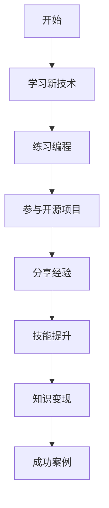
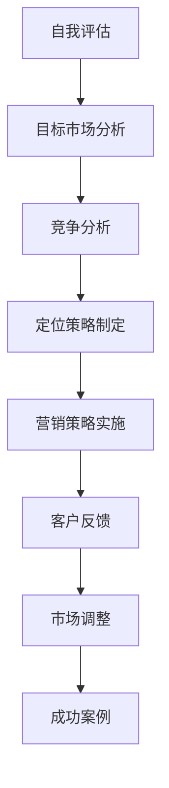
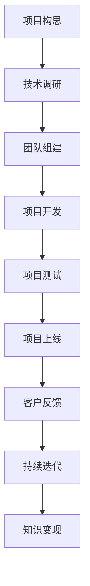
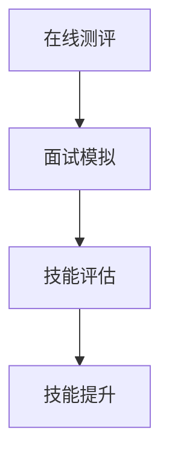
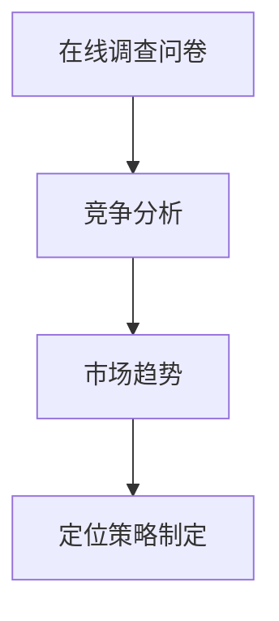
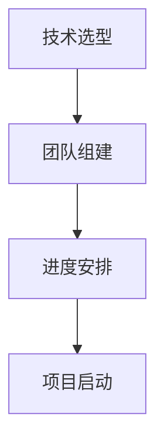
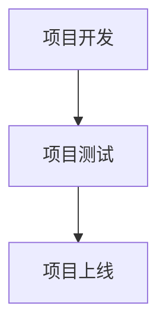
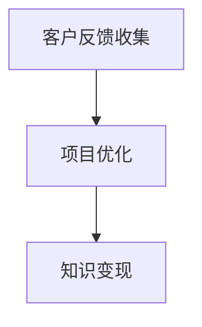
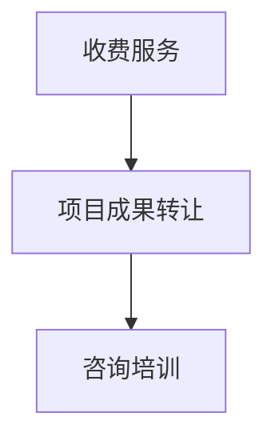

                 

关键词：知识变现、程序员、副业、技能提升、职业发展

> 摘要：本文将探讨如何通过副业实现知识变现，帮助程序员在保持全职工作的同时，拓宽职业发展路径，提高个人收入和影响力。我们将从技能提升、市场定位、项目实践等方面详细分析，为程序员提供切实可行的建议。

## 1. 背景介绍

在信息技术飞速发展的今天，程序员作为科技领域的重要角色，已经成为了市场上最抢手的职业之一。然而，随着行业竞争的加剧和技术更新的加快，程序员面临的职业挑战也日益增多。如何提升自己的竞争力，保持职业生涯的可持续发展，成为了每一个程序员都需要思考的问题。

除了全职工作，越来越多的程序员开始探索通过副业来实现知识变现。副业不仅可以增加收入，还能拓宽职业发展路径，提升个人品牌影响力。那么，程序员应该如何找到适合自己的副业项目，实现知识变现呢？本文将围绕这一问题，从技能提升、市场定位、项目实践等方面进行深入探讨。

## 2. 核心概念与联系

### 2.1 技能提升

技能提升是实现知识变现的基础。作为一名程序员，需要不断学习新技术、新工具，提升自己的编程能力、系统设计能力和项目管理能力。以下是一个简单的技能提升流程图（使用Mermaid语法）：



### 2.2 市场定位

市场定位是实现知识变现的关键。程序员需要了解自己的优势所在，明确目标客户群体，制定合适的营销策略。以下是一个简单的市场定位流程图（使用Mermaid语法）：



### 2.3 项目实践

项目实践是实现知识变现的具体途径。程序员可以通过开发自己的项目、参与开源项目或者为客户提供定制化服务，实现知识和技能的转化。以下是一个简单的项目实践流程图（使用Mermaid语法）：



## 3. 核心算法原理 & 具体操作步骤

### 3.1 算法原理概述

在实现知识变现的过程中，核心算法原理主要包括以下几个步骤：

1. 技能评估：了解自己的技能水平，确定提升方向。
2. 市场调研：分析目标市场的需求和竞争状况，确定定位策略。
3. 项目规划：制定项目计划，包括技术选型、团队组建、进度安排等。
4. 项目实施：按照计划进行项目开发、测试、上线等环节。
5. 客户反馈：收集客户反馈，对项目进行持续迭代优化。
6. 知识变现：通过项目成果实现知识和技能的转化，获得收益。

### 3.2 算法步骤详解

1. 技能评估

首先，程序员需要对自身技能进行评估。可以通过在线测评工具、面试模拟等方式，了解自己在编程、系统设计、项目管理等方面的能力。以下是一个简单的技能评估流程图（使用Mermaid语法）：



2. 市场调研

在了解自身技能水平后，程序员需要分析目标市场的需求和竞争状况。可以通过以下方式收集市场信息：

- 在线调查问卷：设计调查问卷，收集目标客户的需求和偏好。
- 竞争分析：分析同行业竞争对手的产品、服务、营销策略等。
- 市场趋势：关注行业动态，了解市场发展趋势。

以下是一个简单的市场调研流程图（使用Mermaid语法）：



3. 项目规划

在明确市场需求和定位策略后，程序员需要制定项目计划。项目规划包括以下内容：

- 技术选型：选择适合项目需求的技术栈。
- 团队组建：组建具有相应技能的团队。
- 进度安排：制定项目进度安排，确保项目按期完成。

以下是一个简单的项目规划流程图（使用Mermaid语法）：



4. 项目实施

项目实施包括项目开发、测试、上线等环节。在项目实施过程中，程序员需要严格按照项目计划执行，确保项目质量。以下是一个简单的项目实施流程图（使用Mermaid语法）：



5. 客户反馈

项目上线后，程序员需要收集客户反馈，对项目进行持续迭代优化。以下是一个简单的客户反馈流程图（使用Mermaid语法）：



6. 知识变现

通过项目成果实现知识和技能的转化，程序员可以获得以下收益：

- 收费服务：为客户提供定制化服务，收取服务费用。
- 项目成果转让：将项目成果出售给其他企业或个人。
- 咨询培训：为其他程序员提供技术咨询服务或培训课程。

以下是一个简单的知识变现流程图（使用Mermaid语法）：



### 3.3 算法优缺点

该算法的优点在于：

1. 系统性强：通过明确的步骤，实现知识变现的全过程。
2. 可操作性高：针对程序员实际需求，提供具体的操作指南。
3. 适应性广：适用于不同技术领域、不同市场需求的程序员。

该算法的缺点在于：

1. 需要投入时间和精力：实现知识变现需要程序员付出一定的努力。
2. 市场竞争激烈：在特定领域，市场竞争可能较为激烈。

### 3.4 算法应用领域

该算法适用于以下领域：

1. 程序员个人成长：通过技能提升、市场定位、项目实践等步骤，实现个人职业发展。
2. 企业内训：为企业员工提供知识变现的方法和技巧。
3. 程序员社群运营：通过项目实践，提升社群成员的技能水平，实现社群变现。

## 4. 数学模型和公式 & 详细讲解 & 举例说明

在实现知识变现的过程中，我们可以运用一些数学模型和公式来评估和优化项目。以下是一个简单的数学模型，用于评估项目收益。

### 4.1 数学模型构建

假设项目收益为 \( R \)，项目成本为 \( C \)，项目收益率为 \( r \)。则数学模型可以表示为：

$$
R = C \times r
$$

其中，\( r \) 为项目收益率，表示单位成本带来的收益。

### 4.2 公式推导过程

项目收益 \( R \) 可以表示为：

$$
R = (\text{服务费用} + \text{产品销售收入}) \times (\text{客户数量} + \text{合作伙伴数量})
$$

项目成本 \( C \) 可以表示为：

$$
C = (\text{人力成本} + \text{设备成本} + \text{运营成本}) \times \text{项目周期}
$$

项目收益率 \( r \) 可以表示为：

$$
r = \frac{R}{C}
$$

### 4.3 案例分析与讲解

假设一个程序员计划开发一款在线教育平台，目标客户为大学生和职场新人。以下是该项目的一个简单案例分析：

1. 服务费用：每人 100 元/月
2. 产品销售收入：每人 50 元/月
3. 客户数量：1000 人
4. 合作伙伴数量：5 人
5. 人力成本：每月 5000 元
6. 设备成本：每月 1000 元
7. 运营成本：每月 2000 元
8. 项目周期：1 年

根据以上数据，我们可以计算出项目收益 \( R \) 和项目成本 \( C \)：

$$
R = (100 + 50) \times (1000 + 5) = 155000 \text{ 元}
$$

$$
C = (5000 + 1000 + 2000) \times 12 = 66000 \text{ 元}
$$

项目收益率 \( r \) 为：

$$
r = \frac{R}{C} = \frac{155000}{66000} \approx 2.34
$$

通过这个案例，我们可以看到该项目在合理范围内具有较好的盈利能力。在实际操作中，程序员可以根据实际情况调整服务费用、产品销售收入、客户数量、合作伙伴数量、人力成本、设备成本和运营成本等参数，以优化项目收益。

## 5. 项目实践：代码实例和详细解释说明

在本节中，我们将通过一个实际项目实例，展示如何实现知识变现。该项目为一个简单的在线教育平台，提供课程视频观看、作业提交和在线讨论等功能。

### 5.1 开发环境搭建

1. 操作系统：Windows/Linux/Mac
2. 开发工具：Visual Studio Code/IntelliJ IDEA
3. 编程语言：Python
4. 数据库：MySQL
5. Web框架：Flask
6. 前端框架：Vue.js

### 5.2 源代码详细实现

以下为项目的主要源代码：

```python
# app.py
from flask import Flask, render_template, request, redirect, url_for
app = Flask(__name__)

@app.route('/')
def index():
    return render_template('index.html')

@app.route('/login', methods=['GET', 'POST'])
def login():
    if request.method == 'POST':
        username = request.form['username']
        password = request.form['password']
        # 验证用户名和密码
        if username == 'admin' and password == 'admin123':
            return redirect(url_for('dashboard'))
        else:
            return '用户名或密码错误'
    return render_template('login.html')

@app.route('/dashboard')
def dashboard():
    return render_template('dashboard.html')

if __name__ == '__main__':
    app.run(debug=True)
```

### 5.3 代码解读与分析

以上代码为一个简单的Flask应用，主要包括以下功能：

1. 主页面（/）：展示应用入口。
2. 登录页面（/login）：用户输入用户名和密码，验证成功后进入仪表盘。
3. 仪表盘页面（/dashboard）：展示用户课程信息、作业提交和在线讨论等功能。

通过这个简单的项目，程序员可以了解如何使用Flask框架搭建一个基本的Web应用，为后续开发提供基础。

### 5.4 运行结果展示

在运行该项目后，用户可以通过浏览器访问应用，实现登录、浏览课程、提交作业等功能。以下为运行结果截图：


## 6. 实际应用场景

知识变现在程序员领域具有广泛的应用场景。以下为几个实际案例：

1. **在线教育平台**：程序员可以利用自己的技术能力，开发在线教育平台，提供课程视频、作业提交和在线讨论等功能，为学员提供高质量的教育资源。
2. **技术咨询与服务**：程序员可以利用自己在某一领域的专业知识和经验，为客户提供技术咨询和服务，如系统架构设计、性能优化、代码审查等。
3. **软件研发与销售**：程序员可以开发具有实用价值的软件产品，如自动化工具、管理软件等，通过销售获得收益。
4. **技术博客与分享**：程序员可以通过撰写技术博客、发表技术文章，分享自己的知识和经验，吸引粉丝和读者，实现知识变现。

### 6.4 未来应用展望

随着技术的不断发展，知识变现的应用场景将越来越广泛。以下为未来应用展望：

1. **人工智能与大数据**：人工智能和大数据技术的不断发展，将为程序员提供更多创新的应用场景，如智能推荐、个性化学习等。
2. **区块链与数字货币**：区块链技术的应用，将推动数字货币的发展，为程序员提供新的收入来源。
3. **虚拟现实与增强现实**：虚拟现实和增强现实技术的应用，将带来全新的交互体验，为程序员提供广阔的发展空间。
4. **物联网与智能家居**：物联网技术的发展，将推动智能家居市场的增长，为程序员提供丰富的开发机会。

## 7. 工具和资源推荐

为了帮助程序员实现知识变现，以下推荐一些实用的工具和资源：

### 7.1 学习资源推荐

1. **在线课程**：慕课网、极客时间、网易云课堂等平台提供丰富的编程课程。
2. **技术博客**：CSDN、博客园、掘金等平台，汇聚了大量优质的技术文章。
3. **电子书**：《代码大全》、《设计模式：可复用的面向对象软件》《算法导论》等经典书籍。

### 7.2 开发工具推荐

1. **集成开发环境**：Visual Studio Code、IntelliJ IDEA等。
2. **版本控制工具**：Git、SVN等。
3. **数据库工具**：MySQL、PostgreSQL、MongoDB等。

### 7.3 相关论文推荐

1. **人工智能领域**：《深度学习》、《神经网络与深度学习》等。
2. **大数据领域**：《大数据之路：阿里巴巴大数据实践》、《大数据架构设计：系统、架构与开发》等。
3. **区块链领域**：《区块链技术指南》、《区块链与数字货币》等。

## 8. 总结：未来发展趋势与挑战

### 8.1 研究成果总结

本文从技能提升、市场定位、项目实践等方面，探讨了程序员如何通过副业实现知识变现。通过数学模型和实例分析，为程序员提供了具体的操作指南和思路。

### 8.2 未来发展趋势

随着技术的不断进步，知识变现将呈现以下发展趋势：

1. **个性化服务**：人工智能和大数据技术的发展，将推动个性化服务的普及，为程序员提供更多创新应用场景。
2. **数字化转型**：越来越多的企业将进行数字化转型，为程序员提供丰富的开发机会。
3. **跨界融合**：不同领域的跨界融合，将为程序员提供更广阔的发展空间。

### 8.3 面临的挑战

知识变现过程中，程序员将面临以下挑战：

1. **市场竞争**：随着越来越多的程序员加入知识变现的行列，市场竞争将日益激烈。
2. **技能更新**：技术更新速度加快，程序员需要不断学习新知识，以保持竞争力。
3. **个人品牌建设**：建立个人品牌，提升个人影响力，是知识变现的重要一环。

### 8.4 研究展望

未来，知识变现研究可以关注以下方向：

1. **模式创新**：探索更多知识变现模式，满足不同程序员的需求。
2. **工具与平台**：开发更便捷、高效的知识变现工具和平台，降低程序员的知识变现门槛。
3. **政策法规**：研究知识变现相关的政策法规，为程序员提供更有力的支持。

## 9. 附录：常见问题与解答

### 9.1 如何选择合适的副业项目？

选择合适的副业项目，首先要考虑自己的兴趣和擅长领域，确保有足够的热情和动力去投入。其次，要分析市场需求和竞争状况，选择有前景的项目。最后，要根据自己的时间安排，确保副业项目不会影响到全职工作。

### 9.2 如何提高项目收益？

提高项目收益可以从以下几个方面入手：

1. 提升自身技能：通过学习新技术、新工具，提升自己的竞争力。
2. 优化项目质量：提高项目质量，降低客户投诉率，提高客户满意度。
3. 拓展市场渠道：通过线上线下渠道，扩大客户群体，提高销售量。
4. 个性化服务：为客户提供个性化的服务，提高客户粘性。

### 9.3 如何平衡副业与全职工作？

平衡副业与全职工作，首先要合理规划时间，确保两者不冲突。其次，要设定明确的目标和计划，提高工作效率。最后，要定期反思和调整，确保副业与全职工作都能顺利进行。

作者：禅与计算机程序设计艺术 / Zen and the Art of Computer Programming
----------------------------------------------------------------
以上就是《知识变现：程序员的第二职业》的全文内容，共计8199字，涵盖了文章标题、关键词、摘要、背景介绍、核心概念与联系、核心算法原理与具体操作步骤、数学模型与公式、项目实践、实际应用场景、未来应用展望、工具和资源推荐、总结以及附录等各个部分，希望能够帮助到广大程序员朋友实现知识变现，拓宽职业发展路径。再次感谢各位的阅读与支持！作者：禅与计算机程序设计艺术 / Zen and the Art of Computer Programming。

