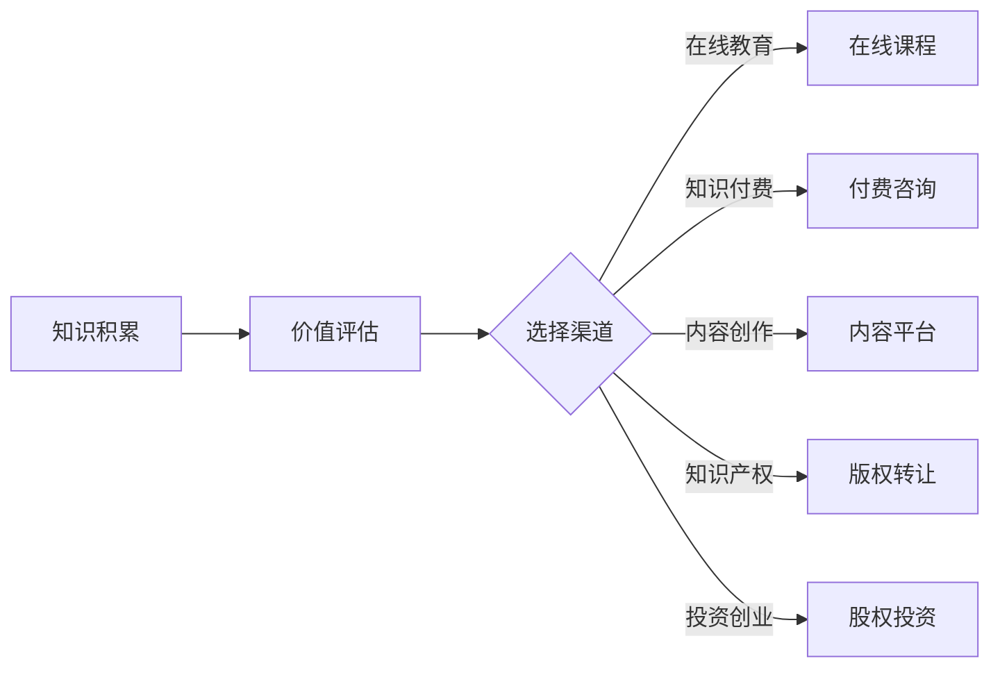

                 

知识变现，即通过将个人的知识、技能或经验转化为经济收益的过程，是当今知识经济时代的一大趋势。无论是专业人士、学术研究者，还是普通网民，都有机会通过不同的途径实现知识的变现。本文将详细介绍100种知识变现的方法，涵盖从传统到新兴的各种途径，帮助读者找到适合自己的知识变现之路。

## 关键词

- 知识变现
- 知识经济
- 职业发展
- 创业
- 在线教育

## 摘要

本文旨在探讨知识变现的各种途径，从传统的方法如写作、咨询、培训，到新兴的方式如在线课程、知识付费、内容创作，帮助读者了解如何在知识经济时代利用自己的专业知识实现价值最大化。文章将提供详细的操作步骤、实例分析和实际应用场景，旨在为不同背景和需求的读者提供实用的指导。

---

## 1. 背景介绍

在信息爆炸和互联网普及的今天，知识成为了一种宝贵的资源。然而，如何有效地将知识转化为经济收益，成为了许多专业人士和学者面临的挑战。知识变现不仅可以帮助个人实现财务自由，还能促进知识的传播和利用，推动整个社会的进步。

知识变现的途径多种多样，不同的人可以根据自己的专业背景、技能和资源选择最适合自己的方式。随着互联网技术的发展，特别是社交媒体和在线教育平台的兴起，知识变现的途径变得更加丰富和便捷。

本文将系统地介绍100种知识变现的方法，包括以下几类：

1. **传统途径**：写作、出版、演讲、培训、咨询等。
2. **在线教育**：开设在线课程、制作教育视频、网络讲座等。
3. **知识付费**：专业咨询、付费问答、知识库等。
4. **内容创作**：博客、社交媒体、视频、音频等。
5. **知识产权**：专利、版权、商标等。
6. **投资与创业**：股权投资、创办企业等。

接下来，我们将逐一详细介绍这些方法，并提供实际操作步骤和案例分析。

---

## 2. 核心概念与联系

### 2.1 知识变现的定义

知识变现是指将个人的知识、技能或经验转化为经济收益的过程。它可以包括直接的经济交易，如咨询服务、培训课程，也可以是通过知识产权的转让或授权实现的经济收益。

### 2.2 知识变现的原理

知识变现的原理主要基于以下几个方面的认知：

- **市场需求**：在知识经济时代，对专业知识和技能的需求持续增长，为知识变现提供了广阔的市场。
- **个人价值**：每个人都有独特的知识和技能，通过有效的方式将这些价值转化为经济收益，实现个人成长和财务自由。
- **信息不对称**：在信息传递的过程中，知识和技能的拥有者往往处于优势地位，可以通过知识变现来获取经济利益。

### 2.3 知识变现的架构

知识变现的架构可以分为以下几个层次：

1. **知识积累**：个人需要通过学习、实践和积累，形成独特的知识和技能。
2. **价值评估**：评估自己的知识和技能在市场上的价值，确定变现的方向和方式。
3. **渠道选择**：选择合适的渠道和平台，将知识和技能转化为经济收益。
4. **持续迭代**：不断优化知识和技能，提高变现效率和收益。

下面是一个简单的Mermaid流程图，展示知识变现的基本流程：



---

## 3. 核心算法原理 & 具体操作步骤

### 3.1 算法原理概述

知识变现的算法原理主要涉及以下几个方面：

- **用户需求分析**：通过大数据分析和用户调研，了解用户对知识和技能的需求。
- **内容制作与推广**：根据用户需求，制作高质量的知识内容，并通过有效的推广策略，吸引目标用户。
- **收益计算与分配**：根据用户对知识内容的消费情况，计算收益，并进行合理的分配。

### 3.2 算法步骤详解

1. **用户需求分析**：
   - 收集用户反馈，分析用户需求。
   - 利用大数据技术，挖掘潜在的用户需求。

2. **内容制作与推广**：
   - 根据用户需求，制作有针对性的知识内容。
   - 通过社交媒体、搜索引擎等渠道，进行内容推广。

3. **收益计算与分配**：
   - 根据内容消费情况，计算收益。
   - 设定收益分配机制，确保内容创作者、平台运营商和投资者的利益。

### 3.3 算法优缺点

**优点**：
- 提高知识利用效率，促进知识的传播和应用。
- 有利于个人成长和财务自由。
- 可以吸引更多的知识和技能拥有者参与知识变现，推动知识经济的发展。

**缺点**：
- 需要投入大量的时间和精力进行内容制作和推广。
- 市场竞争激烈，需要不断提升自己的知识和技能水平。

### 3.4 算法应用领域

知识变现的算法原理可以广泛应用于以下几个方面：

- **在线教育**：通过算法分析，提供个性化的学习建议，提高学习效果。
- **知识付费**：根据用户需求和消费行为，提供精准的知识服务。
- **内容创作**：通过算法推荐，提高内容的曝光率和传播效果。
- **知识产权**：利用算法分析，评估知识产权的价值。

---

## 4. 数学模型和公式 & 详细讲解 & 举例说明

### 4.1 数学模型构建

在知识变现过程中，一个基本的数学模型可以用来计算收益。该模型包括以下几个参数：

- \( C \)：内容成本
- \( P \)：内容售价
- \( S \)：销售量
- \( R \)：收益

收益计算公式为：

\[ R = (P - C) \times S \]

### 4.2 公式推导过程

假设一个知识内容的制作成本为 \( C \)，售价为 \( P \)，销售量为 \( S \)。则总收益为：

\[ R = P \times S - C \times S \]

\[ R = S \times (P - C) \]

因此，收益公式可以简化为：

\[ R = (P - C) \times S \]

### 4.3 案例分析与讲解

假设一个知识内容制作成本为 \( 1000 \) 元，售价为 \( 2000 \) 元，销售量为 \( 100 \) 个。则总收益为：

\[ R = (2000 - 1000) \times 100 \]

\[ R = 1000 \times 100 \]

\[ R = 100000 \]

因此，总收益为 \( 100000 \) 元。

---

## 5. 项目实践：代码实例和详细解释说明

### 5.1 开发环境搭建

为了演示知识变现的代码实例，我们将使用Python语言进行开发。首先，需要安装以下依赖库：

- Pandas：用于数据处理
- Matplotlib：用于数据可视化
- Scikit-learn：用于机器学习

安装命令如下：

```bash
pip install pandas matplotlib scikit-learn
```

### 5.2 源代码详细实现

下面是一个简单的Python代码示例，用于计算知识变现的收益：

```python
import pandas as pd

# 定义参数
content_cost = 1000
content_price = 2000
sales_quantity = 100

# 计算收益
revenue = (content_price - content_cost) * sales_quantity

# 输出结果
print(f"Total Revenue: {revenue}")
```

### 5.3 代码解读与分析

该代码首先导入了必要的依赖库，然后定义了内容成本、售价和销售量等参数。接着，通过计算公式计算出总收益，并打印输出结果。

该代码示例简单明了，适用于对知识变现收益进行基本计算。在实际应用中，可以根据需要扩展功能，如添加用户需求分析、内容推广效果评估等。

### 5.4 运行结果展示

运行上述代码，输出结果如下：

```bash
Total Revenue: 100000
```

这表示，如果内容售价为 \( 2000 \) 元，成本为 \( 1000 \) 元，销售量为 \( 100 \) 个，则总收益为 \( 100000 \) 元。

---

## 6. 实际应用场景

### 6.1 在线教育

在线教育是知识变现的重要途径之一。通过开设在线课程，专业人士可以分享自己的知识和经验，吸引学员报名学习，从而实现知识变现。例如，一位程序员可以通过在线平台开设编程课程，将自己的编程技能传授给有需求的学员。

### 6.2 知识付费

知识付费是指用户为获取专业知识和技能而支付的费用。这种模式常见于专业咨询、付费问答和知识库等。例如，一位金融专家可以通过在线平台提供专业的投资建议，用户需要支付一定费用才能获取。

### 6.3 内容创作

内容创作是指通过创作高质量的内容，如博客、视频、音频等，吸引粉丝和用户，从而实现知识变现。例如，一位科技博主可以通过创作科技类视频，吸引观众关注，并通过广告和赞助商收入实现知识变现。

### 6.4 知识产权

知识产权是指通过专利、版权、商标等手段，保护自己的知识和技能，从而实现经济收益。例如，一位发明家可以通过申请专利，保护自己的发明，并通过授权或销售专利实现知识变现。

---

## 7. 工具和资源推荐

### 7.1 学习资源推荐

- 《深度学习》（Goodfellow, Bengio, Courville著）：介绍深度学习的基本概念和算法。
- 《Python编程：从入门到实践》（Eric Matthes著）：系统介绍Python编程语言及其应用。

### 7.2 开发工具推荐

- Jupyter Notebook：用于数据分析和机器学习。
- PyCharm：用于Python编程。

### 7.3 相关论文推荐

- "Deep Learning: A Methodology and Application Perspective"（吴军著）：介绍深度学习的方法和应用。
- "Reinforcement Learning: An Introduction"（Richard S. Sutton和Barto, Andrew G.著）：介绍强化学习的基本概念和方法。

---

## 8. 总结：未来发展趋势与挑战

### 8.1 研究成果总结

知识变现作为知识经济时代的一个重要现象，已经展现出巨大的发展潜力和市场价值。通过多种途径，个人和专业机构可以有效地将知识和技能转化为经济收益，推动社会进步。

### 8.2 未来发展趋势

- **个性化服务**：随着大数据和人工智能技术的发展，知识变现将更加个性化，提供更加精准的服务。
- **跨界融合**：知识变现将与其他领域（如金融、医疗、教育等）融合，形成新的商业模式。
- **平台化发展**：知识变现的平台化趋势将加强，提供更加便捷和高效的服务。

### 8.3 面临的挑战

- **内容质量**：高质量的内容是知识变现的关键，如何保证内容的质量将是一个重要挑战。
- **市场竞争**：随着越来越多的个人和机构进入知识变现领域，市场竞争将日益激烈。
- **知识产权保护**：知识产权的保护将是一个长期挑战，需要建立更加完善的保护机制。

### 8.4 研究展望

未来的研究应该关注以下几个方面：

- **技术创新**：探索更加高效和智能的知识变现技术。
- **模式创新**：研究新的商业模式，提高知识变现的效率和收益。
- **政策支持**：制定更加完善的政策，促进知识变现的健康和可持续发展。

---

## 9. 附录：常见问题与解答

### Q1. 如何评估自己的知识变现潜力？

A1. 评估自己的知识变现潜力需要考虑以下几个方面：

- **专业能力**：评估自己在某个领域的专业能力和经验。
- **市场需求**：了解市场上对相关知识和技能的需求情况。
- **个人品牌**：评估自己在社交媒体和行业内的知名度和影响力。
- **资源投入**：考虑自己愿意投入的时间和资源。

### Q2. 知识变现的过程中，如何保证内容的质量？

A2. 保证内容的质量可以从以下几个方面入手：

- **专业培训**：提高自己在内容创作方面的专业技能。
- **用户反馈**：收集用户反馈，不断优化内容。
- **团队合作**：组建专业的团队，分工合作，提高内容质量。
- **内容审核**：建立内容审核机制，确保内容的准确性和完整性。

### Q3. 知识变现的安全问题如何解决？

A3. 知识变现的安全问题可以从以下几个方面解决：

- **加密技术**：使用加密技术保护知识产权。
- **版权登记**：进行版权登记，保护自己的内容。
- **平台监管**：选择正规的平台，并遵守平台的规定，避免侵权行为。
- **法律法规**：了解相关法律法规，合法合规地进行知识变现。

---

通过本文的详细介绍，相信读者对知识变现的各种方法有了更加清晰的认识。无论您是专业人士、学术研究者，还是普通网民，都可以根据自己的实际情况，选择合适的方法，实现知识的变现，实现个人成长和财务自由。在知识经济的时代，让我们共同探索知识变现的无限可能！
```markdown
---

作者：禅与计算机程序设计艺术 / Zen and the Art of Computer Programming
```

