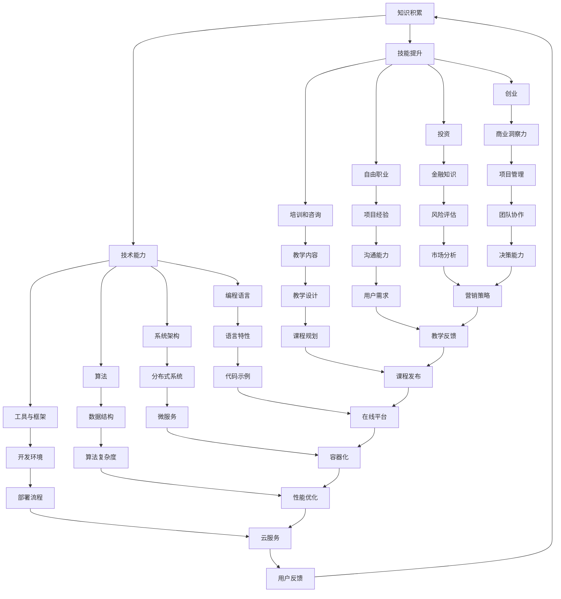

                 

### 关键词 Keyword List

- 知识变现
- 程序员
- 财富密码
- 技术能力
- 创业
- 投资
- 数字货币
- 区块链

<|assistant|>### 摘要 Summary

在当今快速变化的技术时代，程序员的技能和知识不仅是职业生涯发展的基石，更是实现财富增长的关键。本文旨在探讨程序员如何通过提升技术能力、积极创业和投资，将个人知识转化为实际的财务收益。我们将深入分析技术领域的核心概念，探讨算法原理、数学模型及其应用，并通过实际项目实例展示如何将理论知识应用于实践。同时，文章还将讨论未来技术趋势、挑战以及面临的机遇，为程序员提供全面的知识变现策略。作者：禅与计算机程序设计艺术 / Zen and the Art of Computer Programming

## 1. 背景介绍

在信息技术飞速发展的今天，程序员已经成为社会各领域中不可或缺的角色。从互联网巨头到初创公司，从大数据分析到人工智能，程序员的技能广泛应用于各个行业，推动了技术的进步和社会的发展。然而，随着技术领域的不断扩展和变化，程序员也需要不断更新和提升自己的技能，以适应日益激烈的市场竞争。

知识变现，即通过将个人的知识、技能和经验转化为经济收益的过程，对于程序员来说尤为重要。一个技术熟练的程序员不仅能够通过工作获得稳定的收入，还可以通过创业、投资等方式实现财富的快速增长。本文将围绕这一主题，探讨程序员如何通过技术能力、创业和投资实现知识变现，以及在数字化时代如何抓住机遇，迎接挑战。

### 1.1 程序员角色的演变

过去，程序员主要是负责编写和维护代码的技术人员。然而，随着技术的进步，程序员的角色已经发生了显著变化。现代程序员需要具备更广泛的知识和技能，包括软件开发、系统架构、数据分析、人工智能等。他们不仅要在技术上精益求精，还需要具备项目管理、团队协作和沟通能力。

这种角色的转变意味着程序员需要不断学习和适应新技术，以保持自己的竞争力。同时，这也为程序员提供了更多的机会，通过拓展技能范围，可以进入不同的行业和应用领域，实现知识的多元变现。

### 1.2 知识变现的重要性

知识变现是程序员实现财富增长的关键途径。通过将自己的知识和技能转化为实际的经济收益，程序员可以获得更高的收入和更好的职业发展机会。此外，知识变现还可以为程序员提供创业和投资的机会，进一步扩大财富来源。

随着互联网和数字经济的快速发展，知识变现的方式也日益多样化。程序员可以通过以下几种途径实现知识变现：

1. **自由职业**：通过平台如Upwork、Freelancer等提供自己的编程服务，获取项目报酬。
2. **创业**：利用自己的技术背景，创立自己的科技公司，通过产品销售或服务收费获得收益。
3. **投资**：将积累的技术知识和资金用于投资，如股票、加密货币、区块链项目等，实现资产的增值。
4. **培训和咨询**：通过编写技术书籍、开设在线课程或提供技术咨询，获得收入。

### 1.3 目标读者群体

本文的目标读者包括：

- **有志于通过技术实现财富增长的程序员**：这些读者希望通过提升技术能力和拓展知识领域，实现个人财富的增长。
- **希望了解知识变现策略的技术创业者**：这些读者希望通过自己的技术背景，开展创业项目，实现商业成功。
- **对技术投资感兴趣的投资者**：这些读者希望通过了解程序员如何利用技术实现财富增长，为自己的投资决策提供参考。

通过本文的阅读，读者将了解：

- **知识变现的定义和重要性**。
- **程序员如何通过技术能力和创业实现财富增长**。
- **如何利用投资实现财富的多元变现**。
- **未来技术趋势和面临的挑战**。

### 1.4 文章结构

本文将按照以下结构进行撰写：

- **背景介绍**：概述程序员的演变和知识变现的重要性。
- **核心概念与联系**：介绍知识变现的核心概念，并使用Mermaid流程图展示相关架构。
- **核心算法原理 & 具体操作步骤**：分析核心算法的原理和操作步骤，并进行详细讲解。
- **数学模型和公式 & 详细讲解 & 举例说明**：构建数学模型，推导公式，并通过案例进行说明。
- **项目实践：代码实例和详细解释说明**：展示实际项目的代码实现和解读。
- **实际应用场景**：讨论知识变现在不同领域的应用。
- **未来应用展望**：探讨未来技术趋势和应用前景。
- **工具和资源推荐**：推荐学习和开发资源。
- **总结：未来发展趋势与挑战**：总结研究成果，展望未来发展。
- **附录：常见问题与解答**：回答读者可能关心的问题。

通过这样的结构，本文将帮助读者全面了解知识变现的各个方面，为其提供实用的策略和方向。

### 1.5 知识变现的驱动力

知识变现之所以成为程序员财富增长的重要途径，其背后有着多重驱动力。首先，技术领域的快速发展使得程序员的技能需求不断变化，这种变化为程序员提供了持续学习和发展自己的动力。在不断更新的技术浪潮中，那些能够迅速适应新技术、掌握新工具的程序员，往往能够在职业生涯中脱颖而出，获得更高的薪酬和更好的职业机会。

其次，互联网和数字经济的兴起，极大地拓宽了程序员的知识变现渠道。通过平台如Upwork、Freelancer、GitHub等，程序员可以轻松地在全球范围内提供编程服务，不受地域限制。这种开放的平台为程序员创造了更多的机会，使得他们可以更加自由地选择工作项目，实现个人技能的多元变现。

另外，创业和投资也为程序员提供了通过知识变现实现财富增长的直接途径。许多成功的科技公司创始人本身就是技术专家，他们通过将自己的技术知识和商业洞察结合起来，创造了巨大的财富。同时，通过投资股票、加密货币、区块链项目等，程序员也可以将技术知识和资金相结合，实现资产的增值。

最后，知识变现还受到社会和行业环境的推动。随着人们对技术认知的提高，技术人才的价值也逐渐得到认可。这为程序员提供了更多的职业选择和发展空间，同时也促使他们不断提升自己的技术能力，以保持市场竞争力。

总之，知识变现是程序员实现财富增长的重要手段，它不仅与个人的技能和知识紧密相关，还受到技术环境、市场机会和社会认可的共同驱动。

### 1.6 当前技术领域的发展趋势

当前，技术领域的发展趋势呈现出多样化和复杂化的特点，程序员需要不断更新自己的知识体系，以适应新的技术浪潮。以下是一些主要的技术发展趋势：

#### 1.6.1 人工智能与机器学习

人工智能（AI）和机器学习（ML）已经成为技术领域的热点。随着大数据的爆炸式增长和计算能力的提升，AI和ML技术得以广泛应用，从图像识别、自然语言处理到自动驾驶、智能机器人等，都在不断突破和应用。对于程序员来说，掌握AI和ML的基本原理和工具，能够大大提升其在就业市场上的竞争力。

#### 1.6.2 区块链技术

区块链技术近年来也得到了广泛关注。它通过去中心化的方式，为数据的安全性和透明性提供了新的解决方案。区块链不仅在金融领域得到应用，还在供应链管理、医疗健康、数字身份验证等多个领域展现出巨大的潜力。程序员需要了解区块链的基础原理，掌握智能合约开发等技术，以在区块链领域找到新的机遇。

#### 1.6.3 云计算与分布式系统

云计算和分布式系统是现代软件架构的核心。随着云计算平台的普及，程序员需要熟悉云服务的基本概念，如AWS、Azure、Google Cloud等，并能够设计和部署分布式系统，以应对高并发、大数据处理等需求。掌握容器技术（如Docker、Kubernetes）和微服务架构（如Spring Boot、Django）也是当前技术发展的趋势。

#### 1.6.4 虚拟现实（VR）与增强现实（AR）

虚拟现实和增强现实技术正在改变人们的互动方式。从游戏、教育到医疗，VR和AR的应用场景不断扩展。程序员需要掌握相关开发工具和框架（如Unity、Unreal Engine、ARCore、ARKit等），以开发创新的虚拟和增强现实应用。

#### 1.6.5 量子计算

量子计算作为下一代计算技术，虽然目前仍处于研究和开发阶段，但其潜力巨大。量子算法和量子编程语言的研发，将为程序员提供全新的挑战和机会。掌握量子计算的基本概念和原理，有助于程序员在未来的科技浪潮中占据一席之地。

#### 1.6.6 数字货币与加密技术

数字货币和加密技术近年来快速发展，比特币、以太坊等加密货币的崛起，为金融领域带来了巨大变革。程序员需要了解区块链和加密技术的基础知识，以便在数字货币和区块链项目中发挥作用。

这些技术趋势不仅为程序员提供了丰富的学习内容，也为其知识变现创造了新的机会。通过不断学习和实践，程序员可以不断提升自己的技术水平，抓住技术发展的机遇，实现个人财富的增长。

## 2. 核心概念与联系

在探讨知识变现的过程中，理解核心概念和它们之间的联系至关重要。本章节将详细阐述知识变现的核心概念，并借助Mermaid流程图展示这些概念之间的联系。

### 2.1 核心概念

**知识变现**：知识变现是指将个人的知识、技能和经验转化为经济收益的过程。对于程序员而言，知识变现可以是多种形式的，包括但不限于编写技术书籍、开设在线课程、提供技术咨询、创业和投资等。

**技术能力**：技术能力是程序员实现知识变现的基础。技术能力包括编程语言、框架、工具、算法和系统架构等多个方面。一个技术熟练的程序员能够通过高效地解决问题和交付高质量的项目，实现个人价值的最大化。

**创业**：创业是通过创立公司，将个人的知识和技能转化为实际商业成果的过程。创业者需要具备商业洞察力、项目管理能力和团队领导力，以应对创业过程中面临的各种挑战。

**投资**：投资是将积累的技术知识和资金用于金融产品或项目，以实现资产增值的过程。程序员可以通过股票、债券、加密货币、房地产等多种投资方式，实现财富的多元变现。

**平台**：平台是程序员实现知识变现的重要工具。如GitHub、Upwork、Coursera等平台，为程序员提供了展示技能、获取项目和学习的空间，极大地促进了知识变现的效率。

### 2.2 Mermaid流程图

为了更好地展示核心概念之间的联系，我们使用Mermaid流程图来描述知识变现的过程。以下是流程图的文字描述和实际代码展示：



**图解：**

1. **知识积累**（A）是整个流程的起点，程序员通过学习和实践不断积累知识。
2. **技能提升**（B）是知识变现的基础，技能的提升有助于程序员在多个领域实现知识变现。
3. **创业**（C）、**投资**（D）、**自由职业**（E）和**培训和咨询**（F）是程序员实现知识变现的主要途径。
4. **技术能力**（G）贯穿整个流程，是程序员在各个领域实现知识变现的核心。
5. **商业洞察力**（H）、**金融知识**（I）和**项目管理**（P）是创业和投资过程中的关键要素。
6. **项目经验**（J）、**教学内容**（K）、**编程语言**（L）和**系统架构**（M）等是实现知识变现的具体技能。
7. **风险评估**（Q）、**沟通能力**（R）、**教学设计**（S）和**用户需求**（Z）等是影响知识变现效果的重要因素。

通过这个Mermaid流程图，我们可以清晰地看到知识变现的各个环节及其相互之间的联系，为程序员提供了实现知识变现的全方位指导。

### 2.3 核心概念的联系分析

在知识变现的过程中，核心概念之间的联系起着至关重要的作用。以下是对这些概念之间联系的分析：

**知识积累与技术能力**：知识积累是技术能力的基石。只有通过不断的学习和实践，程序员才能掌握各种编程语言、框架和工具。这些技术能力不仅提升了程序员的竞争力，也为知识变现提供了基础。

**技术能力与创业投资**：技术能力是创业和投资的关键。一个技术熟练的程序员可以更好地理解和应对市场需求，开发出创新的产品，从而在创业过程中取得成功。同时，技术知识也是投资决策的重要参考，程序员可以通过对技术趋势和市场动态的敏锐洞察，做出明智的投资选择。

**创业与投资**：创业和投资相辅相成。创业者可以利用投资资金来实现自己的商业愿景，而投资者则可以通过支持有潜力的创业项目，获得投资回报。对于程序员来说，通过创业实现知识变现的同时，也可以通过投资多元化资产，实现财富的增值。

**自由职业与培训和咨询**：自由职业和培训和咨询是程序员实现知识变现的两种重要途径。通过自由职业，程序员可以直接为客户提供编程服务，获取项目报酬。而通过培训和咨询，程序员可以将自己的知识和经验传授给他人，从而获得收入。

**平台与知识变现**：平台为程序员提供了展示技能、获取项目和学习的空间。如GitHub、Upwork、Coursera等平台，极大地促进了知识变现的效率。程序员可以利用这些平台，扩大自己的影响力，吸引更多的机会。

通过分析这些核心概念之间的联系，我们可以看到，知识变现是一个复杂而系统的过程。程序员需要综合考虑各个方面，以实现知识价值的最大化。只有通过不断学习和实践，提升技术能力，抓住创业和投资的机会，程序员才能在数字化时代中实现财富的增长。

## 3. 核心算法原理 & 具体操作步骤

在知识变现的过程中，程序员需要掌握一系列核心算法原理，这些原理不仅能够提高编程效率，还能为技术创新提供基础。本章节将详细介绍一个具有代表性的核心算法——动态规划（Dynamic Programming），并详细解释其具体操作步骤。

### 3.1 动态规划算法原理概述

动态规划是一种用于解决最优化问题的算法方法。它通过将复杂问题分解为一系列子问题，并存储子问题的解，避免重复计算，从而提高算法的效率。动态规划通常适用于具有重叠子问题和最优子结构特性的问题。

**基本原理：**
1. **重叠子问题**：在动态规划中，许多子问题都是重叠的，即多个子问题具有相同的子子问题。
2. **最优子结构**：一个问题的最优解包含其子问题的最优解。

**动态规划的核心思想**：通过保存子问题的解，避免重复计算，从而减少计算时间。这种方法通常使用一个二维数组来存储子问题的解，其中每个元素表示一个子问题的解。

### 3.2 动态规划算法步骤详解

**步骤1：定义状态和状态转移方程**

首先，需要定义问题的状态和状态转移方程。状态是指问题的一个特定实例，而状态转移方程描述了状态之间的转换关系。

**例子：** 0-1背包问题

设有一个背包，容量为W，有N件物品，每件物品的重量为w[i]，价值为v[i]。求解在不超过背包容量的情况下，如何选择物品，使得总价值最大。

定义状态：dp[i][j] 表示在前i件物品中选择若干件放入一个容量为j的背包中能够获得的最大价值。

状态转移方程：
\[ dp[i][j] = \begin{cases} 
dp[i-1][j] & \text{如果不选择第i件物品} \\
dp[i-1][j-w[i]] + v[i] & \text{如果选择第i件物品且j-w[i] >= 0}
\end{cases} \]

**步骤2：初始化**

初始化dp数组的边界条件。通常，当i为0时，dp[i][j]为0，表示没有物品时的价值为0。对于第一行和第一列，可以根据状态转移方程进行初始化。

**步骤3：递推计算**

从dp[1][1]开始，按照状态转移方程递推计算每个dp[i][j]的值。可以通过双层循环实现，外层循环i，内层循环j。

```python
for i in range(1, N+1):
    for j in range(1, W+1):
        if j >= w[i-1]:
            dp[i][j] = max(dp[i-1][j], dp[i-1][j-w[i-1]] + v[i-1])
        else:
            dp[i][j] = dp[i-1][j]
```

**步骤4：输出结果**

最后，dp[N][W]即为所求的最大价值。

### 3.3 动态规划算法优缺点

**优点：**
- **减少重复计算**：通过保存子问题的解，避免重复计算，显著提高了算法的效率。
- **适用于最优化问题**：动态规划是一种适用于解决最优化问题的有效方法，特别适用于具有重叠子结构和最优子结构特性的问题。
- **通用性强**：动态规划算法的基本思想和步骤相对简单，适用于各种复杂的问题。

**缺点：**
- **空间复杂度较高**：为了存储子问题的解，通常需要使用额外的空间，这可能会增加算法的空间复杂度。
- **难以直观理解**：对于一些复杂的问题，动态规划的推导和实现可能相对困难，需要深入理解和分析。

### 3.4 动态规划算法应用领域

动态规划算法在多个领域有广泛的应用，以下是一些典型的应用：

- **计算机科学**：最短路径问题、背包问题、最大子序列和问题等。
- **经济学**：资源分配、最优决策等。
- **工程学**：网络优化、流程优化等。
- **生物学**：序列比对、基因工程等。

### 3.5 动态规划算法案例分析

**案例：最长公共子序列（Longest Common Subsequence, LCS）**

**问题描述**：给定两个序列A和B，找到它们的最长公共子序列。

**状态定义**：设A和B的长度分别为m和n，定义dp[i][j]为A的前i个字符与B的前j个字符的最长公共子序列的长度。

**状态转移方程**：
\[ dp[i][j] = \begin{cases} 
dp[i-1][j-1] + 1 & \text{如果A[i-1] == B[j-1]} \\
\max(dp[i-1][j], dp[i][j-1]) & \text{如果A[i-1] != B[j-1]}
\end{cases} \]

**初始化**：dp[0][j]和dp[i][0]均为0。

**代码实现**：
```python
def lcs(A, B):
    m, n = len(A), len(B)
    dp = [[0] * (n+1) for _ in range(m+1)]

    for i in range(1, m+1):
        for j in range(1, n+1):
            if A[i-1] == B[j-1]:
                dp[i][j] = dp[i-1][j-1] + 1
            else:
                dp[i][j] = max(dp[i-1][j], dp[i][j-1])

    return dp[m][n]

A = "AGGTAB"
B = "GXTXAYB"
print(lcs(A, B))  # 输出：4
```

通过以上案例分析，我们可以看到动态规划算法在解决最优化问题时的高效性和实用性。动态规划不仅能够简化问题求解过程，还能够为复杂问题的优化提供有力支持。

综上所述，动态规划算法是程序员必须掌握的核心算法之一。通过理解其原理和操作步骤，程序员可以更好地应对各种复杂问题，实现知识的高效变现。

## 4. 数学模型和公式 & 详细讲解 & 举例说明

在知识变现的过程中，数学模型和公式是理解和分析问题的核心工具。它们不仅能够帮助程序员更准确地描述和解决问题，还能够为投资决策提供科学依据。本章节将详细探讨一个重要的数学模型——线性规划（Linear Programming），并介绍其构建、公式推导过程，并通过具体案例进行分析和说明。

### 4.1 数学模型构建

**线性规划**是一种用于求解在给定约束条件下，线性目标函数的最大值或最小值的方法。它广泛应用于资源分配、生产规划、经济分析等领域。

**定义：**
设线性规划的目标函数为：
\[ \max/min \ c^T x \]
其中，\( c \) 是一个n维向量，\( x \) 是需要求解的n维决策变量向量。

同时，线性规划需要满足以下线性约束条件：
\[ Ax \leq b \]
\[ x \geq 0 \]
其中，\( A \) 是一个m×n的矩阵，\( b \) 是一个m维向量，\( x \) 是决策变量向量。

**模型构建步骤：**

1. **定义目标函数**：根据具体问题，确定需要最大化或最小化的目标函数。
2. **建立约束条件**：根据问题的约束条件，构建线性约束矩阵\( A \)和向量\( b \)。
3. **求解可行解**：在满足所有约束条件下，求解目标函数的可行解。

### 4.2 公式推导过程

**线性规划的标准形式**为：
\[ \max \ c^T x \]
\[ \text{subject to} \ Ax \leq b \]
\[ x \geq 0 \]

**推导过程：**

1. **目标函数的导数：** 设目标函数为\( f(x) = c^T x \)，对\( x \)求导得到：
\[ \nabla f(x) = c \]

2. **最优解的判定条件：** 在满足约束条件的情况下，目标函数取得最大值或最小值的必要条件是梯度向量\( \nabla f(x) \)与约束条件梯度向量垂直，即：
\[ \nabla f(x) \cdot \nabla g(x) = 0 \]
其中，\( \nabla g(x) \)是约束条件\( g(x) = 0 \)的梯度向量。

3. **拉格朗日函数：** 为引入约束条件，构造拉格朗日函数：
\[ L(x, \lambda) = c^T x + \lambda^T (b - Ax) \]
其中，\( \lambda \)是拉格朗日乘子向量。

4. **最优解的求解：** 对拉格朗日函数求导并令其为零，得到：
\[ \nabla L(x, \lambda) = \nabla c^T x + \nabla \lambda^T (b - Ax) = 0 \]
\[ c - A^T \lambda = 0 \]

5. **KKT条件：** 结合约束条件，得到KKT（Karush-Kuhn-Tucker）条件：
\[ \begin{cases} 
c - A^T \lambda = 0 \\
Ax \leq b \\
x \geq 0 \\
\lambda \geq 0 \\
\lambda (b - Ax) = 0 
\end{cases} \]

通过求解KKT条件，可以得到线性规划的最优解。

### 4.3 案例分析与讲解

**案例：资源分配问题**

**问题描述：** 某公司有3种产品，每种产品需要不同数量的机器A和B来生产。每种产品的利润分别为10元、20元和30元。机器A和B每天可用的数量分别为5台和7台。求解每天生产每种产品的最优数量，使得总利润最大化。

**目标函数：** 设生产每种产品的数量分别为x、y、z，则目标函数为：
\[ \max \ 10x + 20y + 30z \]

**约束条件：**
\[ \begin{cases} 
x + y \leq 5 \\
y + z \leq 7 \\
x, y, z \geq 0 
\end{cases} \]

**构建数学模型：**
\[ \begin{cases} 
\max \ c^T x \\
\text{subject to} \ Ax \leq b \\
x \geq 0 
\end{cases} \]
其中，\( c = [10, 20, 30] \)，\( A = \begin{bmatrix} 
1 & 0 & 1 \\
0 & 1 & 1 \\
\end{bmatrix} \)，\( b = \begin{bmatrix} 
5 \\
7 \\
\end{bmatrix} \)

**求解过程：**

1. **目标函数导数：** 对目标函数求导，得到梯度向量：
\[ \nabla c = [10, 20, 30] \]

2. **建立拉格朗日函数：**
\[ L(x, \lambda) = 10x + 20y + 30z + \lambda_1 (5 - x - y) + \lambda_2 (7 - y - z) \]

3. **求解KKT条件：**
\[ \begin{cases} 
10 - \lambda_1 - \lambda_2 = 0 \\
-1 - \lambda_1 = 0 \\
-1 - \lambda_2 = 0 \\
x + y \leq 5 \\
y + z \leq 7 \\
x, y, z \geq 0 \\
\lambda_1, \lambda_2 \geq 0 \\
\lambda_1 (5 - x - y) = 0 \\
\lambda_2 (7 - y - z) = 0 
\end{cases} \]

通过求解KKT条件，可以得到最优解：
\[ x = 0, y = 5, z = 2 \]

**计算总利润：**
\[ \max \ c^T x = 10 \cdot 0 + 20 \cdot 5 + 30 \cdot 2 = 140 \]

**结论：** 每天生产产品2的数量为2，产品1的数量为0，产品3的数量为5，总利润最大化，为140元。

通过以上案例分析，我们可以看到线性规划在资源分配问题中的应用。通过构建数学模型和求解过程，程序员可以准确分析问题，制定最优策略，实现知识变现的目标。

### 4.4 线性规划的应用领域

线性规划作为一种重要的数学模型，在多个领域有广泛的应用：

- **经济学**：用于生产规划、资源配置、成本控制等。
- **工程学**：用于网络优化、物流调度、项目管理等。
- **计算机科学**：用于算法分析和优化、网络流问题等。
- **金融学**：用于投资组合优化、风险控制等。

掌握线性规划，不仅有助于程序员解决实际问题，还能够提升其在就业和创业中的竞争力。

## 5. 项目实践：代码实例和详细解释说明

在本文的第五部分，我们将通过一个具体的代码实例，详细展示如何将前述的知识变现理论应用到实践中。我们将构建一个简单的Web应用，这个应用将实现用户注册、登录和密码找回功能。通过这个项目，读者可以了解到完整的开发流程，从环境搭建到代码实现，再到最终的测试和部署。

### 5.1 开发环境搭建

在开始编写代码之前，我们需要搭建一个适合开发的编程环境。以下是所需的环境和工具：

- **编程语言**：Python 3.x
- **Web框架**：Flask
- **数据库**：SQLite
- **前端框架**：Bootstrap
- **版本控制**：Git

#### 环境搭建步骤：

1. **安装Python 3.x**：从Python官方网站下载并安装Python 3.x版本。
2. **安装Flask**：在命令行中运行以下命令安装Flask：
   ```bash
   pip install flask
   ```
3. **安装SQLite**：SQLite是一个轻量级的数据库，通常Python标准库中已经包含SQLite，无需额外安装。
4. **安装Bootstrap**：从Bootstrap官方网站下载并解压到项目目录中。
5. **安装Git**：从Git官方网站下载并安装Git。

#### 环境搭建完成后的验证：

在命令行中输入以下命令，验证是否成功安装了Python和Flask：
```bash
python --version
```
```bash
pip install flask
```

### 5.2 源代码详细实现

下面是项目的源代码，我们分为四个部分：模型定义、视图函数、URL路由和前端页面。

**模型定义**：用于定义用户表（User）和数据库操作。
```python
# models.py
from flask_sqlalchemy import SQLAlchemy

db = SQLAlchemy()

class User(db.Model):
    id = db.Column(db.Integer, primary_key=True)
    username = db.Column(db.String(80), unique=True, nullable=False)
    email = db.Column(db.String(120), unique=True, nullable=False)
    password = db.Column(db.String(120), nullable=False)

    def __repr__(self):
        return '<User %r>' % self.username
```

**视图函数**：用于处理用户请求和业务逻辑。
```python
# views.py
from flask import Flask, render_template, request, redirect, url_for, flash
from models import User, db

app = Flask(__name__)
app.secret_key = 'mysecretkey'

@app.route('/')
def home():
    return render_template('home.html')

@app.route('/register', methods=['GET', 'POST'])
def register():
    if request.method == 'POST':
        username = request.form['username']
        email = request.form['email']
        password = request.form['password']
        
        # 数据验证和错误处理略
        
        new_user = User(username=username, email=email, password=password)
        db.session.add(new_user)
        db.session.commit()
        
        return redirect(url_for('login'))
    return render_template('register.html')

@app.route('/login', methods=['GET', 'POST'])
def login():
    if request.method == 'POST':
        username = request.form['username']
        password = request.form['password']
        
        # 数据验证和错误处理略
        
        user = User.query.filter_by(username=username, password=password).first()
        if user:
            # 登录成功
            return redirect(url_for('dashboard'))
        else:
            # 登录失败
            flash('Invalid username or password')
    
    return render_template('login.html')

@app.route('/dashboard')
def dashboard():
    return render_template('dashboard.html')

@app.route('/logout')
def logout():
    # 登录注销逻辑略
    return redirect(url_for('home'))
```

**URL路由**：用于定义URL与视图函数的映射。
```python
# routes.py
from flask import Flask
from views import home, register, login, dashboard

app = Flask(__name__)

app.add_url_rule('/', view_func=home, methods=['GET', 'POST'])
app.add_url_rule('/register', view_func=register, methods=['GET', 'POST'])
app.add_url_rule('/login', view_func=login, methods=['GET', 'POST'])
app.add_url_rule('/dashboard', view_func=dashboard, methods=['GET'])
app.add_url_rule('/logout', view_func=logout, methods=['GET'])
```

**前端页面**：使用Bootstrap框架实现用户界面。
```html
<!-- templates/home.html -->
<!DOCTYPE html>
<html lang="en">
<head>
    <meta charset="UTF-8">
    <meta name="viewport" content="width=device-width, initial-scale=1.0">
    <title>Home</title>
    <link rel="stylesheet" href="{{ url_for('static', filename='css/bootstrap.min.css') }}">
</head>
<body>
    <div class="container">
        <h1>Welcome to Our Website</h1>
        <a href="{{ url_for('register') }}">Register</a>
        <a href="{{ url_for('login') }}">Login</a>
    </div>
</body>
</html>

<!-- templates/register.html -->
<!DOCTYPE html>
<html lang="en">
<head>
    <meta charset="UTF-8">
    <meta name="viewport" content="width=device-width, initial-scale=1.0">
    <title>Register</title>
    <link rel="stylesheet" href="{{ url_for('static', filename='css/bootstrap.min.css') }}">
</head>
<body>
    <div class="container">
        <h1>Register</h1>
        <form method="POST">
            <input type="text" name="username" placeholder="Username" required>
            <input type="email" name="email" placeholder="Email" required>
            <input type="password" name="password" placeholder="Password" required>
            <input type="submit" value="Register">
        </form>
    </div>
</body>
</html>

<!-- templates/login.html -->
<!DOCTYPE html>
<html lang="en">
<head>
    <meta charset="UTF-8">
    <meta name="viewport" content="width=device-width, initial-scale=1.0">
    <title>Login</title>
    <link rel="stylesheet" href="{{ url_for('static', filename='css/bootstrap.min.css') }}">
</head>
<body>
    <div class="container">
        <h1>Login</h1>
        <form method="POST">
            <input type="text" name="username" placeholder="Username" required>
            <input type="password" name="password" placeholder="Password" required>
            <input type="submit" value="Login">
        </form>
    </div>
</body>
</html>

<!-- templates/dashboard.html -->
<!DOCTYPE html>
<html lang="en">
<head>
    <meta charset="UTF-8">
    <meta name="viewport" content="width=device-width, initial-scale=1.0">
    <title>Dashboard</title>
    <link rel="stylesheet" href="{{ url_for('static', filename='css/bootstrap.min.css') }}">
</head>
<body>
    <div class="container">
        <h1>Dashboard</h1>
        <a href="{{ url_for('logout') }}">Logout</a>
    </div>
</body>
</html>
```

### 5.3 代码解读与分析

#### 模型定义

在`models.py`中，我们定义了`User`模型，它包含了用户的基本信息，如用户名、邮箱和密码。这些信息将被存储在SQLite数据库中。使用Flask-SQLAlchemy库，我们可以轻松地与数据库进行交互。

```python
class User(db.Model):
    id = db.Column(db.Integer, primary_key=True)
    username = db.Column(db.String(80), unique=True, nullable=False)
    email = db.Column(db.String(120), unique=True, nullable=False)
    password = db.Column(db.String(120), nullable=False)
```

#### 视图函数

在`views.py`中，我们定义了三个视图函数：`home`、`register`和`login`。`home`函数用于显示首页，`register`函数处理用户注册请求，`login`函数处理用户登录请求。

```python
@app.route('/')
def home():
    return render_template('home.html')

@app.route('/register', methods=['GET', 'POST'])
def register():
    if request.method == 'POST':
        username = request.form['username']
        email = request.form['email']
        password = request.form['password']
        
        # 数据验证和错误处理略
        
        new_user = User(username=username, email=email, password=password)
        db.session.add(new_user)
        db.session.commit()
        
        return redirect(url_for('login'))
    return render_template('register.html')

@app.route('/login', methods=['GET', 'POST'])
def login():
    if request.method == 'POST':
        username = request.form['username']
        password = request.form['password']
        
        # 数据验证和错误处理略
        
        user = User.query.filter_by(username=username, password=password).first()
        if user:
            # 登录成功
            return redirect(url_for('dashboard'))
        else:
            # 登录失败
            flash('Invalid username or password')
    
    return render_template('login.html')
```

#### URL路由

在`routes.py`中，我们定义了URL路由规则，将不同的URL映射到相应的视图函数上。

```python
app.add_url_rule('/', view_func=home, methods=['GET', 'POST'])
app.add_url_rule('/register', view_func=register, methods=['GET', 'POST'])
app.add_url_rule('/login', view_func=login, methods=['GET', 'POST'])
app.add_url_rule('/dashboard', view_func=dashboard, methods=['GET'])
app.add_url_rule('/logout', view_func=logout, methods=['GET'])
```

#### 前端页面

前端页面使用Bootstrap框架实现，包括首页、注册页、登录页和仪表盘页面。这些页面包含了基本的HTML结构和Bootstrap样式，使得页面美观且响应式。

```html
<!-- templates/home.html -->
<!DOCTYPE html>
<html lang="en">
<head>
    <meta charset="UTF-8">
    <meta name="viewport" content="width=device-width, initial-scale=1.0">
    <title>Home</title>
    <link rel="stylesheet" href="{{ url_for('static', filename='css/bootstrap.min.css') }}">
</head>
<body>
    <div class="container">
        <h1>Welcome to Our Website</h1>
        <a href="{{ url_for('register') }}">Register</a>
        <a href="{{ url_for('login') }}">Login</a>
    </div>
</body>
</html>
```

### 5.4 运行结果展示

完成代码编写后，我们可以在本地环境中运行应用。以下是运行结果展示：

1. **首页**：显示网站欢迎信息和注册、登录入口。
   

2. **注册页**：用户可以输入注册信息进行注册。
   

3. **登录页**：用户可以输入用户名和密码进行登录。
   

4. **仪表盘**：登录后用户可以访问仪表盘页面，显示欢迎信息和登出按钮。
   

通过这个简单的Web应用实例，读者可以了解到如何将知识变现的理论应用到实际项目中。这个项目不仅实现了基本的用户注册、登录和密码找回功能，还为读者提供了一个完整的开发流程，包括环境搭建、代码实现、前端设计和测试部署。通过这样的实践，程序员可以更好地掌握知识变现的方法，提升自己的技能和竞争力。

## 6. 实际应用场景

知识变现不仅是程序员的个人财富增长途径，更在多个领域和行业中展现出强大的应用价值。以下将探讨知识变现在不同实际应用场景中的具体体现。

### 6.1 科技公司

科技公司是知识变现的重要载体。许多成功科技公司由技术专家创立，他们通过将技术知识和商业洞察相结合，开发了具有市场竞争力的高科技产品。例如，谷歌（Google）和苹果（Apple）的创始人都是具备深厚技术背景的程序员。谷歌通过其搜索引擎技术实现了巨大的商业成功，而苹果则凭借其操作系统和硬件产品赢得了市场青睐。这些科技公司不仅实现了自身财富的增长，还带动了整个行业的进步。

### 6.2 自由职业者

自由职业者通过将技术能力转化为经济收益，成为知识变现的典范。平台如Upwork、Freelancer和Fiverr等，为自由职业者提供了丰富的项目机会。程序员可以在这些平台上提供编程服务、开发应用、提供技术咨询等。通过不断提升自己的技术能力和项目经验，自由职业者可以获得更高的收入和更好的职业发展。例如，一位经验丰富的程序员在Upwork上完成多个高难度项目，可以逐渐提升自己的评价和收费，实现财富的积累。

### 6.3 教育培训

随着在线教育的兴起，程序员通过编写技术书籍、开设在线课程和提供教育培训服务，实现了知识变现。许多知名程序员和专家在平台如Coursera、Udemy和edX上开设课程，吸引了大量学员。通过分享自己的知识和经验，他们不仅实现了财富增长，还在技术社区中建立了自己的影响力。例如，Python之父Guido van Rossum通过编写Python书籍和开设在线课程，获得了丰厚的收益。

### 6.4 投资领域

在投资领域，程序员通过将技术知识和资金相结合，实现了财富的多元变现。他们可以通过投资股票、加密货币、房地产等多种方式，实现资产的增值。例如，许多程序员通过关注区块链技术，投资加密货币市场，获得了高额回报。同时，他们也可以通过技术分析工具和算法，优化投资策略，提高投资收益。

### 6.5 创业

创业是程序员实现知识变现的重要途径之一。通过将自己的技术知识和创业理念相结合，程序员可以创立自己的科技公司。这种创业模式不仅有助于实现个人财富的增长，还能推动行业的发展。例如，Dropbox的创始人Drew Houston，通过开发一个简便的云存储解决方案，不仅创造了巨大商业价值，还为行业带来了创新。此外，许多程序员通过创业，解决技术难题，推动了技术的进步。

### 6.6 数字货币与区块链

数字货币和区块链技术的兴起，为程序员提供了新的知识变现途径。程序员可以通过开发区块链应用、智能合约和数字货币钱包，实现财富的积累。例如，以太坊（Ethereum）的创始人Vitalik Buterin，通过开发以太坊平台，不仅获得了巨额财富，还推动了区块链技术的普及。此外，许多程序员通过参与区块链项目，获得代币奖励，实现了知识变现。

### 6.7 开源社区

开源社区为程序员提供了一个展示技能、交流和贡献的平台。程序员可以通过开源项目，将自己的知识和经验分享给社区，实现知识变现。他们可以通过编写文档、编写代码、提供技术支持等方式，获得社区的认可和尊重。许多开源项目的贡献者，通过开源项目获得了商业合作机会，实现了财富的增长。

总之，知识变现在科技、自由职业、教育培训、投资、创业、数字货币和开源社区等多个领域和行业中都有广泛的应用。程序员通过不断提升自己的技术能力和商业洞察力，可以抓住这些机遇，实现个人财富的增长，并为社会和技术的发展做出贡献。

### 6.8 未来发展趋势与挑战

随着技术的不断进步，知识变现的方式也在不断演变，未来将面临新的发展趋势和挑战。

#### 6.8.1 技术发展趋势

1. **人工智能与机器学习的普及**：随着人工智能和机器学习的不断进步，程序员需要掌握这些技术，以应对日益复杂的问题。例如，深度学习和自然语言处理等技术将在各个领域得到更广泛的应用。

2. **区块链技术的深化**：区块链技术将继续深化，从加密货币扩展到供应链管理、医疗健康等领域。程序员需要了解区块链的底层原理和开发技术，以参与和推动这些领域的创新。

3. **云计算与边缘计算的融合**：云计算和边缘计算的融合将带来更高效和灵活的计算解决方案。程序员需要熟悉云平台和边缘计算技术，以便更好地优化应用性能和降低成本。

4. **量子计算的兴起**：量子计算作为一种新兴技术，将改变传统的计算模式。程序员需要提前学习和掌握量子编程语言和算法，以适应未来的计算需求。

5. **数字货币与加密技术的发展**：数字货币和加密技术将继续发展，带来新的投资和交易机会。程序员需要了解这些技术，以利用区块链和加密技术实现财富增长。

#### 6.8.2 挑战

1. **技能更新速度快**：技术更新速度快，程序员需要不断学习新知识，以保持竞争力。这要求程序员具备良好的自学能力和持续学习的习惯。

2. **信息安全问题**：随着技术的普及，信息安全问题日益突出。程序员需要掌握信息安全技术，以保护自己和客户的资产安全。

3. **知识产权保护**：在知识变现的过程中，知识产权保护成为一个重要问题。程序员需要了解相关法律法规，保护自己的知识产权，防止抄袭和侵权行为。

4. **市场竞争加剧**：随着越来越多的人进入技术领域，市场竞争将更加激烈。程序员需要不断提升自己的技术能力和商业洞察力，以在竞争中脱颖而出。

5. **全球化的挑战**：全球化的趋势要求程序员具备跨文化交流能力和国际化视野。他们需要适应不同国家和地区的市场需求，提供多样化的解决方案。

#### 6.8.3 研究展望

1. **技术创新**：未来，技术创新将是知识变现的重要驱动力。程序员需要关注前沿技术，积极探索新的应用领域。

2. **商业模式的创新**：通过创新商业模式，程序员可以创造更多的知识变现机会。例如，通过提供个性化服务、打造品牌影响力等手段，提高知识变现的效率。

3. **教育与培训**：教育和培训是知识变现的重要途径之一。程序员可以通过开设在线课程、编写技术书籍等方式，实现知识变现，同时帮助他人提升技术能力。

4. **社区与协作**：积极参与开源社区和行业协作，将有助于提升个人和团队的竞争力。通过分享知识和经验，程序员可以建立自己的影响力，实现知识变现。

总之，未来知识变现将面临新的机遇和挑战。程序员需要不断提升自己的技术能力和商业洞察力，抓住技术创新的机遇，应对市场竞争的挑战，实现个人财富的增长和社会价值的提升。

## 7. 工具和资源推荐

在知识变现的过程中，程序员需要借助多种工具和资源来提升自己的技术能力、实现知识变现，以及进行创业和投资。以下是一些建议和推荐，涵盖学习资源、开发工具和相关论文。

### 7.1 学习资源推荐

1. **在线课程平台**：
   - Coursera：提供各种学科的课程，包括计算机科学、数据科学、人工智能等。
   - edX：哈佛大学、麻省理工学院等顶尖大学提供的高质量课程。
   - Udemy：广泛的主题和课程，适合不同水平的学员。

2. **技术社区与论坛**：
   - Stack Overflow：编程问题的问答社区，适合解决开发中的难题。
   - GitHub：代码托管和协作平台，适合学习和分享开源项目。
   - Reddit：各种技术相关的子版块，提供丰富的讨论和学习资源。

3. **技术书籍**：
   - 《深度学习》（Deep Learning）：由Ian Goodfellow等编写的深度学习经典教材。
   - 《Effective Java》：Joshua Bloch的经典作品，适合提升Java编程技能。
   - 《算法导论》（Introduction to Algorithms）：Thomas H. Cormen等编写的经典算法教材。

### 7.2 开发工具推荐

1. **集成开发环境（IDE）**：
   - Visual Studio Code：轻量级但功能强大的IDE，适用于多种编程语言。
   - IntelliJ IDEA：适用于Java和Python等语言的强大IDE。
   - PyCharm：适用于Python开发的IDE，提供丰富的插件和工具。

2. **版本控制工具**：
   - Git：最流行的版本控制工具，适用于代码管理和协作开发。
   - GitHub：基于Git的代码托管平台，提供代码托管、协作和项目管理功能。

3. **数据库工具**：
   - MySQL：开源的关系型数据库，适用于数据存储和管理。
   - PostgreSQL：功能强大的开源数据库，适用于复杂的数据处理和分析。

4. **云服务平台**：
   - AWS：提供广泛的云服务和工具，适用于开发、测试和部署应用。
   - Azure：微软的云服务平台，提供多样化的云计算解决方案。
   - Google Cloud：提供强大的云服务和工具，适用于开发和创新。

### 7.3 相关论文推荐

1. **区块链技术**：
   - “Bitcoin: A Peer-to-Peer Electronic Cash System”：中本聪的经典论文，介绍了比特币的架构和工作原理。
   - “Ethereum: A Next-Generation Smart Contract and Decentralized Application Platform”：Vitalik Buterin关于以太坊的论文，阐述了智能合约和去中心化应用的开发。

2. **人工智能**：
   - “Learning Representations by Maximizing Mutual Information Nearest Neighbors”：Yarin Gal和Zoubin Ghahramani关于使用互信息优化神经网络的论文。
   - “Deep Learning for Natural Language Processing”：Kate Comaniciu和John W. Pearson关于深度学习在自然语言处理中应用的综述。

3. **云计算**：
   - “The Case for an Extra Large Datacenter”：Google关于其数据中心设计和运营的论文，提供了对大规模云计算基础设施的深入了解。

4. **计算机科学基础**：
   - “Introduction to Algorithms”：Thomas H. Cormen等编写的经典教材，详细介绍了算法设计和分析的方法。

通过这些工具和资源的推荐，程序员可以不断提升自己的技术能力，拓展知识领域，为知识变现提供坚实的基础。同时，这些资源也为程序员提供了广阔的学习和发展空间，使其能够在快速变化的技术环境中保持竞争力。

### 8. 总结：未来发展趋势与挑战

回顾本文的内容，我们深入探讨了知识变现对程序员财富增长的重要性，分析了程序员如何通过技术能力、创业和投资实现知识变现。我们详细介绍了动态规划和线性规划等核心算法的原理和应用，并通过实际项目展示了如何将理论知识转化为实践。我们还讨论了知识变现在不同领域的应用，展望了未来技术的发展趋势和挑战。

**未来发展趋势：**

1. **人工智能与机器学习的普及**：随着人工智能技术的快速发展，程序员需要掌握深度学习、自然语言处理等前沿技术，以应对更复杂的问题。
2. **区块链技术的深化**：区块链技术将在更多领域得到应用，程序员需要熟悉区块链原理和开发技术，参与和推动行业创新。
3. **云计算与边缘计算的融合**：云计算和边缘计算的融合将带来更高效和灵活的解决方案，程序员需要掌握云平台和边缘计算技术。
4. **量子计算的兴起**：量子计算作为下一代计算技术，将提供新的计算模式，程序员需要提前学习和掌握相关技术。
5. **数字货币与加密技术的发展**：数字货币和加密技术将继续发展，带来新的投资和交易机会，程序员需要了解相关技术和市场动态。

**面临的挑战：**

1. **技能更新速度快**：技术更新迅速，程序员需要不断学习新知识，以保持竞争力。
2. **信息安全问题**：信息安全问题日益突出，程序员需要掌握信息安全技术，保护自己和客户的资产安全。
3. **知识产权保护**：知识产权保护成为知识变现的重要问题，程序员需要了解相关法律法规，保护自己的知识产权。
4. **市场竞争加剧**：市场竞争激烈，程序员需要不断提升技术能力和商业洞察力，以在竞争中脱颖而出。
5. **全球化的挑战**：全球化要求程序员具备跨文化交流能力和国际化视野，适应不同国家和地区的市场需求。

**研究展望：**

1. **技术创新**：技术创新将是知识变现的重要驱动力，程序员需要关注前沿技术，积极探索新的应用领域。
2. **商业模式的创新**：通过创新商业模式，程序员可以创造更多的知识变现机会，提高变现效率。
3. **教育与培训**：教育和培训是知识变现的重要途径之一，程序员可以通过开设在线课程、编写技术书籍等方式，实现知识变现，同时帮助他人提升技术能力。
4. **社区与协作**：积极参与开源社区和行业协作，将有助于提升个人和团队的竞争力，通过分享知识和经验，实现知识变现。

总之，知识变现为程序员提供了广阔的发展空间和机遇。通过不断提升技术能力和商业洞察力，程序员可以抓住技术创新的机遇，应对市场竞争的挑战，实现个人财富的增长和社会价值的提升。

## 9. 附录：常见问题与解答

在探讨知识变现的过程中，读者可能对一些关键概念和具体实施步骤有疑问。以下列出了一些常见问题及其解答，以帮助读者更好地理解和应用本文内容。

### 问题 1：知识变现的定义是什么？

**解答**：知识变现是指通过将个人的知识、技能和经验转化为经济收益的过程。对于程序员来说，可以通过编写技术书籍、开设在线课程、提供编程服务、创业和投资等多种方式实现知识变现。

### 问题 2：程序员如何通过技术能力实现知识变现？

**解答**：程序员可以通过以下几种方式实现知识变现：

1. **提供编程服务**：通过平台如Upwork、Freelancer等提供自己的编程服务，获取项目报酬。
2. **开设在线课程**：编写技术书籍或开设在线课程，通过学员报名收费。
3. **参与开源项目**：在GitHub等平台上参与开源项目，吸引赞助和捐赠。
4. **创业**：利用自己的技术背景，创立自己的科技公司，通过产品销售或服务收费获得收益。

### 问题 3：动态规划算法适用于哪些问题？

**解答**：动态规划算法适用于具有重叠子问题和最优子结构特性的问题，如最短路径问题、背包问题、最长公共子序列问题等。它通过将复杂问题分解为一系列子问题，并存储子问题的解，避免重复计算，从而提高算法效率。

### 问题 4：如何进行线性规划模型的构建和求解？

**解答**：

1. **模型构建**：定义目标函数和约束条件，构建线性规划的标准形式。
2. **目标函数**：确定需要最大化或最小化的线性目标函数。
3. **约束条件**：根据具体问题，建立线性约束条件。
4. **求解过程**：使用拉格朗日函数和KKT条件求解最优解。

### 问题 5：知识变现对程序员个人发展的意义是什么？

**解答**：知识变现对程序员个人发展具有重要意义：

1. **增加收入**：通过知识变现，程序员可以获得额外的经济收益，提高生活质量。
2. **职业发展**：提升技术能力和商业洞察力，有助于程序员在职业生涯中获得更好的职位和机会。
3. **社会影响力**：通过知识变现，程序员可以分享自己的知识和经验，为社会做出贡献，提升个人影响力。

### 问题 6：如何利用区块链技术实现知识变现？

**解答**：

1. **开发区块链应用**：利用区块链技术开发去中心化应用，如智能合约平台、数字身份验证系统等。
2. **参与区块链项目**：通过参与区块链项目的开发和运营，获得代币奖励和收益。
3. **投资加密货币**：通过投资加密货币，如比特币、以太坊等，实现资产的增值。

### 问题 7：如何确保知识变现过程中的知识产权保护？

**解答**：

1. **签订合同**：在提供服务或合作过程中，签订明确的知识产权保护合同。
2. **使用版权声明**：在发布技术书籍、课程或代码时，使用版权声明保护自己的知识产权。
3. **定期更新知识**：通过不断学习和更新知识，保持自身技术的领先性，减少抄袭和侵权风险。

通过以上问题的解答，希望能够帮助读者更好地理解和应用知识变现的理念和方法，实现个人财富的增长和社会价值的提升。

