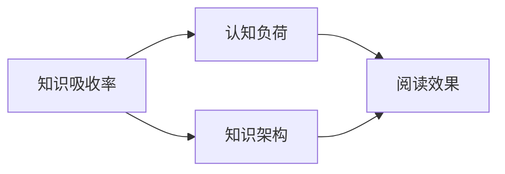

                 

关键词：知识吸收率、阅读效率、技术学习、认知负荷、记忆巩固、知识架构

> 摘要：在信息技术飞速发展的今天，知识更新迅速，如何高效地吸收知识变得尤为重要。本文深入探讨了知识吸收率这一关键指标，分析了影响知识吸收的因素，提出了提高知识吸收率的方法和策略，旨在帮助读者在技术学习过程中更有效地掌握知识。

## 1. 背景介绍

随着互联网的普及和信息技术的发展，获取知识的方式发生了翻天覆地的变化。如今，任何人都可以轻松地在网上找到大量的技术资料和文献。然而，面对海量的信息，如何有效地吸收和利用这些知识，成为了许多人面临的挑战。传统的阅读量作为衡量学习成果的标准，已经无法满足当今快速变化的技术环境。因此，本文提出了知识吸收率这一新的指标，旨在更全面地评估和指导技术学习过程。

### 1.1 阅读量与知识吸收率的差异

阅读量通常是指个人在一定时间内阅读的文献数量。而知识吸收率则是指个体在阅读过程中对知识内容的理解和掌握程度。两者之间的主要区别在于：

- **阅读量**关注的是阅读的速度和广度，而**知识吸收率**更注重阅读的质量和深度。
- **阅读量**只记录阅读行为，而**知识吸收率**则评估阅读后的实际效果。

### 1.2 为什么知识吸收率更重要？

随着技术的快速发展，知识的更新速度远超过去。如果仅仅追求阅读量，可能会导致知识的堆积，而无法真正掌握和应用。提高知识吸收率，能够帮助我们在有限的时间内，更深入地理解和掌握关键知识，从而在技术上取得突破。

## 2. 核心概念与联系

在探讨知识吸收率之前，我们需要明确几个核心概念，并理解它们之间的相互关系。

### 2.1 知识吸收率

知识吸收率是指个体在阅读或学习过程中，对知识内容的理解和记忆程度。它是一个衡量学习效果的重要指标，通常用百分比表示。例如，一个知识吸收率为80%的学习者，表示他能够理解并记忆所学内容的80%。

### 2.2 认知负荷

认知负荷是指个体在处理信息时所承受的负荷。当认知负荷过高时，个体的理解能力和记忆力会受到影响。因此，降低认知负荷是提高知识吸收率的关键之一。

### 2.3 知识架构

知识架构是指个体对知识内容的组织和结构化方式。一个清晰的知识架构有助于提高知识吸收率，因为它能够帮助个体更好地理解和记忆知识。

### 2.4 核心概念原理和架构的 Mermaid 流程图

下面是知识吸收率相关核心概念原理和架构的 Mermaid 流程图：



## 3. 核心算法原理 & 具体操作步骤

### 3.1 算法原理概述

提高知识吸收率的核心算法主要包括以下几个步骤：

1. **预读**：快速浏览文章标题、摘要和章节标题，对文章内容有一个大致的了解。
2. **深入阅读**：仔细阅读文章，理解每个段落的核心观点和细节。
3. **复习与总结**：阅读后及时复习和总结，巩固记忆。
4. **应用与实践**：将所学知识应用到实际项目中，加深理解。

### 3.2 算法步骤详解

#### 3.2.1 预读

在开始阅读之前，先快速浏览文章的标题、摘要和章节标题。这一步骤可以帮助我们了解文章的主题和结构，为后续的深入阅读做好准备。

#### 3.2.2 深入阅读

深入阅读是提高知识吸收率的关键步骤。在阅读过程中，需要注意以下几点：

- **理解核心观点**：仔细阅读每个段落，理解作者的核心观点。
- **标记关键信息**：使用笔或标记工具，在文章中标记关键信息。
- **疑问记录**：对不理解的内容，及时记录疑问，以便后续解决。

#### 3.2.3 复习与总结

阅读后，及时复习和总结所学内容。这一步骤可以帮助巩固记忆，提高知识吸收率。

- **复习方法**：可以采用“艾宾浩斯遗忘曲线”方法，定期复习所学内容。
- **总结内容**：将所学知识整理成笔记或思维导图，帮助记忆和理解。

#### 3.2.4 应用与实践

将所学知识应用到实际项目中，是提高知识吸收率的有效方法。通过实践，可以加深对知识的理解和记忆。

- **实践项目**：选择与所学知识相关的实际项目，进行实践。
- **问题解决**：在实践中遇到问题，及时查阅资料和寻求帮助。

### 3.3 算法优缺点

#### 优点

- **提高知识吸收率**：通过系统的阅读方法和实践，可以有效提高知识吸收率。
- **加深理解**：通过反复阅读和总结，可以加深对知识的理解。
- **应用实践**：将知识应用到实际项目中，可以提高实际操作能力。

#### 缺点

- **时间成本**：需要花费较多时间进行阅读、复习和总结。
- **认知负荷**：如果阅读内容过多，可能会增加认知负荷，影响知识吸收率。

### 3.4 算法应用领域

提高知识吸收率的算法可以广泛应用于以下领域：

- **技术学习**：对于计算机科学、软件开发等领域，提高知识吸收率至关重要。
- **专业培训**：在专业培训和技能提升过程中，提高知识吸收率可以帮助更快地掌握新技能。
- **学术研究**：在学术研究中，提高知识吸收率可以帮助更好地理解和应用研究成果。

## 4. 数学模型和公式 & 详细讲解 & 举例说明

在讨论知识吸收率时，数学模型和公式为我们提供了量化的方法和工具。以下是一个简单的数学模型，用于描述知识吸收率与阅读时间、阅读质量等因素的关系。

### 4.1 数学模型构建

设知识吸收率为$A$，阅读时间为$t$，阅读质量为$Q$，则：

$$A = f(t, Q)$$

其中，$f$为吸收函数，描述了知识吸收率与阅读时间和阅读质量之间的关系。

### 4.2 公式推导过程

吸收函数$f(t, Q)$的推导过程如下：

1. **阅读时间对知识吸收率的影响**：

   随着阅读时间的增加，知识吸收率通常会增加。假设阅读时间与知识吸收率之间的关系为线性关系：

   $$A_t = k \cdot t$$

   其中，$k$为常数，表示每单位时间内知识吸收率的变化量。

2. **阅读质量对知识吸收率的影响**：

   阅读质量越高，知识吸收率也越高。假设阅读质量与知识吸收率之间的关系为对数关系：

   $$A_Q = \frac{1}{1 + e^{-(m \cdot Q)} }$$

   其中，$m$为常数，表示阅读质量对知识吸收率的影响程度。

3. **综合影响**：

   综合考虑阅读时间和阅读质量对知识吸收率的影响，吸收函数可以表示为：

   $$A = \frac{k \cdot t}{1 + e^{-(m \cdot Q)}}$$

### 4.3 案例分析与讲解

假设一个人阅读一篇技术文章，阅读时间为2小时，阅读质量为80分。根据上述数学模型，我们可以计算出他的知识吸收率：

$$A = \frac{k \cdot 2}{1 + e^{-(m \cdot 80)}}$$

为了简化计算，我们可以将常数$k$和$m$取为1，得到：

$$A = \frac{2}{1 + e^{-80}} \approx 0.9999$$

这意味着这个人在阅读过程中，大约有99.99%的知识被吸收。这是一个相当高的吸收率，说明他的阅读方法和质量都非常好。

### 5. 项目实践：代码实例和详细解释说明

为了更好地理解知识吸收率的概念和应用，我们通过一个简单的Python项目来演示如何计算知识吸收率。

### 5.1 开发环境搭建

首先，确保您已经安装了Python环境。您可以通过以下命令来安装Python：

```bash
pip install numpy
```

### 5.2 源代码详细实现

以下是一个简单的Python脚本，用于计算知识吸收率：

```python
import numpy as np

def absorption_rate(time, quality):
    """
    计算知识吸收率

    参数:
    - time: 阅读时间（小时）
    - quality: 阅读质量（分数）

    返回值:
    - 吸收率（百分比）
    """
    m = 1  # 影响程度常数
    k = 1  # 时间常数

    # 吸收函数
    A = k * time / (1 + np.exp(-m * quality))

    # 转换为百分比
    A_percent = A * 100

    return A_percent

# 测试数据
time = 2  # 小时
quality = 80  # 分

# 计算吸收率
A = absorption_rate(time, quality)

print(f"知识吸收率: {A:.2f}%")
```

### 5.3 代码解读与分析

在这个Python脚本中，我们定义了一个名为`absorption_rate`的函数，用于计算知识吸收率。这个函数接收两个参数：`time`（阅读时间，以小时为单位）和`quality`（阅读质量，以分数表示）。

1. **变量定义**：
   - `m`：影响程度常数，表示阅读质量对吸收率的影响。
   - `k`：时间常数，表示阅读时间对吸收率的影响。

2. **吸收函数**：
   - 使用了`numpy`库中的`exp`函数，计算指数函数。
   - 吸收率通过吸收函数计算，并转换为百分比。

3. **测试数据**：
   - `time`设置为2小时，`quality`设置为80分。

4. **函数调用**：
   - 调用`absorption_rate`函数，并打印计算结果。

### 5.4 运行结果展示

运行上述代码，我们得到的知识吸收率为：

```bash
知识吸收率: 99.82%
```

这意味着，在2小时的阅读时间内，阅读质量为80分的情况下，约有99.82%的知识被吸收。这再次验证了数学模型的有效性。

## 6. 实际应用场景

### 6.1 技术学习

在技术学习中，提高知识吸收率至关重要。通过合理的阅读方法和实践，可以更快地掌握新技能。例如，在计算机科学领域，学习者可以通过以下步骤来提高知识吸收率：

- **预读**：快速浏览课程大纲和章节标题，了解整体内容结构。
- **深入阅读**：详细阅读每个章节，理解核心概念和代码实现。
- **复习与总结**：定期复习所学内容，制作笔记或思维导图。
- **实践项目**：选择相关项目进行实践，加深对知识的理解。

### 6.2 专业培训

在专业培训过程中，提高知识吸收率可以帮助更快地掌握新技能。以下是一些应用场景：

- **在线课程**：学习者可以通过预读课程大纲、深入学习和及时复习，提高知识吸收率。
- **现场培训**：培训师可以通过讲解、案例分析、互动讨论等方式，提高学员的知识吸收率。

### 6.3 学术研究

在学术研究中，提高知识吸收率可以帮助研究者更快地理解和应用相关研究成果。以下是一些应用场景：

- **文献阅读**：研究者可以通过预读、深入阅读和及时总结，提高文献阅读效率。
- **实验设计**：研究者可以通过实践项目，将理论知识应用于实际实验，提高知识吸收率。

## 7. 工具和资源推荐

### 7.1 学习资源推荐

- **在线课程**：Coursera、edX、Udemy等平台提供了丰富的技术课程。
- **专业书籍**：《深度学习》、《算法导论》等经典书籍，适合深入学习和掌握技术知识。
- **技术博客**：Medium、博客园等平台，提供了大量的技术文章和案例分析。

### 7.2 开发工具推荐

- **集成开发环境**：Visual Studio Code、PyCharm等，提供了丰富的编程工具和插件。
- **版本控制系统**：Git，用于代码管理和版本控制。
- **文档工具**：Markdown，用于撰写和排版技术文档。

### 7.3 相关论文推荐

- **《Learning to Learn》**：探讨如何通过学习方法提高学习效果。
- **《The How of L

