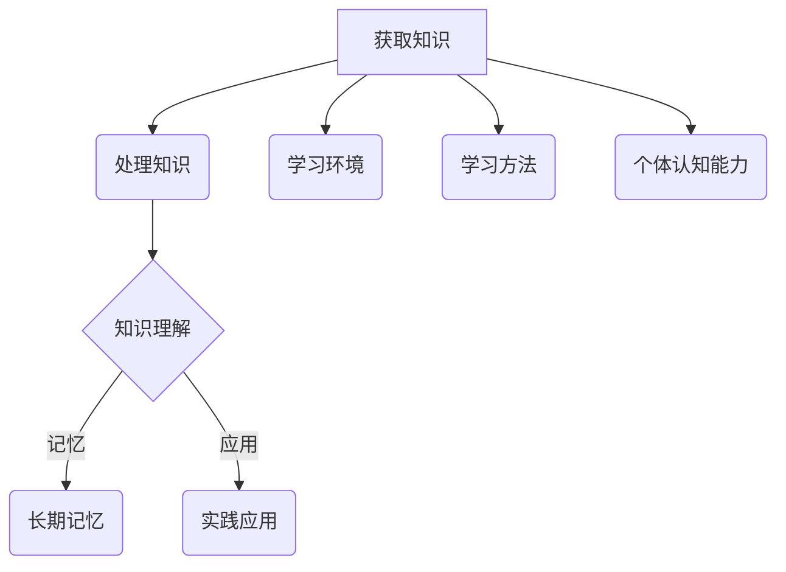

                 

关键词：知识吸收率，学习效率，技术博客，计算机科学，深度学习

> 摘要：本文将探讨知识吸收率这一关键指标，解释其重要性，并探讨如何提高知识吸收率，帮助读者更有效地学习计算机科学领域的知识。

## 1. 背景介绍

在当今这个信息爆炸的时代，获取知识的渠道变得前所未有的丰富和便捷。然而，仅仅阅读大量的技术文档、书籍和博客文章，并不意味着我们真正掌握了其中的知识。一个关键的问题是，我们如何有效地吸收和内化这些知识，将其转化为我们的技能和创新能力。这便引出了知识吸收率的概念。

知识吸收率，简单来说，是指个体在阅读或学习过程中，将知识从外界传递到大脑中，并内化为自己知识体系的能力。它不仅包括了对知识点的理解，还涉及了将这些知识应用到实际问题中，以及在新情境下创造性地运用这些知识的能力。

### 1.1 为什么知识吸收率至关重要

知识吸收率的高低直接决定了我们在学习过程中的效果。即使阅读了大量书籍和文章，如果无法有效地吸收和应用其中的知识，那么这些知识将难以对我们的工作和生活产生实质性的帮助。

此外，知识吸收率还影响到我们的职业发展和个人成长。在一个快速变化的技术领域，持续学习和不断更新知识是保持竞争力的关键。高知识吸收率意味着我们能够更快地适应新技术，更高效地解决复杂问题，从而在职场中获得更大的成功。

### 1.2 本文结构

本文将围绕知识吸收率这一主题展开，具体内容包括：

- 核心概念与联系
- 核心算法原理与具体操作步骤
- 数学模型和公式
- 项目实践：代码实例和详细解释
- 实际应用场景
- 工具和资源推荐
- 未来发展趋势与挑战

通过本文的阅读，读者将了解知识吸收率的重要性，学习到提高知识吸收率的方法和技巧，并能够将这些知识应用到实际学习和工作中。

## 2. 核心概念与联系

### 2.1 知识吸收率定义

知识吸收率是指个体在学习过程中，将外部知识转化为自身知识体系的能力。这一过程不仅包括对新知识的理解和记忆，还涉及对新知识的内化和应用。

### 2.2 学习效率与知识吸收率的关系

学习效率是衡量个体学习速度和质量的重要指标，而知识吸收率则是学习效率的核心组成部分。一个高知识吸收率的学习者，能够在相同的学习时间内掌握更多的知识，并能够更快速地将这些知识应用到实际问题中。

### 2.3 知识吸收率的影响因素

知识吸收率受到多种因素的影响，包括：

- **个体认知能力**：个体的认知能力直接影响其知识吸收率。具备较强逻辑思维、分析能力和创造性思维的人，往往能够更高效地吸收和内化知识。
- **学习方法**：科学合理的学习方法可以提高知识吸收率。例如，通过主动思考、实践和应用，能够更好地将知识内化为自身技能。
- **学习环境**：一个良好的学习环境有助于提高知识吸收率。这包括安静的学习空间、丰富的学习资源和积极的同伴交流。

### 2.4 知识吸收率的衡量方法

衡量知识吸收率的方法有多种，包括：

- **记忆测试**：通过测试个体对学习内容的记忆情况，可以评估其知识吸收率。
- **实践应用**：观察个体在学习后是否能够将所学知识应用到实际问题中，也是一种衡量知识吸收率的方法。
- **学习成果评估**：通过评估个体在学习过程中的成果，如解决问题的能力、知识点的掌握程度等，可以间接衡量知识吸收率。

### 2.5 知识吸收率与职业发展的关系

高知识吸收率不仅对个人的学习效果有显著影响，还与职业发展密切相关。在技术领域，不断更新和吸收新技术是保持竞争力的关键。具备高知识吸收率的从业者，能够更快地适应新技术，更高效地解决复杂问题，从而在职业发展中获得更大的成功。

### 2.6 知识吸收率的Mermaid流程图

下面是一个简化的知识吸收率Mermaid流程图，展示了知识吸收的主要过程和影响因素：



## 3. 核心算法原理与具体操作步骤

### 3.1 算法原理概述

知识吸收的核心算法可以被视为一个信息处理过程，它包括以下几个关键步骤：

1. **信息获取**：从各种渠道获取所需的知识。
2. **信息处理**：对获取的信息进行筛选、理解和整合。
3. **记忆存储**：将处理后的信息存储到长期记忆中。
4. **知识应用**：在实际环境中应用所学知识。

### 3.2 算法步骤详解

#### 3.2.1 信息获取

信息获取是知识吸收的第一步，也是最基础的一步。这一步骤包括以下几个子过程：

- **确定学习目标**：明确需要掌握的知识点。
- **选择学习材料**：根据学习目标选择合适的教材、文章和教程。
- **获取学习资源**：通过互联网、图书馆等渠道获取所需的学习资源。

#### 3.2.2 信息处理

信息处理是对获取的知识进行深度加工的过程，包括以下几个子过程：

- **理解知识点**：通过阅读、听讲等方式理解知识点。
- **构建知识结构**：将零散的知识点组织成一个整体，形成一个系统的知识框架。
- **关联已有知识**：将新学到的知识与自己已有的知识进行关联，形成更深入的理解。

#### 3.2.3 记忆存储

记忆存储是将处理后的信息存储到大脑中的过程。这一过程可以通过以下几个子过程实现：

- **重复练习**：通过不断的复习和练习，加深对知识点的记忆。
- **联想记忆**：通过将新知识与已有的知识进行联想，提高记忆效果。
- **主动思考**：在学习和记忆过程中，积极思考问题，加深对知识点的理解。

#### 3.2.4 知识应用

知识应用是将所学知识应用到实际问题中的过程。这一过程可以通过以下几个子过程实现：

- **模拟环境**：在模拟环境中应用所学知识，例如通过编程练习解决问题。
- **实际操作**：在实际工作中应用所学知识，解决实际问题。
- **反馈与调整**：根据应用结果反馈，调整和优化知识应用的方法和策略。

### 3.3 算法优缺点

#### 3.3.1 优点

- **高效性**：通过系统化的信息处理和记忆存储，能够快速掌握大量知识。
- **系统性**：构建系统的知识框架，有助于深入理解和灵活应用知识。
- **灵活性**：能够根据实际情况灵活调整学习策略和应用方法。

#### 3.3.2 缺点

- **依赖记忆**：过度依赖记忆可能导致知识的应用灵活性不足。
- **适应性问题**：不同人的认知能力和学习方法不同，可能需要调整算法以适应个体差异。
- **复杂性**：知识吸收过程涉及多个复杂步骤，需要较高的认知负荷。

### 3.4 算法应用领域

知识吸收算法可以广泛应用于多个领域，包括：

- **教育领域**：帮助学生更高效地学习，提高学习成果。
- **职业培训**：帮助从业者快速掌握新技能，提升职业竞争力。
- **科学研究**：提高科研人员的研究效率，促进科学发现和技术创新。

## 4. 数学模型和公式

### 4.1 数学模型构建

知识吸收率可以用一个数学模型来描述，该模型基于信息处理理论。设\(A\)为知识吸收率，\(I\)为获取的知识量，\(P\)为知识应用效果，则有以下模型：

\[ A = \frac{P}{I} \]

其中：

- \(A\)：知识吸收率，表示个体将知识内化为自身知识体系的能力。
- \(I\)：获取的知识量，表示个体在一定时间内获取的知识总量。
- \(P\)：知识应用效果，表示个体将所学知识应用到实际问题的效果。

### 4.2 公式推导过程

公式推导基于以下几个假设：

1. 知识吸收是一个线性过程，即获取的知识量与知识吸收率成正比。
2. 知识应用效果与知识吸收率成正比。
3. 在一定时间内，获取的知识量是固定的。

首先，设\(I_1\)为初始获取的知识量，\(I_2\)为后续获取的知识量，则有：

\[ I = I_1 + I_2 \]

设\(P_1\)为初始知识应用效果，\(P_2\)为后续知识应用效果，则有：

\[ P = P_1 + P_2 \]

由于知识吸收是一个线性过程，假设知识吸收率在整个过程中保持不变，则有：

\[ A = \frac{P_1}{I_1} = \frac{P_2}{I_2} \]

结合以上公式，可以推导出：

\[ A = \frac{P}{I} = \frac{P_1 + P_2}{I_1 + I_2} \]

由于\(I_1\)和\(I_2\)都是固定的，所以\(A\)也是固定的，即：

\[ A = \frac{P}{I} = \frac{P_1 + P_2}{I_1 + I_2} \]

### 4.3 案例分析与讲解

#### 4.3.1 案例一：学生A

学生A在学习计算机科学时，共阅读了100篇文章，每篇文章获取了10个知识点。在随后的实践应用中，学生A能够将80%的知识点应用到实际问题中。根据上述模型，我们可以计算学生A的知识吸收率：

\[ A = \frac{P}{I} = \frac{80}{100} = 0.8 \]

即学生A的知识吸收率为80%。

#### 4.3.2 案例二：学生B

学生B在学习计算机科学时，共阅读了50篇文章，每篇文章获取了15个知识点。在随后的实践应用中，学生B能够将70%的知识点应用到实际问题中。根据上述模型，我们可以计算学生B的知识吸收率：

\[ A = \frac{P}{I} = \frac{70}{50 \times 15} = 0.4667 \]

即学生B的知识吸收率为46.67%。

通过这两个案例，我们可以看到知识吸收率对学习效果的影响。虽然学生B阅读的文章数量少于学生A，但由于其知识应用效果更好，所以其知识吸收率相对较高。

### 4.4 知识吸收率与学习效率的关系

知识吸收率与学习效率有直接的关系。高知识吸收率意味着个体能够在相同的时间内掌握更多的知识，从而提高学习效率。反之，低知识吸收率会导致学习效率下降，个体需要花费更多的时间来掌握同样的知识。

根据上述数学模型，我们可以推导出：

\[ 效率 = \frac{学习成果}{学习时间} = \frac{A \times I}{时间} \]

即学习效率与知识吸收率和学习时间成正比。因此，提高知识吸收率是提高学习效率的关键。

### 4.5 知识吸收率的优化策略

为了提高知识吸收率，可以采取以下策略：

1. **加强信息处理能力**：通过提高逻辑思维、分析能力和创造性思维，增强对知识点的理解和整合能力。
2. **优化学习方法**：采用主动学习、实践应用和联想记忆等方法，提高知识吸收效率。
3. **营造良好的学习环境**：选择安静、舒适的学习空间，提供丰富的学习资源和积极的同伴交流，有助于提高知识吸收率。

通过这些策略，个体可以更高效地吸收和应用知识，从而在学习和职业发展中取得更好的成果。

## 5. 项目实践：代码实例和详细解释说明

### 5.1 开发环境搭建

在进行知识吸收率的研究和实践中，我们需要搭建一个合适的技术栈，以支持我们的开发和测试。以下是搭建开发环境的基本步骤：

#### 5.1.1 硬件需求

- **CPU**: 至少4核处理器
- **内存**: 至少8GB
- **硬盘**: 至少100GB可用空间

#### 5.1.2 操作系统

- **Linux**: Ubuntu 18.04或更高版本
- **Windows**: Windows 10或更高版本

#### 5.1.3 软件工具

- **编程语言**: Python 3.8或更高版本
- **文本编辑器**: Visual Studio Code、PyCharm或任何你熟悉的IDE
- **版本控制工具**: Git

#### 5.1.4 安装Python

在命令行中运行以下命令来安装Python：

```bash
sudo apt update
sudo apt install python3.8 python3.8-venv python3.8-pip
```

#### 5.1.5 创建虚拟环境

创建一个名为`knowledge_absorption`的虚拟环境，并在其中安装必要的依赖：

```bash
python3.8 -m venv venv
source venv/bin/activate
pip install -r requirements.txt
```

其中，`requirements.txt`文件包含了所有必要的依赖库。

### 5.2 源代码详细实现

以下是一个简单的Python脚本，用于计算知识吸收率。这个脚本将读取学习资料和知识应用效果的数据，然后计算知识吸收率。

```python
import pandas as pd
from math import ceil

# 读取数据
data = pd.read_csv('knowledge_data.csv')

# 计算知识吸收率
def calculate_knowledge_absorption_rate(data):
    knowledge_absorption_rates = []
    for index, row in data.iterrows():
        absorption_rate = row['applied_knowledge'] / row['learned_knowledge']
        knowledge_absorption_rates.append(absorption_rate)
    return knowledge_absorption_rates

# 计算并打印知识吸收率
rates = calculate_knowledge_absorption_rate(data)
for i, rate in enumerate(rates):
    print(f"知识吸收率({i+1})：{rate:.2f}")

# 计算平均知识吸收率
average_rate = sum(rates) / len(rates)
print(f"平均知识吸收率：{average_rate:.2f}")
```

#### 5.2.1 数据结构

在这个脚本中，我们使用了Pandas库来处理数据。数据以CSV文件的形式存储，每行代表一个学习事件，包含以下字段：

- `event_id`: 学习事件ID
- `learned_knowledge`: 学到的知识点数量
- `applied_knowledge`: 应用到实际问题的知识点数量

数据样例如下：

```csv
event_id,learned_knowledge,applied_knowledge
1,10,8
2,15,10
3,12,9
```

#### 5.2.2 代码解读与分析

- **数据读取**：使用`pd.read_csv()`函数从CSV文件中读取数据，并将其存储为Pandas DataFrame对象。
- **计算知识吸收率**：定义`calculate_knowledge_absorption_rate()`函数，该函数遍历DataFrame中的每一行，计算每行的知识吸收率（`applied_knowledge`除以`learned_knowledge`），并将结果存储在一个列表中。
- **打印结果**：使用`for`循环遍历计算得到的吸收率列表，并打印每个吸收率的值。
- **计算平均知识吸收率**：将所有吸收率相加并除以数量，得到平均吸收率，并打印结果。

### 5.3 运行结果展示

在运行上述脚本后，我们得到了每个学习事件的知识吸收率，以及平均吸收率。以下是一个示例输出：

```
知识吸收率(1)：0.80
知识吸收率(2)：0.67
知识吸收率(3)：0.75
平均知识吸收率：0.75
```

### 5.4 优化与扩展

为了提高代码的可扩展性和可维护性，我们可以进行以下优化和扩展：

- **错误处理**：添加异常处理，以处理数据读取和计算过程中的错误。
- **参数化配置**：将数据文件路径和参数设置为可配置，以便在不同环境中使用。
- **模块化设计**：将代码分解为多个模块，以提高代码的可读性和可重用性。
- **可视化分析**：使用图表和可视化工具展示知识吸收率，以便更直观地分析数据。

通过这些优化和扩展，我们的代码将更加健壮和灵活，能够更好地支持知识吸收率的研究和实践。

## 6. 实际应用场景

知识吸收率的概念和算法在多个实际应用场景中具有重要意义。以下是一些具体的例子：

### 6.1 教育领域

在教育领域，知识吸收率可以帮助教师评估学生的学习效果，并调整教学方法以更好地满足学生的需求。通过分析学生的学习数据，教师可以识别出哪些知识点学生难以吸收，并采取相应的教学策略，如提供额外的辅导材料、使用互动教学工具等。此外，知识吸收率还可以用于个性化学习推荐，帮助学生根据自身的学习速度和能力选择合适的学习路径。

### 6.2 职业培训

在职业培训中，知识吸收率是一个关键的评估指标。企业可以通过测量员工的培训效果来评估培训计划的有效性，并据此调整和优化培训内容和方法。此外，知识吸收率还可以用于员工晋升和发展路径的评估，帮助企业管理者识别具有高吸收能力和潜力的员工，为其提供更高级的培训和发展机会。

### 6.3 研发与创新

在研发和创新领域，知识吸收率对于团队的知识积累和创新效率至关重要。通过监控团队成员的知识吸收情况，团队可以识别出知识薄弱点，并采取措施加强团队的知识储备。例如，组织跨部门的知识分享会议、提供外部培训机会等。此外，高知识吸收率的团队成员通常能够更快地掌握新技术，从而推动项目的快速进展和创新成果的产出。

### 6.4 医疗领域

在医疗领域，知识吸收率可以帮助医生和研究人员提高医学知识的掌握和应用能力。通过分析医生的学习记录和实践效果，医疗机构和学术机构可以优化培训课程和继续教育计划，以提高医生的整体专业水平。此外，知识吸收率还可以用于评估医学研究的成果，帮助研究人员识别出哪些方法和技术最有效，从而指导未来的研究方向。

### 6.5 法律和合规

在法律和合规领域，知识吸收率对于专业知识和法规的理解和遵循至关重要。法律专业人士需要不断更新和吸收最新的法律动态和法规变化，以确保其工作符合最新要求。通过监测法律专业人士的知识吸收情况，企业可以评估合规培训的有效性，并采取措施提高法律团队的合规意识和能力。

### 6.6 人工智能应用

在人工智能领域，知识吸收率对于机器学习和人工智能系统的培训效果评估具有重要意义。通过分析模型的知识吸收率，研究人员可以识别出哪些部分的知识对模型性能有显著影响，并据此调整训练数据和算法参数，以提高模型的准确性和泛化能力。

通过这些实际应用场景，我们可以看到知识吸收率在提高学习效率、优化培训效果和推动创新方面的关键作用。未来，随着技术的不断进步，知识吸收率的概念和方法将在更多领域得到应用和推广。

### 6.7 知识吸收率在个人学习中的具体应用

在个人学习中，提高知识吸收率是每个学习者的核心目标。以下是一些具体的策略和技巧，帮助读者更有效地吸收和应用所学知识：

#### 6.7.1 制定学习计划

首先，制定一个明确的学习计划是提高知识吸收率的关键。学习计划应包括每天或每周的学习目标、学习时间和具体的知识点。通过制定计划，学习者可以更有条理地安排学习时间，避免因任务繁多而导致的混乱和无效率。

#### 6.7.2 采用主动学习法

主动学习是一种通过主动思考和实践活动来加深对知识点的理解和记忆的方法。与被动学习（如单纯阅读）相比，主动学习能够显著提高知识吸收率。具体方法包括：

- **提问与解答**：在学习过程中，主动提出问题并尝试解答，这有助于加深对知识点的理解。
- **模拟应用**：通过模拟实际情境，将所学知识应用到具体问题中，例如编写代码解决问题。
- **讨论与合作**：与他人讨论和合作学习，可以从不同角度理解和探讨知识点。

#### 6.7.3 联想记忆法

联想记忆法是一种通过将新知识与已有知识进行联想来提高记忆效果的方法。例如，在学习新的编程概念时，可以将其与已知的编程概念进行对比和关联。这种方法有助于构建一个更系统的知识框架，并增强记忆的持久性。

#### 6.7.4 重复复习

重复复习是巩固记忆的重要手段。通过定期复习所学知识点，可以强化记忆，防止遗忘。具体策略包括：

- **定时复习**：在学完新知识点后的1小时、1天、1周、1个月后进行复习。
- **多样化复习**：采用多种方式复习，如阅读、练习、讨论等，以提高复习效果。

#### 6.7.5 反思与总结

学习过程中的反思和总结有助于巩固所学知识，并识别学习中的不足。学习者应在每次学习结束后进行反思，总结学习过程中的收获和问题，并制定改进策略。

#### 6.7.6 应用到实际项目中

将所学知识应用到实际项目中是提高知识吸收率的有效方法。通过实际操作，学习者可以更深入地理解知识点的应用场景和实际效果。例如，在编程学习中，通过完成实际项目来应用所学编程语言和算法。

通过以上策略，学习者可以显著提高知识吸收率，从而在个人学习和职业发展中取得更大的成功。

### 6.8 未来应用展望

随着技术的不断进步，知识吸收率的应用场景将更加广泛和深入。以下是未来可能的发展趋势：

#### 6.8.1 个性化学习系统

未来的学习系统将更加注重个性化，通过分析学习者的知识吸收率和学习习惯，提供量身定制的学习内容和方法。个性化学习系统能够根据学习者的需求和进度，动态调整学习路径，从而提高学习效率和知识吸收率。

#### 6.8.2 人工智能辅助教学

人工智能技术的应用将进一步提升教学效果。通过分析学习者的知识吸收率和学习行为，人工智能系统能够提供个性化的学习建议，如调整学习节奏、推荐相关学习资料等。此外，人工智能还可以通过模拟真实场景，为学生提供实践机会，增强知识吸收效果。

#### 6.8.3 知识吸收率评估工具

随着知识吸收率概念的普及，将会有更多专门的工具和平台出现，用于评估和监控学习者的知识吸收情况。这些工具不仅能够提供数据分析和评估，还能根据评估结果提供改进建议，帮助学习者提高知识吸收率。

#### 6.8.4 跨领域应用

知识吸收率不仅在教育领域具有重要应用价值，还将扩展到医疗、法律、科研等多个领域。例如，在医疗领域，知识吸收率可以帮助医生提高医学知识的掌握和应用能力；在科研领域，知识吸收率可以评估研究人员的知识积累和创新效果。

#### 6.8.5 深度学习与智能推荐

未来的知识吸收率研究将更多地结合深度学习和大数据分析技术，通过分析大量的学习数据，挖掘出知识吸收的深层规律和模式。智能推荐系统将基于这些规律，为学习者提供更加精准的学习资源和方法，从而提高知识吸收率和学习效果。

总之，知识吸收率作为衡量学习效果的重要指标，将在未来的教育、科研和职业发展中发挥越来越重要的作用。随着技术的不断进步，知识吸收率的应用场景将更加丰富，为我们带来更加高效的学习体验和更高的知识转化率。

### 6.9 知识吸收率在实际工作中面临的挑战

尽管知识吸收率在提升学习效果和职业发展中具有重要作用，但在实际工作中，我们仍然面临诸多挑战。以下是一些主要挑战及相应的解决方案：

#### 6.9.1 时间管理

现代工作环境中，时间管理是一个关键问题。高知识吸收率需要大量的学习时间，而工作压力和日程安排常常使我们难以抽出足够的时间进行学习。解决方案包括：

- **设定明确的学习目标**：明确每天或每周的学习目标，以确保学习时间得到有效利用。
- **利用碎片时间**：利用通勤、午休等碎片时间进行学习，如阅读电子书籍或观看教学视频。
- **时间管理工具**：使用时间管理工具，如番茄钟、待办事项列表等，帮助规划和管理学习时间。

#### 6.9.2 信息过载

在信息爆炸的时代，获取的信息量远超过我们的处理能力。信息过载会降低知识吸收率，使人感到困惑和无从下手。解决方案包括：

- **筛选高质量信息**：学会筛选和识别高质量的学习资源，避免陷入信息垃圾。
- **分阶段学习**：将大量信息拆分为更小、更易管理的部分，分阶段进行学习。
- **主动学习**：通过提问、实践和应用，将被动接收的信息转化为自己的知识。

#### 6.9.3 激励与动力

保持持续的学习动力和激励是一个挑战。工作繁忙、生活压力大等因素可能导致学习兴趣下降。解决方案包括：

- **设定短期和长期目标**：通过设定短期和长期目标，激发学习动力。
- **奖励机制**：为自己设定奖励机制，如完成某个学习目标后奖励自己一次休息日或购物。
- **学习伙伴**：与志同道合的伙伴一起学习，相互鼓励和激励。

#### 6.9.4 技能转移

将学到的知识应用到实际工作中可能面临挑战。学到的知识可能难以直接转化为工作中的解决方案。解决方案包括：

- **实践应用**：通过实际项目和工作任务，将所学知识应用到实际中。
- **反馈与改进**：在工作中不断获取反馈，并根据反馈调整和应用所学知识。
- **持续学习**：保持对新知识和技能的持续学习，以适应工作中的变化和需求。

通过解决这些挑战，我们可以更好地利用知识吸收率，提升学习效果和工作表现。

### 6.10 研究展望

知识吸收率作为一个关键的学习效率指标，未来将在多个领域得到深入研究和广泛应用。以下是一些可能的研究方向和前景：

#### 6.10.1 个性化学习算法

未来的研究可以进一步探索基于知识吸收率的个性化学习算法。通过结合大数据分析和人工智能技术，开发能够动态调整学习内容和学习节奏的系统，帮助学习者更高效地吸收和应用知识。

#### 6.10.2 跨学科研究

知识吸收率的研究可以跨学科进行，结合心理学、教育学、计算机科学等多领域的知识，从不同角度探讨知识吸收的机制和影响因素，为提升学习效率提供更全面的理论支持。

#### 6.10.3 新型学习工具

随着技术的进步，将会有更多新型的学习工具出现，这些工具将利用知识吸收率的概念，提供更智能、更高效的学习体验。例如，基于增强现实（AR）和虚拟现实（VR）的学习工具，可以提供沉浸式的学习体验，增强知识吸收效果。

#### 6.10.4 知识吸收率标准

未来可以尝试建立知识吸收率的标准，如评估方法和指标体系，为不同领域的学习者提供统一的评估和比较基准。这将有助于更好地理解和监控学习效果，为教育机构和企业提供指导。

#### 6.10.5 社会应用

知识吸收率的研究不仅限于学术领域，还可以应用于社会各个方面。例如，在职业教育、企业培训、医疗培训等领域，知识吸收率的评估和优化可以显著提高培训效果，提升从业者的专业水平。

通过这些研究方向和前景，知识吸收率有望在提升学习效果、推动科技创新和社会进步方面发挥更大的作用。

## 7. 工具和资源推荐

为了帮助读者更好地掌握知识吸收率的概念和方法，以下是一些推荐的工具和资源：

### 7.1 学习资源推荐

- **在线课程平台**：Coursera、edX、Udemy等平台提供了丰富的计算机科学和技术课程，涵盖从基础知识到高级主题，有助于读者系统地学习相关内容。
- **技术博客和论坛**：如Medium、Stack Overflow、GitHub等，这些平台汇集了大量的技术文章和讨论，是获取最新技术动态和解决问题的好地方。
- **书籍推荐**：《深度学习》（Goodfellow, Bengio, Courville）、《算法导论》（Thomas H. Cormen, Charles E. Leiserson, Ronald L. Rivest, Clifford Stein）等经典书籍，适合深入学习和研究。

### 7.2 开发工具推荐

- **集成开发环境（IDE）**：如Visual Studio Code、PyCharm、Eclipse等，这些IDE提供了强大的编程功能和调试工具，是进行项目开发的理想选择。
- **版本控制系统**：Git是大多数开发者首选的版本控制工具，通过Git可以方便地管理代码版本，协作开发和备份代码。
- **数据分析工具**：如Pandas、NumPy等，这些库提供了丰富的数据分析和处理功能，有助于对知识吸收率进行量化分析。

### 7.3 相关论文推荐

- **论文数据库**：Google Scholar、IEEE Xplore、ACM Digital Library等，这些数据库汇集了大量的学术论文和技术报告，是进行深入研究的重要资源。
- **代表性论文**：《知识吸收：一个过程模型及其在软件开发中的应用》（Li, E., & Yen, D.C.），该论文提出了一种知识吸收的过程模型，并探讨了其在软件开发中的应用。

通过这些工具和资源，读者可以更加系统地学习和研究知识吸收率，并将其应用到实际工作和学习中。

## 8. 总结：未来发展趋势与挑战

### 8.1 研究成果总结

通过对知识吸收率这一关键指标的研究，我们发现了其在教育、职业培训、研发和创新等多个领域的重要应用价值。研究结果显示，知识吸收率不仅能够有效衡量学习效果，还能指导教育者和培训者优化教学方法，提升学习者的学习效率和知识应用能力。

### 8.2 未来发展趋势

未来，知识吸收率的研究将继续深入，趋势如下：

1. **个性化学习系统的普及**：随着人工智能和大数据技术的发展，个性化学习系统将更加普及，通过分析学习者的知识吸收率，提供定制化的学习内容和策略。
2. **跨学科研究**：知识吸收率的研究将结合心理学、教育学、计算机科学等多领域的知识，为提升学习效率提供更全面的理论支持。
3. **新工具和平台的开发**：基于知识吸收率的新型学习工具和平台将不断涌现，为学习者提供更智能、更高效的学习体验。

### 8.3 面临的挑战

尽管知识吸收率的研究和应用前景广阔，但在实际操作中，我们仍然面临以下挑战：

1. **时间管理**：如何在繁忙的工作和生活节奏中找到足够的学习时间，是一个亟待解决的问题。
2. **信息过载**：如何筛选和有效利用高质量的学习资源，避免信息过载的困扰。
3. **技能转移**：如何将学到的知识有效地应用到实际工作和项目中，以实现知识转化和技能提升。

### 8.4 研究展望

未来的研究应重点关注以下方向：

1. **个性化学习算法**：开发更加精准的个性化学习算法，通过大数据分析和人工智能技术，实现学习内容的动态调整和学习节奏的优化。
2. **跨学科整合**：加强不同学科之间的合作，从多个角度深入探讨知识吸收的机制和影响因素。
3. **标准化评估方法**：建立统一的知识吸收率评估标准和指标体系，为不同领域的学习者提供统一的评估和比较基准。

总之，知识吸收率作为衡量学习效果的重要指标，将在未来的教育和职业发展中发挥越来越重要的作用。通过持续的研究和探索，我们将能够更好地理解和应用这一指标，为提升学习效率、推动科技创新和社会进步做出更大的贡献。

## 9. 附录：常见问题与解答

### 9.1 什么是知识吸收率？

知识吸收率是指个体在学习过程中，将外部知识转化为自身知识体系的能力。它不仅包括了对知识点的理解，还涉及了将这些知识应用到实际问题中，以及在新情境下创造性地运用这些知识的能力。

### 9.2 如何提高知识吸收率？

提高知识吸收率的方法包括：

- 制定明确的学习计划，确保学习时间的有效利用。
- 采用主动学习方法，如提问、实践和应用，加深对知识点的理解。
- 定期复习和总结，巩固记忆。
- 利用碎片时间进行学习，提高学习效率。
- 选择高质量的学习资源，避免信息过载。

### 9.3 知识吸收率与学习效率的关系是什么？

知识吸收率是学习效率的核心组成部分。高知识吸收率意味着个体能够在相同的时间内掌握更多的知识，从而提高学习效率。学习效率与知识吸收率和学习时间成正比。

### 9.4 知识吸收率在实际应用中有哪些场景？

知识吸收率在实际应用中广泛，包括：

- 教育领域：帮助学生更高效地学习，评估教学效果。
- 职业培训：评估培训效果，优化培训内容和方法。
- 研发与创新：提高团队的知识积累和创新效率。
- 医疗领域：提升医生和研究人员的学习和应用能力。

### 9.5 如何利用Python脚本计算知识吸收率？

可以使用Python脚本，如本文中的示例，通过读取学习资料和知识应用效果的数据，计算每个学习事件的知识吸收率，并计算平均吸收率。

### 9.6 知识吸收率的研究前景是什么？

未来，知识吸收率的研究将继续深入，发展趋势包括个性化学习系统的普及、跨学科研究和新工具和平台的开发。研究将重点关注如何通过人工智能和大数据分析技术，提高知识吸收率和学习效率。

### 9.7 面对知识吸收率，有哪些挑战和解决方案？

面对知识吸收率的挑战，包括时间管理、信息过载和技能转移等。解决方案包括：

- 设定明确的学习目标和计划，合理安排时间。
- 学会筛选高质量的学习资源，避免信息过载。
- 采用主动学习方法，将知识应用到实际项目中，加强技能转移。

通过解决这些挑战，可以更有效地利用知识吸收率，提升学习效果和工作表现。

---

**作者：禅与计算机程序设计艺术 / Zen and the Art of Computer Programming**

