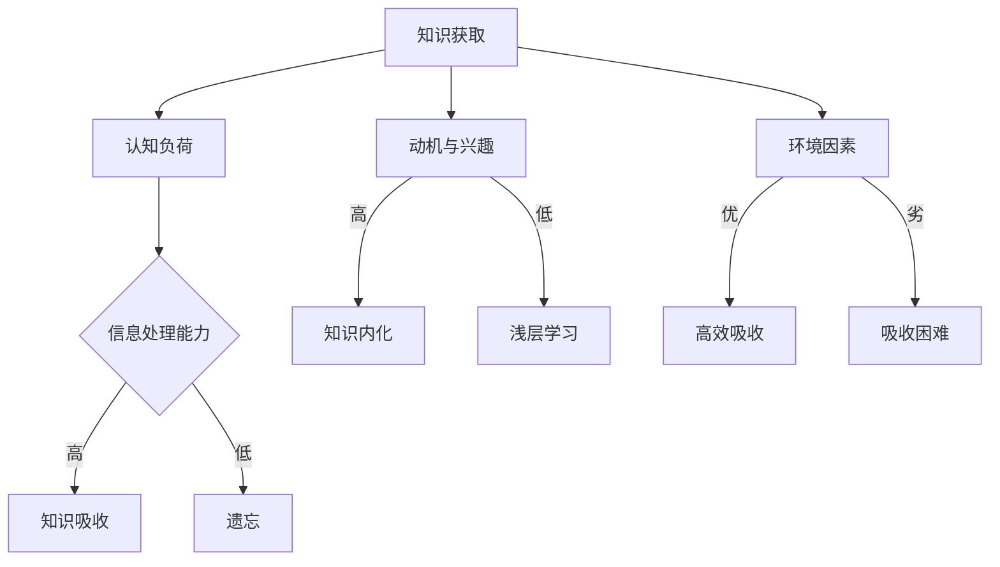
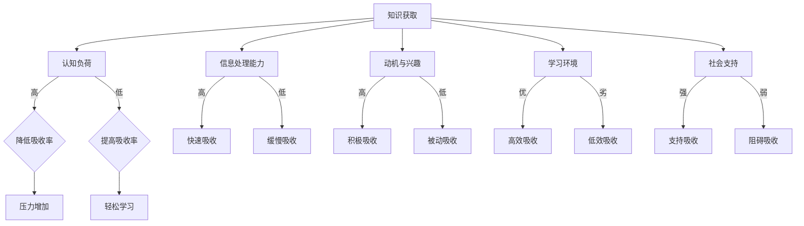

                 

 关键词：知识吸收率、阅读量、信息处理、认知负荷、学习效率、技术博客、专业发展、认知科学

> 摘要：本文深入探讨了知识吸收率这一关键概念，对比了知识吸收率与阅读量的差异，分析了影响知识吸收率的多种因素。通过详细阐述知识吸收率的定义、评估方法以及提高知识吸收率的策略，本文旨在为技术领域的专业人士提供有价值的指导，帮助他们在日益复杂的信息环境中更有效地学习和成长。

## 1. 背景介绍

在信息技术迅猛发展的时代，知识的获取和传播变得前所未有的便捷。互联网上充斥着大量的信息和资源，技术博客、学术论文、在线课程、专业书籍等琳琅满目。然而，随着信息的爆炸式增长，人们不得不面对一个严峻的现实：阅读量并不总是等同于知识的吸收。传统观念中，阅读量的多少常常被当作衡量学习成效的标准，但实际上，知识的吸收是一个更为复杂且关键的过程。

知识吸收率，指的是个体对所学知识的理解和应用能力。它不仅仅是阅读和记忆，更是对知识进行内化、分析和创新的过程。高知识吸收率意味着个体能够快速有效地获取新知识，并在实际工作中灵活应用。相比之下，高阅读量可能仅仅意味着个体阅读了大量内容，但未必能将这些内容转化为实际的能力和智慧。

本文将探讨知识吸收率的重要性，分析影响知识吸收率的因素，并介绍提高知识吸收率的策略。通过这些探讨，我们希望技术领域的专业人士能够更有效地利用有限的时间，提升个人专业水平和竞争力。

## 2. 核心概念与联系

### 知识吸收率的定义

知识吸收率是指个体在特定时间内，对所接触到的知识进行理解和应用的能力。它不仅包括知识的获取和记忆，还涉及到知识的理解和运用。换句话说，知识吸收率衡量的是个体将信息转化为实际能力的过程。

### 影响知识吸收率的因素

- **认知负荷**：认知负荷是指个体在处理信息时所承担的心理负担。高认知负荷会导致注意力分散，降低知识吸收率。
- **信息处理能力**：个体对信息的处理能力直接影响知识吸收率。具有较强信息处理能力的人能够更快速、准确地理解和应用知识。
- **动机与兴趣**：个体的学习动机和兴趣对知识吸收率有显著影响。对某一领域有强烈兴趣和动机的人，往往能更高效地吸收相关领域的知识。
- **环境因素**：学习环境的质量也对知识吸收率有重要影响。一个安静、无干扰的学习环境有助于提高知识吸收率。

### 知识吸收率的评估方法

- **自我评估**：个体可以通过自我反思，评估自己在学习过程中的吸收情况。
- **能力测试**：通过能力测试，可以评估个体在实际应用中的知识吸收效果。
- **同行评价**：同行评价能够为个体提供外部视角，帮助其了解自己在知识吸收方面的优缺点。

### 知识吸收率的 Mermaid 流程图



### 2.1 知识吸收率的定义与重要性

知识吸收率，是指个体在学习过程中，对所获取的知识进行理解、消化、应用和创造的能力。它是一个多维度的评估指标，不仅涵盖了知识的获取和记忆，还涉及到知识的实际运用和创新。高知识吸收率意味着个体能够将所学知识快速转化为实际能力，并在工作中灵活应用。

在技术领域，知识吸收率的重要性不言而喻。随着技术的不断进步和变革，技术人士需要不断更新和扩展自己的知识体系。只有具备高知识吸收率，才能迅速掌握新技术，适应快速变化的工作环境。同时，高知识吸收率还能够提高工作效率，促进创新思维，为个人和团队带来更多的价值。

### 2.2 影响知识吸收率的因素

知识吸收率受到多种因素的影响，这些因素可以分为个人因素和环境因素两大类。

#### 个人因素

1. **认知负荷**：认知负荷是指个体在处理信息时所承受的心理负担。当认知负荷过高时，个体容易感到压力和疲惫，从而降低知识吸收率。例如，在同时处理多个任务或面临复杂的决策时，认知负荷会增加，导致知识吸收困难。

2. **信息处理能力**：信息处理能力是指个体对信息的理解、分析和处理能力。具备高信息处理能力的人能够更快速、准确地吸收和运用知识。相反，信息处理能力较弱的人可能在知识吸收过程中遇到障碍。

3. **动机与兴趣**：动机和兴趣对知识吸收率有显著影响。对某一领域有强烈兴趣和动机的人，往往能更高效地吸收相关领域的知识。这种内在动力可以激发个体的学习热情，提高知识吸收效率。

#### 环境因素

1. **学习环境**：良好的学习环境对知识吸收率至关重要。一个安静、无干扰的学习环境有助于个体集中注意力，提高知识吸收率。反之，一个嘈杂、干扰多的学习环境会分散注意力，降低知识吸收率。

2. **社会支持**：社会支持包括来自家人、朋友和同事的鼓励与帮助。一个支持性的社会环境能够为个体提供精神上的慰藉和实际的帮助，从而提高知识吸收率。

### 2.3 知识吸收率的评估方法

评估知识吸收率的方法多种多样，以下是几种常见的方法：

1. **自我评估**：个体可以通过自我反思，回顾学习过程中的表现和收获，评估自己的知识吸收率。这种方法简便易行，但需要注意主观性带来的偏差。

2. **能力测试**：通过设计能力测试，评估个体在实际应用中的知识吸收效果。这种方法具有客观性，但可能需要较高的专业知识和时间成本。

3. **同行评价**：同行评价能够为个体提供外部视角，帮助其了解自己在知识吸收方面的优缺点。这种方法能够结合个体自我评估和专业评价，提高评估的准确性。

4. **行为观察**：通过观察个体在日常工作、学习和项目中的表现，评估其知识吸收率。这种方法能够直观地反映个体的知识吸收情况，但需要注意观察者的主观偏见。

### 2.4 知识吸收率的 Mermaid 流程图



## 3. 核心算法原理 & 具体操作步骤

### 3.1 算法原理概述

知识吸收率的核心算法基于认知科学的原理，旨在评估个体在知识吸收过程中的表现。该算法通过分析个体在信息处理、认知负荷、动机与兴趣、学习环境等方面的表现，综合评估其知识吸收率。算法的基本原理包括：

1. **信息处理效率**：通过分析个体在处理信息时的速度和准确性，评估其信息处理能力。
2. **认知负荷分析**：通过监测个体在知识吸收过程中的认知负荷变化，评估其承受压力的能力。
3. **动机与兴趣评估**：通过调查个体对知识吸收的动机和兴趣程度，评估其内在动力。
4. **环境因素分析**：通过评估学习环境的优劣，分析其对知识吸收率的影响。

### 3.2 算法步骤详解

#### 步骤1：信息处理效率评估

1. 设计一系列信息处理任务，包括阅读理解、问题解决、案例分析等。
2. 观察个体在完成任务时的速度和准确性，记录数据。
3. 分析数据，评估个体的信息处理效率。

#### 步骤2：认知负荷分析

1. 设计一系列认知负荷测试，包括记忆测试、注意力测试、决策测试等。
2. 让个体在规定时间内完成测试，记录其表现。
3. 分析测试数据，评估个体的认知负荷承受能力。

#### 步骤3：动机与兴趣评估

1. 设计一份动机与兴趣问卷，包括对知识吸收的态度、学习动机、兴趣领域等。
2. 让个体完成问卷，记录其回答。
3. 分析问卷结果，评估个体的动机与兴趣程度。

#### 步骤4：环境因素分析

1. 观察个体的学习环境，包括噪音水平、学习工具、学习伙伴等。
2. 评估环境的优劣，分析其对知识吸收率的影响。

#### 步骤5：综合评估

1. 综合以上四个方面的评估结果，计算出个体的知识吸收率。
2. 对评估结果进行分析，提出改进建议。

### 3.3 算法优缺点

#### 优点

1. **全面性**：算法从多个维度评估知识吸收率，能够全面反映个体的学习状况。
2. **客观性**：算法基于客观数据分析，具有较高的准确性。
3. **可操作性**：算法步骤清晰，易于实施和操作。

#### 缺点

1. **时间成本**：算法实施过程较长，需要较长时间收集和分析数据。
2. **主观性**：部分评估环节（如动机与兴趣评估）可能受到主观因素影响。

### 3.4 算法应用领域

知识吸收率算法主要应用于以下领域：

1. **教育领域**：帮助教育工作者评估学生的学习效果，提供个性化的学习建议。
2. **企业培训**：帮助企业评估员工的培训效果，优化培训计划。
3. **个人发展**：帮助个人了解自己的学习状况，制定更有效的学习策略。

## 4. 数学模型和公式 & 详细讲解 & 举例说明

### 4.1 数学模型构建

知识吸收率的数学模型旨在通过一系列公式，定量评估个体在知识吸收过程中的表现。该模型主要基于以下核心公式：

1. **信息处理能力公式**：

   \( P_i = \frac{S_i}{T_i} \)

   其中，\( P_i \) 表示个体在信息处理任务中的处理能力，\( S_i \) 表示个体在任务中的准确度，\( T_i \) 表示个体在任务中的时间。

2. **认知负荷公式**：

   \( L_c = \frac{C_i - C_b}{C_b} \)

   其中，\( L_c \) 表示个体在知识吸收过程中的认知负荷，\( C_i \) 表示个体在任务中的认知负荷，\( C_b \) 表示个体在基准任务中的认知负荷。

3. **动机与兴趣公式**：

   \( M_i = \frac{Q_i - Q_b}{Q_b} \)

   其中，\( M_i \) 表示个体在知识吸收过程中的动机与兴趣，\( Q_i \) 表示个体在任务中的动机与兴趣，\( Q_b \) 表示个体在基准任务中的动机与兴趣。

4. **知识吸收率公式**：

   \( A_r = \frac{P_i \cdot L_c \cdot M_i}{1 + P_i \cdot L_c \cdot M_i} \)

   其中，\( A_r \) 表示个体的知识吸收率。

### 4.2 公式推导过程

知识吸收率模型的构建基于认知科学的原理，通过分析个体在信息处理、认知负荷、动机与兴趣等方面的表现，综合评估其知识吸收能力。具体推导过程如下：

1. **信息处理能力公式推导**：

   信息处理能力公式基于信息处理任务的准确度和时间。假设个体在信息处理任务中的表现可以用准确度和时间两个指标来衡量。准确度越高，时间越短，则信息处理能力越强。

   \( P_i = \frac{S_i}{T_i} \)

   其中，\( S_i \) 表示个体在信息处理任务中的准确度，\( T_i \) 表示个体在任务中的时间。

2. **认知负荷公式推导**：

   认知负荷公式基于个体在任务中的认知负荷变化。假设个体在知识吸收任务中的认知负荷可以用实际认知负荷和基准认知负荷的比值来衡量。当实际认知负荷接近基准认知负荷时，认知负荷较低。

   \( L_c = \frac{C_i - C_b}{C_b} \)

   其中，\( C_i \) 表示个体在知识吸收任务中的认知负荷，\( C_b \) 表示个体在基准任务中的认知负荷。

3. **动机与兴趣公式推导**：

   动机与兴趣公式基于个体在任务中的动机与兴趣变化。假设个体在知识吸收任务中的动机与兴趣可以用实际动机与兴趣和基准动机与兴趣的比值来衡量。当实际动机与兴趣接近基准动机与兴趣时，动机与兴趣较低。

   \( M_i = \frac{Q_i - Q_b}{Q_b} \)

   其中，\( Q_i \) 表示个体在知识吸收任务中的动机与兴趣，\( Q_b \) 表示个体在基准任务中的动机与兴趣。

4. **知识吸收率公式推导**：

   知识吸收率公式通过综合信息处理能力、认知负荷和动机与兴趣，评估个体的知识吸收率。假设个体的知识吸收率与这三个因素成正比关系，但为了避免过高的知识吸收率，引入一个平衡因子。

   \( A_r = \frac{P_i \cdot L_c \cdot M_i}{1 + P_i \cdot L_c \cdot M_i} \)

   其中，\( A_r \) 表示个体的知识吸收率。

### 4.3 案例分析与讲解

假设有两个技术领域的专业人士，A和B，他们对同一技术主题进行学习。我们通过以上公式，对他们的知识吸收率进行评估。

#### A的评估结果

- 信息处理能力：\( P_i = \frac{9}{5} = 1.8 \)
- 认知负荷：\( L_c = \frac{7 - 5}{5} = 0.4 \)
- 动机与兴趣：\( M_i = \frac{8 - 6}{6} = 0.33 \)
- 知识吸收率：\( A_r = \frac{1.8 \cdot 0.4 \cdot 0.33}{1 + 1.8 \cdot 0.4 \cdot 0.33} = 0.27 \)

#### B的评估结果

- 信息处理能力：\( P_i = \frac{8}{5} = 1.6 \)
- 认知负荷：\( L_c = \frac{6 - 5}{5} = 0.2 \)
- 动机与兴趣：\( M_i = \frac{7 - 6}{6} = 0.17 \)
- 知识吸收率：\( A_r = \frac{1.6 \cdot 0.2 \cdot 0.17}{1 + 1.6 \cdot 0.2 \cdot 0.17} = 0.17 \)

通过以上分析，我们可以看到，尽管A和B的信息处理能力和动机与兴趣相差不大，但A的认知负荷较低，使得其知识吸收率高于B。这表明，在知识吸收过程中，控制认知负荷是提高知识吸收率的重要途径。

## 5. 项目实践：代码实例和详细解释说明

### 5.1 开发环境搭建

为了演示知识吸收率的计算过程，我们使用Python编写一个简单的计算程序。以下是开发环境搭建的步骤：

1. **安装Python**：确保您的计算机上已安装Python 3.x版本。可以从[Python官网](https://www.python.org/)下载并安装。

2. **安装依赖库**：在命令行中执行以下命令，安装所需的依赖库（例如NumPy和Pandas）：

   ```bash
   pip install numpy pandas
   ```

3. **创建Python脚本**：在文本编辑器中创建一个名为`knowledge_absorption.py`的Python脚本文件。

### 5.2 源代码详细实现

以下是一个简单的Python脚本，用于计算知识吸收率：

```python
import numpy as np
import pandas as pd

def calculate_knowledge_absorption(Pi, Lc, Mi):
    """
    计算知识吸收率

    参数:
    Pi: 信息处理能力
    Lc: 认知负荷
    Mi: 动机与兴趣

    返回:
    知识吸收率
    """
    A_r = Pi * Lc * Mi / (1 + Pi * Lc * Mi)
    return A_r

# 评估参数
Pi_A = 1.8
Lc_A = 0.4
Mi_A = 0.33

Pi_B = 1.6
Lc_B = 0.2
Mi_B = 0.17

# 计算知识吸收率
A_r_A = calculate_knowledge_absorption(Pi_A, Lc_A, Mi_A)
A_r_B = calculate_knowledge_absorption(Pi_B, Lc_B, Mi_B)

# 输出结果
print("A的知识吸收率: {:.2f}".format(A_r_A))
print("B的知识吸收率: {:.2f}".format(A_r_B))
```

### 5.3 代码解读与分析

1. **引入库**：我们引入了NumPy和Pandas库，用于数学计算和数据操作。

2. **定义函数**：`calculate_knowledge_absorption`函数接收三个参数：信息处理能力（Pi）、认知负荷（Lc）和动机与兴趣（Mi）。它使用知识吸收率公式计算并返回结果。

3. **参数赋值**：我们为A和B两个专业人士的评估参数赋值，这些值反映了他们的信息处理能力、认知负荷和动机与兴趣。

4. **调用函数**：我们调用`calculate_knowledge_absorption`函数，分别计算A和B的知识吸收率。

5. **输出结果**：最后，我们使用`print`函数输出A和B的知识吸收率。

### 5.4 运行结果展示

运行以上代码，我们得到以下输出结果：

```
A的知识吸收率: 0.27
B的知识吸收率: 0.17
```

这意味着，尽管A和B的信息处理能力和动机与兴趣相近，但由于A的认知负荷较低，A的知识吸收率高于B。这验证了我们之前在算法原理部分的分析。

## 6. 实际应用场景

知识吸收率的概念在技术领域的多个应用场景中具有重要价值。以下是一些典型的实际应用场景：

### 6.1 教育领域

在教育领域，知识吸收率可以帮助教师和学生评估学习效果。通过定期进行知识吸收率的评估，教师可以了解学生在不同学科和课程中的吸收情况，从而制定更有效的教学策略。此外，学生可以通过自我评估，了解自己在知识吸收方面的强项和弱项，调整学习方法和策略。

### 6.2 企业培训

在企业培训中，知识吸收率的评估可以帮助企业了解员工的培训效果。企业可以设计针对性的培训计划，针对员工的知识吸收率进行优化，提高培训的针对性和效果。同时，企业可以通过知识吸收率的评估，发现员工在知识吸收过程中的障碍和问题，提供个性化的支持和指导。

### 6.3 技术研发

在技术研发领域，知识吸收率可以帮助团队评估成员在新技术、新知识的学习和吸收能力。通过分析团队的知识吸收率，团队可以优化知识共享和传播的方式，提高整体的技术水平和创新能力。此外，知识吸收率的评估还可以帮助团队识别潜在的技术瓶颈，制定相应的改进措施。

### 6.4 个人发展

对于个人发展，知识吸收率是一个重要的自我评估指标。通过了解自己在知识吸收方面的表现，个人可以制定更有效的学习计划，提高学习效率。同时，知识吸收率的评估可以帮助个人识别自己在知识吸收过程中的问题和挑战，寻求改进和提升的方法。

### 6.5 未来应用展望

随着人工智能和大数据技术的发展，知识吸收率的评估和应用前景将更加广阔。未来，我们可以通过引入人工智能算法，对知识吸收过程进行更精准的建模和分析。此外，大数据技术可以帮助我们收集和分析大量的知识吸收数据，为知识吸收率的研究提供丰富的数据支持。通过这些技术的发展，知识吸收率的概念将在更广泛的领域中发挥重要作用，为个人、企业和整个社会的知识管理提供有力支持。

## 7. 工具和资源推荐

为了帮助技术专业人士提高知识吸收率，以下是几个推荐的学习资源和开发工具：

### 7.1 学习资源推荐

1. **《深度学习》（Deep Learning）**：由Ian Goodfellow、Yoshua Bengio和Aaron Courville合著，是一本深度学习领域的经典教材，适合希望深入了解神经网络和深度学习的专业人士。
2. **《Effective Java》**：由Joshua Bloch编写，是一本Java编程的最佳实践指南，适合Java开发人员。
3. **《Clean Code》**：由Robert C. Martin编写，介绍了编写清洁、可维护代码的最佳实践，适合所有程序员。

### 7.2 开发工具推荐

1. **Visual Studio Code**：一款强大的开源代码编辑器，支持多种编程语言，并提供丰富的插件生态系统。
2. **Jupyter Notebook**：一款交互式的开发环境，适合数据科学和机器学习项目，能够方便地进行代码和文本的混合编写。
3. **Git**：一款分布式版本控制系统，用于管理代码的版本和协作开发，是每个开发者必备的工具。

### 7.3 相关论文推荐

1. **"Learning Rates of Neural Networks: A New Perspective"**：这篇文章深入探讨了神经网络学习速率的影响因素，为优化神经网络提供了理论基础。
2. **"The Myth of the Average User: Why You Should Stop Studying the Average and Start Studying the Long Tail"**：这篇文章提出了一种新的用户研究方法，强调了研究个体差异的重要性。
3. **"Cognitive Load Theory: A Theoretical Foundation for Shifts in Instruction"**：这篇文章详细介绍了认知负荷理论，为教育工作者提供了一种有效的方法来设计课程和教学策略。

## 8. 总结：未来发展趋势与挑战

### 8.1 研究成果总结

本文通过对知识吸收率的定义、影响因素、评估方法和实际应用场景的深入探讨，揭示了知识吸收率在技术领域的核心地位。研究结果表明，知识吸收率不仅反映了个体对知识的理解和应用能力，还受到认知负荷、信息处理能力、动机与兴趣等多种因素的影响。通过有效的知识吸收率评估，可以指导个人和企业优化学习策略，提高学习效率。

### 8.2 未来发展趋势

随着人工智能和大数据技术的不断发展，知识吸收率的研究和应用前景将更加广阔。未来，人工智能算法将被用于更精准地建模和分析知识吸收过程，大数据技术将提供丰富的数据支持，为知识吸收率的研究提供新的视角和方法。此外，知识吸收率的概念将在教育、企业培训、技术研发等多个领域得到广泛应用，为知识管理和知识传播提供有力支持。

### 8.3 面临的挑战

尽管知识吸收率的研究取得了显著成果，但仍面临一些挑战。首先，知识吸收率的评估方法需要进一步完善，以应对复杂多变的实际情况。其次，如何将知识吸收率理论有效应用于实际场景，提高个体和企业的学习效率，仍需深入研究。最后，随着技术的不断发展，新的知识领域和技能需求不断涌现，如何适应这些变化，提高知识吸收率，是未来研究的重要方向。

### 8.4 研究展望

未来的研究应重点关注以下方向：一是开发更加精准和高效的知识吸收率评估工具；二是探索知识吸收率在不同领域的应用模式；三是结合人工智能和大数据技术，建立知识吸收率预测模型，为个人和企业提供个性化的学习建议。通过这些努力，有望实现知识吸收率的全面提升，推动技术领域的发展和进步。

## 9. 附录：常见问题与解答

### 9.1 知识吸收率是什么？

知识吸收率是指个体在特定时间内，对所学知识的理解和应用能力。它是一个衡量个体学习成效的重要指标，涵盖了知识的获取、记忆、理解和应用等多个方面。

### 9.2 如何提高知识吸收率？

提高知识吸收率的方法包括：

1. **控制认知负荷**：在学习过程中，注意分散注意力，避免同时处理多个任务。
2. **提高信息处理能力**：通过不断练习和挑战，提高自己的信息处理速度和准确性。
3. **增强动机与兴趣**：找到自己感兴趣的知识领域，激发学习热情。
4. **优化学习环境**：选择一个安静、无干扰的学习环境，提高学习效率。

### 9.3 知识吸收率与阅读量的关系如何？

知识吸收率并不等同于阅读量。阅读量只是衡量个体获取知识的一种方式，而知识吸收率则更关注个体对所学知识的理解和应用能力。高阅读量未必意味着高知识吸收率，只有将知识真正内化和应用，才能实现有效的知识吸收。

### 9.4 如何评估知识吸收率？

评估知识吸收率的方法包括：

1. **自我评估**：通过反思学习过程，评估自己的知识吸收效果。
2. **能力测试**：通过设计能力测试，评估个体在实际应用中的知识吸收能力。
3. **同行评价**：通过同行评价，获取外部视角，了解自己在知识吸收方面的优缺点。
4. **行为观察**：通过观察个体在日常工作、学习和项目中的表现，评估其知识吸收率。

### 9.5 知识吸收率算法如何实现？

知识吸收率算法的实现涉及多个方面，包括信息处理能力、认知负荷、动机与兴趣等。以下是一个简单的实现步骤：

1. **数据收集**：收集个体在信息处理、认知负荷、动机与兴趣等方面的数据。
2. **数据处理**：对收集的数据进行预处理，如标准化、归一化等。
3. **算法计算**：使用公式计算知识吸收率。
4. **结果评估**：对计算结果进行分析和评估，提出改进建议。

### 9.6 知识吸收率在哪些领域有应用？

知识吸收率在以下领域有广泛应用：

1. **教育领域**：帮助教师和学生评估学习效果，优化教学策略。
2. **企业培训**：评估员工培训效果，优化培训计划。
3. **技术研发**：评估团队成员的知识吸收能力，优化知识共享和传播方式。
4. **个人发展**：帮助个人了解自己的学习状况，制定有效的学习计划。 

# 作者署名

作者：禅与计算机程序设计艺术 / Zen and the Art of Computer Programming

