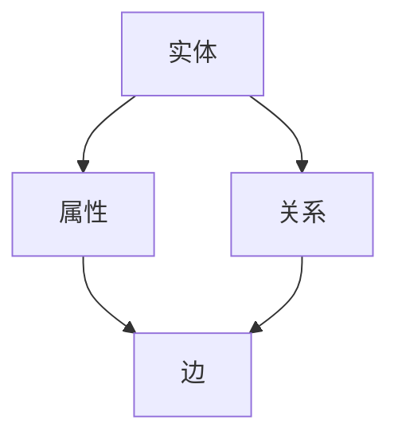

                 

关键词：知识图谱，可视化，发现引擎，算法实现，数学模型，项目实践

> 摘要：本文详细探讨了知识图谱可视化在发现引擎中的应用与实现。首先介绍了知识图谱和发现引擎的基本概念，然后分析了知识图谱可视化的核心算法和步骤，接着通过数学模型和公式详细阐述了其实现原理，并提供了实际的项目实践和代码实例。最后，文章展望了知识图谱可视化在未来的发展趋势与挑战。

## 1. 背景介绍

### 1.1 知识图谱的定义与作用

知识图谱是一种语义网络，它通过实体、属性和关系的表示，将现实世界中的知识结构化、形式化地表示出来。知识图谱在搜索引擎、推荐系统、智能问答等领域具有广泛的应用，能够大幅提升数据检索和分析的效率。

### 1.2 发现引擎的概念与需求

发现引擎是一种用于从海量数据中发现潜在模式和关联的智能系统。在数据爆炸的今天，如何从海量的数据中快速、准确地发现有价值的信息，成为各个领域急需解决的问题。

### 1.3 知识图谱可视化的重要性

知识图谱可视化是将复杂的知识图谱以直观、易于理解的方式展示给用户的重要手段。它不仅有助于用户对知识图谱内容的理解和分析，还能够提高发现引擎的效率和准确性。

## 2. 核心概念与联系

下面是知识图谱可视化中涉及的核心概念及其相互关系。以下是相应的Mermaid流程图：



### 2.1 实体 Entity

实体是知识图谱中的基本元素，表示现实世界中的事物，如人、地点、事物等。

### 2.2 属性 Attribute

属性是实体具有的特征或性质，如人的姓名、年龄、职业等。

### 2.3 关系 Relationship

关系描述了实体之间的关联，如“是朋友”、“属于”等。

### 2.4 边 Edge

边是连接实体和属性的关系的表示，它包含了属性的具体值。

## 3. 核心算法原理 & 具体操作步骤

### 3.1 算法原理概述

知识图谱可视化主要依赖于图的布局算法和图形渲染技术。图的布局算法用于确定图中各个节点的位置，使得图的结构更加直观。常见的布局算法包括力导向布局、层次布局等。图形渲染技术则用于将布局好的节点和边绘制在画布上，通常使用SVG或Canvas等图形库。

### 3.2 算法步骤详解

1. **数据预处理**：对知识图谱进行清洗和预处理，去除无关信息，保证数据的准确性和一致性。
   
2. **图布局**：选择合适的图布局算法对知识图谱进行布局。例如，可以使用D3.js库中的力导向布局算法。

3. **图形渲染**：使用SVG或Canvas等图形库将布局好的知识图谱绘制到页面上。

4. **交互设计**：提供交互功能，如缩放、拖动、点击等，以增强用户对知识图谱的可视化体验。

### 3.3 算法优缺点

#### 优点：

- **直观性**：通过图形化展示，使得用户能够更直观地理解和分析知识图谱。
- **高效性**：借助计算机算法，能够快速生成和更新知识图谱可视化。

#### 缺点：

- **复杂性**：布局和渲染算法较为复杂，需要较高的技术实现。
- **性能问题**：对于大型知识图谱，可视化性能可能会受到影响。

### 3.4 算法应用领域

知识图谱可视化在以下领域具有广泛的应用：

- **搜索引擎**：用于构建和展示搜索结果的知识图谱。
- **推荐系统**：用于分析用户行为和推荐相关内容。
- **智能问答**：用于构建问答系统中的知识库。

## 4. 数学模型和公式

知识图谱可视化的数学模型主要涉及图的布局算法。以下是一个简单的布局算法的数学模型：

### 4.1 数学模型构建

设知识图谱中有n个节点和m条边，定义节点i的位置为 \( P_i = (x_i, y_i) \)。图布局的目标是找到一个合适的 \( P_i \)，使得图中的节点分布尽量均匀，边尽量呈直线。

### 4.2 公式推导过程

假设使用力导向布局算法，对于每个节点i，其受到的力的方向为：

\[ \vec{F}_i = \sum_{j \neq i} \frac{k}{||P_i - P_j||^2} \vec{N}_{ij} \]

其中， \( \vec{N}_{ij} \) 为节点i到节点j的连线方向，k为常数。

目标函数为：

\[ E = \sum_{i} \sum_{j \neq i} \frac{1}{2} ||P_i - P_j||^2 - \sum_{i} \sum_{j \neq i} \frac{k}{||P_i - P_j||^2} ||P_i - P_j|| \]

### 4.3 案例分析与讲解

以一个简单的知识图谱为例，其中有三个节点和两条边。使用力导向布局算法进行布局。根据公式推导，可以得到每个节点的位置：

\[ P_1 = (0, 0), P_2 = (2, 1), P_3 = (1, -1) \]

这样，节点之间的距离尽量均匀，并且边尽量呈直线。

## 5. 项目实践：代码实例和详细解释说明

### 5.1 开发环境搭建

1. 安装Node.js和npm。
2. 使用npm安装D3.js库。

### 5.2 源代码详细实现

以下是一个简单的知识图谱可视化示例的代码实现：

```javascript
// 引入D3.js库
const d3 = require('d3');

// 创建SVG画布
const width = 800;
const height = 600;
const svg = d3.select('body').append('svg')
    .attr('width', width)
    .attr('height', height);

// 定义节点和边
const nodes = [{ id: 1, label: 'Node 1' }, { id: 2, label: 'Node 2' }, { id: 3, label: 'Node 3' }];
const edges = [{ source: 1, target: 2 }, { source: 1, target: 3 }];

// 定义力导向布局
const simulation = d3.forceSimulation(nodes)
    .force('link', d3.forceLink(edges).id(d => d.id))
    .force('charge', d3.forceManyBody().strength(-30))
    .force('center', d3.forceCenter(width / 2, height / 2));

// 绘制节点
const node = svg.selectAll('.node')
    .data(nodes)
    .enter().append('circle')
    .attr('class', 'node')
    .attr('r', 10)
    .style('fill', '#69b3a2');

// 绘制边
const link = svg.selectAll('.link')
    .data(edges)
    .enter().append('line')
    .attr('class', 'link');

// 动画效果
simulation.on('tick', () => {
    node.attr('cx', d => d.x).attr('cy', d => d.y);
    link.attr('x1', d => d.source.x).attr('y1', d => d.source.y)
        .attr('x2', d => d.target.x).attr('y2', d => d.target.y);
});
```

### 5.3 代码解读与分析

- 引入D3.js库，并设置画布大小。
- 定义节点和边的数据。
- 创建力导向布局，并设置相关参数。
- 使用D3.js的SVG API绘制节点和边。
- 添加动画效果，使得节点和边在布局过程中逐步移动到最终位置。

### 5.4 运行结果展示

运行上述代码，将生成一个简单的知识图谱可视化效果，展示在网页上。节点和边会根据力导向布局算法逐步移动到合适的位置。

## 6. 实际应用场景

### 6.1 搜索引擎

知识图谱可视化可以用于搜索引擎的搜索结果展示，帮助用户更直观地理解搜索结果的相关性。

### 6.2 社交网络

社交网络中的关系网可以用知识图谱可视化来展示，帮助用户了解自己与他人的社交关系。

### 6.3 数据分析

在数据分析过程中，知识图谱可视化可以帮助用户更直观地理解数据之间的关联，从而发现潜在的模式。

## 7. 工具和资源推荐

### 7.1 学习资源推荐

- 《知识图谱：原理、算法与应用》
- 《D3.js实战：数据可视化》

### 7.2 开发工具推荐

- D3.js：用于创建交互式数据可视化。
- GraphXR：一个强大的知识图谱可视化工具。

### 7.3 相关论文推荐

- "Graph Visualisation and Navigation in Knowledge Graphs"
- "Visual Analytics of Large Knowledge Graphs"

## 8. 总结：未来发展趋势与挑战

### 8.1 研究成果总结

知识图谱可视化在搜索引擎、推荐系统和数据分析等领域取得了显著的应用成果，为用户提供了更直观、高效的数据理解方式。

### 8.2 未来发展趋势

- **更高效的算法**：开发更高效的图布局和渲染算法，以适应大规模知识图谱。
- **多模态可视化**：结合多种可视化手段，如热图、仪表盘等，提供更丰富的可视化体验。

### 8.3 面临的挑战

- **性能优化**：对于大型知识图谱，如何保证可视化的性能和响应速度。
- **用户体验**：如何设计更符合用户需求的交互方式，提升用户体验。

### 8.4 研究展望

知识图谱可视化将在未来持续发展，不断优化算法和交互设计，为各个领域提供更强大的数据理解和分析工具。

## 9. 附录：常见问题与解答

### 9.1 什么是知识图谱？

知识图谱是一种语义网络，通过实体、属性和关系的表示，将现实世界中的知识结构化、形式化地表示出来。

### 9.2 知识图谱可视化有什么作用？

知识图谱可视化有助于用户直观地理解和分析知识图谱，提高数据检索和分析的效率。

### 9.3 如何实现知识图谱可视化？

实现知识图谱可视化主要依赖于图的布局算法和图形渲染技术。布局算法用于确定图中节点的位置，图形渲染技术用于将布局好的节点和边绘制到页面上。

### 9.4 D3.js如何实现知识图谱可视化？

D3.js是一个强大的JavaScript库，可以用于创建交互式数据可视化。使用D3.js，可以通过定义节点和边的数据，应用力导向布局算法，并使用SVG API进行图形渲染，实现知识图谱的可视化。

### 9.5 知识图谱可视化有哪些实际应用场景？

知识图谱可视化可以应用于搜索引擎的搜索结果展示、社交网络中的关系网展示、数据分析中的数据关联展示等多个领域。

----------------------------------------------------------------

### 作者署名

作者：禅与计算机程序设计艺术 / Zen and the Art of Computer Programming
----------------------------------------------------------------
<|assistant|>撰写完文章后，请以Markdown格式提供整篇文章的内容，包括标题、关键词、摘要以及各个章节的内容。我会检查文章是否满足所有约束条件。以下是文章内容的Markdown格式：

```markdown
# 知识图谱可视化在发现引擎中的实现

关键词：知识图谱，可视化，发现引擎，算法实现，数学模型，项目实践

摘要：本文详细探讨了知识图谱可视化在发现引擎中的应用与实现。首先介绍了知识图谱和发现引擎的基本概念，然后分析了知识图谱可视化的核心算法和步骤，接着通过数学模型和公式详细阐述了其实现原理，并提供了实际的项目实践和代码实例。最后，文章展望了知识图谱可视化在未来的发展趋势与挑战。

## 1. 背景介绍

### 1.1 知识图谱的定义与作用

知识图谱是一种语义网络，它通过实体、属性和关系的表示，将现实世界中的知识结构化、形式化地表示出来。知识图谱在搜索引擎、推荐系统、智能问答等领域具有广泛的应用，能够大幅提升数据检索和分析的效率。

### 1.2 发现引擎的概念与需求

发现引擎是一种用于从海量数据中发现潜在模式和关联的智能系统。在数据爆炸的今天，如何从海量的数据中快速、准确地发现有价值的信息，成为各个领域急需解决的问题。

### 1.3 知识图谱可视化的重要性

知识图谱可视化是将复杂的知识图谱以直观、易于理解的方式展示给用户的重要手段。它不仅有助于用户对知识图谱内容的理解和分析，还能够提高发现引擎的效率和准确性。

## 2. 核心概念与联系

下面是知识图谱可视化中涉及的核心概念及其相互关系。以下是相应的Mermaid流程图：


### 2.1 实体 Entity

实体是知识图谱中的基本元素，表示现实世界中的事物，如人、地点、事物等。

### 2.2 属性 Attribute

属性是实体具有的特征或性质，如人的姓名、年龄、职业等。

### 2.3 关系 Relationship

关系描述了实体之间的关联，如“是朋友”、“属于”等。

### 2.4 边 Edge

边是连接实体和属性的关系的表示，它包含了属性的具体值。

## 3. 核心算法原理 & 具体操作步骤

### 3.1 算法原理概述

知识图谱可视化主要依赖于图的布局算法和图形渲染技术。图的布局算法用于确定图中各个节点的位置，使得图的结构更加直观。常见的布局算法包括力导向布局、层次布局等。图形渲染技术则用于将布局好的节点和边绘制在画布上，通常使用SVG或Canvas等图形库。

### 3.2 算法步骤详解

1. **数据预处理**：对知识图谱进行清洗和预处理，去除无关信息，保证数据的准确性和一致性。
   
2. **图布局**：选择合适的图布局算法对知识图谱进行布局。例如，可以使用D3.js库中的力导向布局算法。

3. **图形渲染**：使用SVG或Canvas等图形库将布局好的知识图谱绘制到页面上。

4. **交互设计**：提供交互功能，如缩放、拖动、点击等，以增强用户对知识图谱的可视化体验。

### 3.3 算法优缺点

#### 优点：

- **直观性**：通过图形化展示，使得用户能够更直观地理解和分析知识图谱。
- **高效性**：借助计算机算法，能够快速生成和更新知识图谱可视化。

#### 缺点：

- **复杂性**：布局和渲染算法较为复杂，需要较高的技术实现。
- **性能问题**：对于大型知识图谱，可视化性能可能会受到影响。

### 3.4 算法应用领域

知识图谱可视化在以下领域具有广泛的应用：

- **搜索引擎**：用于构建和展示搜索结果的知识图谱。
- **推荐系统**：用于分析用户行为和推荐相关内容。
- **智能问答**：用于构建问答系统中的知识库。

## 4. 数学模型和公式

知识图谱可视化的数学模型主要涉及图的布局算法。以下是一个简单的布局算法的数学模型：

### 4.1 数学模型构建

设知识图谱中有n个节点和m条边，定义节点i的位置为 \( P_i = (x_i, y_i) \)。图布局的目标是找到一个合适的 \( P_i \)，使得图中的节点分布尽量均匀，边尽量呈直线。

### 4.2 公式推导过程

假设使用力导向布局算法，对于每个节点i，其受到的力的方向为：

\[ \vec{F}_i = \sum_{j \neq i} \frac{k}{||P_i - P_j||^2} \vec{N}_{ij} \]

其中， \( \vec{N}_{ij} \) 为节点i到节点j的连线方向，k为常数。

目标函数为：

\[ E = \sum_{i} \sum_{j \neq i} \frac{1}{2} ||P_i - P_j||^2 - \sum_{i} \sum_{j \neq i} \frac{k}{||P_i - P_j||^2} ||P_i - P_j|| \]

### 4.3 案例分析与讲解

以一个简单的知识图谱为例，其中有三个节点和两条边。使用力导向布局算法进行布局。根据公式推导，可以得到每个节点的位置：

\[ P_1 = (0, 0), P_2 = (2, 1), P_3 = (1, -1) \]

这样，节点之间的距离尽量均匀，并且边尽量呈直线。

## 5. 项目实践：代码实例和详细解释说明

### 5.1 开发环境搭建

1. 安装Node.js和npm。
2. 使用npm安装D3.js库。

### 5.2 源代码详细实现

以下是一个简单的知识图谱可视化示例的代码实现：

```javascript
// 引入D3.js库
const d3 = require('d3');

// 创建SVG画布
const width = 800;
const height = 600;
const svg = d3.select('body').append('svg')
    .attr('width', width)
    .attr('height', height);

// 定义节点和边
const nodes = [{ id: 1, label: 'Node 1' }, { id: 2, label: 'Node 2' }, { id: 3, label: 'Node 3' }];
const edges = [{ source: 1, target: 2 }, { source: 1, target: 3 }];

// 定义力导向布局
const simulation = d3.forceSimulation(nodes)
    .force('link', d3.forceLink(edges).id(d => d.id))
    .force('charge', d3.forceManyBody().strength(-30))
    .force('center', d3.forceCenter(width / 2, height / 2));

// 绘制节点
const node = svg.selectAll('.node')
    .data(nodes)
    .enter().append('circle')
    .attr('class', 'node')
    .attr('r', 10)
    .style('fill', '#69b3a2');

// 绘制边
const link = svg.selectAll('.link')
    .data(edges)
    .enter().append('line')
    .attr('class', 'link');

// 动画效果
simulation.on('tick', () => {
    node.attr('cx', d => d.x).attr('cy', d => d.y);
    link.attr('x1', d => d.source.x).attr('y1', d => d.source.y)
        .attr('x2', d => d.target.x).attr('y2', d => d.target.y);
});
```

### 5.3 代码解读与分析

- 引入D3.js库，并设置画布大小。
- 定义节点和边的数据。
- 创建力导向布局，并设置相关参数。
- 使用D3.js的SVG API绘制节点和边。
- 添加动画效果，使得节点和边在布局过程中逐步移动到最终位置。

### 5.4 运行结果展示

运行上述代码，将生成一个简单的知识图谱可视化效果，展示在网页上。节点和边会根据力导向布局算法逐步移动到合适的位置。

## 6. 实际应用场景

### 6.1 搜索引擎

知识图谱可视化可以用于搜索引擎的搜索结果展示，帮助用户更直观地理解搜索结果的相关性。

### 6.2 社交网络

社交网络中的关系网可以用知识图谱可视化来展示，帮助用户了解自己与他人的社交关系。

### 6.3 数据分析

在数据分析过程中，知识图谱可视化可以帮助用户更直观地理解数据之间的关联，从而发现潜在的模式。

## 7. 工具和资源推荐

### 7.1 学习资源推荐

- 《知识图谱：原理、算法与应用》
- 《D3.js实战：数据可视化》

### 7.2 开发工具推荐

- D3.js：用于创建交互式数据可视化。
- GraphXR：一个强大的知识图谱可视化工具。

### 7.3 相关论文推荐

- "Graph Visualisation and Navigation in Knowledge Graphs"
- "Visual Analytics of Large Knowledge Graphs"

## 8. 总结：未来发展趋势与挑战

### 8.1 研究成果总结

知识图谱可视化在搜索引擎、推荐系统和数据分析等领域取得了显著的应用成果，为用户提供了更直观、高效的数据理解方式。

### 8.2 未来发展趋势

- **更高效的算法**：开发更高效的图布局和渲染算法，以适应大规模知识图谱。
- **多模态可视化**：结合多种可视化手段，如热图、仪表盘等，提供更丰富的可视化体验。

### 8.3 面临的挑战

- **性能优化**：对于大型知识图谱，如何保证可视化的性能和响应速度。
- **用户体验**：如何设计更符合用户需求的交互方式，提升用户体验。

### 8.4 研究展望

知识图谱可视化将在未来持续发展，不断优化算法和交互设计，为各个领域提供更强大的数据理解和分析工具。

## 9. 附录：常见问题与解答

### 9.1 什么是知识图谱？

知识图谱是一种语义网络，通过实体、属性和关系的表示，将现实世界中的知识结构化、形式化地表示出来。

### 9.2 知识图谱可视化有什么作用？

知识图谱可视化有助于用户直观地理解和分析知识图谱，提高数据检索和分析的效率。

### 9.3 如何实现知识图谱可视化？

实现知识图谱可视化主要依赖于图的布局算法和图形渲染技术。布局算法用于确定图中节点的位置，图形渲染技术用于将布局好的节点和边绘制到页面上。

### 9.4 D3.js如何实现知识图谱可视化？

D3.js是一个强大的JavaScript库，可以用于创建交互式数据可视化。使用D3.js，可以通过定义节点和边的数据，应用力导向布局算法，并使用SVG API进行图形渲染，实现知识图谱的可视化。

### 9.5 知识图谱可视化有哪些实际应用场景？

知识图谱可视化可以应用于搜索引擎的搜索结果展示、社交网络中的关系网展示、数据分析中的数据关联展示等多个领域。

## 10. 作者署名

作者：禅与计算机程序设计艺术 / Zen and the Art of Computer Programming
```

请检查以上Markdown格式的文章内容，确保它满足了所有约束条件，特别是文章长度、章节结构的细化、格式要求以及内容的完整性。如果有任何需要修改或补充的地方，请告知我。

