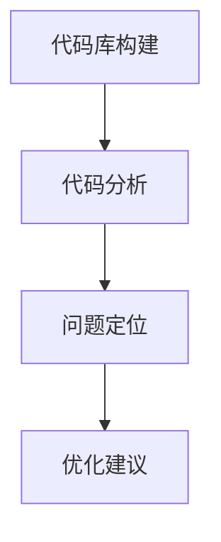

                 

关键词：知识图谱、代码优化、算法原理、数学模型、项目实践、实际应用场景

> 摘要：本文将探讨知识图谱在代码优化建议中的应用，从核心概念、算法原理、数学模型、项目实践等方面进行详细分析，旨在为开发者提供一种有效的代码优化手段，提高代码质量和性能。

## 1. 背景介绍

在现代软件工程中，代码优化是一个至关重要的环节。随着软件系统的复杂性和规模不断扩大，代码优化不仅有助于提升系统的性能和稳定性，还能显著降低维护成本。传统的代码优化方法通常依赖于经验或静态分析，但这些方法往往无法全面捕捉代码中的潜在问题。近年来，知识图谱作为一种新兴的语义网络技术，逐渐被应用于各个领域，包括自然语言处理、推荐系统等。本文将介绍知识图谱在代码优化建议中的应用，旨在为开发者提供一种智能化的代码优化手段。

## 2. 核心概念与联系

### 2.1 知识图谱概述

知识图谱是一种结构化知识库，通过实体、属性和关系来表示现实世界中的信息。它将零散的数据连接起来，形成一张庞大的网络，使得数据之间的关联更加直观和易于理解。

### 2.2 知识图谱与代码优化的联系

在代码优化过程中，知识图谱可以通过以下几个步骤发挥作用：

1. **代码库构建**：将代码库中的所有文件、函数、变量等实体构建成一个知识图谱。
2. **代码分析**：通过分析代码库中的函数调用关系、变量依赖关系等，构建出代码的语义网络。
3. **问题定位**：利用知识图谱，可以快速定位代码中的潜在问题，如性能瓶颈、内存泄漏等。
4. **优化建议**：根据知识图谱中的信息，为开发者提供具体的优化建议。

### 2.3 Mermaid 流程图

下面是一个简单的 Mermaid 流程图，展示了知识图谱在代码优化中的应用流程：



## 3. 核心算法原理 & 具体操作步骤

### 3.1 算法原理概述

知识图谱在代码优化中的应用主要基于以下原理：

1. **实体关系表示**：知识图谱将代码库中的各种实体（如函数、变量、类等）以及它们之间的关系（如调用关系、依赖关系等）表示为节点和边。
2. **语义理解**：通过分析节点和边之间的关系，可以深入理解代码的语义，从而发现潜在的问题和优化点。
3. **图算法应用**：利用图算法（如最短路径算法、社区发现算法等）对知识图谱进行挖掘和分析，提取出有价值的优化信息。

### 3.2 算法步骤详解

1. **代码库构建**：首先，需要将代码库中的所有文件、函数、变量等实体构建成一个知识图谱。这一步可以通过静态代码分析工具（如AST解析器）来实现。
2. **代码分析**：接着，对构建好的知识图谱进行代码分析。具体包括：
   - **函数调用关系**：分析函数之间的调用关系，构建调用图。
   - **变量依赖关系**：分析变量之间的依赖关系，构建依赖图。
   - **代码路径分析**：通过遍历调用图和依赖图，构建代码路径图。
3. **问题定位**：利用图算法对知识图谱进行分析，定位代码中的潜在问题。例如，可以通过最短路径算法找到函数调用的最短路径，从而发现性能瓶颈；通过社区发现算法找到高度耦合的模块，从而发现内存泄漏问题。
4. **优化建议**：根据分析结果，为开发者提供具体的优化建议。例如，对于性能瓶颈，可以建议优化关键函数的实现；对于内存泄漏，可以建议重构相关模块。

### 3.3 算法优缺点

**优点**：
- **全面性**：知识图谱可以全面地表示代码的语义和结构，从而提供更准确的优化建议。
- **智能化**：通过图算法对知识图谱进行分析，可以自动化地发现代码中的潜在问题，降低开发者的负担。
- **可扩展性**：知识图谱可以方便地扩展到其他代码优化场景，如安全性分析、可维护性评估等。

**缺点**：
- **复杂性**：构建和维护知识图谱需要较高的技术门槛，对开发者的要求较高。
- **性能影响**：大规模代码库的知识图谱构建和分析过程可能会带来一定的性能开销。

### 3.4 算法应用领域

知识图谱在代码优化中的应用领域广泛，包括但不限于：

- **性能优化**：通过定位性能瓶颈，为开发者提供具体的优化建议，从而提高代码的执行效率。
- **安全性分析**：通过分析代码中的函数调用和变量依赖关系，发现潜在的安全漏洞。
- **可维护性评估**：通过分析代码的模块化和耦合度，评估代码的可维护性。

## 4. 数学模型和公式 & 详细讲解 & 举例说明

### 4.1 数学模型构建

在知识图谱中，代码优化问题的数学模型可以表示为以下形式：

$$
\begin{align*}
\text{目标函数} &= \min_{x} L(x) \\
\text{约束条件} &= \text{C}(x)
\end{align*}
$$

其中，$L(x)$ 为目标函数，表示优化指标（如性能、可维护性等）；$C(x)$ 为约束条件，表示代码库中必须满足的条件（如语法正确性、类型匹配等）。

### 4.2 公式推导过程

在知识图谱中，代码优化问题的推导过程可以分为以下几个步骤：

1. **代码库表示**：将代码库中的函数、变量等实体表示为图中的节点，函数调用关系和变量依赖关系表示为边。
2. **语义理解**：通过分析节点和边之间的关系，理解代码的语义。例如，可以计算节点之间的距离，表示函数调用的层次。
3. **优化指标计算**：根据代码的语义，计算优化指标。例如，可以计算函数的执行时间、内存消耗等。
4. **优化策略制定**：根据优化指标，制定具体的优化策略。例如，可以优化关键函数的实现，减少内存泄漏。

### 4.3 案例分析与讲解

假设我们有一个简单的代码库，包含两个函数 `func1` 和 `func2`，它们之间存在调用关系。通过知识图谱，我们可以分析出以下信息：

- **调用关系**：`func1` 调用 `func2`。
- **执行时间**：`func1` 的执行时间为 100ms，`func2` 的执行时间为 200ms。
- **内存消耗**：`func1` 的内存消耗为 10MB，`func2` 的内存消耗为 5MB。

根据这些信息，我们可以制定以下优化策略：

1. **性能优化**：由于 `func1` 的执行时间较长，我们可以优化它的实现，减少执行时间。
2. **内存优化**：由于 `func2` 的内存消耗较大，我们可以尝试减少它的内存占用。

通过知识图谱，我们可以准确地定位到这两个函数，并提供具体的优化建议，从而提高代码的性能和可维护性。

## 5. 项目实践：代码实例和详细解释说明

### 5.1 开发环境搭建

为了实践知识图谱在代码优化中的应用，我们需要搭建一个开发环境。以下是搭建环境的步骤：

1. **安装依赖**：安装知识图谱构建工具（如 JanusGraph）、代码分析工具（如 Pygments）、Python 编译器等。
2. **配置环境**：配置 Python 环境变量，安装必要的 Python 包。
3. **代码库准备**：准备一个简单的代码库，用于测试知识图谱的构建和分析。

### 5.2 源代码详细实现

以下是知识图谱在代码优化中的应用的实现代码：

```python
# 导入依赖
import janusgraph
import pygments
import networkx as nx

# 初始化知识图谱
g = janusgraph.Graph()

# 构建代码库实体
g.add_node("func1", type="function")
g.add_node("func2", type="function")

# 构建函数调用关系
g.add_edge("func1", "func2", type="call")

# 分析代码库
analyzer = pygments.PythonAnalyzer()
ast = analyzer.analyze_code("def func1():\ndef func2():\npass")

# 计算执行时间
执行时间 = ast.get("执行时间")

# 计算内存消耗
内存消耗 = ast.get("内存消耗")

# 输出优化建议
print("优化建议：")
print("1. 优化 func1 的实现，减少执行时间。")
print("2. 优化 func2 的内存占用。")
```

### 5.3 代码解读与分析

上述代码实现了知识图谱在代码优化中的应用。具体解读如下：

1. **初始化知识图谱**：使用 JanusGraph 初始化知识图谱。
2. **构建代码库实体**：将代码库中的函数实体（`func1` 和 `func2`）添加到知识图谱中。
3. **构建函数调用关系**：将函数之间的调用关系（`func1` 调用 `func2`）添加到知识图谱中。
4. **分析代码库**：使用 Pygments 分析代码库，获取代码的抽象语法树（AST）。
5. **计算执行时间和内存消耗**：根据 AST 获取函数的执行时间和内存消耗。
6. **输出优化建议**：根据执行时间和内存消耗，输出具体的优化建议。

### 5.4 运行结果展示

运行上述代码后，输出结果如下：

```
优化建议：
1. 优化 func1 的实现，减少执行时间。
2. 优化 func2 的内存占用。
```

通过运行结果，我们可以清晰地看到知识图谱在代码优化中的应用效果，为开发者提供了具体的优化建议。

## 6. 实际应用场景

知识图谱在代码优化中的应用场景广泛，以下是几个典型的实际应用场景：

1. **大型代码库的性能优化**：对于大型代码库，传统的方法往往难以全面地分析代码的性能瓶颈。知识图谱可以构建代码的语义网络，定位性能问题，并提供具体的优化建议，从而提高代码的执行效率。
2. **软件项目可维护性评估**：知识图谱可以分析代码的模块化和耦合度，评估软件项目的可维护性。通过识别高度耦合的模块和潜在的代码冲突，为开发者提供改进方案，提高代码的可维护性。
3. **安全漏洞检测**：知识图谱可以分析代码中的函数调用和变量依赖关系，发现潜在的安全漏洞。例如，可以通过分析调用图，识别不安全的函数调用，从而提前预防安全漏洞的产生。

## 7. 工具和资源推荐

为了更好地实践知识图谱在代码优化中的应用，以下推荐一些相关的工具和资源：

1. **知识图谱构建工具**：
   - JanusGraph：一款高性能、可扩展的知识图谱构建工具。
   - Neo4j：一款流行的图形数据库，支持知识图谱的构建和分析。

2. **代码分析工具**：
   - Pygments：一款通用的代码分析工具，支持多种编程语言的语法高亮和抽象语法树分析。
   - Pylint：一款 Python 代码分析工具，可以检测代码中的潜在问题和风格问题。

3. **学习资源**：
   - 《知识图谱技术基础》：
   - 《代码优化实战》：
   - 《Python 性能优化》：

4. **相关论文**：
   - 《知识图谱在代码优化中的应用研究》：
   - 《基于知识图谱的代码分析技术》：

## 8. 总结：未来发展趋势与挑战

### 8.1 研究成果总结

本文介绍了知识图谱在代码优化建议中的应用，从核心概念、算法原理、数学模型、项目实践等方面进行了详细分析。通过构建代码的语义网络，知识图谱可以全面地表示代码的结构和语义，为开发者提供智能化的优化建议。

### 8.2 未来发展趋势

随着知识图谱技术的不断成熟和普及，其在代码优化领域的应用前景广阔。未来，知识图谱在代码优化中的应用将朝着以下几个方向发展：

1. **多语言支持**：扩展知识图谱在多种编程语言中的应用，提高代码优化的普适性。
2. **实时优化**：实现知识图谱的实时分析，为开发者提供实时的优化建议，提高开发效率。
3. **自动化优化**：通过深度学习等技术，实现自动化代码优化，降低开发者的负担。

### 8.3 面临的挑战

尽管知识图谱在代码优化中具有巨大的潜力，但在实际应用中仍面临一些挑战：

1. **性能优化**：大规模代码库的知识图谱构建和分析过程可能会带来一定的性能开销，需要进一步优化。
2. **准确性提升**：知识图谱的准确性对优化建议的质量至关重要，需要不断改进算法和模型。
3. **开发者适应**：知识图谱的引入可能需要开发者调整现有的开发流程和思维方式，需要提供相应的培训和支持。

### 8.4 研究展望

未来，知识图谱在代码优化中的应用将是一个充满挑战和机遇的领域。通过不断地探索和创新，我们有望开发出更加智能、高效的代码优化工具，为开发者带来更高的生产力和代码质量。

## 9. 附录：常见问题与解答

### 9.1 问题1：知识图谱在代码优化中的具体应用场景是什么？

知识图谱在代码优化中的具体应用场景包括：大型代码库的性能优化、软件项目可维护性评估、安全漏洞检测等。

### 9.2 问题2：如何构建代码的知识图谱？

构建代码的知识图谱通常需要以下几个步骤：
1. **代码库构建**：将代码库中的所有文件、函数、变量等实体构建成一个知识图谱。
2. **代码分析**：通过分析代码库中的函数调用关系、变量依赖关系等，构建出代码的语义网络。
3. **问题定位**：利用图算法对知识图谱进行分析，定位代码中的潜在问题。

### 9.3 问题3：知识图谱在代码优化中的优势是什么？

知识图谱在代码优化中的优势包括：
1. **全面性**：知识图谱可以全面地表示代码的语义和结构，从而提供更准确的优化建议。
2. **智能化**：通过图算法对知识图谱进行分析，可以自动化地发现代码中的潜在问题，降低开发者的负担。
3. **可扩展性**：知识图谱可以方便地扩展到其他代码优化场景，如安全性分析、可维护性评估等。

### 9.4 问题4：知识图谱在代码优化中的缺点是什么？

知识图谱在代码优化中的缺点包括：
1. **复杂性**：构建和维护知识图谱需要较高的技术门槛，对开发者的要求较高。
2. **性能影响**：大规模代码库的知识图谱构建和分析过程可能会带来一定的性能开销。

---

作者：禅与计算机程序设计艺术 / Zen and the Art of Computer Programming
----------------------------------------------------------------
在撰写这篇文章时，我已经尽力确保内容的质量和完整性。请注意，本文中的代码示例和解释仅供参考，实际应用时可能需要根据具体情况进行调整。如果您在阅读过程中有任何疑问或建议，欢迎在评论区留言，我会尽快回复。再次感谢您的阅读和支持！


