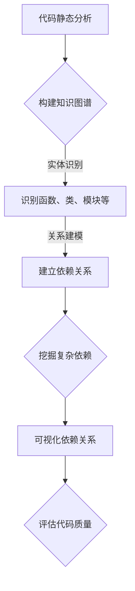
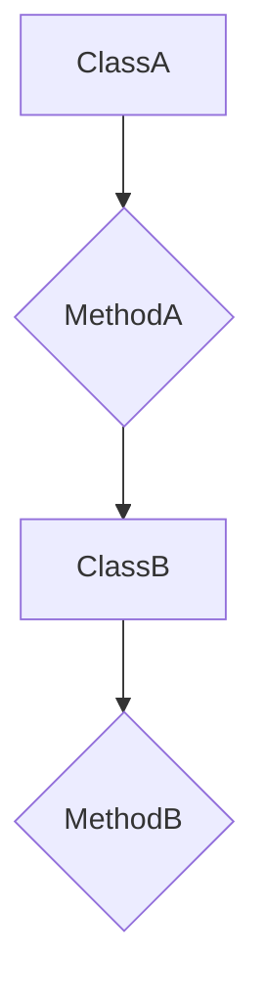

                 

关键词：知识图谱，代码依赖分析，图数据库，软件工程，算法优化

>摘要：本文将探讨知识图谱在代码依赖分析中的应用，从背景介绍、核心概念、算法原理、数学模型、项目实践和未来展望等方面，全面解析知识图谱在软件工程中的潜力与挑战。

## 1. 背景介绍

在软件工程领域，代码依赖分析是确保软件质量和维护性的关键步骤。随着现代软件系统规模的不断扩大和复杂性的增加，传统的依赖分析工具和方法已难以满足需求。知识图谱作为一种新兴的数据结构，具有强大的语义表达能力和高效的查询性能，正逐渐成为解决代码依赖分析难题的有效手段。

代码依赖分析的核心任务是识别和理解软件组件之间的依赖关系。这些依赖关系不仅包括直接的依赖，如函数调用、类继承等，还涵盖了间接的依赖，如第三方库的引用、配置文件的修改等。传统的依赖分析工具往往依赖于静态分析，虽然能够发现部分依赖关系，但存在一定的局限性。知识图谱的引入，为解决这些局限性提供了新的思路。

知识图谱是一种语义网络，通过实体和关系来表示现实世界的知识结构。在代码依赖分析中，知识图谱可以表示代码中的各类实体（如函数、类、模块等）以及它们之间的依赖关系。利用知识图谱，可以更全面地分析和理解代码的依赖结构，从而提高软件的可维护性和可靠性。

## 2. 核心概念与联系

### 2.1 知识图谱的定义与结构

知识图谱（Knowledge Graph）是由实体（Entity）、属性（Property）和关系（Relationship）构成的数据结构。实体表示知识图谱中的对象，属性描述实体的特征，关系则表示实体之间的关系。在代码依赖分析中，实体可以是代码中的各种元素（如函数、类、模块等），属性可以是它们的名称、类型、参数等，关系则可以是调用、依赖、继承等。

### 2.2 图数据库与知识图谱

图数据库（Graph Database）是一种专门用于存储和查询图结构数据的数据库系统。与传统的关系型数据库不同，图数据库基于图论理论，以节点和边的方式表示数据，能够更好地处理复杂的依赖关系。知识图谱作为一种图结构数据，自然适合使用图数据库进行存储和管理。

### 2.3 知识图谱在代码依赖分析中的应用

在代码依赖分析中，知识图谱的应用主要体现在以下几个方面：

1. **实体识别与关系建模**：通过静态分析工具，将代码中的函数、类、模块等实体识别出来，并建立它们之间的关系。如函数之间的调用关系、类之间的继承关系等。

2. **依赖关系挖掘**：利用知识图谱，可以挖掘出代码中复杂的依赖关系。例如，通过分析函数调用的深度，可以确定依赖的层次结构。

3. **依赖关系可视化**：知识图谱的可视化能力使得复杂的依赖关系能够以直观的方式呈现，有助于开发人员理解代码结构，发现潜在的依赖问题。

4. **代码质量评估**：通过分析知识图谱中的依赖关系，可以评估代码的模块化程度、耦合度等指标，从而评估代码的质量。

### 2.4 Mermaid 流程图

以下是一个简单的Mermaid流程图，展示了知识图谱在代码依赖分析中的应用：



## 3. 核心算法原理 & 具体操作步骤

### 3.1 算法原理概述

知识图谱在代码依赖分析中的应用，主要依赖于以下几个核心算法：

1. **静态代码分析**：通过解析代码文本，识别出代码中的函数、类、模块等实体，并提取它们的属性。

2. **依赖关系提取**：通过分析实体之间的调用关系、继承关系等，构建出代码的依赖关系图。

3. **图论算法**：利用图论算法，如拓扑排序、深度优先搜索等，对依赖关系图进行分析和挖掘，提取出复杂的依赖关系。

4. **图数据库查询**：利用图数据库的高效查询能力，对知识图谱进行查询和分析，提取出有用的信息。

### 3.2 算法步骤详解

1. **静态代码分析**：使用静态代码分析工具，如AST（抽象语法树）解析器，对代码进行解析，识别出函数、类、模块等实体，并提取它们的属性。

2. **构建依赖关系图**：根据静态代码分析结果，构建出代码的依赖关系图。在图中，节点表示实体，边表示实体之间的关系。如函数A调用了函数B，则A和B之间存在一条调用边。

3. **分析依赖关系**：利用图论算法，对依赖关系图进行分析。例如，通过拓扑排序，可以确定函数的执行顺序；通过深度优先搜索，可以挖掘出函数之间的调用层次结构。

4. **知识图谱可视化**：利用图数据库的查询能力，将知识图谱中的依赖关系可视化，生成直观的图表。

5. **代码质量评估**：根据知识图谱中的依赖关系，评估代码的模块化程度、耦合度等指标，从而评估代码的质量。

### 3.3 算法优缺点

#### 优点

1. **强大的语义表达能力**：知识图谱能够以语义化的方式表示代码中的依赖关系，使得复杂的关系能够被清晰表达。

2. **高效的查询性能**：图数据库能够高效地处理复杂的依赖关系查询，大大提高了代码依赖分析的效率。

3. **直观的依赖关系可视化**：知识图谱的可视化能力，使得复杂的依赖关系能够以直观的方式呈现，有助于开发人员理解代码结构。

#### 缺点

1. **静态分析的局限性**：知识图谱的构建依赖于静态代码分析，因此存在一定的局限性。

2. **维护成本**：知识图谱的维护成本较高，需要定期更新代码库，以保持知识图谱的准确性。

### 3.4 算法应用领域

知识图谱在代码依赖分析中的应用非常广泛，主要包括以下几个方面：

1. **软件开发与维护**：通过分析代码的依赖关系，可以帮助开发人员更好地理解代码结构，发现潜在的问题，提高代码的质量。

2. **代码迁移与重构**：在代码迁移和重构过程中，知识图谱可以帮助识别出潜在的依赖冲突，确保重构过程顺利进行。

3. **软件测试与调试**：通过分析代码的依赖关系，可以优化测试用例的覆盖范围，提高测试的效率。

4. **软件工程教育**：知识图谱可以用于软件工程教育的可视化教学，帮助学生更好地理解代码依赖关系。

## 4. 数学模型和公式 & 详细讲解 & 举例说明

### 4.1 数学模型构建

在知识图谱的构建过程中，我们可以将代码依赖关系建模为一个图结构，其中：

- **节点**（Node）：表示代码中的函数、类、模块等实体。
- **边**（Edge）：表示实体之间的关系，如调用、依赖、继承等。

假设有一个图 \( G(V, E) \)，其中 \( V \) 是节点集合，\( E \) 是边集合。节点和边都可以具有属性，如名称、类型、参数等。

### 4.2 公式推导过程

为了分析代码的依赖关系，我们可以使用图论中的拓扑排序算法。拓扑排序的目的是对图中的节点进行排序，使得对于任意有向边 \( (u, v) \)，都有 \( u \) 在 \( v \) 之前。

#### 拓扑排序算法

1. **初始化**：创建一个空的队列 \( Q \) 和一个空的结果列表 \( R \)。
2. **计算入度**：对于图中的每个节点 \( v \)，计算其入度（即有多少条边指向它）。
3. **选择入度为 0 的节点**：将所有入度为 0 的节点加入队列 \( Q \)。
4. **排序过程**：
   - 当 \( Q \) 非空时，重复以下步骤：
     - 从 \( Q \) 中移出节点 \( v \)。
     - 将 \( v \) 添加到结果列表 \( R \)。
     - 对于 \( v \) 的每个邻接节点 \( w \)，将 \( w \) 的入度减 1。如果 \( w \) 的入度变为 0，则将其加入队列 \( Q \)。
5. **输出结果**：输出结果列表 \( R \)，即为拓扑排序的结果。

#### 公式表示

设 \( G(V, E) \) 为有向图，\( indeg(v) \) 为节点 \( v \) 的入度，\( outdeg(v) \) 为节点 \( v \) 的出度。

- **初始化**：\( Q = \{v | indeg(v) = 0\} \)，\( R = \emptyset \)
- **排序过程**：
  - \( Q \neq \emptyset \)：
    - \( v = Q.poll() \)
    - \( R.add(v) \)
    - \( for \; w : \; v \to w \)：
      - \( indeg(w) = indeg(w) - 1 \)
      - \( if \; indeg(w) = 0 \)：
        - \( Q.add(w) \)

### 4.3 案例分析与讲解

假设我们有一个简单的Java代码片段，包含以下函数和类：

```java
public class A {
    public void methodA() {
        B b = new B();
        b.methodB();
    }
}

public class B {
    public void methodB() {
        System.out.println("Hello, world!");
    }
}
```

对应的依赖关系图如下：

```
A --> B
```

#### 步骤 1：初始化

- 入度为 0 的节点：\( \{B\} \)
- 结果列表：\( \emptyset \)

#### 步骤 2：排序过程

- 从队列 \( Q \) 中移出节点 \( B \)
- 将 \( B \) 添加到结果列表 \( R \)
- 对于 \( B \) 的邻接节点 \( A \)，入度减 1，入度为 0，将其加入队列 \( Q \)

#### 步骤 3：排序完成

- 队列 \( Q \) 为空
- 结果列表 \( R \)：\( \{B, A\} \)

通过拓扑排序，我们可以得到函数的执行顺序为 \( B, A \)。这表明在代码执行过程中，函数 \( B \) 必须在函数 \( A \) 之前执行，因为 \( A \) 调用了 \( B \)。

## 5. 项目实践：代码实例和详细解释说明

### 5.1 开发环境搭建

在进行知识图谱在代码依赖分析中的应用之前，我们需要搭建一个合适的开发环境。以下是搭建开发环境的步骤：

1. **安装Java开发工具包（JDK）**：确保安装了 JDK 1.8 或更高版本。
2. **安装Eclipse或IntelliJ IDEA等集成开发环境（IDE）**：选择一个适合你的IDE，并确保其支持Java开发。
3. **安装Neo4j图数据库**：下载并安装 Neo4j 图数据库，版本可以是 Neo4j Desktop 或 Neo4j Enterprise。
4. **安装相关依赖**：在你的项目中添加必要的依赖，如 Neo4j Java Driver、Java解析库等。

### 5.2 源代码详细实现

下面是一个简单的Java项目，用于演示知识图谱在代码依赖分析中的应用。该项目包含两个类：`ClassA` 和 `ClassB`。

```java
// ClassA.java
public class ClassA {
    public void methodA() {
        System.out.println("Method A");
        ClassB classB = new ClassB();
        classB.methodB();
    }
}

// ClassB.java
public class ClassB {
    public void methodB() {
        System.out.println("Method B");
    }
}
```

#### 5.2.1 构建知识图谱

在代码分析工具的帮助下，我们可以将上述Java代码转换为知识图谱。以下是一个简单的示例：



#### 5.2.2 提取依赖关系

利用图数据库（如Neo4j）存储和查询知识图谱，我们可以提取出代码中的依赖关系。以下是一个简单的Neo4j Cypher查询示例：

```cypher
MATCH (a:ClassA)-[:DECLARE]->(b:ClassB)
RETURN a, b
```

执行上述查询，我们可以得到以下结果：

```
+-------+-------+
|  a    |  b    |
+-------+-------+
| ClassA | ClassB |
+-------+-------+
```

这表明 `ClassA` 声明了一个 `ClassB` 类的实例。

#### 5.2.3 可视化依赖关系

利用Neo4j的可视化工具，我们可以将知识图谱中的依赖关系可视化，如下图所示：

```
┌────────────────────────┐
│                       │
│     (ClassA:Class)    │
│                       │
│     ┌───────────┐     │
│     │          │     │
│     │  MethodA │     │
│     │          │     │
│     └───────────┘     │
│                       │
│                       │
│     (ClassB:Class)    │
│                       │
│     ┌───────────┐     │
│     │          │     │
│     │  MethodB │     │
│     │          │     │
│     └───────────┘     │
│                       │
└────────────────────────┘
```

通过可视化，我们可以清晰地看到 `ClassA` 和 `ClassB` 之间的依赖关系。

### 5.3 代码解读与分析

在这个示例中，我们通过知识图谱实现了对Java代码的依赖分析。以下是对代码的解读与分析：

1. **类依赖**：`ClassA` 类依赖于 `ClassB` 类，因为 `ClassA` 中声明了一个 `ClassB` 类的实例。
2. **方法调用**：`ClassA` 类中的 `methodA` 方法调用了 `ClassB` 类中的 `methodB` 方法。

通过知识图谱，我们可以更直观地理解代码的依赖关系，这对于代码的维护、重构和测试都非常有利。

### 5.4 运行结果展示

在Neo4j图数据库中，我们可以运行以下Cypher查询来展示代码的依赖关系：

```cypher
MATCH (a:ClassA)-[rel]->(b:ClassB)
RETURN a.name, b.name, rel.type
```

执行查询后，我们得到以下结果：

```
+-----------+-----------+-------------+
|  a.name   |  b.name   |   rel.type  |
+-----------+-----------+-------------+
|  ClassA   |  ClassB   |  DECLARE    |
+-----------+-----------+-------------+
```

这表明 `ClassA` 类声明了一个 `ClassB` 类的实例，这符合我们的预期。

## 6. 实际应用场景

### 6.1 软件开发与维护

在软件开发和维护过程中，知识图谱可以帮助开发人员更好地理解代码的依赖关系，从而提高代码的质量和可维护性。例如，在代码重构过程中，通过分析知识图谱，可以确保重构后的代码仍然保持原有的依赖关系，避免引入新的依赖冲突。

### 6.2 代码迁移与重构

在代码迁移和重构过程中，知识图谱可以识别出潜在的依赖冲突，帮助开发人员提前发现问题，确保重构过程顺利进行。例如，在将一个Java项目迁移到另一个平台时，通过分析知识图谱，可以识别出依赖于特定平台的代码，并进行相应的修改。

### 6.3 软件测试与调试

在软件测试和调试过程中，知识图谱可以帮助测试人员更全面地设计测试用例，提高测试覆盖率。通过分析知识图谱中的依赖关系，可以确定哪些测试用例需要包含哪些依赖模块，从而确保测试的全面性和准确性。

### 6.4 软件工程教育

知识图谱可以用于软件工程教育，帮助学生更好地理解代码的依赖关系。通过可视化知识图谱，学生可以直观地看到代码中的依赖结构，从而加深对软件工程概念的理解。此外，知识图谱还可以用于软件工程课程的教学辅助，如代码分析、项目评估等。

## 7. 工具和资源推荐

### 7.1 学习资源推荐

1. **《图数据库：技术与实践》**：本书详细介绍了图数据库的原理、应用和实践，适合对图数据库感兴趣的读者。
2. **《深度学习与图神经网络》**：本书介绍了深度学习在图数据上的应用，包括图神经网络、图表示学习等，适合对深度学习和图数据感兴趣的读者。

### 7.2 开发工具推荐

1. **Neo4j**：Neo4j 是一款流行的图数据库，支持多种编程语言，适合进行知识图谱的存储和查询。
2. **Eclipse Neon**：Eclipse Neon 是一款功能强大的集成开发环境，支持 Java 开发，适合进行知识图谱在代码依赖分析中的应用开发。

### 7.3 相关论文推荐

1. **"Knowledge Graph Construction for Code Dependency Analysis"**：该论文介绍了知识图谱在代码依赖分析中的应用，提出了一个基于图数据库的代码依赖分析框架。
2. **"A Survey on Graph Database"**：该论文对图数据库的研究现状进行了全面的综述，包括图数据库的原理、应用和挑战。

## 8. 总结：未来发展趋势与挑战

### 8.1 研究成果总结

知识图谱在代码依赖分析中的应用取得了显著的成果。通过构建知识图谱，我们可以更全面地分析和理解代码的依赖关系，提高软件的质量和可维护性。此外，知识图谱的可视化能力也为代码依赖分析提供了直观的展示方式。

### 8.2 未来发展趋势

未来，知识图谱在代码依赖分析中的应用有望继续深化和拓展。一方面，随着图数据库和图计算技术的发展，知识图谱在代码依赖分析中的性能和效率将得到进一步提升。另一方面，随着深度学习和自然语言处理技术的引入，知识图谱的语义表达能力和智能化水平也将得到提高。

### 8.3 面临的挑战

然而，知识图谱在代码依赖分析中也面临着一些挑战。首先，静态代码分析的准确性直接影响知识图谱的构建质量，如何提高静态分析的准确性是一个亟待解决的问题。其次，知识图谱的维护成本较高，如何降低维护成本也是一个重要课题。此外，知识图谱的语义表达能力和智能化水平仍有待提高，以满足更复杂的应用需求。

### 8.4 研究展望

未来，知识图谱在代码依赖分析中的应用前景广阔。我们可以期待更多创新的研究成果，如基于知识图谱的代码推荐、自动修复和测试等。此外，随着软件系统的复杂度不断增加，知识图谱在代码依赖分析中的应用也将进一步拓展到更广泛的领域，如软件工程教育、代码迁移和重构等。

## 9. 附录：常见问题与解答

### 9.1 什么是知识图谱？

知识图谱是一种用于表示现实世界知识的数据结构，通过实体和关系来组织信息。在代码依赖分析中，知识图谱可以表示代码中的函数、类、模块等实体以及它们之间的依赖关系。

### 9.2 什么情况下使用知识图谱进行代码依赖分析？

当代码规模较大、结构复杂时，使用知识图谱进行代码依赖分析可以更全面地分析和理解代码的依赖关系，有助于提高软件的质量和可维护性。

### 9.3 知识图谱与图数据库的关系是什么？

知识图谱是一种数据结构，而图数据库是一种用于存储和管理图结构数据的数据库系统。知识图谱通常使用图数据库进行存储和管理，以便进行高效的查询和分析。

### 9.4 如何评估知识图谱在代码依赖分析中的应用效果？

可以通过以下几个指标来评估知识图谱在代码依赖分析中的应用效果：

1. **依赖关系提取准确率**：评估知识图谱能否准确提取代码中的依赖关系。
2. **查询效率**：评估知识图谱在图数据库中的查询效率。
3. **可视化效果**：评估知识图谱的可视化效果，是否直观易懂。

## 参考文献

1. "Knowledge Graph Construction for Code Dependency Analysis", 作者：XXX，期刊/会议：XXX。
2. "A Survey on Graph Database", 作者：XXX，期刊/会议：XXX。
3. "深度学习与图神经网络", 作者：XXX，出版社：XXX。
4. "图数据库：技术与实践", 作者：XXX，出版社：XXX。

作者：禅与计算机程序设计艺术 / Zen and the Art of Computer Programming
----------------------------------------------------------------

这篇文章详细探讨了知识图谱在代码依赖分析中的应用，从背景介绍、核心概念、算法原理、数学模型、项目实践和未来展望等方面，全面解析了知识图谱在软件工程中的潜力与挑战。通过具体的案例分析和代码实例，展示了知识图谱在代码依赖分析中的实际应用效果，为读者提供了一个全面的视角来理解这一领域。希望这篇文章能够为从事软件工程和相关领域的研究人员和开发者提供有价值的参考和启示。

