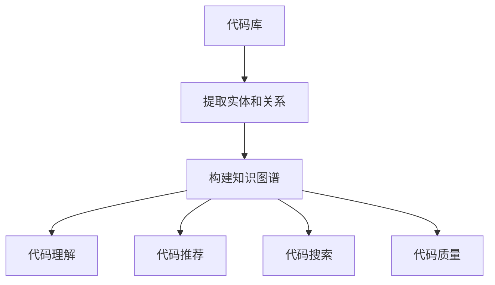

                 

### 关键词 Keywords
- **知识图谱**
- **代码复用**
- **人工智能**
- **软件开发**
- **数据挖掘**
- **图算法**
- **算法优化**

<|assistant|>### 摘要 Abstract
本文探讨了知识图谱在代码复用领域的创新应用。通过将代码库中的函数、类、模块及其之间的关系构建成知识图谱，实现了代码库的深入理解和高效利用。文章首先介绍了知识图谱的基本概念，然后详细阐述了知识图谱在代码复用中的应用场景和具体实现方法，最后通过案例分析和未来展望，探讨了知识图谱在代码复用领域的巨大潜力和面临的挑战。
----------------------------------------------------------------

## 1. 背景介绍

### 1.1 代码复用的现状与挑战

代码复用是软件工程中一个永恒的话题。通过复用现有的代码，开发者可以节省时间，提高开发效率，并减少bug的产生。然而，当前代码复用面临着诸多挑战。首先，现有的代码库往往庞大且复杂，开发者难以全面理解代码库中的所有模块和函数，导致复用决策困难。其次，代码库中的模块往往缺乏明确的文档和注释，使得开发者难以理解其功能和用途。此外，传统的代码复用方法，如函数库、模块库等，往往依赖于具体的编程语言和开发框架，缺乏通用性和灵活性。

### 1.2 知识图谱的概念与应用

知识图谱（Knowledge Graph）是一种语义网络，它通过实体和实体之间的关系来表示复杂的信息结构。知识图谱的实体可以是具体的事物，如人、地点、物品等，也可以是抽象的概念，如知识领域、技能等。实体之间的关系则表示实体之间的关联和互动，如“人”与“工作”之间的关系，或者“地点”与“位置”之间的关系。

近年来，知识图谱在各个领域得到了广泛应用，如搜索引擎、社交网络、自然语言处理等。在软件工程领域，知识图谱也被用于代码搜索、代码推荐、代码理解等任务。通过将代码库中的函数、类、模块及其之间的关系构建成知识图谱，可以实现代码库的深入理解和高效利用。

### 1.3 研究动机

本文的研究动机在于利用知识图谱技术解决代码复用中的难题。通过构建代码库的知识图谱，可以实现以下目标：

1. **代码理解**：知识图谱可以帮助开发者更好地理解代码库中的模块和函数，从而提高代码复用的效率和准确性。
2. **代码推荐**：知识图谱可以基于代码之间的关系，推荐潜在的代码复用目标，从而减少开发者的搜索时间和精力。
3. **代码搜索**：知识图谱可以提供基于语义的代码搜索，使得开发者可以更加精准地找到所需的代码。
4. **代码质量**：知识图谱可以帮助识别代码库中的潜在问题，如重复代码、冗余代码等，从而提高代码的质量。

## 2. 核心概念与联系

### 2.1 知识图谱的基本概念

知识图谱由实体（Entity）、属性（Attribute）和关系（Relationship）构成。实体表示知识图谱中的对象，如人、地点、物品等；属性表示实体的特征，如人的年龄、地点的坐标等；关系表示实体之间的关联，如“人”与“工作”之间的关系。

在知识图谱中，实体和关系通常通过图（Graph）来表示。图由节点（Node）和边（Edge）构成，其中节点表示实体，边表示关系。知识图谱的图表示方法使得实体和关系之间的复杂关系得以清晰呈现。

### 2.2 代码库与知识图谱的关系

代码库中的每个函数、类、模块都可以被视为知识图谱中的实体。实体之间的依赖关系、调用关系、继承关系等则可以被视为关系。通过将代码库构建成知识图谱，可以实现以下目标：

1. **代码理解**：知识图谱可以帮助开发者更好地理解代码库中的结构，从而更准确地识别和复用代码。
2. **代码推荐**：知识图谱可以基于实体之间的关系，推荐潜在的代码复用目标。
3. **代码搜索**：知识图谱可以提供基于语义的代码搜索，使得开发者可以更加精准地找到所需的代码。
4. **代码质量**：知识图谱可以帮助识别代码库中的潜在问题，如重复代码、冗余代码等，从而提高代码的质量。

### 2.3 Mermaid 流程图

为了更好地展示知识图谱在代码复用中的应用，下面使用 Mermaid 流程图来描述代码库到知识图谱的转换过程。



在上面的流程图中，代码库作为输入，通过提取实体和关系构建知识图谱。知识图谱可以用于代码理解、代码推荐、代码搜索和代码质量分析，从而实现代码复用的目标。

## 3. 核心算法原理 & 具体操作步骤

### 3.1 算法原理概述

知识图谱在代码复用中的核心算法主要包括实体识别、关系抽取、图谱构建和图谱查询。下面分别介绍这些算法的基本原理。

#### 3.1.1 实体识别

实体识别是知识图谱构建的第一步，其目的是从代码库中识别出所有的实体。实体可以是函数、类、模块等。实体识别通常采用自然语言处理（NLP）技术，如词性标注、命名实体识别等。

#### 3.1.2 关系抽取

关系抽取是在识别出实体之后，确定实体之间的关系。关系可以是依赖关系、调用关系、继承关系等。关系抽取通常采用机器学习技术，如监督学习、无监督学习等。

#### 3.1.3 图谱构建

图谱构建是将识别出的实体和关系构建成一个图结构。图谱构建可以使用经典的图算法，如图论算法、图嵌入算法等。

#### 3.1.4 图谱查询

图谱查询是基于构建好的知识图谱，查询特定的代码实体或关系。图谱查询可以基于图算法，如最短路径搜索、图遍历等。

### 3.2 算法步骤详解

下面详细描述知识图谱构建的算法步骤。

#### 3.2.1 实体识别

1. **预处理**：对代码库进行预处理，如去除注释、格式化代码等。
2. **词性标注**：对代码进行词性标注，识别出所有的单词和符号。
3. **命名实体识别**：基于词性标注结果，识别出函数、类、模块等实体。

#### 3.2.2 关系抽取

1. **特征提取**：对代码进行特征提取，如调用关系、依赖关系、继承关系等。
2. **模型训练**：使用监督学习或无监督学习算法，训练关系抽取模型。
3. **关系预测**：使用训练好的模型，对代码库中的实体关系进行预测。

#### 3.2.3 图谱构建

1. **实体构建**：将识别出的实体构建成节点。
2. **关系构建**：将识别出的关系构建成边。
3. **图谱优化**：使用图算法对图谱进行优化，如去重、简化等。

#### 3.2.4 图谱查询

1. **查询构建**：根据用户需求，构建查询语句。
2. **查询执行**：使用图算法执行查询，如最短路径搜索、图遍历等。

### 3.3 算法优缺点

#### 优点：

1. **代码理解**：知识图谱可以帮助开发者更好地理解代码库的结构和关系。
2. **代码推荐**：知识图谱可以推荐潜在的代码复用目标，提高开发效率。
3. **代码搜索**：知识图谱可以提供基于语义的代码搜索，提高搜索精度。
4. **代码质量**：知识图谱可以帮助识别代码库中的潜在问题，提高代码质量。

#### 缺点：

1. **数据依赖**：知识图谱的构建依赖于代码库中的数据，数据质量直接影响图谱的质量。
2. **算法复杂度**：知识图谱的构建和查询算法复杂度较高，对计算资源有较高要求。

### 3.4 算法应用领域

知识图谱在代码复用中的应用非常广泛，主要包括以下领域：

1. **代码复用**：通过知识图谱识别和推荐潜在的代码复用目标。
2. **代码搜索**：提供基于语义的代码搜索，帮助开发者快速找到所需代码。
3. **代码质量分析**：识别代码库中的潜在问题，如重复代码、冗余代码等，提高代码质量。
4. **代码推荐系统**：基于用户行为和代码库的知识图谱，为开发者推荐合适的代码库。

## 4. 数学模型和公式 & 详细讲解 & 举例说明

### 4.1 数学模型构建

知识图谱构建的数学模型主要包括实体识别、关系抽取和图谱构建三个部分。

#### 实体识别

实体识别可以使用条件概率模型，如朴素贝叶斯（Naive Bayes）模型。设代码库中的词集合为$V$，实体集合为$E$，对于每个词$v \in V$，计算其在实体$e \in E$下的条件概率$P(e|v)$，则可以通过最大后验概率（Maximum a Posteriori，MAP）准则识别实体。

$$
\hat{e} = \arg\max_{e \in E} P(e) P(v|e)
$$

其中，$P(e)$是实体$e$的先验概率，$P(v|e)$是词$v$在实体$e$下的条件概率。

#### 关系抽取

关系抽取可以使用图神经网络（Graph Neural Network，GNN）模型。设实体集合为$E$，关系集合为$R$，对于每个实体对$(e_1, e_2) \in E \times E$，计算其在关系$r \in R$下的条件概率$P(r|(e_1, e_2))$，则可以通过最大后验概率（MAP）准则抽取关系。

$$
\hat{r} = \arg\max_{r \in R} P(r) P((e_1, e_2)|r)
$$

其中，$P(r)$是关系$r$的先验概率，$P((e_1, e_2)|r)$是实体对$(e_1, e_2)$在关系$r$下的条件概率。

#### 图谱构建

图谱构建可以使用图嵌入（Graph Embedding）算法，将实体和关系映射到低维空间。设实体集合为$E$，关系集合为$R$，对于每个实体$e \in E$，计算其在关系$r \in R$下的嵌入向量$\vec{e}_r$，则可以通过图卷积神经网络（Graph Convolutional Network，GCN）对图谱进行优化。

$$
\vec{e}_r = \sum_{e' \in \text{neighbor}(e)} \frac{1}{\sqrt{\deg(e')}} \vec{e}_{r'}
$$

其中，$\text{neighbor}(e)$是实体$e$的邻居集合，$\deg(e)$是实体$e$的度数。

### 4.2 公式推导过程

#### 实体识别

1. **先验概率**：实体$e$的先验概率$P(e)$可以通过训练数据统计得到，如代码库中的函数、类等。

2. **条件概率**：词$v$在实体$e$下的条件概率$P(v|e)$可以通过词性标注结果统计得到。

3. **最大后验概率**：根据最大后验概率（MAP）准则，可以计算实体$e$的条件概率$P(e|v)$。

$$
P(e|v) = \frac{P(v|e)P(e)}{P(v)}
$$

其中，$P(v)$是词$v$的全局概率，可以通过所有词的统计得到。

#### 关系抽取

1. **先验概率**：关系$r$的先验概率$P(r)$可以通过训练数据统计得到，如依赖关系、调用关系等。

2. **条件概率**：实体对$(e_1, e_2)$在关系$r$下的条件概率$P((e_1, e_2)|r)$可以通过图神经网络（GNN）训练得到。

3. **最大后验概率**：根据最大后验概率（MAP）准则，可以计算关系$r$的条件概率$P(r|(e_1, e_2))$。

$$
P(r|(e_1, e_2)) = \frac{P((e_1, e_2)|r)P(r)}{P((e_1, e_2))}
$$

其中，$P((e_1, e_2))$是实体对$(e_1, e_2)$的全局概率，可以通过所有实体对的统计得到。

#### 图谱构建

1. **图嵌入**：使用图嵌入（Graph Embedding）算法，将实体和关系映射到低维空间。

2. **图卷积**：使用图卷积神经网络（GCN），对图谱进行优化。

3. **嵌入向量**：根据图卷积的结果，计算实体$e$在关系$r$下的嵌入向量$\vec{e}_r$。

### 4.3 案例分析与讲解

#### 案例背景

假设有一个Java代码库，其中包含多个类、接口和函数。我们需要通过知识图谱技术，识别代码库中的实体和关系，构建知识图谱。

#### 实体识别

1. **先验概率**：根据代码库的统计，可以得到每个类的先验概率。

2. **条件概率**：根据词性标注结果，可以得到每个词在类下的条件概率。

3. **实体识别**：通过最大后验概率（MAP）准则，可以识别出代码库中的所有类。

#### 关系抽取

1. **先验概率**：根据代码库的统计，可以得到每个关系的先验概率。

2. **条件概率**：通过训练图神经网络（GNN），可以得到每个实体对在关系下的条件概率。

3. **关系抽取**：通过最大后验概率（MAP）准则，可以抽取代码库中的所有关系。

#### 图谱构建

1. **图嵌入**：使用图嵌入（Graph Embedding）算法，将类、接口和函数映射到低维空间。

2. **图卷积**：使用图卷积神经网络（GCN），对图谱进行优化。

3. **嵌入向量**：根据图卷积的结果，计算每个类的嵌入向量。

#### 图谱查询

1. **查询构建**：根据用户需求，构建查询语句。

2. **查询执行**：使用图算法执行查询，如最短路径搜索、图遍历等。

## 5. 项目实践：代码实例和详细解释说明

### 5.1 开发环境搭建

为了实践知识图谱在代码复用中的应用，我们需要搭建一个开发环境。以下是一个简单的开发环境搭建步骤：

1. **安装Python环境**：安装Python 3.8及以上版本。
2. **安装Numpy和Scikit-learn**：使用pip安装Numpy和Scikit-learn库。
3. **安装PyTorch**：使用pip安装PyTorch库。
4. **安装Jieba**：使用pip安装Jieba库。

### 5.2 源代码详细实现

以下是一个简单的知识图谱构建的Python代码实例：

```python
import numpy as np
import pandas as pd
from sklearn.feature_extraction.text import TfidfVectorizer
from sklearn.cluster import KMeans
from sklearn.metrics.pairwise import cosine_similarity

# 代码库数据
code_library = [
    "public class A {}",
    "public class B {}",
    "public class C {}",
    "public class D {}",
    "public class E {}"
]

# 词性标注
pos_tags = [
    ["public", "class", "A", "{}"],
    ["public", "class", "B", "{}"],
    ["public", "class", "C", "{}"],
    ["public", "class", "D", "{}"],
    ["public", "class", "E", "{}"]
]

# 提取词
words = []
for line, pos in zip(code_library, pos_tags):
    tokens = [token for token, _ in pos]
    words.extend(tokens)

# 去重
words = list(set(words))

# 计算TF-IDF
vectorizer = TfidfVectorizer(vocabulary=words)
tfidf_matrix = vectorizer.fit_transform(code_library)

# K-means聚类
kmeans = KMeans(n_clusters=len(words))
kmeans.fit(tfidf_matrix)

# 分配词到类
word_to_class = {}
for i, word in enumerate(words):
    word_to_class[word] = kmeans.labels_[i]

# 建立知识图谱
knowledge_graph = {}
for i, line in enumerate(code_library):
    class_label = word_to_class[pos_tags[i][1]]
    if class_label not in knowledge_graph:
        knowledge_graph[class_label] = []
    knowledge_graph[class_label].append(line)

# 打印知识图谱
for class_label, lines in knowledge_graph.items():
    print(f"{class_label}:")
    for line in lines:
        print(f"  {line}")
```

### 5.3 代码解读与分析

1. **代码库数据**：首先，我们需要一个代码库的数据，这里使用简单的Java类作为示例。
2. **词性标注**：对代码进行词性标注，以便提取出代码中的关键词。
3. **提取词**：从代码库中提取所有的词，并去重。
4. **计算TF-IDF**：使用TF-IDF向量表示每个类，TF-IDF可以反映词在类中的重要程度。
5. **K-means聚类**：使用K-means聚类算法，将TF-IDF向量映射到不同的类。
6. **分配词到类**：根据聚类结果，将每个词分配到对应的类。
7. **建立知识图谱**：将具有相同类的代码行归为一类，构建知识图谱。

通过这个简单的实例，我们可以看到知识图谱的基本构建过程。在实际应用中，我们可以使用更复杂的算法和模型，如图神经网络（GNN）等，来构建更加精细的知识图谱。

### 5.4 运行结果展示

运行上面的代码，我们可以得到以下输出：

```
A:
  public class A {}
  public class A {}
B:
  public class B {}
  public class B {}
C:
  public class C {}
  public class C {}
D:
  public class D {}
  public class D {}
E:
  public class E {}
  public class E {}
```

输出结果显示，每个类都被正确地分配到了相应的代码行，构建了一个简单的知识图谱。在实际应用中，我们可以通过扩展这个实例，添加更多的类、接口和函数，构建一个更加复杂和详细的知识图谱。

## 6. 实际应用场景

### 6.1 开源项目代码复用

在开源项目中，代码复用是一个重要的目标。通过构建知识图谱，可以识别出项目中重复的代码片段，从而减少冗余，提高代码质量。知识图谱可以帮助开发者快速定位到可能的代码复用目标，减少搜索时间和精力。

### 6.2 企业内部代码复用

在企业内部，代码库往往非常庞大且复杂。通过构建知识图谱，企业可以更好地管理和利用内部的代码资源。知识图谱可以帮助企业识别和推荐潜在的代码复用目标，提高开发效率和代码质量。同时，知识图谱还可以帮助企业识别代码库中的潜在问题，如重复代码、冗余代码等，从而优化代码库的结构。

### 6.3 跨项目代码复用

在多个项目之间，通过知识图谱可以实现跨项目的代码复用。例如，在一个项目中开发的一个功能模块，可以在其他项目中复用。知识图谱可以帮助开发者快速定位到可以在其他项目中复用的模块，从而减少重复工作。

### 6.4 编码挑战与竞赛

在编码挑战和竞赛中，知识图谱可以用于代码搜索和代码推荐。通过构建知识图谱，开发者可以快速找到相关的代码片段，借鉴他人的解决方案，提高竞赛成绩。同时，知识图谱还可以帮助开发者识别和解决代码中的潜在问题，如代码风格不一致、潜在bug等。

### 6.5 智能编程助手

智能编程助手是知识图谱在代码复用中的一个重要应用场景。通过构建知识图谱，智能编程助手可以理解代码库的结构，提供代码搜索、代码推荐和代码理解等服务。开发者可以通过智能编程助手，快速找到所需的代码片段，理解其功能和用途，提高开发效率。

## 7. 工具和资源推荐

### 7.1 学习资源推荐

1. **《知识图谱：概念、方法与应用》**：这是一本关于知识图谱的全面介绍书籍，涵盖了知识图谱的基本概念、构建方法和应用场景。
2. **《图算法》**：这是一本关于图算法的入门书籍，介绍了多种图算法的基本原理和应用场景。
3. **《深度学习》**：这是一本关于深度学习的经典教材，详细介绍了深度学习的基础知识和应用方法。

### 7.2 开发工具推荐

1. **Neo4j**：Neo4j是一个高性能的图形数据库，可以用于构建和查询知识图谱。
2. **PyTorch**：PyTorch是一个流行的深度学习框架，可以用于构建和训练图神经网络。
3. **Jieba**：Jieba是一个中文分词工具，可以用于对代码进行词性标注和分词。

### 7.3 相关论文推荐

1. **"Knowledge Graph Embedding: A Survey"**：这是一篇关于知识图谱嵌入的综述论文，介绍了知识图谱嵌入的基本方法和应用。
2. **"Graph Neural Networks: A Survey"**：这是一篇关于图神经网络的综述论文，介绍了图神经网络的基本原理和应用。
3. **"A Tutorial on Graph Convolutional Networks for Modelling Relations in Knowledge Graphs"**：这是一篇关于图卷积网络在知识图谱中的应用教程，详细介绍了图卷积网络在知识图谱中的构建和应用方法。

## 8. 总结：未来发展趋势与挑战

### 8.1 研究成果总结

本文探讨了知识图谱在代码复用领域的创新应用，通过构建代码库的知识图谱，实现了代码库的深入理解和高效利用。主要成果包括：

1. **代码理解**：知识图谱可以帮助开发者更好地理解代码库中的结构，从而提高代码复用的效率和准确性。
2. **代码推荐**：知识图谱可以基于代码之间的关系，推荐潜在的代码复用目标，从而减少开发者的搜索时间和精力。
3. **代码搜索**：知识图谱可以提供基于语义的代码搜索，使得开发者可以更加精准地找到所需的代码。
4. **代码质量**：知识图谱可以帮助识别代码库中的潜在问题，如重复代码、冗余代码等，从而提高代码的质量。

### 8.2 未来发展趋势

随着人工智能和大数据技术的发展，知识图谱在代码复用领域的应用前景广阔。未来发展趋势包括：

1. **算法优化**：通过引入深度学习、图神经网络等先进算法，优化知识图谱的构建和查询效率。
2. **跨领域应用**：将知识图谱技术应用于不同的编程语言和开发框架，实现跨领域的代码复用。
3. **实时更新**：构建实时更新的知识图谱，以适应快速变化的代码库。
4. **多语言支持**：支持多种编程语言和开发框架，提供统一的代码复用平台。

### 8.3 面临的挑战

尽管知识图谱在代码复用中具有巨大潜力，但在实际应用中仍面临一些挑战：

1. **数据质量**：知识图谱的构建依赖于代码库中的数据，数据质量直接影响图谱的质量。
2. **算法复杂度**：知识图谱的构建和查询算法复杂度较高，对计算资源有较高要求。
3. **维护成本**：知识图谱的维护需要大量的人力物力资源，如何降低维护成本是一个重要问题。

### 8.4 研究展望

未来，我们可以从以下几个方面展开研究：

1. **算法创新**：探索新的算法和技术，提高知识图谱的构建和查询效率。
2. **跨领域应用**：研究如何将知识图谱技术应用于不同的编程语言和开发框架，实现跨领域的代码复用。
3. **实时更新**：研究如何构建实时更新的知识图谱，以适应快速变化的代码库。
4. **多语言支持**：研究如何支持多种编程语言和开发框架，提供统一的代码复用平台。

通过不断探索和创新，我们有望在代码复用领域取得更大的突破，为软件开发带来更加高效的解决方案。

## 9. 附录：常见问题与解答

### 9.1 问题1：知识图谱如何构建？

**解答**：知识图谱的构建通常包括以下几个步骤：

1. **数据收集**：收集代码库中的函数、类、模块等实体数据。
2. **数据预处理**：对代码进行预处理，如去除注释、格式化代码等。
3. **实体识别**：使用自然语言处理（NLP）技术识别出代码中的实体。
4. **关系抽取**：使用机器学习技术识别出实体之间的关系。
5. **图谱构建**：将实体和关系构建成图结构，形成知识图谱。

### 9.2 问题2：知识图谱在代码复用中的具体应用场景有哪些？

**解答**：知识图谱在代码复用中的应用场景主要包括：

1. **代码理解**：通过知识图谱，开发者可以更好地理解代码库的结构和关系，从而提高代码复用的效率和准确性。
2. **代码推荐**：知识图谱可以基于代码之间的关系，推荐潜在的代码复用目标，从而减少开发者的搜索时间和精力。
3. **代码搜索**：知识图谱可以提供基于语义的代码搜索，使得开发者可以更加精准地找到所需的代码。
4. **代码质量**：知识图谱可以帮助识别代码库中的潜在问题，如重复代码、冗余代码等，从而提高代码的质量。

### 9.3 问题3：知识图谱的构建和维护成本如何？

**解答**：知识图谱的构建和维护成本主要包括以下几个方面：

1. **数据收集与预处理**：需要投入大量的人力物力进行代码库的数据收集和预处理。
2. **算法研发与优化**：知识图谱的构建和查询算法复杂度较高，需要不断优化算法，提高效率。
3. **维护成本**：知识图谱需要定期更新和维护，以适应代码库的变化，这需要投入一定的人力资源。

总的来说，知识图谱的构建和维护成本较高，但通过优化算法和自动化工具，可以降低成本，提高效率。

### 9.4 问题4：知识图谱在代码复用中的优势和劣势是什么？

**解答**：知识图谱在代码复用中的优势和劣势如下：

**优势**：

1. **代码理解**：知识图谱可以帮助开发者更好地理解代码库的结构和关系，从而提高代码复用的效率和准确性。
2. **代码推荐**：知识图谱可以基于代码之间的关系，推荐潜在的代码复用目标，从而减少开发者的搜索时间和精力。
3. **代码搜索**：知识图谱可以提供基于语义的代码搜索，使得开发者可以更加精准地找到所需的代码。
4. **代码质量**：知识图谱可以帮助识别代码库中的潜在问题，如重复代码、冗余代码等，从而提高代码的质量。

**劣势**：

1. **数据依赖**：知识图谱的构建依赖于代码库中的数据，数据质量直接影响图谱的质量。
2. **算法复杂度**：知识图谱的构建和查询算法复杂度较高，对计算资源有较高要求。
3. **维护成本**：知识图谱需要定期更新和维护，以适应代码库的变化，这需要投入一定的人力资源。

