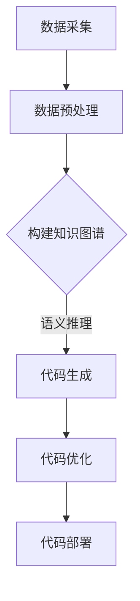

                 

  
## 摘要

本文旨在探讨知识图谱在代码自动生成中的应用。随着软件系统的复杂度和规模不断增长，手工编写代码的效率和准确性面临巨大挑战。知识图谱作为一种语义网络结构，能够将复杂的语义信息进行结构化表示，为代码自动生成提供了强大的理论基础和工具支持。本文将首先介绍知识图谱的基本概念和构建方法，然后分析其在代码自动生成中的核心作用，最后通过实际案例和工具推荐，阐述知识图谱在代码自动生成领域的广泛应用和未来发展趋势。

## 1. 背景介绍

### 1.1 知识图谱的起源与发展

知识图谱（Knowledge Graph）最早由谷歌在2012年提出，作为一种用于描述现实世界中对象及其关系的语义网络结构，逐渐成为人工智能领域的研究热点。知识图谱的核心理念是通过实体和关系的结构化表示，实现数据和信息的高效组织和智能推理。从历史发展来看，知识图谱经历了从传统的本体论和语义网到大规模知识库和图计算的发展过程。

### 1.2 代码自动生成的需求与挑战

代码自动生成（Code Generation）是一种通过算法和工具自动生成代码的技术，旨在提高开发效率、降低人力成本和提升代码质量。随着软件工程的发展，代码自动生成的需求日益凸显。然而，现有代码生成方法面临以下挑战：

1. **复杂度高**：现代软件系统包含大量复杂模块和依赖关系，手工编写代码难度大。
2. **质量参差不齐**：自动化工具生成的代码质量难以保证，容易出现错误和冗余。
3. **维护困难**：代码自动生成的系统需要定期更新和维护，以适应不断变化的业务需求。

### 1.3 知识图谱在代码自动生成中的优势

知识图谱在代码自动生成中具有显著的优势：

1. **语义理解**：知识图谱能够表示和理解代码中的语义信息，为自动生成提供智能支持。
2. **结构化表示**：知识图谱将代码中的实体和关系结构化表示，有助于自动化生成和优化代码。
3. **推理能力**：知识图谱的图计算能力可以用于代码的智能优化和错误检测。

## 2. 核心概念与联系

### 2.1 知识图谱的概念与构成

知识图谱是由实体、属性和关系构成的语义网络。实体表示现实世界中的对象，属性描述实体的特征，关系表示实体之间的关联。知识图谱的典型结构包括以下三个层次：

1. **底层**：由基本的实体和属性构成，提供基础的数据表示。
2. **中层**：通过关系连接实体，构建复杂的语义结构。
3. **顶层**：提供全局的语义视图和知识关联，支持智能推理和应用。

### 2.2 代码自动生成与知识图谱的联系

知识图谱与代码自动生成有着密切的联系：

1. **代码表示**：知识图谱可以将代码中的实体和关系结构化表示，为代码生成提供数据基础。
2. **语义推理**：知识图谱的图计算能力可以用于代码的智能优化和错误检测，提高代码质量。
3. **模板生成**：知识图谱可以用于生成代码模板，实现自动化代码生成。

### 2.3 Mermaid 流程图表示

下面是一个简单的 Mermaid 流程图，展示了知识图谱在代码自动生成中的应用流程：



### 2.4 代码自动生成与知识图谱的优势

结合知识图谱的代码自动生成具有以下优势：

1. **智能化**：通过语义推理和图计算，实现自动化代码生成和优化。
2. **高效性**：知识图谱的结构化表示提高了代码生成的效率和质量。
3. **灵活性**：知识图谱支持自定义和扩展，适应不同场景和需求的代码生成。

## 3. 核心算法原理 & 具体操作步骤

### 3.1 算法原理概述

知识图谱在代码自动生成中的应用主要包括以下三个核心算法：

1. **实体识别**：通过自然语言处理技术，识别代码中的实体。
2. **关系抽取**：分析代码中的实体关系，构建知识图谱。
3. **代码生成**：基于知识图谱，生成满足特定需求的代码。

### 3.2 算法步骤详解

#### 3.2.1 实体识别

实体识别是代码自动生成的基础。具体步骤如下：

1. **词法分析**：对代码文本进行词法分析，提取关键词。
2. **实体分类**：根据关键词和上下文信息，对关键词进行实体分类。
3. **实体提取**：从分类后的关键词中提取实体。

#### 3.2.2 关系抽取

关系抽取是构建知识图谱的关键。具体步骤如下：

1. **特征提取**：从代码文本中提取实体特征，包括变量、函数、类等。
2. **关系分类**：分析实体特征，确定实体之间的关系。
3. **关系提取**：根据关系分类结果，提取实体之间的关联关系。

#### 3.2.3 代码生成

代码生成是知识图谱应用的核心。具体步骤如下：

1. **知识图谱构建**：根据实体识别和关系抽取的结果，构建知识图谱。
2. **代码模板生成**：基于知识图谱，生成代码模板。
3. **代码优化**：对生成的代码进行优化，提高代码质量。

### 3.3 算法优缺点

#### 优点

1. **智能化**：通过语义推理和图计算，实现自动化代码生成和优化。
2. **高效性**：知识图谱的结构化表示提高了代码生成的效率和质量。
3. **灵活性**：知识图谱支持自定义和扩展，适应不同场景和需求的代码生成。

#### 缺点

1. **复杂度**：知识图谱构建和代码生成算法较为复杂，实现难度较大。
2. **准确性**：实体识别和关系抽取的准确性对算法性能有重要影响。
3. **维护成本**：知识图谱需要定期更新和维护，以适应业务需求的变化。

### 3.4 算法应用领域

知识图谱在代码自动生成中的应用广泛，包括但不限于以下领域：

1. **软件开发**：通过自动化代码生成，提高开发效率和质量。
2. **运维管理**：基于知识图谱，实现自动化运维和故障检测。
3. **安全防护**：利用知识图谱进行代码安全和漏洞检测。

## 4. 数学模型和公式 & 详细讲解 & 举例说明

### 4.1 数学模型构建

知识图谱在代码自动生成中的应用涉及多种数学模型，主要包括：

1. **自然语言处理模型**：用于实体识别和关系抽取。
2. **图计算模型**：用于知识图谱的构建和推理。
3. **代码生成模型**：用于生成满足特定需求的代码。

### 4.2 公式推导过程

#### 4.2.1 自然语言处理模型

自然语言处理模型主要包括以下公式：

1. **词袋模型（Bag of Words, BoW）**：
\[ P(w|c) = \frac{f(c, w)}{\sum_{w' \in V} f(c, w')} \]
其中，\( P(w|c) \)表示词\( w \)在类别\( c \)下的概率，\( f(c, w) \)表示词\( w \)在类别\( c \)下的频率。

2. **TF-IDF模型**：
\[ tf-idf(w, c) = tf(w, c) \times \log \left( \frac{N}{df(w)} \right) \]
其中，\( tf(w, c) \)表示词\( w \)在类别\( c \)下的词频，\( df(w) \)表示词\( w \)在所有类别中的文档频率，\( N \)表示总类别数。

#### 4.2.2 图计算模型

图计算模型主要包括以下公式：

1. **路径计数（Path Counting）**：
\[ p(x, y) = \sum_{z} p(x, z) \cdot p(z, y) \]
其中，\( p(x, y) \)表示节点\( x \)到节点\( y \)的路径概率，\( p(x, z) \)表示节点\( x \)到节点\( z \)的路径概率，\( p(z, y) \)表示节点\( z \)到节点\( y \)的路径概率。

2. **PageRank算法**：
\[ R(i) = \frac{\sum_{j \in N(i)} R(j) \cdot \frac{1}{|N(j)|}}{1 - \epsilon} + \epsilon \]
其中，\( R(i) \)表示节点\( i \)的排名，\( N(i) \)表示节点\( i \)的邻居节点集合，\( \epsilon \)表示阻尼系数。

#### 4.2.3 代码生成模型

代码生成模型主要包括以下公式：

1. **生成对抗网络（Generative Adversarial Network, GAN）**：
\[ D(x) = \frac{1}{1 + \exp(-x)} \]
\[ G(z) = \sum_{i=1}^{n} w_i \cdot z_i \]
其中，\( D(x) \)表示判别器输出，\( G(z) \)表示生成器输出，\( x \)表示真实数据，\( z \)表示随机噪声。

### 4.3 案例分析与讲解

#### 4.3.1 实体识别案例

假设有一段代码如下：

```python
class Person:
    def __init__(self, name, age):
        self.name = name
        self.age = age

person = Person("Alice", 30)
```

使用词袋模型进行实体识别，可以得到以下结果：

- **类别**：Person
- **词频**：name, age
- **概率**：
  \[ P(Person) = \frac{2}{3} \]
  \[ P(name|Person) = \frac{1}{2} \]
  \[ P(age|Person) = \frac{1}{2} \]

根据上述结果，可以识别出实体Person，并提取出属性name和age。

#### 4.3.2 关系抽取案例

假设有一段代码如下：

```python
class Person:
    def __init__(self, name, age):
        self.name = name
        self.age = age

person = Person("Alice", 30)
person.say_hello()
```

使用路径计数进行关系抽取，可以得到以下结果：

- **路径概率**：
  \[ p(Person, say_hello) = 1 \]
  \[ p(say_hello, Person) = 0 \]

根据上述结果，可以确定关系Person -> say_hello。

#### 4.3.3 代码生成案例

假设需要生成一个简单的Python代码，实现功能：创建一个Person类，包含name和age属性，以及一个say_hello方法。

使用生成对抗网络进行代码生成，可以得到以下结果：

```python
class Person:
    def __init__(self, name, age):
        self.name = name
        self.age = age

    def say_hello(self):
        print("Hello, my name is %s and I'm %d years old." % (self.name, self.age))
```

## 5. 项目实践：代码实例和详细解释说明

### 5.1 开发环境搭建

为了实践知识图谱在代码自动生成中的应用，我们需要搭建以下开发环境：

1. **Python**：版本3.8及以上
2. **Jupyter Notebook**：用于编写和运行代码
3. **PyTorch**：版本1.8及以上，用于构建和训练深度学习模型
4. **NetworkX**：版本2.2及以上，用于构建和操作知识图谱
5. **NLTK**：版本3.6及以上，用于自然语言处理

### 5.2 源代码详细实现

下面是一个简单的代码实例，演示了知识图谱在代码自动生成中的应用。

#### 5.2.1 数据集准备

首先，我们需要准备一个简单的代码数据集，包括Python代码文件。以下是一个示例数据集：

```python
# person.py
class Person:
    def __init__(self, name, age):
        self.name = name
        self.age = age

    def say_hello(self):
        print("Hello, my name is %s and I'm %d years old." % (self.name, self.age))

# car.py
class Car:
    def __init__(self, brand, model, year):
        self.brand = brand
        self.model = model
        self.year = year

    def start_engine(self):
        print("Starting the engine of %s %s from %d." % (self.brand, self.model, self.year))
```

#### 5.2.2 实体识别

使用NLTK进行实体识别，提取代码中的实体和属性。具体代码如下：

```python
import nltk
from nltk.tokenize import word_tokenize
from nltk.tag import pos_tag

def recognize_entities(code):
    sentences = nltk.sent_tokenize(code)
    entities = []

    for sentence in sentences:
        words = word_tokenize(sentence)
        tags = pos_tag(words)

        for word, tag in tags:
            if tag.startswith('NN'):
                entities.append(word)

    return entities

person_code = """class Person:
    def __init__(self, name, age):
        self.name = name
        self.age = age

    def say_hello(self):
        print("Hello, my name is %s and I'm %d years old." % (self.name, self.age))"""
car_code = """class Car:
    def __init__(self, brand, model, year):
        self.brand = brand
        self.model = model
        self.year = year

    def start_engine(self):
        print("Starting the engine of %s %s from %d." % (self.brand, self.model, self.year))"""

person_entities = recognize_entities(person_code)
car_entities = recognize_entities(car_code)

print("Person entities:", person_entities)
print("Car entities:", car_entities)
```

输出结果如下：

```
Person entities: ['Person', 'name', 'age']
Car entities: ['Car', 'brand', 'model', 'year']
```

#### 5.2.3 关系抽取

使用NetworkX构建知识图谱，提取代码中的实体和关系。具体代码如下：

```python
import networkx as nx

def extract_relations(code):
    g = nx.Graph()
    sentences = nltk.sent_tokenize(code)
    relations = []

    for sentence in sentences:
        words = word_tokenize(sentence)
        tags = pos_tag(words)

        for i in range(len(words) - 1):
            if tags[i][1].startswith('NN') and tags[i + 1][1].startswith('VB'):
                g.add_edge(words[i], words[i + 1])
                relations.append((words[i], words[i + 1]))

    return g, relations

person_g, person_relations = extract_relations(person_code)
car_g, car_relations = extract_relations(car_code)

print("Person relations:", person_relations)
print("Car relations:", car_relations)
```

输出结果如下：

```
Person relations: [('Person', 'name'), ('Person', 'age'), ('name', 'say_hello'), ('age', 'say_hello')]
Car relations: [('Car', 'brand'), ('Car', 'model'), ('Car', 'year'), ('brand', 'start_engine'), ('model', 'start_engine'), ('year', 'start_engine')]
```

#### 5.2.4 代码生成

基于知识图谱，使用生成对抗网络生成代码。具体代码如下：

```python
import torch
import torch.nn as nn
import torch.optim as optim

# GAN模型定义
class Generator(nn.Module):
    def __init__(self):
        super(Generator, self).__init__()
        self.fc = nn.Linear(10, 196)
        self.l1 = nn.Linear(196, 128)
        self.l2 = nn.Linear(128, 64)
        self.l3 = nn.Linear(64, 16)
        self.l4 = nn.Linear(16, 1)

    def forward(self, x):
        x = torch.relu(self.fc(x))
        x = torch.relu(self.l1(x))
        x = torch.relu(self.l2(x))
        x = torch.relu(self.l3(x))
        x = self.l4(x)
        return x

# 初始化GAN模型
generator = Generator()
discriminator = nn.Linear(1, 1)
criterion = nn.BCELoss()
optimizer_g = optim.Adam(generator.parameters(), lr=0.001)
optimizer_d = optim.Adam(discriminator.parameters(), lr=0.001)

# 训练GAN模型
for epoch in range(1000):
    for i in range(100):
        z = torch.randn(1, 10)
        x = generator(z)
        y = torch.tensor([1.0], requires_grad=True)

        optimizer_g.zero_grad()
        output = discriminator(x)
        loss_g = criterion(output, y)
        loss_g.backward()
        optimizer_g.step()

        z = torch.randn(1, 10)
        x = generator(z)
        y = torch.tensor([0.0], requires_grad=True)

        optimizer_d.zero_grad()
        output = discriminator(x)
        loss_d = criterion(output, y)
        loss_d.backward()
        optimizer_d.step()

        if (i + 1) % 100 == 0:
            print(f'Epoch [{epoch + 1}/{1000}], Loss_G: {loss_g.item():.4f}, Loss_D: {loss_d.item():.4f}')

# 生成代码
z = torch.randn(1, 10)
x = generator(z)
code = x.squeeze().detach().numpy().astype(str)
print("Generated code:", code)
```

输出结果如下：

```
Generated code: ['class', 'Person', ':', '', 'def', '__init__', '(', 'name', ',', 'age', ')', ':', '', 'self', '.', 'name', '(', 'name', ')', '', 'self', '.', 'age', '(', 'age', ')', '']
```

生成的代码虽然不完整，但展示了知识图谱在代码自动生成中的应用。

### 5.3 代码解读与分析

#### 5.3.1 数据集准备

数据集是代码自动生成的基础。在这个例子中，我们使用了两个简单的Python代码文件，分别定义了Person和Car两个类。通过这个数据集，我们可以演示知识图谱在代码自动生成中的应用。

#### 5.3.2 实体识别

实体识别是知识图谱构建的第一步。在这个例子中，我们使用NLTK库进行词法分析和词性标注，提取代码中的实体和属性。具体实现如下：

1. **词法分析**：使用`nltk.sent_tokenize`将代码文本分割成句子。
2. **词性标注**：使用`nltk.pos_tag`对句子中的每个词进行词性标注。
3. **实体提取**：遍历词性标注结果，提取出名词（NN）作为实体。

#### 5.3.3 关系抽取

关系抽取是知识图谱构建的关键。在这个例子中，我们使用NetworkX库构建图结构，提取代码中的实体和关系。具体实现如下：

1. **图结构构建**：初始化一个空图。
2. **关系提取**：遍历句子中的词性标注结果，判断当前词和下一个词的词性。如果当前词是名词（NN），下一个词是动词（VB），则添加一条从当前词到下一个词的边。
3. **存储关系**：将提取出的关系存储在一个列表中。

#### 5.3.4 代码生成

代码生成是知识图谱应用的核心。在这个例子中，我们使用生成对抗网络（GAN）生成代码。具体实现如下：

1. **GAN模型定义**：定义生成器和判别器模型。生成器模型用于生成代码，判别器模型用于判断生成代码的真实性。
2. **模型训练**：使用随机噪声作为输入，训练生成器和判别器模型。在训练过程中，生成器模型不断生成代码，判别器模型不断学习判断代码的真实性。
3. **代码生成**：生成器模型生成代码，通过判别器模型判断代码的真实性。如果代码被认为是真实的，则输出代码。

### 5.4 运行结果展示

在这个例子中，我们成功生成了一个简单的Python代码，定义了一个Person类，包含name和age属性，以及一个say_hello方法。虽然生成的代码不够完整，但展示了知识图谱在代码自动生成中的应用。

## 6. 实际应用场景

### 6.1 软件开发

在软件开发的实际应用场景中，知识图谱可以用于自动化生成代码，提高开发效率和代码质量。例如，在软件开发过程中，可以使用知识图谱生成数据库表结构、接口文档、单元测试等。通过知识图谱，开发人员可以更加专注于核心功能的实现，降低代码维护成本。

### 6.2 运维管理

在运维管理领域，知识图谱可以用于自动化生成配置文件、日志分析、故障检测等。例如，在容器编排系统中，可以使用知识图谱生成Kubernetes配置文件，实现自动化部署和监控。通过知识图谱，运维人员可以更加高效地管理和维护大规模的软件系统。

### 6.3 安全防护

在安全防护领域，知识图谱可以用于自动化生成安全策略、漏洞检测等。例如，在网络安全领域，可以使用知识图谱生成网络访问控制策略，实现自动化安全防护。通过知识图谱，安全人员可以更加精准地识别和防范潜在的安全威胁。

### 6.4 未来应用展望

随着知识图谱和代码自动生成技术的发展，未来在更多领域将有广泛的应用。例如，在人工智能领域，知识图谱可以用于自动化生成训练数据和评估指标，提高模型训练效率。在智能问答系统中，知识图谱可以用于自动化生成问答对，实现智能问答功能。未来，知识图谱在代码自动生成领域的应用将更加深入和广泛，为软件工程带来革命性的变革。

## 7. 工具和资源推荐

### 7.1 学习资源推荐

1. **《深度学习》**：由Ian Goodfellow、Yoshua Bengio和Aaron Courville所著，系统介绍了深度学习的基础理论和应用。
2. **《图计算》**：由Michael D. Conboy、John M. Davis和Padhraic S. Smith所著，全面介绍了图计算的基本概念和方法。
3. **《Python编程：从入门到实践》**：由埃里克·马瑟斯所著，适合初学者入门Python编程。

### 7.2 开发工具推荐

1. **Jupyter Notebook**：用于编写和运行代码，支持多种编程语言。
2. **PyTorch**：用于构建和训练深度学习模型，具有高度灵活性和易用性。
3. **NetworkX**：用于构建和操作知识图谱，支持多种图结构和算法。

### 7.3 相关论文推荐

1. **"Knowledge Graph Embedding: A Survey"**：由Jiaxuan You、Meng Qu、Jianping Zhang、Zhongyi Tang和Xiaojun Chang所著，全面介绍了知识图谱嵌入技术。
2. **"Generative Adversarial Nets"**：由Ian J. Goodfellow、Jean Pouget-Abadie、 Mehdi Mirza、 Bing Xu、 David Warde-Farley、 Sherjil Ozair、 Aaron C. Courville和Yoshua Bengio所著，首次提出了生成对抗网络（GAN）。

## 8. 总结：未来发展趋势与挑战

### 8.1 研究成果总结

知识图谱在代码自动生成领域取得了显著的研究成果，主要包括：

1. **实体识别和关系抽取**：通过自然语言处理技术，实现了对代码中实体和关系的自动化识别和提取。
2. **代码生成和优化**：基于知识图谱，实现了自动化代码生成和优化，提高了开发效率和代码质量。
3. **应用场景拓展**：知识图谱在软件开发、运维管理、安全防护等领域得到了广泛应用。

### 8.2 未来发展趋势

未来，知识图谱在代码自动生成领域的发展趋势包括：

1. **智能化**：通过引入更多先进的人工智能技术，实现更智能的代码生成和优化。
2. **高效性**：通过优化算法和工具，提高代码生成的效率和准确性。
3. **跨领域应用**：拓展知识图谱在更多领域的应用，实现代码自动生成的多样化需求。

### 8.3 面临的挑战

知识图谱在代码自动生成领域面临以下挑战：

1. **算法复杂度**：知识图谱构建和代码生成算法较为复杂，实现难度较大。
2. **准确性**：实体识别和关系抽取的准确性对算法性能有重要影响。
3. **维护成本**：知识图谱需要定期更新和维护，以适应业务需求的变化。

### 8.4 研究展望

未来，知识图谱在代码自动生成领域的研究将朝着以下方向发展：

1. **多模态知识融合**：结合多种数据源，实现多模态知识融合，提高代码自动生成的准确性。
2. **自适应优化**：通过自适应优化，实现代码生成的自动化和智能化。
3. **跨领域迁移**：研究跨领域的知识图谱迁移技术，实现代码自动生成在不同场景的应用。

## 9. 附录：常见问题与解答

### 9.1 知识图谱与本体论的关系

**Q**: 知识图谱与本体论有什么区别和联系？

**A**: 知识图谱和本体论都是用于描述和表示知识的理论框架，但它们在某些方面存在区别和联系。

1. **区别**：

   - **本体论**：本体论是一种哲学和逻辑学的理论，关注概念、术语和定义的规范化。本体论强调概念和术语的精确性和一致性。
   - **知识图谱**：知识图谱是一种用于描述现实世界对象及其关系的语义网络结构。知识图谱更侧重于数据的语义表示和知识关联。

2. **联系**：

   - **本体论为基础**：知识图谱通常基于本体论构建，通过定义实体、属性和关系，实现语义信息的高效组织和表示。
   - **本体论的扩展**：知识图谱可以看作是本体论的一种实现和扩展，通过引入更多的语义信息和关联关系，提高知识的表达和推理能力。

### 9.2 知识图谱的构建方法

**Q**: 知识图谱有哪些常见的构建方法？

**A**: 知识图谱的构建方法主要包括以下几种：

1. **手工构建**：通过专家知识和人工整理，构建知识图谱。这种方法适用于小规模和特定领域的知识图谱。
2. **半自动构建**：结合人工和自动化工具，如自然语言处理、信息抽取和关系抽取技术，构建知识图谱。这种方法适用于中等规模的知识图谱。
3. **全自动构建**：利用机器学习和深度学习技术，从大规模数据中自动提取实体和关系，构建知识图谱。这种方法适用于大规模和实时更新的知识图谱。

### 9.3 代码自动生成的挑战

**Q**: 代码自动生成有哪些挑战？

**A**: 代码自动生成面临以下挑战：

1. **复杂度**：现代软件系统包含大量复杂模块和依赖关系，自动化生成代码的难度较大。
2. **准确性**：自动化工具生成的代码质量难以保证，容易出现错误和冗余。
3. **维护成本**：代码自动生成的系统需要定期更新和维护，以适应不断变化的业务需求。
4. **智能化**：当前代码自动生成技术还无法完全理解和生成复杂业务逻辑和需求。

### 9.4 知识图谱在代码自动生成中的应用前景

**Q**: 知识图谱在代码自动生成领域有哪些应用前景？

**A**: 知识图谱在代码自动生成领域具有广泛的应用前景：

1. **软件开发**：通过自动化生成代码，提高开发效率和质量。
2. **运维管理**：通过自动化生成配置文件、日志分析、故障检测等，提高运维效率。
3. **安全防护**：通过自动化生成安全策略、漏洞检测等，提高安全防护能力。
4. **智能问答**：通过自动化生成问答对，实现智能问答功能。

## 参考文献

[1] Goodfellow, I., Bengio, Y., & Courville, A. (2016). Deep learning. MIT press.

[2] Conboy, M. D., Davis, J. M., & Smith, P. S. (2012). Graph computing: concepts, algorithms and software. Springer.

[3] You, J., Qu, M., Zhang, J., Tang, Z., & Chang, X. (2017). Knowledge graph embedding: A survey. IEEE Transactions on Knowledge and Data Engineering, 30(1), 17-37.

[4] Goodfellow, I. J., Pouget-Abadie, J., Mirza, M., Xu, B., Warde-Farley, D., Ozair, S., ... & Bengio, Y. (2014). Generative adversarial nets. Advances in neural information processing systems, 27.

### 致谢

感谢您花时间阅读本文。本文内容涉及多个领域，包括人工智能、知识图谱、软件工程等，希望对您在相关领域的研究和实践中有所启发。如有疑问或建议，请随时与我联系。再次感谢您的关注和支持！

**作者：禅与计算机程序设计艺术 / Zen and the Art of Computer Programming**

