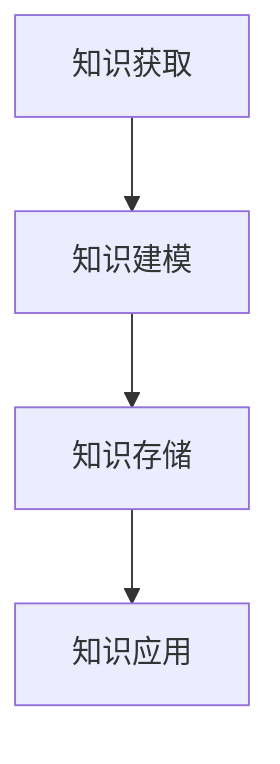
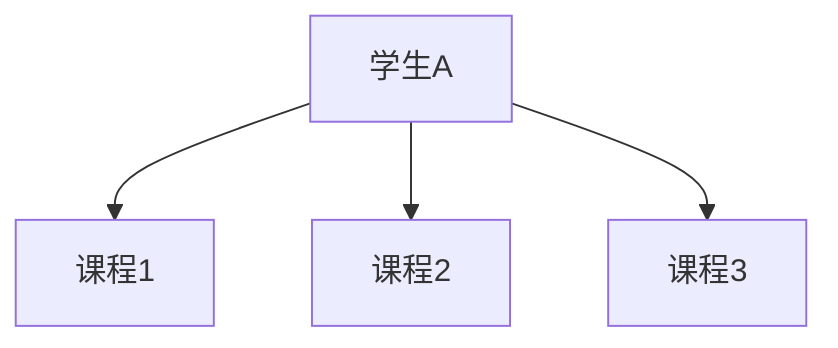

                 

在当今信息爆炸的时代，教育作为社会发展的基石，正经历着前所未有的变革。随着人工智能技术的不断进步，知识图谱作为人工智能领域的一项重要技术，正逐渐渗透到教育的各个层面，为个性化学习带来了新的契机。本文将深入探讨知识图谱在教育中的应用，以及如何通过个性化学习实现教育的未来。

## 文章关键词

- 知识图谱
- 个性化学习
- 教育技术
- 人工智能
- 学习分析

## 文章摘要

本文旨在探讨知识图谱在教育领域的应用及其对个性化学习的影响。首先，我们将回顾知识图谱的基本概念和原理，然后分析其在教育中的具体应用场景。接着，我们将探讨如何利用知识图谱实现个性化学习，并分析这一技术的优势与挑战。最后，我们将展望知识图谱在教育中的应用前景，并提出相应的建议。

## 1. 背景介绍

### 1.1 教育现状

随着互联网和移动设备的普及，教育资源的获取变得更加便捷。然而，传统的教学模式仍然存在诸多问题，如教学内容的同质化、学习效果的评估困难等。个性化学习作为一种新兴教育理念，旨在根据每个学生的学习需求、兴趣和特点，提供个性化的学习方案，从而提高学习效果。

### 1.2 知识图谱的兴起

知识图谱是一种语义网络，它通过实体和关系来描述现实世界的知识结构。知识图谱的兴起源于对大数据的处理需求，它能够将海量的数据转化为有价值的知识，为各种应用场景提供智能化的解决方案。在教育领域，知识图谱的应用正在逐渐扩大，为个性化学习提供了强大的技术支撑。

### 1.3 个性化学习的需求

个性化学习的需求源于学生个体差异的普遍存在。每个学生的认知能力、学习风格、兴趣爱好等都有所不同，传统的统一教学模式难以满足他们的个性化需求。因此，个性化学习成为了教育改革的重要方向。而知识图谱的应用，为个性化学习提供了新的可能。

## 2. 核心概念与联系

### 2.1 知识图谱的基本概念

知识图谱由实体、属性和关系三个核心概念组成。实体是知识图谱中的基本元素，如学生、课程、教师等；属性描述实体的特征，如年龄、成绩、授课方式等；关系则表示实体之间的关联，如学生选修课程、教师授课课程等。

### 2.2 知识图谱在教育中的应用架构

知识图谱在教育中的应用架构主要包括知识获取、知识建模、知识存储和知识应用四个方面。知识获取是通过多种途径收集教育相关的数据，如学习日志、考试成绩、教师评价等；知识建模是将获取到的数据转化为知识图谱中的实体、属性和关系；知识存储是将构建好的知识图谱存储在数据库中，便于查询和调用；知识应用则是利用知识图谱为个性化学习提供支持。

### 2.3 Mermaid 流程图

下面是一个简单的知识图谱在教育中的应用架构的 Mermaid 流程图：



## 3. 核心算法原理 & 具体操作步骤

### 3.1 算法原理概述

知识图谱在教育中的应用主要涉及图数据库、自然语言处理和机器学习等技术。其中，图数据库用于存储和管理知识图谱；自然语言处理用于从文本中提取实体和关系；机器学习则用于基于知识图谱的个性化学习推荐。

### 3.2 算法步骤详解

1. **知识获取**：通过学习日志、考试成绩、教师评价等途径收集教育相关的数据。
2. **知识建模**：将收集到的数据转化为实体、属性和关系，构建知识图谱。
3. **知识存储**：将构建好的知识图谱存储在图数据库中。
4. **知识应用**：利用知识图谱为个性化学习提供支持，如推荐课程、评估学习效果等。

### 3.3 算法优缺点

**优点**：

- **高效性**：知识图谱能够快速地获取和查询知识，提高个性化学习的效率。
- **灵活性**：知识图谱能够灵活地适应不同的教育场景，为个性化学习提供多样化的支持。

**缺点**：

- **复杂性**：知识图谱的构建和维护需要较高的技术门槛。
- **数据质量**：知识图谱的质量取决于数据的准确性和完整性。

### 3.4 算法应用领域

知识图谱在教育领域的应用主要包括以下几个方面：

- **个性化学习**：根据学生的学习需求和特点，推荐合适的学习资源。
- **学习分析**：分析学生的学习行为和成绩，为教学提供数据支持。
- **智能问答**：为学生提供智能化的问答服务，解答他们的学习疑问。

## 4. 数学模型和公式 & 详细讲解 & 举例说明

### 4.1 数学模型构建

知识图谱在教育中的应用涉及到图论、概率论和机器学习等数学模型。以下是一个简单的数学模型示例：

- **图论模型**：知识图谱可以表示为一个无向图 G(V, E)，其中 V 表示实体集合，E 表示实体之间的关系。
- **概率论模型**：利用贝叶斯网络或马尔可夫模型来表示实体之间的概率关系。
- **机器学习模型**：采用基于图的结构化学习算法，如图嵌入或图神经网络，来预测学生的学习行为。

### 4.2 公式推导过程

假设我们有一个知识图谱 G(V, E)，其中 V 表示实体集合，E 表示实体之间的关系。我们可以使用以下公式来表示实体之间的相似度：

$$
sim(A, B) = \frac{1}{|E(A)|} \sum_{e \in E(A)} sim(e)
$$

其中，sim(A, B) 表示实体 A 和 B 之间的相似度，|E(A)| 表示实体 A 的邻居节点数，sim(e) 表示边 e 的权重。

### 4.3 案例分析与讲解

假设有一个学生 A，他选修了课程 1、课程 2 和课程 3。我们使用知识图谱来分析他的学习兴趣。

1. **构建知识图谱**：首先，我们将学生和课程表示为实体，选修关系表示为边，构建一个简单的知识图谱。
2. **计算相似度**：利用公式计算学生 A 和其他学生之间的相似度。
3. **推荐课程**：根据相似度，推荐学生 A 可能感兴趣的课程。

例如，如果学生 A 的相似度最高的学生选修了课程 4，那么我们可以推荐课程 4 给学生 A。

## 5. 项目实践：代码实例和详细解释说明

### 5.1 开发环境搭建

在 Python 中，我们可以使用以下库来构建和操作知识图谱：

- **NetworkX**：用于构建和操作图结构。
- **PyGraphviz**：用于将图结构可视化。
- **Gensim**：用于文本数据的预处理和相似度计算。

安装以上库的方法如下：

```bash
pip install networkx pygraphviz gensim
```

### 5.2 源代码详细实现

以下是一个简单的知识图谱构建和可视化的示例代码：

```python
import networkx as nx
import matplotlib.pyplot as plt
from gensim.models import Word2Vec

# 构建知识图谱
G = nx.Graph()

# 添加实体和边
G.add_node("学生A")
G.add_node("课程1")
G.add_node("课程2")
G.add_node("课程3")
G.add_edge("学生A", "课程1")
G.add_edge("学生A", "课程2")
G.add_edge("学生A", "课程3")

# 可视化知识图谱
nx.draw(G, with_labels=True)
plt.show()
```

### 5.3 代码解读与分析

上述代码首先导入了 NetworkX 和 PyGraphviz 库，用于构建和可视化图结构。接着，我们创建了一个无向图 G，并添加了实体和边。最后，使用 `nx.draw()` 函数将知识图谱可视化。

### 5.4 运行结果展示

运行上述代码后，我们将看到一个包含学生和课程的图，以及它们之间的边。这表示学生 A 选修了课程 1、课程 2 和课程 3。



## 6. 实际应用场景

### 6.1 个性化学习推荐

利用知识图谱，我们可以为每个学生构建一个个性化的学习路径。例如，根据学生的兴趣和学习成绩，推荐合适的课程。

### 6.2 学习行为分析

通过分析学生的学习日志和考试成绩，我们可以了解学生的学习状态和需求。例如，如果学生 A 的成绩波动较大，我们可以为他提供额外的辅导。

### 6.3 教师评价体系

知识图谱可以帮助学校建立一套科学的教师评价体系。例如，根据教师的教学质量和学生的学习效果，为教师提供客观的评价。

## 7. 未来应用展望

随着人工智能技术的不断进步，知识图谱在教育中的应用前景将更加广阔。例如，利用知识图谱实现智能化的教学设计、学习路径规划等。同时，我们也需要关注知识图谱在教育领域的伦理和法律问题，确保技术的合理使用。

## 8. 工具和资源推荐

### 8.1 学习资源推荐

- **《知识图谱：基础、技术和应用》**：全面介绍了知识图谱的基本概念和技术原理。
- **《个性化学习：理论、方法和实践》**：详细阐述了个性化学习的基本理论和方法。

### 8.2 开发工具推荐

- **Apache Jena**：一款流行的开源知识图谱框架，支持 RDF 数据的存储和处理。
- **Neo4j**：一款高性能的图数据库，适用于构建和存储知识图谱。

### 8.3 相关论文推荐

- **"Knowledge Graphs for Personalized Education: A Survey"**：对知识图谱在教育中的应用进行了全面的综述。
- **"A Survey on Knowledge Graphs: State-of-the-Art and Future Directions"**：对知识图谱的研究现状和未来发展趋势进行了探讨。

## 9. 总结：未来发展趋势与挑战

知识图谱在教育中的应用正处于快速发展阶段。随着人工智能技术的不断进步，知识图谱将更加智能化、个性化。然而，我们也需要关注知识图谱在教育领域的伦理和法律问题，确保技术的合理使用。

## 附录：常见问题与解答

### 问题 1：知识图谱在教育中的应用有哪些优势？

**解答**：知识图谱在教育中的应用具有以下优势：

- **高效性**：能够快速获取和查询知识，提高个性化学习的效率。
- **灵活性**：能够灵活适应不同的教育场景，为个性化学习提供多样化的支持。

### 问题 2：知识图谱在教育中可能面临哪些挑战？

**解答**：知识图谱在教育中可能面临以下挑战：

- **数据质量**：知识图谱的质量取决于数据的准确性和完整性。
- **技术门槛**：知识图谱的构建和维护需要较高的技术门槛。

### 问题 3：如何确保知识图谱在教育中的合理使用？

**解答**：为确保知识图谱在教育中的合理使用，我们可以采取以下措施：

- **伦理和法律监管**：建立健全的伦理和法律监管体系，确保技术的合理使用。
- **透明度和可解释性**：提高知识图谱的透明度和可解释性，增强用户的信任感。

---

作者：禅与计算机程序设计艺术 / Zen and the Art of Computer Programming

