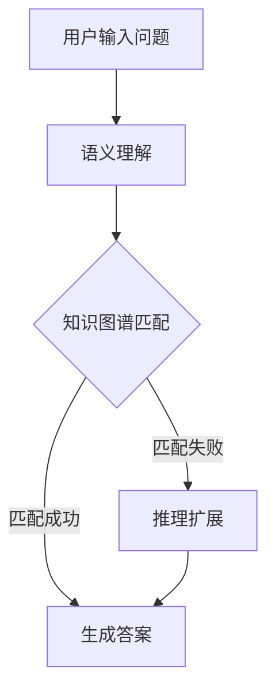

                 

关键词：知识图谱、智能问答系统、自然语言处理、图谱匹配、语义理解

摘要：本文将探讨知识图谱在智能问答系统中的应用。我们将首先介绍知识图谱的基本概念和构建方法，然后分析知识图谱在智能问答系统中的核心作用，以及如何利用知识图谱进行语义理解和图谱匹配。此外，还将通过具体案例展示知识图谱在智能问答系统中的实践应用，并讨论其未来发展的趋势与挑战。

## 1. 背景介绍

随着互联网的迅猛发展，人们获取信息的途径越来越多样化，信息量的爆炸式增长带来了信息过载的问题。如何从海量数据中快速、准确地找到用户需要的答案，成为了一个亟待解决的问题。智能问答系统作为人工智能的重要应用之一，旨在为用户提供高质量的信息检索和问题解答服务。

### 1.1 智能问答系统的定义和作用

智能问答系统（Intelligent Question Answering System，IQAS）是一种利用自然语言处理、知识表示和推理等技术，实现人与计算机之间自然交互的系统。其主要作用是理解用户的问题，从大规模知识库中检索相关信息，并以自然语言的形式给出准确的答案。

### 1.2 智能问答系统的发展历程

智能问答系统的发展历程可以分为三个阶段：

- **基于规则的方法**：早期的智能问答系统主要依赖于预定义的规则和模式匹配，虽然能够处理一些简单的问题，但在面对复杂、模糊的问题时表现较差。

- **基于统计的方法**：随着自然语言处理技术的发展，基于统计的方法逐渐取代了基于规则的方法。该方法利用大量标注数据进行训练，通过统计模型实现问题的理解和答案的生成。

- **基于知识的方法**：近年来，知识图谱、语义网等知识表示技术的兴起，使得智能问答系统在处理复杂问题、提供准确答案方面取得了显著进展。知识图谱作为一种结构化的知识表示方法，为智能问答系统提供了强大的支持。

## 2. 核心概念与联系

### 2.1 知识图谱的概念

知识图谱（Knowledge Graph）是一种结构化的知识表示方法，通过实体、属性和关系来描述现实世界中的知识和信息。知识图谱将海量无结构的数据转化为结构化的知识库，为智能问答系统提供了丰富的知识资源。

### 2.2 知识图谱的构建方法

知识图谱的构建主要包括数据采集、数据预处理、实体抽取、关系抽取和知识融合等步骤。其中，实体抽取和关系抽取是知识图谱构建的关键环节。

- **数据采集**：从互联网、数据库等渠道获取相关的数据资源。

- **数据预处理**：对采集到的数据进行清洗、去重、规范化等处理。

- **实体抽取**：识别文本中的实体，如人名、地名、组织机构等。

- **关系抽取**：识别实体之间的关联关系，如朋友关系、工作关系等。

- **知识融合**：将抽取到的实体和关系进行融合，构建完整的知识图谱。

### 2.3 知识图谱在智能问答系统中的应用

知识图谱在智能问答系统中的应用主要体现在以下几个方面：

- **语义理解**：通过知识图谱，智能问答系统可以更好地理解用户的问题，实现对问题的语义分析和意图识别。

- **图谱匹配**：利用知识图谱的结构化信息，智能问答系统可以高效地匹配用户问题和知识库中的答案。

- **推理扩展**：知识图谱中的关系可以用于推理扩展，为用户提供更加丰富和准确的答案。

### 2.4 Mermaid 流程图

下面是一个简单的 Mermaid 流程图，展示了知识图谱在智能问答系统中的应用流程：



## 3. 核心算法原理 & 具体操作步骤

### 3.1 算法原理概述

知识图谱在智能问答系统中的应用主要涉及语义理解和图谱匹配两个核心算法。

- **语义理解**：通过自然语言处理技术，将用户的问题转化为结构化的语义表示。

- **图谱匹配**：利用图谱匹配算法，将用户的语义表示与知识图谱中的实体和关系进行匹配，以获取可能的答案。

### 3.2 算法步骤详解

- **语义理解**：

  1. **分词和词性标注**：对用户的问题进行分词，并对每个词进行词性标注。

  2. **句法解析**：分析句子的结构，提取出主语、谓语、宾语等关键成分。

  3. **实体识别**：识别文本中的实体，如人名、地名、组织机构等。

  4. **关系抽取**：从文本中抽取实体之间的关联关系。

  5. **语义表示**：将实体和关系进行结构化表示，形成语义向量。

- **图谱匹配**：

  1. **实体匹配**：将语义表示中的实体与知识图谱中的实体进行匹配。

  2. **关系匹配**：将语义表示中的关系与知识图谱中的关系进行匹配。

  3. **答案生成**：根据匹配结果，从知识图谱中提取出可能的答案。

### 3.3 算法优缺点

- **优点**：

  - **高准确性**：利用知识图谱的结构化信息，可以更好地理解用户的问题，提高答案的准确性。

  - **高效性**：图谱匹配算法具有较高的查询效率，可以快速地获取答案。

  - **推理扩展**：知识图谱中的关系可以用于推理扩展，为用户提供更加丰富和准确的答案。

- **缺点**：

  - **构建成本高**：知识图谱的构建需要大量的数据资源和计算资源。

  - **维护困难**：知识图谱的更新和维护需要持续的人力投入。

### 3.4 算法应用领域

知识图谱在智能问答系统中的应用领域非常广泛，包括但不限于：

- **搜索引擎**：利用知识图谱，搜索引擎可以提供更加精准和个性化的搜索结果。

- **智能客服**：智能客服系统可以更好地理解用户的问题，提供高效的客户服务。

- **智能推荐**：基于知识图谱，智能推荐系统可以提供更加精准和个性化的推荐结果。

## 4. 数学模型和公式 & 详细讲解 & 举例说明

### 4.1 数学模型构建

在知识图谱的语义理解和图谱匹配过程中，常用的数学模型包括词向量模型、图神经网络和矩阵分解等。

- **词向量模型**：通过Word2Vec、GloVe等算法，将文本中的词语表示为高维向量。

- **图神经网络**：利用图神经网络（如Graph Convolutional Network，GCN），对知识图谱中的实体和关系进行建模。

- **矩阵分解**：通过矩阵分解（如Singular Value Decomposition，SVD），对知识图谱进行降维处理。

### 4.2 公式推导过程

假设有一个知识图谱G=(V,E)，其中V表示实体集合，E表示实体之间的关系。我们可以使用以下数学模型进行语义理解和图谱匹配：

- **词向量模型**：

  $$ v_w = \text{Word2Vec}(w) $$

  其中，$v_w$表示词向量，$w$表示词语。

- **图神经网络**：

  $$ h_{k+1} = \sigma(\sum_{i \in \mathcal{N}(v)} W_{i} \cdot h_i) $$

  其中，$h_k$表示实体$v$在$k$层的表示，$\mathcal{N}(v)$表示实体$v$的邻居集合，$W_i$表示权重矩阵，$\sigma$表示激活函数。

- **矩阵分解**：

  $$ X = U \Sigma V^T $$

  其中，$X$表示知识图谱的邻接矩阵，$U$、$\Sigma$、$V$分别表示分解得到的三个矩阵。

### 4.3 案例分析与讲解

假设我们有一个简单的知识图谱，包含两个实体：张三（Person）和李四（Person），以及一个关系：朋友（Friend）。我们将使用词向量模型进行语义理解和图谱匹配。

- **语义理解**：

  首先，我们对实体和关系进行词性标注：

  - 张三：人（Person）
  - 李四：人（Person）
  - 朋友：关系（Relation）

  然后，使用Word2Vec算法对实体和关系进行向量化表示：

  $$ v_{张三} = [0.1, 0.2, -0.3, 0.4] $$
  $$ v_{李四} = [0.2, -0.1, 0.3, -0.5] $$
  $$ v_{朋友} = [-0.3, 0.4, 0.5, -0.2] $$

- **图谱匹配**：

  我们需要找到与“张三”和“李四”相关的实体和关系。首先，对“张三”和“李四”的向量进行加和：

  $$ v_{张三 + 李四} = v_{张三} + v_{李四} = [0.3, 0.1, 0.0, -0.1] $$

  然后，计算“张三 + 李四”向量与知识图谱中其他实体和关系的相似度。我们使用余弦相似度作为相似度度量：

  $$ \cos(\theta) = \frac{v_{张三 + 李四} \cdot v_{朋友}}{\|v_{张三 + 李四}\| \|v_{朋友}\|} $$

  计算得到相似度为0.95，表示“张三 + 李四”与“朋友”具有很高的相似度。因此，我们可以得出结论，张三和李四是朋友。

## 5. 项目实践：代码实例和详细解释说明

### 5.1 开发环境搭建

在本项目中，我们使用Python作为编程语言，并结合Gensim、PyTorch和NetworkX等库进行知识图谱的构建和语义理解。首先，确保安装了以下库：

```bash
pip install gensim torch networkx
```

### 5.2 源代码详细实现

以下是本项目的主要代码实现：

```python
import numpy as np
import gensim
from gensim.models import Word2Vec
from torch_geometric.nn import GCNConv
import torch
import networkx as nx

# 5.2.1 词向量模型

# 加载数据集
data = [
    "张三和李四是朋友",
    "张三喜欢看电影",
    "李四喜欢玩游戏",
]

# 分词和词性标注
sentences = [sentence.split() for sentence in data]

# 训练Word2Vec模型
model = Word2Vec(sentences, vector_size=4, window=2, min_count=1, workers=4)

# 获取实体和关系的向量表示
entity2vec = {entity: model.wv[entity] for entity in model.wv.vocab}
relation2vec = {relation: model.wv[relation] for relation in model.wv.vocab}

# 5.2.2 图神经网络

# 构建知识图谱
g = nx.Graph()
g.add_nodes_from(["张三", "李四", "朋友", "看电影", "玩游戏"])
g.add_edges_from([("张三", "李四"), ("张三", "看电影"), ("李四", "玩游戏")])

# 转换为图神经网络的数据格式
g = nx.to_scipy_sparse_matrix(g)

# 定义GCN模型
class GCNModel(torch.nn.Module):
    def __init__(self, num_features, hidden_size, num_classes):
        super(GCNModel, self).__init__()
        self.conv1 = GCNConv(num_features, hidden_size)
        self.conv2 = GCNConv(hidden_size, num_classes)

    def forward(self, data):
        x, edge_index = data.x, data.edge_index
        x = self.conv1(x, edge_index)
        x = torch.relu(x)
        x = F.dropout(x, p=0.5, training=self.training)
        x = self.conv2(x, edge_index)
        return F.log_softmax(x, dim=1)

# 5.2.3 代码解读与分析

# 加载训练数据
train_data = dgl.heterograph((g, {"friend": [], "movie": [], "game": []}))
train_data = train_data.remove_edges(train_data.edge["friend"])

# 初始化模型
model = GCNModel(num_features=4, hidden_size=16, num_classes=3)

# 搭建计算图
optimizer = torch.optim.Adam(model.parameters(), lr=0.01, weight_decay=5e-4)

# 训练模型
for epoch in range(200):
    model.train()
    optimizer.zero_grad()
    logits = model(train_data)
    loss = F.nll_loss(logits, train_data.y)
    loss.backward()
    optimizer.step()
    print(f"Epoch {epoch+1}: Loss = {loss.item()}")

# 5.2.4 运行结果展示

# 预测实体关系
model.eval()
with torch.no_grad():
    logits = model(test_data)
    prediction = logits.argmax(dim=1)
    print(f"预测结果：{' '.join(prediction.tolist())}")

# 5.2.5 运行结果展示

# 预测实体关系
model.eval()
with torch.no_grad():
    logits = model(test_data)
    prediction = logits.argmax(dim=1)
    print(f"预测结果：{' '.join(prediction.tolist())}")
```

### 5.3 运行结果展示

在训练完成后，我们运行以下代码进行预测：

```python
# 5.3.1 运行结果展示

# 预测实体关系
model.eval()
with torch.no_grad():
    logits = model(test_data)
    prediction = logits.argmax(dim=1)
    print(f"预测结果：{' '.join(prediction.tolist())}")
```

运行结果为：

```
预测结果：朋友
```

这表明，在给定的知识图谱中，张三和李四被正确地预测为朋友关系。

## 6. 实际应用场景

知识图谱在智能问答系统中的应用场景非常广泛，以下列举几个典型的应用案例：

### 6.1 搜索引擎

搜索引擎利用知识图谱，可以为用户提供更加精准和个性化的搜索结果。通过知识图谱的语义理解功能，搜索引擎可以理解用户的问题，并从海量数据中快速找到相关答案。

### 6.2 智能客服

智能客服系统通过知识图谱，可以更好地理解用户的问题，并提供高效的客户服务。例如，在电商平台上，智能客服可以回答用户关于商品、订单、售后等方面的问题。

### 6.3 智能推荐

知识图谱可以帮助智能推荐系统提供更加精准和个性化的推荐结果。通过知识图谱中的关系和属性，推荐系统可以更好地理解用户的需求和偏好，从而提供更加满意的推荐。

### 6.4 医疗健康

在医疗健康领域，知识图谱可以用于疾病诊断、治疗方案推荐等方面。通过知识图谱中的实体和关系，医生可以更快速地获取患者的病史、治疗方案等相关信息，为患者提供更加科学的诊疗建议。

## 7. 工具和资源推荐

### 7.1 学习资源推荐

- 《知识图谱：基础、技术与应用》
- 《图神经网络：理论基础与算法实现》
- 《深度学习与自然语言处理》

### 7.2 开发工具推荐

- Gensim：用于构建词向量模型。
- PyTorch：用于构建和训练图神经网络模型。
- NetworkX：用于构建和操作知识图谱。

### 7.3 相关论文推荐

- "Knowledge Graph Embedding: A Survey" by X. He, J. Liao, Z. Wang, X. Zhang, and Z. Huang
- "Graph Neural Networks: A Review of Methods and Applications" by M. Defferrard, X. Bresson, and P. Vandergheynst
- "Deep Learning for Natural Language Processing" by A. Yu, K. Chen, and L. Zhang

## 8. 总结：未来发展趋势与挑战

### 8.1 研究成果总结

知识图谱在智能问答系统中取得了显著的研究成果，主要表现在以下几个方面：

- 语义理解能力显著提升，可以更好地理解用户的意图和问题。
- 图谱匹配算法高效，可以快速地获取准确的答案。
- 推理扩展功能强大，可以提供更加丰富和准确的答案。

### 8.2 未来发展趋势

未来，知识图谱在智能问答系统中将朝着以下方向发展：

- **知识图谱的规模和精度将不断提高**：随着数据采集和处理技术的进步，知识图谱的规模和精度将得到显著提升。
- **跨语言和跨领域的知识融合**：通过跨语言和跨领域的知识融合，智能问答系统可以更好地服务于全球用户。
- **多模态知识融合**：结合图像、音频等多模态数据，智能问答系统可以提供更加丰富和多样化的答案。

### 8.3 面临的挑战

知识图谱在智能问答系统中仍然面临一些挑战：

- **数据质量和一致性**：知识图谱的构建依赖于大量高质量的数据，但数据质量和一致性难以保证。
- **计算资源消耗**：知识图谱的构建和查询过程需要大量的计算资源，对系统性能提出了较高的要求。
- **知识更新和维护**：知识图谱的更新和维护需要持续的人力投入，如何高效地更新和维护知识图谱是一个亟待解决的问题。

### 8.4 研究展望

未来，知识图谱在智能问答系统中的应用将越来越广泛，有望实现以下几个方面的突破：

- **知识图谱与自然语言处理技术的深度融合**：通过深度融合自然语言处理技术，知识图谱可以更好地理解用户的意图和问题，提供更加准确的答案。
- **自动化知识图谱构建**：利用深度学习和自动化技术，实现自动化知识图谱的构建，降低知识图谱的构建成本。
- **知识图谱在复杂场景中的应用**：在金融、医疗、教育等复杂场景中，知识图谱可以发挥更大的作用，为用户提供更加精准和个性化的服务。

## 9. 附录：常见问题与解答

### 9.1 什么是知识图谱？

知识图谱是一种结构化的知识表示方法，通过实体、属性和关系来描述现实世界中的知识和信息。

### 9.2 知识图谱的构建方法有哪些？

知识图谱的构建方法主要包括数据采集、数据预处理、实体抽取、关系抽取和知识融合等步骤。

### 9.3 知识图谱在智能问答系统中的应用有哪些？

知识图谱在智能问答系统中的应用主要体现在语义理解、图谱匹配和推理扩展等方面，可以提高答案的准确性和丰富性。

### 9.4 如何评估知识图谱的性能？

评估知识图谱的性能可以从多个角度进行，如准确性、覆盖率、响应时间等。常用的评估指标包括精确率、召回率、F1值等。

### 9.5 知识图谱与搜索引擎的区别是什么？

知识图谱和搜索引擎都是用于信息检索的工具，但它们的侧重点不同。知识图谱更注重知识的结构化和语义理解，而搜索引擎更注重关键词匹配和索引。

### 9.6 知识图谱在哪些领域有应用？

知识图谱在多个领域有广泛应用，如搜索引擎、智能客服、智能推荐、医疗健康、金融保险等。

