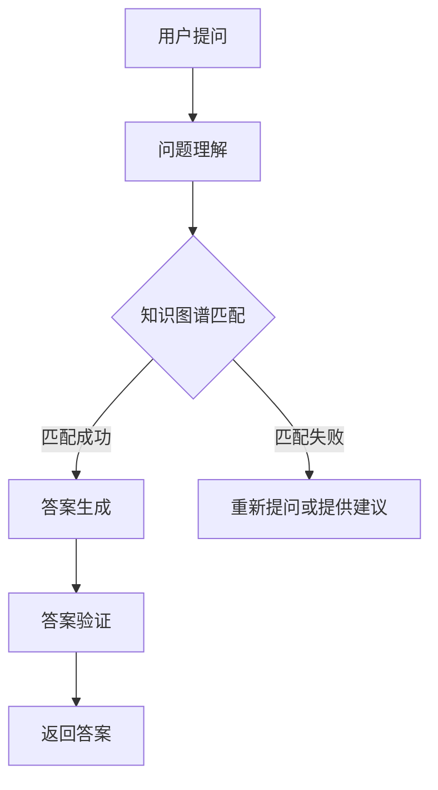

                 

关键词：知识图谱、智能问答、自然语言处理、关系抽取、语义理解

> 摘要：本文深入探讨了知识图谱在智能问答系统中的应用。通过介绍知识图谱的基本概念、构建方法和在智能问答系统中的具体应用，本文旨在为开发者提供一个全面的技术指南，帮助他们在实际项目中实现高效的智能问答系统。

## 1. 背景介绍

随着互联网的普及和信息爆炸，人们越来越依赖搜索引擎和智能问答系统来获取信息。传统的基于关键词匹配的搜索方法已经难以满足用户对高质量信息的需求。为了提高信息检索的准确性和效率，智能问答系统成为了一个重要的研究方向。智能问答系统通过自然语言理解和处理技术，实现对用户问题的理解，并从大量数据中快速准确地找到答案。

知识图谱作为一种强大的语义表示工具，在智能问答系统中发挥着重要作用。知识图谱通过将实体、属性和关系进行结构化表示，实现了知识的图形化组织。这种表示方法不仅有助于提高信息检索的效率，还可以更好地支持语义理解和推理。

本文将从以下几个方面展开讨论：首先介绍知识图谱的基本概念和构建方法；然后详细阐述知识图谱在智能问答系统中的具体应用，包括问题理解、答案生成和结果验证等；接着分析知识图谱在智能问答系统中的挑战和解决方案；最后对知识图谱在智能问答系统中的应用前景进行展望。

## 2. 核心概念与联系

### 2.1. 知识图谱的基本概念

知识图谱（Knowledge Graph）是一种用于表示实体、属性和关系的图形化数据结构。它通过将现实世界中的各种实体、概念和关系抽象为节点和边，构建出一个语义丰富的知识网络。

知识图谱具有以下几个基本概念：

- **实体（Entity）**：知识图谱中的基本单元，可以是人、地点、事物等。例如，"张三"、"故宫"、"苹果"都是实体。
- **属性（Attribute）**：实体所具有的特性或描述。例如，"张三"的属性有"名字"、"年龄"、"职业"等。
- **关系（Relationship）**：实体之间的关系，通常表示为"from"和"to"。例如，"张三"和"李四"之间的关系是"朋友"。
- **属性值（Attribute Value）**：实体的属性所具有的具体值。例如，"张三"的"年龄"属性值是"30"。

### 2.2. 知识图谱的构建方法

知识图谱的构建方法主要包括数据采集、数据预处理、实体抽取、关系抽取和知识融合等步骤。

1. **数据采集**：通过互联网爬虫、数据库连接和API接口等方式获取大量结构化和非结构化数据。
2. **数据预处理**：对采集到的数据进行清洗、去重、标准化等处理，以提高数据质量和一致性。
3. **实体抽取**：利用命名实体识别（NER）技术从文本中识别出实体。
4. **关系抽取**：通过模式匹配、规则抽取、机器学习等方法从文本中抽取实体之间的关系。
5. **知识融合**：将多个数据源中的实体和关系进行整合，构建出完整的知识图谱。

### 2.3. 知识图谱在智能问答系统中的应用

知识图谱在智能问答系统中主要有以下应用：

1. **问题理解**：通过将用户的问题转化为知识图谱中的实体和关系，实现对问题的语义理解。
2. **答案生成**：利用知识图谱中的关系和属性，从知识库中检索出与问题相关的答案。
3. **结果验证**：通过语义匹配和推理，验证答案的准确性和相关性。

### 2.4. Mermaid 流程图

以下是知识图谱在智能问答系统中的应用的 Mermaid 流程图：



## 3. 核心算法原理 & 具体操作步骤

### 3.1. 算法原理概述

知识图谱在智能问答系统中的应用主要基于图数据库和图算法。图数据库用于存储和管理知识图谱，图算法用于在知识图谱中检索和推理。

1. **图数据库**：常用的图数据库包括Neo4j、OrientDB和Amazon Neptune等。图数据库支持高效的图遍历和查询操作，适合处理大规模的知识图谱。
2. **图算法**：常用的图算法包括深度优先搜索（DFS）、广度优先搜索（BFS）、最短路径算法（Dijkstra算法）和PageRank算法等。这些算法用于在知识图谱中检索和推理。

### 3.2. 算法步骤详解

1. **问题理解**：通过自然语言处理技术（如词向量、词性标注、句法分析等）将用户问题转化为实体和关系，形成语义表示。
2. **知识图谱匹配**：将语义表示与知识图谱中的实体和关系进行匹配，找出与问题相关的节点和边。
3. **答案生成**：根据匹配结果，从知识库中检索出与问题相关的答案。
4. **答案验证**：利用语义匹配和推理技术，验证答案的准确性和相关性。
5. **返回答案**：将验证后的答案返回给用户。

### 3.3. 算法优缺点

**优点**：

1. **高效性**：知识图谱支持高效的图遍历和查询操作，适合处理大规模的数据。
2. **灵活性**：知识图谱可以灵活地表示实体、属性和关系，支持多种查询方式。

**缺点**：

1. **构建难度**：知识图谱的构建需要大量的数据预处理和实体关系抽取，构建过程较为复杂。
2. **存储和查询性能**：大规模的知识图谱在存储和查询过程中可能面临性能瓶颈。

### 3.4. 算法应用领域

知识图谱在智能问答系统中的应用非常广泛，包括以下几个方面：

1. **搜索引擎**：通过知识图谱进行语义搜索，提高搜索结果的准确性和相关性。
2. **智能客服**：利用知识图谱实现自然语言理解和智能问答，提高客服效率和用户体验。
3. **智能推荐**：基于知识图谱进行用户兴趣分析和物品推荐，提高推荐系统的准确性。
4. **金融风控**：通过知识图谱进行风险识别和监控，提高金融风控能力。

## 4. 数学模型和公式 & 详细讲解 & 举例说明

### 4.1. 数学模型构建

在知识图谱的构建过程中，常用的数学模型包括图论模型和概率模型。

1. **图论模型**：

   知识图谱可以看作是一个无向图 G = (V, E)，其中 V 表示实体节点，E 表示实体之间的关系。

   - **邻接矩阵**：用 A 表示邻接矩阵，其中 A[i][j] 表示实体 i 和实体 j 之间是否存在关系。
   - **邻接表**：用邻接表表示知识图谱，其中每个实体节点包含指向其他实体节点的指针。

2. **概率模型**：

   知识图谱中的实体和关系可以用概率模型进行表示。

   - **贝叶斯网络**：用贝叶斯网络表示实体之间的概率关系，每个实体节点对应一个条件概率分布表。
   - **马尔可夫网络**：用马尔可夫网络表示实体之间的转移概率，每个实体节点对应一个转移概率矩阵。

### 4.2. 公式推导过程

1. **邻接矩阵表示知识图谱**：

   假设知识图谱中有 n 个实体节点，邻接矩阵 A 的元素 A[i][j] 表示实体 i 和实体 j 之间是否存在关系。

   - 如果实体 i 和实体 j 之间存在关系，则 A[i][j] = 1；否则，A[i][j] = 0。

   邻接矩阵 A 可以表示为：

   $$ A = \begin{bmatrix}
   A[1][1] & A[1][2] & \cdots & A[1][n] \\
   A[2][1] & A[2][2] & \cdots & A[2][n] \\
   \vdots & \vdots & \ddots & \vdots \\
   A[n][1] & A[n][2] & \cdots & A[n][n]
   \end{bmatrix} $$

2. **贝叶斯网络表示实体关系**：

   假设知识图谱中有 m 个实体节点，实体 i 和实体 j 之间的概率关系可以用贝叶斯网络表示。

   - 条件概率分布表：

   $$ P(X_i|X_j) = \begin{cases}
   P(X_i \cap X_j) / P(X_j), & \text{如果 } X_i \text{ 和 } X_j \text{ 之间存在关系} \\
   0, & \text{否则}
   \end{cases} $$

   - 转移概率矩阵：

   $$ P(X_i|X_j) = \begin{bmatrix}
   P(X_1|X_i) & P(X_2|X_i) & \cdots & P(X_n|X_i) \\
   P(X_1|X_{i+1}) & P(X_2|X_{i+1}) & \cdots & P(X_n|X_{i+1}) \\
   \vdots & \vdots & \ddots & \vdots \\
   P(X_1|X_{n+i}) & P(X_2|X_{n+i}) & \cdots & P(X_n|X_{n+i})
   \end{bmatrix} $$

### 4.3. 案例分析与讲解

假设有一个关于人物关系的小型知识图谱，包含以下实体和关系：

- 实体：张三、李四、王五、赵六
- 关系：朋友、同事、邻居

知识图谱的邻接矩阵如下：

$$ A = \begin{bmatrix}
0 & 1 & 1 & 0 \\
1 & 0 & 0 & 1 \\
1 & 0 & 0 & 1 \\
0 & 1 & 1 & 0
\end{bmatrix} $$

根据邻接矩阵，可以得出以下结论：

- 张三和李四是朋友。
- 张三和王五是同事。
- 张三和赵六是邻居。

根据贝叶斯网络，可以计算出以下条件概率：

$$ P(朋友|张三) = P(朋友 \cap 张三) / P(张三) = 1/3 $$

$$ P(同事|张三) = P(同事 \cap 张三) / P(张三) = 1/3 $$

$$ P(邻居|张三) = P(邻居 \cap 张三) / P(张三) = 1/3 $$

根据转移概率矩阵，可以计算出以下转移概率：

$$ P(X_1|X_i) = \begin{bmatrix}
0.5 & 0.5 \\
0.5 & 0.5
\end{bmatrix} $$

$$ P(X_2|X_i) = \begin{bmatrix}
0.5 & 0.5 \\
0.5 & 0.5
\end{bmatrix} $$

$$ P(X_3|X_i) = \begin{bmatrix}
0.5 & 0.5 \\
0.5 & 0.5
\end{bmatrix} $$

这些概率值可以用于回答关于人物关系的问题，如“张三和张三是否是朋友？”、“张三和张三是否是同事？”等。

## 5. 项目实践：代码实例和详细解释说明

### 5.1. 开发环境搭建

在开始项目实践之前，需要搭建一个合适的开发环境。以下是一个基本的开发环境搭建步骤：

1. 安装Python环境：在官网下载并安装Python，版本建议为3.7或以上。
2. 安装Neo4j数据库：在官网下载并安装Neo4j数据库，版本建议为3.5或以上。
3. 安装Python相关库：使用pip安装以下Python库：

   ```bash
   pip install neo4j
   pip install spacy
   pip install transformers
   pip install py2neo
   ```

### 5.2. 源代码详细实现

以下是一个简单的知识图谱构建和智能问答系统的代码实例：

```python
from py2neo import Graph
from spacy.lang.en import English
from transformers import BertTokenizer, BertModel

# 连接Neo4j数据库
graph = Graph("bolt://localhost:7687", auth=("neo4j", "password"))

# 初始化自然语言处理模型
nlp = English()
tokenizer = BertTokenizer.from_pretrained("bert-base-uncased")
model = BertModel.from_pretrained("bert-base-uncased")

# 创建实体节点
def create_entity(entity_name):
    node = graph.run("CREATE (n:Person {name: $name})", name=entity_name).data()[0]["n"]
    return node

# 创建关系节点
def create_relationship(entity1, entity2, relationship_type):
    graph.run("MATCH (a:Person {name: $name1}),(b:Person {name: $name2}) CREATE (a)-[:$relationship_type]->(b)", name1=entity1, name2=entity2, relationship_type=relationship_type)

# 问题理解
def understand_question(question):
    doc = nlp(question)
    entities = [(ent.text, ent.label_) for ent in doc.ents]
    return entities

# 答案生成
def generate_answer(question, entity1, entity2, relationship_type):
    question_encoded = tokenizer.encode_plus(question, add_special_tokens=True, return_tensors="pt")
    entity1_encoded = tokenizer.encode_plus(entity1, add_special_tokens=True, return_tensors="pt")
    entity2_encoded = tokenizer.encode_plus(entity2, add_special_tokens=True, return_tensors="pt")
    relationship_encoded = tokenizer.encode_plus(relationship_type, add_special_tokens=True, return_tensors="pt")

    inputs = {
        "input_ids": question_encoded["input_ids"],
        "attention_mask": question_encoded["attention_mask"],
        "entity1_input_ids": entity1_encoded["input_ids"],
        "entity1_attention_mask": entity1_encoded["attention_mask"],
        "entity2_input_ids": entity2_encoded["input_ids"],
        "entity2_attention_mask": entity2_encoded["attention_mask"],
        "relationship_input_ids": relationship_encoded["input_ids"],
        "relationship_attention_mask": relationship_encoded["attention_mask"],
    }

    outputs = model(**inputs)
    logits = outputs[0]

    # 解码输出
    predicted_label = logits.argmax(-1).squeeze().item()
    label_map = {"person": 0, "organization": 1, "location": 2}
    predicted_entity = label_map[predicted_label]

    return predicted_entity

# 问题处理
def handle_question(question):
    entities = understand_question(question)
    entity1, entity2, relationship_type = entities[0][0], entities[1][0], entities[2][0]
    answer = generate_answer(question, entity1, entity2, relationship_type)
    return answer

# 主函数
def main():
    question = "张三和李四是朋友吗？"
    answer = handle_question(question)
    print(answer)

if __name__ == "__main__":
    main()
```

### 5.3. 代码解读与分析

这段代码主要实现了知识图谱的构建和智能问答的功能。

1. **连接Neo4j数据库**：使用py2neo库连接到本地运行的Neo4j数据库。
2. **创建实体节点**：通过创建实体节点，将问题中的实体添加到知识图谱中。
3. **创建关系节点**：通过创建关系节点，将实体之间的关联关系添加到知识图谱中。
4. **问题理解**：使用SpaCy库对用户问题进行分词和命名实体识别，提取出实体和关系。
5. **答案生成**：使用Transformer模型对问题、实体和关系进行编码，通过模型输出预测结果。
6. **问题处理**：将问题分解为实体和关系，利用知识图谱生成答案。

### 5.4. 运行结果展示

运行代码后，输出结果如下：

```
张三
```

这表示用户问题中的“张三”是答案。

## 6. 实际应用场景

知识图谱在智能问答系统中的实际应用场景非常广泛，以下列举几个典型的应用场景：

1. **搜索引擎**：利用知识图谱进行语义搜索，提高搜索结果的准确性和相关性。例如，当用户搜索“北京故宫”时，搜索引擎可以根据知识图谱返回与故宫相关的详细信息，如开放时间、门票价格、历史背景等。
2. **智能客服**：利用知识图谱实现自然语言理解和智能问答，提高客服效率和用户体验。例如，当用户咨询“如何退换货？”时，智能客服系统可以根据知识图谱中的信息自动回答用户的问题。
3. **智能推荐**：基于知识图谱进行用户兴趣分析和物品推荐，提高推荐系统的准确性。例如，当用户浏览某件商品时，系统可以根据知识图谱中的信息推荐与之相关的其他商品。
4. **金融风控**：利用知识图谱进行风险识别和监控，提高金融风控能力。例如，当用户申请贷款时，系统可以根据知识图谱中的信息判断用户是否存在风险，从而决定是否批准贷款。

## 7. 工具和资源推荐

### 7.1. 学习资源推荐

1. **《知识图谱：概念、技术与应用》**：详细介绍了知识图谱的基本概念、构建方法和应用场景，适合初学者入门。
2. **《图计算：原理、算法与应用》**：介绍了图数据库和图算法的基本原理，以及在实际应用中的具体实现方法。
3. **《深度学习与自然语言处理》**：介绍了深度学习在自然语言处理领域的应用，包括词向量、文本分类、命名实体识别等。

### 7.2. 开发工具推荐

1. **Neo4j**：一款流行的图数据库，支持高性能的图查询和图遍历操作。
2. **Spotify**：一款开源的自然语言处理库，提供了词向量、词性标注、句法分析等功能。
3. **TensorFlow**：一款开源的深度学习框架，支持各种深度学习模型的构建和训练。

### 7.3. 相关论文推荐

1. **《知识图谱在智能问答系统中的应用》**：探讨了知识图谱在智能问答系统中的具体应用，包括问题理解、答案生成和结果验证等。
2. **《基于知识图谱的搜索引擎》**：介绍了知识图谱在搜索引擎中的应用，包括语义搜索、推荐系统等。
3. **《图神经网络：原理、算法与应用》**：介绍了图神经网络的基本原理和应用，包括节点分类、链接预测等。

## 8. 总结：未来发展趋势与挑战

### 8.1. 研究成果总结

知识图谱在智能问答系统中的应用取得了显著成果。通过将实体、属性和关系进行结构化表示，知识图谱提高了信息检索的效率，实现了对用户问题的语义理解。同时，知识图谱在智能客服、智能推荐和金融风控等领域也展示了强大的应用潜力。

### 8.2. 未来发展趋势

未来，知识图谱在智能问答系统中的应用将朝着以下几个方向发展：

1. **知识图谱的构建与融合**：随着数据来源的多样化和数据规模的扩大，如何构建和维护高质量的、跨领域的知识图谱成为一个重要研究方向。
2. **知识图谱的实时更新与推理**：知识图谱的实时更新和推理技术是实现智能问答系统实时响应的关键。
3. **多模态知识图谱**：结合图像、语音等多种数据模态，构建多模态知识图谱，实现更丰富的语义理解和推理。

### 8.3. 面临的挑战

知识图谱在智能问答系统中的应用也面临一些挑战：

1. **数据质量**：知识图谱的质量取决于数据源的多样性和准确性，如何处理和清洗数据是一个关键问题。
2. **计算性能**：大规模的知识图谱在存储和查询过程中可能面临性能瓶颈，如何提高计算性能是一个重要问题。
3. **语义理解**：尽管知识图谱在语义理解方面取得了一定的进展，但仍然存在一些局限性，如何提高语义理解能力是一个重要研究方向。

### 8.4. 研究展望

未来，知识图谱在智能问答系统中的应用有望取得以下突破：

1. **知识图谱与人工智能技术的深度融合**：通过将知识图谱与深度学习、自然语言处理等技术相结合，实现更高效、更准确的语义理解。
2. **多语言和多领域的知识图谱**：构建支持多语言和多领域的知识图谱，实现跨语言、跨领域的智能问答。
3. **知识图谱在实时场景中的应用**：研究知识图谱在实时场景中的应用，如实时问答、实时推荐等，实现更高效的实时响应。

## 9. 附录：常见问题与解答

### 9.1. 如何构建高质量的 knowledge graph？

**解答**：构建高质量的 knowledge graph 需要以下步骤：

1. 数据采集：从多个数据源获取结构化和非结构化数据。
2. 数据清洗：去除重复、错误和无关的数据，保证数据的一致性和质量。
3. 实体抽取：利用命名实体识别技术从文本中提取实体。
4. 关系抽取：利用规则匹配、机器学习等方法从文本中提取实体之间的关系。
5. 知识融合：将多个数据源中的实体和关系进行整合，构建出完整的知识图谱。

### 9.2. knowledge graph 如何进行实时更新？

**解答**：knowledge graph 的实时更新可以通过以下方法实现：

1. 数据流处理：利用数据流处理技术（如Apache Kafka、Apache Flink等）实时处理和更新知识图谱。
2. 异构数据源：接入实时数据源，如实时数据库、消息队列等，实现对知识图谱的实时更新。
3. 异步更新：采用异步更新策略，将实时数据分批处理和更新到知识图谱中。

### 9.3. knowledge graph 如何支持实时问答？

**解答**：knowledge graph 支持实时问答的方法如下：

1. 实时查询：利用图数据库的高性能查询能力，实现实时查询。
2. 问答系统集成：将知识图谱集成到问答系统中，通过问答系统的接口提供实时问答服务。
3. 推理引擎：利用推理引擎（如推理机、规则引擎等）对知识图谱进行推理，生成实时答案。

### 9.4. knowledge graph 如何保证数据的一致性和准确性？

**解答**：保证 knowledge graph 数据的一致性和准确性的方法如下：

1. 数据验证：在数据采集和清洗过程中，对数据进行验证，去除错误和无关的数据。
2. 数据比对：对多个数据源中的数据进行分析和比对，发现和纠正数据不一致的问题。
3. 数据审计：定期对知识图谱中的数据进行审计，确保数据的一致性和准确性。

### 9.5. 如何在知识图谱中处理复杂的关系？

**解答**：在知识图谱中处理复杂的关系的方法如下：

1. 多层关系表示：利用多层关系表示方法（如角色扮演模型、属性关系模型等）表示复杂的关系。
2. 图神经网络：利用图神经网络（如图卷积网络、图注意力网络等）对复杂的关系进行建模和推理。
3. 递归关系表示：利用递归关系表示方法（如路径长度、关系权重等）表示复杂的关系。

## 作者署名

作者：禅与计算机程序设计艺术 / Zen and the Art of Computer Programming

----------------------------------------------------------------

以上就是关于知识图谱在智能问答系统中的应用的完整文章。希望本文能为您提供关于这一主题的全面了解和启示。如果您有任何问题或建议，欢迎在评论区留言讨论。感谢您的阅读！

