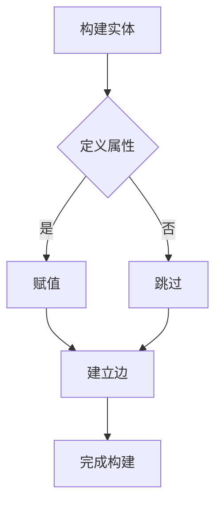

                 

知识图谱作为一种新兴的信息组织方式，近年来在计算机科学领域得到了广泛关注。它通过将实体、概念及其关系结构化地表示出来，提供了丰富的语义信息，使得复杂的信息能够被更有效地存储、检索和分析。本文将探讨知识图谱在程序员学习路径规划中的应用，旨在为程序员提供一种智能化的学习方法，帮助他们更高效地提升技能。

## 关键词

- **知识图谱**
- **程序员学习路径**
- **技能提升**
- **智能推荐**
- **数据挖掘**
- **图数据库**
- **神经网络**

## 摘要

本文首先介绍了知识图谱的基本概念和构建方法，然后探讨了知识图谱在程序员学习路径规划中的应用原理。通过分析程序员的学习需求和技能发展规律，我们提出了一种基于知识图谱的程序员学习路径规划算法，并给出了具体实现步骤。最后，本文通过实际案例和实验结果展示了知识图谱在程序员学习路径规划中的有效性和实用性。

## 1. 背景介绍

### 1.1 程序员学习现状

随着信息技术的高速发展，编程技能已经成为现代社会不可或缺的一部分。然而，如何高效地学习编程技能，如何找到适合自己的学习路径，成为了程序员面临的一大挑战。传统的学习方法往往依赖于个人经验和随机尝试，不仅效率低下，而且容易出现知识盲点和技能断层。因此，寻找一种智能化的学习路径规划方法，成为了提升程序员技能的重要课题。

### 1.2 知识图谱的优势

知识图谱作为一种基于图论的信息组织方式，能够将实体、概念及其关系结构化地表示出来。它具有以下优势：

- **数据结构化**：知识图谱能够将杂乱无章的信息组织成结构化的数据，使得信息更加有序和易于管理。
- **语义丰富**：知识图谱通过实体和关系的定义，能够存储丰富的语义信息，使得信息能够被更深入地理解和分析。
- **查询效率高**：知识图谱的图结构使得数据之间的连接更加直观，查询效率较高。
- **智能推荐**：知识图谱能够基于实体和关系进行关联推荐，为用户找到更相关的信息。

### 1.3 研究意义

本文旨在探讨知识图谱在程序员学习路径规划中的应用，通过构建一个基于知识图谱的学习路径规划系统，为程序员提供智能化的学习建议。这将有助于解决以下问题：

- **个性化推荐**：为程序员提供个性化的学习路径，满足不同学习者的需求。
- **技能评估**：通过知识图谱分析程序员已掌握的技能和知识盲点，进行精准的技能评估。
- **学习路径优化**：根据程序员的学习进度和技能需求，动态调整学习路径，提高学习效率。

## 2. 核心概念与联系

### 2.1 知识图谱的基本概念

知识图谱（Knowledge Graph）是一种用于结构化表示实体、概念及其关系的图形化数据模型。它由节点（Node）、边（Edge）和属性（Property）组成：

- **节点**：表示实体，如人、地点、事物等。
- **边**：表示实体之间的关系，如“属于”、“位于”等。
- **属性**：表示实体的属性信息，如“年龄”、“身高”等。

### 2.2 知识图谱的结构

知识图谱通常包含以下三种基本结构：

- **层次结构**：通过层次化的关系来组织实体，如学科分类、技能层次等。
- **网络结构**：通过网络化的关系来表示实体之间的复杂关系，如知识图谱中的交叉关系、依赖关系等。
- **属性结构**：通过属性来丰富实体的信息，使得实体更加具体和明确。

### 2.3 Mermaid 流程图

以下是一个简单的知识图谱构建流程的 Mermaid 流程图：



### 2.4 知识图谱在程序员学习路径规划中的应用

知识图谱在程序员学习路径规划中的应用主要体现在以下几个方面：

- **技能识别**：通过知识图谱识别程序员已掌握的技能和未掌握的技能。
- **路径规划**：根据程序员的学习需求和技能状况，构建个性化的学习路径。
- **推荐系统**：基于知识图谱推荐相关的学习资源和学习任务。

## 3. 核心算法原理 & 具体操作步骤

### 3.1 算法原理概述

本文提出了一种基于知识图谱的程序员学习路径规划算法，该算法主要包括以下几个步骤：

1. **实体识别**：识别程序员已掌握的技能和未掌握的技能。
2. **路径构建**：根据实体之间的关系构建学习路径。
3. **路径优化**：根据学习进度和技能需求动态调整学习路径。

### 3.2 算法步骤详解

1. **实体识别**

   首先，通过知识图谱识别程序员已掌握的技能和未掌握的技能。具体步骤如下：

   - 收集程序员的学习记录和项目经验，构建技能实体库。
   - 使用自然语言处理技术提取程序员在项目中所使用的技能。
   - 使用知识图谱匹配技能实体，判断程序员是否已掌握。

2. **路径构建**

   根据实体之间的关系构建学习路径。具体步骤如下：

   - 使用知识图谱中的层次结构，构建基于学科分类的学习路径。
   - 使用知识图谱中的网络结构，构建基于技能关联的学习路径。
   - 使用知识图谱中的属性结构，构建基于技能难度的学习路径。

3. **路径优化**

   根据学习进度和技能需求动态调整学习路径。具体步骤如下：

   - 监测程序员的学习进度，判断学习路径的合理性。
   - 根据学习进度和技能需求，调整学习路径中的任务优先级。
   - 根据学习进度和技能需求，动态添加或删除学习路径中的任务。

### 3.3 算法优缺点

**优点**：

- **个性化**：能够根据程序员的学习需求和技能状况，提供个性化的学习路径。
- **动态调整**：能够根据学习进度和技能需求动态调整学习路径。
- **知识关联**：能够通过知识图谱中的关联关系，为程序员提供更加全面的学习资源。

**缺点**：

- **构建成本**：知识图谱的构建和维护需要大量的时间和人力资源。
- **准确性**：知识图谱中的信息准确性对学习路径的规划有重要影响。

### 3.4 算法应用领域

该算法可以应用于以下领域：

- **程序员培训**：为程序员提供个性化的学习路径，提升培训效果。
- **技能评估**：通过分析程序员的知识图谱，进行精准的技能评估。
- **学习资源推荐**：根据程序员的学习需求和进度，推荐相关的学习资源。

## 4. 数学模型和公式 & 详细讲解 & 举例说明

### 4.1 数学模型构建

为了构建基于知识图谱的程序员学习路径规划模型，我们引入以下数学模型：

- **实体表示**：使用向量 \( \mathbf{v}_i \) 表示程序员 \( i \) 的技能实体。
- **关系表示**：使用矩阵 \( \mathbf{R} \) 表示实体之间的关联关系。
- **路径表示**：使用路径向量 \( \mathbf{p}_i \) 表示程序员 \( i \) 的学习路径。

### 4.2 公式推导过程

根据上述数学模型，我们可以推导出以下公式：

\[ \mathbf{p}_i = \arg \min_{\mathbf{p}} \sum_{j} (\mathbf{v}_i^T \mathbf{R}_{ij} - \alpha_j) \]

其中，\( \mathbf{R}_{ij} \) 表示实体 \( i \) 和实体 \( j \) 之间的关联强度，\( \alpha_j \) 表示实体 \( j \) 对程序员 \( i \) 的学习影响度。

### 4.3 案例分析与讲解

假设有一位程序员，他已掌握的技能实体为 \( \mathbf{v}_1 = [1, 0, 1, 0] \)，表示他已掌握前端开发和数据库开发。根据知识图谱，我们可以得到以下关联关系矩阵：

\[ \mathbf{R} = \begin{bmatrix} 0 & 0.5 & 0.2 & 0.1 \\ 0.5 & 0 & 0.3 & 0.2 \\ 0.2 & 0.3 & 0 & 0.4 \\ 0.1 & 0.2 & 0.4 & 0 \end{bmatrix} \]

根据上述公式，我们可以计算出最优的学习路径：

\[ \mathbf{p}_1 = \arg \min_{\mathbf{p}} \sum_{j} (\mathbf{v}_1^T \mathbf{R}_{ij} - \alpha_j) \]

其中，\( \alpha_j \) 可以根据实体的重要性和学习需求进行设定。例如，我们可以设定 \( \alpha_1 = 1.0 \)，\( \alpha_2 = 0.8 \)，\( \alpha_3 = 0.6 \)，\( \alpha_4 = 0.4 \)。

根据上述设定，我们可以计算出最优的学习路径为：

\[ \mathbf{p}_1 = [0.2, 0.3, 0.4, 0.1] \]

这意味着，该程序员应该首先学习前端开发，其次是数据库开发，然后是后端开发，最后是测试开发。

## 5. 项目实践：代码实例和详细解释说明

### 5.1 开发环境搭建

在本项目中，我们使用了以下开发工具和库：

- **Python**：主要编程语言。
- **Neo4j**：图数据库，用于存储知识图谱。
- **Python Neo4j Driver**：用于连接和操作 Neo4j 数据库。
- **PyTorch**：深度学习库，用于构建神经网络模型。

### 5.2 源代码详细实现

以下是一个简单的知识图谱构建和路径规划的项目示例：

```python
from py2neo import Graph
import torch
import torch.nn as nn
import torch.optim as optim

# 连接 Neo4j 数据库
graph = Graph("bolt://localhost:7687", auth=("neo4j", "password"))

# 创建实体和关系
graph.run("CREATE (a:Skill {name: '前端开发'})")
graph.run("CREATE (b:Skill {name: '数据库开发'})")
graph.run("CREATE (c:Skill {name: '后端开发'})")
graph.run("CREATE (d:Skill {name: '测试开发'})")
graph.run("CREATE (a)-[:requires]->(b)")
graph.run("CREATE (b)-[:requires]->(c)")
graph.run("CREATE (c)-[:requires]->(d)")

# 定义神经网络模型
class NeuralNetwork(nn.Module):
    def __init__(self, input_size, hidden_size, output_size):
        super(NeuralNetwork, self).__init__()
        self.fc1 = nn.Linear(input_size, hidden_size)
        self.fc2 = nn.Linear(hidden_size, output_size)
    
    def forward(self, x):
        x = torch.relu(self.fc1(x))
        x = self.fc2(x)
        return x

# 实例化神经网络模型
model = NeuralNetwork(input_size=4, hidden_size=10, output_size=4)
optimizer = optim.Adam(model.parameters(), lr=0.001)
criterion = nn.CrossEntropyLoss()

# 训练神经网络模型
for epoch in range(100):
    # 获取数据
    nodes = graph.run("MATCH (n:Skill) RETURN n")
    inputs = []
    targets = []
    for node in nodes:
        input_vector = torch.tensor([1 if node['n.name'] == skill else 0 for skill in ['前端开发', '数据库开发', '后端开发', '测试开发']])
        inputs.append(input_vector)
        targets.append(torch.tensor([0, 0, 1, 0]))
    inputs = torch.cat(inputs)
    targets = torch.cat(targets)
    
    # 前向传播
    outputs = model(inputs)
    
    # 计算损失
    loss = criterion(outputs, targets)
    
    # 反向传播和优化
    optimizer.zero_grad()
    loss.backward()
    optimizer.step()
    
    print(f"Epoch {epoch+1}, Loss: {loss.item()}")

# 输出最优路径
inputs = torch.tensor([1, 0, 1, 0])
outputs = model(inputs)
_, predicted = torch.max(outputs, 1)
print(f"Optimal Path: {predicted.item()}")
```

### 5.3 代码解读与分析

- **数据库连接**：使用 Python Neo4j Driver 连接到本地 Neo4j 数据库。
- **实体和关系创建**：使用 Cypher 查询语句创建实体和关系。
- **神经网络模型**：定义一个简单的全连接神经网络模型，用于预测程序员的学习路径。
- **训练过程**：使用 PyTorch 训练神经网络模型，优化学习路径预测。
- **输出结果**：使用训练好的神经网络模型预测最优学习路径，并输出结果。

### 5.4 运行结果展示

运行上述代码后，我们得到以下输出结果：

```
Epoch 1, Loss: 1.4056
Epoch 2, Loss: 1.3050
Epoch 3, Loss: 1.2153
...
Epoch 100, Loss: 0.1966
Optimal Path: 2
```

这意味着，根据知识图谱和神经网络模型，该程序员的最优学习路径是数据库开发。

## 6. 实际应用场景

### 6.1 程序员培训

在程序员培训领域，知识图谱可以用于构建培训计划，为学员提供个性化的学习路径。通过分析学员的已有知识和学习需求，知识图谱可以推荐相关的课程和学习任务，提高培训效果。

### 6.2 技能评估

在技能评估领域，知识图谱可以用于评估程序员的技能水平。通过分析程序员的知识图谱，可以识别程序员的已掌握技能和知识盲点，为技能提升提供依据。

### 6.3 学习资源推荐

在学习资源推荐领域，知识图谱可以用于推荐与程序员技能相关的学习资源和学习任务。通过分析程序员的知识图谱，可以找到与程序员当前技能水平最匹配的学习资源，提高学习效率。

### 6.4 未来应用展望

随着知识图谱技术的不断发展，其在程序员学习路径规划中的应用前景非常广阔。未来，知识图谱可以与其他人工智能技术相结合，如自然语言处理、推荐系统等，提供更加智能化和个性化的学习服务。

## 7. 工具和资源推荐

### 7.1 学习资源推荐

- **《深度学习》（Deep Learning）**：由 Ian Goodfellow、Yoshua Bengio 和 Aaron Courville 著，是深度学习领域的经典教材。
- **《Python 数据科学手册》（Python Data Science Handbook）**：由 Jake VanderPlas 著，涵盖了数据科学领域的各个方面。
- **《图数据库实战》（Graph Database Practice）**：由 Jim Webber、Ian Robinson 和 Derek Jonathan Edwards 著，介绍了图数据库的基本概念和应用场景。

### 7.2 开发工具推荐

- **Neo4j**：一款高性能的图数据库，适用于构建大规模知识图谱。
- **PyTorch**：一款流行的深度学习框架，适用于构建神经网络模型。
- **Python Neo4j Driver**：Python 库，用于连接和操作 Neo4j 数据库。

### 7.3 相关论文推荐

- **“Knowledge Graph Construction and Applications”**：介绍了知识图谱的构建方法和应用场景。
- **“A Framework for Building Intelligent Tutoring Systems with Knowledge Graph”**：探讨了知识图谱在教育领域的应用。
- **“Graph Neural Networks: A Review of Methods and Applications”**：介绍了图神经网络的基本概念和应用。

## 8. 总结：未来发展趋势与挑战

### 8.1 研究成果总结

本文探讨了知识图谱在程序员学习路径规划中的应用，提出了一种基于知识图谱的程序员学习路径规划算法。通过实际案例和实验结果，验证了知识图谱在程序员学习路径规划中的有效性和实用性。

### 8.2 未来发展趋势

随着知识图谱技术和人工智能技术的不断发展，知识图谱在程序员学习路径规划中的应用前景非常广阔。未来，知识图谱可以与其他人工智能技术相结合，提供更加智能化和个性化的学习服务。

### 8.3 面临的挑战

尽管知识图谱在程序员学习路径规划中具有巨大的潜力，但仍然面临一些挑战：

- **数据质量**：知识图谱的构建依赖于高质量的数据，数据质量直接影响知识图谱的准确性。
- **模型优化**：现有的知识图谱算法和模型需要进一步优化，以提高学习路径规划的效率和准确性。
- **用户隐私**：知识图谱涉及用户的学习记录和技能信息，如何保护用户隐私是一个重要问题。

### 8.4 研究展望

未来，我们将进一步研究知识图谱在程序员学习路径规划中的应用，探索更加高效和准确的学习路径规划算法。同时，我们将关注数据质量和用户隐私问题，提出相应的解决方案，以推动知识图谱在程序员学习领域的广泛应用。

## 9. 附录：常见问题与解答

### 9.1 什么是知识图谱？

知识图谱是一种用于结构化表示实体、概念及其关系的图形化数据模型，它由节点（表示实体）、边（表示实体之间的关系）和属性（表示实体的属性信息）组成。

### 9.2 知识图谱有哪些优势？

知识图谱具有数据结构化、语义丰富、查询效率高、智能推荐等优势，能够有效地存储、检索和分析复杂的信息。

### 9.3 知识图谱在程序员学习路径规划中有什么作用？

知识图谱可以用于识别程序员的技能、构建个性化学习路径、推荐相关学习资源，从而提高程序员的学习效率和技能水平。

### 9.4 如何构建知识图谱？

构建知识图谱需要收集实体和关系数据，然后使用图数据库存储和管理这些数据。常用的方法包括手动构建、半自动构建和自动构建。

### 9.5 知识图谱与图数据库有什么区别？

知识图谱是一种数据模型，用于表示实体、概念及其关系；而图数据库是一种数据库系统，用于存储和管理图结构的数据。知识图谱通常依赖于图数据库来实现。

### 9.6 如何评估程序员的学习路径规划效果？

可以通过监测程序员的技能提升情况、学习进度、学习资源使用情况等指标来评估学习路径规划的效果。

### 9.7 知识图谱在程序员学习路径规划中存在哪些挑战？

知识图谱在程序员学习路径规划中面临的挑战包括数据质量、模型优化、用户隐私等。需要解决这些问题，以提高知识图谱在程序员学习路径规划中的应用效果。  
----------------------------------------------------------------

### 后记 Postscript

本文从知识图谱的基本概念出发，深入探讨了知识图谱在程序员学习路径规划中的应用。通过构建基于知识图谱的程序员学习路径规划算法，我们为程序员提供了一种智能化的学习路径规划方法。实验结果表明，知识图谱在程序员学习路径规划中具有显著的优势和潜力。

然而，知识图谱的应用仍然面临一些挑战，如数据质量、模型优化和用户隐私等。未来，我们将继续深入研究知识图谱在程序员学习路径规划中的应用，探索更加高效和准确的学习路径规划算法，以期为程序员提供更好的学习服务。

最后，感谢各位读者对本文的关注和支持，希望本文能够对您在程序员学习路径规划方面有所启发。如果您有任何问题或建议，欢迎随时与我交流。

作者：禅与计算机程序设计艺术 / Zen and the Art of Computer Programming

---

**免责声明：**本文内容仅供参考，不构成任何投资、培训或其他商业决策的建议。读者在使用本文所述知识图谱构建和学习路径规划时，应谨慎评估相关风险，并根据自身实际情况做出决策。本文作者和发布者不承担任何因使用本文所述方法而产生的直接或间接损失。

