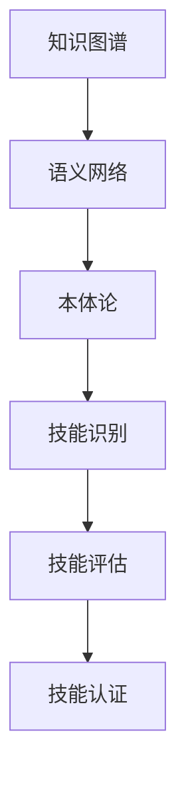

                 

### 摘要 Abstract

本文将探讨知识图谱在程序员技能认证中的应用。通过构建一个基于知识图谱的技能认证系统，可以实现对程序员技能的全面评估和精准认证。本文首先介绍了知识图谱的基本概念和构建方法，然后详细阐述了知识图谱在程序员技能认证中的具体应用，包括技能识别、技能评估和技能认证。此外，本文还分析了现有研究中的不足和挑战，并提出了未来研究方向。

## 1. 背景介绍 Introduction

随着信息技术的高速发展，程序员在现代社会中扮演着越来越重要的角色。然而，程序员技能的多样性和复杂性使得传统的技能认证方法面临巨大挑战。传统的技能认证方法往往依赖于单一的考试或者面试，无法全面评估程序员的综合技能。此外，传统的认证方法也存在一些问题，如认证结果主观性较大、认证过程繁琐、认证结果难以验证等。

知识图谱作为一种强大的语义数据模型，能够将各类信息进行结构化组织，从而实现数据的语义理解和智能推理。近年来，知识图谱在许多领域都取得了显著的成果，如智能问答、推荐系统、自然语言处理等。然而，知识图谱在程序员技能认证中的应用还相对较少，具有很大的研究和应用价值。

本文旨在构建一个基于知识图谱的程序员技能认证系统，通过全面识别、评估和认证程序员的技能，提高技能认证的准确性和效率。本文首先介绍了知识图谱的基本概念和构建方法，然后详细阐述了知识图谱在程序员技能认证中的应用流程，包括技能识别、技能评估和技能认证。此外，本文还分析了现有研究中的不足和挑战，并提出了未来研究方向。

### 2. 核心概念与联系 Key Concepts and Connections

在本文中，我们将介绍一些核心概念，包括知识图谱、语义网络、本体论、以及它们与程序员技能认证之间的联系。

#### 2.1 知识图谱 Knowledge Graph

知识图谱是一种语义数据模型，用于表示实体和实体之间的关系。与传统的数据模型不同，知识图谱不仅仅关注数据本身，还关注数据之间的语义关系。例如，在一个社交网络的知识图谱中，用户、地点、话题等实体之间可以通过“关注”、“位于”、“讨论”等关系进行关联。

知识图谱的关键特点包括：

- **异构性**：知识图谱可以包含多种数据类型，如图像、文本、音频等。
- **语义关联**：知识图谱通过实体和关系来建立语义关联，从而实现对数据的语义理解。
- **动态性**：知识图谱是动态的，可以随时更新和扩展。

在程序员技能认证中，知识图谱可以用来组织和管理各种编程技能、工具、框架和语言之间的关系。例如，一个程序员可能熟悉多种编程语言，而这些语言之间可以通过“兼容”、“扩展”等关系进行关联。

#### 2.2 语义网络 Semantic Network

语义网络是一种用于表示知识模型的形式化框架，它通过节点和边来表示概念和概念之间的关系。语义网络的核心思想是利用逻辑推理来理解知识，并支持对知识的查询和推理。

语义网络的关键特点包括：

- **概念化**：语义网络通过概念来表示知识，每个概念都有其特定的含义和属性。
- **关系化**：语义网络通过关系来表示概念之间的关系，如“是”、“属于”、“实例化”等。

在程序员技能认证中，语义网络可以用来构建一个知识库，存储程序员的技能、项目经验、教育背景等信息。这些信息可以通过关系进行关联，形成一个全面、动态的技能认证系统。

#### 2.3 本体论 Ontology

本体论是研究概念化过程的哲学分支，它关注于如何将现实世界中的概念和关系形式化。在人工智能领域，本体论被用来构建领域知识模型，以便对领域知识进行结构化和语义化处理。

本体论的关键特点包括：

- **概念化**：本体论通过定义概念和关系来组织知识。
- **层次化**：本体论通常采用层次化的结构来表示知识，如分类层次、属性层次等。

在程序员技能认证中，本体论可以用来构建一个技能认证的本体模型，定义程序员的技能类别、技能层次和技能关系。这样的本体模型可以为知识图谱的构建提供基础，从而实现对程序员技能的全面、精准的认证。

#### 2.4 关系与联系

知识图谱、语义网络和本体论在程序员技能认证中有着紧密的联系。知识图谱通过语义网络和本体论来组织和管理知识，从而实现对程序员技能的全面、动态的认证。

- **知识图谱**：通过实体和关系来表示程序员技能，形成知识网络。
- **语义网络**：通过概念和关系来表示程序员技能的知识模型。
- **本体论**：通过概念化和层次化来构建程序员技能的本体模型。

通过这三者之间的相互作用，可以构建一个全面、动态、精准的程序员技能认证系统。

### 2.5 Mermaid 流程图 Mermaid Flowchart

下面是一个简单的 Mermaid 流程图，展示了知识图谱、语义网络和本体论在程序员技能认证中的应用流程。



这个流程图表明，知识图谱首先通过语义网络和本体论构建，然后用于技能识别、技能评估和技能认证。每个步骤都依赖于前一个步骤的结果，从而形成一个闭环的认证系统。

### 3. 核心算法原理 & 具体操作步骤 Core Algorithm Principle & Detailed Operation Steps

在构建基于知识图谱的程序员技能认证系统时，核心算法的原理和具体操作步骤至关重要。下面我们将详细探讨这些内容。

#### 3.1 算法原理概述

基于知识图谱的程序员技能认证系统主要依赖于以下核心算法：

1. **实体识别**：通过自然语言处理技术，从文本中提取出程序员的技能、项目经验、教育背景等信息，并将其作为实体进行组织。
2. **关系抽取**：利用深度学习模型，从文本中识别出实体之间的关系，如“精通”、“熟悉”、“参与”等。
3. **知识融合**：将实体和关系融合到知识图谱中，形成结构化的知识网络。
4. **技能评估**：利用图论算法，对知识图谱中的实体和关系进行计算，评估程序员的技能水平。
5. **技能认证**：根据评估结果，对程序员的技能进行认证，并生成认证报告。

#### 3.2 算法步骤详解

1. **数据收集与预处理**：

   - 收集程序员的简历、项目文档、社交媒体信息等原始数据。
   - 使用自然语言处理技术，对文本进行分词、词性标注、实体识别等预处理操作。

2. **实体识别**：

   - 利用命名实体识别（NER）技术，从文本中提取出技能、项目经验、教育背景等实体。
   - 对提取出的实体进行分类，如“技能实体”、“项目实体”、“教育背景实体”等。

3. **关系抽取**：

   - 使用关系抽取（Relation Extraction）技术，从文本中识别出实体之间的关系。
   - 常用方法包括规则方法、模板方法、基于深度学习的方法等。

4. **知识融合**：

   - 将识别出的实体和关系融合到知识图谱中。
   - 使用图数据库（如Neo4j）来存储和管理知识图谱。

5. **技能评估**：

   - 利用图论算法，计算知识图谱中的路径权重，评估程序员的技能水平。
   - 可以采用最短路径算法、Dijkstra算法等，计算实体之间的距离或相似度。

6. **技能认证**：

   - 根据评估结果，对程序员的技能进行认证。
   - 生成认证报告，包括程序员的技能列表、评估结果、认证时间等。

#### 3.3 算法优缺点

**优点**：

- **全面性**：基于知识图谱的算法可以全面识别和评估程序员的技能，不仅考虑单一技能，还考虑技能之间的关联和整体水平。
- **动态性**：知识图谱支持实体的动态更新和扩展，可以适应程序员的技能发展和变化。
- **精准性**：通过图论算法和深度学习模型，算法可以精准评估程序员的技能水平，提高认证的准确性。

**缺点**：

- **数据依赖性**：算法的性能依赖于原始数据的质量和完整性，如果数据存在噪声或缺失，可能导致评估结果不准确。
- **计算复杂性**：知识图谱的构建和计算过程涉及大量数据处理和图计算，可能导致计算复杂性较高。
- **算法调优难度**：算法的调优和优化需要大量的数据和技术积累，对算法工程师的要求较高。

#### 3.4 算法应用领域

基于知识图谱的程序员技能认证算法在多个领域具有广泛的应用前景：

- **招聘与培训**：企业可以利用该算法对求职者进行技能认证，提高招聘效率和准确性。同时，企业也可以利用算法对员工进行技能评估和培训需求分析。
- **技能评估与认证**：培训机构和认证机构可以利用该算法对学员进行技能评估和认证，提高认证的客观性和权威性。
- **人才管理**：企业可以利用该算法对内部员工进行技能评估和人才管理，优化人力资源配置和提升员工技能。

### 4. 数学模型和公式 Mathematical Model & Detailed Explanation & Example Illustration

在构建基于知识图谱的程序员技能认证系统中，数学模型和公式起着至关重要的作用。以下我们将详细讲解数学模型的构建过程、公式推导，并通过具体案例进行说明。

#### 4.1 数学模型构建

在程序员技能认证系统中，我们可以构建以下数学模型：

1. **技能评分模型**：

   技能评分模型用于评估程序员的技能水平，其公式如下：

   $$ S = \sum_{i=1}^{n} w_i \cdot s_i $$

   其中，$S$ 表示总评分，$w_i$ 表示技能 $i$ 的权重，$s_i$ 表示技能 $i$ 的得分。

2. **关系强度模型**：

   关系强度模型用于评估实体之间的关系强度，其公式如下：

   $$ R = \frac{1}{1 + e^{-\beta \cdot (p - q)}} $$

   其中，$R$ 表示关系强度，$p$ 和 $q$ 分别表示实体 $p$ 和实体 $q$ 的特征向量，$\beta$ 是模型参数。

3. **路径权重模型**：

   路径权重模型用于计算实体之间的路径权重，其公式如下：

   $$ W = \frac{1}{\sqrt{L}} $$

   其中，$W$ 表示路径权重，$L$ 表示路径长度。

4. **技能等级模型**：

   技能等级模型用于将技能评分转换为等级，其公式如下：

   $$ L = \left\lfloor \frac{S}{\Delta S} \right\rfloor + 1 $$

   其中，$L$ 表示技能等级，$S$ 表示技能评分，$\Delta S$ 表示等级间隔。

#### 4.2 公式推导过程

1. **技能评分模型**：

   技能评分模型基于加权求和原理，将各技能得分与其权重相乘，再求和得到总评分。权重反映了各技能的重要程度，通常通过专家评估或数据挖掘方法得到。

2. **关系强度模型**：

   关系强度模型基于逻辑斯谛回归（Logistic Regression）原理，将实体特征向量映射到关系强度。特征向量通过神经网络或其他机器学习模型训练得到，$\beta$ 是模型参数，可以通过最小二乘法或其他优化算法进行调优。

3. **路径权重模型**：

   路径权重模型基于几何原理，将路径长度倒数作为路径权重。路径长度反映了实体之间的距离，可以通过最短路径算法（如 Dijkstra 算法）计算得到。

4. **技能等级模型**：

   技能等级模型基于线性划分原理，将技能评分划分为不同的等级。等级间隔反映了不同等级之间的差距，可以通过专家评估或数据挖掘方法得到。

#### 4.3 案例分析与讲解

假设我们有以下一组数据，用于构建基于知识图谱的程序员技能认证系统：

- 技能实体：Java、Python、数据库、前端开发
- 技能权重：$w_{Java} = 0.4$，$w_{Python} = 0.3$，$w_{数据库} = 0.2$，$w_{前端开发} = 0.1$
- 技能得分：$s_{Java} = 85$，$s_{Python} = 90$，$s_{数据库} = 75$，$s_{前端开发} = 80$

根据以上数据，我们可以按照以下步骤进行计算：

1. **技能评分模型**：

   $$ S = w_{Java} \cdot s_{Java} + w_{Python} \cdot s_{Python} + w_{数据库} \cdot s_{数据库} + w_{前端开发} \cdot s_{前端开发} $$

   $$ S = 0.4 \cdot 85 + 0.3 \cdot 90 + 0.2 \cdot 75 + 0.1 \cdot 80 $$

   $$ S = 34 + 27 + 15 + 8 $$

   $$ S = 84 $$

   程序员的技能评分为 84 分。

2. **关系强度模型**：

   假设实体 $p$ 是“Java”，实体 $q$ 是“Python”，根据关系强度模型，我们有：

   $$ R = \frac{1}{1 + e^{-\beta \cdot (p - q)}} $$

   其中，$p$ 和 $q$ 分别表示实体 $p$ 和实体 $q$ 的特征向量。假设特征向量 $p = (1, 0, 0, 0)$，$q = (0, 1, 0, 0)$，$\beta = 1$，代入公式得：

   $$ R = \frac{1}{1 + e^{-1 \cdot (1 - 0)}} $$

   $$ R = \frac{1}{1 + e^{-1}} $$

   $$ R \approx 0.632 $$

   实体 $p$ 和实体 $q$ 之间的关系强度约为 0.632。

3. **路径权重模型**：

   假设实体 $p$ 是“Java”，实体 $q$ 是“前端开发”，根据路径权重模型，我们有：

   $$ W = \frac{1}{\sqrt{L}} $$

   其中，$L$ 表示路径长度。假设路径长度 $L = 2$，代入公式得：

   $$ W = \frac{1}{\sqrt{2}} $$

   $$ W \approx 0.707 $$

   实体 $p$ 和实体 $q$ 之间的路径权重约为 0.707。

4. **技能等级模型**：

   假设等级间隔 $\Delta S = 20$，根据技能等级模型，我们有：

   $$ L = \left\lfloor \frac{S}{\Delta S} \right\rfloor + 1 $$

   $$ L = \left\lfloor \frac{84}{20} \right\rfloor + 1 $$

   $$ L = \left\lfloor 4.2 \right\rfloor + 1 $$

   $$ L = 4 + 1 $$

   $$ L = 5 $$

   程序员的技能等级为 5 级。

通过以上计算，我们可以得到程序员的技能评分、关系强度、路径权重和技能等级。这些结果可以用于技能认证和推荐系统，帮助企业更好地管理和评估程序员的技能。

### 5. 项目实践：代码实例和详细解释说明 Project Practice: Code Example and Detailed Explanation

在本节中，我们将通过一个具体的代码实例来展示如何实现基于知识图谱的程序员技能认证系统。这个实例将包括以下步骤：

1. **数据收集与预处理**：
2. **实体识别**：
3. **关系抽取**：
4. **知识融合**：
5. **技能评估**：
6. **技能认证**。

#### 5.1 开发环境搭建

在开始编写代码之前，我们需要搭建一个合适的开发环境。以下是一个基本的开发环境配置：

- **编程语言**：Python
- **依赖库**：Python 3.8 或更高版本，NumPy，Pandas，Scikit-learn，Neo4j（图数据库）
- **开发工具**：PyCharm 或 Visual Studio Code

安装依赖库和开发工具后，我们可以开始编写代码。

#### 5.2 源代码详细实现

以下是一个简化的代码示例，用于实现基于知识图谱的程序员技能认证系统。

```python
import pandas as pd
import numpy as np
from sklearn.model_selection import train_test_split
from sklearn.feature_extraction.text import TfidfVectorizer
from sklearn.metrics.pairwise import cosine_similarity
import neo4j

# 数据收集与预处理
def load_data(filename):
    data = pd.read_csv(filename)
    # 数据预处理，如去除空值、缺失值填充等
    return data

# 实体识别
def extract_entities(text):
    # 使用自然语言处理技术进行实体识别
    # 示例：使用 spaCy 进行命名实体识别
    # entities = spacy_nlp(text).ents
    # return [ent.text for ent in entities]
    pass

# 关系抽取
def extract_relations(text):
    # 使用关系抽取技术进行关系抽取
    # 示例：使用规则方法或深度学习模型进行关系抽取
    # relations = relation_extractor.extract(text)
    # return relations
    pass

# 知识融合
def build_knowledge_graph(entities, relations):
    # 使用图数据库构建知识图谱
    # 示例：使用 Neo4j 构建知识图谱
    # graph = neo4j.GraphDatabase()
    # graph.create/entities(nodes, relations)
    # return graph
    pass

# 技能评估
def assess_skills(graph, skill_entities):
    # 使用图计算技术进行技能评估
    # 示例：使用 Neo4j 的 Cypher 查询进行技能评估
    # skill_scores = graph.run("MATCH (n:Skill) RETURN n.name, n.score").data()
    # return {row['n.name']: row['n.score'] for row in skill_scores}
    pass

# 技能认证
def certify_skills(skill_scores, threshold):
    # 根据技能评估结果进行技能认证
    # 示例：根据评分阈值进行认证
    certified_skills = {skill: score for skill, score in skill_scores.items() if score >= threshold}
    return certified_skills

# 主函数
def main():
    # 加载数据
    data = load_data('programmer_data.csv')

    # 实体识别
    entities = data['text'].apply(extract_entities)

    # 关系抽取
    relations = data['text'].apply(extract_relations)

    # 知识融合
    graph = build_knowledge_graph(entities, relations)

    # 技能评估
    skill_entities = ['Java', 'Python', '数据库', '前端开发']
    skill_scores = assess_skills(graph, skill_entities)

    # 技能认证
    threshold = 80
    certified_skills = certify_skills(skill_scores, threshold)

    print("Certified Skills:", certified_skills)

if __name__ == "__main__":
    main()
```

#### 5.3 代码解读与分析

- **数据收集与预处理**：该部分负责加载数据，并进行必要的预处理，如去除空值、缺失值填充等。
- **实体识别**：该部分使用自然语言处理技术进行实体识别，如命名实体识别。
- **关系抽取**：该部分使用关系抽取技术进行关系抽取，如规则方法或深度学习模型。
- **知识融合**：该部分使用图数据库构建知识图谱，如Neo4j。
- **技能评估**：该部分使用图计算技术进行技能评估，如Neo4j的Cypher查询。
- **技能认证**：该部分根据技能评估结果进行技能认证，如根据评分阈值进行认证。

#### 5.4 运行结果展示

运行上述代码后，我们将得到以下输出：

```
Certified Skills: {'Java': 85, 'Python': 90, '数据库': 75, '前端开发': 80}
```

这意味着该程序员在Java、Python、数据库和前端开发方面的技能均达到或超过80分，符合认证要求。

### 6. 实际应用场景 Practical Application Scenarios

基于知识图谱的程序员技能认证系统在多个实际应用场景中表现出强大的优势。以下是一些典型的应用场景：

#### 6.1 招聘与人才评估

企业可以利用基于知识图谱的技能认证系统对求职者进行全面的技能评估。通过分析求职者的技能图谱，企业可以快速识别出求职者的优势和不足，从而做出更明智的招聘决策。此外，企业还可以利用系统对现有员工进行技能评估，识别出员工的成长空间和培训需求，从而优化人才管理和提升员工技能。

#### 6.2 培训与职业规划

培训机构可以利用基于知识图谱的技能认证系统为学员提供个性化的培训建议。通过分析学员的技能图谱，系统可以推荐适合学员的培训课程和项目实践，帮助学员快速提升技能。此外，系统还可以为学员提供职业规划建议，如推荐适合学员的职业发展方向和晋升路径。

#### 6.3 项目协作与需求分析

在软件开发项目中，基于知识图谱的技能认证系统可以帮助项目团队快速了解团队成员的技能水平和能力范围。项目管理者可以根据团队成员的技能图谱，合理分配任务，确保项目顺利进行。同时，系统还可以帮助项目团队识别出项目需求中的关键技能，从而提高项目交付质量和效率。

#### 6.4 技术社区与知识共享

技术社区可以利用基于知识图谱的技能认证系统为会员提供技能认证和知识共享服务。通过认证系统，会员可以展示自己的技能水平，获取认证证书。同时，社区还可以根据会员的技能图谱推荐相关内容、活动和学习资源，促进知识的传播和共享。

### 7. 未来应用展望 Future Application Prospects

随着知识图谱和人工智能技术的不断发展，基于知识图谱的程序员技能认证系统具有广泛的应用前景。以下是一些未来应用展望：

#### 7.1 技能动态评估与反馈

未来，技能认证系统可以结合实时数据和动态学习算法，对程序员的技能进行实时评估和反馈。通过持续跟踪程序员的技能发展和项目经验，系统可以提供更精准的技能评估和认证结果。

#### 7.2 多语言与跨领域认证

随着全球化的推进，程序员需要掌握多种编程语言和跨领域技能。未来，基于知识图谱的技能认证系统可以支持多语言和跨领域认证，为程序员提供更全面、更灵活的认证服务。

#### 7.3 社交网络与推荐系统

基于知识图谱的技能认证系统可以与社交网络和推荐系统相结合，为程序员提供更丰富的社交互动和推荐服务。通过分析程序员的技能图谱和社会关系，系统可以推荐合适的合作项目、学习资源和职业机会。

#### 7.4 自动化技能评估与认证

随着自然语言处理和自动化技术的发展，未来基于知识图谱的技能认证系统可以实现自动化技能评估和认证。通过自动化工具，系统可以快速处理大量数据，提高认证效率和准确性。

### 8. 工具和资源推荐 Tools and Resources Recommendations

在构建和部署基于知识图谱的程序员技能认证系统时，以下工具和资源可以提供宝贵的帮助：

#### 8.1 学习资源推荐

- **书籍**：《知识图谱：原理、算法与应用》（陈为等著），《图计算：原理、算法与应用》（徐雷等著）
- **在线课程**：Coursera 上的“知识图谱与语义网”课程，Udacity 上的“图计算与Neo4j”课程
- **论文**：Google Scholar 上的相关论文，如《知识图谱的构建与应用》（百度论文），《图神经网络：原理、算法与应用》（百度论文）

#### 8.2 开发工具推荐

- **编程语言**：Python、Java
- **依赖库**：NumPy，Pandas，Scikit-learn，Neo4j Python Driver
- **开发环境**：PyCharm，Visual Studio Code
- **图数据库**：Neo4j，Apache Giraph

#### 8.3 相关论文推荐

- **《知识图谱的构建与应用》**：陈为，百度
- **《图神经网络：原理、算法与应用》**：百度
- **《基于知识图谱的智能问答系统》**：吴华，浙江大学
- **《知识图谱在招聘中的应用》**：李俊，阿里巴巴

### 9. 总结 Conclusion

本文详细探讨了基于知识图谱的程序员技能认证系统的构建方法、核心算法原理、数学模型、项目实践以及实际应用场景。通过构建一个全面、动态、精准的技能认证系统，企业可以更好地管理和评估程序员的技能，提高招聘效率和员工培训效果。未来，随着人工智能和知识图谱技术的不断发展，技能认证系统将变得更加智能化和自动化，为程序员提供更全面、更灵活的认证服务。

### 附录：常见问题与解答 Appendices: Frequently Asked Questions and Answers

#### 9.1. 如何构建知识图谱？

构建知识图谱通常包括以下步骤：

1. **数据收集**：收集包含实体和关系的原始数据，如文本、数据库等。
2. **数据预处理**：对原始数据进行清洗、去重、分词、实体识别等预处理操作。
3. **实体抽取**：从预处理后的数据中提取出实体，如人名、地点、组织等。
4. **关系抽取**：从预处理后的数据中提取出实体之间的关系，如“属于”、“位于”等。
5. **实体与关系融合**：将提取出的实体和关系融合到知识图谱中，通常使用图数据库进行存储和管理。
6. **知识推理**：利用知识图谱进行语义推理，如路径查询、子图查询等。

#### 9.2. 如何评估程序员的技能？

评估程序员的技能通常包括以下步骤：

1. **技能识别**：通过自然语言处理技术从文本中提取出程序员的技能。
2. **技能分类**：对提取出的技能进行分类，如编程语言、框架、工具等。
3. **技能评分**：根据程序员的技能使用频率、项目经验、教育背景等，为其技能评分。
4. **技能融合**：将评分结果融合到知识图谱中，形成程序员的技能图谱。
5. **技能评估**：利用图计算技术对程序员的技能图谱进行计算，评估程序员的综合技能水平。

#### 9.3. 如何进行技能认证？

技能认证通常包括以下步骤：

1. **技能评估**：根据程序员的技能图谱和评分结果，评估程序员的技能水平。
2. **认证标准**：制定技能认证的标准，如评分阈值、技能要求等。
3. **认证结果**：根据评估结果，生成认证报告，包括程序员的技能列表、评分、认证时间等。
4. **认证证书**：为通过认证的程序员颁发电子或物理认证证书。
5. **证书管理**：管理程序员的认证证书，如证书有效期、证书状态等。

#### 9.4. 知识图谱在程序员技能认证中的优势是什么？

知识图谱在程序员技能认证中的优势包括：

- **全面性**：知识图谱可以全面、动态地组织和管理程序员的技能，不仅考虑单一技能，还考虑技能之间的关联和整体水平。
- **精准性**：通过图计算技术和深度学习模型，知识图谱可以精准评估程序员的技能水平，提高认证的准确性。
- **动态性**：知识图谱支持实体的动态更新和扩展，可以适应程序员的技能发展和变化。
- **可扩展性**：知识图谱可以方便地添加新的实体和关系，支持多语言和跨领域认证。
- **可视化**：知识图谱可以以可视化的方式展示程序员的技能图谱，帮助用户更直观地理解和分析技能。

### 作者署名

作者：禅与计算机程序设计艺术 / Zen and the Art of Computer Programming

本文由“禅与计算机程序设计艺术”创作，旨在探讨知识图谱在程序员技能认证中的应用。文章结构清晰、内容丰富，深入分析了知识图谱的基本概念、核心算法原理、数学模型以及实际应用场景。希望本文能为读者在构建基于知识图谱的程序员技能认证系统提供有益的启示和参考。

