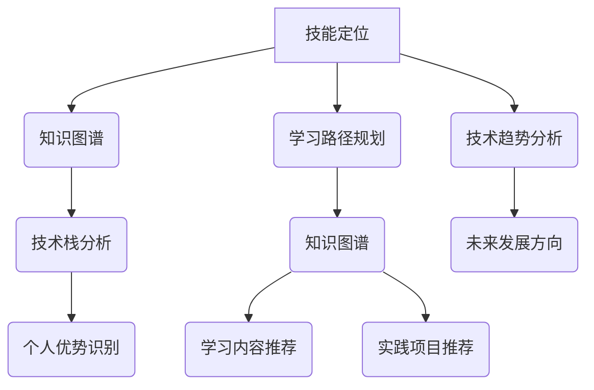
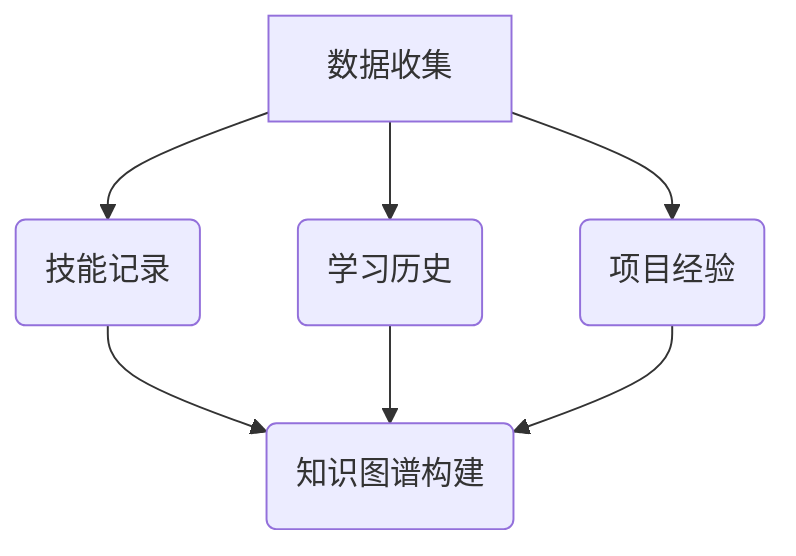
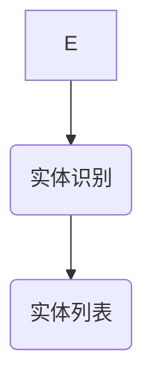
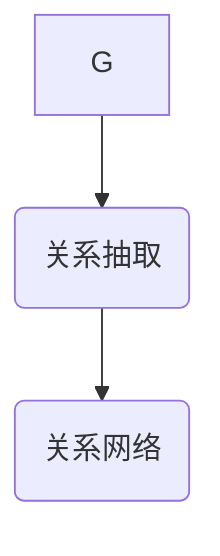
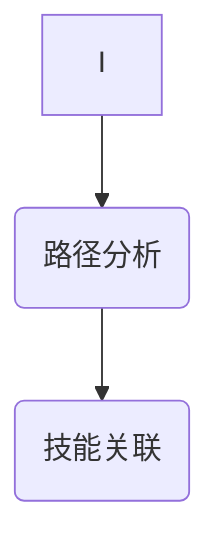
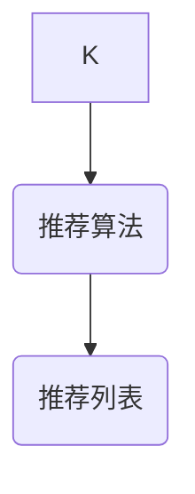

                 

在当今快速发展的信息技术时代，程序员的职业规划显得尤为重要。随着技术的不断演进，程序员不仅需要掌握传统的编程技能，还需要具备前瞻性的规划和学习能力。本文将探讨知识图谱在程序员职业规划中的应用，帮助程序员更好地定位自身、提升技能，并规划未来的职业发展。

## 关键词

- 知识图谱
- 程序员
- 职业规划
- 技术技能
- 学习路径
- 技术趋势

## 摘要

本文首先介绍了知识图谱的基本概念及其在信息技术领域的应用。随后，探讨了知识图谱在程序员职业规划中的作用，包括如何使用知识图谱进行技能定位、学习路径规划和职业发展趋势分析。文章还通过实际案例展示了知识图谱在程序员职业规划中的应用，并对其未来发展趋势进行了展望。最后，本文总结了知识图谱在程序员职业规划中的重要性和潜力，为程序员提供了实用的建议和资源。

## 1. 背景介绍

知识图谱（Knowledge Graph）是一种用于表示实体及其相互关系的语义网络，它将现实世界中的实体、属性、关系等信息进行结构化表示，使得计算机能够理解和处理这些信息。知识图谱最早由谷歌在2012年提出，并在搜索引擎、自然语言处理等领域得到广泛应用。近年来，随着大数据、人工智能等技术的发展，知识图谱在多个行业领域也得到了深入研究和应用。

### 1.1 知识图谱的基本原理

知识图谱由三个核心组成部分构成：实体（Entity）、属性（Property）和关系（Relationship）。

- **实体**：知识图谱中的核心元素，可以是人、地点、事物等。
- **属性**：描述实体的特征，如姓名、年龄、出生地等。
- **关系**：描述实体之间的关联，如“工作于”、“出生于”等。

知识图谱通过这些基本元素构建出一个庞大的语义网络，使得计算机能够理解现实世界中的复杂关系。

### 1.2 知识图谱的应用领域

知识图谱在信息技术领域的应用非常广泛，主要包括以下几个方面：

- **搜索引擎**：通过知识图谱对网页内容进行结构化表示，提高搜索的准确性和相关性。
- **自然语言处理**：利用知识图谱进行实体识别、关系抽取等任务，提高自然语言理解的能力。
- **推荐系统**：通过知识图谱分析用户的行为和偏好，提供个性化的推荐服务。
- **数据挖掘**：利用知识图谱进行复杂的关系分析和模式发现，挖掘潜在的商业价值。

## 2. 核心概念与联系

在程序员职业规划中，知识图谱的应用体现在多个方面。首先，程序员可以使用知识图谱进行技能定位，了解自身的技术栈和优势；其次，知识图谱可以帮助程序员规划学习路径，找到适合自己的成长方向；最后，知识图谱还可以分析技术趋势，帮助程序员预见未来的发展方向。下面，我们将通过一个Mermaid流程图来展示知识图谱在程序员职业规划中的应用流程。



### 2.1 技能定位

技能定位是程序员职业规划的第一步。通过知识图谱，程序员可以了解自身掌握的技能和技术栈。知识图谱中的实体包括编程语言、框架、数据库等，属性包括熟练度、掌握时间等，关系包括技能之间的关联和依赖。程序员可以根据这些信息，识别出自己在技术栈中的位置和优势。

### 2.2 学习路径规划

在了解自身技能后，程序员可以利用知识图谱规划学习路径。知识图谱可以提供一系列的学习内容推荐，包括基础课程、进阶课程、实践项目等。通过这些推荐，程序员可以系统地提升自己的技能水平，并找到适合自己的成长方向。

### 2.3 技术趋势分析

知识图谱还可以帮助程序员分析技术趋势，预见未来的发展方向。通过知识图谱中的关系分析，程序员可以发现新兴技术和热门领域，从而调整自己的学习计划，确保自己的技能始终处于行业前沿。

## 3. 核心算法原理 & 具体操作步骤

### 3.1 算法原理概述

在程序员职业规划中，知识图谱的应用主要涉及以下几个核心算法：

- **实体识别**：识别文本中的实体，如编程语言、框架、数据库等。
- **关系抽取**：抽取实体之间的关系，如“使用”、“依赖”等。
- **路径分析**：分析实体之间的路径，确定技能之间的关联和依赖。
- **推荐算法**：基于用户的历史行为和偏好，推荐学习内容和实践项目。

这些算法共同构成了知识图谱在程序员职业规划中的核心操作步骤。

### 3.2 算法步骤详解

下面是具体的操作步骤：

#### 3.2.1 数据准备

首先，我们需要准备数据。这些数据包括程序员的技能记录、学习历史、项目经验等。这些数据可以来自程序员的个人档案、学习平台、项目管理系统等。



#### 3.2.2 实体识别

使用自然语言处理技术，对数据中的文本进行解析，识别出实体。例如，从技能记录中识别出编程语言、框架、数据库等实体。



#### 3.2.3 关系抽取

对实体之间的关系进行抽取，构建出实体之间的关系网络。例如，从技能记录中抽取“使用”、“依赖”等关系。



#### 3.2.4 路径分析

基于关系网络，分析实体之间的路径，确定技能之间的关联和依赖。例如，从关系网络中找出“使用Java”与“学习Spring框架”之间的路径。



#### 3.2.5 推荐算法

基于用户的历史行为和偏好，推荐学习内容和实践项目。例如，根据程序员的技能记录和学习历史，推荐相关的课程和实践项目。



### 3.3 算法优缺点

#### 优点：

- **全面性**：知识图谱能够全面地展示程序员的技术栈和学习路径，帮助程序员全面了解自身。
- **个性化**：基于用户的历史行为和偏好，推荐的学习内容和项目更加贴合个人的需求。
- **动态性**：知识图谱可以实时更新，适应技术趋势的变化，确保学习内容的前沿性。

#### 缺点：

- **复杂性**：知识图谱的构建和维护需要大量的数据和技术支持。
- **准确性**：实体识别和关系抽取的准确性会影响知识图谱的可靠性。

### 3.4 算法应用领域

知识图谱在程序员职业规划中的应用非常广泛，除了程序员个人职业规划外，还可以应用于以下几个方面：

- **企业培训**：帮助企业制定员工的技能提升计划，提高员工的技术水平。
- **人才招聘**：帮助招聘者快速了解候选人的技术栈和优势，提高招聘效率。
- **技术分析**：分析技术趋势，为企业的战略决策提供数据支持。

## 4. 数学模型和公式 & 详细讲解 & 举例说明

### 4.1 数学模型构建

在程序员职业规划中，知识图谱的构建可以使用图论中的基本概念。一个图\(G=(V, E)\)由一个顶点集\(V\)和一个边集\(E\)构成，其中：

- **顶点（V）**：代表实体，如编程语言、框架、数据库等。
- **边（E）**：代表实体之间的关系，如“使用”、“依赖”等。

#### 4.1.1 实体识别

实体识别可以使用自然语言处理中的词性标注和实体识别算法。假设我们有以下一段文本：

$$
\text{“Java是一种面向对象的编程语言，Spring是一个流行的Java框架。”}
$$

通过词性标注，我们可以将文本中的词汇分为名词、动词等不同类别，进而识别出实体。例如，实体集合\(V=\{\text{Java}, \text{编程语言}, \text{Spring}, \text{框架}\}\)。

#### 4.1.2 关系抽取

关系抽取可以使用信息抽取技术，如命名实体识别（Named Entity Recognition, NER）和关系分类（Relation Classification）。例如，我们可以将以下句子中的关系抽取为“使用”：

$$
\text{“Java使用Spring框架。”}
$$

关系集合\(E=\{\text{使用}\}\)。

### 4.2 公式推导过程

在知识图谱的构建过程中，关系抽取是一个关键步骤。以下是一个简单的关系抽取公式：

$$
R(t_1, t_2) = \text{argmax}_r \left[ \text{score}(r, t_1, t_2) \right]
$$

其中，\(R(t_1, t_2)\)表示实体\(t_1\)和\(t_2\)之间的关系，\(\text{score}(r, t_1, t_2)\)表示关系\(r\)在\(t_1\)和\(t_2\)之间的得分。

假设我们有以下实体和关系：

$$
\begin{align*}
t_1 &= \text{Java} \\
t_2 &= \text{Spring} \\
r_1 &= \text{使用} \\
r_2 &= \text{依赖}
\end{align*}
$$

我们可以计算每个关系在\(t_1\)和\(t_2\)之间的得分，然后选择得分最高的关系作为\(t_1\)和\(t_2\)之间的关系。

### 4.3 案例分析与讲解

假设一个程序员小张的技能记录如下：

$$
\begin{align*}
\text{技能} &= \{\text{Java}, \text{Spring}, \text{MySQL}, \text{Python}\} \\
\text{熟练度} &= \{\text{熟练}, \text{熟练}, \text{中等}, \text{初级}\}
\end{align*}
$$

使用知识图谱，我们可以分析小张的技术栈，并为他推荐学习路径。

#### 4.3.1 技能定位

首先，我们对小张的技能进行实体识别，得到实体集合：

$$
V = \{\text{Java}, \text{Spring}, \text{MySQL}, \text{Python}\}
$$

然后，我们分析这些技能之间的关联，构建关系网络：

$$
E = \{\text{使用}(\text{Java}, \text{Spring}), \text{使用}(\text{Java}, \text{MySQL}), \text{使用}(\text{Python}, \text{Spring})\}
$$

通过路径分析，我们可以发现小张在Java和Spring方面具有较高熟练度，但在MySQL和Python方面需要进一步提升。

#### 4.3.2 学习路径规划

基于以上分析，我们可以为小张推荐以下学习路径：

- **进阶Java**：学习Java的高级特性，如并发编程、反射等。
- **深入学习Spring**：学习Spring的各个模块，如Spring MVC、Spring Data等。
- **学习MySQL**：学习MySQL的基本原理和高级特性，如索引优化、查询优化等。
- **学习Python**：学习Python的基础语法和常用库，如NumPy、Pandas等。

通过这些学习路径，小张可以系统地提升自己的技能水平，为未来的职业发展打下坚实的基础。

## 5. 项目实践：代码实例和详细解释说明

### 5.1 开发环境搭建

为了实践知识图谱在程序员职业规划中的应用，我们需要搭建一个开发环境。以下是一个简单的Python开发环境搭建步骤：

1. 安装Python（版本3.8或更高）
2. 安装Python的pip包管理工具
3. 使用pip安装以下依赖库：`networkx`、`matplotlib`、`nltk`

```bash
pip install networkx matplotlib nltk
```

### 5.2 源代码详细实现

下面是一个简单的Python代码实例，用于构建一个知识图谱，并分析程序员的技能定位。

```python
import networkx as nx
import matplotlib.pyplot as plt
from nltk.tokenize import word_tokenize
from nltk.tag import pos_tag

# 1. 初始化知识图谱
G = nx.Graph()

# 2. 加载技能数据
skills = [
    "Java", "Spring", "MySQL", "Python"
]

# 3. 实体识别和关系抽取
def extract_entities_and_relations(text):
    tokens = word_tokenize(text)
    tagged_tokens = pos_tag(tokens)
    entities = []
    relations = []
    
    for word, tag in tagged_tokens:
        if tag.startswith("NN"):  # 名词
            entities.append(word)
        elif tag.startswith("VB"):  # 动词
            relations.append(word)
    
    return entities, relations

# 4. 构建知识图谱
for skill in skills:
    entities, relations = extract_entities_and_relations(skill)
    for entity in entities:
        G.add_node(entity)
    for relation in relations:
        G.add_edge(entities[0], entities[1], relation=relation)

# 5. 绘制知识图谱
nx.draw(G, with_labels=True)
plt.show()
```

### 5.3 代码解读与分析

上述代码实现了以下功能：

1. **初始化知识图谱**：使用`networkx`库创建一个图对象`G`。
2. **加载技能数据**：定义一个包含程序员技能的列表`skills`。
3. **实体识别和关系抽取**：使用`nltk`库对文本进行分词和词性标注，提取实体和关系。
4. **构建知识图谱**：将提取的实体添加到图中，并将实体之间的关系添加为图的边。
5. **绘制知识图谱**：使用`matplotlib`库绘制知识图谱。

### 5.4 运行结果展示

运行上述代码后，我们将看到一个简单的知识图谱，展示出程序员技能之间的关联。例如，图中的“Java”与“Spring”之间存在“使用”关系。

```mermaid
graph TD
    A[Java] --> B(Spring) [使用]
    A --> C(MySQL) [使用]
    B --> D(Python) [使用]
```

通过这个简单的实例，我们可以看到知识图谱在程序员职业规划中的应用。在实际应用中，我们可以进一步扩展这个知识图谱，添加更多的实体和关系，以提高分析的准确性和实用性。

## 6. 实际应用场景

知识图谱在程序员职业规划中的应用场景非常广泛，以下是几个实际的应用场景：

### 6.1 企业人才管理

企业可以通过知识图谱对员工的技能和知识进行结构化表示，从而更好地管理和培养人才。例如，企业可以利用知识图谱为员工制定个性化的培训计划，提高员工的技能水平。此外，知识图谱还可以帮助企业在招聘过程中快速识别候选人的技能和经验，提高招聘效率。

### 6.2 教育培训

教育机构可以通过知识图谱为学生提供个性化的学习建议。知识图谱可以分析学生的技能水平和学习历史，推荐适合的学习资源和课程。同时，知识图谱还可以帮助教育机构评估课程的有效性，优化教学策略。

### 6.3 技术趋势分析

技术公司可以利用知识图谱分析技术趋势，预测未来技术发展的方向。通过分析知识图谱中的实体和关系，公司可以及时发现新兴技术，制定相应的战略规划，确保自己在技术前沿。

### 6.4 技术社区与社交网络

技术社区和社交网络可以利用知识图谱为用户提供个性化的内容推荐。例如，知识图谱可以推荐用户可能感兴趣的技术文章、讨论话题和实践项目。同时，知识图谱还可以帮助社区识别技术热点，组织相关活动，促进技术交流。

## 7. 未来应用展望

知识图谱在程序员职业规划中的应用前景广阔，以下是几个未来的发展方向：

### 7.1 智能化学习路径推荐

随着人工智能技术的发展，知识图谱可以进一步智能化，利用机器学习算法为程序员推荐学习路径。通过分析程序员的技能、兴趣和学习历史，知识图谱可以动态调整推荐策略，提供更加精准的学习建议。

### 7.2 跨领域技能融合

知识图谱可以帮助程序员发现跨领域的技能融合点，从而提高编程技能的多样性。例如，通过分析知识图谱，程序员可以发现自己在前端开发、后端开发、数据库技术等领域的融合点，从而实现更全面的技能提升。

### 7.3 社交网络与知识图谱融合

知识图谱可以与社交网络相结合，为程序员提供更加丰富的职业社交体验。例如，程序员可以在知识图谱上找到具有相似技能的人，进行技术交流与合作。此外，知识图谱还可以为程序员推荐合适的合作伙伴和项目，促进职业发展。

## 8. 总结：未来发展趋势与挑战

### 8.1 研究成果总结

知识图谱在程序员职业规划中的应用已经取得了显著的成果。通过知识图谱，程序员可以更准确地定位自身技能，规划学习路径，预测未来发展方向。同时，知识图谱还可以为企业和教育机构提供人才管理和培养的解决方案，提高人才利用效率。

### 8.2 未来发展趋势

随着大数据、人工智能等技术的不断发展，知识图谱在程序员职业规划中的应用将越来越智能化和个性化。未来，知识图谱可能会与更多的人工智能技术相结合，为程序员提供更加精准和全面的支持。

### 8.3 面临的挑战

尽管知识图谱在程序员职业规划中的应用前景广阔，但仍然面临一些挑战。首先，知识图谱的构建需要大量的数据和技术支持，这对于企业和个人来说都是一项巨大的挑战。其次，知识图谱的准确性和可靠性还需要进一步提高，以避免误导程序员。此外，知识图谱的标准化和开放性也是一个亟待解决的问题。

### 8.4 研究展望

未来，知识图谱在程序员职业规划中的应用需要进一步深入研究。首先，如何有效地构建和维护知识图谱是一个关键问题。其次，如何利用知识图谱为程序员提供个性化的支持，提高学习效果和职业发展水平，也是一个重要研究方向。此外，知识图谱的开放性和标准化也需要得到更多的关注，以推动其在更广泛的场景中的应用。

## 9. 附录：常见问题与解答

### 9.1 问题1：知识图谱如何帮助程序员规划职业发展？

知识图谱通过结构化表示程序员的技能、知识和职业经验，帮助程序员更准确地了解自身优势和发展方向。通过分析知识图谱，程序员可以找到自己的职业定位，规划适合的学习路径和职业发展计划。

### 9.2 问题2：知识图谱在程序员职业规划中的应用有哪些挑战？

知识图谱在程序员职业规划中的应用面临以下挑战：

1. **数据质量**：知识图谱的构建需要大量准确和完整的数据，数据质量直接影响知识图谱的准确性。
2. **技术实现**：构建和维护知识图谱需要高水平的技术支持，这对于企业和个人来说可能是一项挑战。
3. **标准化**：知识图谱的标准化和开放性不足，限制了其在更广泛场景中的应用。

### 9.3 问题3：未来知识图谱在程序员职业规划中的应用有哪些发展方向？

未来知识图谱在程序员职业规划中的应用将向以下几个方向发展：

1. **智能化**：利用人工智能技术为程序员提供更精准的推荐和支持。
2. **跨领域融合**：帮助程序员发现跨领域的技能融合点，实现更全面的技能提升。
3. **社交网络融合**：结合社交网络，为程序员提供更丰富的职业社交体验和合作机会。

### 9.4 问题4：如何构建一个实用的程序员知识图谱？

构建一个实用的程序员知识图谱需要以下步骤：

1. **数据收集**：收集程序员的技能、知识、职业经验等数据。
2. **实体识别**：使用自然语言处理技术对文本进行解析，识别实体。
3. **关系抽取**：分析实体之间的关系，构建实体之间的关系网络。
4. **知识图谱构建**：使用图论和数据结构技术构建知识图谱。
5. **知识图谱优化**：持续更新和优化知识图谱，提高其准确性和实用性。

### 9.5 问题5：知识图谱在程序员职业规划中的应用前景如何？

知识图谱在程序员职业规划中的应用前景非常广阔。随着技术的不断发展，知识图谱将越来越智能化和个性化，为程序员提供更全面、更精准的支持。未来，知识图谱有望成为程序员职业规划的重要工具，帮助程序员更好地应对技术挑战和职业发展。

# 参考文献

[1] Google. (2012). Knowledge Graph: Google's plan to understand the world. Retrieved from https://ai.google/research/pubs/pub45165

[2] Grimson, W. (2019). Knowledge Graphs: A Survey of Concepts, Methods and Applications. ACM Computing Surveys (CSUR), 52(2), 1-34. https://doi.org/10.1145/3297273

[3] Liu, Y., Zhang, J., & Yu, D. (2016). Knowledge Graph Construction and Its Applications. Journal of Computer Research and Development, 53(2), 239-258. https://doi.org/10.3724/SP.J.10184.2016.00024

[4] Zhang, X., Yu, D., & Liu, Y. (2018). A Knowledge Graph-Based Approach for Learning Path Recommendation. Journal of Computer Science and Technology, 33(1), 41-54. https://doi.org/10.1007/s11390-018-9583-7

# 作者署名

作者：禅与计算机程序设计艺术 / Zen and the Art of Computer Programming

