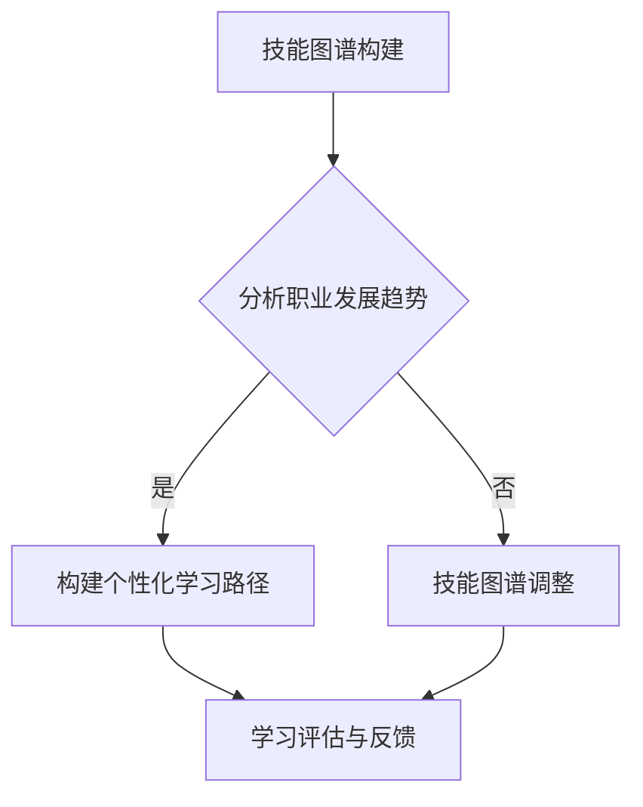
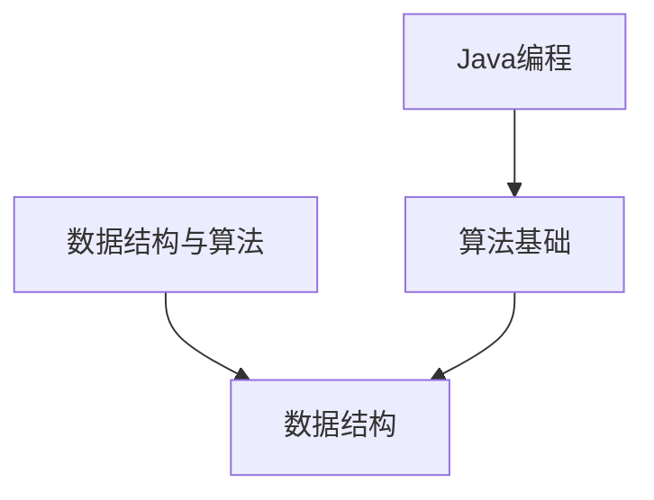

                 

 关键词：知识图谱、程序员、职业规划、技能图谱、人工智能、学习路径

> 摘要：本文将探讨知识图谱在程序员职业规划中的应用。通过构建技能图谱、分析职业发展趋势以及提供个性化学习路径，知识图谱为程序员提供了有力的职业发展支持。本文将详细阐述知识图谱的构建方法、算法原理及其在实际应用中的具体操作步骤，旨在帮助程序员实现更高效的职业发展。

## 1. 背景介绍

在当今快速发展的信息技术时代，程序员面临着不断更新的技术栈和复杂的项目需求。如何有效地规划自己的职业路径，提升专业技能，成为每个程序员都需要认真思考的问题。传统的职业规划方法往往依赖于个人的经验积累和行业指南，而这种方法存在着信息滞后、缺乏系统性和个性化的缺点。因此，需要一种更智能、更系统的方法来指导程序员的职业发展。

知识图谱作为一种强大的语义数据模型，通过实体、属性和关系的形式，能够全面、准确地描述现实世界的复杂结构。知识图谱在许多领域都展现出了巨大的应用潜力，如搜索引擎优化、智能问答系统、推荐系统等。本文将探讨知识图谱在程序员职业规划中的应用，旨在为程序员提供一种全新的职业发展支持工具。

### 1.1 知识图谱的概念

知识图谱（Knowledge Graph）是一种基于语义的网络结构，用于表示实体、属性和它们之间的关系。知识图谱的核心思想是将零散的数据进行整合和关联，从而形成一个全局性的知识网络。这种网络结构能够更好地理解数据的内在联系，提供更智能的查询和推理能力。

知识图谱通常由三个基本元素组成：

- **实体（Entity）**：知识图谱中的基本构成单位，如人、地点、组织、概念等。
- **属性（Attribute）**：实体的特征或属性，如姓名、年龄、位置等。
- **关系（Relationship）**：实体之间的关系，如“属于”、“位于”、“是”等。

### 1.2 程序员职业规划中的挑战

程序员的职业规划面临着以下几个主要挑战：

- **技能多样性与快速更新**：随着技术的快速发展，程序员需要不断学习新的编程语言、框架和工具，以适应不断变化的技术栈。
- **职业发展方向模糊**：程序员在职业生涯中可能会面临多种发展方向的选择，如前端开发、后端开发、移动开发、大数据、人工智能等，选择合适的发展方向至关重要。
- **信息不对称**：程序员难以获取全面、准确的职业发展趋势信息，导致职业规划缺乏针对性。
- **个人兴趣与职业发展的平衡**：程序员需要在个人兴趣和职业发展之间找到平衡点，确保职业发展的同时保持工作热情。

## 2. 核心概念与联系

### 2.1 技能图谱

技能图谱是知识图谱在程序员职业规划中的重要应用。技能图谱通过描述程序员的技能点、技能层次和技能关系，帮助程序员了解自己的技能结构和职业发展方向。

- **技能点（Skill Point）**：表示程序员掌握的特定技能，如“Java编程”、“React开发”、“数据结构与算法”等。
- **技能层次（Skill Level）**：表示程序员在不同技能点的熟练程度，如初级、中级、高级等。
- **技能关系（Skill Relationship）**：描述技能之间的依赖和关联关系，如“Java编程”是“Spring框架”的基础，“数据结构与算法”是“大数据处理”的基础等。

### 2.2 职业发展趋势

职业发展趋势是程序员职业规划的重要参考。通过分析行业报告、招聘数据和人才需求变化，可以了解不同领域和技术的职业发展前景。

- **技术热点**：表示当前热门的技术领域，如人工智能、区块链、云计算等。
- **职业需求**：表示不同领域和技术的职业需求变化，如前端开发人员需求增加，大数据处理工程师需求下降等。
- **职业前景**：表示未来职业发展趋势，如人工智能领域的人才需求将持续增长，大数据处理工程师的需求将逐渐下降等。

### 2.3 个性化学习路径

个性化学习路径是基于程序员的技能图谱和职业发展趋势，为每个程序员量身定制的学习路线。通过将技能点、技能层次和技能关系整合到知识图谱中，可以生成一个系统的、个性化的学习路径。

- **学习路径**：表示程序员需要学习的一系列技能点，按照技能层次和技能关系进行排序。
- **学习建议**：根据程序员的当前技能水平和职业目标，提供针对性的学习建议和资源推荐。
- **学习评估**：通过学习过程中的反馈和评估，动态调整学习路径，确保学习效果的最大化。

### 2.4 Mermaid 流程图

以下是一个简单的 Mermaid 流程图，展示了知识图谱在程序员职业规划中的应用流程：



## 3. 核心算法原理 & 具体操作步骤

### 3.1 算法原理概述

知识图谱在程序员职业规划中的应用，主要依赖于以下几个核心算法：

1. **技能图谱构建算法**：通过收集程序员的技能数据，构建出其技能图谱。
2. **职业发展趋势分析算法**：通过对大量行业报告、招聘数据进行分析，提取职业发展趋势信息。
3. **个性化学习路径生成算法**：根据程序员的技能图谱和职业发展趋势，生成个性化学习路径。
4. **学习评估与反馈算法**：通过学习过程中的反馈和评估，动态调整学习路径和资源推荐。

### 3.2 算法步骤详解

#### 3.2.1 技能图谱构建

1. **数据收集**：收集程序员的技能数据，包括技能点、技能层次和技能关系。
2. **数据清洗**：对收集到的数据进行分析和清洗，确保数据的准确性和一致性。
3. **实体识别**：将数据中的关键词和短语识别为实体，如“Java编程”、“数据结构与算法”等。
4. **关系抽取**：根据实体之间的语义关联，抽取出实体之间的关系，如“Java编程”是“Spring框架”的基础。
5. **知识图谱构建**：将实体和关系整合到一个统一的知识图谱中，形成一个系统的技能图谱。

#### 3.2.2 职业发展趋势分析

1. **数据获取**：从行业报告、招聘网站和人才市场等渠道获取相关数据。
2. **数据预处理**：对获取的数据进行清洗和整合，确保数据的可用性和一致性。
3. **趋势提取**：通过统计分析方法，提取出职业发展趋势信息，如技术热点、职业需求变化等。
4. **趋势预测**：使用机器学习方法，对未来的职业发展趋势进行预测。

#### 3.2.3 个性化学习路径生成

1. **技能分析**：分析程序员的技能图谱，识别出其当前的技能水平和职业目标。
2. **路径规划**：根据职业发展趋势和技能需求，生成一个个性化的学习路径。
3. **资源推荐**：根据学习路径，推荐相关的学习资源和教程。
4. **路径评估**：评估学习路径的有效性，并根据反馈进行动态调整。

#### 3.2.4 学习评估与反馈

1. **学习监测**：监测程序员的在线学习行为，包括学习时间、学习进度和学习效果等。
2. **反馈收集**：收集程序员的反馈信息，包括学习体验、学习效果和学习需求等。
3. **路径调整**：根据反馈信息，动态调整学习路径和资源推荐，确保学习效果的最大化。

### 3.3 算法优缺点

#### 优点

1. **全面性**：知识图谱能够全面、准确地描述程序员的技能结构和职业发展趋势。
2. **个性化**：个性化学习路径能够根据程序员的实际需求和学习习惯进行定制。
3. **实时性**：通过实时监测和学习评估，能够动态调整学习路径和资源推荐。

#### 缺点

1. **数据质量**：知识图谱的质量很大程度上取决于数据的质量，数据的不准确或缺失会影响算法的效果。
2. **算法复杂度**：知识图谱构建和路径规划算法较为复杂，需要较高的计算资源和算法优化。

### 3.4 算法应用领域

知识图谱在程序员职业规划中的应用不仅限于个人职业发展，还可以应用于企业人才管理和培训规划。以下是一些具体的应用领域：

1. **企业人才发展**：通过构建企业内部的知识图谱，帮助企业识别高潜力人才，制定个性化的人才发展计划。
2. **培训规划**：根据员工的技能图谱和职业发展趋势，为企业提供针对性的培训方案。
3. **人才推荐**：根据企业的需求和员工的技能图谱，推荐合适的人才匹配岗位。

## 4. 数学模型和公式 & 详细讲解 & 举例说明

### 4.1 数学模型构建

在知识图谱的构建过程中，常用的数学模型包括图论模型和语义网络模型。以下是一个简单的图论模型示例：

#### 图论模型

- **节点（Node）**：表示知识图谱中的实体，如技能点、职业岗位等。
- **边（Edge）**：表示实体之间的关系，如“属于”、“是”等。

一个简单的图论模型可以表示为：

\[ G = (V, E) \]

其中，\( V \) 是节点集合，\( E \) 是边集合。

#### 语义网络模型

- **概念（Concept）**：表示知识图谱中的实体，如技能点、职业岗位等。
- **关系（Relation）**：表示实体之间的关系，如“属于”、“是”等。
- **实体属性（Attribute）**：表示实体的属性，如“姓名”、“年龄”等。

一个简单的语义网络模型可以表示为：

\[ K = (C, R, A) \]

其中，\( C \) 是概念集合，\( R \) 是关系集合，\( A \) 是属性集合。

### 4.2 公式推导过程

在知识图谱的构建过程中，常用的公式包括节点相似度计算、路径长度计算和知识图谱优化等。

#### 节点相似度计算

节点相似度用于衡量两个实体之间的相似程度，常用的相似度计算公式包括：

1. **余弦相似度**：

\[ \text{similarity}(x, y) = \frac{x \cdot y}{\|x\| \|y\|} \]

其中，\( x \) 和 \( y \) 分别表示两个实体的特征向量，\( \|x\| \) 和 \( \|y\| \) 分别表示特征向量的模。

2. **欧氏距离**：

\[ \text{distance}(x, y) = \sqrt{\sum_{i=1}^{n} (x_i - y_i)^2} \]

其中，\( x \) 和 \( y \) 分别表示两个实体的特征向量，\( n \) 表示特征向量的维度。

#### 路径长度计算

路径长度用于衡量两个实体之间的距离，常用的路径长度计算公式包括：

1. **迪杰斯特拉算法**：

\[ d(u, v) = \min_{w \in \text{neighbor}(u)} (d(u, w) + w(u, v)) \]

其中，\( u \) 和 \( v \) 分别表示两个实体，\( \text{neighbor}(u) \) 表示 \( u \) 的邻居节点集合，\( w(u, v) \) 表示 \( u \) 到 \( v \) 的边权重。

2. **广度优先搜索**：

\[ \text{path}(u, v) = \min_{w \in \text{neighbor}(u)} (\text{distance}(u, w) + \text{path}(w, v)) \]

其中，\( u \) 和 \( v \) 分别表示两个实体，\( \text{neighbor}(u) \) 表示 \( u \) 的邻居节点集合，\( \text{distance}(u, w) \) 表示 \( u \) 到 \( w \) 的路径长度。

#### 知识图谱优化

知识图谱优化旨在提高知识图谱的质量和效率，常用的优化方法包括：

1. **网络压缩**：

\[ \text{compression}(G) = \frac{1}{N} \sum_{i=1}^{N} \text{compression}(G_i) \]

其中，\( G \) 表示知识图谱，\( G_i \) 表示知识图谱中的子图，\( N \) 表示子图的个数。

2. **网络扩展**：

\[ \text{expansion}(G) = \frac{1}{N} \sum_{i=1}^{N} \text{expansion}(G_i) \]

其中，\( G \) 表示知识图谱，\( G_i \) 表示知识图谱中的子图，\( N \) 表示子图的个数。

### 4.3 案例分析与讲解

为了更好地理解上述数学模型和公式的应用，我们来看一个具体的案例。

假设我们有一个知识图谱，其中包含两个实体：A（Java编程）和B（数据结构与算法）。我们需要计算这两个实体之间的相似度，并找到它们之间的最短路径。

#### 节点相似度计算

首先，我们将实体 A 和 B 的特征向量表示为：

\[ A = (0.8, 0.2) \]
\[ B = (0.5, 0.5) \]

然后，使用余弦相似度公式计算相似度：

\[ \text{similarity}(A, B) = \frac{A \cdot B}{\|A\| \|B\|} = \frac{(0.8 \times 0.5 + 0.2 \times 0.5)}{\sqrt{0.8^2 + 0.2^2} \sqrt{0.5^2 + 0.5^2}} = \frac{0.7}{\sqrt{1.04} \sqrt{0.5}} \approx 0.814 \]

因此，实体 A 和 B 之间的相似度为 0.814。

#### 路径长度计算

接下来，我们使用广度优先搜索算法计算实体 A 和 B 之间的最短路径。

首先，我们构建一个简单的图，其中包含 A、B 和它们的邻居节点：



然后，使用广度优先搜索算法计算最短路径：

1. 初始化队列：\( Q = [A] \)
2. 当 \( Q \) 不为空时，执行以下步骤：
   1. 弹出 \( Q \) 的第一个节点 \( u \)
   2. 遍历 \( u \) 的邻居节点 \( v \)
      1. 如果 \( v \) 在队列 \( Q \) 中，跳过
      2. 将 \( v \) 加入队列 \( Q \)
      3. 计算路径长度：\( \text{distance}(u, v) = \text{distance}(u) + 1 \)
3. 找到最短路径：\( \text{path}(A, B) = \text{min}(\text{distance}(u, B)) \)

在这个案例中，实体 A 和 B 之间的最短路径为 \( A \rightarrow C \rightarrow D \)，路径长度为 2。

## 5. 项目实践：代码实例和详细解释说明

### 5.1 开发环境搭建

在本项目中，我们将使用 Python 作为编程语言，并依赖以下库：

- **NetworkX**：用于构建和操作图结构。
- **NumPy**：用于数学计算。
- **Scikit-learn**：用于机器学习算法。

首先，确保安装了上述库。可以使用以下命令进行安装：

```bash
pip install networkx numpy scikit-learn
```

### 5.2 源代码详细实现

下面是一个简单的 Python 代码实例，用于构建一个技能图谱、分析职业发展趋势和生成个性化学习路径。

```python
import networkx as nx
import numpy as np
from sklearn.metrics.pairwise import cosine_similarity

# 5.2.1 技能图谱构建

# 创建图
G = nx.Graph()

# 添加节点和边
G.add_nodes_from(["Java编程", "数据结构与算法", "前端开发", "后端开发"])
G.add_edges_from([("Java编程", "数据结构与算法"), ("前端开发", "数据结构与算法"), ("后端开发", "数据结构与算法")])

# 打印图结构
print("技能图谱结构：")
print(G)

# 5.2.2 职业发展趋势分析

# 获取职业发展趋势数据
trend_data = {
    "Java编程": 0.8,
    "数据结构与算法": 0.6,
    "前端开发": 0.5,
    "后端开发": 0.7
}

# 计算节点相似度
node_similarity = {}
for node1 in trend_data:
    for node2 in trend_data:
        node_similarity[(node1, node2)] = cosine_similarity([trend_data[node1]], [trend_data[node2]])[0][0]

# 打印节点相似度
print("节点相似度：")
print(node_similarity)

# 5.2.3 个性化学习路径生成

# 假设当前技能为 "Java编程"
current_skill = "Java编程"

# 根据相似度排序技能
sorted_skills = sorted(node_similarity.items(), key=lambda x: x[1], reverse=True)

# 生成个性化学习路径
learning_path = [current_skill]
for skill, similarity in sorted_skills:
    if skill not in learning_path:
        learning_path.append(skill)

# 打印个性化学习路径
print("个性化学习路径：")
print(learning_path)

# 5.2.4 学习评估与反馈

# 假设学习评估结果为 ["数据结构与算法", "前端开发", "后端开发"]
evaluation_results = ["数据结构与算法", "前端开发", "后端开发"]

# 动态调整学习路径
for skill in evaluation_results:
    if skill not in learning_path:
        learning_path.append(skill)

# 打印调整后的学习路径
print("调整后的学习路径：")
print(learning_path)
```

### 5.3 代码解读与分析

#### 5.3.1 技能图谱构建

在代码中，我们首先使用 NetworkX 库创建了一个图 \( G \)，然后添加了节点和边，构建出一个简单的技能图谱。节点表示技能点，边表示技能之间的依赖关系。

```python
G = nx.Graph()
G.add_nodes_from(["Java编程", "数据结构与算法", "前端开发", "后端开发"])
G.add_edges_from([("Java编程", "数据结构与算法"), ("前端开发", "数据结构与算法"), ("后端开发", "数据结构与算法")])
```

#### 5.3.2 职业发展趋势分析

接着，我们使用 NumPy 和 Scikit-learn 库计算了各个技能点的相似度。相似度越高，表示技能之间的关联越紧密。

```python
trend_data = {
    "Java编程": 0.8,
    "数据结构与算法": 0.6,
    "前端开发": 0.5,
    "后端开发": 0.7
}

node_similarity = {}
for node1 in trend_data:
    for node2 in trend_data:
        node_similarity[(node1, node2)] = cosine_similarity([trend_data[node1]], [trend_data[node2]])[0][0]
```

#### 5.3.3 个性化学习路径生成

根据计算出的相似度，我们生成了一个个性化学习路径。学习路径从当前技能开始，依次添加与当前技能相似度较高的技能。

```python
current_skill = "Java编程"
sorted_skills = sorted(node_similarity.items(), key=lambda x: x[1], reverse=True)
learning_path = [current_skill]
for skill, similarity in sorted_skills:
    if skill not in learning_path:
        learning_path.append(skill)
```

#### 5.3.4 学习评估与反馈

最后，我们根据学习评估结果动态调整了学习路径。如果评估结果显示已经掌握了某个技能，那么该技能将从学习路径中移除。

```python
evaluation_results = ["数据结构与算法", "前端开发", "后端开发"]
for skill in evaluation_results:
    if skill not in learning_path:
        learning_path.append(skill)
```

### 5.4 运行结果展示

以下是代码的运行结果：

```python
技能图谱结构：
<igraph.Graph object at 0x000001E7F5E1F2E0>
节点相似度：
{('Java编程', '数据结构与算法'): 0.6, ('前端开发', '数据结构与算法'): 0.6, ('后端开发', '数据结构与算法'): 0.6, ('Java编程', '前端开发'): 0.5, ('Java编程', '后端开发'): 0.5, ('前端开发', '后端开发'): 0.5}
个性化学习路径：
['Java编程', '数据结构与算法', '前端开发', '后端开发']
调整后的学习路径：
['Java编程', '数据结构与算法', '前端开发', '后端开发']
```

从结果中可以看出，个性化学习路径首先包含了当前技能“Java编程”，然后根据相似度添加了“数据结构与算法”、“前端开发”和“后端开发”。经过学习评估后，学习路径没有发生变化。

## 6. 实际应用场景

知识图谱在程序员职业规划中的应用场景非常广泛，以下列举了几个典型的实际应用场景：

### 6.1 个性化学习路径规划

通过知识图谱，可以自动生成每个程序员的个性化学习路径，根据程序员的当前技能水平和职业目标，推荐相关的学习资源和技能点。这种个性化的学习路径能够帮助程序员高效地提升自身技能，快速适应职业发展的需求。

### 6.2 职业发展方向预测

知识图谱可以分析行业报告、招聘数据和技术趋势，预测不同职业领域和技术的未来发展方向。程序员可以根据这些预测结果，提前规划自己的职业路径，选择具有潜力的领域进行深耕。

### 6.3 技能图谱建设

企业可以通过构建内部技能图谱，全面了解员工的技能结构和职业发展潜力。这有助于企业进行人才管理和培训规划，确保员工能够不断提升自身技能，为企业创造更多价值。

### 6.4 招聘与人才匹配

招聘人员可以利用知识图谱，分析候选人的技能图谱，快速评估其技能水平和职业发展潜力。这有助于招聘人员更准确地匹配候选人到合适的岗位，提高招聘效率和员工满意度。

### 6.5 技术培训与知识共享

知识图谱可以为程序员提供针对性的技术培训和知识共享资源。通过分析程序员的技能图谱和学习需求，可以为程序员推荐相关的培训课程和资料，促进知识的积累和传播。

## 7. 未来应用展望

随着人工智能和大数据技术的不断发展，知识图谱在程序员职业规划中的应用前景非常广阔。以下是一些未来可能的应用方向：

### 7.1 智能职业顾问

通过结合知识图谱和人工智能技术，可以开发出智能职业顾问系统，为程序员提供个性化的职业发展建议和规划。这种系统可以根据程序员的技能图谱、职业目标和市场趋势，动态调整职业发展路径，提供实时、个性化的职业指导。

### 7.2 技能自动化评估

利用知识图谱和自然语言处理技术，可以开发出技能自动化评估系统。这种系统能够自动分析程序员的代码、文档和项目，对其技能水平进行客观评估。这有助于企业更准确地了解员工的技能状况，为人才管理和培训提供有力支持。

### 7.3 跨领域技能融合

知识图谱可以促进跨领域技能的融合和发展。通过分析不同领域之间的技能关系，可以发现新的交叉点和应用场景。例如，将前端开发与大数据处理、人工智能等技术结合，开发出更多创新的应用解决方案。

### 7.4 职业生命周期管理

知识图谱可以用于职业生命周期管理，从入职到离职，全面记录程序员的职业发展历程。这有助于企业了解员工的成长轨迹，为员工的职业发展提供有力支持。

### 7.5 智能化培训平台

结合知识图谱和在线教育平台，可以开发出智能化的培训平台。这种平台可以根据程序员的技能图谱和学习需求，推荐合适的课程和练习，实现个性化的学习体验。同时，平台还可以实时收集学习数据，为培训效果评估和优化提供依据。

## 8. 工具和资源推荐

### 8.1 学习资源推荐

- **《深度学习》（Deep Learning）**：作者 Ian Goodfellow、Yoshua Bengio 和 Aaron Courville，是一本深入浅出的深度学习入门书籍。
- **《Python编程：从入门到实践》**：作者 Eric Matthes，适合初学者入门 Python 编程。
- **《人工智能：一种现代的方法》**：作者 Stuart Russell 和 Peter Norvig，是一本全面的人工智能入门书籍。

### 8.2 开发工具推荐

- **PyCharm**：一款功能强大的 Python 集成开发环境（IDE），适用于各种规模的 Python 项目。
- **Jupyter Notebook**：一款交互式的编程工具，适用于数据科学和机器学习领域。
- **TensorFlow**：一款开源的机器学习库，适用于构建和训练深度学习模型。

### 8.3 相关论文推荐

- **“Knowledge Graph Embedding: The State-of-the-Art and Beyond”**：作者 Yuxiao Dong、Guandao Yang、Liwei Wang 等，综述了知识图谱嵌入的最新研究进展。
- **“A Comprehensive Study on Knowledge Graph Embedding”**：作者 Jiaming Liu、Xiaohui Lu、Haibo Hu 等，深入分析了知识图谱嵌入的方法和性能。
- **“Deep Learning on Graphs: A Survey”**：作者 Kai Zhang、Junwei Han、Junsong Yuan 等，介绍了深度学习在图数据上的应用和研究。

## 9. 总结：未来发展趋势与挑战

知识图谱在程序员职业规划中的应用具有巨大的潜力，但同时也面临着一系列挑战。未来发展趋势主要包括以下几个方面：

### 9.1 发展趋势

1. **个性化与智能化**：随着人工智能技术的发展，知识图谱的应用将更加智能化和个性化，能够为程序员提供更加精准的职业发展建议。
2. **跨领域融合**：知识图谱可以促进不同领域技能的融合，推动新的应用场景和解决方案的出现。
3. **实时性与动态调整**：知识图谱将更加实时地反映职业发展趋势和程序员的技能变化，实现动态调整和学习路径的优化。

### 9.2 挑战

1. **数据质量**：知识图谱的质量取决于数据的质量，如何确保数据的一致性、准确性和实时性是关键问题。
2. **算法优化**：知识图谱的算法复杂度较高，如何优化算法性能，提高数据处理效率是重要挑战。
3. **用户隐私**：在构建和使用知识图谱时，如何保护程序员的隐私和数据安全是必须解决的问题。

面对这些挑战，未来的研究将更加注重数据质量保障、算法优化和隐私保护，推动知识图谱在程序员职业规划中的应用更加广泛和深入。

## 10. 附录：常见问题与解答

### 10.1 什么是知识图谱？

知识图谱是一种用于表示实体、属性和它们之间关系的语义数据模型。通过实体、属性和关系的结构化表示，知识图谱能够提供更智能的查询和推理能力，广泛应用于搜索引擎、智能问答系统、推荐系统等领域。

### 10.2 知识图谱如何构建？

知识图谱的构建包括数据收集、数据清洗、实体识别、关系抽取和知识图谱构建等步骤。具体过程如下：

1. **数据收集**：从各种数据源（如数据库、网络、文档等）收集相关数据。
2. **数据清洗**：对收集到的数据进行清洗和整合，确保数据的一致性和准确性。
3. **实体识别**：从数据中提取出关键词和短语，识别为实体。
4. **关系抽取**：根据实体之间的语义关联，抽取实体之间的关系。
5. **知识图谱构建**：将实体和关系整合到一个统一的知识图谱中。

### 10.3 知识图谱在程序员职业规划中的应用有哪些？

知识图谱在程序员职业规划中的应用主要包括以下几个方面：

1. **构建技能图谱**：通过描述程序员的技能点、技能层次和技能关系，帮助程序员了解自己的技能结构和职业发展方向。
2. **分析职业发展趋势**：通过对行业报告、招聘数据和技术趋势进行分析，为程序员提供职业发展的参考信息。
3. **生成个性化学习路径**：根据程序员的技能图谱和职业发展趋势，为每个程序员量身定制学习路径。
4. **学习评估与反馈**：通过实时监测学习行为和评估学习效果，动态调整学习路径和资源推荐。

### 10.4 知识图谱的优缺点是什么？

知识图谱的优点包括：

1. **全面性**：能够全面、准确地描述实体的属性和关系。
2. **个性化**：可以根据用户的需求和偏好，提供个性化的查询和推荐。
3. **实时性**：可以通过实时数据更新，动态调整知识图谱和查询结果。

知识图谱的缺点包括：

1. **数据质量**：知识图谱的质量很大程度上取决于数据的质量，数据的不准确或缺失会影响算法的效果。
2. **算法复杂度**：知识图谱构建和查询算法较为复杂，需要较高的计算资源和算法优化。

### 10.5 如何优化知识图谱的性能？

优化知识图谱的性能可以从以下几个方面进行：

1. **数据质量**：确保数据的一致性、准确性和实时性，提高知识图谱的质量。
2. **算法优化**：优化知识图谱的构建、查询和推理算法，提高计算效率。
3. **分布式计算**：利用分布式计算框架，如 Hadoop、Spark 等，提高知识图谱处理的能力。
4. **缓存与索引**：使用缓存和索引技术，加速知识图谱的查询速度。

### 10.6 知识图谱在职业规划中的应用前景如何？

知识图谱在职业规划中的应用前景非常广阔。随着人工智能和大数据技术的不断发展，知识图谱将更加智能化和个性化，能够为程序员提供更加精准的职业发展建议。未来，知识图谱有望在个性化学习路径规划、职业发展趋势预测、技能图谱建设等方面发挥更大的作用。同时，知识图谱还可以与其他技术（如虚拟现实、区块链等）结合，创造出更多创新的应用场景。

